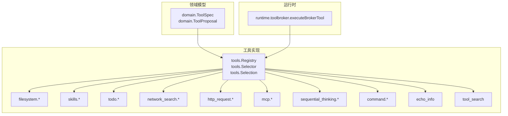
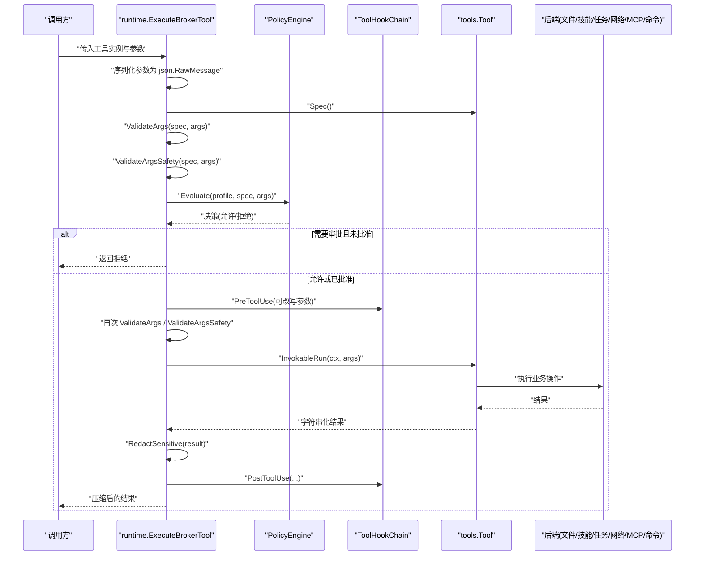
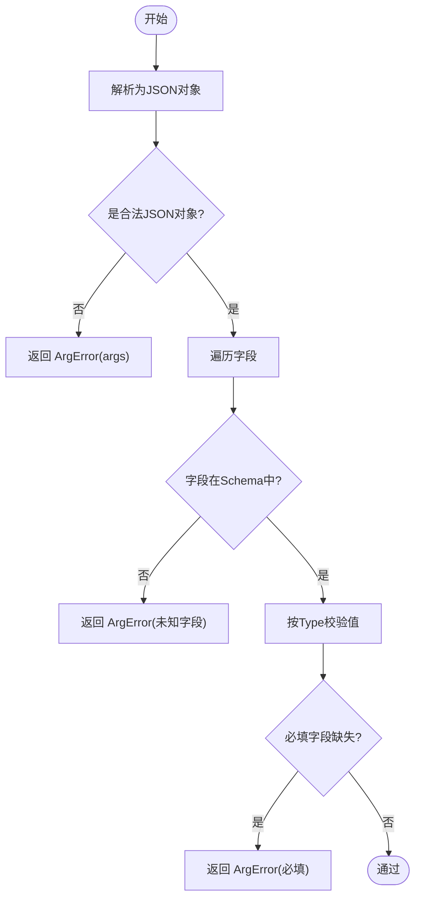
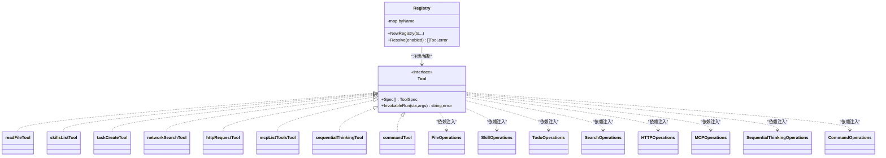
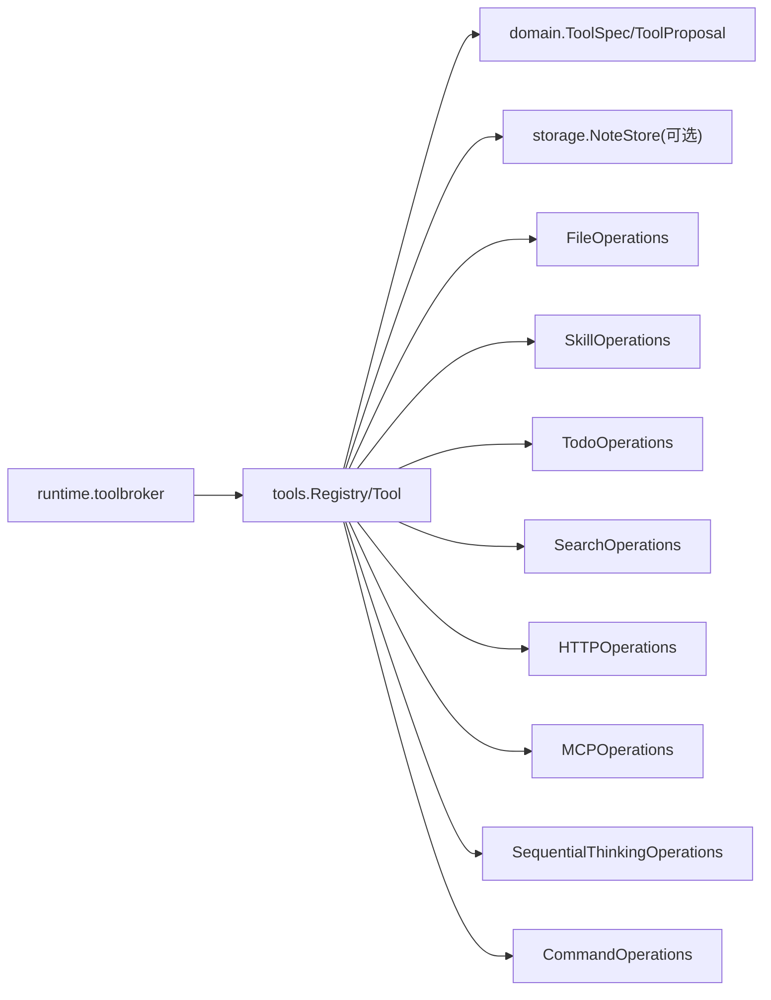

# 工具注册机制

<cite>
**本文引用的文件**
- [internal/tools/tools.go](file://internal/tools/tools.go)
- [internal/domain/tool.go](file://internal/domain/tool.go)
- [internal/runtime/toolbroker.go](file://internal/runtime/toolbroker.go)
- [internal/tools/filesystem.go](file://internal/tools/filesystem.go)
- [internal/tools/skills.go](file://internal/tools/skills.go)
- [internal/tools/todo.go](file://internal/tools/todo.go)
- [internal/tools/network_search.go](file://internal/tools/network_search.go)
- [internal/tools/http_request.go](file://internal/tools/http_request.go)
- [internal/tools/mcp.go](file://internal/tools/mcp.go)
- [internal/tools/sequential_thinking.go](file://internal/tools/sequential_thinking.go)
- [internal/tools/command.go](file://internal/tools/command.go)
- [internal/tools/toolsearch.go](file://internal/tools/toolsearch.go)
- [internal/tools/echo.go](file://internal/tools/echo.go)
- [internal/tools/context.go](file://internal/tools/context.go)
</cite>

## 目录
1. [简介](#简介)
2. [项目结构](#项目结构)
3. [核心组件](#核心组件)
4. [架构总览](#架构总览)
5. [详细组件分析](#详细组件分析)
6. [依赖关系分析](#依赖关系分析)
7. [性能考虑](#性能考虑)
8. [故障排查指南](#故障排查指南)
9. [结论](#结论)
10. [附录：自定义工具开发指南与最佳实践](#附录：自定义工具开发指南与最佳实践)

## 简介
本文件系统性说明 Agent-Vivy 的工具注册机制，覆盖 Tool 接口、Spec 结构体、工具发现与注册流程、Registry 实现原理（名称映射、重复检测、依赖注入）、内置工具构建函数链（从 BuiltinWithFileOps 到 BuiltinWithCommands），以及参数验证、ArgError 处理与 Schema 校验规则。同时提供自定义工具开发与集成的最佳实践，帮助扩展文件系统、技能、任务、网络搜索、HTTP 请求、MCP、顺序思考、命令执行等工具族。

## 项目结构
工具系统位于 internal/tools 包中，定义统一的 Tool 接口与 Spec 描述；通过 Registry 集中注册并暴露能力；运行时在 internal/runtime 中完成策略评估、钩子、安全与结果脱敏后的调用；domain 层提供跨模块共享的模型（如 ToolSpec、ToolProposal）。

图表来源
- [internal/tools/tools.go:223-361](file://internal/tools/tools.go#L223-L361)
- [internal/runtime/toolbroker.go:15-92](file://internal/runtime/toolbroker.go#L15-L92)
- [internal/domain/tool.go:27-61](file://internal/domain/tool.go#L27-L61)

章节来源
- [internal/tools/tools.go:223-361](file://internal/tools/tools.go#L223-L361)
- [internal/runtime/toolbroker.go:15-92](file://internal/runtime/toolbroker.go#L15-L92)
- [internal/domain/tool.go:27-61](file://internal/domain/tool.go#L27-L61)

## 核心组件
- Tool 接口：统一声明 Spec() 与 InvokableRun(ctx, args)，所有工具必须实现该接口。
- Spec 结构体：描述工具名称、描述、是否只读、参数 Schema、路由关键词、交互类型。
- ArgError：结构化参数校验错误，便于在事件负载中安全上报。
- Selection/Selector：基于关键词的请求级工具选择器，保证确定性路由。
- Registry：名称到实现的映射，支持重复检测与按配置启用解析。
- 构建函数链：BuiltinWithFileOps → BuiltinWithCapabilities → BuiltinWithTodo → BuiltinWithSearch → BuiltinWithHTTP → BuiltinWithMCP → BuiltinWithSequential → BuiltinWithCommands，逐步装配各工具族。

章节来源
- [internal/tools/tools.go:17-84](file://internal/tools/tools.go#L17-L84)
- [internal/tools/tools.go:122-217](file://internal/tools/tools.go#L122-L217)
- [internal/tools/tools.go:223-361](file://internal/tools/tools.go#L223-L361)
- [internal/domain/tool.go:27-61](file://internal/domain/tool.go#L27-L61)

## 架构总览
工具调用从运行时进入，经过策略评估、钩子改写、再次校验后，调用具体工具的 InvokableRun，并对结果进行脱敏与压缩。

图表来源
- [internal/runtime/toolbroker.go:15-92](file://internal/runtime/toolbroker.go#L15-L92)
- [internal/tools/tools.go:41-84](file://internal/tools/tools.go#L41-L84)

章节来源
- [internal/runtime/toolbroker.go:15-92](file://internal/runtime/toolbroker.go#L15-L92)
- [internal/tools/tools.go:41-84](file://internal/tools/tools.go#L41-L84)

## 详细组件分析

### Tool 接口与 Spec 设计
- Tool 接口要求每个工具提供元数据与可调用入口，确保运行时以统一方式管理。
- Spec 中的 Readonly 标记决定是否需要审批；Params 声明参数 Schema，用于向模型发布与前端展示；Keywords 用于请求级路由选择；Interaction 标识交互式工具（如提问）。

章节来源
- [internal/tools/tools.go:17-32](file://internal/tools/tools.go#L17-L32)
- [internal/domain/tool.go:27-61](file://internal/domain/tool.go#L27-L61)

### 参数验证与 Schema 校验
- ValidateArgs 对 JSON 对象形状、字段存在性、必填项、类型进行严格校验，非法参数返回 ArgError。
- validateParamJSON 支持 string、integer、number、boolean、object、array 等类型校验。
- 工具内部可使用 decodeStringArgs 等辅助方法做更严格的字段白名单解码。

图表来源
- [internal/tools/tools.go:41-84](file://internal/tools/tools.go#L41-L84)
- [internal/tools/tools.go:86-120](file://internal/tools/tools.go#L86-L120)

章节来源
- [internal/tools/tools.go:41-120](file://internal/tools/tools.go#L41-L120)

### 工具发现与选择（Selection/Selector）
- Selector 基于请求文本分词与工具 Spec.Keywords 匹配，计算得分并返回最高分的工具集合，保证确定性。
- Selection 保留工具与 Spec 列表，Names() 可用于上下文传播。

章节来源
- [internal/tools/tools.go:122-217](file://internal/tools/tools.go#L122-L217)

### Registry 实现原理
- 名称映射：byName 将工具名映射到实现，Resolve 可按配置启用列表解析出工具序列。
- 重复检测：NewRegistry 遇到重复名称直接 panic，避免歧义。
- 依赖注入：通过构造参数注入 FileOperations、SkillOperations、TodoOperations、SearchOperations、HTTPOperations、MCPOperations、SequentialThinkingOperations、CommandOperations，使工具与具体实现解耦。
- 工具搜索：tool_search 工具维护受限目录的索引，支持 select:name 精确选择与关键词检索。

图表来源
- [internal/tools/tools.go:223-361](file://internal/tools/tools.go#L223-L361)
- [internal/tools/filesystem.go:82-104](file://internal/tools/filesystem.go#L82-L104)
- [internal/tools/skills.go:56-70](file://internal/tools/skills.go#L56-L70)
- [internal/tools/todo.go:19-34](file://internal/tools/todo.go#L19-L34)
- [internal/tools/network_search.go:36-42](file://internal/tools/network_search.go#L36-L42)
- [internal/tools/http_request.go:29-35](file://internal/tools/http_request.go#L29-L35)
- [internal/tools/mcp.go:50-63](file://internal/tools/mcp.go#L50-L63)
- [internal/tools/sequential_thinking.go:35-43](file://internal/tools/sequential_thinking.go#L35-L43)
- [internal/tools/command.go:38-52](file://internal/tools/command.go#L38-L52)

章节来源
- [internal/tools/tools.go:223-361](file://internal/tools/tools.go#L223-L361)

### 内置工具构建函数链
- BuiltinWithFileOps：基础能力（回显、笔记、文件读写/搜索/补丁）。
- BuiltinWithCapabilities：加入技能家族（列出、查看、管理）。
- BuiltinWithTodo：加入持久化任务家族（创建、获取、更新、列表）。
- BuiltinWithSearch：加入网络搜索工具。
- BuiltinWithHTTP：加入只读 HTTP 请求工具。
- BuiltinWithMCP：加入 MCP 工具目录与调用。
- BuiltinWithSequential：加入本地顺序思考工具。
- BuiltinWithCommands：加入命令执行工具（execute、commandline），并附加 tool_search。

图表来源
- [internal/tools/tools.go:243-317](file://internal/tools/tools.go#L243-L317)

章节来源
- [internal/tools/tools.go:243-317](file://internal/tools/tools.go#L243-L317)

### 各工具族实现要点
- 文件系统（read_file/search_files/write_file/patch）：通过 FileOperations 抽象文件系统后端，写/补丁类工具实现 PrepareProposal 以生成审批预览。
- 技能（skills_list/skill_view/skill_manage）：通过 SkillOperations 抽象技能后端，管理动作需审批。
- 任务（task_create/task_get/task_update/task_list）：通过 TodoOperations 抽象任务存储，更新时维护依赖与状态不变式。
- 网络搜索（network_search）：通过 SearchOperations 抽象外部搜索 API，结果标记为不可信数据。
- HTTP 请求（http_request）：通过 HTTPOperations 限制方法与域名白名单，结果标记为不可信数据。
- MCP（mcp_list_tools/mcp_call）：通过 MCPOperations 抽象远程工具目录与调用，调用始终需要审批。
- 顺序思考（sequential_thinking）：记录推理步骤、修订与分支，无外部副作用。
- 命令执行（execute/commandline）：通过 CommandOperations 执行受控进程，支持命令行展开与安全检查，始终需要审批。

章节来源
- [internal/tools/filesystem.go:106-300](file://internal/tools/filesystem.go#L106-L300)
- [internal/tools/skills.go:72-168](file://internal/tools/skills.go#L72-L168)
- [internal/tools/todo.go:36-168](file://internal/tools/todo.go#L36-L168)
- [internal/tools/network_search.go:44-75](file://internal/tools/network_search.go#L44-L75)
- [internal/tools/http_request.go:37-71](file://internal/tools/http_request.go#L37-L71)
- [internal/tools/mcp.go:64-113](file://internal/tools/mcp.go#L64-L113)
- [internal/tools/sequential_thinking.go:44-81](file://internal/tools/sequential_thinking.go#L44-L81)
- [internal/tools/command.go:54-96](file://internal/tools/command.go#L54-L96)

### 工具搜索（tool_search）
- 维护受限目录的索引，支持 select:name 精确选择与关键词检索，限制最大结果数，具备缓存。
- 可通过 Registry.Resolve 的 enabled 列表限制可见范围。

章节来源
- [internal/tools/toolsearch.go:30-176](file://internal/tools/toolsearch.go#L30-L176)
- [internal/tools/tools.go:343-361](file://internal/tools/tools.go#L343-L361)

### 运行期调用与审批流
- runtime.ExecuteBrokerTool 负责参数编组、Schema 校验、策略评估、钩子改写与再校验、执行工具、结果脱敏与后置钩子。
- 对于 effectful 工具，PrepareProposal 由后端生成预览与风险发现，供人类审批。

章节来源
- [internal/runtime/toolbroker.go:15-92](file://internal/runtime/toolbroker.go#L15-L92)
- [internal/tools/filesystem.go:231-300](file://internal/tools/filesystem.go#L231-L300)
- [internal/tools/mcp.go:103-113](file://internal/tools/mcp.go#L103-L113)
- [internal/tools/command.go:82-96](file://internal/tools/command.go#L82-L96)

## 依赖关系分析
- 工具与后端通过接口解耦，便于替换实现与测试。
- 运行时仅依赖 tools 与 domain，不感知具体工具实现细节。
- 工具之间无循环依赖，均依赖 domain 与 storage（部分工具）。

图表来源
- [internal/runtime/toolbroker.go:15-92](file://internal/runtime/toolbroker.go#L15-L92)
- [internal/tools/tools.go:223-361](file://internal/tools/tools.go#L223-L361)
- [internal/domain/tool.go:27-61](file://internal/domain/tool.go#L27-L61)

章节来源
- [internal/runtime/toolbroker.go:15-92](file://internal/runtime/toolbroker.go#L15-L92)
- [internal/tools/tools.go:223-361](file://internal/tools/tools.go#L223-L361)
- [internal/domain/tool.go:27-61](file://internal/domain/tool.go#L27-L61)

## 性能考虑
- 工具选择基于关键词打分，时间复杂度 O(n) 与请求长度相关，适合轻量快速路由。
- tool_search 使用内存缓存与互斥锁保护，减少重复计算。
- 结果输出经 RedactSensitive 与压缩，控制传输体积。
- 建议合理设置 max_results、max_bytes 等限制，避免大结果集影响性能。

[本节为通用指导，不直接分析具体文件]

## 故障排查指南
- 参数校验失败：检查 Spec.Params 与传入 JSON 字段是否一致，关注 ArgError 的 Field 与 Reason。
- 后端未注入：若出现“backend not wired”错误，确认构建函数链是否正确注入对应 Operations。
- 策略拒绝：检查 PolicyEngine 评估结果与钩子改写是否导致拒绝。
- 重复注册：NewRegistry 遇到重复名称会 panic，请确保工具名唯一。
- 浏览器自动化工具被禁用：Resolve 会拒绝特定名称的工具，避免不安全能力。

章节来源
- [internal/tools/tools.go:41-84](file://internal/tools/tools.go#L41-L84)
- [internal/tools/filesystem.go:141-148](file://internal/tools/filesystem.go#L141-L148)
- [internal/tools/skills.go:77-85](file://internal/tools/skills.go#L77-L85)
- [internal/tools/todo.go:59-67](file://internal/tools/todo.go#L59-L67)
- [internal/tools/network_search.go:67-73](file://internal/tools/network_search.go#L67-L73)
- [internal/tools/http_request.go:63-70](file://internal/tools/http_request.go#L63-L70)
- [internal/tools/mcp.go:75-82](file://internal/tools/mcp.go#L75-L82)
- [internal/tools/sequential_thinking.go:73-80](file://internal/tools/sequential_thinking.go#L73-L80)
- [internal/tools/command.go:72-79](file://internal/tools/command.go#L72-L79)
- [internal/tools/tools.go:229-240](file://internal/tools/tools.go#L229-L240)
- [internal/tools/tools.go:345-361](file://internal/tools/tools.go#L345-L361)

## 结论
Vivy 的工具注册机制通过统一接口、清晰的 Spec 描述、严格的参数校验与审批流程，实现了可扩展、可审计、安全的工具生态。Registry 的名称映射与依赖注入模式使得工具与后端解耦，构建函数链提供了渐进式装配能力。运行时在策略、钩子与安全层面保障了工具调用的可控性与可观测性。

[本节为总结性内容，不直接分析具体文件]

## 附录：自定义工具开发指南与最佳实践
- 实现 Tool 接口：提供 Spec() 与 InvokableRun(ctx, args)。
- 定义 Spec：
  - Name/Description：清晰命名与描述。
  - Readonly：只读工具自动执行，修改型工具需实现 ProposalProvider。
  - Params：声明参数 Schema（Type/Enum/Required），便于校验与展示。
  - Keywords：提供路由关键词，提升选择准确性。
- 参数校验：
  - 优先使用 ValidateArgs 进行 Schema 校验。
  - 工具内部可使用 decodeStringArgs 进行严格字段白名单解码。
  - 返回 ArgError 而非 panic，确保错误可序列化与可审计。
- 依赖注入：
  - 通过构造函数注入 Operations 接口，保持工具与后端解耦。
  - 在 InvokableRun 中检查 ops 是否为 nil，避免误用。
- 审批与预览：
  - 对 effectful 工具实现 PrepareProposal，生成 Action/Target/Preview/RiskFindings/Data。
  - 利用 ProposalDataFromContext 与 ProposalPreconditionFromContext 在恢复调用时保持一致性。
- 安全与合规：
  - 避免泄露敏感信息，使用 RedactSensitive 处理结果。
  - 遵循策略评估与钩子改写，必要时重新校验参数。
- 集成与注册：
  - 通过构建函数链将新工具加入 Registry。
  - 如需搜索能力，确保工具被纳入 baseToolsForSearch。
- 测试建议：
  - 针对参数校验、审批流程、后端注入、结果脱敏编写单测。
  - 模拟后端返回异常与边界条件，验证错误路径。

章节来源
- [internal/tools/tools.go:17-84](file://internal/tools/tools.go#L17-L84)
- [internal/tools/tools.go:223-361](file://internal/tools/tools.go#L223-L361)
- [internal/tools/context.go:14-73](file://internal/tools/context.go#L14-L73)
- [internal/runtime/toolbroker.go:15-92](file://internal/runtime/toolbroker.go#L15-L92)
- [internal/tools/filesystem.go:231-300](file://internal/tools/filesystem.go#L231-L300)
- [internal/tools/mcp.go:103-113](file://internal/tools/mcp.go#L103-L113)
- [internal/tools/command.go:82-96](file://internal/tools/command.go#L82-L96)