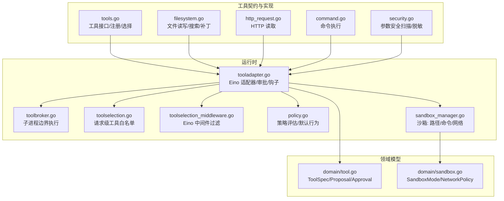
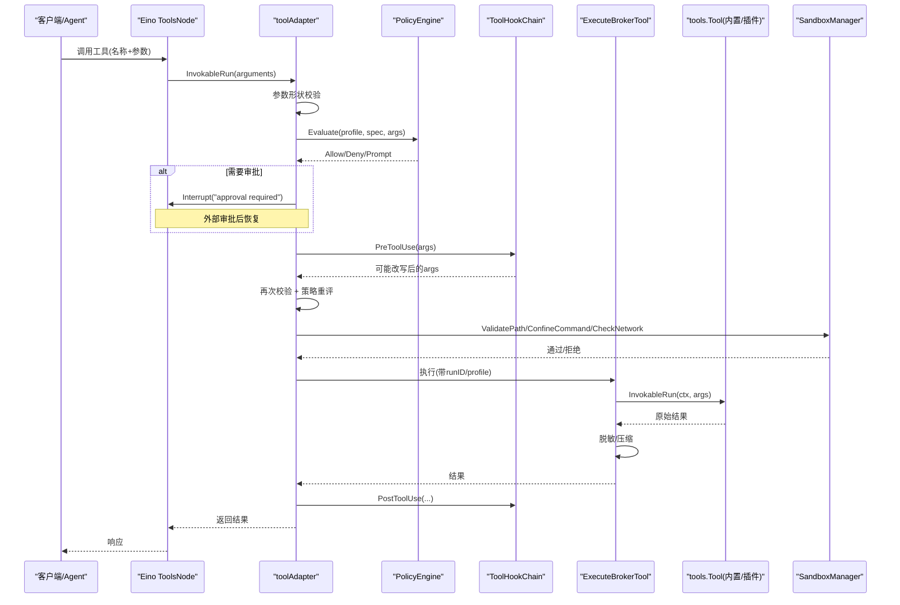
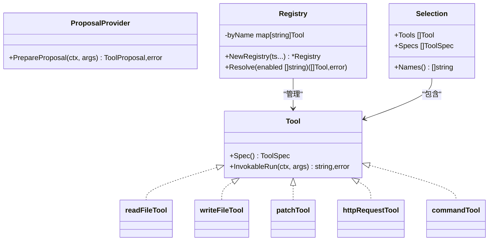
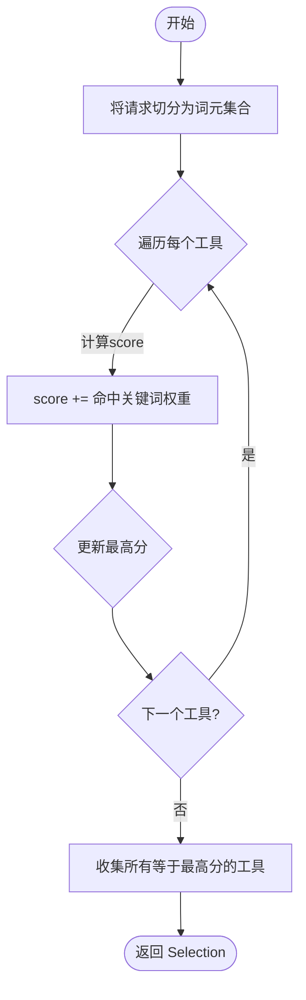
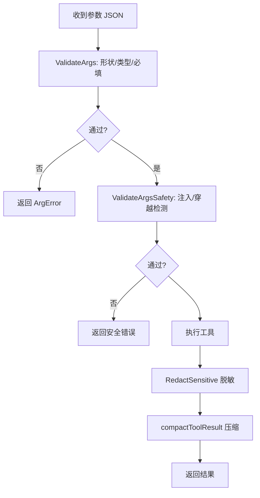
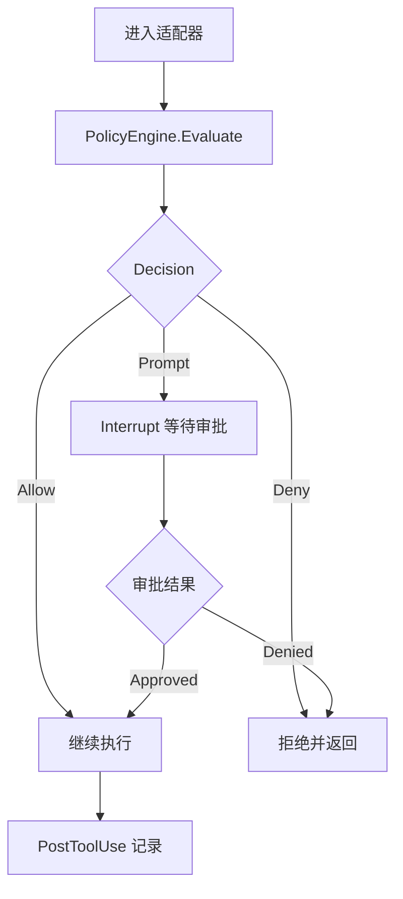
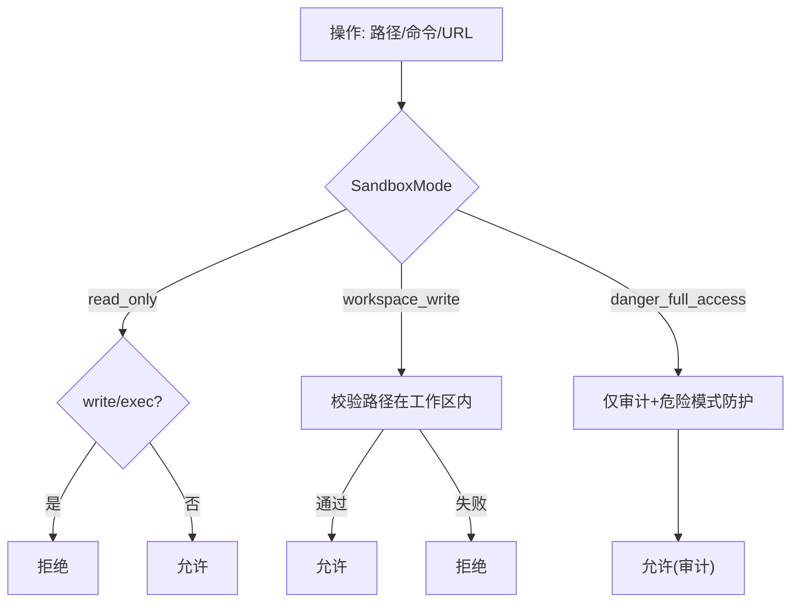
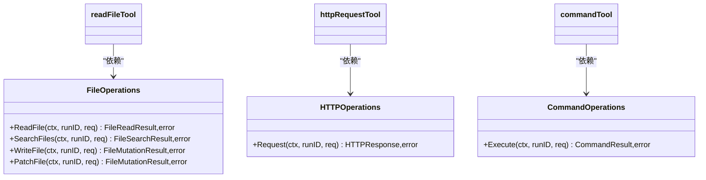
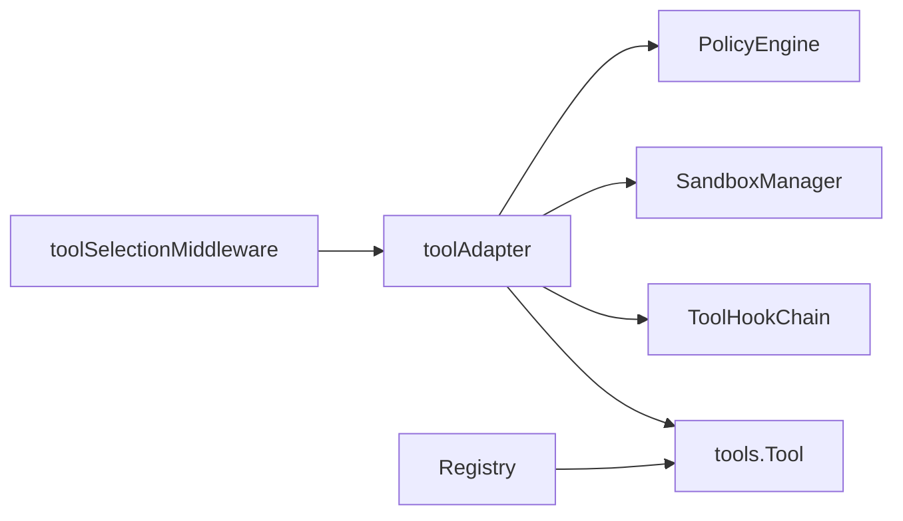

# 工具系统架构

<cite>
**本文引用的文件**
- [internal/tools/tools.go](file://internal/tools/tools.go)
- [internal/domain/tool.go](file://internal/domain/tool.go)
- [internal/runtime/tooladapter.go](file://internal/runtime/tooladapter.go)
- [internal/runtime/toolbroker.go](file://internal/runtime/toolbroker.go)
- [internal/runtime/toolselection.go](file://internal/runtime/toolselection.go)
- [internal/runtime/toolselection_middleware.go](file://internal/runtime/toolselection_middleware.go)
- [internal/runtime/policy.go](file://internal/runtime/policy.go)
- [internal/runtime/sandbox_manager.go](file://internal/runtime/sandbox_manager.go)
- [internal/domain/sandbox.go](file://internal/domain/sandbox.go)
- [internal/tools/filesystem.go](file://internal/tools/filesystem.go)
- [internal/tools/http_request.go](file://internal/tools/http_request.go)
- [internal/tools/command.go](file://internal/tools/command.go)
- [internal/tools/security.go](file://internal/tools/security.go)
</cite>

## 目录
1. [简介](#简介)
2. [项目结构](#项目结构)
3. [核心组件](#核心组件)
4. [架构总览](#架构总览)
5. [详细组件分析](#详细组件分析)
6. [依赖关系分析](#依赖关系分析)
7. [性能与可观测性](#性能与可观测性)
8. [故障排查指南](#故障排查指南)
9. [结论](#结论)

## 简介
本文件系统化阐述 Agent-Vivy 工具系统的架构与实现，覆盖工具接口定义、注册机制、动态加载原理；工具选择算法、参数验证、结果处理流程；安全沙箱模型（只读、工作区写入、危险全访问）、文件系统隔离、网络访问限制；工具发现机制、依赖注入、错误处理策略；内置工具（文件系统、HTTP 请求、命令执行）的实现模式与扩展点；以及调用监控、性能分析与调试支持。

## 项目结构
- internal/tools：Vivy 自有的工具契约与内置工具实现（不依赖 Eino），通过接口解耦后端能力（文件系统、HTTP、命令等）。
- internal/domain：领域模型，包括 ToolSpec、ToolProposal、SandboxMode、NetworkPolicy 等。
- internal/runtime：运行时桥接层，将 tools.Tool 适配到 Eino 的 ToolsNode，并执行政策评估、审批流、钩子、结果压缩与安全脱敏。
- internal/runtime/sandbox_manager.go：沙箱管理器，负责路径/命令/网络的权限校验。
- internal/runtime/policy.go：策略引擎，按 Profile 对工具调用进行 Allow/Deny/Prompt 决策。

**图表来源**
- [internal/tools/tools.go:17-362](file://internal/tools/tools.go#L17-L362)
- [internal/runtime/tooladapter.go:24-184](file://internal/runtime/tooladapter.go#L24-L184)
- [internal/runtime/toolbroker.go:12-93](file://internal/runtime/toolbroker.go#L12-L93)
- [internal/runtime/toolselection.go:5-22](file://internal/runtime/toolselection.go#L5-L22)
- [internal/runtime/toolselection_middleware.go:11-41](file://internal/runtime/toolselection_middleware.go#L11-L41)
- [internal/runtime/policy.go:35-135](file://internal/runtime/policy.go#L35-L135)
- [internal/runtime/sandbox_manager.go:27-234](file://internal/runtime/sandbox_manager.go#L27-L234)
- [internal/domain/tool.go:5-112](file://internal/domain/tool.go#L5-L112)
- [internal/domain/sandbox.go:3-85](file://internal/domain/sandbox.go#L3-L85)

**章节来源**
- [internal/tools/tools.go:17-362](file://internal/tools/tools.go#L17-L362)
- [internal/runtime/tooladapter.go:24-184](file://internal/runtime/tooladapter.go#L24-L184)
- [internal/runtime/toolbroker.go:12-93](file://internal/runtime/toolbroker.go#L12-L93)
- [internal/runtime/toolselection.go:5-22](file://internal/runtime/toolselection.go#L5-L22)
- [internal/runtime/toolselection_middleware.go:11-41](file://internal/runtime/toolselection_middleware.go#L11-L41)
- [internal/runtime/policy.go:35-135](file://internal/runtime/policy.go#L35-L135)
- [internal/runtime/sandbox_manager.go:27-234](file://internal/runtime/sandbox_manager.go#L27-L234)
- [internal/domain/tool.go:5-112](file://internal/domain/tool.go#L5-L112)
- [internal/domain/sandbox.go:3-85](file://internal/domain/sandbox.go#L3-L85)

## 核心组件
- 工具接口与注册表
  - tools.Tool 定义了 Spec() 与 InvokableRun(ctx, args) 的统一契约；可选 ProposalProvider 用于效果型工具的审批预览。
  - Registry 维护名称到实现的映射，提供 Resolve(enabled) 以按配置启用工具集，并禁止浏览器自动化等受限工具名。
- 运行时适配器与代理
  - toolAdapter 将 tools.Tool 暴露给 Eino，统一完成参数校验、策略评估、钩子改写再校验、审批中断、结果压缩与脱敏。
  - toolbroker 在父子进程边界执行工具调用，确保只有父进程能解析、策略检查、钩子处理与结果裁剪。
- 工具选择与中间件
  - Selector 基于 manifest 关键词与请求词元做确定性路由，返回最小工具集合。
  - toolSelectionMiddleware 在 Eino 的 agent 入口过滤工具列表，仅暴露当前请求允许的工具。
- 策略与审批
  - PolicyEngine 根据 Profile 与规则决定 Allow/Deny/Prompt；默认对只读或交互型工具放行，其他走 Prompt。
  - ApprovalPolicy 支持 ask/never/auto，配合 autoApproveTools 白名单。
- 沙箱与网络
  - SandboxManager 实施三层权限：read_only、workspace_write、danger_full_access；校验路径、命令白名单与网络域名/IP 策略。
- 内置工具
  - 文件系统：read_file/search_files/write_file/patch，通过 FileOperations 接口注入后端。
  - HTTP：http_request 只读获取，URL 受 NetworkPolicy 约束。
  - 命令：execute/commandline，受命令白名单与危险模式保护。

**章节来源**
- [internal/tools/tools.go:17-362](file://internal/tools/tools.go#L17-L362)
- [internal/runtime/tooladapter.go:24-184](file://internal/runtime/tooladapter.go#L24-L184)
- [internal/runtime/toolbroker.go:12-93](file://internal/runtime/toolbroker.go#L12-L93)
- [internal/runtime/toolselection.go:5-22](file://internal/runtime/toolselection.go#L5-L22)
- [internal/runtime/toolselection_middleware.go:11-41](file://internal/runtime/toolselection_middleware.go#L11-L41)
- [internal/runtime/policy.go:35-135](file://internal/runtime/policy.go#L35-L135)
- [internal/runtime/sandbox_manager.go:27-234](file://internal/runtime/sandbox_manager.go#L27-L234)
- [internal/tools/filesystem.go:13-340](file://internal/tools/filesystem.go#L13-L340)
- [internal/tools/http_request.go:12-72](file://internal/tools/http_request.go#L12-L72)
- [internal/tools/command.go:12-130](file://internal/tools/command.go#L12-L130)

## 架构总览
下图展示一次工具调用的端到端流程：从 Eino 工具节点进入适配器，经过参数校验、策略评估、审批流、钩子、沙箱检查，最终调用具体工具实现并输出结果。

**图表来源**
- [internal/runtime/tooladapter.go:78-184](file://internal/runtime/tooladapter.go#L78-L184)
- [internal/runtime/toolbroker.go:15-93](file://internal/runtime/toolbroker.go#L15-L93)
- [internal/runtime/policy.go:96-135](file://internal/runtime/policy.go#L96-L135)
- [internal/runtime/sandbox_manager.go:85-234](file://internal/runtime/sandbox_manager.go#L85-L234)

## 详细组件分析

### 工具接口、注册与动态加载
- 工具接口
  - tools.Tool：Spec() 描述名称、描述、是否只读、参数 Schema、关键词、交互类型；InvokableRun 执行一次调用，参数为 JSON 对象。
  - ProposalProvider：效果型工具可选实现，生成 ToolProposal 供人类审阅。
- 注册表
  - Registry：维护 byName 映射，重复名称会 panic；Resolve(enabled) 按配置启用工具并限制特定名称（如浏览器自动化）。
  - BuiltinWith* 系列构造器：通过依赖注入逐步装配文件系统、技能、任务、网络搜索、HTTP、MCP、顺序思考、命令等工具族。
- 动态加载
  - 通过 BuiltinWithCapabilities/BuiltinWithTodo/BuiltinWithSearch/BuiltinWithHTTP/BuiltinWithMCP/BuiltinWithSequential/BuiltinWithCommands 等工厂方法按需组合工具，避免硬耦合。
  - 插件侧通过 vivy-sdk verify/pack 流程集成，不直接修改 runtime/engine.go。

**图表来源**
- [internal/tools/tools.go:17-362](file://internal/tools/tools.go#L17-L362)
- [internal/tools/filesystem.go:96-300](file://internal/tools/filesystem.go#L96-L300)
- [internal/tools/http_request.go:33-72](file://internal/tools/http_request.go#L33-L72)
- [internal/tools/command.go:46-130](file://internal/tools/command.go#L46-L130)

**章节来源**
- [internal/tools/tools.go:17-362](file://internal/tools/tools.go#L17-L362)
- [internal/tools/filesystem.go:96-300](file://internal/tools/filesystem.go#L96-L300)
- [internal/tools/http_request.go:33-72](file://internal/tools/http_request.go#L33-L72)
- [internal/tools/command.go:46-130](file://internal/tools/command.go#L46-L130)

### 工具选择算法
- 关键词匹配
  - Selector.Select(request) 将请求切分为词元集合，遍历已配置工具，计算 score = 命中关键词权重之和；取最高分的所有工具作为候选。
  - 未声明关键词的工具回退到名称分词匹配，保持确定性且无需嵌入/模型调用。
- 请求级白名单
  - withSelectedTools(selected) 将允许的工具名集合绑定到上下文；toolSelectionMiddleware 在 Eino 入口过滤工具列表；toolAdapter 在执行前二次校验。
- 复杂度
  - 选择过程 O(N) 遍历工具，N 为已启用工具数量；空间 O(N)。

**图表来源**
- [internal/tools/tools.go:151-217](file://internal/tools/tools.go#L151-L217)
- [internal/runtime/toolselection.go:5-22](file://internal/runtime/toolselection.go#L5-L22)
- [internal/runtime/toolselection_middleware.go:23-41](file://internal/runtime/toolselection_middleware.go#L23-L41)

**章节来源**
- [internal/tools/tools.go:151-217](file://internal/tools/tools.go#L151-L217)
- [internal/runtime/toolselection.go:5-22](file://internal/runtime/toolselection.go#L5-L22)
- [internal/runtime/toolselection_middleware.go:23-41](file://internal/runtime/toolselection_middleware.go#L23-L41)

### 参数验证与结果处理
- 参数验证
  - ValidateArgs(spec, args)：按 ToolSpec.Params 校验字段存在性、必填、JSON 类型（string/integer/number/boolean/object/array），未知字段拒绝。
  - ValidateArgsSafety(spec, args)：针对 path/filepath/file_path/command/cmd 等高危字段进行 NUL 字节、路径穿越、Shell 注入等安全检查。
- 结果处理
  - RedactSensitive：脱敏密钥与邮箱。
  - compactToolResult：对超长结果保留头尾片段，插入折叠标记，防止模型上下文膨胀。
  - toolAdapter.run：包装结果头部标识“不可信工具输出”，并应用脱敏与压缩。

**图表来源**
- [internal/tools/tools.go:41-120](file://internal/tools/tools.go#L41-L120)
- [internal/tools/security.go:38-79](file://internal/tools/security.go#L38-L79)
- [internal/runtime/tooladapter.go:165-202](file://internal/runtime/tooladapter.go#L165-L202)

**章节来源**
- [internal/tools/tools.go:41-120](file://internal/tools/tools.go#L41-L120)
- [internal/tools/security.go:38-79](file://internal/tools/security.go#L38-L79)
- [internal/runtime/tooladapter.go:165-202](file://internal/runtime/tooladapter.go#L165-L202)

### 审批与策略
- 策略评估
  - PolicyEngine.Evaluate：按 Profile 与规则匹配，返回 Allow/Deny/Prompt；默认对只读/交互工具放行，其余走 Prompt。
  - 钩子改写：PreToolUse 改写参数后需重新校验与策略评估，防止绕过。
- 审批策略
  - ApprovalPolicy：ask/never/auto；auto 模式下支持 autoApproveTools 白名单。
  - 计划模式：Plan Mode 下效果型工具一律拒绝。
- 事件与审计
  - emitGovernanceEvent 记录策略评估快照与原因，便于审计与回放。

**图表来源**
- [internal/runtime/policy.go:96-169](file://internal/runtime/policy.go#L96-L169)
- [internal/runtime/tooladapter.go:96-163](file://internal/runtime/tooladapter.go#L96-L163)

**章节来源**
- [internal/runtime/policy.go:96-169](file://internal/runtime/policy.go#L96-L169)
- [internal/runtime/tooladapter.go:96-163](file://internal/runtime/tooladapter.go#L96-L163)

### 安全沙箱模型
- 三层权限
  - read_only：禁止写操作与命令执行。
  - workspace_write：允许在工作区根目录下读写，阻止逃逸。
  - danger_full_access：放开限制但仍审计，并拦截明显危险命令模式。
- 文件系统隔离
  - ValidatePath：规范化路径、解析符号链接、检测 .. 穿越、限制 workspace_write 下的相对路径。
- 命令执行限制
  - ConfineCommand：read_only 禁止；非危险模式需白名单；危险模式仍拦截 format/rm 等破坏性模式。
- 网络访问限制
  - CheckNetwork：仅允许 http/https；可拒绝私有 IP；支持域名白名单。

**图表来源**
- [internal/runtime/sandbox_manager.go:85-234](file://internal/runtime/sandbox_manager.go#L85-L234)
- [internal/domain/sandbox.go:3-85](file://internal/domain/sandbox.go#L3-L85)

**章节来源**
- [internal/runtime/sandbox_manager.go:85-234](file://internal/runtime/sandbox_manager.go#L85-L234)
- [internal/domain/sandbox.go:3-85](file://internal/domain/sandbox.go#L3-L85)

### 内置工具实现模式与扩展点
- 文件系统
  - 通过 FileOperations 接口注入后端，支持 Read/Search/Write/Patch；write/patch 支持 PrepareProposal 生成预览。
  - 扩展点：实现 FileOperations 即可接入任意文件系统后端（如 Eino filesystem.Backend 适配器）。
- HTTP 请求
  - 通过 HTTPOperations 接口注入，只读 GET/HEAD，URL 受 NetworkPolicy 约束。
  - 扩展点：实现 HTTPOperations 以替换底层 HTTP 客户端或增加重试/限流。
- 命令执行
  - 通过 CommandOperations 接口注入，支持 execute/commandline；expandExecuteRequest 拆分 shell 风格字符串为命令与参数，并禁止 Shell 语法。
  - 扩展点：实现 CommandOperations 以对接进程管理器，结合 SandboxManager 白名单与超时控制。
- 工具搜索
  - toolSearch 工具可在运行时检索可用工具集，便于动态发现与提示。

**图表来源**
- [internal/tools/filesystem.go:82-104](file://internal/tools/filesystem.go#L82-L104)
- [internal/tools/http_request.go:29-35](file://internal/tools/http_request.go#L29-L35)
- [internal/tools/command.go:38-52](file://internal/tools/command.go#L38-L52)

**章节来源**
- [internal/tools/filesystem.go:82-104](file://internal/tools/filesystem.go#L82-L104)
- [internal/tools/http_request.go:29-35](file://internal/tools/http_request.go#L29-L35)
- [internal/tools/command.go:38-52](file://internal/tools/command.go#L38-L52)

### 工具发现机制与依赖注入
- 发现机制
  - 静态注册：BuiltinWith* 系列工厂组装工具族，Registry.Resolve(enabled) 按配置启用。
  - 动态搜索：toolSearch 工具可在运行期查询可用工具，辅助 UI/Agent 提示。
- 依赖注入
  - 通过接口（FileOperations/HTTPOperations/CommandOperations 等）注入后端实现，使工具包与具体运行时解耦。
  - 插件通过 SDK 打包与校验流程集成，不侵入内部运行时。

**章节来源**
- [internal/tools/tools.go:243-362](file://internal/tools/tools.go#L243-L362)
- [internal/tools/toolsearch.go:1-200](file://internal/tools/toolsearch.go#L1-L200)

### 错误处理策略
- 参数错误：ArgError 结构化错误，包含字段与原因，适合在 tool.finished 事件中展示。
- 策略拒绝：ErrPolicyDenied；计划模式效果型工具拒绝：ErrPlanModeToolDenied。
- 沙箱拒绝：ErrSandboxDenied；路径/命令/网络违规均返回明确错误。
- 结果异常：工具实现返回错误时，适配器记录 PostToolUse 并透传；对“提案过期/目标变更”错误上报 proposal stale。

**章节来源**
- [internal/tools/tools.go:34-84](file://internal/tools/tools.go#L34-L84)
- [internal/runtime/tooladapter.go:18-20](file://internal/runtime/tooladapter.go#L18-L20)
- [internal/runtime/tooladapter.go:176-184](file://internal/runtime/tooladapter.go#L176-L184)
- [internal/runtime/sandbox_manager.go:15-234](file://internal/runtime/sandbox_manager.go#L15-L234)

## 依赖关系分析
- 松耦合设计
  - tools 包不依赖 Eino，仅依赖 domain/storage；runtime 负责与 Eino 集成。
  - 内置工具通过接口依赖后端，便于替换与测试。
- 关键依赖链
  - toolAdapter -> PolicyEngine/SandboxManager/Hooks -> tools.Tool
  - Registry -> BuiltinWith* -> 各工具实现
  - toolSelectionMiddleware -> selectedToolSet -> 过滤 Eino 工具列表

**图表来源**
- [internal/runtime/tooladapter.go:24-184](file://internal/runtime/tooladapter.go#L24-L184)
- [internal/tools/tools.go:223-362](file://internal/tools/tools.go#L223-L362)
- [internal/runtime/toolselection_middleware.go:11-41](file://internal/runtime/toolselection_middleware.go#L11-L41)

**章节来源**
- [internal/runtime/tooladapter.go:24-184](file://internal/runtime/tooladapter.go#L24-L184)
- [internal/tools/tools.go:223-362](file://internal/tools/tools.go#L223-L362)
- [internal/runtime/toolselection_middleware.go:11-41](file://internal/runtime/toolselection_middleware.go#L11-L41)

## 性能与可观测性
- 性能特性
  - 工具选择为 O(N) 线性扫描，无模型/嵌入开销，保证稳定路由。
  - 结果压缩与脱敏减少模型上下文占用，避免长输出影响延迟。
- 可观测性
  - 策略评估事件（EventPolicyEvaluated）携带 Profile、哈希与原因，便于审计。
  - Hook 前后事件（PreToolUse/PostToolUse）记录参数与结果摘要，支持追踪与调试。
  - 建议：在 Hook 中埋点耗时、资源使用与错误码，结合运行指标面板进行分析。

[本节为通用指导，不直接分析具体文件]

## 故障排查指南
- 常见错误定位
  - 参数错误：查看 ArgError 的 Field/Reason，确认 JSON 结构与类型是否符合 ToolSpec.Params。
  - 策略拒绝：检查 PolicyProfile 与规则，确认是否处于 Plan/ReadOnly 模式导致效果型工具被拒。
  - 沙箱拒绝：核对路径是否在工作区内、命令是否在白名单、URL 是否允许。
  - 审批流程：若出现中断，确认外部审批是否成功恢复，注意提案过期或目标变更导致的失败。
- 调试建议
  - 开启 Hook 日志，记录 Pre/Post 参数与结果摘要。
  - 打印策略评估快照与原因，帮助理解决策依据。
  - 对长输出工具启用压缩预算，避免上下文溢出。

**章节来源**
- [internal/tools/tools.go:34-84](file://internal/tools/tools.go#L34-L84)
- [internal/runtime/policy.go:96-169](file://internal/runtime/policy.go#L96-L169)
- [internal/runtime/tooladapter.go:96-184](file://internal/runtime/tooladapter.go#L96-L184)
- [internal/runtime/sandbox_manager.go:85-234](file://internal/runtime/sandbox_manager.go#L85-L234)

## 结论
Agent-Vivy 工具系统通过清晰的接口契约、严格的参数与安全校验、可插拔的后端依赖注入、确定性的工具选择算法、完善的策略与审批流，以及三层沙箱模型，实现了安全、可控、可扩展的工具执行环境。内置工具（文件系统、HTTP、命令）遵循统一的实现模式，便于扩展与维护。运行时适配器与中间件确保了与 Eino 的无缝集成，同时保持内核与 UI 契约的清晰边界。建议在开发中充分利用 Hook 与策略事件进行可观测性建设，并结合沙箱与审批策略保障生产安全。