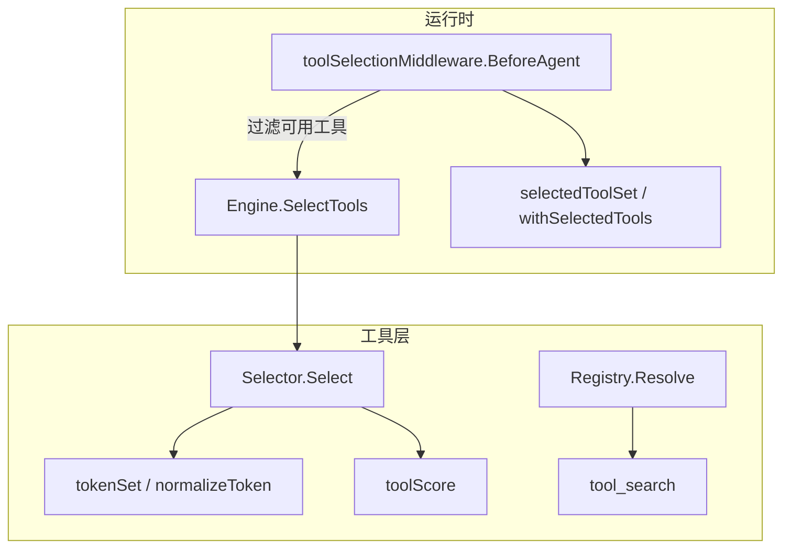
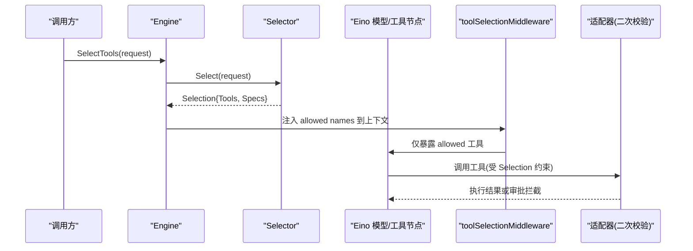
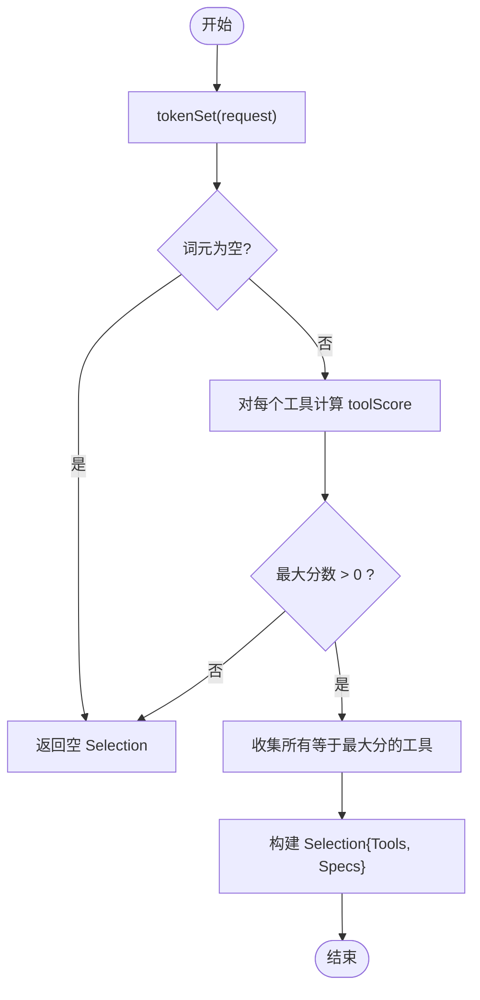
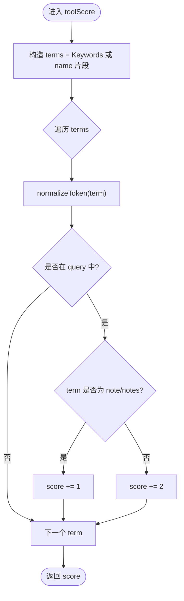
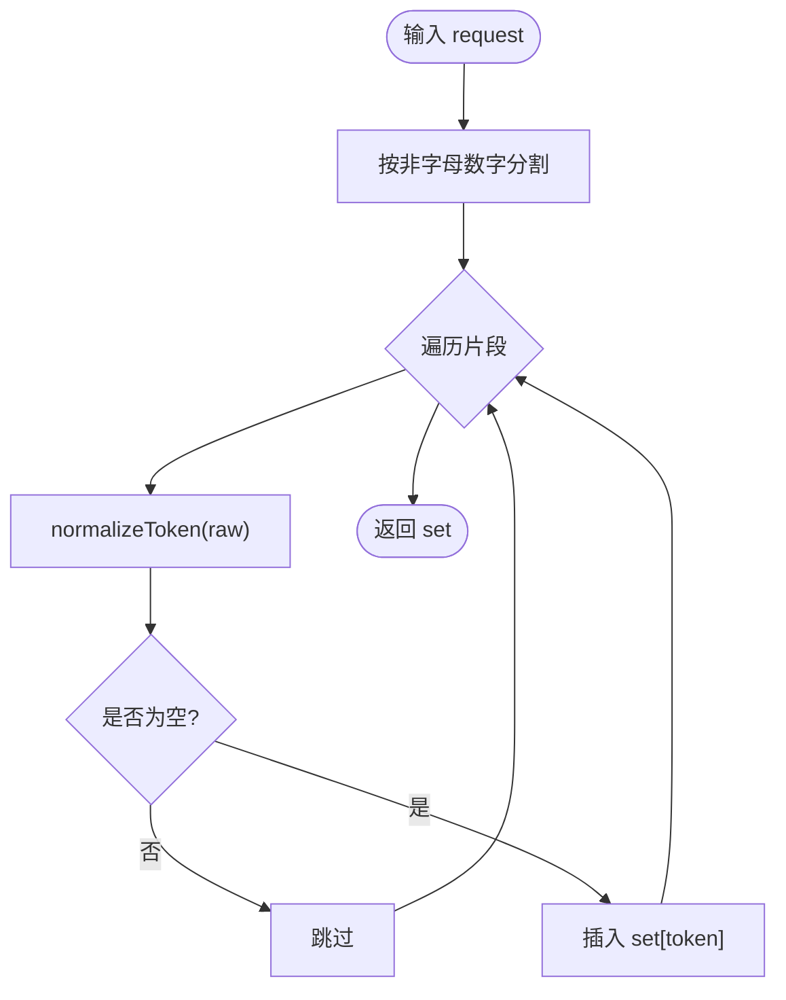
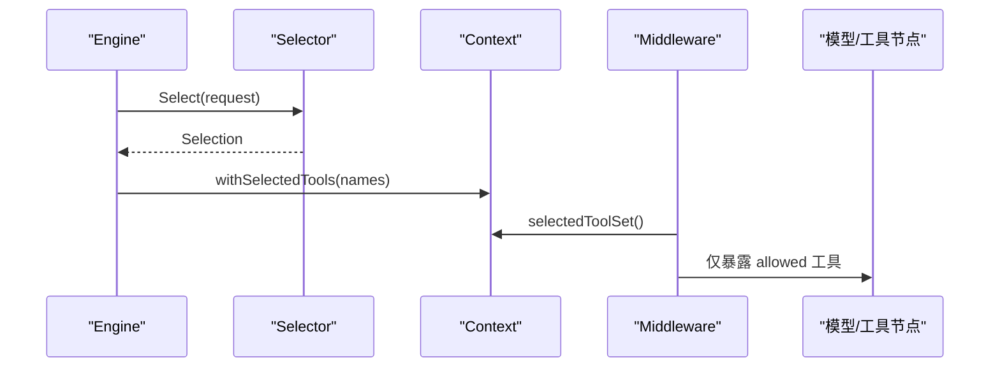

# 工具选择算法

<cite>
**本文引用的文件**
- [internal/tools/tools.go](file://internal/tools/tools.go)
- [internal/domain/tool.go](file://internal/domain/tool.go)
- [internal/runtime/engine.go](file://internal/runtime/engine.go)
- [internal/runtime/toolselection.go](file://internal/runtime/toolselection.go)
- [internal/runtime/toolselection_middleware.go](file://internal/runtime/toolselection_middleware.go)
- [internal/tools/toolsearch.go](file://internal/tools/toolsearch.go)
- [internal/tools/tools_test.go](file://internal/tools/tools_test.go)
</cite>

## 目录
1. [简介](#简介)
2. [项目结构](#项目结构)
3. [核心组件](#核心组件)
4. [架构总览](#架构总览)
5. [详细组件分析](#详细组件分析)
6. [依赖关系分析](#依赖关系分析)
7. [性能考量](#性能考量)
8. [故障排查指南](#故障排查指南)
9. [结论](#结论)
10. [附录：调优与测试](#附录：调优与测试)

## 简介
本文件聚焦 Agent-Vivy 的“工具选择算法”，系统性解释 Selector 的实现原理、关键词匹配与评分机制、确定性路由策略，以及 tokenSet 解析、normalizeToken 标准化、toolScore 评分计算。文档同时说明基于 manifest keywords 的精确匹配机制如何避免通用词汇误选多个工具，并阐述 Selection 结构体在传递工具列表与规格信息中的作用。最后提供调优指南、测试用例与调试方法。

## 项目结构
工具选择涉及两个层次：
- 运行时层（runtime）：负责将选择结果注入到 Eino 的 agent 上下文，并在模型/工具节点执行前进行二次过滤。
- 工具层（tools）：实现具体的选择器、评分、令牌解析等核心逻辑，并提供工具注册表与搜索能力。

图表来源
- [internal/runtime/engine.go:134-142](file://internal/runtime/engine.go#L134-L142)
- [internal/runtime/toolselection_middleware.go:23-40](file://internal/runtime/toolselection_middleware.go#L23-L40)
- [internal/runtime/toolselection.go:7-21](file://internal/runtime/toolselection.go#L7-L21)
- [internal/tools/tools.go:138-181](file://internal/tools/tools.go#L138-L181)
- [internal/tools/tools.go:183-217](file://internal/tools/tools.go#L183-L217)
- [internal/tools/toolsearch.go:37-62](file://internal/tools/toolsearch.go#L37-L62)

章节来源
- [internal/runtime/engine.go:134-142](file://internal/runtime/engine.go#L134-L142)
- [internal/runtime/toolselection_middleware.go:23-40](file://internal/runtime/toolselection_middleware.go#L23-L40)
- [internal/runtime/toolselection.go:7-21](file://internal/runtime/toolselection.go#L7-L21)
- [internal/tools/tools.go:138-181](file://internal/tools/tools.go#L138-L181)
- [internal/tools/tools.go:183-217](file://internal/tools/tools.go#L183-L217)
- [internal/tools/toolsearch.go:37-62](file://internal/tools/toolsearch.go#L37-L62)

## 核心组件
- Selector：根据用户请求文本，从已配置的工具集中选择最相关的工具集合，返回 Selection。
- Selection：承载被选中的工具实例与其 ToolSpec，用于后续模型提示与执行约束。
- toolScore：对每个工具的 manifest keywords 与请求词集进行匹配打分，决定候选工具是否入选。
- tokenSet/normalizeToken：将请求文本切分为标准化词元集合，作为匹配输入。
- toolSelectionMiddleware：在 Eino 的 agent 边界处，依据运行期上下文中的允许工具名集合，裁剪暴露给模型的可用工具列表。
- Registry/Resolve：按配置启用名称解析工具，限制可搜索范围，保证启动时配置正确性。

章节来源
- [internal/tools/tools.go:122-181](file://internal/tools/tools.go#L122-L181)
- [internal/tools/tools.go:183-217](file://internal/tools/tools.go#L183-L217)
- [internal/runtime/toolselection_middleware.go:23-40](file://internal/runtime/toolselection_middleware.go#L23-L40)
- [internal/tools/toolsearch.go:37-62](file://internal/tools/toolsearch.go#L37-L62)
- [internal/tools/tools.go:343-361](file://internal/tools/tools.go#L343-L361)

## 架构总览
下图展示一次请求从 Engine 到工具选择的完整流程，包括中间件对模型可见工具集的裁剪。

图表来源
- [internal/runtime/engine.go:134-142](file://internal/runtime/engine.go#L134-L142)
- [internal/runtime/toolselection_middleware.go:23-40](file://internal/runtime/toolselection_middleware.go#L23-L40)
- [internal/tools/tools.go:138-181](file://internal/tools/tools.go#L138-L181)

## 详细组件分析

### Selector 选择算法与确定性路由
- 输入：用户请求字符串。
- 处理：
  - 将请求文本解析为标准化词元集合 tokenSet。
  - 遍历所有候选工具，使用 toolScore 计算匹配分数。
  - 选取最高分；若存在并列最高分，则全部纳入 Selection，保持注册顺序稳定。
- 输出：Selection，包含 Tools 与 Specs。
- 确定性：不依赖外部嵌入或模型调用，完全由 manifest keywords 与名称片段决定，保证同输入同输出。

图表来源
- [internal/tools/tools.go:151-181](file://internal/tools/tools.go#L151-L181)

章节来源
- [internal/tools/tools.go:151-181](file://internal/tools/tools.go#L151-L181)

### 关键词匹配与评分算法 toolScore
- 关键词来源：优先使用工具 spec.Keywords；若无显式关键词，则回退到工具名按下划线/连字符拆分得到的片段。
- 匹配规则：对每个关键词 term，标准化后与请求词元集合比较，命中即加分。
- 权重设计：
  - 默认命中权重为 2。
  - 针对 note/notes 等易泛化的词，降低权重至 1，避免误选多个笔记类工具。
- 最终得分：累加命中权重，取最大值作为筛选阈值。

图表来源
- [internal/tools/tools.go:183-202](file://internal/tools/tools.go#L183-L202)

章节来源
- [internal/tools/tools.go:183-202](file://internal/tools/tools.go#L183-L202)

### tokenSet 解析与 normalizeToken 标准化
- tokenSet：
  - 按非字母数字字符分割原始请求文本。
  - 对每个片段调用 normalizeToken 去空白并转小写。
  - 以 map[string]struct{} 形式去重，得到查询词元集合。
- normalizeToken：
  - 去除首尾空白并转为小写，确保大小写无关匹配。

图表来源
- [internal/tools/tools.go:204-217](file://internal/tools/tools.go#L204-L217)

章节来源
- [internal/tools/tools.go:204-217](file://internal/tools/tools.go#L204-L217)

### 基于 manifest keywords 的精确匹配机制
- 设计目标：避免通用词汇（如“note”）导致多个工具同时被选中。
- 机制：
  - 工具通过 manifest 声明 Keywords，明确路由意图。
  - 无显式 Keywords 的工具会回退到名称片段匹配，但内置工具普遍提供 Keywords，从而提升精确度。
  - 对易泛化词（note/notes）降低权重，进一步抑制误选。
- 效果：同一请求只选择语义最相关且明确的工具集合，必要时并列最高分才多选。

章节来源
- [internal/tools/tools.go:183-202](file://internal/tools/tools.go#L183-L202)
- [internal/domain/tool.go:27-42](file://internal/domain/tool.go#L27-L42)

### Selection 结构体的作用
- 字段：
  - Tools：被选中的工具实例列表。
  - Specs：对应工具的规格描述，供模型提示与参数校验使用。
- 行为：
  - Names() 返回所选工具的名称序列，便于上下文传播与中间件过滤。
  - 保持注册顺序，确保模型侧 schema 与提示一致、可复现。

章节来源
- [internal/tools/tools.go:122-136](file://internal/tools/tools.go#L122-L136)

### 运行时集成：中间件与上下文裁剪
- Engine.SelectTools：委托 Selector 完成选择，返回 Selection。
- withSelectedTools/selectedToolSet：将允许的工具名集合绑定到请求上下文。
- toolSelectionMiddleware.BeforeAgent：
  - 读取上下文中允许的 tool 名称集合。
  - 遍历当前 runCtx.Tools，仅保留允许的工具，传递给模型与工具节点。
  - 适配器仍作为第二道防线，拒绝不在 Selection 范围内的调用。

图表来源
- [internal/runtime/engine.go:134-142](file://internal/runtime/engine.go#L134-L142)
- [internal/runtime/toolselection.go:7-21](file://internal/runtime/toolselection.go#L7-L21)
- [internal/runtime/toolselection_middleware.go:23-40](file://internal/runtime/toolselection_middleware.go#L23-L40)

章节来源
- [internal/runtime/engine.go:134-142](file://internal/runtime/engine.go#L134-L142)
- [internal/runtime/toolselection.go:7-21](file://internal/runtime/toolselection.go#L7-L21)
- [internal/runtime/toolselection_middleware.go:23-40](file://internal/runtime/toolselection_middleware.go#L23-L40)

### 工具搜索工具 tool_search
- 作用：在受限范围内搜索可用工具，支持 select:name,name 精确选择与关键词模糊匹配。
- 特性：
  - 内部维护 catalog 与缓存，提高重复查询性能。
  - 支持 restrict(enabled) 限制可搜索工具集，配合 Registry.Resolve 使用。
  - 对 select: 前缀进行精确匹配并按名称排序；否则基于名称/描述的加权评分排序。

章节来源
- [internal/tools/toolsearch.go:37-62](file://internal/tools/toolsearch.go#L37-L62)
- [internal/tools/toolsearch.go:95-150](file://internal/tools/toolsearch.go#L95-L150)
- [internal/tools/tools.go:343-361](file://internal/tools/tools.go#L343-L361)

## 依赖关系分析
- tools 包不依赖 Eino，保持契约独立；Eino 仅在 runtime 层桥接。
- domain.ToolSpec 提供工具元数据（含 Keywords），被 Selector 与工具实现共同消费。
- runtime 层通过中间件与上下文将选择结果注入到 Eino 的执行流，形成“选择 + 过滤”的双保险。

图表来源
- [internal/domain/tool.go:27-42](file://internal/domain/tool.go#L27-L42)
- [internal/tools/tools.go:138-181](file://internal/tools/tools.go#L138-L181)
- [internal/runtime/toolselection_middleware.go:23-40](file://internal/runtime/toolselection_middleware.go#L23-L40)

章节来源
- [internal/domain/tool.go:27-42](file://internal/domain/tool.go#L27-L42)
- [internal/tools/tools.go:138-181](file://internal/tools/tools.go#L138-L181)
- [internal/runtime/toolselection_middleware.go:23-40](file://internal/runtime/toolselection_middleware.go#L23-L40)

## 性能考量
- 时间复杂度：
  - tokenSet：O(N)，N 为请求长度。
  - toolScore：O(T*K)，T 为工具数，K 为关键词数；整体选择 O(T*K)。
- 空间复杂度：
  - 词元集合 O(U)，U 为不同词元数量。
  - 评分数组 O(T)。
- 优化建议：
  - 合理设置 Keywords，减少 K 与泛化词命中。
  - 控制工具总数 T，避免过多候选。
  - 使用 tool_search 的缓存机制加速重复查询。

[本节为通用性能讨论，不直接分析具体文件]

## 故障排查指南
- 现象：请求未选择任何工具
  - 检查工具是否配置了 Keywords；若无，回退到名称片段匹配可能不够精确。
  - 确认请求文本是否包含能匹配的关键词或名称片段。
- 现象：选择了多个工具
  - 检查是否存在并列最高分；调整 Keywords 或降低泛化词权重。
  - 对 note/notes 等词，确保有足够区分度的关键词。
- 现象：模型侧仍看到未授权工具
  - 确认 withSelectedTools 是否正确注入 allowed names。
  - 检查 toolSelectionMiddleware 是否正确过滤 runCtx.Tools。
- 现象：工具参数校验失败
  - 查看 ValidateArgs 错误类型 ArgError，定位字段与原因。

章节来源
- [internal/tools/tools_test.go:34-53](file://internal/tools/tools_test.go#L34-L53)
- [internal/tools/tools.go:41-84](file://internal/tools/tools.go#L41-L84)
- [internal/runtime/toolselection_middleware.go:23-40](file://internal/runtime/toolselection_middleware.go#L23-L40)

## 结论
该工具选择算法通过“manifest keywords + 名称片段”的精确匹配与轻量评分，实现了确定性的请求路由。结合运行时中间件的上下文裁剪与适配器的二次校验，既保证了最小必要工具集暴露给模型，又维持了执行安全。通过合理的关键词配置与性能优化，可在复杂工具集场景下保持稳定、高效的工具选择。

[本节为总结性内容，不直接分析具体文件]

## 附录：调优与测试

### 关键词配置建议
- 为每个工具定义明确的 Keywords，覆盖典型用户表达与业务术语。
- 避免使用过于通用的词（如 note/notes），或使用更具体的短语替代。
- 对易混淆工具，增加区分度高的关键词，降低并列最高分概率。
- 对于无 Keywords 的自定义工具，尽量补充 Keywords 或规范化名称以便片段匹配。

章节来源
- [internal/tools/tools.go:183-202](file://internal/tools/tools.go#L183-L202)
- [internal/domain/tool.go:27-42](file://internal/domain/tool.go#L27-L42)

### 性能优化建议
- 精简工具集：仅启用必要工具，减少 T。
- 复用 tool_search 缓存：对频繁查询的关键词组合利用缓存。
- 控制请求长度：过长的请求会增加 tokenSet 构建成本。

章节来源
- [internal/tools/toolsearch.go:95-150](file://internal/tools/toolsearch.go#L95-L150)

### 测试用例参考
- 选择相关性：验证不同请求仅选择相关工具。
- 参数校验：覆盖缺失必填、未知字段、类型不匹配等场景。
- 注册表解析：验证已知/未知工具名、重复注册等边界情况。

章节来源
- [internal/tools/tools_test.go:34-53](file://internal/tools/tools_test.go#L34-L53)
- [internal/tools/tools_test.go:11-32](file://internal/tools/tools_test.go#L11-L32)
- [internal/tools/tools_test.go:131-163](file://internal/tools/tools_test.go#L131-L163)

### 调试方法
- 打印 Selection.Names()：观察实际选中的工具名序列。
- 检查中间件过滤：确认 allowed 集合与 runCtx.Tools 的一致性。
- 使用 tool_search 的 select: 语法：快速验证某工具是否可达及其 schema。

章节来源
- [internal/tools/tools.go:122-136](file://internal/tools/tools.go#L122-L136)
- [internal/runtime/toolselection_middleware.go:23-40](file://internal/runtime/toolselection_middleware.go#L23-L40)
- [internal/tools/toolsearch.go:95-150](file://internal/tools/toolsearch.go#L95-L150)