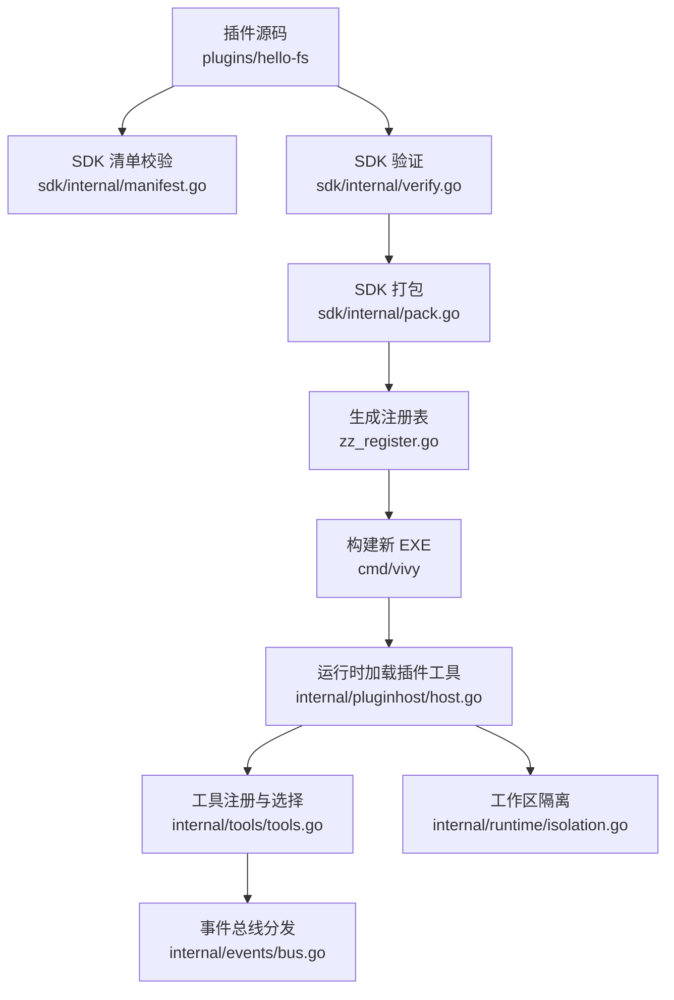
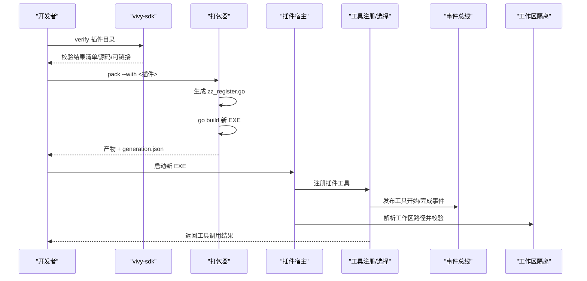
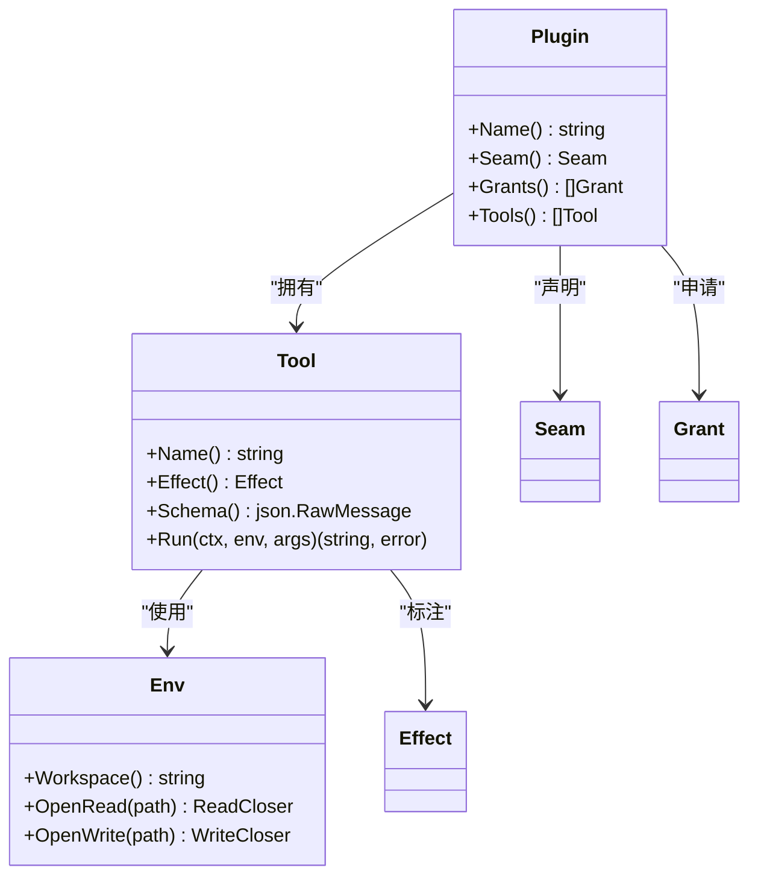
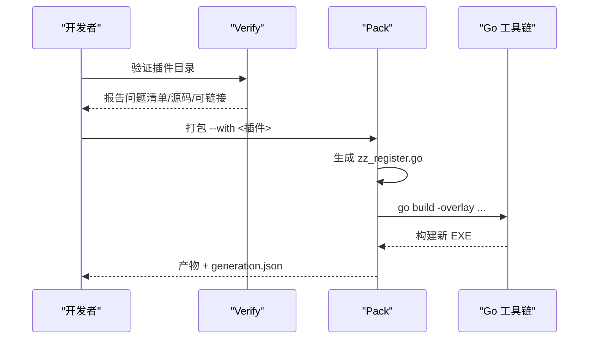
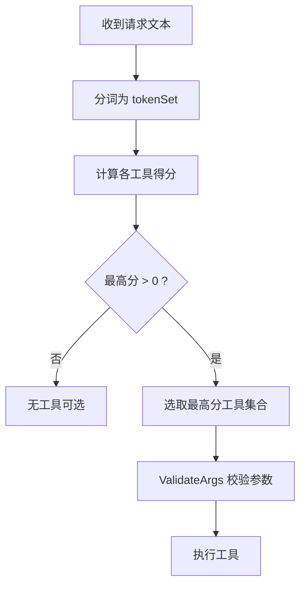
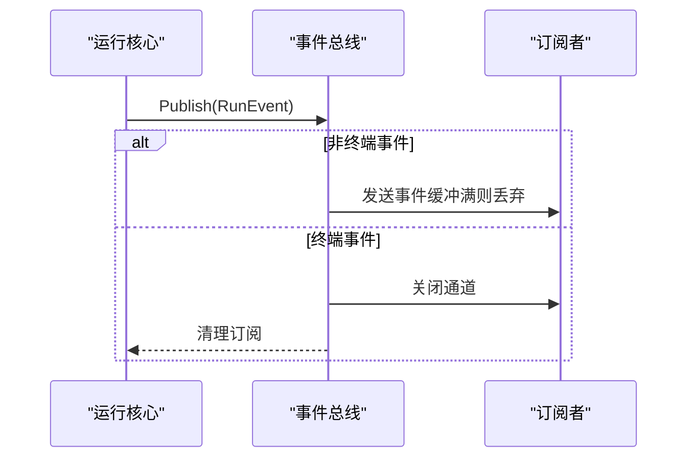
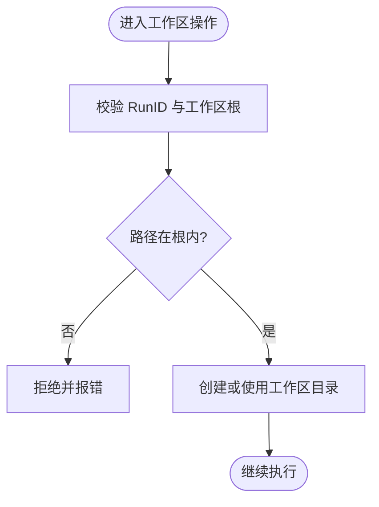
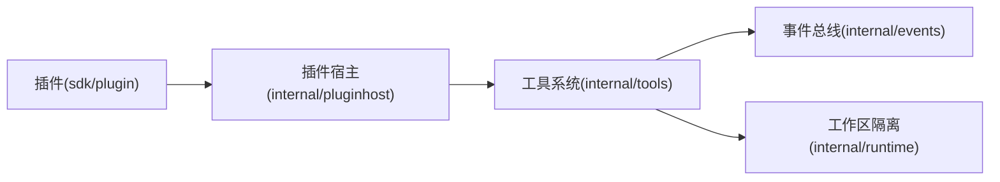

# 插件架构

<cite>
**本文引用的文件**
- [internal/pluginhost/host.go](file://internal/pluginhost/host.go)
- [sdk/plugin/plugin.go](file://sdk/plugin/plugin.go)
- [plugins/hello-fs/plugin.go](file://plugins/hello-fs/plugin.go)
- [plugins/hello-fs/vivy-plugin.json](file://plugins/hello-fs/vivy-plugin.json)
- [sdk/internal/verify.go](file://sdk/internal/verify.go)
- [sdk/internal/pack.go](file://sdk/internal/pack.go)
- [sdk/internal/manifest.go](file://sdk/internal/manifest.go)
- [sdk/main.go](file://sdk/main.go)
- [internal/events/bus.go](file://internal/events/bus.go)
- [internal/runtime/isolation.go](file://internal/runtime/isolation.go)
- [internal/domain/tool.go](file://internal/domain/tool.go)
- [internal/tools/tools.go](file://internal/tools/tools.go)
- [docs/architecture/VIVY-PLUGIN-SPEC.md](file://docs/architecture/VIVY-PLUGIN-SPEC.md)
</cite>

## 目录
1. [简介](#简介)
2. [项目结构](#项目结构)
3. [核心组件](#核心组件)
4. [架构总览](#架构总览)
5. [详细组件分析](#详细组件分析)
6. [依赖关系分析](#依赖关系分析)
7. [性能与可观测性](#性能与可观测性)
8. [故障排查指南](#故障排查指南)
9. [结论](#结论)
10. [附录：开发示例与部署流程](#附录开发示例与部署流程)

## 简介
本仓库实现了 Vivy 物种运行时（vivy.exe）的插件体系。插件以纯 Go 代码形式提供能力，通过最小化的 SDK 窗口暴露给模型工具层；插件不直接修改内核，而是经由 SDK 的验证与打包流程生成新一代 EXE，从而将“插件”作为治理单元进行版本化、审计与隔离。

关键要点：
- 插件接口由 sdk/plugin 定义，仅暴露极小能力面（名称、seam、权限、工具列表）。
- 插件运行时的世界被限制在 Env 中，文件系统访问需显式授权。
- 插件发现与注册由 vivy-sdk pack 生成注册表并编译进二进制。
- 事件总线 internal/events.Bus 负责按 Run 广播持久化事件，支持重放与恢复。
- 工作区隔离由 runtime.WorkspaceManager 保证路径不出根目录。
- 工具调用遵循 domain.ToolSpec 与 approval 机制，写操作需审批。

**章节来源**
- [docs/architecture/VIVY-PLUGIN-SPEC.md:1-241](file://docs/architecture/VIVY-PLUGIN-SPEC.md#L1-L241)

## 项目结构
插件相关的关键位置与职责：
- plugins/<name>/：用户插件源码与清单，每个目录一个插件。
- sdk/plugin：插件作者唯一可导入的 SDK 窗口。
- sdk/internal：SDK 命令行工具的实现（verify、pack、inspect）。
- internal/pluginhost：将插件工具适配为 Vivy 工具契约。
- internal/tools：Vivy 内置工具与选择器、注册表。
- internal/runtime：工作区隔离、策略与执行上下文。
- internal/events：事件总线，用于 Run 生命周期事件分发。
- docs/architecture/VIVY-PLUGIN-SPEC.md：插件规范与约束。



**图表来源**
- [sdk/internal/manifest.go:38-96](file://sdk/internal/manifest.go#L38-L96)
- [sdk/internal/verify.go:21-47](file://sdk/internal/verify.go#L21-L47)
- [sdk/internal/pack.go:67-199](file://sdk/internal/pack.go#L67-L199)
- [internal/pluginhost/host.go:22-60](file://internal/pluginhost/host.go#L22-L60)
- [internal/tools/tools.go:122-181](file://internal/tools/tools.go#L122-L181)
- [internal/events/bus.go:42-75](file://internal/events/bus.go#L42-L75)
- [internal/runtime/isolation.go:43-74](file://internal/runtime/isolation.go#L43-L74)

**章节来源**
- [docs/architecture/VIVY-PLUGIN-SPEC.md:29-83](file://docs/architecture/VIVY-PLUGIN-SPEC.md#L29-L83)
- [sdk/internal/pack.go:67-199](file://sdk/internal/pack.go#L67-L199)

## 核心组件
- 插件接口与能力边界：sdk/plugin.Plugin、Tool、Env，以及 Seam、Grant、Effect 枚举。
- 插件宿主适配器：internal/pluginhost.Adapt 将插件工具包装为 Vivy Tool，注入工作区查找与权限检查。
- SDK 工具链：verify 校验清单与源码，pack 生成注册表并构建新一代 EXE。
- 工具注册与选择：internal/tools.Registry 与 Selector 决定请求路由到哪些工具。
- 事件总线：internal/events.Bus 按 RunID 广播事件，终端事件关闭订阅流。
- 工作区隔离：internal/runtime.WorkspaceManager 确保路径不出根目录，拒绝符号链接等逃逸。
- 领域模型：internal/domain.ToolSpec、ToolCall、Approval 等描述工具元数据与审批流。

**章节来源**
- [sdk/plugin/plugin.go:12-87](file://sdk/plugin/plugin.go#L12-L87)
- [internal/pluginhost/host.go:22-60](file://internal/pluginhost/host.go#L22-L60)
- [sdk/internal/verify.go:21-47](file://sdk/internal/verify.go#L21-L47)
- [sdk/internal/pack.go:67-199](file://sdk/internal/pack.go#L67-L199)
- [internal/tools/tools.go:122-181](file://internal/tools/tools.go#L122-L181)
- [internal/events/bus.go:42-75](file://internal/events/bus.go#L42-L75)
- [internal/runtime/isolation.go:43-74](file://internal/runtime/isolation.go#L43-L74)
- [internal/domain/tool.go:5-42](file://internal/domain/tool.go#L5-L42)

## 架构总览
插件从源码到运行的完整链路如下：



**图表来源**
- [sdk/internal/verify.go:21-47](file://sdk/internal/verify.go#L21-L47)
- [sdk/internal/pack.go:67-199](file://sdk/internal/pack.go#L67-L199)
- [internal/pluginhost/host.go:22-60](file://internal/pluginhost/host.go#L22-L60)
- [internal/tools/tools.go:122-181](file://internal/tools/tools.go#L122-L181)
- [internal/events/bus.go:42-75](file://internal/events/bus.go#L42-L75)
- [internal/runtime/isolation.go:43-74](file://internal/runtime/isolation.go#L43-L74)

## 详细组件分析

### 插件接口与能力边界（sdk/plugin）
- Plugin：声明名称、seam、grants、tools。
- Tool：声明名称、effect、schema、Run。
- Env：仅暴露 Workspace()、OpenRead(path)、OpenWrite(path)，所有 IO 必须经此接口。
- 权限与效果：Seam 限定插件类型（tool/tool-world/provider），Grant 控制 fs.read/fs.write，Effect 区分 read/write。



**图表来源**
- [sdk/plugin/plugin.go:12-87](file://sdk/plugin/plugin.go#L12-L87)

**章节来源**
- [sdk/plugin/plugin.go:12-87](file://sdk/plugin/plugin.go#L12-L87)

### 插件宿主适配器（internal/pluginhost）
- Adapt：遍历插件工具，过滤无效项，包装为 hostedTool。
- Spec：映射 effect 到 readonly，构造 domain.ToolSpec，包含关键字与参数。
- InvokableRun：创建 hostedEnv 并调用工具 Run。
- 权限与路径：OpenRead/OpenWrite 检查 Grants，resolve 严格限制相对路径，防止穿越根目录。

```mermaid
flowchart TD
Start(["工具调用入口"]) --> CheckGrant{"是否具备所需权限?"}
CheckGrant --> |否| Deny["返回 ErrDenied"]
CheckGrant --> |是| Resolve["解析相对路径并校验"]
Resolve --> ValidPath{"路径有效且不出根?"}
ValidPath --> |否| InvalidArgs["返回 ErrInvalidArgs"]
ValidPath --> |是| OpenFile["打开文件(读/写)"]
OpenFile --> ExecTool["执行插件工具 Run"]
ExecTool --> End(["返回结果或错误"])
```

**图表来源**
- [internal/pluginhost/host.go:45-60](file://internal/pluginhost/host.go#L45-L60)
- [internal/pluginhost/host.go:76-142](file://internal/pluginhost/host.go#L76-L142)

**章节来源**
- [internal/pluginhost/host.go:22-166](file://internal/pluginhost/host.go#L22-L166)

### SDK 验证与打包（sdk/internal）
- Verify：读取清单、解析源码、检查禁止项、尝试 go list 证明可链接。
- Pack：选择插件、生成注册表、覆盖内部生成的注册文件、go build 新 EXE、输出 generation.json。
- Manifest：校验 apiVersion、name/version/seam/module/grants/tools.schema 等。



**图表来源**
- [sdk/internal/verify.go:21-47](file://sdk/internal/verify.go#L21-L47)
- [sdk/internal/pack.go:67-199](file://sdk/internal/pack.go#L67-L199)
- [sdk/internal/manifest.go:38-96](file://sdk/internal/manifest.go#L38-L96)

**章节来源**
- [sdk/internal/verify.go:21-47](file://sdk/internal/verify.go#L21-L47)
- [sdk/internal/pack.go:67-199](file://sdk/internal/pack.go#L67-L199)
- [sdk/internal/manifest.go:38-96](file://sdk/internal/manifest.go#L38-L96)

### 工具注册与选择（internal/tools）
- Registry：维护工具名到实现的映射，重复注册会 panic。
- Selector：基于关键词与名称对请求进行保守、确定性的工具选择。
- ValidateArgs：按 ToolSpec.Params 校验 JSON 参数形状，避免副作用前出现非法输入。



**图表来源**
- [internal/tools/tools.go:138-181](file://internal/tools/tools.go#L138-L181)
- [internal/tools/tools.go:41-84](file://internal/tools/tools.go#L41-L84)

**章节来源**
- [internal/tools/tools.go:122-181](file://internal/tools/tools.go#L122-L181)
- [internal/tools/tools.go:41-84](file://internal/tools/tools.go#L41-L84)

### 事件总线（internal/events）
- Publish：向所有订阅者广播事件；遇到终端事件则关闭并清理订阅。
- Subscribe：为 RunID 建立带缓冲的通道；若消费者落后会被丢弃，后续通过 Journal 重放恢复。
- 设计目标：总线是优化层，Journal 是唯一事实源；慢消费者不会阻塞运行。



**图表来源**
- [internal/events/bus.go:42-75](file://internal/events/bus.go#L42-L75)
- [internal/events/bus.go:77-106](file://internal/events/bus.go#L77-L106)

**章节来源**
- [internal/events/bus.go:10-115](file://internal/events/bus.go#L10-L115)

### 工作区隔离（internal/runtime）
- WorkspaceManager：分配私有目录沙箱，拒绝符号链接，确保路径不出根。
- Ensure：为 RunID 创建/验证工作区；ValidatePath：通用路径合法性检查。
- 安全策略：只允许确定性 ID 下的子目录，防止逃逸。



**图表来源**
- [internal/runtime/isolation.go:43-74](file://internal/runtime/isolation.go#L43-L74)
- [internal/runtime/isolation.go:76-95](file://internal/runtime/isolation.go#L76-L95)

**章节来源**
- [internal/runtime/isolation.go:14-109](file://internal/runtime/isolation.go#L14-L109)

### 领域模型与审批（internal/domain）
- ToolSpec：描述工具名、描述、是否只读、参数 schema、关键字、交互类型。
- ToolProposal：影响性操作的审查计划，供人类审批。
- Approval：记录审批决策、过期时间、恢复目标、沙箱模式等。

**章节来源**
- [internal/domain/tool.go:5-112](file://internal/domain/tool.go#L5-L112)

## 依赖关系分析
- 插件仅依赖 sdk/plugin，不得引入 internal 或 eino。
- 运行时通过 pluginhost 将插件工具适配为 Vivy Tool，再进入 tools.Registry。
- 事件总线与存储解耦，总线只做实时分发，历史由 Journal 提供。
- 工作区隔离独立于工具实现，任何文件操作都应经过 WorkspaceManager 校验。



**图表来源**
- [sdk/plugin/plugin.go:12-87](file://sdk/plugin/plugin.go#L12-L87)
- [internal/pluginhost/host.go:22-60](file://internal/pluginhost/host.go#L22-L60)
- [internal/tools/tools.go:122-181](file://internal/tools/tools.go#L122-L181)
- [internal/events/bus.go:42-75](file://internal/events/bus.go#L42-L75)
- [internal/runtime/isolation.go:43-74](file://internal/runtime/isolation.go#L43-L74)

**章节来源**
- [docs/architecture/VIVY-PLUGIN-SPEC.md:141-155](file://docs/architecture/VIVY-PLUGIN-SPEC.md#L141-L155)

## 性能与可观测性
- 事件总线采用有缓冲通道，避免慢消费者阻塞；终端事件后自动清理订阅，降低内存占用。
- 工具选择基于关键词评分，减少不必要的工具集，降低模型侧负载。
- 工作区隔离在路径层面快速失败，避免深层 IO 开销。
- 建议：
  - 插件工具尽量幂等、短耗时，避免长连接。
  - 合理声明 keywords，提升路由精度。
  - 对大文件读写使用流式处理，避免一次性加载。
  - 利用日志与事件追踪定位瓶颈。

[本节为通用指导，不直接分析具体文件]

## 故障排查指南
- 验证失败：
  - 清单字段不符（apiVersion/name/version/seam/module/grants/tools.schema）。
  - 源码不可链接或缺少包信息。
  - 禁止项触发（如 import internal、eino、绕过 Env 直接 os.Open）。
- 打包失败：
  - 未找到 go toolchain。
  - 生成注册表失败或 go build 出错。
- 运行时权限拒绝：
  - 插件未声明对应 grant，导致 OpenRead/OpenWrite 返回 ErrDenied。
  - 路径穿越或绝对路径被拒绝，返回 ErrInvalidArgs。
- 事件丢失：
  - 订阅者落后被丢弃，需从 Journal 重放恢复。

**章节来源**
- [sdk/internal/manifest.go:50-96](file://sdk/internal/manifest.go#L50-L96)
- [sdk/internal/verify.go:21-47](file://sdk/internal/verify.go#L21-L47)
- [sdk/internal/pack.go:67-199](file://sdk/internal/pack.go#L67-L199)
- [internal/pluginhost/host.go:76-142](file://internal/pluginhost/host.go#L76-L142)
- [internal/events/bus.go:42-75](file://internal/events/bus.go#L42-L75)

## 结论
Vivy 插件架构以“最小 SDK 窗口 + 严格清单校验 + 生成式注册 + 运行时权限与隔离”为核心，确保插件能力可控、可审计、可版本化。通过事件总线与工具选择机制，插件与主程序解耦通信；通过工作区隔离与审批流程，保障资源安全与合规。推荐开发者遵循规范，使用 SDK 工具链进行开发与打包，并在 Studio 或 CI 中集成验证与构建步骤。

[本节为总结，不直接分析具体文件]

## 附录：开发示例与部署流程
- 示例插件：hello-fs
  - 清单：plugins/hello-fs/vivy-plugin.json，声明 name、version、seam、grants、tools。
  - 实现：plugins/hello-fs/plugin.go，实现 Plugin 与 Tool，通过 Env 安全访问工作区。
- 开发流程：
  - 编辑插件源码与清单。
  - 运行 vivy-sdk verify 校验插件。
  - 运行 vivy-sdk pack --with hello-fs 生成新一代 EXE。
  - 使用 vivy-sdk inspect-artifact 查看产物与出处。
- 部署建议：
  - 将 pack 产物纳入版本管理或制品库。
  - 在 CI 中执行 verify 与 pack，确保质量门禁。
  - 生产环境通过新一代 EXE 替换旧版本，实现“热重载”即“新版本上线”。

**章节来源**
- [plugins/hello-fs/vivy-plugin.json:1-21](file://plugins/hello-fs/vivy-plugin.json#L1-L21)
- [plugins/hello-fs/plugin.go:17-56](file://plugins/hello-fs/plugin.go#L17-L56)
- [docs/architecture/VIVY-PLUGIN-SPEC.md:158-182](file://docs/architecture/VIVY-PLUGIN-SPEC.md#L158-L182)
- [sdk/main.go:1-14](file://sdk/main.go#L1-L14)
- [sdk/internal/pack.go:67-199](file://sdk/internal/pack.go#L67-L199)