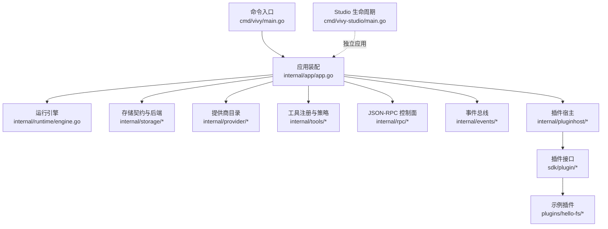
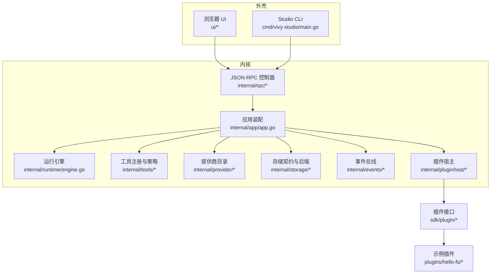
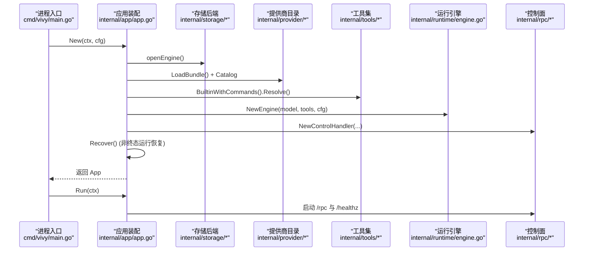
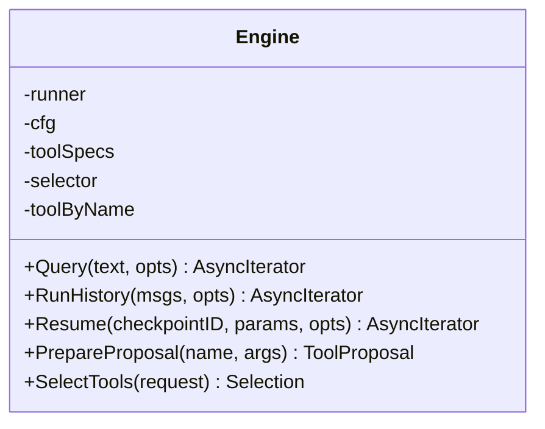
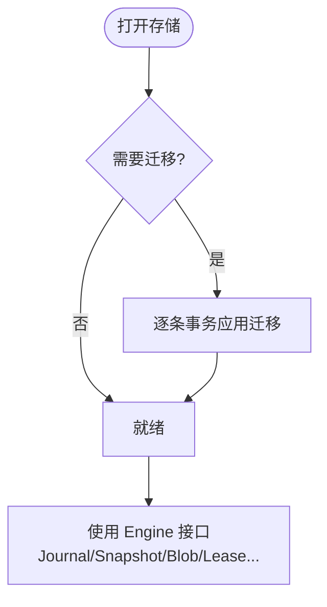
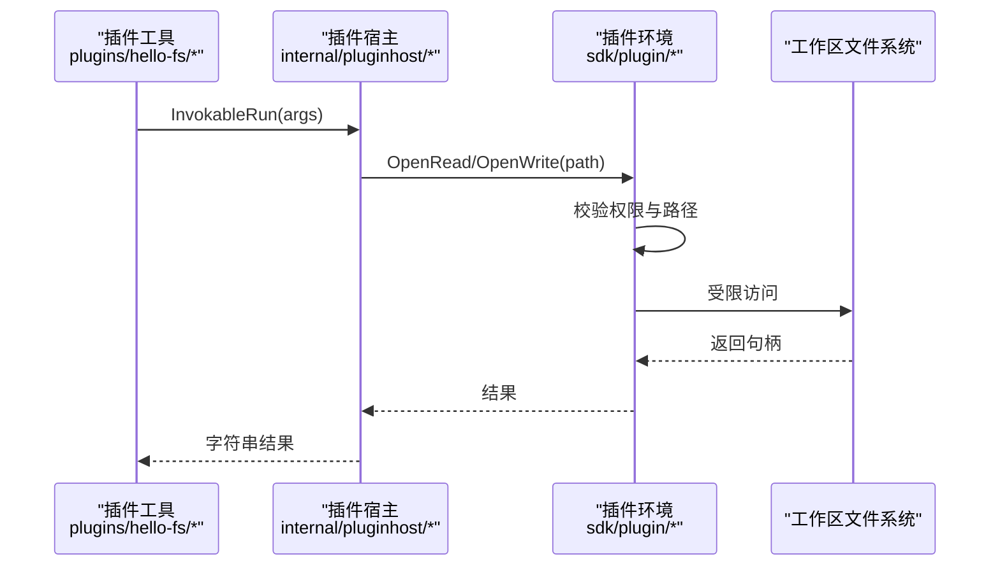
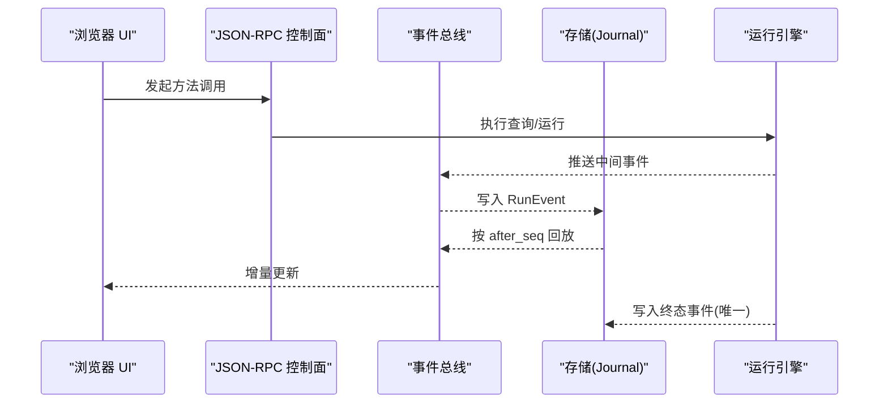
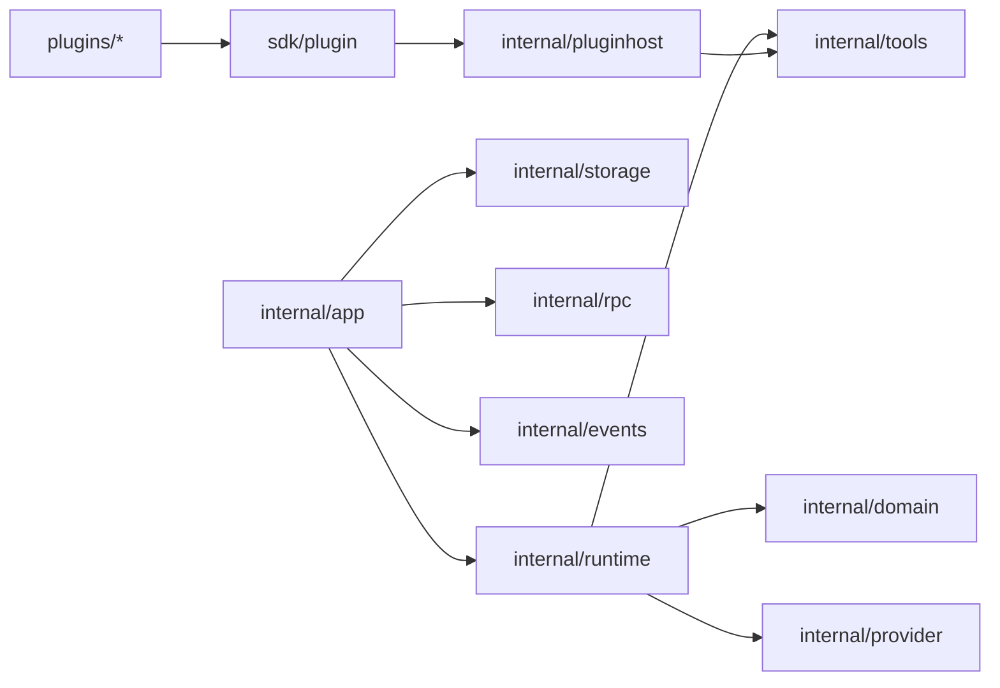

# 整体架构概览

<cite>
**本文引用的文件**
- [README.md](file://README.md)
- [AGENT-VIVY-ARCHITECTURE-V0.md](file://docs/AGENT-VIVY-ARCHITECTURE-V0.md)
- [cmd/vivy/main.go](file://cmd/vivy/main.go)
- [cmd/vivy-studio/main.go](file://cmd/vivy-studio/main.go)
- [internal/app/app.go](file://internal/app/app.go)
- [internal/rpc/protocol.go](file://internal/rpc/protocol.go)
- [internal/runtime/engine.go](file://internal/runtime/engine.go)
- [internal/storage/contracts.go](file://internal/storage/contracts.go)
- [internal/storage/sqlite/sqlite.go](file://internal/storage/sqlite/sqlite.go)
- [internal/provider/doc.go](file://internal/provider/doc.go)
- [internal/tools/doc.go](file://internal/tools/doc.go)
- [internal/pluginhost/host.go](file://internal/pluginhost/host.go)
- [sdk/plugin/plugin.go](file://sdk/plugin/plugin.go)
- [plugins/hello-fs/plugin.go](file://plugins/hello-fs/plugin.go)
- [internal/domain/event.go](file://internal/domain/event.go)
</cite>

## 目录
1. [简介](#简介)
2. [项目结构](#项目结构)
3. [核心组件](#核心组件)
4. [架构总览](#架构总览)
5. [详细组件分析](#详细组件分析)
6. [依赖关系分析](#依赖关系分析)
7. [性能考量](#性能考量)
8. [故障排查指南](#故障排查指南)
9. [结论](#结论)
10. [附录](#附录)

## 简介
Agent-Vivy 是一个以 Eino 为执行引擎的个人网关 Agent 运行时，采用单 Go 模块组织，默认内嵌 React + Vite UI。系统遵循“内核（Vivy）与外壳（Studio）严格分离”的原则：vivy.exe 是日常运行的物种进程，vivy-studio 是独立的生命周期管理工具；两者通过明确的边界协作，不互相侵入。存储层以 Vivy 自有契约为中心，SQLite 为默认实现，Postgres 为可选后端；事件总线承载 RunEvent 词汇表，作为持久化、RPC 通知与 UI 重建的唯一事实源。插件体系通过 sdk/plugin 暴露最小能力窗口，由 pluginhost 适配到内部工具契约，配合沙箱与工作区隔离确保安全。

## 项目结构
- cmd：可执行程序入口（vivy 与 vivy-studio）
- internal：内核实现（app 装配、runtime 引擎、provider 模型、tools 工具集、storage 存储契约与后端、rpc 控制面、events 事件总线、domain 领域模型等）
- plugins：用户插件示例（hello-fs）
- sdk：插件作者导入窗与打包器（vivy-sdk）
- ui：前端资源（默认嵌入发布路径）
- docs：架构决策与规划文档
- fixtures/schemas：测试夹具与 JSON Schema

图表来源
- [cmd/vivy/main.go:23-74](file://cmd/vivy/main.go#L23-L74)
- [internal/app/app.go:63-363](file://internal/app/app.go#L63-L363)
- [internal/runtime/engine.go:69-117](file://internal/runtime/engine.go#L69-L117)
- [internal/storage/contracts.go:252-273](file://internal/storage/contracts.go#L252-L273)
- [internal/provider/doc.go:1-18](file://internal/provider/doc.go#L1-L18)
- [internal/tools/doc.go:1-11](file://internal/tools/doc.go#L1-L11)
- [internal/rpc/protocol.go:1-18](file://internal/rpc/protocol.go#L1-L18)
- [internal/pluginhost/host.go:1-37](file://internal/pluginhost/host.go#L1-L37)
- [sdk/plugin/plugin.go:1-88](file://sdk/plugin/plugin.go#L1-L88)
- [plugins/hello-fs/plugin.go:1-65](file://plugins/hello-fs/plugin.go#L1-L65)
- [cmd/vivy-studio/main.go:1-100](file://cmd/vivy-studio/main.go#L1-L100)

章节来源
- [README.md:68-95](file://README.md#L68-L95)
- [AGENT-VIVY-ARCHITECTURE-V0.md:33-48](file://docs/AGENT-VIVY-ARCHITECTURE-V0.md#L33-L48)

## 核心组件
- 运行时层（internal/runtime）：封装 Eino ChatModelAgent 与 Runner，提供 Query/RunHistory/Resume 等调用入口，负责工具选择、上下文与流式事件边界、检查点桥接、治理策略与钩子链。
- 工具层（internal/tools）：注册 ToolSpec，按配置启用只读自动执行与效果型工具审批；通过适配器将业务工具接入 Eino 工具节点。
- 存储层（internal/storage）：定义 Journal/Snapshot/Blob/Lease 等契约及会话、消息、运行、审批、问题、笔记、技能修订、待办、工作室对象等存储接口；SQLite 为默认实现，Postgres 为可选后端。
- 提供商层（internal/provider）：预置 OpenAI/Anthropic 与 Mock 提供商，YAML Bundle 描述模型能力，密钥从环境变量读取且不持久化。
- 控制面（internal/rpc）：本地双向 JSON-RPC 协议，WebSocket 传输，统一背压与帧大小限制，供 UI 与 Studio 调用。
- 事件总线（internal/events）：基于 after_seq 游标重放 RunEvent，保证 UI 与日志一致。
- 插件体系（sdk/plugin + internal/pluginhost）：插件仅能导入 sdk/plugin，通过 Grants 声明权限，pluginhost 将其适配为 Vivy 工具并在工作区内安全访问文件系统。

章节来源
- [internal/runtime/engine.go:18-59](file://internal/runtime/engine.go#L18-L59)
- [internal/tools/doc.go:1-11](file://internal/tools/doc.go#L1-L11)
- [internal/storage/contracts.go:55-94](file://internal/storage/contracts.go#L55-L94)
- [internal/provider/doc.go:1-18](file://internal/provider/doc.go#L1-L18)
- [internal/rpc/protocol.go:1-18](file://internal/rpc/protocol.go#L1-L18)
- [internal/domain/event.go:3-43](file://internal/domain/event.go#L3-L43)
- [internal/pluginhost/host.go:1-37](file://internal/pluginhost/host.go#L1-L37)
- [sdk/plugin/plugin.go:1-88](file://sdk/plugin/plugin.go#L1-L88)

## 架构总览
分层设计原则：
- 运行时层：唯一允许直接依赖 Eino 的包之一，屏蔽 Eino 类型泄漏到 UI 契约（D-007）。
- 工具层：以 Vivy 自有 ToolSpec 为中心，审批策略与钩子在适配器中生效。
- 存储层：契约优先于具体数据库；SQLite 默认，Postgres 可选；Journal 为产品历史唯一事实源。
- 提供商层：Bundle 驱动，密钥来自环境，Mock 用于离线与测试。
- 控制面：JSON-RPC over WebSocket，前后端共享同一协议与背压实现。
- 插件体系：最小导入窗 + 工作区沙箱 + 权限白名单，编译期 verify 与运行期拒绝非法路径。

图表来源
- [cmd/vivy-studio/main.go:1-100](file://cmd/vivy-studio/main.go#L1-L100)
- [internal/app/app.go:63-363](file://internal/app/app.go#L63-L363)
- [internal/rpc/protocol.go:1-18](file://internal/rpc/protocol.go#L1-L18)
- [internal/runtime/engine.go:69-117](file://internal/runtime/engine.go#L69-L117)
- [internal/storage/contracts.go:252-273](file://internal/storage/contracts.go#L252-L273)
- [internal/provider/doc.go:1-18](file://internal/provider/doc.go#L1-L18)
- [internal/tools/doc.go:1-11](file://internal/tools/doc.go#L1-L11)
- [internal/pluginhost/host.go:1-37](file://internal/pluginhost/host.go#L1-L37)
- [sdk/plugin/plugin.go:1-88](file://sdk/plugin/plugin.go#L1-L88)
- [plugins/hello-fs/plugin.go:1-65](file://plugins/hello-fs/plugin.go#L1-L65)

## 详细组件分析

### 启动与装配流程（App 装配根）
- 加载配置与环境覆盖，创建数据目录
- 打开存储后端（SQLite/Postgres），加载 Provider Bundles，构建 Catalog
- 组装工具集（内置 + 插件），构建策略引擎与工具钩子链
- 构建 Eino Engine（ChatModelAgent + Runner），注入检查点与策略
- 构建 Service 与事件总线，注册 Studio/Eval/子进程路由
- 启动 HTTP 服务（/rpc、/healthz、内嵌 UI），并在监听前完成恢复（Recover）

图表来源
- [cmd/vivy/main.go:23-74](file://cmd/vivy/main.go#L23-L74)
- [internal/app/app.go:63-363](file://internal/app/app.go#L63-L363)
- [internal/runtime/engine.go:69-117](file://internal/runtime/engine.go#L69-L117)
- [internal/provider/doc.go:1-18](file://internal/provider/doc.go#L1-L18)
- [internal/tools/doc.go:1-11](file://internal/tools/doc.go#L1-L11)
- [internal/rpc/protocol.go:1-18](file://internal/rpc/protocol.go#L1-L18)

章节来源
- [internal/app/app.go:63-363](file://internal/app/app.go#L63-L363)
- [cmd/vivy/main.go:23-74](file://cmd/vivy/main.go#L23-L74)

### 运行引擎（Eino 集成）
- 将工具包装为 Eino BaseTool，注入策略与结果大小限制
- 通过 adk.ChatModelAgent 与 Runner 执行，支持流式输出与检查点
- 提供 Query/RunHistory/Resume 三种调用模式，分别对应新消息、历史重建与中断恢复
- 工具选择由 Selector 根据请求上下文裁剪可见工具集

图表来源
- [internal/runtime/engine.go:48-117](file://internal/runtime/engine.go#L48-L117)
- [internal/runtime/engine.go:119-166](file://internal/runtime/engine.go#L119-L166)

章节来源
- [internal/runtime/engine.go:18-166](file://internal/runtime/engine.go#L18-L166)

### 存储契约与 SQLite 后端
- 契约：Journal（追加有序事件）、Snapshot/Blob/Lease（状态与检查点）、会话/消息/运行/审批/问题/笔记/技能修订/待办/工作室对象等
- SQLite 实现：迁移脚本顺序应用，单写者避免竞争；快照与 Blob 分句柄；提供 CN 一致性套件验证
- Postgres 为可选后端，通过实例租约确保单一进程拥有 Journal

图表来源
- [internal/storage/sqlite/sqlite.go:17-55](file://internal/storage/sqlite/sqlite.go#L17-L55)
- [internal/storage/sqlite/sqlite.go:109-147](file://internal/storage/sqlite/sqlite.go#L109-L147)
- [internal/storage/contracts.go:55-94](file://internal/storage/contracts.go#L55-L94)

章节来源
- [internal/storage/contracts.go:55-94](file://internal/storage/contracts.go#L55-L94)
- [internal/storage/sqlite/sqlite.go:1-88](file://internal/storage/sqlite/sqlite.go#L1-L88)

### 提供商层（Provider）
- 预置 OpenAI（eino-ext 组件）与 Anthropic（自适配 Messages API），以及 Mock
- YAML Bundle 描述模型能力与默认值；密钥从环境变量读取，绝不持久化
- Catalog 按名称解析 ProviderRef，构造 ChatModel

章节来源
- [internal/provider/doc.go:1-18](file://internal/provider/doc.go#L1-L18)
- [internal/app/app.go:89-124](file://internal/app/app.go#L89-L124)

### 工具层与审批策略
- 工具按 ToolSpec 注册，只读工具自动执行，效果型工具触发审批或提问
- 策略引擎在适配器中拦截执行，支持钩子链审计与限流
- 工具选择受请求上下文与配置裁剪

章节来源
- [internal/tools/doc.go:1-11](file://internal/tools/doc.go#L1-L11)
- [internal/runtime/engine.go:80-117](file://internal/runtime/engine.go#L80-L117)
- [internal/app/app.go:189-235](file://internal/app/app.go#L189-L235)

### 插件体系与安全沙箱
- 插件仅能导入 sdk/plugin，声明 Seam、Grants、Effect 与 Tool
- pluginhost 将插件工具适配为 Vivy Tool，并通过 WorkspaceLookup 限定文件访问范围
- 路径校验拒绝绝对路径、穿越目录与危险字符，缺失权限直接拒绝

图表来源
- [internal/pluginhost/host.go:57-142](file://internal/pluginhost/host.go#L57-L142)
- [sdk/plugin/plugin.go:61-88](file://sdk/plugin/plugin.go#L61-L88)
- [plugins/hello-fs/plugin.go:39-56](file://plugins/hello-fs/plugin.go#L39-L56)

章节来源
- [internal/pluginhost/host.go:1-166](file://internal/pluginhost/host.go#L1-L166)
- [sdk/plugin/plugin.go:1-88](file://sdk/plugin/plugin.go#L1-L88)
- [plugins/hello-fs/plugin.go:1-65](file://plugins/hello-fs/plugin.go#L1-L65)

### 控制面与事件流（JSON-RPC + 事件总线）
- JSON-RPC 协议统一帧大小与背压，支持请求/响应与通知
- 事件总线按 after_seq 游标重放 RunEvent，UI 与日志均基于此重建状态
- 每个 Run 恰好一个终态事件，保证状态机一致性

图表来源
- [internal/rpc/protocol.go:182-230](file://internal/rpc/protocol.go#L182-L230)
- [internal/domain/event.go:93-129](file://internal/domain/event.go#L93-L129)
- [internal/storage/contracts.go:55-64](file://internal/storage/contracts.go#L55-L64)

章节来源
- [internal/rpc/protocol.go:1-374](file://internal/rpc/protocol.go#L1-L374)
- [internal/domain/event.go:3-129](file://internal/domain/event.go#L3-L129)

### Studio 外壳（独立应用）
- vivy-studio 维护 Worktree/Generation/EvalRun/Release/Install 账本，调用 vivy-sdk 进行打包与评估
- 与内核严格分离，不触碰物种 Journal；通过 inspect 等只读接口了解运行态

章节来源
- [cmd/vivy-studio/main.go:1-100](file://cmd/vivy-studio/main.go#L1-L100)

## 依赖关系分析
- 耦合与内聚：
  - runtime 与 provider 是唯一允许依赖 Eino 的包，其他层通过 domain 与契约解耦
  - storage 契约被所有持久化相关组件依赖，SQLite/Postgres 实现替换不影响上层
  - tools 与 pluginhost 通过 ToolSpec 与 sdk/plugin 接口解耦，便于扩展
- 外部依赖：
  - Eino（adk/compose/schema）仅在 runtime/provider 使用
  - SQLite 纯 Go 实现，无 CGO 依赖，利于跨平台单二进制
- 潜在循环依赖：通过契约与接口隔离，未见循环引用迹象

图表来源
- [internal/runtime/engine.go:1-16](file://internal/runtime/engine.go#L1-L16)
- [internal/app/app.go:13-39](file://internal/app/app.go#L13-L39)
- [internal/storage/contracts.go:252-273](file://internal/storage/contracts.go#L252-L273)
- [internal/pluginhost/host.go:1-17](file://internal/pluginhost/host.go#L1-L17)
- [sdk/plugin/plugin.go:1-18](file://sdk/plugin/plugin.go#L1-L18)

章节来源
- [AGENT-VIVY-ARCHITECTURE-V0.md:33-48](file://docs/AGENT-VIVY-ARCHITECTURE-V0.md#L33-L48)
- [internal/storage/contracts.go:252-273](file://internal/storage/contracts.go#L252-L273)

## 性能考量
- 流式事件缓冲：EngineConfig.StreamBuffer 控制下游事件扇出通道容量，避免背压阻塞
- 事件负载上限：MaxEventPayloadBytes 限制单次事件大小，防止内存膨胀
- 上下文与历史限制：MaxContextBytes/MaxHistoryMessages 控制模型输入规模
- 工具结果限制：MaxToolResultBytes 限制返回给 Eino 的结果大小，避免上下文溢出
- 迭代次数保护：MaxToolTurns 限制模型生成循环，超出则分类为失败终态
- 存储单写者：SQLite 单连接减少锁争用，WAL 与锁参数不泄露至契约层
- 关闭窗口：Graceful shutdown 控制在 ~5s 内，确保终态事件先于存储关闭

章节来源
- [internal/runtime/engine.go:18-46](file://internal/runtime/engine.go#L18-L46)
- [internal/storage/sqlite/sqlite.go:40-55](file://internal/storage/sqlite/sqlite.go#L40-L55)
- [internal/app/app.go:41-45](file://internal/app/app.go#L41-L45)

## 故障排查指南
- 启动失败：
  - 配置未找到或无效：回退内置默认并告警；若设置环境变量覆盖需重新验证
  - 存储打开失败：检查 SQLite 路径权限或 Postgres DSN 环境变量
  - Provider Bundle 缺失：bundle 文件不存在会中止启动
- 运行异常：
  - 终态事件重复：Journal.Append 对已有关闭的运行拒绝追加
  - 审批冲突：DecideApproval 首次写入获胜，后续返回失败
  - 检查点版本不匹配：VersionedCheckpointStore 版本校验失败时中止恢复
- 插件错误：
  - 权限不足：OpenRead/OpenWrite 缺少 Grant 返回 ErrDenied
  - 路径非法：包含绝对路径、穿越目录或危险字符返回 ErrInvalidArgs
- 事件与 UI：
  - UI 状态不同步：确认 after_seq 游标正确推进，事件经总线重放

章节来源
- [internal/storage/contracts.go:11-31](file://internal/storage/contracts.go#L11-L31)
- [internal/storage/contracts.go:163-176](file://internal/storage/contracts.go#L163-L176)
- [internal/pluginhost/host.go:76-142](file://internal/pluginhost/host.go#L76-L142)
- [internal/app/app.go:316-323](file://internal/app/app.go#L316-L323)

## 结论
Agent-Vivy 以 Eino 为执行引擎，围绕“个人网关、日志即一等公民、提供商目录化、大模块化分解”四大哲学锚点，构建了清晰的分层架构。运行时层屏蔽 Eino 细节，工具层以契约为中心，存储层以契约优先与可替换后端为核心，提供商层以 Bundle 与环境密钥管理。控制面与事件总线提供一致的交互与可观测性。插件体系通过最小导入窗与工作区沙箱保障安全与可扩展性。内核与外壳严格分离，使日常开发与生命周期管理各司其职，便于演进与维护。

## 附录
- 关键特性
  - 可扩展性：工具与插件通过标准接口扩展；存储后端可替换；提供商可通过 Bundle 扩展
  - 插件化架构：sdk/plugin 暴露最小能力，pluginhost 适配到内部工具契约，编译期 verify 与运行期权限校验
  - 安全沙箱：工作区隔离、路径白名单、权限授予、网络与命令执行策略
  - 事件驱动：RunEvent 词汇表贯穿持久化、RPC 与 UI，after_seq 游标保证一致性
  - 恢复与一致性：重启恢复非终态运行，Exactly-One-Terminal 保证终态唯一