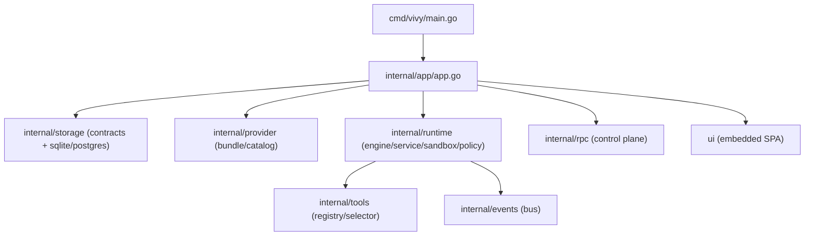
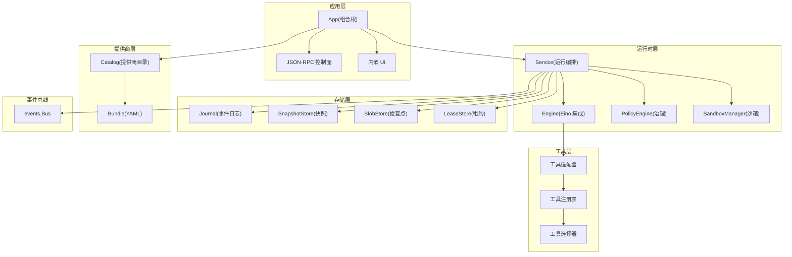
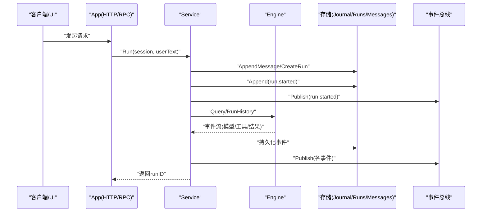
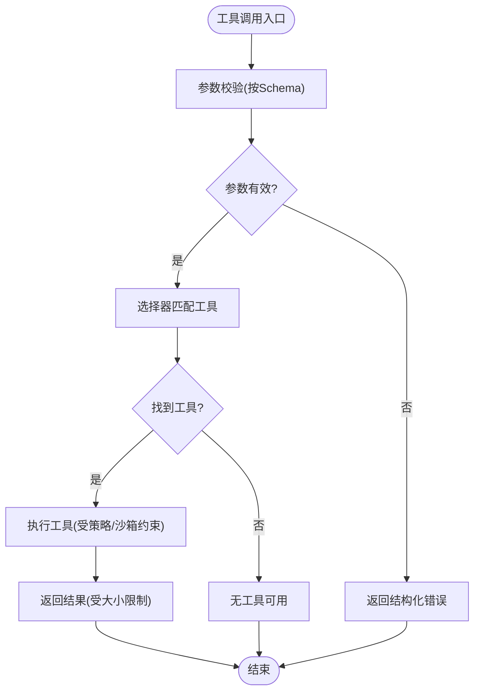
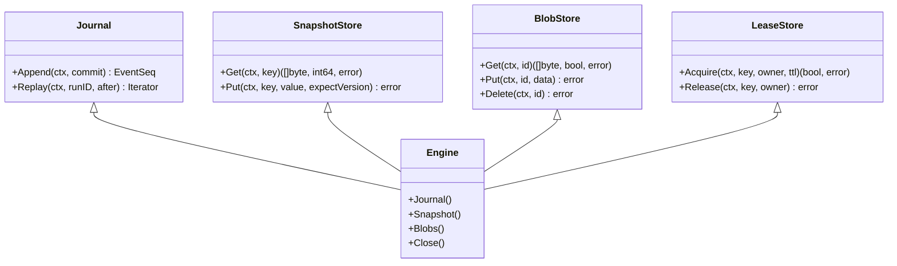
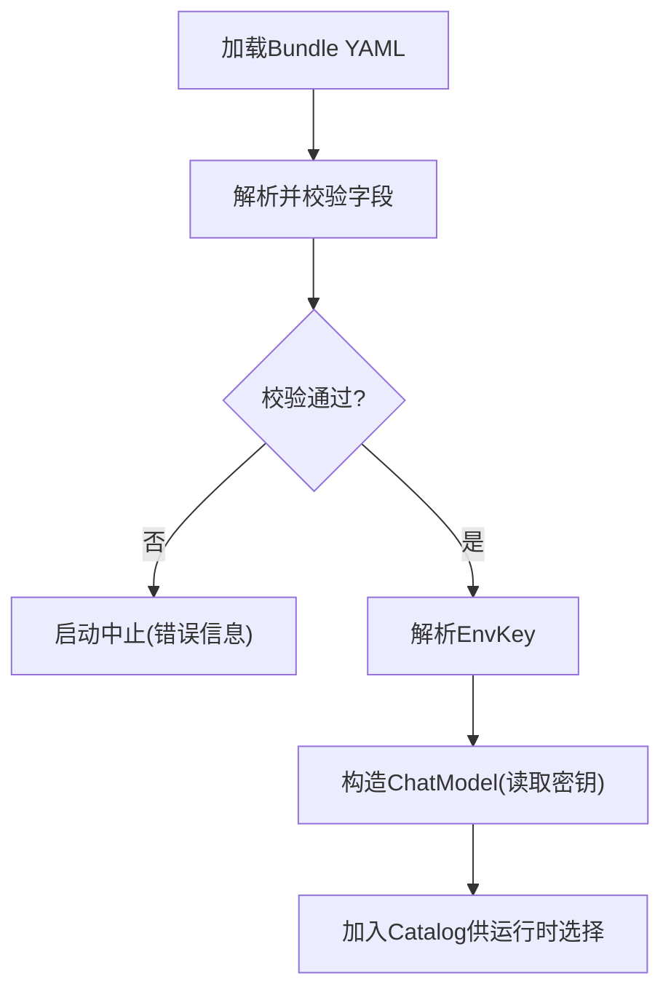
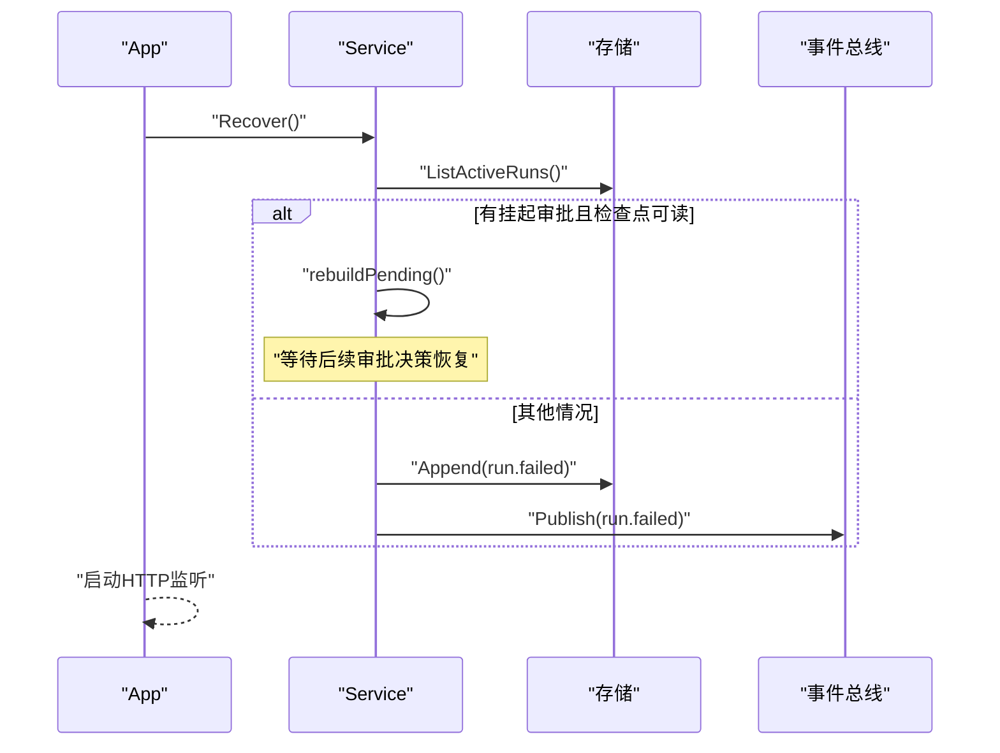
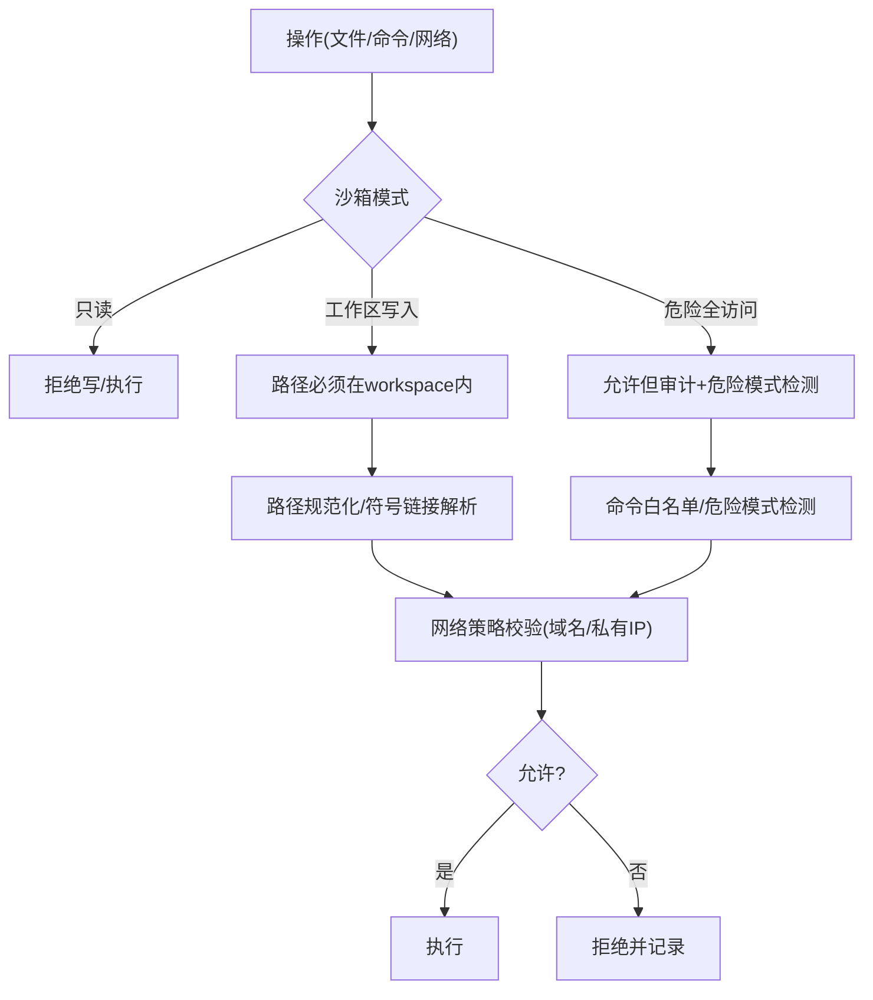
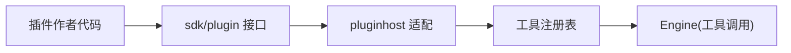
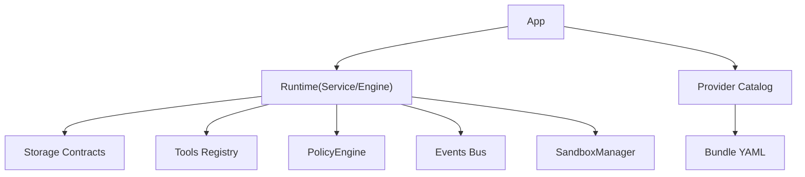

# 架构设计

<cite>
**本文引用的文件**
- [cmd/vivy/main.go](file://cmd/vivy/main.go)
- [internal/app/app.go](file://internal/app/app.go)
- [internal/runtime/engine.go](file://internal/runtime/engine.go)
- [internal/runtime/service.go](file://internal/runtime/service.go)
- [internal/provider/bundle.go](file://internal/provider/bundle.go)
- [internal/storage/contracts.go](file://internal/storage/contracts.go)
- [internal/storage/sqlite/sqlite.go](file://internal/storage/sqlite/sqlite.go)
- [internal/events/bus.go](file://internal/events/bus.go)
- [internal/tools/tools.go](file://internal/tools/tools.go)
- [internal/runtime/sandbox_manager.go](file://internal/runtime/sandbox_manager.go)
- [internal/config/config.go](file://internal/config/config.go)
- [sdk/plugin/plugin.go](file://sdk/plugin/plugin.go)
- [docs/AGENT-VIVY-ARCHITECTURE-V0.md](file://docs/AGENT-VIVY-ARCHITECTURE-V0.md)
</cite>

## 目录
1. [简介](#简介)
2. [项目结构](#项目结构)
3. [核心组件](#核心组件)
4. [架构总览](#架构总览)
5. [详细组件分析](#详细组件分析)
6. [依赖关系分析](#依赖关系分析)
7. [性能与可扩展性](#性能与可扩展性)
8. [横切关注点：安全、监控、灾难恢复](#横切关注点安全监控灾难恢复)
9. [故障排查指南](#故障排查指南)
10. [结论](#结论)

## 简介
本仓库实现 Agent-Vivy 的运行时（vivy.exe），以 cloudwego/eino 为唯一引擎入口，装配个人网关 Agent。系统采用分层架构：运行时层、工具层、存储层、提供商层；通过事件溯源、审批沙箱、插件机制与版本化事件契约，保证可观测、可恢复、可扩展。UI 为内嵌 React + Vite 前端，默认通过同一进程暴露 JSON-RPC 控制面；可选 headless 模式分离 UI。

## 项目结构
- 入口与组装：cmd/vivy/main.go 负责加载配置、启动 worker 或主进程；internal/app/app.go 是组合根，按顺序初始化存储、提供商、运行时、RPC 控制面，并处理优雅关闭与重启恢复。
- 运行时层：internal/runtime 包含 Engine（Eino 集成）、Service（运行编排）、SandboxManager（沙箱策略）、PolicyEngine（治理策略）、ToolAdapter（工具适配）等。
- 工具层：internal/tools 提供内置工具集注册、选择器、参数校验、命令执行封装等。
- 存储层：internal/storage 定义契约（Journal/Snapshot/Blob/Lease 及业务 Store），sqlite/postgres 为具体实现。
- 提供商层：internal/provider 管理预烘焙 Provider Bundle（OpenAI/Anthropic），密钥仅从环境变量读取。
- 事件总线：internal/events.Bus 将持久化的 RunEvent 广播给订阅者，慢消费者会被丢弃并由 RPC 重放。
- 插件体系：sdk/plugin 定义插件作者可见的最小接口；plugins/hello-fs 示例插件；internal/pluginhost 在运行时注入。

图表来源
- [cmd/vivy/main.go:23-74](file://cmd/vivy/main.go#L23-L74)
- [internal/app/app.go:63-362](file://internal/app/app.go#L63-L362)

章节来源
- [cmd/vivy/main.go:23-93](file://cmd/vivy/main.go#L23-L93)
- [internal/app/app.go:63-362](file://internal/app/app.go#L63-L362)

## 核心组件
- 应用组装（App）：负责启动顺序、数据目录、Provider Bundle 加载、Engine 构建、服务依赖注入、HTTP/RPC 路由、健康检查、优雅关闭。
- 运行时引擎（Engine）：基于 Eino 的 ChatModelAgent + Runner，封装工具调用、流式执行、检查点桥接、工具选择与提案准备。
- 运行服务（Service）：编排一次 Run 的生命周期，持久化消息、Run 行、journal 事件，驱动引擎异步执行，处理取消、恢复、预算、工作空间隔离。
- 存储契约（Storage Contracts）：Journal、SnapshotStore、BlobStore、LeaseStore 以及会话、消息、笔记、审批、问题、技能修订、待办、工作室对象等存储抽象。
- 提供商（Provider）：Bundle YAML 描述模型能力与后端类型，密钥通过环境变量注入，支持 OpenAI/Anthropic。
- 工具（Tools）：注册表、选择器、参数校验、命令执行、网络搜索、MCP、顺序思考等工具族。
- 事件总线（Bus）：按 runID 分发事件，终端事件后自动关闭订阅，慢消费者丢弃并由 RPC 重放。
- 沙箱（SandboxManager）：文件路径、命令、网络访问的策略边界，支持只读、工作区写入、危险全访问三种模式。
- 插件（Plugin SDK）：最小导入窗口，限制对内部 API 的直接访问，通过工具世界或 provider 扩展能力。

章节来源
- [internal/app/app.go:63-362](file://internal/app/app.go#L63-L362)
- [internal/runtime/engine.go:18-166](file://internal/runtime/engine.go#L18-L166)
- [internal/runtime/service.go:96-300](file://internal/runtime/service.go#L96-L300)
- [internal/storage/contracts.go:55-273](file://internal/storage/contracts.go#L55-L273)
- [internal/provider/bundle.go:14-150](file://internal/provider/bundle.go#L14-L150)
- [internal/tools/tools.go:17-362](file://internal/tools/tools.go#L17-L362)
- [internal/events/bus.go:10-115](file://internal/events/bus.go#L10-L115)
- [internal/runtime/sandbox_manager.go:27-286](file://internal/runtime/sandbox_manager.go#L27-L286)
- [sdk/plugin/plugin.go:1-88](file://sdk/plugin/plugin.go#L1-L88)

## 架构总览
整体遵循“单一 Go 模块 + Eino 引擎门”的设计原则，所有 Eino 类型被隔离在 internal/runtime 与 internal/provider。运行时通过 Service 编排 Run，使用 Engine 驱动 Eino Runner，事件经 Journal 持久化并通过 Bus 广播。存储层以 SQLite 为默认参考后端，Postgres 作为可选服务器端 Journal。沙箱与策略贯穿工具调用与命令执行。插件通过 sdk/plugin 暴露最小能力，由 pluginhost 注入到工具集。

图表来源
- [internal/app/app.go:63-362](file://internal/app/app.go#L63-L362)
- [internal/runtime/engine.go:61-166](file://internal/runtime/engine.go#L61-L166)
- [internal/runtime/service.go:96-300](file://internal/runtime/service.go#L96-L300)
- [internal/storage/contracts.go:55-273](file://internal/storage/contracts.go#L55-L273)
- [internal/provider/bundle.go:14-150](file://internal/provider/bundle.go#L14-L150)
- [internal/events/bus.go:10-115](file://internal/events/bus.go#L10-L115)

## 详细组件分析

### 运行时层：Engine 与 Service
- Engine 负责创建 Eino 的 ChatModelAgent 与 Runner，绑定工具集合、最大迭代次数、检查点存储、策略与钩子链。对外暴露 Query/RunHistory/Resume 方法，统一事件流。
- Service 负责一次 Run 的完整生命周期：持久化用户消息、创建 Run 行、追加 run.started 事件、激活状态、异步驱动引擎、处理取消、恢复、预算、工作空间隔离、交互超时清理。

图表来源
- [internal/runtime/service.go:212-300](file://internal/runtime/service.go#L212-L300)
- [internal/runtime/engine.go:144-166](file://internal/runtime/engine.go#L144-L166)
- [internal/events/bus.go:42-75](file://internal/events/bus.go#L42-L75)

章节来源
- [internal/runtime/engine.go:18-166](file://internal/runtime/engine.go#L18-L166)
- [internal/runtime/service.go:96-300](file://internal/runtime/service.go#L96-L300)

### 工具层：注册、选择与执行
- 工具注册表集中管理内置工具族（笔记、文件、任务、网络搜索、HTTP、MCP、顺序思考、命令执行等）。
- 选择器根据请求关键词与工具 manifest 进行保守匹配，避免无关工具进入上下文。
- 参数校验在工具调用前完成，确保无效参数不会触发副作用。

图表来源
- [internal/tools/tools.go:41-84](file://internal/tools/tools.go#L41-L84)
- [internal/tools/tools.go:138-181](file://internal/tools/tools.go#L138-L181)
- [internal/runtime/engine.go:80-117](file://internal/runtime/engine.go#L80-L117)

章节来源
- [internal/tools/tools.go:17-362](file://internal/tools/tools.go#L17-L362)

### 存储层：事件溯源与契约
- 契约定义 Journal、SnapshotStore、BlobStore、LeaseStore 及业务存储接口，SQLite 为默认实现，Postgres 为可选服务器端后端。
- Journal 保证追加有序、单调 seq、每个 Run 恰好一个终态事件；BlobStore 用于 Eino 检查点字节，带版本与原子指针翻转；LeaseStore 用于实例独占与恢复协调。

图表来源
- [internal/storage/contracts.go:55-273](file://internal/storage/contracts.go#L55-L273)
- [internal/storage/sqlite/sqlite.go:64-88](file://internal/storage/sqlite/sqlite.go#L64-L88)

章节来源
- [internal/storage/contracts.go:55-273](file://internal/storage/contracts.go#L55-L273)
- [internal/storage/sqlite/sqlite.go:17-147](file://internal/storage/sqlite/sqlite.go#L17-L147)

### 提供商层：Bundle 与密钥边界
- Provider Bundle 以 YAML 声明模型能力、后端类型、默认模型、密钥环境变量名等，严格校验字段与来源溯源。
- 密钥不在配置中持久化，仅在模型构造时从环境变量读取；缺失则启动失败并给出可操作提示。

图表来源
- [internal/provider/bundle.go:71-150](file://internal/provider/bundle.go#L71-L150)
- [internal/app/app.go:89-123](file://internal/app/app.go#L89-L123)

章节来源
- [internal/provider/bundle.go:14-150](file://internal/provider/bundle.go#L14-L150)
- [internal/app/app.go:89-123](file://internal/app/app.go#L89-L123)

### 事件溯源与恢复
- 每次 Run 的终态事件唯一且持久化；恢复阶段扫描非终态 Run，若存在有效审批与可读检查点则重建挂起状态等待决策，否则标记失败。
- 事件通过 Bus 广播，慢消费者丢弃并由 RPC 重放；健康检查在恢复阶段后可用。

图表来源
- [internal/runtime/service.go:465-576](file://internal/runtime/service.go#L465-L576)
- [internal/events/bus.go:42-75](file://internal/events/bus.go#L42-L75)

章节来源
- [internal/runtime/service.go:465-576](file://internal/runtime/service.go#L465-L576)
- [internal/events/bus.go:10-115](file://internal/events/bus.go#L10-L115)

### 沙箱与安全策略
- SandboxManager 支持只读、工作区写入、危险全访问三种模式；校验文件路径（含符号链接与穿越）、命令白名单、网络域名与私有 IP 策略。
- 策略引擎（PolicyEngine）基于治理配置文件，对工具调用进行 allow/prompt/deny 决策，并可附加原因。

图表来源
- [internal/runtime/sandbox_manager.go:85-234](file://internal/runtime/sandbox_manager.go#L85-L234)
- [internal/config/config.go:161-192](file://internal/config/config.go#L161-L192)

章节来源
- [internal/runtime/sandbox_manager.go:27-286](file://internal/runtime/sandbox_manager.go#L27-L286)
- [internal/config/config.go:161-192](file://internal/config/config.go#L161-L192)

### 插件架构
- 插件作者仅能导入 sdk/plugin，暴露 Name/Seam/Grants/Tools；工具通过 Env 访问受限的工作区文件系统。
- 运行时通过 pluginhost 将生成的 Register 注入工具集，不修改 engine.go；打包流程生成新的物种 EXE。

图表来源
- [sdk/plugin/plugin.go:61-88](file://sdk/plugin/plugin.go#L61-L88)
- [internal/app/app.go:195-206](file://internal/app/app.go#L195-L206)

章节来源
- [sdk/plugin/plugin.go:1-88](file://sdk/plugin/plugin.go#L1-L88)
- [internal/app/app.go:195-206](file://internal/app/app.go#L195-L206)

## 依赖关系分析
- 应用层依赖运行时与服务，运行时依赖存储契约、工具、策略、事件总线；提供商层通过 Bundle 与 Catalog 注入模型能力。
- 存储层通过契约解耦具体实现；SQLite 满足全部契约，Postgres 作为可选后端。
- 事件总线与 RPC 控制面共享事件源，UI 通过重放构建状态，不持有内存状态。

图表来源
- [internal/app/app.go:63-362](file://internal/app/app.go#L63-L362)
- [internal/runtime/service.go:96-300](file://internal/runtime/service.go#L96-L300)
- [internal/storage/contracts.go:55-273](file://internal/storage/contracts.go#L55-L273)
- [internal/provider/bundle.go:14-150](file://internal/provider/bundle.go#L14-L150)

章节来源
- [internal/app/app.go:63-362](file://internal/app/app.go#L63-L362)
- [internal/runtime/service.go:96-300](file://internal/runtime/service.go#L96-L300)
- [internal/storage/contracts.go:55-273](file://internal/storage/contracts.go#L55-L273)
- [internal/provider/bundle.go:14-150](file://internal/provider/bundle.go#L14-L150)

## 性能与可扩展性
- 流式缓冲与事件负载上限：EngineConfig 中的 StreamBuffer 与 MaxEventPayloadBytes 控制下游扇出与单事件大小，防止背压阻塞。
- 工具调用与上下文限制：MaxToolTurns、MaxContextBytes、MaxHistoryMessages、MaxToolResultBytes 限制模型循环与上下文占用，避免无限增长。
- 存储后端替换：通过 storage.Engine 契约可切换 SQLite/Postgres，Postgres 提供服务器端 Journal 与实例租约。
- 插件扩展：通过 sdk/plugin 增加新工具，无需修改引擎核心；打包流程生成新物种 EXE。
- 工作区隔离：每个后台 Run 分配独立工作区，避免跨 Run 干扰。

章节来源
- [internal/runtime/engine.go:18-46](file://internal/runtime/engine.go#L18-L46)
- [internal/config/config.go:110-153](file://internal/config/config.go#L110-L153)
- [internal/storage/contracts.go:252-273](file://internal/storage/contracts.go#L252-L273)
- [sdk/plugin/plugin.go:61-88](file://sdk/plugin/plugin.go#L61-L88)

## 横切关注点：安全、监控、灾难恢复
- 安全
  - 密钥边界：配置不持久化密钥，仅保存 env_key 名称；日志、快照、事件负载脱敏。
  - 沙箱策略：文件路径、命令白名单、网络域名与私有 IP 限制；危险命令模式检测。
  - 策略引擎：基于治理配置文件对工具调用进行 allow/prompt/deny 决策。
- 监控
  - 事件溯源：所有模型可见输入输出与工具调用均持久化为 RunEvent，支持按 run_id/seq 重放。
  - 健康检查：/healthz 在恢复阶段后可用，指示服务就绪。
  - 审计钩子：RunHook 可接入审计日志。
- 灾难恢复
  - 重启恢复：Service.Recover 将非终态 Run 归一化，要么重建挂起等待审批，要么写入 run.failed。
  - 终止事件唯一：Journal 保证每个 Run 仅一个终态事件，防止重复。
  - 优雅关闭：按反向顺序关闭服务、HTTP 与存储，确保终端事件持久化。

章节来源
- [internal/config/config.go:1-13](file://internal/config/config.go#L1-L13)
- [internal/runtime/sandbox_manager.go:85-234](file://internal/runtime/sandbox_manager.go#L85-L234)
- [internal/runtime/service.go:465-576](file://internal/runtime/service.go#L465-L576)
- [internal/storage/contracts.go:11-31](file://internal/storage/contracts.go#L11-L31)
- [internal/app/app.go:316-362](file://internal/app/app.go#L316-L362)

## 故障排查指南
- 启动失败
  - 配置校验失败：检查 server.addr、storage.backend、providers.active、tools.enabled 等必填项与取值范围。
  - 提供商密钥缺失：确认环境变量已设置对应 env_key；缺失会中止启动并给出可操作提示。
- 运行异常
  - 工具参数错误：查看 tool.finished 事件中的 ArgError 字段定位参数问题。
  - 沙箱拒绝：检查文件路径是否越界、命令是否在白名单、网络域名是否允许。
  - 审批超时：确认 pending approval/question 是否过期；服务会定期清理并标记失效。
- 恢复问题
  - 检查点不可读：恢复阶段会失败并关闭 Run；需检查检查点存储与版本兼容性。
  - 多进程冲突：Postgres 模式下实例租约冲突会导致启动失败；确保单实例拥有 Journal。

章节来源
- [internal/config/config.go:316-528](file://internal/config/config.go#L316-L528)
- [internal/provider/bundle.go:71-150](file://internal/provider/bundle.go#L71-L150)
- [internal/runtime/sandbox_manager.go:85-234](file://internal/runtime/sandbox_manager.go#L85-L234)
- [internal/runtime/service.go:465-576](file://internal/runtime/service.go#L465-L576)

## 结论
Agent-Vivy 以 Eino 为引擎门，围绕事件溯源、沙箱策略、插件扩展与契约化存储构建了高内聚、低耦合的分层架构。通过严格的配置校验、密钥边界、策略与沙箱控制，系统在安全性与可观测性上具备坚实基础；通过存储契约与插件机制，系统在可扩展性与可替换性上保持灵活。未来可在策略细化、工具生态、存储后端与评估框架方面持续演进。