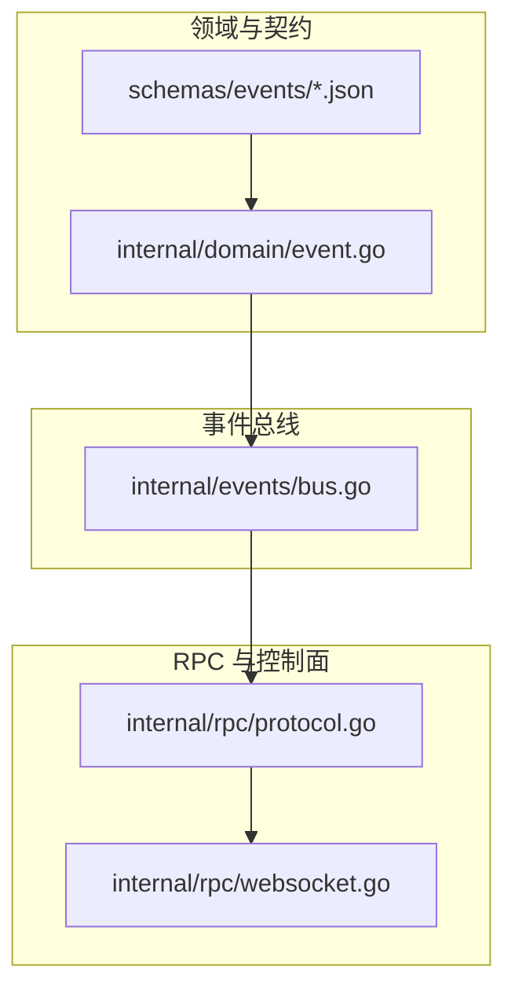
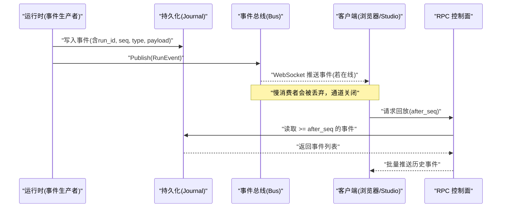
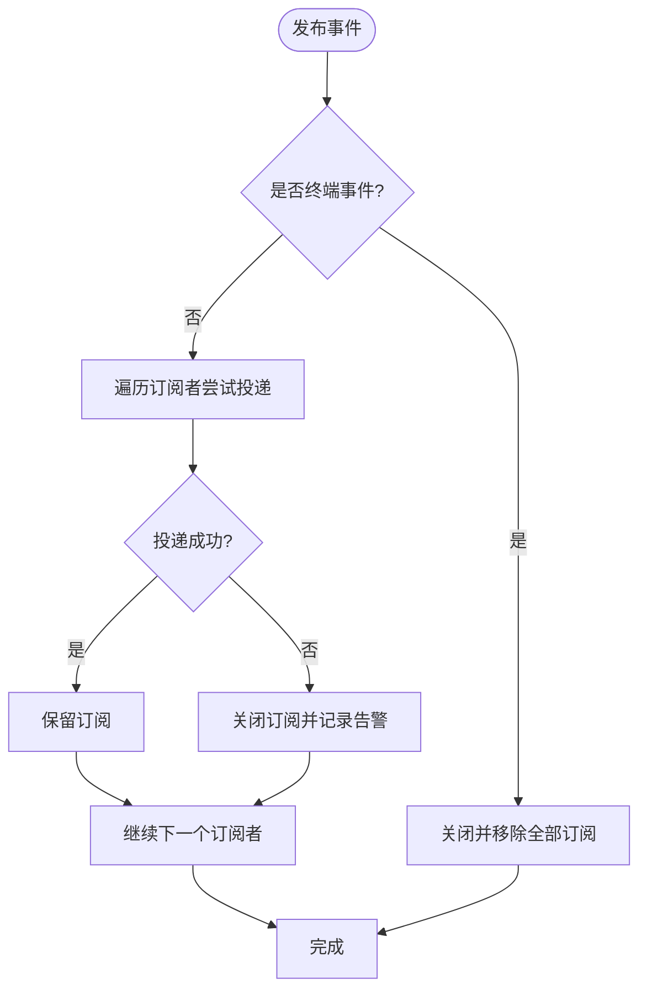
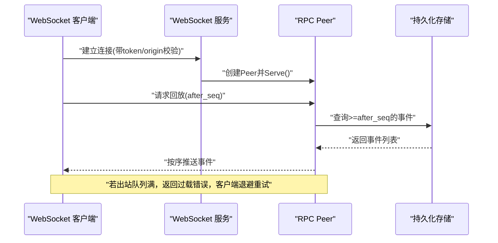

# 事件处理

<cite>
**本文引用的文件**
- [internal/events/bus.go](file://internal/events/bus.go)
- [internal/domain/event.go](file://internal/domain/event.go)
- [schemas/events/run-event.schema.json](file://schemas/events/run-event.schema.json)
- [schemas/events/payloads/run.started.json](file://schemas/events/payloads/run.started.json)
- [schemas/events/payloads/tool.requested.json](file://schemas/events/payloads/tool.requested.json)
- [schemas/events/payloads/model.delta.json](file://schemas/events/payloads/model.delta.json)
- [schemas/events/payloads/model.completed.json](file://schemas/events/payloads/model.completed.json)
- [schemas/events/payloads/run.completed.json](file://schemas/events/payloads/run.completed.json)
- [internal/rpc/protocol.go](file://internal/rpc/protocol.go)
- [internal/rpc/websocket.go](file://internal/rpc/websocket.go)
</cite>

## 目录
1. [简介](#简介)
2. [项目结构](#项目结构)
3. [核心组件](#核心组件)
4. [架构总览](#架构总览)
5. [详细组件分析](#详细组件分析)
6. [依赖关系分析](#依赖关系分析)
7. [性能考量](#性能考量)
8. [故障排查指南](#故障排查指南)
9. [结论](#结论)
10. [附录](#附录)

## 简介
本文件面向 Vivy 运行时的事件处理系统，围绕事件映射器（eventMapper）的工作机制、事件构建与序列号分配、持久化保证、事件类型与载荷定义、事件总线集成与实时推送、断线重连、事件回放、审计日志、监控指标、版本管理与向后兼容、错误处理与重试机制，以及调试与排障进行系统化说明。目标是帮助读者在不深入源码的情况下理解事件从产生到消费的全链路行为，并在出现问题时快速定位根因。

## 项目结构
事件相关代码主要分布在以下位置：
- internal/domain：定义事件类型、RunEvent 结构与终端事件判定等契约。
- schemas/events：以 JSON Schema 形式固化事件信封与载荷的契约，供运行时、RPC 控制面与 UI 共享。
- internal/events：实现内存事件总线 Bus，负责将已持久化的事件按 RunID 分发给在线订阅者。
- internal/rpc：提供本地双向 JSON-RPC 控制面与 WebSocket 传输，承载事件流式推送与重放能力。

图表来源
- [internal/domain/event.go:1-129](file://internal/domain/event.go#L1-L129)
- [schemas/events/run-event.schema.json:1-76](file://schemas/events/run-event.schema.json#L1-L76)
- [internal/events/bus.go:1-115](file://internal/events/bus.go#L1-L115)
- [internal/rpc/protocol.go:1-374](file://internal/rpc/protocol.go#L1-L374)
- [internal/rpc/websocket.go:1-56](file://internal/rpc/websocket.go#L1-L56)

章节来源
- [internal/domain/event.go:1-129](file://internal/domain/event.go#L1-L129)
- [schemas/events/run-event.schema.json:1-76](file://schemas/events/run-event.schema.json#L1-L76)
- [internal/events/bus.go:1-115](file://internal/events/bus.go#L1-L115)
- [internal/rpc/protocol.go:1-374](file://internal/rpc/protocol.go#L1-L374)
- [internal/rpc/websocket.go:1-56](file://internal/rpc/websocket.go#L1-L56)

## 核心组件
- 事件类型与信封：在领域层定义事件词汇表、终端事件判定、RunEvent 结构；JSON Schema 固化信封字段与载荷形状，确保跨进程一致。
- 事件总线：按 RunID 维护订阅者集合，发布事件时非阻塞投递；对慢消费者直接丢弃并关闭通道，后续通过 Journal 回放恢复。
- RPC 控制面：基于 JSON-RPC 的双向通信，支持请求/响应与通知；具备帧大小限制、出站缓冲与背压、有序回调等特性。
- WebSocket 接入：提供鉴权与同源策略校验，将 HTTP 升级为 WebSocket，交由 Peer 处理事件流。

章节来源
- [internal/domain/event.go:1-129](file://internal/domain/event.go#L1-L129)
- [schemas/events/run-event.schema.json:1-76](file://schemas/events/run-event.schema.json#L1-L76)
- [internal/events/bus.go:1-115](file://internal/events/bus.go#L1-L115)
- [internal/rpc/protocol.go:1-374](file://internal/rpc/protocol.go#L1-L374)
- [internal/rpc/websocket.go:1-56](file://internal/rpc/websocket.go#L1-L56)

## 架构总览
事件从运行时产生后，先写入持久化存储（Journal），再由事件总线 Fan-out 给在线订阅者；离线或掉线的客户端通过 RPC 接口按 after_seq 游标回放历史事件。

图表来源
- [internal/events/bus.go:42-75](file://internal/events/bus.go#L42-L75)
- [internal/rpc/protocol.go:120-164](file://internal/rpc/protocol.go#L120-L164)
- [internal/rpc/websocket.go:27-47](file://internal/rpc/websocket.go#L27-L47)

## 详细组件分析

### 事件映射器(eventMapper)工作原理
- 事件构建：由运行时根据当前执行上下文构造 RunEvent，包含 run_id、单调递增的 seq、type、created_at、payload_version 与 payload。
- 序列号分配：每个 run 内 seq 严格单调递增，起始为 1，用于排序与回放游标。
- 持久化保证：事件先落盘再分发，Bus 仅作为优化层不拥有历史；即使总线丢失事件，客户端仍可通过 RPC 回放补全。
- 终端事件：run.completed / run.failed / run.cancelled 等会结束流，总线关闭对应 run 的所有订阅。

章节来源
- [internal/domain/event.go:118-129](file://internal/domain/event.go#L118-L129)
- [schemas/events/run-event.schema.json:7-74](file://schemas/events/run-event.schema.json#L7-L74)
- [internal/events/bus.go:42-75](file://internal/events/bus.go#L42-L75)

### 事件类型与载荷结构
- 事件词汇表：包括 run.*、model.*、tool.*、policy.*、hook.*、user.*、child.* 等类别，覆盖运行生命周期、模型输出、工具调用、策略评估、钩子、用户交互与子任务。
- 载荷版本：payload_version 标识载荷形状版本，消费者可据此拒绝未知版本，保障向后兼容。
- 典型载荷：
  - run.started：包含 provider、model、mode、policy_profile、policy_hash 等运行元信息。
  - tool.requested：包含 tool_call_id、tool_name、args。
  - model.delta：增量文本片段 delta，受最大事件负载限制。
  - model.completed：完整内容 content 与可选用量 input_tokens/output_tokens。
  - run.completed：可选 summary，作为终态事件之一。

章节来源
- [internal/domain/event.go:8-81](file://internal/domain/event.go#L8-L81)
- [schemas/events/run-event.schema.json:18-74](file://schemas/events/run-event.schema.json#L18-L74)
- [schemas/events/payloads/run.started.json:1-35](file://schemas/events/payloads/run.started.json#L1-L35)
- [schemas/events/payloads/tool.requested.json:1-23](file://schemas/events/payloads/tool.requested.json#L1-L23)
- [schemas/events/payloads/model.delta.json:1-15](file://schemas/events/payloads/model.delta.json#L1-L15)
- [schemas/events/payloads/model.completed.json:1-25](file://schemas/events/payloads/model.completed.json#L1-L25)
- [schemas/events/payloads/run.completed.json:1-15](file://schemas/events/payloads/run.completed.json#L1-L15)

### 事件总线集成与实时推送
- 订阅：客户端通过 Subscribe(runID) 获取通道与取消函数；通道容量可配置，默认至少为 1。
- 发布：Publish(ev) 将事件广播给所有订阅者；遇到终端事件则关闭并清理订阅。
- 背压与丢消息保护：若订阅者未及时消费，事件投递失败则立即关闭通道并记录告警；客户端需感知通道关闭并从 last_seq 回放。
- 统计：Subscribers(runID) 可用于诊断与测试。

图表来源
- [internal/events/bus.go:42-75](file://internal/events/bus.go#L42-L75)

章节来源
- [internal/events/bus.go:34-115](file://internal/events/bus.go#L34-L115)

### 事件回放、RPC 与断线重连
- 回放协议：基于 JSON-RPC 的请求/响应与通知；服务端维护出站缓冲与背压，避免雪崩。
- 游标回放：客户端携带 after_seq 请求回放，服务端从持久化中读取并顺序推送，保证幂等与顺序。
- 断线重连：WebSocket 断开后，客户端重新建立连接并以最后已知 seq 回放缺失事件；由于 Bus 不持有历史，回放是唯一恢复路径。
- 安全与限流：WebSocket 服务要求 token 或 Authorization 头，支持同源策略；Peer 限制最大帧大小与出站队列长度。

图表来源
- [internal/rpc/websocket.go:27-47](file://internal/rpc/websocket.go#L27-L47)
- [internal/rpc/protocol.go:120-164](file://internal/rpc/protocol.go#L120-L164)
- [internal/rpc/protocol.go:257-273](file://internal/rpc/protocol.go#L257-L273)

章节来源
- [internal/rpc/protocol.go:120-164](file://internal/rpc/protocol.go#L120-L164)
- [internal/rpc/protocol.go:257-273](file://internal/rpc/protocol.go#L257-L273)
- [internal/rpc/websocket.go:27-47](file://internal/rpc/websocket.go#L27-L47)

### 审计日志与监控指标
- 审计日志：事件本身即为不可变审计轨迹；每条事件包含 run_id、seq、type、created_at、payload_version、payload，可作为审计源。
- 监控指标建议：
  - 事件吞吐：每秒发布/推送事件数。
  - 延迟：事件从持久化到客户端可见的端到端延迟分布。
  - 背压：出站队列满载次数、丢弃订阅次数。
  - 回放：回放请求量、平均回放条数、回放耗时。
  - 错误率：RPC 解析错误、帧过大、内部错误占比。
- 采集点：Bus.Publish、RPC enqueue、WebSocket 升级、回放查询入口。

[本节为通用指导，不直接分析具体文件]

### 事件版本管理与向后兼容
- 版本字段：payload_version 明确载荷形状版本；Schema 中约定消费者应拒绝未知版本。
- 演进策略：新增字段优先采用可选字段；破坏性变更需提升 payload_version 并同步更新 Schema。
- 兼容性检查：在 CI/CD 中引入 Schema 校验，确保生产事件符合契约。

章节来源
- [schemas/events/run-event.schema.json:63-74](file://schemas/events/run-event.schema.json#L63-L74)

### 错误处理与重试机制
- 事件侧：Bus 对慢消费者直接丢弃并关闭通道，避免阻塞；客户端必须检测通道关闭并重试回放。
- RPC 侧：出站队列满时返回过载错误；客户端应指数退避重试；帧过大直接拒绝。
- 终端事件：触发后总线关闭所有订阅，客户端应停止监听并进入终态处理流程。

章节来源
- [internal/events/bus.go:61-75](file://internal/events/bus.go#L61-L75)
- [internal/rpc/protocol.go:158-164](file://internal/rpc/protocol.go#L158-L164)
- [internal/rpc/protocol.go:257-273](file://internal/rpc/protocol.go#L257-L273)

### 事件调试工具与排障清单
- 启用日志：关注 Bus 的“订阅者被丢弃”告警，定位慢消费者或网络抖动。
- 回放验证：使用 after_seq 回放最近 N 条事件，核对 seq 连续性、终端事件唯一性。
- 载荷校验：用 JSON Schema 校验 payload 是否符合当前版本，发现非法字段。
- 常见症状与对策：
  - 客户端长时间无事件：检查 WebSocket 鉴权与同源策略；确认出站队列未持续满载。
  - 事件乱序：确认客户端按 seq 排序合并；回放时服务端保证顺序。
  - 终端事件重复：检查业务逻辑是否误发多次；依据“每 run 恰好一个终态事件”约束排查。

[本节为通用指导，不直接分析具体文件]

## 依赖关系分析
- 低耦合：domain 仅定义契约；events 依赖 domain；rpc 独立于 events，通过外部注入的 Handler 与 Transport 协作。
- 单向依赖：运行时 -> 持久化 -> 事件总线 -> RPC -> 客户端；反向依赖不存在。
- 外部依赖：WebSocket 使用 gorilla/websocket；JSON-RPC 自实现，降低耦合。

图表来源
- [internal/domain/event.go:1-129](file://internal/domain/event.go#L1-L129)
- [internal/events/bus.go:1-115](file://internal/events/bus.go#L1-L115)
- [internal/rpc/protocol.go:1-374](file://internal/rpc/protocol.go#L1-L374)
- [internal/rpc/websocket.go:1-56](file://internal/rpc/websocket.go#L1-L56)
- [schemas/events/run-event.schema.json:1-76](file://schemas/events/run-event.schema.json#L1-L76)

章节来源
- [internal/domain/event.go:1-129](file://internal/domain/event.go#L1-L129)
- [internal/events/bus.go:1-115](file://internal/events/bus.go#L1-L115)
- [internal/rpc/protocol.go:1-374](file://internal/rpc/protocol.go#L1-L374)
- [internal/rpc/websocket.go:1-56](file://internal/rpc/websocket.go#L1-L56)
- [schemas/events/run-event.schema.json:1-76](file://schemas/events/run-event.schema.json#L1-L76)

## 性能考量
- 事件总线缓冲：合理设置 channel 缓冲，减少丢弃概率；但无法替代持久化回放。
- RPC 出站缓冲：OutgoingBuffer 控制并发写压力；过大导致内存占用，过小增加过载错误。
- 帧大小限制：MaxFrameBytes 防止恶意或异常大消息拖垮服务。
- 回放批大小：按网络与客户端处理能力调整批次，平衡延迟与吞吐。
- 终端事件处理：及时关闭订阅，释放资源。

[本节为通用指导，不直接分析具体文件]

## 故障排查指南
- 现象：客户端收到部分事件后中断
  - 检查 Bus 是否记录了“订阅者被丢弃”；确认客户端消费速度或网络稳定性。
  - 使用 after_seq 回放缺失区间，验证 seq 连续性与终端事件。
- 现象：回放请求频繁超时或失败
  - 检查 RPC 出站队列是否持续满载；适当增大 OutgoingBuffer 或降低事件速率。
  - 检查帧大小限制是否过小而引发 InvalidRequest。
- 现象：UI 显示重复或错序事件
  - 确认客户端按 seq 排序；回放结果与服务端顺序一致。
- 现象：鉴权失败
  - 检查 WebSocket URL 中的 token 或 Authorization 头；确认 Origin 策略允许。

章节来源
- [internal/events/bus.go:61-75](file://internal/events/bus.go#L61-L75)
- [internal/rpc/protocol.go:158-164](file://internal/rpc/protocol.go#L158-L164)
- [internal/rpc/websocket.go:27-47](file://internal/rpc/websocket.go#L27-L47)

## 结论
Vivy 的事件系统以“持久化为单一事实来源 + 内存总线优化实时推送”为核心设计，结合严格的 JSON Schema 契约与 RPC 控制面，实现了高可靠、可扩展且易于回放的事件流。通过明确的终端事件语义、版本管理、背压与错误处理，系统在复杂场景下仍能保持稳定。建议在生产环境配合 Schema 校验、指标采集与回放演练，持续提升可观测性与韧性。

[本节为总结性内容，不直接分析具体文件]

## 附录
- 关键术语
  - RunEvent：一次运行的持久化事件条目，包含信封与载荷。
  - 终端事件：结束 run 的生命周期事件，如 run.completed / run.failed / run.cancelled。
  - after_seq：回放游标，表示从此序号开始回放。
  - 背压：当下游消费不及上游生产时的流量控制机制。
- 参考契约
  - 事件信封与载荷均遵循 schemas/events 下的 JSON Schema。
  - 事件类型与终端判定遵循 internal/domain/event.go。

[本节为补充说明，不直接分析具体文件]