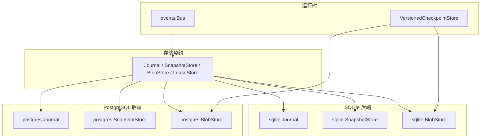
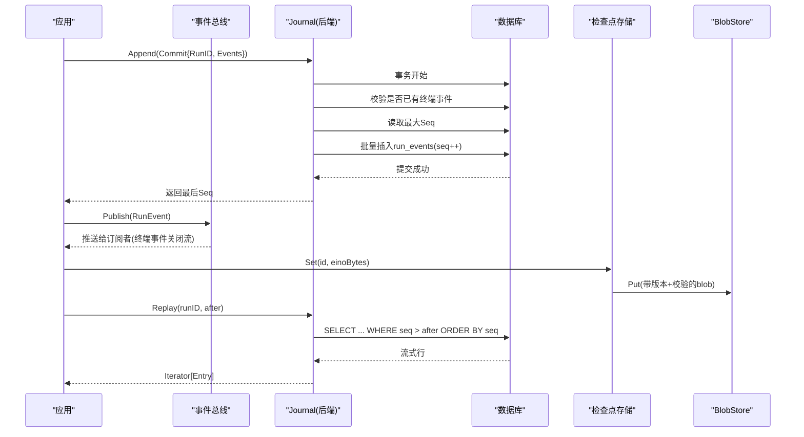
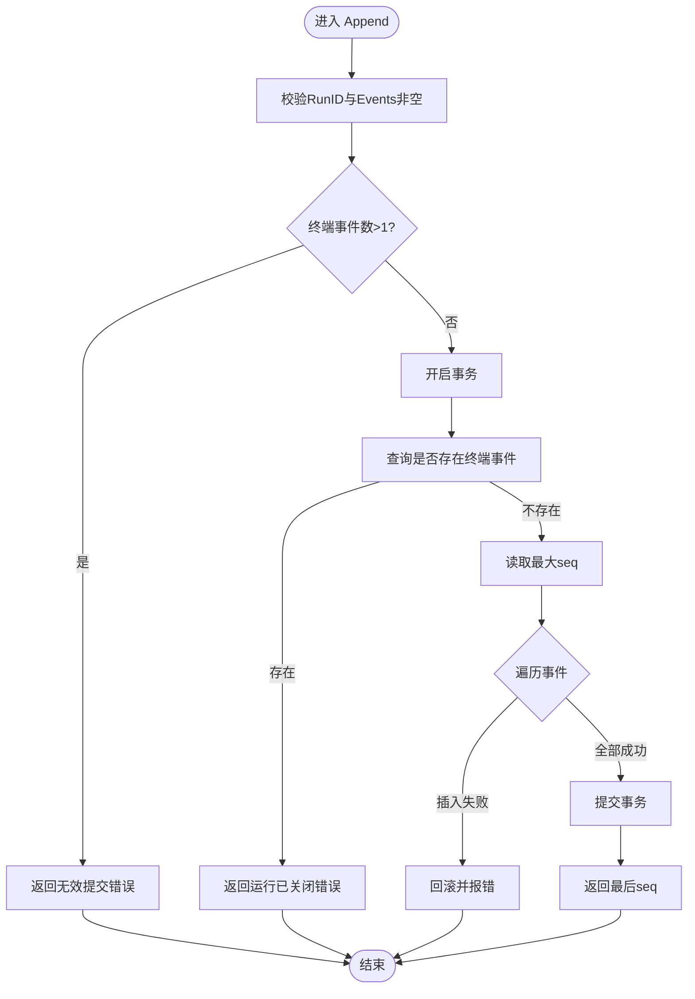
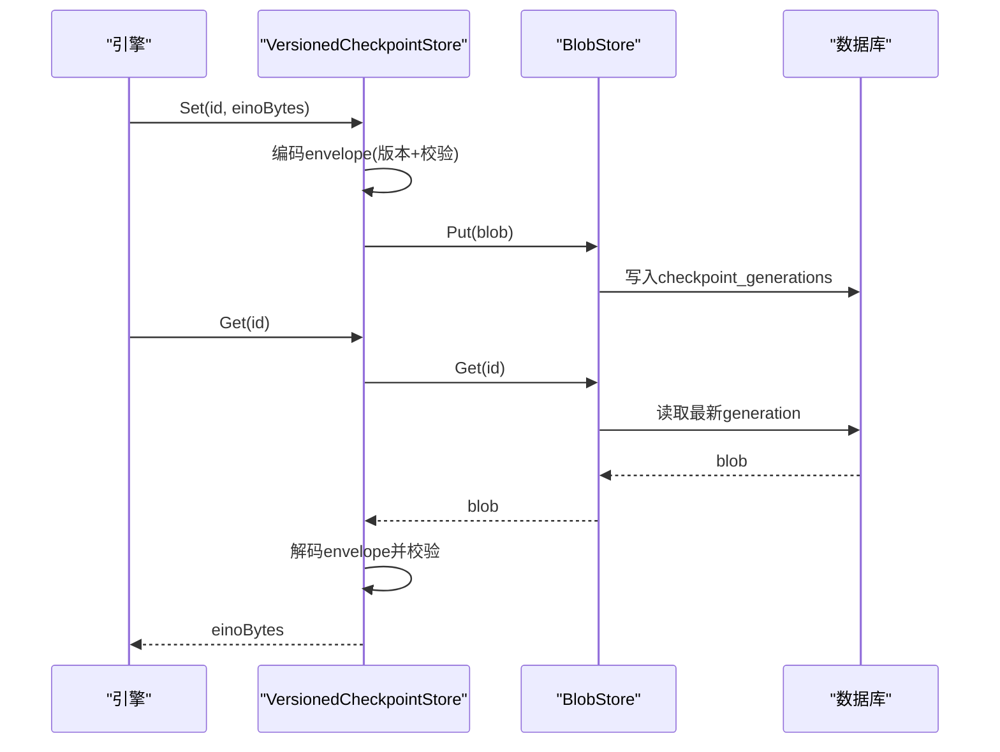
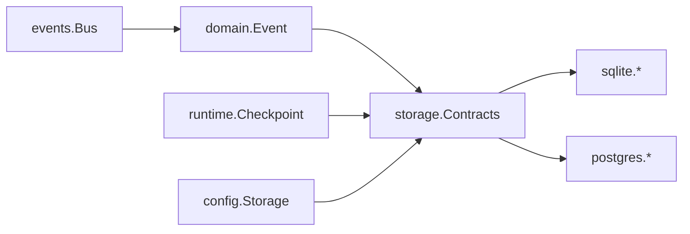

# 事件持久化

<cite>
**本文引用的文件**
- [internal/storage/contracts.go](file://internal/storage/contracts.go)
- [internal/storage/doc.go](file://internal/storage/doc.go)
- [internal/domain/event.go](file://internal/domain/event.go)
- [internal/events/bus.go](file://internal/events/bus.go)
- [internal/storage/sqlite/journal.go](file://internal/storage/sqlite/journal.go)
- [internal/storage/sqlite/snapshot.go](file://internal/storage/sqlite/snapshot.go)
- [internal/storage/sqlite/sqlite.go](file://internal/storage/sqlite/sqlite.go)
- [internal/storage/postgres/journal.go](file://internal/storage/postgres/journal.go)
- [internal/storage/postgres/snapshot.go](file://internal/storage/postgres/snapshot.go)
- [internal/storage/postgres/schema.go](file://internal/storage/postgres/schema.go)
- [internal/storage/postgres/postgres.go](file://internal/storage/postgres/postgres.go)
- [internal/runtime/checkpoint.go](file://internal/runtime/checkpoint.go)
- [internal/config/config.go](file://internal/config/config.go)
</cite>

## 目录
1. [简介](#简介)
2. [项目结构](#项目结构)
3. [核心组件](#核心组件)
4. [架构总览](#架构总览)
5. [详细组件分析](#详细组件分析)
6. [依赖关系分析](#依赖关系分析)
7. [性能考量](#性能考量)
8. [故障排查指南](#故障排查指南)
9. [结论](#结论)
10. [附录](#附录)

## 简介
本文件系统性阐述 Vivy 的事件持久化机制，覆盖事件日志的存储、序列号管理、事务与并发保证、检查点与断点续传、回放与查询、索引与压缩策略、备份恢复与迁移升级等主题。系统以“追加式有序事件日志”为核心，SQLite 为默认后端，PostgreSQL 为可选服务端后端；两者均通过统一的存储契约暴露 Journal、SnapshotStore、BlobStore、LeaseStore 等能力，确保领域代码不感知底层实现细节。

## 项目结构
- 存储契约定义在 internal/storage，抽象出 Journal（事件日志）、SnapshotStore（版本化快照）、BlobStore（不可变对象存储）、LeaseStore（分布式锁/租约）等接口。
- SQLite 与 PostgreSQL 分别提供具体实现，遵循相同契约并通过一致性测试套件验证。
- 运行时 checkpoint 桥接将 Eino 的“不透明检查点字节”封装为带版本和校验的 Blob，写入 BlobStore。
- 配置层控制后端选择与参数，默认使用 SQLite，PostgreSQL 通过环境变量注入 DSN。

**图表来源**
- [internal/storage/contracts.go:55-94](file://internal/storage/contracts.go#L55-L94)
- [internal/storage/sqlite/journal.go:14-86](file://internal/storage/sqlite/journal.go#L14-L86)
- [internal/storage/postgres/journal.go:14-89](file://internal/storage/postgres/journal.go#L14-L89)
- [internal/runtime/checkpoint.go:40-102](file://internal/runtime/checkpoint.go#L40-L102)
- [internal/events/bus.go:10-15](file://internal/events/bus.go#L10-L15)

**章节来源**
- [internal/storage/doc.go:1-17](file://internal/storage/doc.go#L1-L17)
- [internal/storage/contracts.go:55-94](file://internal/storage/contracts.go#L55-L94)
- [internal/config/config.go:70-89](file://internal/config/config.go#L70-L89)

## 核心组件
- 事件模型与类型：RunEvent 携带 RunID、单调递增的 Seq、事件类型、时间戳、负载版本与二进制负载；事件类型集合定义了终端事件（run.completed/run.failed/run.cancelled 及其子运行对应事件），每个运行恰好一个终端事件。
- 事件总线：按 RunID 分发事件给实时订阅者，终端事件关闭流；慢消费者会被丢弃并需从 Journal 重放。
- 存储契约：
  - Journal.Append：原子追加一组事件，分配连续 Seq 范围，拒绝已存在终端事件的运行或包含多个终端事件的提交。
  - Journal.Replay：按 seq > after 顺序回放。
  - SnapshotStore：键值对 + 乐观并发版本。
  - BlobStore：按 id 存储不透明字节，写时生成新代次并原子切换指针（由上层约定）。
  - LeaseStore：租约获取/释放，用于多进程独占工作。

**章节来源**
- [internal/domain/event.go:1-129](file://internal/domain/event.go#L1-L129)
- [internal/events/bus.go:10-115](file://internal/events/bus.go#L10-L115)
- [internal/storage/contracts.go:33-94](file://internal/storage/contracts.go#L33-L94)

## 架构总览
事件持久化的关键路径：
- 写入：调用方构造 Commit（RunID + 若干 RunEvent），Journal.Append 在事务内校验约束（无终端事件、至多一个终端事件），计算下一个 Seq 区间并批量插入 run_events。
- 回放：Replay 基于 run_id 与 after 游标顺序扫描 run_events，返回迭代器供消费。
- 检查点：Eino 检查点作为不透明字节，经 VersionedCheckpointStore 包装引擎版本与 SHA256 校验后写入 BlobStore（SQLite/PostgreSQL 共享表结构）。
- 并发与租约：SQLite 单连接串行化；PostgreSQL 使用会话级 advisory lock 与 leases 表实现实例级租约与心跳。

**图表来源**
- [internal/storage/sqlite/journal.go:14-86](file://internal/storage/sqlite/journal.go#L14-L86)
- [internal/storage/postgres/journal.go:14-89](file://internal/storage/postgres/journal.go#L14-L89)
- [internal/runtime/checkpoint.go:64-102](file://internal/runtime/checkpoint.go#L64-L102)
- [internal/events/bus.go:42-75](file://internal/events/bus.go#L42-L75)

## 详细组件分析

### 事件日志与序列号管理
- 序列号分配：Append 先查询该 RunID 的最大 seq，再在事务中逐条插入并自增 seq，保证同一提交内连续且全局单调。
- 终端事件约束：提交前统计终端事件数量，若大于 1 直接拒绝；若运行已存在终端事件则拒绝后续追加。
- 回放语义：Replay 按 seq > after 顺序返回，支持断点续传（after 即上次处理到的 seq）。

**图表来源**
- [internal/storage/sqlite/journal.go:14-75](file://internal/storage/sqlite/journal.go#L14-L75)
- [internal/storage/postgres/journal.go:14-79](file://internal/storage/postgres/journal.go#L14-L79)

**章节来源**
- [internal/storage/sqlite/journal.go:14-86](file://internal/storage/sqlite/journal.go#L14-L86)
- [internal/storage/postgres/journal.go:14-89](file://internal/storage/postgres/journal.go#L14-L89)
- [internal/domain/event.go:93-116](file://internal/domain/event.go#L93-L116)

### SQLite 后端特性
- 单写者模型：数据库连接池最大并发设为 1，避免 WAL/锁争用，简化并发模型。
- 迁移：启动时按序执行迁移脚本，记录 schema_migrations，失败中止启动。
- 表结构：run_events 主键为 (run_id, seq)，并提供 snapshots、checkpoints、checkpoint_generations、leases 等辅助表。

**章节来源**
- [internal/storage/sqlite/sqlite.go:38-55](file://internal/storage/sqlite/sqlite.go#L38-L55)
- [internal/storage/sqlite/sqlite.go:109-147](file://internal/storage/sqlite/sqlite.go#L109-L147)
- [internal/storage/sqlite/sqlite.go:149-405](file://internal/storage/sqlite/sqlite.go#L149-L405)

### PostgreSQL 后端特性
- 实例租约：启动时尝试获取会话级 advisory lock，并在 leases 表中维护租约与心跳；其他进程打开同一数据库会返回租约已被持有。
- 追加锁：Append 中使用事务级 advisory 锁保护同一 run 的并发写入，避免竞态。
- 模式隔离：支持指定 schema 进行隔离测试。
- 表结构：与 SQLite 逻辑等价，字段类型适配 BIGINT/BYTEA。

**章节来源**
- [internal/storage/postgres/postgres.go:46-111](file://internal/storage/postgres/postgres.go#L46-L111)
- [internal/storage/postgres/postgres.go:168-186](file://internal/storage/postgres/postgres.go#L168-L186)
- [internal/storage/postgres/postgres.go:192-220](file://internal/storage/postgres/postgres.go#L192-L220)
- [internal/storage/postgres/schema.go:39-47](file://internal/storage/postgres/schema.go#L39-L47)

### 快照与乐观并发
- 读：Get(key) 返回 value 与 version，缺失键返回 (nil, 0)。
- 写：Put(key, value, expectVersion) 在事务内比较版本，不一致返回冲突错误；新增键时 expectVersion 必须为 0。
- 差异：PostgreSQL 更新时使用 AND version = ? 条件，结合 RowsAffected 判断冲突；SQLite 使用 UPDATE ... SET version = version + 1 WHERE key = ? 隐式版本比较。

**章节来源**
- [internal/storage/sqlite/snapshot.go:18-71](file://internal/storage/sqlite/snapshot.go#L18-L71)
- [internal/storage/postgres/snapshot.go:18-82](file://internal/storage/postgres/snapshot.go#L18-L82)

### 检查点与断点续传
- 封装：VersionedCheckpointStore 将 eino 检查点字节包裹为 envelope（含引擎版本、SHA256、创建时间），写入 BlobStore。
- 校验：读取时解码 envelope，校验引擎版本一致性与 payload 校验和，任一失败立即拒绝（fail-closed）。
- 断点续传：结合 Journal.Replay(after=last_seq) 与检查点恢复，可实现精确到事件的重放与恢复。

**图表来源**
- [internal/runtime/checkpoint.go:64-102](file://internal/runtime/checkpoint.go#L64-L102)
- [internal/storage/sqlite/sqlite.go:90-107](file://internal/storage/sqlite/sqlite.go#L90-L107)
- [internal/storage/postgres/postgres.go:254-268](file://internal/storage/postgres/postgres.go#L254-L268)

**章节来源**
- [internal/runtime/checkpoint.go:17-102](file://internal/runtime/checkpoint.go#L17-L102)

### 事件回放与实时分发
- 回放：Replay 返回迭代器，按 seq 顺序流式读取，适合构建 UI 视图或离线分析。
- 实时：events.Bus 将事件广播给订阅者，终端事件关闭流；慢消费者被丢弃，需从 Journal 重放。

**章节来源**
- [internal/storage/sqlite/journal.go:77-86](file://internal/storage/sqlite/journal.go#L77-L86)
- [internal/storage/postgres/journal.go:81-89](file://internal/storage/postgres/journal.go#L81-L89)
- [internal/events/bus.go:42-75](file://internal/events/bus.go#L42-L75)

### 并发写入与事务保证
- SQLite：单连接串行化所有写入，事务内完成校验与插入，保证原子性。
- PostgreSQL：Append 内使用事务级 advisory 锁锁定特定 run，防止并发写入冲突；同时通过 leases 表与心跳维持实例级独占。
- 版本冲突：SnapshotStore 使用乐观并发，写时比较版本号，冲突返回明确错误。

**章节来源**
- [internal/storage/sqlite/sqlite.go:45-48](file://internal/storage/sqlite/sqlite.go#L45-L48)
- [internal/storage/postgres/journal.go:32-40](file://internal/storage/postgres/journal.go#L32-L40)
- [internal/storage/postgres/postgres.go:168-186](file://internal/storage/postgres/postgres.go#L168-L186)
- [internal/storage/sqlite/snapshot.go:34-71](file://internal/storage/sqlite/snapshot.go#L34-L71)
- [internal/storage/postgres/snapshot.go:34-82](file://internal/storage/postgres/snapshot.go#L34-L82)

## 依赖关系分析
- 领域层仅依赖 storage 契约，不感知 SQLite/PostgreSQL 差异。
- 运行时 checkpoint 依赖 BlobStore，屏蔽底层存储细节。
- 事件总线依赖 domain.RunEvent，但不拥有历史，仅做实时分发优化。
- 配置层决定后端选择与参数，PostgreSQL DSN 通过环境变量注入，避免敏感信息入配置。

**图表来源**
- [internal/domain/event.go:118-129](file://internal/domain/event.go#L118-L129)
- [internal/storage/contracts.go:55-94](file://internal/storage/contracts.go#L55-L94)
- [internal/runtime/checkpoint.go:40-102](file://internal/runtime/checkpoint.go#L40-L102)
- [internal/events/bus.go:10-15](file://internal/events/bus.go#L10-L15)
- [internal/config/config.go:70-89](file://internal/config/config.go#L70-L89)

**章节来源**
- [internal/storage/contracts.go:252-273](file://internal/storage/contracts.go#L252-L273)
- [internal/config/config.go:350-362](file://internal/config/config.go#L350-L362)

## 性能考量
- 索引策略：
  - run_events：主键 (run_id, seq) 保证追加与按 run 回放的高效定位。
  - runs：parent_run_id/root_run_id 复合索引加速父子树查询。
  - approvals/questions：status/expiry/id 复合索引加速过期清理与待决列表。
  - todos/session_position_idx：按 session 与位置排序提升列表性能。
  - eval_runs/promotions/studio_events：针对查询模式的索引。
- 写入吞吐：
  - SQLite 单连接串行化，适合单机场景；高并发写入建议切换到 PostgreSQL。
  - PostgreSQL 使用 advisory 锁减少热点行竞争，配合连接池提高吞吐。
- 数据压缩：
  - 事件负载与消息内容以 BLOB/BYTEA 存储，未启用内置压缩；可在上游序列化阶段按需压缩（如 gzip）以降低存储占用。
- 回放与流式：
  - Replay 使用流式行读取，内存占用低，适合长历史回放。
- 检查点大小：
  - 检查点为不透明字节，建议控制单次大小并结合定期清理策略。

**章节来源**
- [internal/storage/sqlite/sqlite.go:149-405](file://internal/storage/sqlite/sqlite.go#L149-L405)
- [internal/storage/postgres/schema.go:39-199](file://internal/storage/postgres/schema.go#L39-L199)

## 故障排查指南
- 常见错误：
  - 运行已关闭：对已有终端事件的运行继续追加事件，应检查业务逻辑是否正确终止。
  - 无效提交：提交包含多个终端事件或为空，需修正事件组装逻辑。
  - 版本冲突：快照写入时期望版本与实际不符，重试或重新读取最新版本。
  - 租约冲突：PostgreSQL 多进程同时打开数据库，确保仅一个实例持有租约。
  - 检查点损坏或版本不匹配：读取检查点失败，确认引擎版本一致性与数据完整性。
- 诊断要点：
  - 查看 run_events 中 terminal 事件以确定运行终态。
  - 检查 leases 表与心跳，确认 PostgreSQL 实例健康。
  - 核对 schema_migrations 版本，确保迁移完整。

**章节来源**
- [internal/storage/contracts.go:11-31](file://internal/storage/contracts.go#L11-L31)
- [internal/storage/sqlite/journal.go:18-46](file://internal/storage/sqlite/journal.go#L18-L46)
- [internal/storage/postgres/journal.go:18-50](file://internal/storage/postgres/journal.go#L18-L50)
- [internal/storage/postgres/postgres.go:94-111](file://internal/storage/postgres/postgres.go#L94-L111)
- [internal/runtime/checkpoint.go:17-27](file://internal/runtime/checkpoint.go#L17-L27)

## 结论
Vivy 的事件持久化以统一契约为核心，SQLite 与 PostgreSQL 在后端层面提供一致的追加式事件日志、版本化快照与不透明对象存储。通过严格的终端事件约束、事务与并发控制、检查点封装与校验，实现了可靠的事件回放与断点续传。生产部署可根据规模与并发需求选择合适后端，并结合索引策略与上游压缩优化性能。

## 附录

### 存储后端选择与配置
- 默认后端：SQLite，适用于单机与开发环境。
- 可选后端：PostgreSQL，适用于多进程/多实例部署，具备租约与心跳机制。
- 配置项：storage.backend、storage.sqlite.path、storage.postgres.dsn_env（DSN 来自环境变量，不入配置）。

**章节来源**
- [internal/config/config.go:70-89](file://internal/config/config.go#L70-L89)
- [internal/config/config.go:254-314](file://internal/config/config.go#L254-L314)
- [internal/config/config.go:350-362](file://internal/config/config.go#L350-L362)

### 迁移与升级
- SQLite：启动时按序执行迁移脚本，记录 schema_migrations，失败中止启动。
- PostgreSQL：一次性创建 schema，记录版本，失败中止启动。
- 升级建议：保持两端逻辑等价，变更需同步更新迁移与 schema。

**章节来源**
- [internal/storage/sqlite/sqlite.go:109-147](file://internal/storage/sqlite/sqlite.go#L109-L147)
- [internal/storage/postgres/postgres.go:133-166](file://internal/storage/postgres/postgres.go#L133-L166)

### 事件查询接口
- 回放接口：Journal.Replay(runID, after) 返回迭代器，按 seq 顺序读取。
- 快照接口：SnapshotStore.Get/Put 提供键值存取与乐观并发。
- 对象接口：BlobStore.Get/Put/Delete 用于检查点等不透明数据。

**章节来源**
- [internal/storage/contracts.go:55-94](file://internal/storage/contracts.go#L55-L94)

### 备份与恢复
- SQLite：可直接复制数据库文件（建议在空闲期或只读模式下进行）。
- PostgreSQL：可使用 pg_dump/pg_restore 或云厂商备份工具；注意 schema_migrations 与 leases 状态。
- 恢复流程：恢复数据后重启服务，迁移自动校验；必要时清理孤儿检查点指针（CheckpointerOrphaner）。

**章节来源**
- [internal/storage/sqlite/sqlite.go:90-107](file://internal/storage/sqlite/sqlite.go#L90-L107)
- [internal/storage/postgres/postgres.go:254-268](file://internal/storage/postgres/postgres.go#L254-L268)