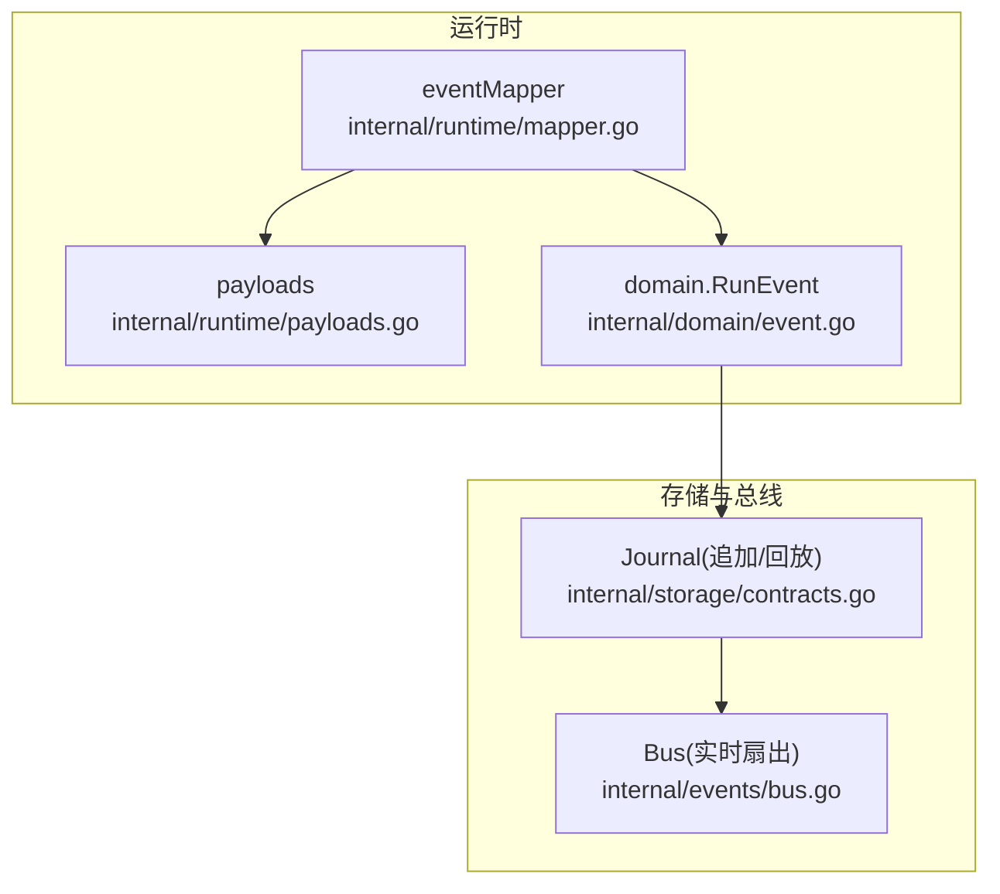
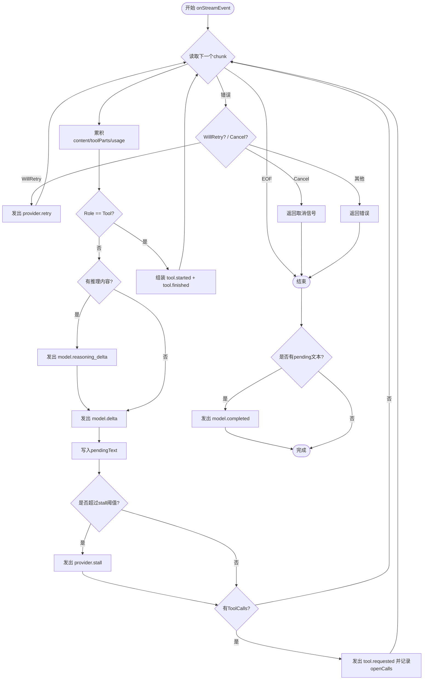
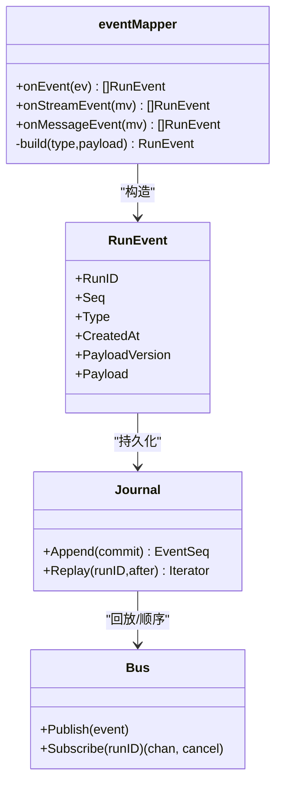
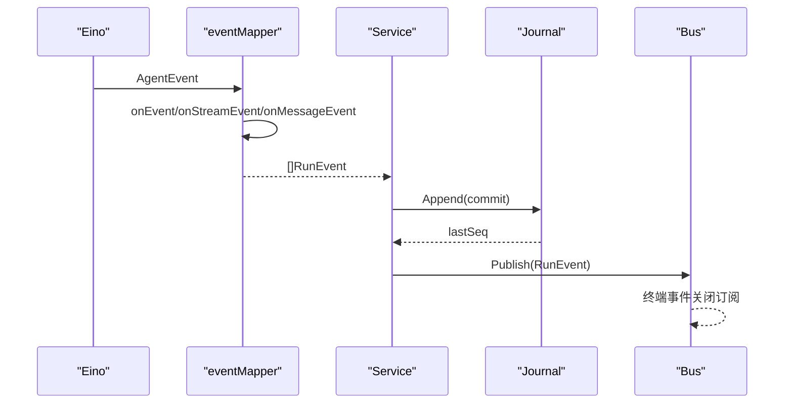

# 事件映射器

<cite>
**本文引用的文件**
- [internal/runtime/mapper.go](file://internal/runtime/mapper.go)
- [internal/runtime/payloads.go](file://internal/runtime/payloads.go)
- [internal/domain/event.go](file://internal/domain/event.go)
- [internal/events/bus.go](file://internal/events/bus.go)
- [internal/storage/contracts.go](file://internal/storage/contracts.go)
- [internal/storage/sqlite/sqlite_test.go](file://internal/storage/sqlite/sqlite_test.go)
- [schemas/events/payloads/provider.stall.json](file://schemas/events/payloads/provider.stall.json)
</cite>

## 目录
1. [简介](#简介)
2. [项目结构](#项目结构)
3. [核心组件](#核心组件)
4. [架构总览](#架构总览)
5. [详细组件分析](#详细组件分析)
6. [依赖关系分析](#依赖关系分析)
7. [性能考量](#性能考量)
8. [故障排查指南](#故障排查指南)
9. [结论](#结论)
10. [附录](#附录)

## 简介
本文件聚焦 Vivy 运行时中的“事件映射器”，解释其如何将内部领域对象与 Eino 引擎事件转换为标准事件格式，覆盖事件构建、序列号分配、时间戳处理、消息序列化、工具调用结果包装、模型响应流式处理、事件去重、批量处理与性能优化策略，并给出配置选项与扩展点说明。

## 项目结构
事件映射器位于 internal/runtime 包中，负责将 Eino 的 AgentEvent 转换为 domain.RunEvent；payload 结构体定义在 runtime/payloads.go；事件类型与领域模型在 domain/event.go；持久化与序列号由 storage.Journal 提供；实时分发由 events.Bus 完成。



图表来源
- [internal/runtime/mapper.go:395-411](file://internal/runtime/mapper.go#L395-L411)
- [internal/runtime/payloads.go:1-227](file://internal/runtime/payloads.go#L1-L227)
- [internal/domain/event.go:118-129](file://internal/domain/event.go#L118-L129)
- [internal/storage/contracts.go:55-64](file://internal/storage/contracts.go#L55-L64)
- [internal/events/bus.go:10-15](file://internal/events/bus.go#L10-L15)

章节来源
- [internal/runtime/mapper.go:1-72](file://internal/runtime/mapper.go#L1-L72)
- [internal/domain/event.go:1-129](file://internal/domain/event.go#L1-L129)
- [internal/storage/contracts.go:55-64](file://internal/storage/contracts.go#L55-L64)
- [internal/events/bus.go:10-15](file://internal/events/bus.go#L10-L15)

## 核心组件
- eventMapper：接收 Eino 事件，按角色与内容分派到不同转换路径（流式/整条消息），产出 domain.RunEvent。
- payloads：每个事件类型的 JSON 负载结构，字段名与 schemas/events/payloads/*.json 一一对应。
- domain.RunEvent：统一的事件记录，包含 RunID、Type、CreatedAt、PayloadVersion、Payload；Seq 由 Journal 在追加时分配。
- storage.Journal：追加式有序日志，保证单调递增序列号与“每运行恰好一个终态事件”。
- events.Bus：内存总线，将已持久化的事件实时广播给订阅者，慢消费者会被丢弃并从 Journal 回放恢复。

章节来源
- [internal/runtime/mapper.go:40-72](file://internal/runtime/mapper.go#L40-L72)
- [internal/runtime/payloads.go:1-227](file://internal/runtime/payloads.go#L1-L227)
- [internal/domain/event.go:118-129](file://internal/domain/event.go#L118-L129)
- [internal/storage/contracts.go:55-64](file://internal/storage/contracts.go#L55-L64)
- [internal/events/bus.go:10-15](file://internal/events/bus.go#L10-L15)

## 架构总览
事件从 Eino 引擎进入 mapper，mapper 将领域语义映射为标准事件，随后由服务层先持久化到 Journal，再发布到 Bus 进行实时分发。

```mermaid
sequenceDiagram
participant Eng as "Eino 引擎"
participant Map as "eventMapper"
participant Ser as "Service(服务层)"
participant Jour as "Journal"
participant Bus as "events.Bus"
participant Sub as "订阅者"
Eng->>Map : AgentEvent
Map-->>Ser : []domain.RunEvent
Ser->>Jour : Append(commit)
Jour-->>Ser : lastSeq
Ser->>Bus : Publish(event)
Bus-->>Sub : 顺序推送(按Seq)
Note over Bus,Sub : 终端事件关闭流; 慢消费者被丢弃后通过after_seq回放
```

图表来源
- [internal/runtime/mapper.go:74-102](file://internal/runtime/mapper.go#L74-L102)
- [internal/storage/contracts.go:55-64](file://internal/storage/contracts.go#L55-L64)
- [internal/events/bus.go:42-75](file://internal/events/bus.go#L42-L75)

## 详细组件分析

### 事件构建与时间戳
- 所有事件通过统一的 build 方法构造，设置 RunID、Type、CreatedAt(Unix 毫秒)、PayloadVersion=1，并将 payload 序列化为 JSON 字节。
- 若 payload 序列化失败，会记录错误并以空对象 {} 作为兜底，确保事件不丢失。

章节来源
- [internal/runtime/mapper.go:395-411](file://internal/runtime/mapper.go#L395-L411)
- [internal/runtime/payloads.go:1-227](file://internal/runtime/payloads.go#L1-L227)

### 序列号分配机制
- 事件记录中的 Seq 字段由 Journal 在 Append 时分配，mapper 不分配 Seq。
- Journal 保证单调递增且无间隔，并通过约束确保每个 run 仅有一个终态事件。
- RPC/客户端可通过 after_seq 游标增量回放，避免重复消费。

章节来源
- [internal/runtime/mapper.go:40-44](file://internal/runtime/mapper.go#L40-L44)
- [internal/storage/contracts.go:55-64](file://internal/storage/contracts.go#L55-L64)
- [internal/storage/sqlite/sqlite_test.go:52-94](file://internal/storage/sqlite/sqlite_test.go#L52-L94)

### 流式处理与模型响应
- onStreamEvent 逐块读取 MessageStream，累积文本、工具调用片段与用量信息。
- 对 assistant 角色：
  - 推理内容抽取为 model.reasoning_delta。
  - 文本增量封装为 model.delta，并写入 pendingText。
  - 若长时间无数据，达到阈值则发出 provider.stall。
  - 结束时根据是否有 pending 文本输出 model.completed。
- 对 tool 角色：直接组装工具结果事件（tool.started + tool.finished）。
- 工具调用请求：当 chunk 携带 ToolCalls 时，解析参数并生成 tool.requested，同时记录 openCalls 以便后续匹配结果。



图表来源
- [internal/runtime/mapper.go:104-169](file://internal/runtime/mapper.go#L104-L169)
- [internal/runtime/mapper.go:218-241](file://internal/runtime/mapper.go#L218-L241)
- [internal/runtime/mapper.go:248-265](file://internal/runtime/mapper.go#L248-L265)

章节来源
- [internal/runtime/mapper.go:104-169](file://internal/runtime/mapper.go#L104-L169)
- [internal/runtime/mapper.go:218-241](file://internal/runtime/mapper.go#L218-L241)
- [internal/runtime/mapper.go:248-265](file://internal/runtime/mapper.go#L248-L265)

### 工具调用结果包装
- 工具结果以成对事件出现：tool.started 紧随 tool.finished。
- 若未显式传入 callID，mapper 会从 openCalls 中按名称弹出匹配的调用 ID 与名称，保持请求-响应对齐。
- 多部分结果（非纯文本）以 json.RawMessage 数组 parts 保留原始结构。

章节来源
- [internal/runtime/mapper.go:309-324](file://internal/runtime/mapper.go#L309-L324)
- [internal/runtime/mapper.go:326-356](file://internal/runtime/mapper.go#L326-L356)
- [internal/runtime/mapper.go:358-366](file://internal/runtime/mapper.go#L358-L366)

### 消息序列化与负载裁剪
- 所有 payload 使用 JSON 序列化；若失败，记录错误并以空对象兜底，避免事件丢失。
- 对高频 delta/reasoning 等文本负载，支持按 maxPayload 预算裁剪，防止单个事件过大影响传输与存储。
- 裁剪策略基于最坏情况转义估算，超出预算时记录告警并截断。

章节来源
- [internal/runtime/mapper.go:368-393](file://internal/runtime/mapper.go#L368-L393)
- [internal/runtime/mapper.go:395-411](file://internal/runtime/mapper.go#L395-L411)

### 中断与审批挂起
- 当引擎返回中断动作时，mapper 提取 resumeTarget、受影响的 toolCallID/name/args，并返回中断哨兵错误，使服务层挂起运行等待审批。
- 中断上下文地址链用于定位根因与具体工具调用，若地址未指定 ID，则回退到最近打开的工具调用。

章节来源
- [internal/runtime/mapper.go:267-307](file://internal/runtime/mapper.go#L267-L307)

### 事件类型与负载契约
- EventType 定义了完整词汇表，包括 run/model/tool/policy/hook/user/child 等生命周期事件。
- 各 payload 结构体字段与 schemas/events/payloads/*.json 保持一致，版本号为 1。
- 终端事件集合由 domain 提供，用于判断运行结束与状态映射。

章节来源
- [internal/domain/event.go:8-43](file://internal/domain/event.go#L8-L43)
- [internal/domain/event.go:93-116](file://internal/domain/event.go#L93-L116)
- [internal/runtime/payloads.go:1-227](file://internal/runtime/payloads.go#L1-L227)
- [schemas/events/payloads/provider.stall.json:1-15](file://schemas/events/payloads/provider.stall.json#L1-L15)

## 依赖关系分析
- eventMapper 依赖 domain.EventType 与 domain.RunEvent，以及 Eino schema 类型进行解析。
- 事件持久化与序列号由 storage.Journal 提供；实时分发由 events.Bus 完成。
- Bus 对慢消费者采用“丢弃+关闭通道”的策略，消费者需通过 after_seq 从 Journal 回放恢复，保证最终一致性与不丢事件。



图表来源
- [internal/runtime/mapper.go:74-102](file://internal/runtime/mapper.go#L74-L102)
- [internal/domain/event.go:118-129](file://internal/domain/event.go#L118-L129)
- [internal/storage/contracts.go:55-64](file://internal/storage/contracts.go#L55-L64)
- [internal/events/bus.go:42-75](file://internal/events/bus.go#L42-L75)

章节来源
- [internal/runtime/mapper.go:74-102](file://internal/runtime/mapper.go#L74-L102)
- [internal/storage/contracts.go:55-64](file://internal/storage/contracts.go#L55-L64)
- [internal/events/bus.go:42-75](file://internal/events/bus.go#L42-L75)

## 性能考量
- 流式增量：model.delta 与 reasoning_delta 以增量形式发送，减少单次负载大小。
- 负载裁剪：maxPayload 限制 delta/reasoning 的最大字节数，避免大事件阻塞传输或存储。
- 提供者停滞检测：stallThreshold 控制长耗时流式处理的 stall 事件，便于上层监控与降级。
- 总线缓冲与丢弃：events.Bus 使用固定缓冲，慢消费者将被丢弃并关闭通道，避免拖垮生产者；消费者通过 after_seq 回放恢复。
- 终端事件幂等：Journal 拒绝同一提交中包含多个终态事件，保障“每运行恰好一个终态事件”。

章节来源
- [internal/runtime/mapper.go:368-393](file://internal/runtime/mapper.go#L368-L393)
- [internal/runtime/mapper.go:157-159](file://internal/runtime/mapper.go#L157-L159)
- [internal/events/bus.go:61-75](file://internal/events/bus.go#L61-L75)
- [internal/storage/sqlite/sqlite_test.go:96-109](file://internal/storage/sqlite/sqlite_test.go#L96-L109)

## 故障排查指南
- 事件未到达订阅端：检查 Bus 缓冲是否溢出导致订阅被关闭；确认客户端是否通过 after_seq 从 Journal 回放恢复。
- 事件缺失或乱序：确认 Journal 回放是否从正确的 after_seq 开始；验证终端事件是否已发布（终端事件会关闭流）。
- 大负载导致卡顿：调整 maxPayload，观察裁剪日志；必要时拆分上游逻辑或降低 delta 粒度。
- 工具调用不匹配：检查 tool.requested 与 tool.finished 的 callID/name 是否一致；确认 openCalls 未被提前弹出。
- 中断挂起无法恢复：核对 interruptDetails 中的 ResumeTarget 与 ToolCallID/Name/Args 是否正确回填。

章节来源
- [internal/events/bus.go:61-75](file://internal/events/bus.go#L61-L75)
- [internal/storage/sqlite/sqlite_test.go:52-94](file://internal/storage/sqlite/sqlite_test.go#L52-L94)
- [internal/runtime/mapper.go:267-307](file://internal/runtime/mapper.go#L267-L307)

## 结论
事件映射器将 Eino 引擎事件标准化为可持久化、可回放、可实时分发的 domain.RunEvent。通过 Journal 保证序列号单调与终态唯一性，通过 Bus 实现高效实时分发与容错恢复。mapper 内置流式处理、负载裁剪、停滞检测与工具调用对齐等关键能力，满足高吞吐与低延迟的运行需求。

## 附录

### 事件映射流程（代码级）


图表来源
- [internal/runtime/mapper.go:74-102](file://internal/runtime/mapper.go#L74-L102)
- [internal/storage/contracts.go:55-64](file://internal/storage/contracts.go#L55-L64)
- [internal/events/bus.go:42-75](file://internal/events/bus.go#L42-L75)

### 配置选项与自定义扩展点
- 配置项
  - maxPayload：限制事件负载最大字节数，主要用于 delta/reasoning 等高频文本事件。
  - stallThreshold：流式处理停滞阈值，超过该时长触发 provider.stall。
- 扩展点
  - RunHook：在服务层持久化并发布事件后可观测事件流，不影响运行状态。
  - EventSink：抽象事件发布接口，当前由 events.Bus 实现，便于替换或增强。
  - Journal 与 Storage：通过 storage.Engine 注入不同的后端（SQLite/Postgres），不影响 mapper 行为。

章节来源
- [internal/runtime/mapper.go:44-72](file://internal/runtime/mapper.go#L44-L72)
- [internal/runtime/service.go:29-40](file://internal/runtime/service.go#L29-L40)
- [internal/storage/contracts.go:55-64](file://internal/storage/contracts.go#L55-L64)