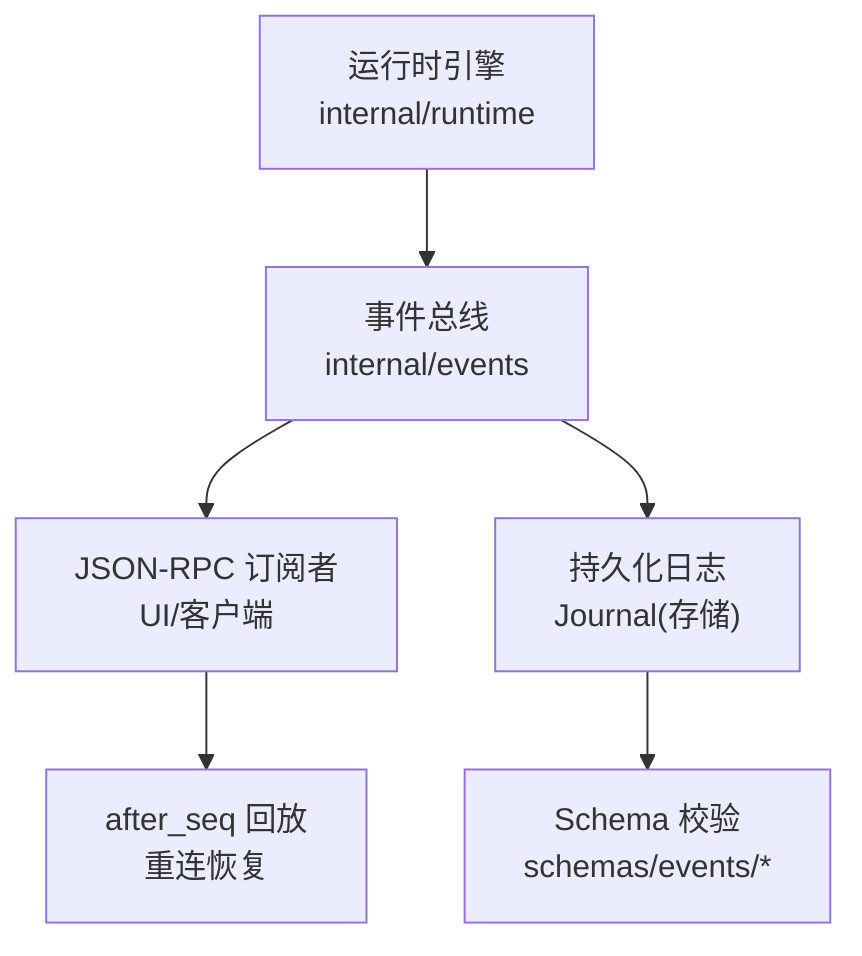
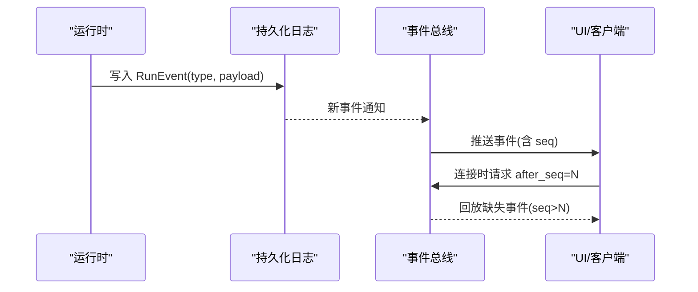
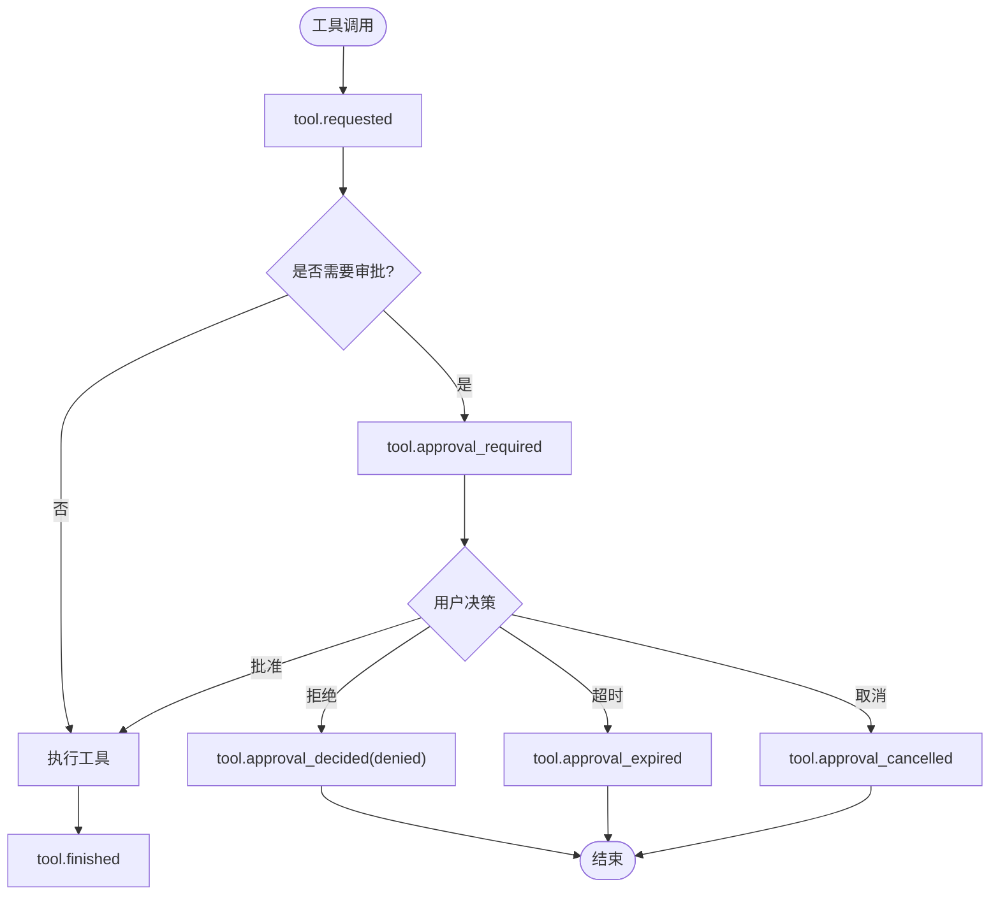
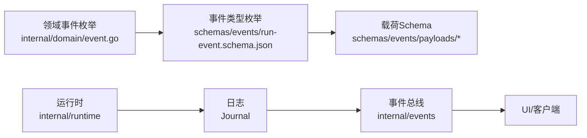

# 事件类型定义

<cite>
**本文引用的文件**
- [run-event.schema.json](file://schemas/events/run-event.schema.json)
- [event.go](file://internal/domain/event.go)
- [doc.go](file://internal/events/doc.go)
- [run.started.json](file://schemas/events/payloads/run.started.json)
- [run.completed.json](file://schemas/events/payloads/run.completed.json)
- [run.failed.json](file://schemas/events/payloads/run.failed.json)
- [run.cancelled.json](file://schemas/events/payloads/run.cancelled.json)
- [model.delta.json](file://schemas/events/payloads/model.delta.json)
- [model.reasoning_delta.json](file://schemas/events/payloads/model.reasoning_delta.json)
- [model.request.json](file://schemas/events/payloads/model.request.json)
- [model.usage.json](file://schemas/events/payloads/model.usage.json)
- [model.completed.json](file://schemas/events/payloads/model.completed.json)
- [tool.requested.json](file://schemas/events/payloads/tool.requested.json)
- [tool.started.json](file://schemas/events/payloads/tool.started.json)
- [tool.finished.json](file://schemas/events/payloads/tool.finished.json)
- [tool.approval_required.json](file://schemas/events/payloads/tool.approval_required.json)
- [tool.approval_decided.json](file://schemas/events/payloads/tool.approval_decided.json)
- [tool.approval_expired.json](file://schemas/events/payloads/tool.approval_expired.json)
- [tool.approval_cancelled.json](file://schemas/events/payloads/tool.approval_cancelled.json)
- [tool.proposal_stale.json](file://schemas/events/payloads/tool.proposal_stale.json)
- [user.question_required.json](file://schemas/events/payloads/user.question_required.json)
- [user.question_answered.json](file://schemas/events/payloads/user.question_answered.json)
- [user.question_cancelled.json](file://schemas/events/payloads/user.question_cancelled.json)
- [user.question_expired.json](file://schemas/events/payloads/user.question_expired.json)
- [child.requested.json](file://schemas/events/payloads/child.requested.json)
- [child.started.json](file://schemas/events/payloads/child.started.json)
- [child.suspended.json](file://schemas/events/payloads/child.suspended.json)
- [child.resumed.json](file://schemas/events/payloads/child.resumed.json)
- [child.completed.json](file://schemas/events/payloads/child.completed.json)
- [child.failed.json](file://schemas/events/payloads/child.failed.json)
- [child.cancelled.json](file://schemas/events/payloads/child.cancelled.json)
- [policy.evaluated.json](file://schemas/events/payloads/policy.evaluated.json)
- [hook.started.json](file://schemas/events/payloads/hook.started.json)
- [hook.completed.json](file://schemas/events/payloads/hook.completed.json)
- [hook.blocked.json](file://schemas/events/payloads/hook.blocked.json)
- [provider.retry.json](file://schemas/events/payloads/provider.retry.json)
- [provider.stall.json](file://schemas/events/payloads/provider.stall.json)
</cite>

## 目录
1. [简介](#简介)
2. [项目结构](#项目结构)
3. [核心组件](#核心组件)
4. [架构总览](#架构总览)
5. [详细组件分析](#详细组件分析)
6. [依赖关系分析](#依赖关系分析)
7. [性能与一致性](#性能与一致性)
8. [故障排查指南](#故障排查指南)
9. [结论](#结论)
10. [附录：事件参考手册](#附录事件参考手册)

## 简介
本文件为 Vivy 运行时的“事件类型定义”权威参考，覆盖所有受支持的 RunEvent 类型、载荷 JSON Schema、必需/可选字段、验证规则、版本兼容策略以及数据格式规范。文档同时解释事件枚举值、错误事件类型、用户交互事件、工具审批流、子任务生命周期等关键主题，并提供使用示例与最佳实践。

## 项目结构
Vivy 的事件体系由三部分构成：
- 事件信封（RunEvent）：统一的外层结构，包含 run_id、seq、type、created_at、payload_version、payload。
- 事件载荷（Payloads）：按 type 分文件的 JSON Schema，描述 payload 的具体字段与约束。
- 事件总线与回放：基于持久化日志的 after_seq 游标重放，确保无丢失、无重复。

图表来源
- [doc.go:1-12](file://internal/events/doc.go#L1-L12)
- [run-event.schema.json:1-76](file://schemas/events/run-event.schema.json#L1-L76)

章节来源
- [doc.go:1-12](file://internal/events/doc.go#L1-L12)
- [run-event.schema.json:1-76](file://schemas/events/run-event.schema.json#L1-L76)

## 核心组件
- 事件类型枚举：在领域层集中定义，保证 UI、RPC、Eino 映射共享同一词汇表。
- 事件信封：每个持久化日志条目必须满足 run-event.schema.json。
- 载荷 Schema：每个 type 对应 payloads/<type>.json，严格限定字段、类型与约束。
- 终端事件：每个 Run 恰好一个终态事件（完成/失败/取消）。

章节来源
- [event.go:8-81](file://internal/domain/event.go#L8-L81)
- [event.go:93-116](file://internal/domain/event.go#L93-L116)
- [run-event.schema.json:18-74](file://schemas/events/run-event.schema.json#L18-L74)

## 架构总览
事件从运行时产生，写入持久化日志；事件总线提供实时推送与基于 after_seq 的重放；UI/客户端通过 JSON-RPC 消费事件并渲染状态。

图表来源
- [doc.go:1-12](file://internal/events/doc.go#L1-L12)
- [run-event.schema.json:13-74](file://schemas/events/run-event.schema.json#L13-L74)

## 详细组件分析

### 事件信封与通用字段
- run_id：所属 Run 标识。
- seq：每 Run 单调递增序号，起始为 1。
- type：事件类型枚举，来自领域层常量集合。
- created_at：Unix 毫秒时间戳。
- payload_version：载荷形状版本，消费者拒绝未知版本。
- payload：类型相关负载，具体结构见 payloads/<type>.json。

校验规则
- 信封必须满足 run-event.schema.json 的全部必填项。
- additionalProperties 禁止额外字段。
- type 必须在枚举范围内。

版本兼容性策略
- 新增载荷字段应向后兼容；新增载荷版本需显式升级 payload_version。
- 消费者遇到未知 payload_version 应拒绝处理，避免隐式降级。

章节来源
- [run-event.schema.json:7-74](file://schemas/events/run-event.schema.json#L7-L74)
- [event.go:118-128](file://internal/domain/event.go#L118-L128)

### 模型事件（Model）
- model.request：记录一次模型调用的可重建指纹（消息摘要、preamble 哈希、字节长度、可见工具列表）。
- model.delta：增量文本片段，用于流式展示。
- model.reasoning_delta：推理摘要增量片段。
- model.usage：用量统计（prompt/completion/total/reasoning tokens）。
- model.completed：本轮模型输出的完整内容（可由 delta 重组），可选 provider 上报用量。

注意
- model.request 不携带明文消息体，仅保留摘要与长度，便于审计与重建。
- delta 类事件受运行时最大事件载荷限制。

章节来源
- [model.request.json:1-49](file://schemas/events/payloads/model.request.json#L1-L49)
- [model.delta.json:1-15](file://schemas/events/payloads/model.delta.json#L1-L15)
- [model.reasoning_delta.json:1-15](file://schemas/events/payloads/model.reasoning_delta.json#L1-L15)
- [model.usage.json:1-15](file://schemas/events/payloads/model.usage.json#L1-L15)
- [model.completed.json:1-25](file://schemas/events/payloads/model.completed.json#L1-L25)

### 工具事件（Tool）
- tool.requested：模型发起的工具调用请求（名称、参数）。
- tool.started：工具开始执行。
- tool.finished：工具结束，返回结果或错误。
- tool.approval_required/decided/expired/cancelled：工具审批生命周期。
- tool.proposal_stale：审批提案失效。

工具审批流程

图表来源
- [tool.requested.json:1-23](file://schemas/events/payloads/tool.requested.json#L1-L23)
- [tool.started.json:1-19](file://schemas/events/payloads/tool.started.json#L1-L19)
- [tool.finished.json:1-27](file://schemas/events/payloads/tool.finished.json#L1-L27)
- [tool.approval_required.json:1-41](file://schemas/events/payloads/tool.approval_required.json#L1-L41)
- [tool.approval_decided.json:1-16](file://schemas/events/payloads/tool.approval_decided.json#L1-L16)
- [tool.approval_expired.json:1-15](file://schemas/events/payloads/tool.approval_expired.json#L1-L15)
- [tool.approval_cancelled.json:1-14](file://schemas/events/payloads/tool.approval_cancelled.json#L1-L14)
- [tool.proposal_stale.json:1-14](file://schemas/events/payloads/tool.proposal_stale.json#L1-L14)

章节来源
- [tool.requested.json:1-23](file://schemas/events/payloads/tool.requested.json#L1-L23)
- [tool.started.json:1-19](file://schemas/events/payloads/tool.started.json#L1-L19)
- [tool.finished.json:1-27](file://schemas/events/payloads/tool.finished.json#L1-L27)
- [tool.approval_required.json:1-41](file://schemas/events/payloads/tool.approval_required.json#L1-L41)
- [tool.approval_decided.json:1-16](file://schemas/events/payloads/tool.approval_decided.json#L1-L16)
- [tool.approval_expired.json:1-15](file://schemas/events/payloads/tool.approval_expired.json#L1-L15)
- [tool.approval_cancelled.json:1-14](file://schemas/events/payloads/tool.approval_cancelled.json#L1-L14)
- [tool.proposal_stale.json:1-14](file://schemas/events/payloads/tool.proposal_stale.json#L1-L14)

### 用户交互事件（User）
- user.question_required：挂起等待用户回答（区别于工具审批）。
- user.question_answered：用户已回答。
- user.question_cancelled：问题被取消。
- user.question_expired：问题过期。

章节来源
- [user.question_required.json:1-19](file://schemas/events/payloads/user.question_required.json#L1-L19)
- [user.question_answered.json:1-19](file://schemas/events/payloads/user.question_answered.json#L1-L19)
- [user.question_cancelled.json:1-19](file://schemas/events/payloads/user.question_cancelled.json#L1-L19)
- [user.question_expired.json:1-19](file://schemas/events/payloads/user.question_expired.json#L1-L19)

### 子任务事件（Child）
- child.requested/started/suspended/resumed/completed/failed/cancelled：子任务全生命周期。

章节来源
- [child.requested.json:1-19](file://schemas/events/payloads/child.requested.json#L1-L19)
- [child.started.json:1-19](file://schemas/events/payloads/child.started.json#L1-L19)
- [child.suspended.json:1-19](file://schemas/events/payloads/child.suspended.json#L1-L19)
- [child.resumed.json:1-19](file://schemas/events/payloads/child.resumed.json#L1-L19)
- [child.completed.json:1-19](file://schemas/events/payloads/child.completed.json#L1-L19)
- [child.failed.json:1-19](file://schemas/events/payloads/child.failed.json#L1-L19)
- [child.cancelled.json:1-19](file://schemas/events/payloads/child.cancelled.json#L1-L19)

### 策略与钩子事件（Policy/Hook）
- policy.evaluated：策略评估结果。
- hook.started/completed/blocked：钩子生命周期。

章节来源
- [policy.evaluated.json:1-19](file://schemas/events/payloads/policy.evaluated.json#L1-L19)
- [hook.started.json:1-19](file://schemas/events/payloads/hook.started.json#L1-L19)
- [hook.completed.json:1-19](file://schemas/events/payloads/hook.completed.json#L1-L19)
- [hook.blocked.json:1-19](file://schemas/events/payloads/hook.blocked.json#L1-L19)

### 提供者事件（Provider）
- provider.retry：提供者重试。
- provider.stall：提供者卡顿/停滞。

章节来源
- [provider.retry.json:1-19](file://schemas/events/payloads/provider.retry.json#L1-L19)
- [provider.stall.json:1-19](file://schemas/events/payloads/provider.stall.json#L1-L19)

### 运行生命周期事件（Run）
- run.started：启动时携带 provider、model、mode、policy_profile、policy_hash。
- run.completed：终端事件，可选 summary。
- run.failed：终端事件，失败原因。
- run.cancelled：终端事件，取消原因。

章节来源
- [run.started.json:1-35](file://schemas/events/payloads/run.started.json#L1-L35)
- [run.completed.json:1-15](file://schemas/events/payloads/run.completed.json#L1-L15)
- [run.failed.json:1-19](file://schemas/events/payloads/run.failed.json#L1-L19)
- [run.cancelled.json:1-19](file://schemas/events/payloads/run.cancelled.json#L1-L19)

## 依赖关系分析
- 事件类型枚举与 JSON Schema 保持同步：领域层常量与 schemas/events/run-event.schema.json 的 enum 一致。
- 事件总线读取持久化日志，向订阅者广播；UI 通过 after_seq 实现断线续传。
- 载荷 Schema 独立于运行时内部类型，避免泄漏 Eino 内部结构到 UI 契约。

图表来源
- [event.go:8-81](file://internal/domain/event.go#L8-L81)
- [run-event.schema.json:18-57](file://schemas/events/run-event.schema.json#L18-L57)
- [doc.go:1-12](file://internal/events/doc.go#L1-L12)

章节来源
- [event.go:8-81](file://internal/domain/event.go#L8-L81)
- [run-event.schema.json:18-57](file://schemas/events/run-event.schema.json#L18-L57)
- [doc.go:1-12](file://internal/events/doc.go#L1-L12)

## 性能与一致性
- 事件顺序：每 Run 的 seq 单调递增，确保顺序一致性。
- 重放机制：after_seq 游标保证重连后无遗漏、无重复。
- 载荷大小：delta 类事件受运行时最大事件载荷限制，避免过大消息阻塞传输。
- 终端事件：每个 Run 有且仅有一个终态事件，便于状态收敛。

章节来源
- [run-event.schema.json:13-17](file://schemas/events/run-event.schema.json#L13-L17)
- [doc.go:1-12](file://internal/events/doc.go#L1-L12)
- [event.go:93-116](file://internal/domain/event.go#L93-L116)

## 故障排查指南
常见问题与定位要点
- 事件类型无效：检查 type 是否在枚举中；若为未知类型，可能未更新 schema 或领域枚举。
- 载荷版本不兼容：payload_version 超出消费者支持范围会被拒绝；需升级消费者或回退载荷版本。
- 缺少必填字段：根据各载荷 Schema 的 required 校验；常见如 tool.requested 缺少 args、model.request 缺少 messages。
- 终端事件缺失：确认 run.completed/run.failed/run.cancelled 至少出现其一。
- 审批超时：tool.approval_expired 触发时需检查 expires_at 与服务端计时逻辑。
- 重放错位：核对 after_seq 与最新 seq；确保客户端正确维护游标。

章节来源
- [run-event.schema.json:63-74](file://schemas/events/run-event.schema.json#L63-L74)
- [tool.approval_expired.json:1-15](file://schemas/events/payloads/tool.approval_expired.json#L1-L15)
- [event.go:93-116](file://internal/domain/event.go#L93-L116)

## 结论
Vivy 的事件体系以强约束的 JSON Schema 为核心，结合领域层事件枚举与持久化日志回放，提供了稳定、可审计、可扩展的事件契约。遵循本文档的字段规范、版本策略与最佳实践，可确保 UI、RPC 与运行时之间的一致性与可维护性。

## 附录：事件参考手册

### 事件类型清单与用途
- run.started：启动运行，携带 provider、model、mode、policy_profile、policy_hash。
- run.completed：运行成功结束（终端）。
- run.failed：运行失败（终端）。
- run.cancelled：运行取消（终端）。
- model.request：模型调用指纹（消息摘要、preamble 哈希、字节长度、可见工具）。
- model.delta：增量文本。
- model.reasoning_delta：推理摘要增量。
- model.usage：用量统计。
- model.completed：本轮模型输出汇总。
- tool.requested：工具调用请求。
- tool.started：工具开始执行。
- tool.finished：工具结束（结果或错误）。
- tool.approval_required：需要人工审批。
- tool.approval_decided：审批决定（approved/denied）。
- tool.approval_expired：审批过期。
- tool.approval_cancelled：审批取消。
- tool.proposal_stale：审批提案失效。
- user.question_required：需要用户回答（挂起）。
- user.question_answered：用户已回答。
- user.question_cancelled：问题取消。
- user.question_expired：问题过期。
- child.*：子任务生命周期事件。
- policy.evaluated：策略评估结果。
- hook.*：钩子生命周期事件。
- provider.retry/stall：提供者重试/卡顿。

章节来源
- [event.go:8-81](file://internal/domain/event.go#L8-L81)
- [run-event.schema.json:18-57](file://schemas/events/run-event.schema.json#L18-L57)

### 载荷字段速查（节选）
- run.started：必需 provider、model、mode；可选 policy_profile、policy_hash。
- run.completed：可选 summary。
- model.request：必需 selected_tools、preamble_sha256、preamble_bytes、messages；messages 每项必需 role、content_sha256、byte_len。
- model.delta：必需 delta。
- model.usage：必需 prompt_tokens、completion_tokens、total_tokens；可选 reasoning_tokens。
- tool.requested：必需 tool_call_id、tool_name、args。
- tool.finished：必需 tool_call_id、tool_name、result；可选 error。
- tool.approval_required：必需 approval_id、tool_call_id、tool_name、args、expires_at；可选 selected_tools、mode。
- user.question_required：必需 question_id、tool_call_id、prompt、expires_at、resume_target；可选 selected_tools、mode。

章节来源
- [run.started.json:1-35](file://schemas/events/payloads/run.started.json#L1-L35)
- [run.completed.json:1-15](file://schemas/events/payloads/run.completed.json#L1-L15)
- [model.request.json:1-49](file://schemas/events/payloads/model.request.json#L1-L49)
- [model.delta.json:1-15](file://schemas/events/payloads/model.delta.json#L1-L15)
- [model.usage.json:1-15](file://schemas/events/payloads/model.usage.json#L1-L15)
- [tool.requested.json:1-23](file://schemas/events/payloads/tool.requested.json#L1-L23)
- [tool.finished.json:1-27](file://schemas/events/payloads/tool.finished.json#L1-L27)
- [tool.approval_required.json:1-41](file://schemas/events/payloads/tool.approval_required.json#L1-L41)
- [user.question_required.json:1-19](file://schemas/events/payloads/user.question_required.json#L1-L19)

### 使用示例（说明性）
- 启动运行：发送 run.started，随后按序收到 model.request、model.delta、tool.requested/tool.finished 等中间事件，最终以 run.completed 收尾。
- 工具审批：收到 tool.approval_required 后，UI 提示用户；根据决策发送 tool.approval_decided；若超时则收到 tool.approval_expired。
- 用户问答：收到 user.question_required 后暂停执行，待用户回答后继续；若取消或过期则相应事件终止该问。

[本节为概念性说明，不直接分析具体文件]