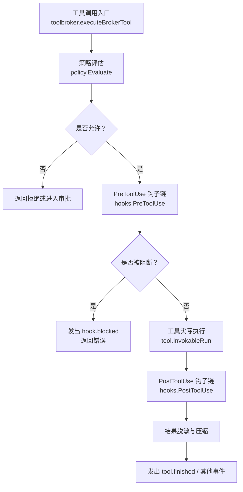
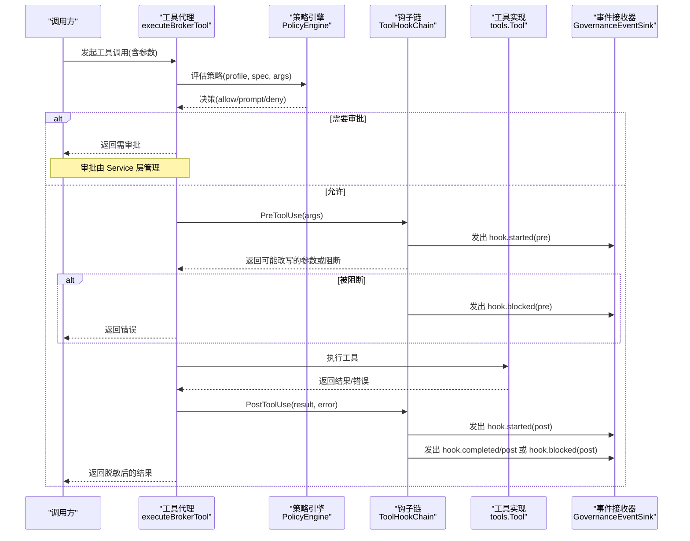
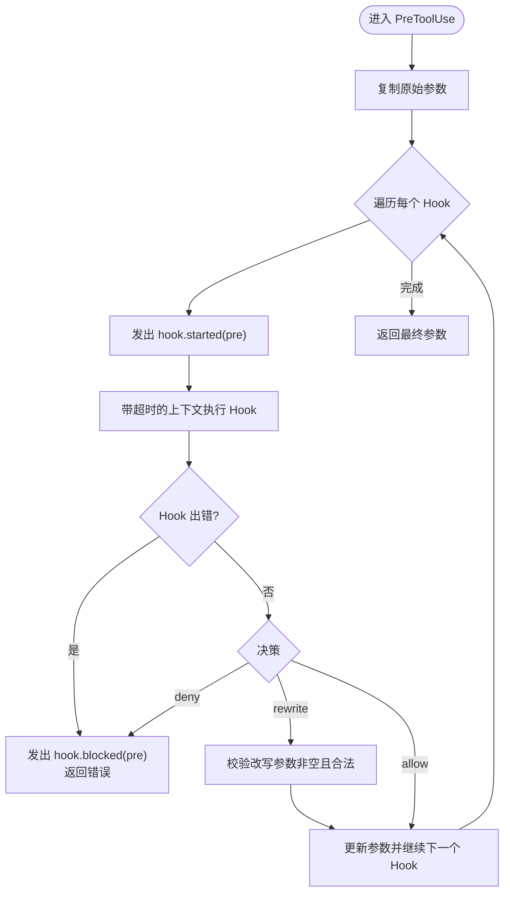
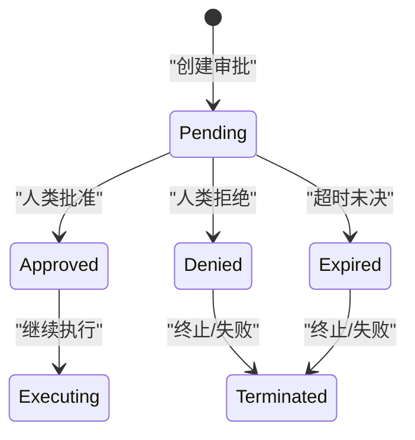
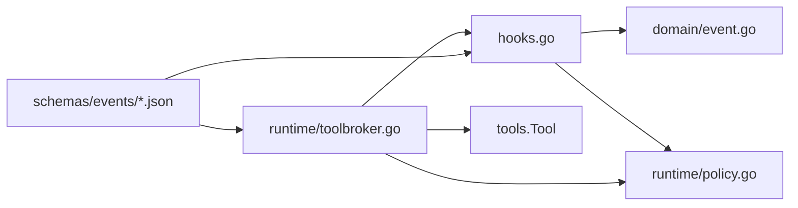

# 治理事件

<cite>
**本文引用的文件**
- [hooks.go](file://internal/runtime/hooks.go)
- [toolbroker.go](file://internal/runtime/toolbroker.go)
- [policy.go](file://internal/runtime/policy.go)
- [event.go](file://internal/domain/event.go)
- [run-event.schema.json](file://schemas/events/run-event.schema.json)
- [hook.started.json](file://schemas/events/payloads/hook.started.json)
- [hook.completed.json](file://schemas/events/payloads/hook.completed.json)
- [hook.blocked.json](file://schemas/events/payloads/hook.blocked.json)
- [service.go](file://internal/runtime/service.go)
- [toolselection_middleware.go](file://internal/runtime/toolselection_middleware.go)
</cite>

## 目录
1. [简介](#简介)
2. [项目结构](#项目结构)
3. [核心组件](#核心组件)
4. [架构总览](#架构总览)
5. [详细组件分析](#详细组件分析)
6. [依赖关系分析](#依赖关系分析)
7. [性能与超时](#性能与超时)
8. [故障排查指南](#故障排查指南)
9. [结论](#结论)
10. [附录：策略配置与自定义钩子开发](#附录：策略配置与自定义钩子开发)

## 简介
本文档聚焦于 Vivy 运行时中的“治理事件”体系，围绕 ToolHookChain 的 PreToolUse 与 PostToolUse 钩子执行流程展开，解释治理事件类型（EventHookStarted、EventHookCompleted、EventHookBlocked）及其触发条件，并系统说明工具调用的审批流程、权限检查、参数重写机制、超时处理、错误传播与审计日志记录。文末提供治理策略配置与自定义钩子开发指南，帮助读者在安全可控的前提下扩展治理能力。

## 项目结构
与治理事件直接相关的代码主要分布在 internal/runtime 与 internal/domain，以及 schemas/events 下的 JSON Schema 定义：
- internal/runtime/hooks.go：实现 ToolHookChain、Pre/Post 钩子生命周期、治理事件发射器。
- internal/runtime/toolbroker.go：工具调用入口，串联策略评估、钩子链、工具执行与结果脱敏。
- internal/runtime/policy.go：策略引擎，负责按 Profile 与规则对工具调用进行允许/拒绝/提示决策。
- internal/domain/event.go：统一的事件类型枚举与运行事件契约。
- schemas/events/*：RunEvent 信封与各事件负载的 JSON Schema，保证前后端一致。
- internal/runtime/service.go：审批流、过期与终止事件等上层编排逻辑。
- internal/runtime/toolselection_middleware.go：Eino 边界处的工具白名单过滤，作为第二道防线。

图表来源
- [toolbroker.go:26-92](file://internal/runtime/toolbroker.go#L26-L92)
- [hooks.go:58-129](file://internal/runtime/hooks.go#L58-L129)
- [policy.go:96-135](file://internal/runtime/policy.go#L96-L135)

章节来源
- [toolbroker.go:12-92](file://internal/runtime/toolbroker.go#L12-L92)
- [hooks.go:14-159](file://internal/runtime/hooks.go#L14-L159)
- [policy.go:19-135](file://internal/runtime/policy.go#L19-L135)
- [event.go:8-81](file://internal/domain/event.go#L8-L81)
- [run-event.schema.json:1-76](file://schemas/events/run-event.schema.json#L1-L76)

## 核心组件
- ToolHookChain：维护一组 ToolHook，为每次工具调用提供 PreToolUse 与 PostToolUse 两阶段拦截能力；内置超时控制与治理事件发射。
- ToolHook：进程内接口，包含 Name、PreToolUse、PostToolUse 三个方法，用于实现权限检查、参数重写、审计记录等。
- PolicyEngine：基于 Profile 与规则表对工具调用进行决策（Allow/Prompt/Deny），并对改写后的参数进行二次评估。
- GovernanceEventSink：通过 context 注入的事件落盘回调，将治理事件持久化到 Journal，供 UI 与审计消费。
- ToolSelectionMiddleware：在 Eino 边界过滤可用工具集合，限制模型可选择的工具范围。

章节来源
- [hooks.go:24-56](file://internal/runtime/hooks.go#L24-L56)
- [hooks.go:40-44](file://internal/runtime/hooks.go#L40-L44)
- [policy.go:35-84](file://internal/runtime/policy.go#L35-L84)
- [hooks.go:143-159](file://internal/runtime/hooks.go#L143-L159)
- [toolselection_middleware.go:11-41](file://internal/runtime/toolselection_middleware.go#L11-L41)

## 架构总览
下图展示了从工具请求到最终结果的完整治理路径，包括策略评估、钩子链、审批与事件发射。

图表来源
- [toolbroker.go:26-92](file://internal/runtime/toolbroker.go#L26-L92)
- [hooks.go:58-129](file://internal/runtime/hooks.go#L58-L129)
- [policy.go:96-135](file://internal/runtime/policy.go#L96-L135)

## 详细组件分析

### ToolHookChain 工作机制
- PreToolUse：
  - 遍历所有已注册的 ToolHook，逐个执行。
  - 每个 Hook 执行前发出 hook.started(phase=pre)。
  - 使用上下文超时保护，防止钩子阻塞主流程。
  - 支持三种决策：允许、拒绝、改写参数。
  - 若拒绝或异常，发出 hook.blocked(phase=pre)，并向上返回错误。
  - 若改写参数，必须是非空且合法 JSON，随后继续下一个 Hook。
  - 全部通过后返回最终参数。
- PostToolUse：
  - 工具副作用不可撤销，因此采用 fail-open 设计：即使 Post 钩子失败也不影响工具结果。
  - 每个 Hook 执行前发出 hook.started(phase=post)。
  - 失败时记录警告并发出 hook.blocked(phase=post)，继续执行后续 Hook。
  - 成功则发出 hook.completed(phase=post)。

图表来源
- [hooks.go:58-103](file://internal/runtime/hooks.go#L58-L103)

章节来源
- [hooks.go:58-129](file://internal/runtime/hooks.go#L58-L129)

### 治理事件类型与触发条件
- EventHookStarted：
  - 触发时机：每次 Pre/Post 钩子开始执行时。
  - 负载字段：tool_name、hook_name、phase、profile。
- EventHookCompleted：
  - 触发时机：Pre 阶段允许或改写成功；Post 阶段成功完成。
  - 负载字段：tool_name、hook_name、phase、decision、reason、duration_ms、profile。
- EventHookBlocked：
  - 触发时机：Pre 阶段拒绝或异常；Post 阶段异常。
  - 负载字段：tool_name、hook_name、phase、reason、duration_ms、profile。

这些事件遵循 schemas/events/run-event.schema.json 的 RunEvent 信封，并通过 GovernanceEventSink 持久化。

章节来源
- [event.go:26-28](file://internal/domain/event.go#L26-L28)
- [hooks.go:131-159](file://internal/runtime/hooks.go#L131-L159)
- [run-event.schema.json:1-76](file://schemas/events/run-event.schema.json#L1-L76)
- [hook.started.json:1-15](file://schemas/events/payloads/hook.started.json#L1-L15)
- [hook.completed.json:1-18](file://schemas/events/payloads/hook.completed.json#L1-L18)
- [hook.blocked.json:1-16](file://schemas/events/payloads/hook.blocked.json#L1-L16)

### 工具调用审批流程
- 策略评估：
  - 在工具执行前，PolicyEngine.Evaluate 根据 profile 与规则决定 allow/prompt/deny。
  - 若结果为 deny 且未预先批准，直接拒绝。
  - 若结果为 prompt，进入审批流程。
- 审批状态机（Service 层）：
  - 创建审批提案，设置过期时间。
  - 等待人类决策（approved/denied）。
  - 若超时未决，标记过期并结束运行或失败。
  - 决策后发出 tool.approval_decided 等事件。
- 已批准的调用：
  - ExecuteApprovedBrokerTool 会跳过初始提示决策，但仍重新评估钩子改写后的参数，确保不会静默扩大权限。

图表来源
- [service.go:1104-1133](file://internal/runtime/service.go#L1104-L1133)
- [service.go:1270-1303](file://internal/runtime/service.go#L1270-L1303)
- [service.go:1422-1449](file://internal/runtime/service.go#L1422-L1449)

章节来源
- [toolbroker.go:19-24](file://internal/runtime/toolbroker.go#L19-L24)
- [policy.go:96-135](file://internal/runtime/policy.go#L96-L135)
- [service.go:1104-1133](file://internal/runtime/service.go#L1104-L1133)
- [service.go:1270-1303](file://internal/runtime/service.go#L1270-L1303)
- [service.go:1422-1449](file://internal/runtime/service.go#L1422-L1449)

### 权限检查与参数重写机制
- 权限检查：
  - 首次评估：PolicyEngine.Evaluate(profile, spec, args)。
  - 改写后重评估：若 Pre 钩子改写参数，再次 Evaluate，确保不放宽权限。
  - 工具白名单：toolSelectionMiddleware 在 Eino 边界过滤可用工具，作为第二道防线。
- 参数重写：
  - Pre 钩子可返回 rewrite 决策并提供新的参数 JSON。
  - 重写参数必须非空且合法，否则视为阻断。
  - 重写后的参数会经过工具参数验证与安全校验。

章节来源
- [toolbroker.go:52-82](file://internal/runtime/toolbroker.go#L52-L82)
- [toolselection_middleware.go:23-41](file://internal/runtime/toolselection_middleware.go#L23-L41)
- [hooks.go:88-100](file://internal/runtime/hooks.go#L88-L100)

### 超时处理、错误传播与审计日志
- 超时处理：
  - 每个钩子执行都带有独立超时上下文，避免长时间阻塞。
  - 超时被视为阻断，发出 hook.blocked 并记录原因。
- 错误传播：
  - Pre 钩子错误会立即中断后续流程，向上传播错误。
  - Post 钩子错误仅记录警告，不影响工具结果（fail-open）。
- 审计日志：
  - 所有治理事件通过 GovernanceEventSink 持久化，供审计与 UI 展示。
  - 策略评估结果也作为治理事件发出，便于追踪决策依据。

章节来源
- [hooks.go:64-79](file://internal/runtime/hooks.go#L64-L79)
- [hooks.go:111-128](file://internal/runtime/hooks.go#L111-L128)
- [hooks.go:151-159](file://internal/runtime/hooks.go#L151-L159)
- [toolbroker.go:56-59](file://internal/runtime/toolbroker.go#L56-L59)

## 依赖关系分析
- ToolHookChain 依赖 domain.EventType 与 PolicyProfile，用于事件与策略上下文。
- toolbroker 依赖 tools.Tool 与 PolicyEngine，协调策略、钩子与工具执行。
- policy.go 依赖 domain.PolicyDecision 与 ToolSpec，进行规则匹配与默认决策。
- event schema 约束了事件载荷结构，确保跨组件一致性。

图表来源
- [hooks.go:1-159](file://internal/runtime/hooks.go#L1-159)
- [toolbroker.go:1-93](file://internal/runtime/toolbroker.go#L1-L93)
- [policy.go:1-274](file://internal/runtime/policy.go#L1-L274)
- [event.go:1-129](file://internal/domain/event.go#L1-L129)
- [run-event.schema.json:1-76](file://schemas/events/run-event.schema.json#L1-L76)

章节来源
- [hooks.go:1-159](file://internal/runtime/hooks.go#L1-L159)
- [toolbroker.go:1-93](file://internal/runtime/toolbroker.go#L1-L93)
- [policy.go:1-274](file://internal/runtime/policy.go#L1-L274)
- [event.go:1-129](file://internal/domain/event.go#L1-L129)

## 性能与超时
- 钩子链顺序执行，复杂度 O(n) 其中 n 为钩子数量。
- 每个钩子具备独立超时，避免单个钩子拖垮整体流程。
- 建议：
  - 保持钩子逻辑轻量，避免阻塞 IO。
  - 合理设置超时阈值，平衡安全性与响应性。
  - 对高频工具调用，考虑缓存策略评估结果以减少重复计算。

[本节为通用指导，不直接分析具体文件]

## 故障排查指南
- 常见现象与定位：
  - 工具调用被阻断：检查 hook.blocked 事件，确认是 Pre 拒绝还是异常。
  - 参数被改写：查看 hook.completed 的 decision=rewrite 与 reason。
  - 审批超时：检查 tool.approval_expired 及运行终止事件。
- 排查步骤：
  - 检索对应 run_id 的治理事件序列，关注 hook.started -> hook.completed/blocked 的顺序。
  - 核对策略规则与 Profile，确认是否符合预期。
  - 检查钩子实现是否存在异常或超时。
- 日志与审计：
  - 利用 GovernanceEventSink 的持久化事件进行回溯。
  - 结合工具执行前后的参数快照，定位改写来源。

章节来源
- [hooks.go:64-128](file://internal/runtime/hooks.go#L64-L128)
- [service.go:1104-1133](file://internal/runtime/service.go#L1104-L1133)
- [service.go:1270-1303](file://internal/runtime/service.go#L1270-L1303)
- [service.go:1422-1449](file://internal/runtime/service.go#L1422-L1449)

## 结论
Vivy 的治理事件体系以 ToolHookChain 为核心，围绕 Pre/Post 两阶段钩子实现了细粒度的工具调用治理。通过策略引擎与审批流程的配合，系统在安全与灵活性之间取得平衡。事件驱动的审计与可视化能力，使得治理过程可观测、可追溯。配合合理的策略配置与自定义钩子开发，可在不同场景下实现定制化的治理策略。

[本节为总结性内容，不直接分析具体文件]

## 附录：策略配置与自定义钩子开发

### 治理策略配置
- Profile 与默认决策：
  - 内置 Profile：default、plan、readOnly、fullAuto，分别对应不同的默认行为。
  - 可通过 PolicyDefinition 为各 Profile 配置规则与默认决策。
- 规则匹配：
  - 支持按工具名与参数字段匹配（等于或前缀）。
  - 规则优先级：deny > prompt > allow。
- 策略哈希：
  - 每个 Profile 的配置生成唯一哈希，便于版本管理与审计关联。

章节来源
- [policy.go:30-84](file://internal/runtime/policy.go#L30-L84)
- [policy.go:116-135](file://internal/runtime/policy.go#L116-L135)
- [policy.go:137-169](file://internal/runtime/policy.go#L137-L169)
- [policy.go:171-202](file://internal/runtime/policy.go#L171-L202)

### 自定义钩子开发指南
- 实现 ToolHook 接口：
  - Name：钩子名称，用于事件与日志标识。
  - PreToolUse：实现权限检查、参数重写、前置审计等。
  - PostToolUse：实现后置审计、指标收集、清理资源等。
- 注册与超时：
  - 通过 NewToolHookChain 传入超时与钩子列表。
  - 钩子内部应避免阻塞，必要时使用异步或限流。
- 最佳实践：
  - 在 Pre 中严格校验输入，拒绝危险操作。
  - 在 Post 中记录执行结果与耗时，便于审计与分析。
  - 对敏感信息进行脱敏后再写入日志或事件。

章节来源
- [hooks.go:24-56](file://internal/runtime/hooks.go#L24-L56)
- [hooks.go:40-44](file://internal/runtime/hooks.go#L40-L44)
- [hooks.go:58-129](file://internal/runtime/hooks.go#L58-L129)