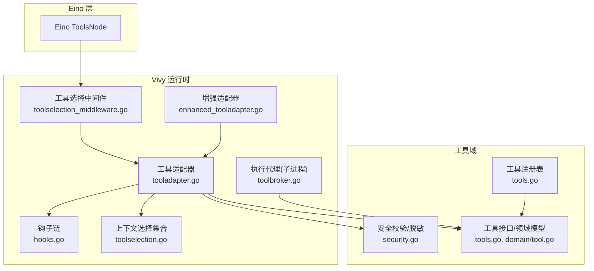
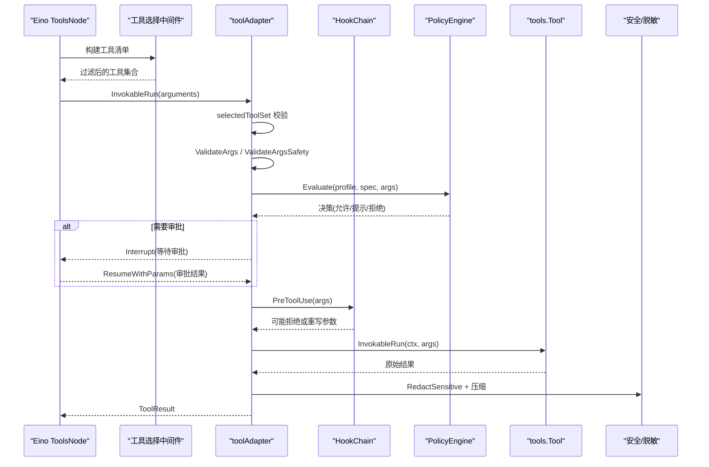
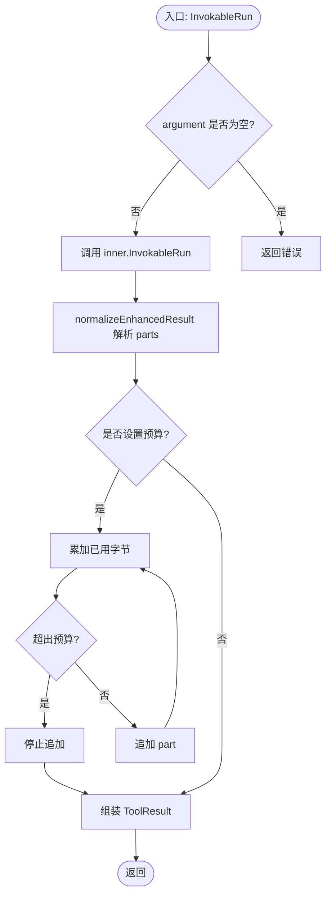
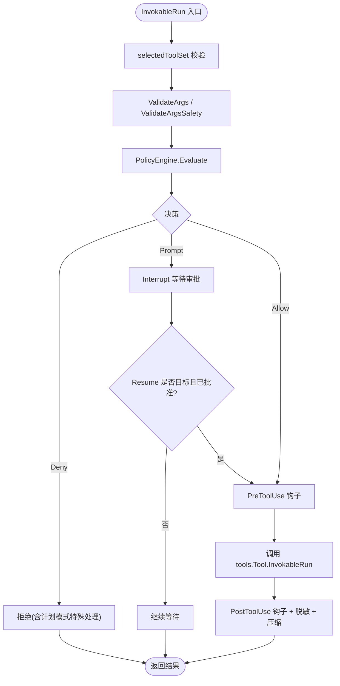
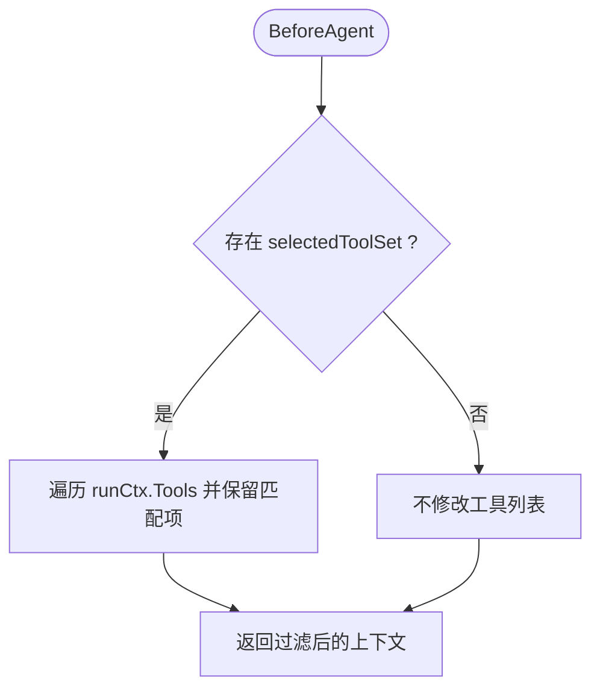
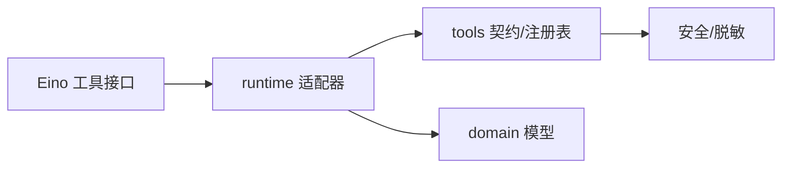

# 工具适配器

<cite>
**本文引用的文件**
- [enhanced_tooladapter.go](file://internal/runtime/enhanced_tooladapter.go)
- [tooladapter.go](file://internal/runtime/tooladapter.go)
- [toolselection_middleware.go](file://internal/runtime/toolselection_middleware.go)
- [toolbroker.go](file://internal/runtime/toolbroker.go)
- [hooks.go](file://internal/runtime/hooks.go)
- [toolselection.go](file://internal/runtime/toolselection.go)
- [tools.go](file://internal/tools/tools.go)
- [security.go](file://internal/tools/security.go)
- [echo.go](file://internal/tools/echo.go)
- [tool.go](file://internal/domain/tool.go)
</cite>

## 目录
1. [简介](#简介)
2. [项目结构](#项目结构)
3. [核心组件](#核心组件)
4. [架构总览](#架构总览)
5. [详细组件分析](#详细组件分析)
6. [依赖关系分析](#依赖关系分析)
7. [性能考量](#性能考量)
8. [故障排查指南](#故障排查指南)
9. [结论](#结论)
10. [附录：自定义工具开发示例](#附录自定义工具开发示例)

## 简介
本文件聚焦 Vivy 运行时中的“工具适配器”体系，解释以下关键目标：
- enhanced_tooladapter 如何扩展 Eino 的增强型工具调用能力（参数、结果多部分、预算限制）。
- tooladapter 如何将 Vivy 的 tools.Tool 适配到 Eino 的工具调用框架，包括参数校验、策略评估、HITL 审批、钩子链、错误与结果处理。
- 工具选择中间件如何按请求范围裁剪可用工具集，实现最小暴露面。
- 工具生命周期管理：从注册、选择、策略评估、审批、执行到清理与审计。
- 提供可操作的自定义工具开发指引：注册、权限配置、安全沙箱集成。

## 项目结构
围绕工具适配的核心代码分布在 internal/runtime 与 internal/tools 两个包中：
- internal/runtime：负责将 Vivy 工具桥接到 Eino 工具节点，并承载策略、审批、钩子、事件等治理逻辑。
- internal/tools：定义工具契约、注册表、参数校验与安全扫描，并提供内置工具实现。

图表来源
- [toolselection_middleware.go:11-41](file://internal/runtime/toolselection_middleware.go#L11-L41)
- [tooladapter.go:24-184](file://internal/runtime/tooladapter.go#L24-L184)
- [enhanced_tooladapter.go:13-95](file://internal/runtime/enhanced_tooladapter.go#L13-L95)
- [toolbroker.go:12-93](file://internal/runtime/toolbroker.go#L12-L93)
- [hooks.go:16-160](file://internal/runtime/hooks.go#L16-L160)
- [toolselection.go:5-22](file://internal/runtime/toolselection.go#L5-L22)
- [tools.go:17-362](file://internal/tools/tools.go#L17-L362)
- [security.go:12-79](file://internal/tools/security.go#L12-L79)
- [tool.go:5-112](file://internal/domain/tool.go#L5-L112)

章节来源
- [toolselection_middleware.go:11-41](file://internal/runtime/toolselection_middleware.go#L11-L41)
- [tooladapter.go:24-184](file://internal/runtime/tooladapter.go#L24-L184)
- [enhanced_tooladapter.go:13-95](file://internal/runtime/enhanced_tooladapter.go#L13-L95)
- [toolbroker.go:12-93](file://internal/runtime/toolbroker.go#L12-L93)
- [hooks.go:16-160](file://internal/runtime/hooks.go#L16-L160)
- [toolselection.go:5-22](file://internal/runtime/toolselection.go#L5-L22)
- [tools.go:17-362](file://internal/tools/tools.go#L17-L362)
- [security.go:12-79](file://internal/tools/security.go#L12-L79)
- [tool.go:5-112](file://internal/domain/tool.go#L5-L112)

## 核心组件
- 工具契约与注册表（internal/tools）
  - Tool 接口：Spec() 描述工具元数据；InvokableRun() 执行一次调用。
  - Registry：维护名称到实现的映射，提供 Resolve(enabled) 按配置启用工具。
  - Selector：基于关键词对请求进行确定性路由，返回最小工具集。
- 运行时适配器（internal/runtime）
  - toolAdapter：实现 Eino InvokableTool，串联参数校验、安全校验、策略评估、HITL 审批、钩子链、执行与结果压缩。
  - enhancedToolAdapter：实现 Eino EnhancedInvokableTool，支持结构化多类型输出与字节预算限制。
  - toolSelectionMiddleware：在 Eino Agent 边界按请求裁剪可用工具列表。
  - ExecuteBrokerTool/ExecuteApprovedBrokerTool：子工作进程通过父进程统一执行工具，复用策略与钩子。
  - HookChain：Pre/Post 钩子，支持拒绝、重写参数、超时控制与治理事件。
- 安全与治理（internal/tools/internal/runtime）
  - 参数安全扫描：路径穿越、命令注入、NUL 字节等。
  - 敏感信息脱敏：密钥、邮箱等模式替换。
  - 策略评估与 HITL：允许、提示审批、拒绝；计划模式下禁止效果性工具。

章节来源
- [tools.go:17-362](file://internal/tools/tools.go#L17-L362)
- [tooladapter.go:24-184](file://internal/runtime/tooladapter.go#L24-L184)
- [enhanced_tooladapter.go:13-95](file://internal/runtime/enhanced_tooladapter.go#L13-L95)
- [toolselection_middleware.go:11-41](file://internal/runtime/toolselection_middleware.go#L11-L41)
- [toolbroker.go:12-93](file://internal/runtime/toolbroker.go#L12-L93)
- [hooks.go:16-160](file://internal/runtime/hooks.go#L16-L160)
- [security.go:12-79](file://internal/tools/security.go#L12-L79)
- [tool.go:5-112](file://internal/domain/tool.go#L5-L112)

## 架构总览
下图展示了从 Eino 工具节点到 Vivy 工具实现的完整调用链路，包含选择、校验、策略、审批、钩子、执行与结果处理。

图表来源
- [toolselection_middleware.go:23-41](file://internal/runtime/toolselection_middleware.go#L23-L41)
- [tooladapter.go:78-184](file://internal/runtime/tooladapter.go#L78-L184)
- [hooks.go:58-129](file://internal/runtime/hooks.go#L58-L129)
- [security.go:73-79](file://internal/tools/security.go#L73-L79)

## 详细组件分析

### enhanced_tooladapter：增强型工具结果与预算控制
- 职责
  - 实现 Eino 的 EnhancedInvokableTool 接口，使工具可以返回多类型输出（文本、图片、音频、视频、文件）。
  - 将内部字符串结果解析为结构化 parts，并按 maxResultBytes 预算截断。
- 关键点
  - 入参 argument 非空校验。
  - 委托 inner.InvokableRun 获取原始字符串结果。
  - normalizeEnhancedResult 将 envelope.parts 转换为 schema.ToolOutputPart，并支持 MIMEType、URL、Base64Data。
  - 预算控制：累计 JSON 编码长度，超过预算即停止追加。
- 复杂度
  - 解析与转换 O(n)，n 为 parts 数量；预算检查线性累加。

图表来源
- [enhanced_tooladapter.go:28-95](file://internal/runtime/enhanced_tooladapter.go#L28-L95)

章节来源
- [enhanced_tooladapter.go:13-95](file://internal/runtime/enhanced_tooladapter.go#L13-L95)

### tooladapter：Vivy 工具到 Eino 的适配中枢
- 职责
  - 实现 Eino InvokableTool，封装参数校验、安全校验、策略评估、HITL 审批、钩子链、执行与结果压缩。
  - Info() 将 Vivy 的 ToolSpec 转为 Eino 的 ToolInfo/ParameterInfo，确保模型能正确生成参数名与类型。
- 关键流程
  - 选择集合校验：selectedToolSet 确保本次请求仅允许已选工具。
  - 参数校验：ValidateArgs 严格匹配 Schema；ValidateArgsSafety 拦截危险输入。
  - 策略评估：PolicyEngine.Evaluate 决定允许、提示或拒绝；计划模式下拒绝效果性工具。
  - 审批中断：首次需要审批时中断运行，Resume 后根据审批结果继续或跳过。
  - 钩子链：PreToolUse 可拒绝或重写参数；若重写则重新评估策略。
  - 执行与审计：调用 tools.Tool.InvokableRun，记录 PostToolUse，脱敏并压缩结果。
- 错误映射
  - 参数错误：ArgError，不会 panic。
  - 策略拒绝：ErrPolicyDenied。
  - 计划模式拒绝：ErrPlanModeToolDenied。
  - 提案过期/目标变更：上报 proposal stale。

图表来源
- [tooladapter.go:78-184](file://internal/runtime/tooladapter.go#L78-L184)
- [hooks.go:58-129](file://internal/runtime/hooks.go#L58-L129)
- [security.go:73-79](file://internal/tools/security.go#L73-L79)

章节来源
- [tooladapter.go:24-184](file://internal/runtime/tooladapter.go#L24-L184)
- [hooks.go:16-160](file://internal/runtime/hooks.go#L16-L160)
- [security.go:12-79](file://internal/tools/security.go#L12-L79)

### 工具选择中间件：请求级最小暴露面
- 职责
  - 在 Eino Agent 启动前，根据上下文中的 allowed tool set 过滤 runCtx.Tools，只暴露当前请求需要的工具。
- 行为
  - BeforeAgent：读取 selectedToolSet，遍历候选工具，保留名称匹配的项。
  - 若未设置或无上下文，保持原样。
- 价值
  - 降低模型幻觉风险，减少无关工具被调用的概率。

图表来源
- [toolselection_middleware.go:23-41](file://internal/runtime/toolselection_middleware.go#L23-L41)
- [toolselection.go:5-22](file://internal/runtime/toolselection.go#L5-L22)

章节来源
- [toolselection_middleware.go:11-41](file://internal/runtime/toolselection_middleware.go#L11-L41)
- [toolselection.go:5-22](file://internal/runtime/toolselection.go#L5-L22)

### 执行代理（子进程）：ExecuteBrokerTool
- 职责
  - 子工作进程不能直接执行工具，必须通过父进程的 ExecuteBrokerTool/ExecuteApprovedBrokerTool 统一走策略、钩子、脱敏与压缩。
- 行为
  - 参数序列化与校验、安全校验、策略评估（子进程默认不允许，除非 approved=true）。
  - 钩子链 PreToolUse 可拒绝或重写参数，重写需再次评估。
  - 执行工具、记录 PostToolUse、脱敏并压缩结果。
- 适用场景
  - 隔离执行、权限收敛、审计集中化。

章节来源
- [toolbroker.go:12-93](file://internal/runtime/toolbroker.go#L12-L93)

### 钩子链：Pre/Post 治理与审计
- 职责
  - PreToolUse：可拒绝执行、重写参数；支持超时控制；失败或拒绝会阻断执行。
  - PostToolUse：fail-open，不影响工具结果，但记录审计事件。
- 治理事件
  - 记录 HookStarted/HookCompleted/HookBlocked，包含工具名、阶段、原因、耗时。
- 使用方式
  - 通过 NewToolHookChain 构造，传入多个 ToolHook 实现。

章节来源
- [hooks.go:16-160](file://internal/runtime/hooks.go#L16-L160)

### 工具注册与选择：Registry 与 Selector
- 注册
  - Registry.NewRegistry 接收一组 Tool，重复名称会 panic。
  - Builtin* 系列工厂方法组合不同能力（笔记、文件、技能、任务、网络搜索、HTTP、MCP、顺序思考、命令等）。
- 选择
  - Selector.Select 基于请求关键词与工具 Spec.Keywords 计算得分，返回最高分工具集合，保证确定性。
  - Registry.Resolve(enabled) 按配置启用工具，未知名称报错。

章节来源
- [tools.go:122-362](file://internal/tools/tools.go#L122-L362)

### 安全与脱敏：安全前置与结果保护
- 参数安全
  - ValidateArgsSafety 检测路径穿越、UNC 路径、NUL 字节、命令注入关键字等。
- 敏感信息
  - RedactSensitive 替换常见密钥与邮箱形式，避免泄露到模型上下文或持久化负载。
- 提示注入信号
  - ScanPrompt 识别指令覆盖语言，作为预检信号供 UI/审计消费。

章节来源
- [security.go:12-79](file://internal/tools/security.go#L12-L79)

## 依赖关系分析
- 耦合与内聚
  - runtime 包依赖 tools 包的工具契约与注册表，但不反向依赖；符合架构红线（仅 runtime/provider 可依赖 eino）。
  - toolAdapter 聚合 PolicyEngine、HookChain、tools.Tool，高内聚地封装一次工具调用的全生命周期。
- 外部依赖
  - Eino 工具接口（InvokableTool/EnhancedInvokableTool）仅在 runtime 层使用，对外部不可见。
- 潜在循环
  - 未发现循环依赖；工具实现位于 tools 包，不包含运行时治理逻辑。

图表来源
- [tooladapter.go:1-242](file://internal/runtime/tooladapter.go#L1-L242)
- [tools.go:17-362](file://internal/tools/tools.go#L17-L362)
- [tool.go:5-112](file://internal/domain/tool.go#L5-L112)

章节来源
- [tooladapter.go:1-242](file://internal/runtime/tooladapter.go#L1-L242)
- [tools.go:17-362](file://internal/tools/tools.go#L17-L362)
- [tool.go:5-112](file://internal/domain/tool.go#L5-L112)

## 性能考量
- 结果压缩
  - compactToolResult 对超长结果进行头尾截取，避免模型上下文膨胀。
- 预算控制
  - enhanced_tooladapter 对结构化 parts 进行字节预算限制，防止大对象溢出。
- 钩子超时
  - HookChain 为每个钩子设置超时，避免阻塞主流程。
- 选择最小化工具集
  - 通过 Selector 与中间件减少模型可选工具数量，降低幻觉与调度开销。

[本节为通用指导，无需特定文件引用]

## 故障排查指南
- 参数错误
  - 现象：调用立即失败，错误类型为 ArgError。
  - 排查：检查工具 Spec.Params 与实际传入 JSON 字段是否一致，必填项是否缺失。
  - 参考路径
    - [参数校验:41-84](file://internal/tools/tools.go#L41-L84)
    - [参数安全校验:38-71](file://internal/tools/security.go#L38-L71)
- 策略拒绝
  - 现象：返回 ErrPolicyDenied，附带原因。
  - 排查：查看策略快照与评估原因；确认 Profile 与工具 Readonly 属性。
  - 参考路径
    - [策略评估与拒绝:91-105](file://internal/runtime/tooladapter.go#L91-L105)
- 计划模式拒绝
  - 现象：效果性工具在 Plan Mode 下被拒绝。
  - 排查：切换运行模式或调整工具 Readonly。
  - 参考路径
    - [计划模式拒绝:100-104](file://internal/runtime/tooladapter.go#L100-L104)
- 审批中断
  - 现象：首次执行中断，等待用户审批。
  - 排查：确认 Resume 携带正确的 target 与决策；若目标变更，可能因提案过期而失败。
  - 参考路径
    - [审批中断与恢复:139-162](file://internal/runtime/tooladapter.go#L139-L162)
- 钩子阻塞
  - 现象：PreToolUse 返回 deny 或超时，导致执行被阻止。
  - 排查：检查钩子实现与超时配置；关注治理事件中的 HookBlocked。
  - 参考路径
    - [钩子链:58-129](file://internal/runtime/hooks.go#L58-L129)
- 结果过大
  - 现象：模型收到被压缩的结果。
  - 排查：调整 maxResultBytes；检查工具输出大小。
  - 参考路径
    - [结果压缩:186-202](file://internal/runtime/tooladapter.go#L186-L202)

章节来源
- [tools.go:41-84](file://internal/tools/tools.go#L41-L84)
- [security.go:38-71](file://internal/tools/security.go#L38-L71)
- [tooladapter.go:91-162](file://internal/runtime/tooladapter.go#L91-L162)
- [hooks.go:58-129](file://internal/runtime/hooks.go#L58-L129)
- [tooladapter.go:186-202](file://internal/runtime/tooladapter.go#L186-L202)

## 结论
Vivy 的工具适配器体系以 toolAdapter 为核心，将 Vivy 工具契约与 Eino 工具框架解耦，同时提供强大的治理能力：
- 通过工具选择中间件实现请求级最小暴露面。
- 通过参数与安全校验、策略评估与 HITL 审批保障执行安全。
- 通过钩子链实现可扩展的前置/后置治理与审计。
- 通过增强适配器支持多类型输出与预算控制。
- 通过执行代理统一子进程工具执行，收敛权限与审计。

该设计在保证安全与可观测性的同时，提供了清晰的扩展点，便于开发者快速接入新工具与治理策略。

[本节为总结，无需特定文件引用]

## 附录：自定义工具开发示例
以下示例展示如何开发一个自定义工具，涵盖注册、参数校验、权限配置与安全沙箱集成。为避免泄露具体实现，仅提供路径指引与步骤说明。

- 步骤一：实现工具契约
  - 定义 Spec：声明 Name、Description、Readonly、Params、Keywords、Interaction。
  - 实现 InvokableRun：接收 json.RawMessage，进行领域级校验与业务执行，返回字符串结果。
  - 参考路径
    - [工具接口与领域模型:17-32](file://internal/tools/tools.go#L17-L32)
    - [工具规范定义:27-50](file://internal/domain/tool.go#L27-L50)
    - [简单工具示例:19-58](file://internal/tools/echo.go#L19-L58)

- 步骤二：注册工具
  - 将工具加入 Registry，可通过 Builtin* 工厂方法组合或使用 NewRegistry。
  - 参考路径
    - [注册表与工厂方法:223-317](file://internal/tools/tools.go#L223-L317)

- 步骤三：配置权限与选择
  - 在配置中启用工具名称，或通过 Selector 关键词路由。
  - 参考路径
    - [选择器与关键词:138-202](file://internal/tools/tools.go#L138-L202)
    - [Resolve 启用工具:343-361](file://internal/tools/tools.go#L343-L361)

- 步骤四：集成安全与沙箱
  - 利用 ValidateArgsSafety 进行通用安全校验；必要时在工具内部做更严格的领域校验。
  - 如需沙箱隔离，结合 SandboxMode 与 ApprovalPolicy 在策略层配置。
  - 参考路径
    - [安全校验:38-71](file://internal/tools/security.go#L38-L71)
    - [审批与沙箱字段:81-112](file://internal/domain/tool.go#L81-L112)

- 步骤五：接入钩子与审计
  - 通过 HookChain 实现 Pre/Post 钩子，记录审计事件与治理指标。
  - 参考路径
    - [钩子链:16-160](file://internal/runtime/hooks.go#L16-L160)

- 步骤六：测试与验证
  - 使用工具选择器与中间件验证最小暴露面。
  - 模拟审批流程，验证中断与恢复。
  - 参考路径
    - [中间件过滤:23-41](file://internal/runtime/toolselection_middleware.go#L23-L41)
    - [审批中断与恢复:139-162](file://internal/runtime/tooladapter.go#L139-L162)

章节来源
- [tools.go:17-362](file://internal/tools/tools.go#L17-L362)
- [tool.go:27-112](file://internal/domain/tool.go#L27-L112)
- [echo.go:19-58](file://internal/tools/echo.go#L19-L58)
- [security.go:38-71](file://internal/tools/security.go#L38-L71)
- [toolselection_middleware.go:23-41](file://internal/runtime/toolselection_middleware.go#L23-L41)
- [tooladapter.go:139-162](file://internal/runtime/tooladapter.go#L139-L162)