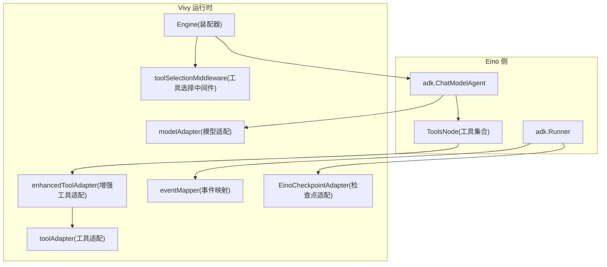
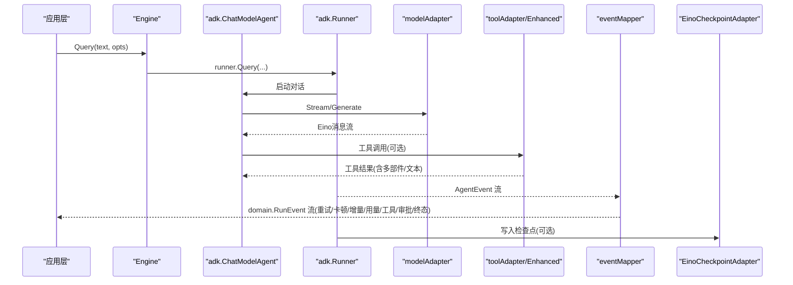
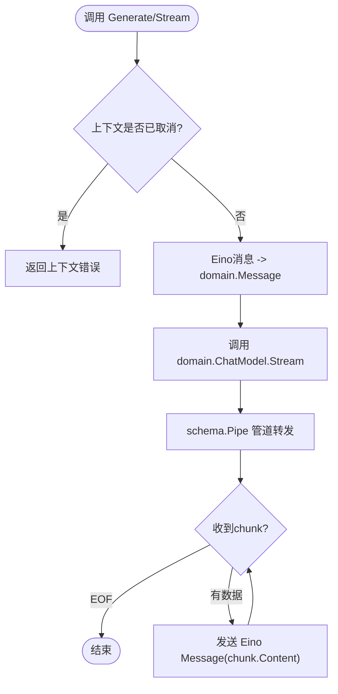
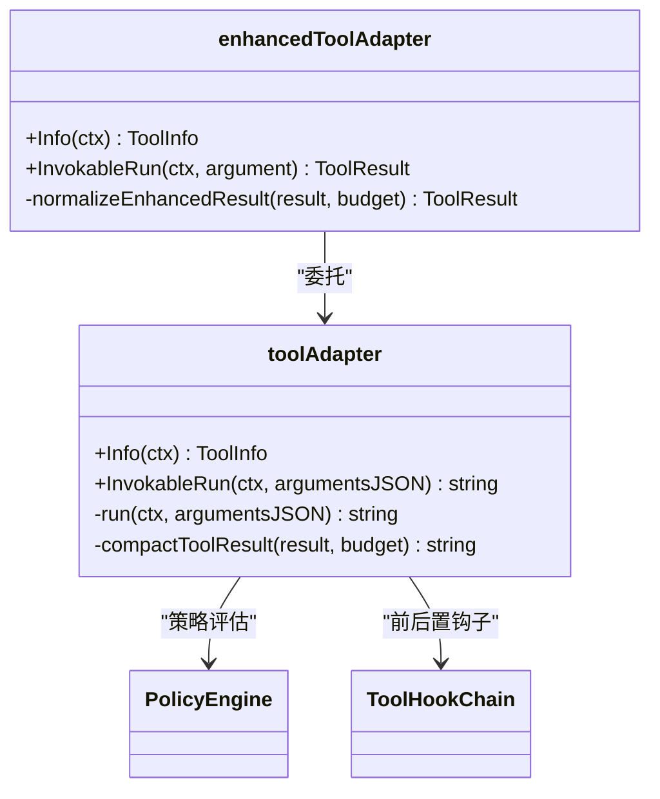
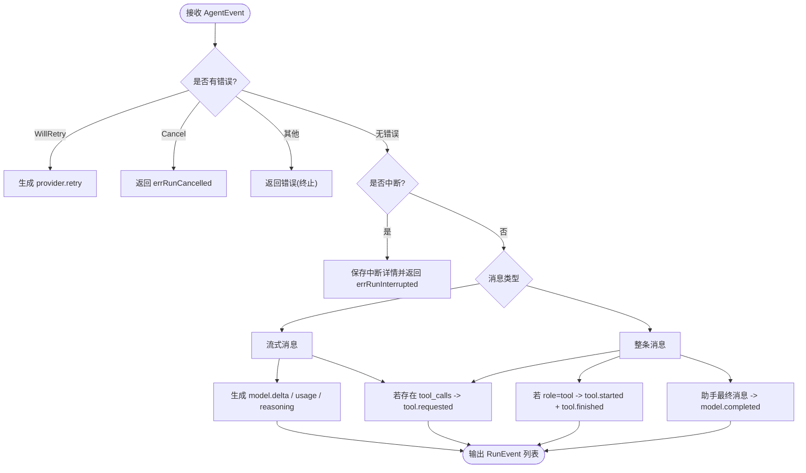
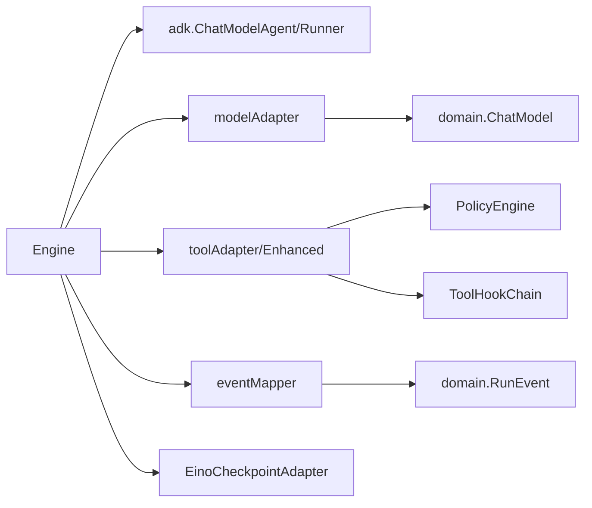

# 引擎适配层

<cite>
**本文引用的文件**
- [engine.go](file://internal/runtime/engine.go)
- [modeladapter.go](file://internal/runtime/modeladapter.go)
- [tooladapter.go](file://internal/runtime/tooladapter.go)
- [enhanced_tooladapter.go](file://internal/runtime/enhanced_tooladapter.go)
- [mapper.go](file://internal/runtime/mapper.go)
- [payloads.go](file://internal/runtime/payloads.go)
- [event.go](file://internal/domain/event.go)
- [run.go](file://internal/domain/run.go)
- [model.go](file://internal/domain/model.go)
- [checkpointadapter.go](file://internal/runtime/checkpointadapter.go)
- [toolselection_middleware.go](file://internal/runtime/toolselection_middleware.go)
</cite>

## 目录
1. [简介](#简介)
2. [项目结构](#项目结构)
3. [核心组件](#核心组件)
4. [架构总览](#架构总览)
5. [详细组件分析](#详细组件分析)
6. [依赖关系分析](#依赖关系分析)
7. [性能考虑](#性能考虑)
8. [故障排查指南](#故障排查指南)
9. [结论](#结论)
10. [附录：配置与扩展示例](#附录：配置与扩展示例)

## 简介
本文件聚焦 Vivy 运行时中的“引擎适配层”，解释如何将 Eino（cloudwego/eino）与 Vivy 的领域模型、事件流和工具治理体系集成。重点覆盖：
- ChatModelAgent 构建与 Runner 协调机制
- modeladapter 将 Vivy domain 类型转换为 Eino schema 类型
- enhanced_tooladapter 对工具调用能力的扩展
- 事件流映射到 domain.RunEvent 的规则、负载限制与序列化策略
- 适配器设计模式、错误处理机制与性能优化要点
- 如何配置与扩展适配器功能

## 项目结构
引擎适配层位于 internal/runtime，围绕 Engine 组装 Eino 的 ChatModelAgent 与 Runner，并通过以下适配器完成边界转换与能力增强：
- modeladapter：将 domain.ChatModel 包装为 Eino 的 ToolCallingChatModel
- tooladapter / enhanced_tooladapter：将 tools.Tool 暴露为 Eino 的工具节点，并叠加策略审批、钩子、结果压缩等能力
- mapper：将 Eino AgentEvent 转换为 Vivy domain.RunEvent，负责事件语义、负载裁剪与中断/恢复信息提取
- checkpointadapter：将版本化检查点存储桥接到 Eino Runner 的检查点接口
- toolselection_middleware：在 Eino 代理边界按请求范围过滤可用工具集

**图表来源**
- [engine.go:61-117](file://internal/runtime/engine.go#L61-L117)
- [modeladapter.go:14-89](file://internal/runtime/modeladapter.go#L14-L89)
- [tooladapter.go:24-163](file://internal/runtime/tooladapter.go#L24-L163)
- [enhanced_tooladapter.go:13-95](file://internal/runtime/enhanced_tooladapter.go#L13-L95)
- [mapper.go:40-102](file://internal/runtime/mapper.go#L40-L102)
- [checkpointadapter.go:9-43](file://internal/runtime/checkpointadapter.go#L9-L43)
- [toolselection_middleware.go:11-41](file://internal/runtime/toolselection_middleware.go#L11-L41)

**章节来源**
- [engine.go:18-117](file://internal/runtime/engine.go#L18-L117)
- [modeladapter.go:14-120](file://internal/runtime/modeladapter.go#L14-L120)
- [tooladapter.go:24-242](file://internal/runtime/tooladapter.go#L24-L242)
- [enhanced_tooladapter.go:13-95](file://internal/runtime/enhanced_tooladapter.go#L13-L95)
- [mapper.go:40-412](file://internal/runtime/mapper.go#L40-L412)
- [checkpointadapter.go:9-43](file://internal/runtime/checkpointadapter.go#L9-L43)
- [toolselection_middleware.go:11-41](file://internal/runtime/toolselection_middleware.go#L11-L41)

## 核心组件
- Engine：装配 ChatModelAgent 与 Runner，注入工具集、策略引擎、钩子链、最大迭代次数、检查点存储等；提供 Query/RunHistory/Resume 入口。
- modelAdapter：实现 Eino ToolCallingChatModel，将 domain.ChatModel.Stream 转为 Eino 的消息流，并在 Generate 中聚合流式内容。
- toolAdapter：实现 Eino InvokableTool，执行参数校验、策略评估、HITL 审批、钩子前后置、结果脱敏与大小压缩。
- enhancedToolAdapter：实现 EnhancedInvokableTool，支持多部件输出（文本、图片、音频、视频、文件），并对结果进行规范化与预算控制。
- eventMapper：将 Eino AgentEvent 转换为 domain.RunEvent，包含重试、卡顿、推理片段、增量、用量、工具调用/结果、审批、用户问答、运行终态等事件；负责负载裁剪与中断细节提取。
- EinoCheckpointAdapter：将版本化检查点存储适配为 Eino Runner 的检查点接口，保证持久化断点可恢复。
- toolSelectionMiddleware：在代理启动前按请求上下文过滤工具集，确保模型仅看到允许的工具。

**章节来源**
- [engine.go:18-117](file://internal/runtime/engine.go#L18-L117)
- [modeladapter.go:14-120](file://internal/runtime/modeladapter.go#L14-L120)
- [tooladapter.go:24-242](file://internal/runtime/tooladapter.go#L24-L242)
- [enhanced_tooladapter.go:13-95](file://internal/runtime/enhanced_tooladapter.go#L13-L95)
- [mapper.go:40-412](file://internal/runtime/mapper.go#L40-L412)
- [checkpointadapter.go:9-43](file://internal/runtime/checkpointadapter.go#L9-L43)
- [toolselection_middleware.go:11-41](file://internal/runtime/toolselection_middleware.go#L11-L41)

## 架构总览
下图展示了从应用层发起一次查询到事件落盘的全链路：Engine 组装 Agent 与 Runner，模型通过 modelAdapter 桥接 domain 与 Eino；工具通过 toolAdapter/Enhanced 接入策略与钩子；Runner 的事件经 eventMapper 转换为 RunEvent 并持久化；必要时通过检查点恢复。

**图表来源**
- [engine.go:144-165](file://internal/runtime/engine.go#L144-L165)
- [modeladapter.go:34-89](file://internal/runtime/modeladapter.go#L34-L89)
- [tooladapter.go:78-163](file://internal/runtime/tooladapter.go#L78-L163)
- [enhanced_tooladapter.go:24-95](file://internal/runtime/enhanced_tooladapter.go#L24-L95)
- [mapper.go:74-102](file://internal/runtime/mapper.go#L74-L102)
- [checkpointadapter.go:26-43](file://internal/runtime/checkpointadapter.go#L26-L43)

## 详细组件分析

### 模型适配器（modeladapter）
- 职责：将 Vivy 的 domain.ChatModel 包装为 Eino 的 ToolCallingChatModel，屏蔽 Eino 类型泄漏到 domain 层。
- 关键行为：
  - Generate：基于 Stream 聚合助手回复内容。
  - Stream：将 Eino 消息转换为 domain.Message，再调用 domain.ChatModel.Stream，并以管道方式转发 chunk。
  - WithTools：返回自身（V0 不发射工具调用）。
  - fromEinoMessages/fromEinoRole：角色与工具调用字段映射。
- 复杂度：O(N) 遍历消息列表与流式 chunk；内存占用与流缓冲相关。
- 错误处理：透传上下文取消与下游 Recv 错误。
- 性能：使用 schema.Pipe 缓冲，避免阻塞上游；Generate 时字符串拼接累积响应。

**图表来源**
- [modeladapter.go:34-89](file://internal/runtime/modeladapter.go#L34-L89)
- [modeladapter.go:91-120](file://internal/runtime/modeladapter.go#L91-L120)

**章节来源**
- [modeladapter.go:14-120](file://internal/runtime/modeladapter.go#L14-L120)
- [model.go:31-43](file://internal/domain/model.go#L31-L43)

### 工具适配器（tooladapter + enhanced_tooladapter）
- toolAdapter：
  - Info：将 tools.Tool.Spec 映射为 Eino ToolInfo，包括参数类型与枚举。
  - InvokableRun：参数校验、安全校验、策略评估、HITL 审批、钩子前后置、结果脱敏与大小压缩。
  - 计划模式保护：Plan Mode 下拒绝效果型工具。
  - 结果压缩：compactToolResult 保留头尾并插入标记，防止模型上下文被过大结果撑爆。
- enhanced_tooladapter：
  - 实现 EnhancedInvokableTool，支持多部件输出（text/image/audio/video/file）。
  - normalizeEnhancedResult：解析 JSON 信封，按类型构造 Eino 输出部件，并按预算截断。
- 错误处理：参数非法、策略拒绝、提案过期、目标变更等均有明确错误路径。
- 性能：结果压缩与部件预算控制降低后续模型上下文压力。

**图表来源**
- [tooladapter.go:24-242](file://internal/runtime/tooladapter.go#L24-L242)
- [enhanced_tooladapter.go:13-95](file://internal/runtime/enhanced_tooladapter.go#L13-L95)

**章节来源**
- [tooladapter.go:24-242](file://internal/runtime/tooladapter.go#L24-L242)
- [enhanced_tooladapter.go:13-95](file://internal/runtime/enhanced_tooladapter.go#L13-L95)

### 事件映射器（mapper）
- 职责：将 Eino AgentEvent 转换为 Vivy domain.RunEvent，统一事件词汇表与负载结构。
- 关键规则：
  - 重试/卡顿：WillRetryError -> provider.retry；长时间无进展 -> provider.stall。
  - 推理片段：assistant reasoning 内容 -> model.reasoning_delta。
  - 增量：model.delta 携带文本增量。
  - 用量：model.usage 汇总 prompt/completion/total/reasoning tokens。
  - 工具调用：model 发出 tool_calls -> tool.requested；工具结果 -> tool.started + tool.finished（含 parts）。
  - 审批/问答：中断动作 -> 提取 resume target、tool call id/name/args；用户问答 -> user.question_*。
  - 终态：run.completed/run.failed/run.cancelled（每个 run 恰好一个）。
- 负载限制：clampText 根据 MaxEventPayloadBytes 裁剪 delta/reasoning 文本，避免 JSON 序列化后超限。
- 中断与恢复：extractInterrupt 从 InterruptContexts 解析根因 ID 与工具调用地址，供 ResumeWithParams 使用。

**图表来源**
- [mapper.go:74-102](file://internal/runtime/mapper.go#L74-L102)
- [mapper.go:104-169](file://internal/runtime/mapper.go#L104-L169)
- [mapper.go:171-191](file://internal/runtime/mapper.go#L171-L191)
- [mapper.go:248-324](file://internal/runtime/mapper.go#L248-L324)
- [mapper.go:368-412](file://internal/runtime/mapper.go#L368-L412)

**章节来源**
- [mapper.go:40-412](file://internal/runtime/mapper.go#L40-L412)
- [payloads.go:9-227](file://internal/runtime/payloads.go#L9-L227)
- [event.go:3-129](file://internal/domain/event.go#L3-L129)
- [run.go:5-82](file://internal/domain/run.go#L5-L82)

### 检查点适配（checkpointadapter）
- 职责：将 VersionedCheckpointStore 适配为 Eino Runner 的 CheckPointStore/Deleter，使 Runner 可在中断处持久化状态，支持后续 Resume。
- 关键点：Get/Set/Delete 直接委托给版本化存储，保证字节在进入引擎前被封装验证。

**章节来源**
- [checkpointadapter.go:9-43](file://internal/runtime/checkpointadapter.go#L9-L43)

### 工具选择中间件（toolselection_middleware）
- 职责：在 ChatModelAgent 启动前，依据请求上下文中的工具选择集过滤 ToolsNode 可见的工具集合，形成第一道防线；第二道防线在 toolAdapter 内再次校验。
- 行为：BeforeAgent 中遍历当前工具，调用 Info 获取名称，仅保留白名单内的工具。

**章节来源**
- [toolselection_middleware.go:11-41](file://internal/runtime/toolselection_middleware.go#L11-L41)

## 依赖关系分析
- Engine 依赖 Eino 的 adk 组件（ChatModelAgent、Runner）以及内部工具与策略。
- modelAdapter 依赖 domain.ChatModel，但不反向依赖 Eino 之外的模块。
- toolAdapter/Enhanced 依赖 tools.Tool、PolicyEngine、ToolHookChain，并实现 Eino 工具接口。
- mapper 依赖 Eino 的 AgentEvent/schema，并产出 domain.RunEvent。
- checkpointadapter 桥接 Eino 检查点接口与内部版本化存储。

**图表来源**
- [engine.go:61-117](file://internal/runtime/engine.go#L61-L117)
- [modeladapter.go:14-89](file://internal/runtime/modeladapter.go#L14-L89)
- [tooladapter.go:24-163](file://internal/runtime/tooladapter.go#L24-L163)
- [enhanced_tooladapter.go:13-95](file://internal/runtime/enhanced_tooladapter.go#L13-L95)
- [mapper.go:40-102](file://internal/runtime/mapper.go#L40-L102)
- [checkpointadapter.go:9-43](file://internal/runtime/checkpointadapter.go#L9-L43)

**章节来源**
- [engine.go:61-117](file://internal/runtime/engine.go#L61-L117)
- [modeladapter.go:14-120](file://internal/runtime/modeladapter.go#L14-L120)
- [tooladapter.go:24-242](file://internal/runtime/tooladapter.go#L24-L242)
- [enhanced_tooladapter.go:13-95](file://internal/runtime/enhanced_tooladapter.go#L13-L95)
- [mapper.go:40-412](file://internal/runtime/mapper.go#L40-L412)
- [checkpointadapter.go:9-43](file://internal/runtime/checkpointadapter.go#L9-L43)

## 性能考虑
- 流式处理：modelAdapter 使用 schema.Pipe 缓冲，避免阻塞上游；eventMapper 对流式 chunk 增量处理，减少内存峰值。
- 结果压缩：toolAdapter.compactToolResult 对工具结果进行头尾截取并插入标记，防止模型上下文膨胀。
- 负载限制：eventMapper.clampText 对 delta/reasoning 文本进行裁剪，确保 JSON 序列化后不超过 MaxEventPayloadBytes。
- 迭代上限：EngineConfig.MaxToolTurns 限制模型生成循环次数，避免无限工具调用。
- 上下文与历史限制：MaxContextBytes/MaxHistoryMessages 用于控制传入模型的上下文规模（由上层装配决定）。
- 检查点持久化：仅在需要时启用，避免不必要的 IO。

[本节为通用性能建议，不直接分析具体文件]

## 故障排查指南
- 工具调用失败：
  - 参数校验/安全校验失败：检查工具 Spec 与入参格式。
  - 策略拒绝：查看 policy.evaluated 事件中的决策与原因。
  - 计划模式拒绝：确认是否为 Plan Mode 且工具非只读。
- 审批流程异常：
  - 中断未恢复：检查中断详情（resume target、tool call id/name/args）是否正确传递至 ResumeWithParams。
  - 审批过期/取消：关注 tool.approval_expired/cancelled 事件。
- 事件丢失或重复：
  - 确认每个 run 仅有一个终态事件（completed/failed/cancelled）。
  - 检查 eventMapper 的 onTurnEnd 是否补发了 model.completed。
- 负载超限：
  - 调整 MaxEventPayloadBytes，观察 clampText 日志。
  - 检查工具结果是否过大，必要时在工具实现中主动压缩。
- 提供者卡顿：
  - 关注 provider.stall 事件，结合网络与后端状态排查。

**章节来源**
- [tooladapter.go:78-163](file://internal/runtime/tooladapter.go#L78-L163)
- [mapper.go:74-102](file://internal/runtime/mapper.go#L74-L102)
- [mapper.go:248-324](file://internal/runtime/mapper.go#L248-L324)
- [payloads.go:79-168](file://internal/runtime/payloads.go#L79-L168)
- [event.go:93-129](file://internal/domain/event.go#L93-L129)

## 结论
引擎适配层通过清晰的适配器边界，将 Eino 的能力安全地引入 Vivy 运行时：
- modelAdapter 屏蔽 Eino 类型，保持 domain 纯净
- toolAdapter/Enhanced 将工具调用纳入策略、审批、钩子与结果治理
- eventMapper 统一事件语义、负载与中断恢复信息
- Engine 作为装配中心，协调 Agent、Runner、工具与检查点
该设计在保证可扩展性的同时，提供了强一致的事件流与严格的资源/安全约束。

[本节为总结性内容，不直接分析具体文件]

## 附录：配置与扩展示例
- 配置 Engine：
  - 设置 StreamBuffer、MaxEventPayloadBytes、MaxToolTurns、MaxContextBytes、MaxHistoryMessages、MaxToolResultBytes、Checkpoints、Policy、ToolHooks。
  - 参考：EngineConfig 定义与 NewEngine 装配逻辑。
- 扩展模型：
  - 实现 domain.ChatModel.Stream，并通过 WrapModel 接入 Eino。
  - 参考：WrapModel 与 modelAdapter 实现。
- 扩展工具：
  - 实现 tools.Tool，并在 Engine 初始化时注册；如需多部件输出，确保返回符合 enhancedToolAdapter 期望的 JSON 信封。
  - 参考：toolAdapter.Info/InvokableRun 与 enhancedToolAdapter.normalizeEnhancedResult。
- 自定义事件：
  - 在 mapper 中新增事件分支，遵循 payloads 结构与 EventTypes 词汇表。
  - 参考：mapper.onEvent/onStreamEvent/onMessageEvent 与 payloads 结构体。
- 检查点恢复：
  - 提供 VersionedCheckpointStore，并通过 NewEinoCheckpointAdapter 接入 Runner。
  - 参考：checkpointadapter 与 Engine.Resume。

**章节来源**
- [engine.go:18-117](file://internal/runtime/engine.go#L18-L117)
- [modeladapter.go:14-89](file://internal/runtime/modeladapter.go#L14-L89)
- [tooladapter.go:45-163](file://internal/runtime/tooladapter.go#L45-L163)
- [enhanced_tooladapter.go:24-95](file://internal/runtime/enhanced_tooladapter.go#L24-L95)
- [mapper.go:74-102](file://internal/runtime/mapper.go#L74-L102)
- [payloads.go:9-227](file://internal/runtime/payloads.go#L9-L227)
- [checkpointadapter.go:26-43](file://internal/runtime/checkpointadapter.go#L26-L43)