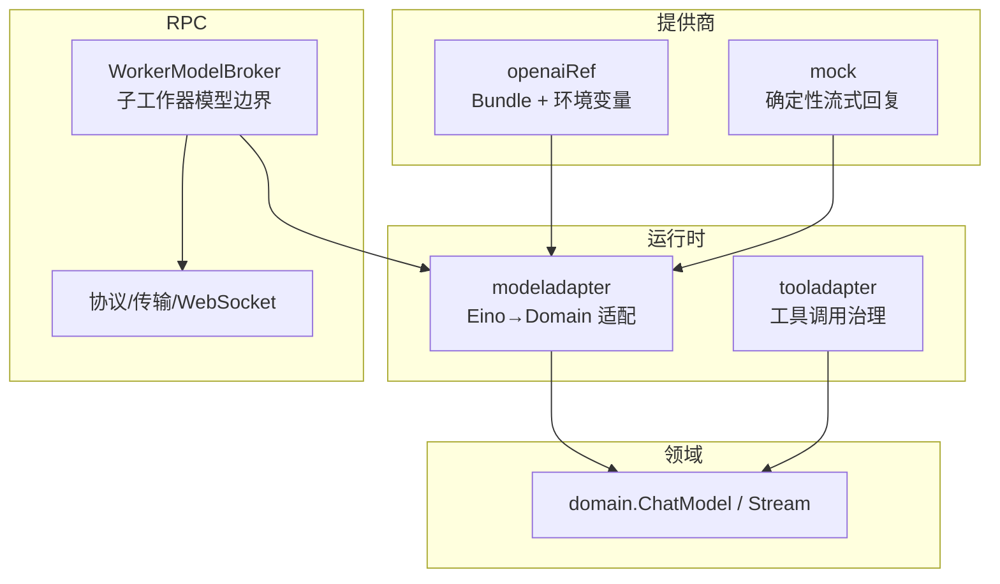
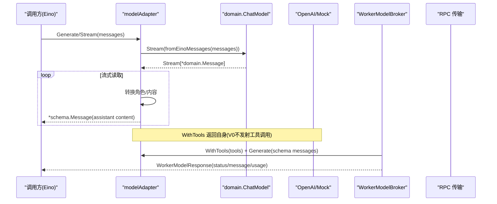
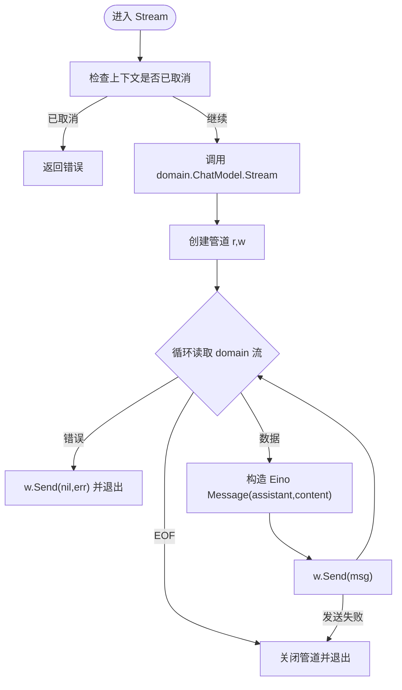
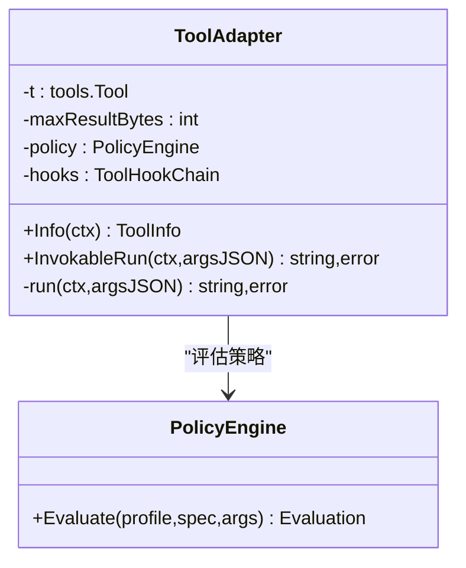
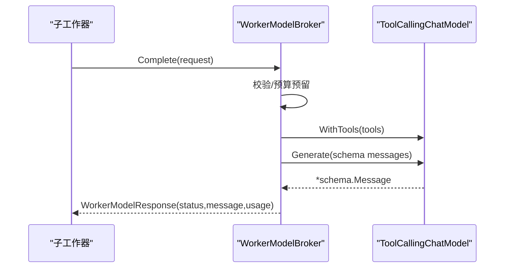
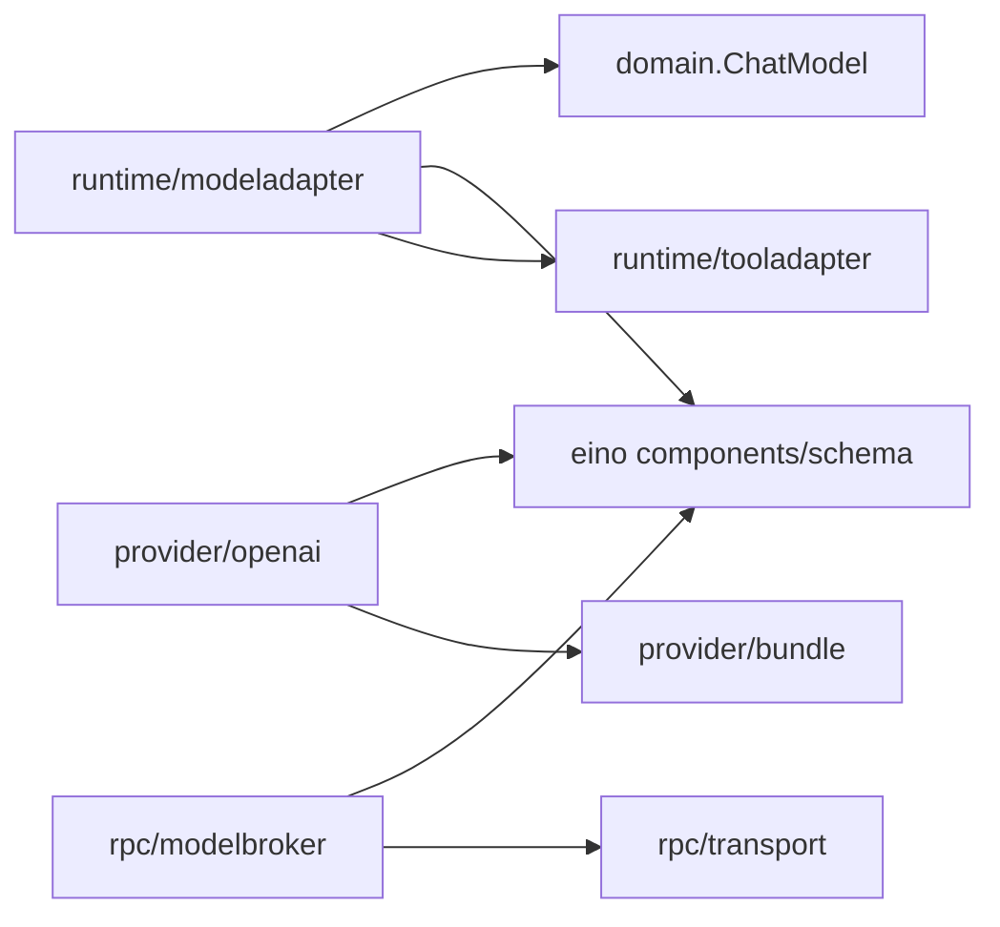

# 模型适配器

<cite>
**本文引用的文件**
- [internal/runtime/modeladapter.go](file://internal/runtime/modeladapter.go)
- [internal/domain/model.go](file://internal/domain/model.go)
- [internal/provider/openai.go](file://internal/provider/openai.go)
- [internal/provider/bundle.go](file://internal/provider/bundle.go)
- [internal/provider/mock.go](file://internal/provider/mock.go)
- [internal/rpc/protocol.go](file://internal/rpc/protocol.go)
- [internal/rpc/transport.go](file://internal/rpc/transport.go)
- [internal/rpc/websocket.go](file://internal/rpc/websocket.go)
- [internal/runtime/tooladapter.go](file://internal/runtime/tooladapter.go)
- [schemas/events/payloads/model.request.json](file://schemas/events/payloads/model.request.json)
- [schemas/events/payloads/model.delta.json](file://schemas/events/payloads/model.delta.json)
- [schemas/events/payloads/model.usage.json](file://schemas/events/payloads/model.usage.json)
</cite>

## 目录
1. [简介](#简介)
2. [项目结构](#项目结构)
3. [核心组件](#核心组件)
4. [架构总览](#架构总览)
5. [详细组件分析](#详细组件分析)
6. [依赖关系分析](#依赖关系分析)
7. [性能考量](#性能考量)
8. [故障排查指南](#故障排查指南)
9. [结论](#结论)
10. [附录：扩展新模型提供商与配置示例](#附录：扩展新模型提供商与配置示例)

## 简介
本文件聚焦于 Vivy 运行时中的“模型适配器”能力，解释 internal/runtime 如何通过 modeladapter 将 Eino schema 类型转换为 Vivy domain 类型，完成消息格式转换、工具调用封装与流式响应处理；并说明 WorkerModelBroker 如何构建一次受预算约束的模型回合。文档同时给出扩展新模型提供商的接口要求、配置管理与性能优化建议，并提供可操作的配置与自定义行为示例（重试策略、超时控制、上下文管理）。

## 项目结构
Vivy 在 D-007 红线下严格隔离 Eino 依赖：仅 internal/runtime 与 internal/provider 允许引入 eino，其他层通过 domain 契约交互。模型适配的核心位于 internal/runtime/modeladapter.go，它把 Eino 的 ToolCallingChatModel 桥接到 domain.ChatModel；provider 层负责按 Bundle 配置构造具体模型实例（如 OpenAI）；RPC 层提供父子进程间或跨服务边界的模型调用边界。

图表来源
- [internal/runtime/modeladapter.go:14-26](file://internal/runtime/modeladapter.go#L14-L26)
- [internal/provider/openai.go:61-78](file://internal/provider/openai.go#L61-L78)
- [internal/provider/mock.go:23-52](file://internal/provider/mock.go#L23-L52)
- [internal/rpc/modelbroker.go:60-126](file://internal/rpc/modelbroker.go#L60-L126)

章节来源
- [internal/runtime/modeladapter.go:14-26](file://internal/runtime/modeladapter.go#L14-L26)
- [internal/provider/bundle.go:28-53](file://internal/provider/bundle.go#L28-L53)

## 核心组件
- 模型适配器 modelAdapter：实现 Eino 的 ToolCallingChatModel，内部委托 domain.ChatModel.Stream，并在 Generate 中聚合流式内容。
- 领域模型 domain.ChatModel：定义 Stream(ctx, input) → Stream[Message] 的最小契约，屏蔽 Eino 细节。
- 提供商 openaiRef：基于 Bundle 与环境变量构造 eino-ext OpenAI ChatModel，支持 APIBase 覆盖。
- 模拟提供商 mock：确定性流式回复，便于测试与离线开发。
- 工具适配器 toolAdapter：将 Vivy tools.Tool 暴露给 Eino ToolsNode，并执行审批、策略评估、结果压缩等治理逻辑。
- RPC 边界 WorkerModelBroker：为子工作器提供受限的模型调用入口，绑定工具、生成消息、汇总用量。

章节来源
- [internal/runtime/modeladapter.go:24-89](file://internal/runtime/modeladapter.go#L24-L89)
- [internal/domain/model.go:31-43](file://internal/domain/model.go#L31-L43)
- [internal/provider/openai.go:61-98](file://internal/provider/openai.go#L61-L98)
- [internal/provider/mock.go:14-76](file://internal/provider/mock.go#L14-L76)
- [internal/runtime/tooladapter.go:24-163](file://internal/runtime/tooladapter.go#L24-L163)
- [internal/rpc/modelbroker.go:60-126](file://internal/rpc/modelbroker.go#L60-L126)

## 架构总览
下图展示从 Eino 调用到 domain 流式输出，再到下游消费的关键路径，包括工具调用与 RPC 边界。

图表来源
- [internal/runtime/modeladapter.go:34-89](file://internal/runtime/modeladapter.go#L34-L89)
- [internal/rpc/modelbroker.go:84-126](file://internal/rpc/modelbroker.go#L84-L126)
- [internal/provider/openai.go:61-78](file://internal/provider/openai.go#L61-L78)

## 详细组件分析

### 模型适配器：Eino ↔ Domain 消息转换与流式处理
- 职责边界：仅在 internal/runtime 内跨越 D-007 防火墙，domain 侧不感知 Eino。
- 消息转换：fromEinoMessages 将 Eino Message 转为 domain.Message，映射 role、content、tool_call_id，并提取首个 tool call 的 function name/arguments。
- 角色映射：User/Tool 保持语义，System 及其他未知角色折叠为 assistant，以匹配 V0 三角色词汇表。
- 流式处理：Stream 使用 schema.Pipe 建立缓冲通道，后台协程持续 Recv domain 流并转发为 Eino stream；对 ctx.Err() 敏感，及时终止。
- 非流式聚合：Generate 通过 Stream 聚合 content 为单条 assistant 消息。
- 工具调用：WithTools 直接返回自身，V0 不向外发射工具调用，符合 scriptedModel 行为约定。

图表来源
- [internal/runtime/modeladapter.go:53-85](file://internal/runtime/modeladapter.go#L53-L85)
- [internal/runtime/modeladapter.go:91-119](file://internal/runtime/modeladapter.go#L91-L119)

章节来源
- [internal/runtime/modeladapter.go:14-26](file://internal/runtime/modeladapter.go#L14-L26)
- [internal/runtime/modeladapter.go:34-89](file://internal/runtime/modeladapter.go#L34-L89)
- [internal/runtime/modeladapter.go:91-119](file://internal/runtime/modeladapter.go#L91-L119)
- [internal/domain/model.go:31-43](file://internal/domain/model.go#L31-L43)

### 工具调用封装：toolAdapter 与策略治理
- 工具信息：Info 将 tools.Tool.Spec 转换为 Eino ToolInfo，包含参数类型、描述、枚举与必填标记。
- 执行前校验：ValidateArgs/ValidateArgsSafety 确保参数合法与安全。
- 策略评估：PolicyEngine 评估决策（允许/拒绝/提示），必要时中断等待人工审批或用户问答。
- 结果压缩：compactToolResult 限制模型可见的工具输出大小，保留审计路径的完整结果。
- 计划模式保护：Plan Mode 下禁止效果型工具执行。

图表来源
- [internal/runtime/tooladapter.go:24-163](file://internal/runtime/tooladapter.go#L24-L163)
- [internal/runtime/tooladapter.go:186-242](file://internal/runtime/tooladapter.go#L186-L242)

章节来源
- [internal/runtime/tooladapter.go:24-163](file://internal/runtime/tooladapter.go#L24-L163)
- [internal/runtime/tooladapter.go:186-242](file://internal/runtime/tooladapter.go#L186-L242)

### 模型提供商：OpenAI 与 Mock
- OpenAI：
  - 从 Bundle 读取默认模型、APIBase、环境变量键名；支持通过环境变量覆盖 BaseURL。
  - 每次 Model() 调用时从环境读取密钥，避免持久化（D-010）。
  - 提供 ModelInfo 用于上下文窗口等元数据。
- Mock：
  - 确定性流式回复，固定块大小，便于测试与离线开发。
  - 尊重上下文取消，保证可中断性。

章节来源
- [internal/provider/openai.go:14-40](file://internal/provider/openai.go#L14-L40)
- [internal/provider/openai.go:61-98](file://internal/provider/openai.go#L61-L98)
- [internal/provider/mock.go:14-76](file://internal/provider/mock.go#L14-L76)
- [internal/provider/bundle.go:28-53](file://internal/provider/bundle.go#L28-L53)

### RPC 边界：WorkerModelBroker
- Complete 流程：
  - 校验请求完整性（messages/runID/parentRunID）。
  - 可选预算预留（BudgetLedger）。
  - 将 worker 工具描述转换为 Eino ToolInfo 并绑定。
  - 调用 bound.Generate 获取最终消息，填充状态、停止原因与用量。
- 消息与工具序列化：workerSchemaMessages/workerMessage 在 JSON-RPC 边界进行双向转换。

图表来源
- [internal/rpc/modelbroker.go:84-126](file://internal/rpc/modelbroker.go#L84-L126)
- [internal/rpc/modelbroker.go:128-189](file://internal/rpc/modelbroker.go#L128-L189)

章节来源
- [internal/rpc/modelbroker.go:60-126](file://internal/rpc/modelbroker.go#L60-L126)
- [internal/rpc/modelbroker.go:128-189](file://internal/rpc/modelbroker.go#L128-L189)

## 依赖关系分析
- 耦合与内聚：
  - modeladapter 仅依赖 domain 与 Eino schema，承担单一职责：类型转换与流式转发。
  - provider 层通过 Bundle 解耦具体后端，openaiRef 是典型实现。
  - tooladapter 与 PolicyEngine/Hooks 形成强内聚的治理闭环。
- 外部依赖：
  - Eino 组件（model/tool/schema）仅在 runtime/provider 中使用。
  - RPC 协议与传输抽象了跨进程/服务的模型调用。

图表来源
- [internal/runtime/modeladapter.go:1-12](file://internal/runtime/modeladapter.go#L1-L12)
- [internal/provider/openai.go:1-12](file://internal/provider/openai.go#L1-L12)
- [internal/provider/bundle.go:1-12](file://internal/provider/bundle.go#L1-L12)
- [internal/runtime/tooladapter.go:1-16](file://internal/runtime/tooladapter.go#L1-L16)

章节来源
- [internal/runtime/modeladapter.go:1-12](file://internal/runtime/modeladapter.go#L1-L12)
- [internal/provider/openai.go:1-12](file://internal/provider/openai.go#L1-L12)
- [internal/provider/bundle.go:1-12](file://internal/provider/bundle.go#L1-L12)
- [internal/runtime/tooladapter.go:1-16](file://internal/runtime/tooladapter.go#L1-L16)

## 性能考量
- 流式优先：modeladapter 使用小缓冲管道与后台协程转发，降低内存峰值并保持取消敏感。
- 工具输出压缩：tooladapter 对工具结果进行头部+尾部裁剪，避免大输出占用上下文。
- 预算与节流：WorkerModelBroker 可结合 BudgetLedger 限制模型调用次数，防止资源耗尽。
- 提供商缓存：OpenAI 模型构造在调用时读取密钥，避免全局缓存带来的安全风险；如需高频复用可在上层做有限缓存。
- 事件与观测：通过事件负载（model.request/delta/usage）进行可观测，便于定位瓶颈。

章节来源
- [internal/runtime/modeladapter.go:53-85](file://internal/runtime/modeladapter.go#L53-L85)
- [internal/runtime/tooladapter.go:186-242](file://internal/runtime/tooladapter.go#L186-L242)
- [internal/rpc/modelbroker.go:84-126](file://internal/rpc/modelbroker.go#L84-L126)
- [schemas/events/payloads/model.request.json](file://schemas/events/payloads/model.request.json)
- [schemas/events/payloads/model.delta.json](file://schemas/events/payloads/model.delta.json)
- [schemas/events/payloads/model.usage.json](file://schemas/events/payloads/model.usage.json)

## 故障排查指南
- 常见错误与定位：
  - 缺少密钥：OpenAI 未设置对应环境变量会返回 KeyMissingError。
  - 空消息/无效请求：WorkerModelBroker 会拒绝不完整请求。
  - 工具被拒绝：tooladapter 在策略评估为 Deny 或 Plan Mode 下执行效果型工具时会报错。
  - 流式中断：ctx.Err() 触发后，适配器会立即停止转发。
- 建议排查步骤：
  - 检查 Bundle 配置与 env_key 是否正确。
  - 确认工具参数通过 ValidateArgs/ValidateArgsSafety。
  - 观察 model.request/delta/usage 事件，定位断点。
  - 若频繁失败，考虑增加重试与退避（见附录）。

章节来源
- [internal/provider/openai.go:61-78](file://internal/provider/openai.go#L61-L78)
- [internal/rpc/modelbroker.go:84-104](file://internal/rpc/modelbroker.go#L84-L104)
- [internal/runtime/tooladapter.go:78-163](file://internal/runtime/tooladapter.go#L78-L163)
- [internal/runtime/modeladapter.go:53-85](file://internal/runtime/modeladapter.go#L53-L85)

## 结论
modeladapter 以最小侵入方式桥接 Eino 与 Vivy domain，确保领域契约不被污染；配合 tooladapter 的策略治理与 WorkerModelBroker 的预算控制，形成安全、可控、可扩展的模型调用体系。通过 Bundle 与 Provider 抽象，新增模型提供商只需实现必要接口并遵循配置规范即可接入。

## 附录：扩展新模型提供商与配置示例

### 接口实现要求
- 实现 domain.ChatModel：至少提供 Stream(ctx, []*domain.Message) → domain.Stream[*domain.Message]。
- 若需与 Eino 集成，需在 runtime 层用 WrapModel 包装为 ToolCallingChatModel。
- 工具调用：V0 不向外发射工具调用，WithTools 可返回自身；后续版本可按需增强。

章节来源
- [internal/domain/model.go:31-43](file://internal/domain/model.go#L31-L43)
- [internal/runtime/modeladapter.go:24-26](file://internal/runtime/modeladapter.go#L24-L26)
- [internal/runtime/modeladapter.go:87-89](file://internal/runtime/modeladapter.go#L87-L89)

### 配置管理（Bundle）
- 关键字段：name、api_type、env_key、default_model、default_api_base、backend、models、provenance。
- 验证规则：必填字段校验、名称/环境变量命名正则、api_type/backend 白名单、default_model 必须在 models 中。
- 密钥管理：只保存 env_key 名称，不在配置中落盘密钥（D-010）。

章节来源
- [internal/provider/bundle.go:28-53](file://internal/provider/bundle.go#L28-L53)
- [internal/provider/bundle.go:71-149](file://internal/provider/bundle.go#L71-L149)

### 性能优化建议
- 流式优先：尽量使用 Stream 而非 Generate，减少延迟与内存占用。
- 工具输出压缩：合理设置 maxResultBytes，避免大文本进入上下文。
- 预算控制：结合 BudgetLedger 限制每轮/每次运行的模型调用次数。
- 重试与退避：对网络抖动与限流场景采用指数退避与抖动（参考 UI 层的重试实现思路）。

章节来源
- [internal/runtime/tooladapter.go:186-242](file://internal/runtime/tooladapter.go#L186-L242)
- [internal/rpc/modelbroker.go:84-104](file://internal/rpc/modelbroker.go#L84-L104)

### 重试策略、超时控制、上下文管理示例
- 重试策略（概念性示例）：
  - 在调用 provider 的 HTTP 层封装重试逻辑，针对 5xx、网络错误与 429 进行指数退避与抖动。
  - 记录每次重试的 attempt、delay_ms、reason，便于观测与告警。
- 超时控制（概念性示例）：
  - 在调用链入口处创建带超时的 context，传递给 domain.ChatModel.Stream，确保流式读取可被及时取消。
- 上下文管理（概念性示例）：
  - 将 runID、sessionID、policy profile 等上下文信息注入到工具与模型调用链路，便于追踪与审计。
  - 在工具执行前后通过 hooks 记录关键事件，结合事件总线进行回放与诊断。

章节来源
- [internal/runtime/tooladapter.go:91-138](file://internal/runtime/tooladapter.go#L91-L138)
- [internal/runtime/modeladapter.go:53-85](file://internal/runtime/modeladapter.go#L53-L85)
- [schemas/events/payloads/model.request.json](file://schemas/events/payloads/model.request.json)
- [schemas/events/payloads/model.delta.json](file://schemas/events/payloads/model.delta.json)
- [schemas/events/payloads/model.usage.json](file://schemas/events/payloads/model.usage.json)