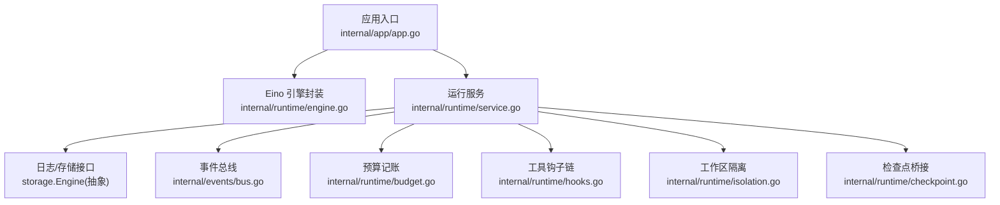
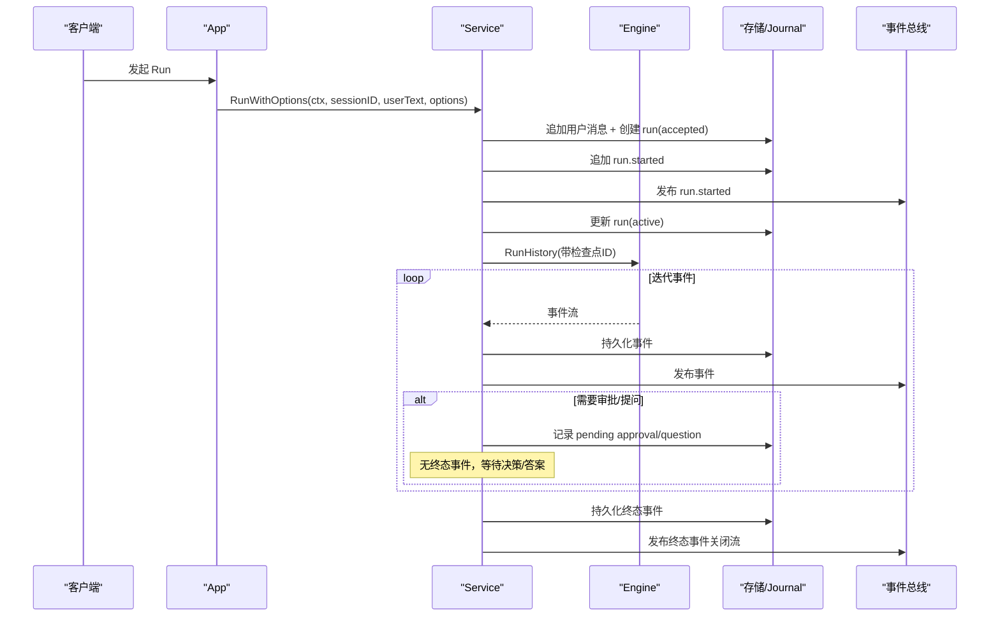
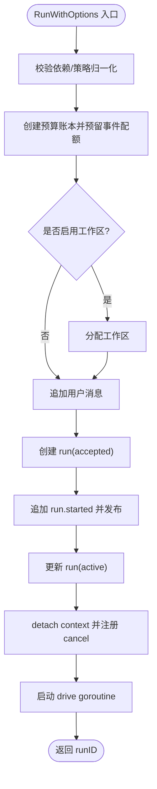
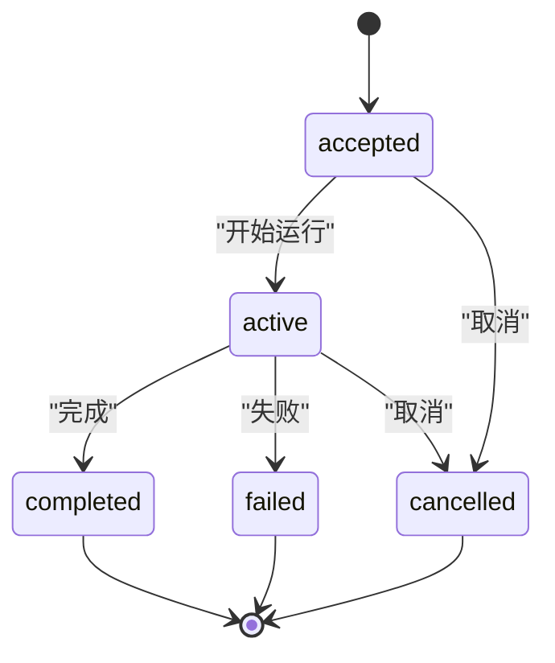
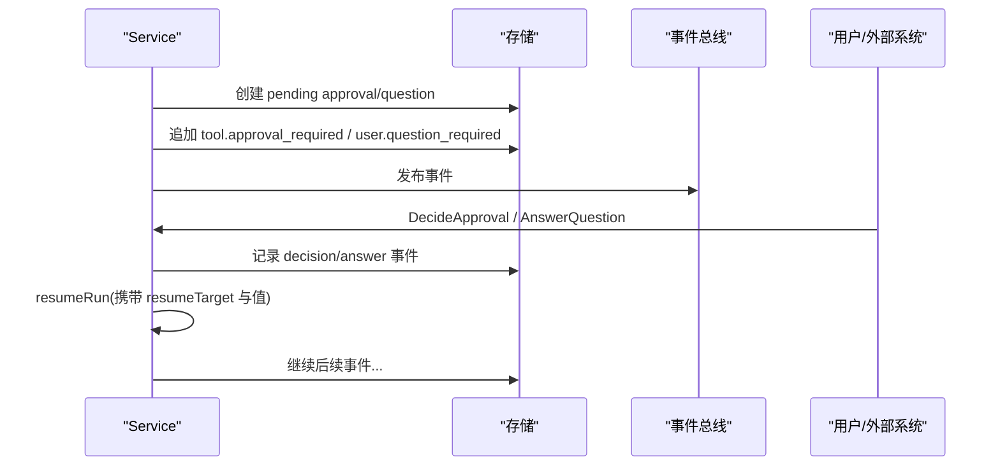
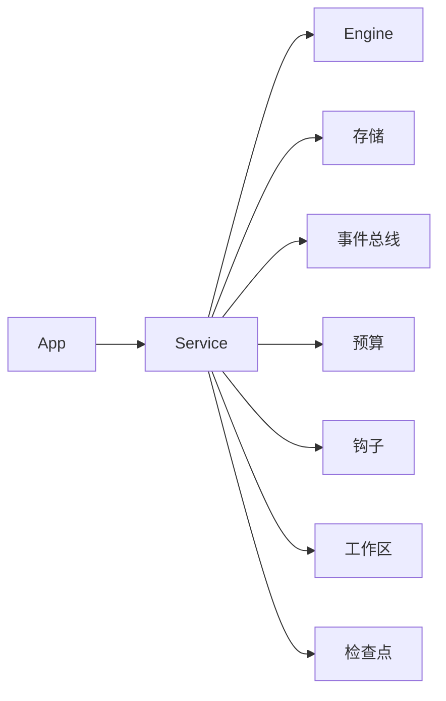

# 服务管理

<cite>
**本文引用的文件**
- [internal/runtime/service.go](file://internal/runtime/service.go)
- [internal/runtime/engine.go](file://internal/runtime/engine.go)
- [internal/app/app.go](file://internal/app/app.go)
- [internal/events/bus.go](file://internal/events/bus.go)
- [internal/config/config.go](file://internal/config/config.go)
- [internal/runtime/budget.go](file://internal/runtime/budget.go)
- [internal/runtime/hooks.go](file://internal/runtime/hooks.go)
- [internal/runtime/isolation.go](file://internal/runtime/isolation.go)
- [internal/runtime/checkpoint.go](file://internal/runtime/checkpoint.go)
- [internal/domain/run.go](file://internal/domain/run.go)
</cite>

## 目录
1. [简介](#简介)
2. [项目结构](#项目结构)
3. [核心组件](#核心组件)
4. [架构总览](#架构总览)
5. [详细组件分析](#详细组件分析)
6. [依赖关系分析](#依赖关系分析)
7. [性能考量](#性能考量)
8. [故障排查指南](#故障排查指南)
9. [结论](#结论)
10. [附录：使用示例与最佳实践](#附录使用示例与最佳实践)

## 简介
本文件面向 Vivy 运行时中的“服务管理”子系统，聚焦 Service 的职责、生命周期、并发控制、上下文隔离、工作区分配、预算跟踪、审批/问题交互、恢复机制、依赖注入、钩子系统、事件发布，以及启动、关闭、清理、优雅退出和故障恢复的完整流程。文档以代码为依据，提供可追溯的章节来源与图示来源，帮助读者从高层到代码级理解运行时的服务编排。

## 项目结构
Vivy 进程由应用层 app 组装各子系统：存储后端、模型提供者、运行时引擎、RPC 控制面、内嵌 UI。运行时 Service 是用户请求进入后的编排中心，负责持久化、事件发布、审批/问答挂起与恢复、预算与策略、工作区隔离等。

**图表来源**
- [internal/app/app.go:220-257](file://internal/app/app.go#L220-L257)
- [internal/runtime/engine.go:61-117](file://internal/runtime/engine.go#L61-L117)
- [internal/runtime/service.go:96-169](file://internal/runtime/service.go#L96-L169)
- [internal/events/bus.go:10-40](file://internal/events/bus.go#L10-L40)
- [internal/runtime/budget.go:11-38](file://internal/runtime/budget.go#L11-L38)
- [internal/runtime/hooks.go:46-56](file://internal/runtime/hooks.go#L46-L56)
- [internal/runtime/isolation.go:22-41](file://internal/runtime/isolation.go#L22-L41)
- [internal/runtime/checkpoint.go:40-62](file://internal/runtime/checkpoint.go#L40-L62)

**章节来源**
- [internal/app/app.go:60-363](file://internal/app/app.go#L60-L363)
- [internal/runtime/engine.go:18-117](file://internal/runtime/engine.go#L18-L117)
- [internal/runtime/service.go:96-169](file://internal/runtime/service.go#L96-L169)

## 核心组件
- Service：编排一次 Run 的全生命周期，负责消息与运行行持久化、事件写入与发布、挂起/恢复、预算与策略、工作区隔离、恢复与清理。
- Engine：对 Eino Runner/Agent 的封装，提供 Query/RunHistory/Resume、工具选择、提案准备等能力。
- BudgetLedger：按事件、模型调用、工具调用、重试维度进行限额与嵌套子账本。
- ToolHookChain：工具执行前后钩子链，支持拒绝、改写参数、超时与治理事件。
- WorkspaceManager：为每个 Run 分配受控的工作区目录，防止路径逃逸。
- VersionedCheckpointStore：对 eino 检查点进行版本与完整性校验的包装。
- events.Bus：将已持久化的事件广播给在线订阅者，终端事件后关闭流。

**章节来源**
- [internal/runtime/service.go:96-169](file://internal/runtime/service.go#L96-L169)
- [internal/runtime/engine.go:18-117](file://internal/runtime/engine.go#L18-L117)
- [internal/runtime/budget.go:11-38](file://internal/runtime/budget.go#L11-L38)
- [internal/runtime/hooks.go:46-56](file://internal/runtime/hooks.go#L46-L56)
- [internal/runtime/isolation.go:22-41](file://internal/runtime/isolation.go#L22-L41)
- [internal/runtime/checkpoint.go:40-62](file://internal/runtime/checkpoint.go#L40-L62)
- [internal/events/bus.go:10-40](file://internal/events/bus.go#L10-L40)

## 架构总览
Service 通过 Engine 驱动 Eino Agent，所有事件先持久化再发布；Run 在独立 goroutine 中运行，与请求上下文解耦；审批/问答挂起时不产生终态事件，等待决策或答案后恢复；预算超限或循环保护触发失败；重启时恢复非终态 Run 至挂起或失败。

**图表来源**
- [internal/runtime/service.go:222-300](file://internal/runtime/service.go#L222-L300)
- [internal/runtime/service.go:911-929](file://internal/runtime/service.go#L911-L929)
- [internal/runtime/service.go:981-1031](file://internal/runtime/service.go#L981-L1031)
- [internal/runtime/service.go:1063-1175](file://internal/runtime/service.go#L1063-L1175)
- [internal/runtime/service.go:1177-1260](file://internal/runtime/service.go#L1177-L1260)
- [internal/runtime/service.go:1704-1731](file://internal/runtime/service.go#L1704-L1731)
- [internal/runtime/service.go:1807-1858](file://internal/runtime/service.go#L1807-L1858)

**章节来源**
- [internal/runtime/service.go:222-300](file://internal/runtime/service.go#L222-L300)
- [internal/runtime/service.go:911-1031](file://internal/runtime/service.go#L911-L1031)
- [internal/runtime/service.go:1063-1260](file://internal/runtime/service.go#L1063-L1260)
- [internal/runtime/service.go:1704-1858](file://internal/runtime/service.go#L1704-L1858)

## 详细组件分析

### Service 结构与职责
- 职责：编排 Run 的持久化、事件发布、挂起/恢复、预算与策略、工作区隔离、恢复与清理。
- 关键状态：active（活跃运行）、pending（挂起等待审批/问答）、ledgers（共享预算账本）、snapshots（策略快照）。
- 并发控制：互斥锁保护 active/pending/ledgers/snapshots；WaitGroup 追踪 drive/resume goroutine；Sweep 定时任务处理过期交互。

**章节来源**
- [internal/runtime/service.go:96-169](file://internal/runtime/service.go#L96-L169)
- [internal/runtime/service.go:302-387](file://internal/runtime/service.go#L302-L387)
- [internal/runtime/service.go:389-463](file://internal/runtime/service.go#L389-L463)

### RunWithOptions 执行流程
- 参数校验与策略归一化，生成策略快照与预算账本。
- 可选分配工作区。
- 持久化用户消息、run 行（accepted）、run.started，发布事件，更新 run 为 active。
- 使用 detached context 启动 drive goroutine，避免请求断开影响运行。

**图表来源**
- [internal/runtime/service.go:222-300](file://internal/runtime/service.go#L222-L300)

**章节来源**
- [internal/runtime/service.go:222-300](file://internal/runtime/service.go#L222-L300)

### 运行状态转换与终态保证
- 领域状态机：accepted → queued/active/cancelled；active → completed/failed/cancelled；terminal 无出边。
- 服务侧保证：每次 Run 恰好一个终态事件；终态事件持久化后再发布，且关闭订阅流。

**图表来源**
- [internal/domain/run.go:5-30](file://internal/domain/run.go#L5-L30)
- [internal/runtime/service.go:1807-1858](file://internal/runtime/service.go#L1807-L1858)

**章节来源**
- [internal/domain/run.go:5-30](file://internal/domain/run.go#L5-L30)
- [internal/runtime/service.go:1807-1858](file://internal/runtime/service.go#L1807-L1858)

### 并发控制机制
- 互斥锁：保护 active/pending/ledgers/snapshots 的读写。
- WaitGroup：追踪 drive/resume goroutine，确保优雅关闭时全部退出。
- CancelAll：批量取消活跃与挂起运行，确保终态事件在存储关闭前持久化。
- WaitIdle：阻塞直到所有 goroutine 退出或超时。

**章节来源**
- [internal/runtime/service.go:302-387](file://internal/runtime/service.go#L302-L387)

### 上下文隔离策略与工作区分配
- 工作区隔离：每个 Run 获得唯一 ID 对应的工作区目录，拒绝符号链接与越界路径。
- 父/子 Worker 权限：父运行提供不可变策略快照与共享预算账本；子运行继承受限预算与私有工作区。
- 安全边界：WorkspaceManager 仅做目录隔离，不执行命令；未来工具需显式接入该边界。

**章节来源**
- [internal/runtime/isolation.go:22-109](file://internal/runtime/isolation.go#L22-L109)
- [internal/runtime/service.go:591-674](file://internal/runtime/service.go#L591-L674)

### 预算跟踪
- 预算维度：事件数、模型调用、工具调用、重试次数。
- 嵌套账本：父子运行共享根账户，子账本可收紧限制但不能放宽。
- 恢复重建：重启时重放事件重建预算，若已超限则失败关闭。

**章节来源**
- [internal/runtime/budget.go:11-38](file://internal/runtime/budget.go#L11-L38)
- [internal/runtime/budget.go:103-196](file://internal/runtime/budget.go#L103-L196)
- [internal/runtime/service.go:785-811](file://internal/runtime/service.go#L785-L811)

### 审批流程集成与问题交互处理
- 审批：当工具需要人工批准时，持久化 pending approval 与 tool.approval_required 事件，不产生终态；DecideApproval 以 first-writer-wins 方式决定并恢复运行。
- 问题：ask_user 交互持久化 question 与 user.question_required 事件；AnswerQuestion 记录答案事件并恢复运行。
- 过期处理：定时扫描器过期未决审批/问题，记录 review 事件并失败关闭运行。

**图表来源**
- [internal/runtime/service.go:1063-1175](file://internal/runtime/service.go#L1063-L1175)
- [internal/runtime/service.go:1177-1260](file://internal/runtime/service.go#L1177-L1260)
- [internal/runtime/service.go:1262-1347](file://internal/runtime/service.go#L1262-L1347)
- [internal/runtime/service.go:1488-1551](file://internal/runtime/service.go#L1488-L1551)
- [internal/runtime/service.go:1422-1486](file://internal/runtime/service.go#L1422-L1486)

**章节来源**
- [internal/runtime/service.go:1063-1260](file://internal/runtime/service.go#L1063-L1260)
- [internal/runtime/service.go:1262-1347](file://internal/runtime/service.go#L1262-L1347)
- [internal/runtime/service.go:1422-1551](file://internal/runtime/service.go#L1422-L1551)

### 恢复机制
- 启动恢复：Recover 列出非终态运行，若有有效 pending 审批/问题且检查点可读，则重建 pending；否则失败关闭。
- 后台恢复：RecoverBackground 在无活跃运行时允许操作，避免与 live state 冲突。
- 子运行：重启后子运行直接失败关闭，避免重复副作用。

**章节来源**
- [internal/runtime/service.go:465-576](file://internal/runtime/service.go#L465-L576)
- [internal/runtime/service.go:883-909](file://internal/runtime/service.go#L883-L909)

### 服务依赖注入
- ServiceDeps：注入 Journal、Runs、Messages、Notes、Approvals、Questions、Budget、Workspaces、PolicyDefaultProfile、Hooks、Sink、ChildApprovals。
- EngineConfig：注入 StreamBuffer、MaxEventPayloadBytes、MaxToolTurns、Checkpoints、Policy、ToolHooks。
- App 组装：app 层构建 Provider Catalog、Engine、Service、Worker Manager、RPC Handler，并设置 ChildApprovalRouter。

**章节来源**
- [internal/runtime/service.go:70-94](file://internal/runtime/service.go#L70-L94)
- [internal/runtime/engine.go:18-46](file://internal/runtime/engine.go#L18-L46)
- [internal/app/app.go:220-257](file://internal/app/app.go#L220-L257)

### 钩子系统
- ToolHookChain：在工具执行前后执行，支持 allow/deny/rewrite；pre 阶段可阻断执行，post 阶段 fail-open 仅观察。
- 治理事件：钩子执行过程产出 governance 事件，经服务 sink 持久化。

**章节来源**
- [internal/runtime/hooks.go:46-129](file://internal/runtime/hooks.go#L46-L129)
- [internal/runtime/service.go:1860-1895](file://internal/runtime/service.go#L1860-L1895)

### 事件发布机制
- 事件顺序：先持久化到 Journal，再发布到 Bus；终端事件后关闭订阅流。
- 慢消费者：若订阅者落后，会被丢弃，需从 Journal 回放。

**章节来源**
- [internal/events/bus.go:10-40](file://internal/events/bus.go#L10-L40)
- [internal/events/bus.go:42-75](file://internal/events/bus.go#L42-L75)
- [internal/runtime/service.go:1704-1731](file://internal/runtime/service.go#L1704-L1731)
- [internal/runtime/service.go:1807-1858](file://internal/runtime/service.go#L1807-L1858)

### 启动、关闭与清理
- 启动：app.New 构建存储、Provider、Engine、Service、Worker、RPC；调用 Recover 恢复非终态运行；启动 HTTP 服务器。
- 关闭：StopInteractionSweeper → CancelAll → Close Worker → WaitIdle → Shutdown HTTP → Close Storage；保证终态事件在存储关闭前持久化。

**章节来源**
- [internal/app/app.go:60-363](file://internal/app/app.go#L60-L363)
- [internal/app/app.go:470-520](file://internal/app/app.go#L470-L520)
- [internal/runtime/service.go:389-463](file://internal/runtime/service.go#L389-L463)
- [internal/runtime/service.go:302-387](file://internal/runtime/service.go#L302-L387)

### 故障恢复与优雅退出
- 故障分类：context 取消、预算超限、循环保护、内部错误等，均映射为结构化终态事件。
- 优雅退出：CancelAll 与 WaitIdle 确保所有运行在存储关闭前完成终态持久化。

**章节来源**
- [internal/runtime/service.go:1651-1702](file://internal/runtime/service.go#L1651-L1702)
- [internal/app/app.go:470-520](file://internal/app/app.go#L470-L520)

## 依赖关系分析
- Service 依赖 Engine、存储、事件总线、预算、钩子、工作区、检查点。
- Engine 依赖 Eino 的 Runner/Agent，但 internal/runtime 是唯一允许接触 Eino 类型的包之一。
- App 作为组合根，装配 Provider Catalog、Engine、Service、Worker、RPC、UI。

**图表来源**
- [internal/app/app.go:220-257](file://internal/app/app.go#L220-L257)
- [internal/runtime/service.go:96-169](file://internal/runtime/service.go#L96-L169)
- [internal/runtime/engine.go:61-117](file://internal/runtime/engine.go#L61-L117)

**章节来源**
- [internal/app/app.go:220-257](file://internal/app/app.go#L220-L257)
- [internal/runtime/service.go:96-169](file://internal/runtime/service.go#L96-L169)
- [internal/runtime/engine.go:61-117](file://internal/runtime/engine.go#L61-L117)

## 性能考量
- 流缓冲与事件负载上限：EngineConfig.StreamBuffer 与 MaxEventPayloadBytes 控制下游事件扇出与单事件大小。
- 上下文与历史限制：MaxContextBytes 与 MaxHistoryMessages 控制瞬时上下文与保留历史。
- 工具结果大小：MaxToolResultBytes 限制进入模型上下文的工具结果。
- 预算限额：MaxRunEvents、MaxModelCalls、MaxRunToolCalls、MaxRunRetries 控制运行树资源消耗。
- 检查点：Enable streaming 与 checkpoint 支持中断恢复，减少重复代价。

**章节来源**
- [internal/runtime/engine.go:18-46](file://internal/runtime/engine.go#L18-L46)
- [internal/config/config.go:110-153](file://internal/config/config.go#L110-L153)
- [internal/config/config.go:254-314](file://internal/config/config.go#L254-L314)

## 故障排查指南
- 审批/问题未决：检查 Approvals/Questions 列表与过期时间；确认检查点可读；查看 review 事件。
- 运行卡住：确认是否有活跃 goroutine（WaitIdle）；检查预算是否超限；查看 terminal 事件分类。
- 恢复失败：确认启动时 Recover 是否成功；子运行重启后应失败关闭；检查 workspace 可用性。
- 事件丢失：确认 Bus 订阅者是否落后；必要时从 Journal 回放。

**章节来源**
- [internal/runtime/service.go:433-463](file://internal/runtime/service.go#L433-L463)
- [internal/runtime/service.go:465-576](file://internal/runtime/service.go#L465-L576)
- [internal/runtime/service.go:1651-1702](file://internal/runtime/service.go#L1651-L1702)
- [internal/events/bus.go:42-75](file://internal/events/bus.go#L42-L75)

## 结论
Service 作为 Vivy 运行时的编排核心，通过严格的持久化优先、状态机约束、预算与策略控制、工作区隔离、审批/问答挂起与恢复、以及健壮的重启恢复与优雅退出，确保了运行的可靠性与可观测性。其设计遵循“事件即真相”的原则，并通过事件总线提供实时可见性，同时保持对慢消费者的容错。

## 附录：使用示例与最佳实践
- 启动服务：
  - 配置存储、Provider、Runtime 参数，构建 App，调用 Recover，然后启动 HTTP 服务。
  - 参考：[internal/app/app.go:60-363](file://internal/app/app.go#L60-L363)
- 发起运行：
  - 调用 Service.RunWithOptions，传入 sessionID、用户文本与 RunOptions（模式与策略）。
  - 参考：[internal/runtime/service.go:222-300](file://internal/runtime/service.go#L222-L300)
- 审批与问答：
  - 监听 tool.approval_required 或 user.question_required 事件，调用 DecideApproval/AnswerQuestion。
  - 参考：[internal/runtime/service.go:1262-1347](file://internal/runtime/service.go#L1262-L1347)
  - 参考：[internal/runtime/service.go:1488-1551](file://internal/runtime/service.go#L1488-L1551)
- 优雅关闭：
  - 调用 StopInteractionSweeper、CancelAll、Close Worker、WaitIdle、Shutdown HTTP、Close Storage。
  - 参考：[internal/app/app.go:470-520](file://internal/app/app.go#L470-L520)
- 最佳实践：
  - 始终启用检查点与预算限额，避免无限循环与资源耗尽。
  - 使用工作区隔离，防止文件系统逃逸。
  - 通过钩子实现治理与安全审计。
  - 订阅事件并基于 seq 回放，确保一致性。

**章节来源**
- [internal/app/app.go:60-363](file://internal/app/app.go#L60-L363)
- [internal/app/app.go:470-520](file://internal/app/app.go#L470-L520)
- [internal/runtime/service.go:222-300](file://internal/runtime/service.go#L222-L300)
- [internal/runtime/service.go:1262-1347](file://internal/runtime/service.go#L1262-L1347)
- [internal/runtime/service.go:1488-1551](file://internal/runtime/service.go#L1488-L1551)