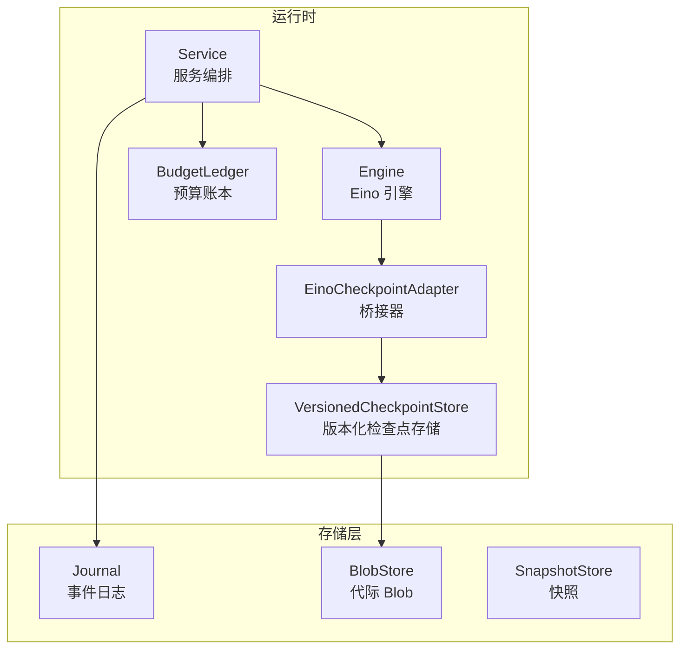
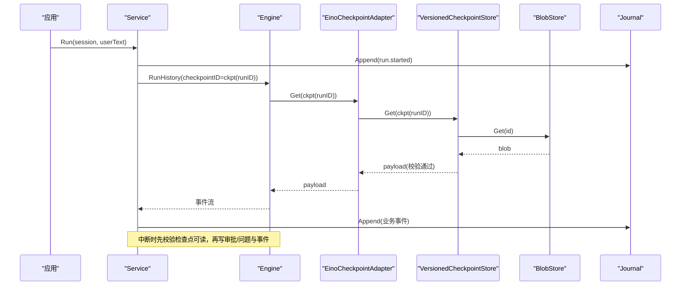
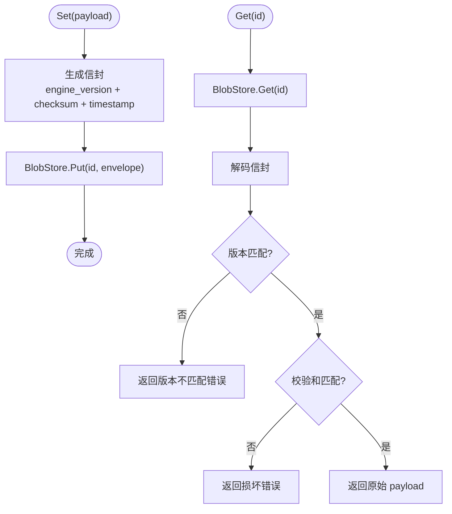
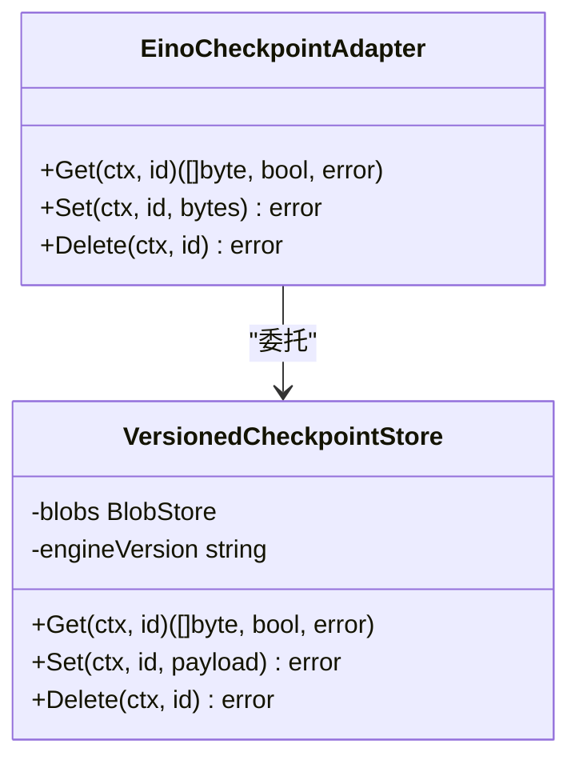
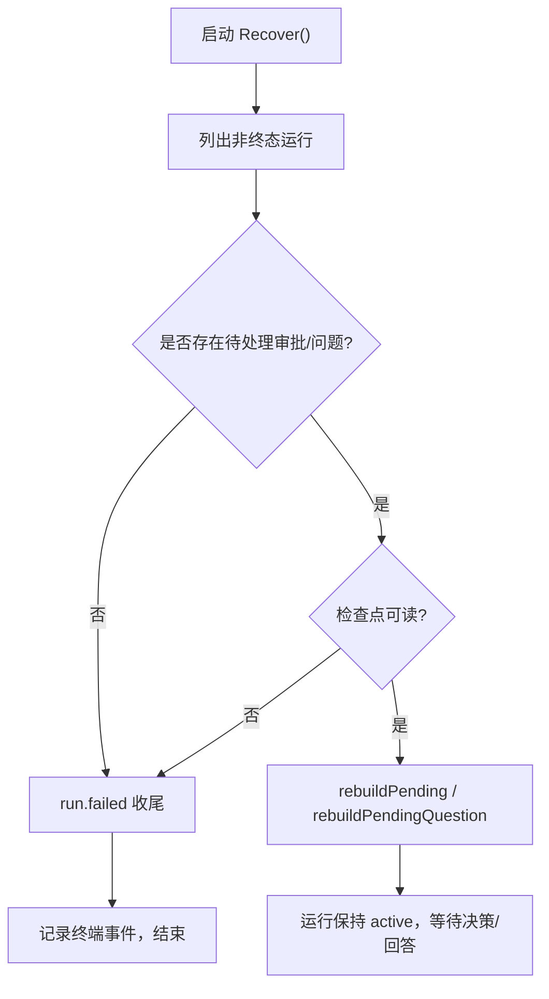
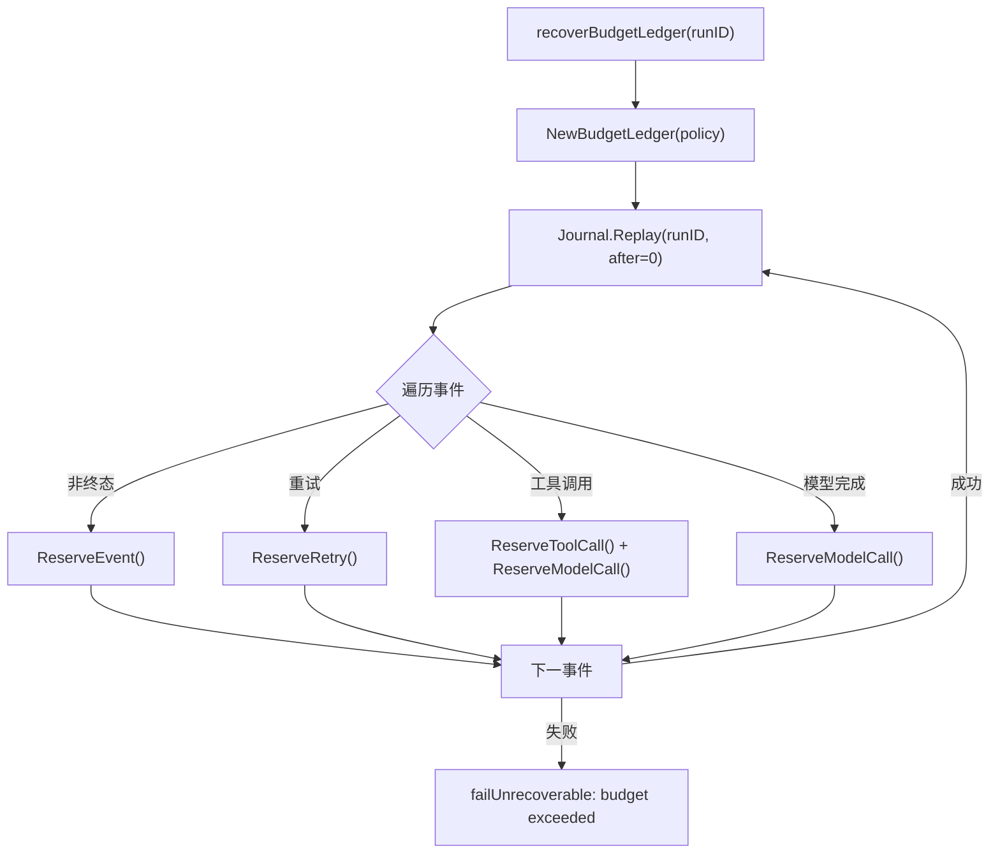
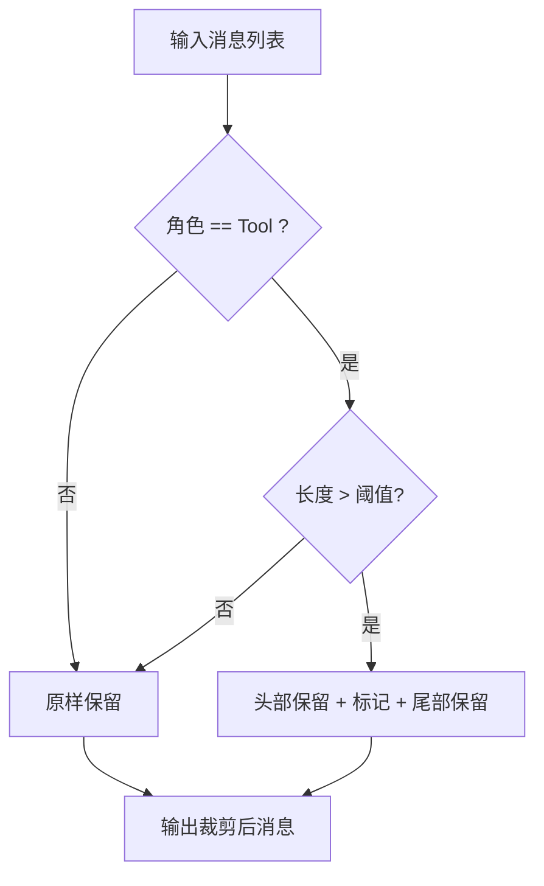
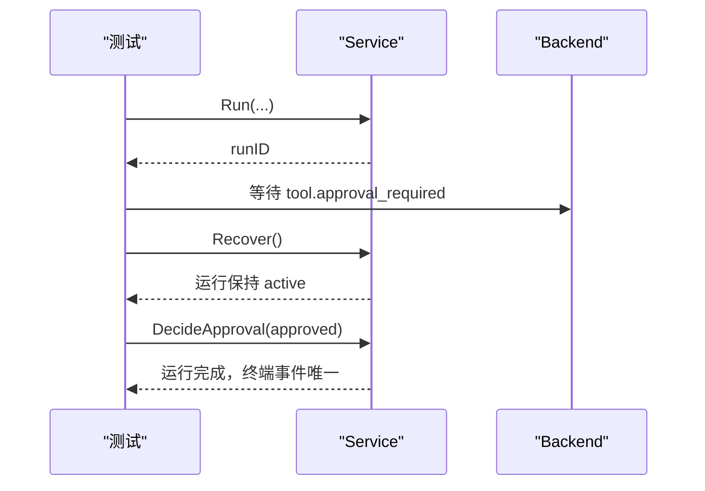
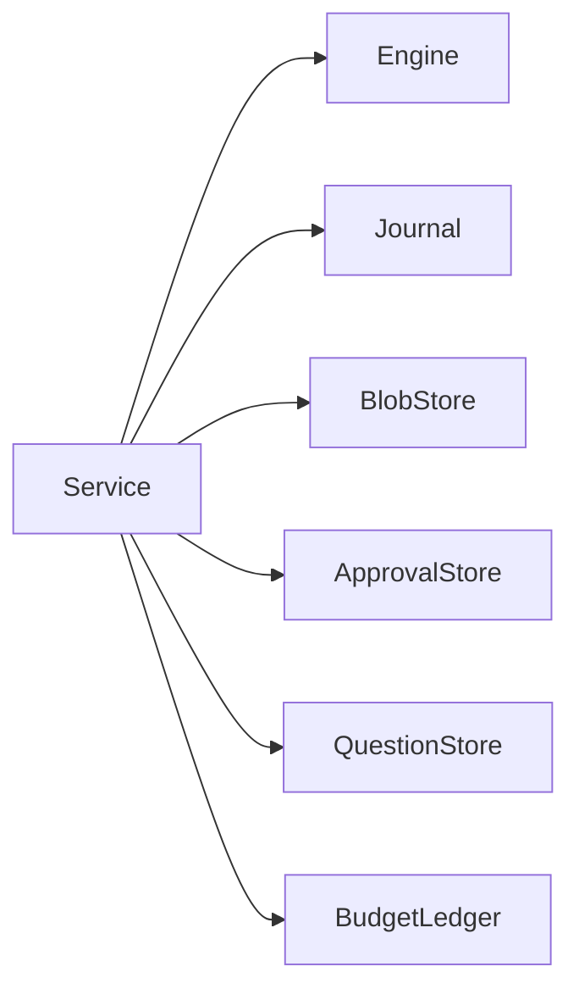

# 检查点与恢复

<cite>
**本文引用的文件**
- [internal/runtim e/checkpoint.go](file://internal/runtime/checkpoint.go)
- [internal/runtime/checkpointadapter.go](file://internal/runtime/checkpointadapter.go)
- [internal/runtime/service.go](file://internal/runtime/service.go)
- [internal/storage/contracts.go](file://internal/storage/contracts.go)
- [internal/storage/postgres/blob.go](file://internal/storage/postgres/blob.go)
- [internal/storage/sqlite/snapshot.go](file://internal/storage/sqlite/snapshot.go)
- [internal/runtime/budget.go](file://internal/runtime/budget.go)
- [internal/runtime/compaction/pruner.go](file://internal/runtime/compaction/pruner.go)
- [internal/runtime/recovery_test.go](file://internal/runtime/recovery_test.go)
</cite>

## 目录
1. [简介](#简介)
2. [项目结构](#项目结构)
3. [核心组件](#核心组件)
4. [架构总览](#架构总览)
5. [详细组件分析](#详细组件分析)
6. [依赖关系分析](#依赖关系分析)
7. [性能考虑](#性能考虑)
8. [故障排查指南](#故障排查指南)
9. [结论](#结论)
10. [附录：API 接口说明](#附录api-接口说明)

## 简介
本文件系统性阐述 Vivy 运行时的检查点与恢复机制，覆盖以下主题：
- 检查点的创建时机、存储格式与版本管理
- Eino 检查点与 Vivy 运行状态的映射（checkpointAdapter）
- 进程重启后的状态重建、审批状态恢复、预算账本重建
- 检查点压缩、增量保存、一致性保证
- 恢复测试用例、故障场景模拟、性能优化策略
- 检查点管理与恢复操作的 API 接口说明

## 项目结构
围绕检查点与恢复的关键代码分布在 runtime 与 storage 两个层次：
- runtime：负责引擎驱动、中断挂起、恢复流程、预算账本重建、事件持久化顺序控制
- storage：提供 BlobStore（带代际的不可变写入）、Journal（追加式有序事件日志）、SnapshotStore（乐观并发快照）等契约

**图表来源**
- [internal/runtime/service.go:911-929](file://internal/runtime/service.go#L911-L929)
- [internal/runtime/checkpointadapter.go:9-42](file://internal/runtime/checkpointadapter.go#L9-L42)
- [internal/runtime/checkpoint.go:40-102](file://internal/runtime/checkpoint.go#L40-L102)
- [internal/storage/contracts.go:55-85](file://internal/storage/contracts.go#L55-L85)

**章节来源**
- [internal/runtime/service.go:911-929](file://internal/runtime/service.go#L911-L929)
- [internal/storage/contracts.go:55-85](file://internal/storage/contracts.go#L55-L85)

## 核心组件
- VersionedCheckpointStore：为 Eino 检查点添加信封（引擎版本、SHA256 校验和、时间戳），并基于 BlobStore 进行代际写入；读取时严格校验版本与校验和，失败即关闭（fail-closed）。
- EinoCheckpointAdapter：将 VersionedCheckpointStore 暴露给 Eino 的 CheckPointStore/Deleter 接口，屏蔽 Eino 类型进入 internal/runtime。
- Service：编排 Run 生命周期、中断挂起、恢复流程、预算账本重建、事件持久化顺序控制。
- BudgetLedger：按事件、模型调用、工具调用、重试次数进行限额与重放，确保重启后预算不越界。
- Storage 契约：Journal（追加有序事件）、BlobStore（代际不可变写入）、SnapshotStore（乐观并发）。

**章节来源**
- [internal/runtime/checkpoint.go:40-102](file://internal/runtime/checkpoint.go#L40-L102)
- [internal/runtime/checkpointadapter.go:9-42](file://internal/runtime/checkpointadapter.go#L9-L42)
- [internal/runtime/service.go:465-576](file://internal/runtime/service.go#L465-L576)
- [internal/runtime/budget.go:103-220](file://internal/runtime/budget.go#L103-L220)
- [internal/storage/contracts.go:55-85](file://internal/storage/contracts.go#L55-L85)

## 架构总览
检查点与恢复的整体数据流如下：
- 正常执行：Service 驱动 Engine，Engine 通过 EinoCheckpointAdapter 使用 VersionedCheckpointStore 持久化检查点；事件经 Journal 持久化后再发布。
- 中断挂起：遇到需要审批或用户问答时，先验证检查点可读，再持久化审批/问题行与对应事件，最后将运行置为 pending。
- 恢复流程：启动时扫描非终态运行，若存在有效审批且检查点可读则重建 pending；否则以 run.failed 收尾，保证无悬挂运行。

**图表来源**
- [internal/runtime/service.go:911-929](file://internal/runtime/service.go#L911-L929)
- [internal/runtime/checkpointadapter.go:26-42](file://internal/runtime/checkpointadapter.go#L26-L42)
- [internal/runtime/checkpoint.go:64-97](file://internal/runtime/checkpoint.go#L64-L97)
- [internal/storage/contracts.go:55-85](file://internal/storage/contracts.go#L55-L85)

## 详细组件分析

### 检查点存储与版本管理（VersionedCheckpointStore）
- 创建时机：每次 Engine 迭代中由 Eino 触发写入；Vivy 通过 WithCheckPointID 指定稳定 ID（基于 runID），确保 Run 与 Resume 一致。
- 存储格式：二进制信封 = 4 字节大端头长度 + JSON 头（engine_version、checksum_sha256、created_at）+ 原始 Eino 检查点负载。
- 版本管理：写入时记录当前引擎构建的 eino 模块版本；读取时严格匹配，不一致直接拒绝，避免跨版本兼容风险。
- 一致性：对负载计算 SHA256 并比对；任何损坏立即返回错误（fail-closed）。
- 增量保存：底层 BlobStore 采用“同 id 追加新代际 + 原子翻转指针”的方式，旧代际不被修改。

**图表来源**
- [internal/runtime/checkpoint.go:64-97](file://internal/runtime/checkpoint.go#L64-L97)
- [internal/runtime/checkpoint.go:104-134](file://internal/runtime/checkpoint.go#L104-L134)
- [internal/storage/postgres/blob.go:18-50](file://internal/storage/postgres/blob.go#L18-L50)

**章节来源**
- [internal/runtime/checkpoint.go:40-102](file://internal/runtime/checkpoint.go#L40-L102)
- [internal/storage/postgres/blob.go:18-50](file://internal/storage/postgres/blob.go#L18-L50)

### 检查点桥接器（EinoCheckpointAdapter）
- 职责：实现 adk.CheckPointStore 与 adk.CheckPointDeleter，将 VersionedCheckpointStore 暴露给 Eino 运行时。
- 边界：确保 Eino 类型不泄漏到 internal/runtime 之外（D-007）。
- 行为：Get/Set/Delete 直接委托给 VersionedCheckpointStore，所有校验在 store 层完成。

**图表来源**
- [internal/runtime/checkpointadapter.go:9-42](file://internal/runtime/checkpointadapter.go#L9-L42)
- [internal/runtime/checkpoint.go:40-102](file://internal/runtime/checkpoint.go#L40-L102)

**章节来源**
- [internal/runtime/checkpointadapter.go:9-42](file://internal/runtime/checkpointadapter.go#L9-L42)

### 中断挂起与审批/问答恢复
- 中断路径：当 Engine 请求审批或用户问答时，Service 会：
  1) 校验检查点可读（fail-closed）
  2) 持久化审批/问题行（含过期时间、恢复目标、提案摘要）
  3) 持久化 tool.approval_required 或 user.question_required 事件
  4) 将运行置为 pending（内存登记），等待外部决策或回答
- 恢复路径：启动时扫描非终态运行：
  - 若有有效审批且检查点可读 → 重建 pending，保持运行活跃
  - 若审批已过期或检查点不可读 → 以 run.failed 收尾
  - 若无审批/问题但运行仍活跃 → 以 run.failed 收尾（孤儿运行）
  - 子工作进程（child worker）一律失败关闭，避免重复副作用

**图表来源**
- [internal/runtime/service.go:465-576](file://internal/runtime/service.go#L465-L576)
- [internal/runtime/service.go:1063-1175](file://internal/runtime/service.go#L1063-L1175)
- [internal/runtime/service.go:1177-1200](file://internal/runtime/service.go#L1177-L1200)

**章节来源**
- [internal/runtime/service.go:465-576](file://internal/runtime/service.go#L465-L576)
- [internal/runtime/service.go:1063-1175](file://internal/runtime/service.go#L1063-L1175)
- [internal/runtime/service.go:1177-1200](file://internal/runtime/service.go#L1177-L1200)

### 预算账本重建（Recovery 中的预算一致性）
- 重建方式：从 Journal 重放事件，逐项 ReserveEvent/ReserveModelCall/ReserveToolCall/ReserveRetry，确保重启后预算不会低于历史消耗。
- 失败策略：若重放发现已超预算，直接 fail-closed 并标记运行失败，防止绕过限制继续执行。
- 父子继承：子工作进程共享父级账本视图，仅能收紧不能放宽上限。

**图表来源**
- [internal/runtime/service.go:785-811](file://internal/runtime/service.go#L785-L811)
- [internal/runtime/budget.go:198-220](file://internal/runtime/budget.go#L198-L220)

**章节来源**
- [internal/runtime/service.go:785-811](file://internal/runtime/service.go#L785-L811)
- [internal/runtime/budget.go:198-220](file://internal/runtime/budget.go#L198-L220)

### 检查点压缩与上下文裁剪
- 工具结果裁剪：compaction.ToolResultPruner 对超出阈值的工具结果消息进行头部保留 + 尾部保留 + 省略标记的确定性裁剪，降低上下文压力。
- 会话级批量裁剪：PruneSession 可对整段会话消息进行批量裁剪，便于在模型调用前预处理。
- 兼容性函数：CompactToolResult 提供简单截断与 UTF-8 安全边界的便捷方法。

**图表来源**
- [internal/runtime/compaction/pruner.go:119-181](file://internal/runtime/compaction/pruner.go#L119-L181)
- [internal/runtime/compaction/pruner.go:183-198](file://internal/runtime/compaction/pruner.go#L183-L198)
- [internal/runtime/compaction/pruner.go:206-242](file://internal/runtime/compaction/pruner.go#L206-L242)

**章节来源**
- [internal/runtime/compaction/pruner.go:119-198](file://internal/runtime/compaction/pruner.go#L119-L198)
- [internal/runtime/compaction/pruner.go:206-242](file://internal/runtime/compaction/pruner.go#L206-L242)

### 恢复测试与故障场景
- 可恢复审批：重启后重建 pending，后续决策可恢复至完成，且终端事件唯一（D-008）。
- 过期审批：重启后自动过期并失败关闭。
- 孤儿运行：无审批/问题但仍活跃 → 失败关闭。
- 幂等恢复：多次恢复不会产生多余终端事件。

**图表来源**
- [internal/runtime/recovery_test.go:92-132](file://internal/runtime/recovery_test.go#L92-L132)
- [internal/runtime/recovery_test.go:134-155](file://internal/runtime/recovery_test.go#L134-L155)
- [internal/runtime/recovery_test.go:157-188](file://internal/runtime/recovery_test.go#L157-L188)
- [internal/runtime/recovery_test.go:190-227](file://internal/runtime/recovery_test.go#L190-L227)

**章节来源**
- [internal/runtime/recovery_test.go:92-227](file://internal/runtime/recovery_test.go#L92-L227)

## 依赖关系分析
- Service 依赖：
  - Engine：驱动 Eino 执行，支持 RunHistory/Resume
  - Journal：追加式事件日志，保证顺序与终态唯一性
  - BlobStore：检查点代际存储
  - ApprovalStore/QuestionStore：审批与问答的持久化
  - BudgetPolicy/BudgetLedger：预算限制与重放
- 存储契约：
  - Journal.Append 拒绝已有终态的运行再次追加
  - BlobStore 写入为代际追加，指针原子翻转
  - SnapshotStore 使用乐观并发（版本号冲突）

**图表来源**
- [internal/storage/contracts.go:55-85](file://internal/storage/contracts.go#L55-L85)
- [internal/storage/contracts.go:149-176](file://internal/storage/contracts.go#L149-L176)
- [internal/runtime/service.go:70-94](file://internal/runtime/service.go#L70-L94)

**章节来源**
- [internal/storage/contracts.go:55-85](file://internal/storage/contracts.go#L55-L85)
- [internal/storage/contracts.go:149-176](file://internal/storage/contracts.go#L149-L176)
- [internal/runtime/service.go:70-94](file://internal/runtime/service.go#L70-L94)

## 性能考虑
- 检查点写入：
  - 信封开销小（JSON 头 + 校验和），写入代价主要来自 BlobStore 的代际插入与指针翻转
  - 建议在高吞吐场景下评估 BlobStore 后端（SQLite/Postgres）的写入放大与事务成本
- 恢复过程：
  - 预算重放需遍历 Journal，长运行可能带来 I/O 与 CPU 开销；可通过合理的事件粒度与批处理降低影响
  - 审批/问题过期扫描应使用后台轮询（SweepExpired），避免阻塞主流程
- 上下文裁剪：
  - 工具结果裁剪可减少模型上下文压力，提升响应速度；建议根据任务特征调整阈值与头尾比例
- 事件持久化：
  - 事件先持久化再发布，保证可见性与一致性；在高并发下注意 Journal 写入瓶颈

[本节为通用指导，不直接分析具体文件]

## 故障排查指南
- 检查点损坏或版本不匹配：
  - 现象：Get 返回 ErrCheckpointCorrupted 或 ErrCheckpointEngineVersionMismatch
  - 排查：确认存储未被篡改；确认二进制构建的 eino 版本与检查点写入版本一致
- 恢复失败（孤儿运行）：
  - 现象：Recover 后将运行标记为 run.failed
  - 排查：检查是否存在未决审批/问题；确认检查点可读；确认预算重放未超限
- 审批过期：
  - 现象：Recover 检测到过期审批并失败关闭
  - 排查：调整审批过期时间；确保前端及时决策
- 预算超限：
  - 现象：ReplayEvent 返回预算超限错误
  - 排查：检查策略配置；减少事件/调用数量；拆分任务

**章节来源**
- [internal/runtime/checkpoint.go:17-27](file://internal/runtime/checkpoint.go#L17-L27)
- [internal/runtime/service.go:883-909](file://internal/runtime/service.go#L883-L909)
- [internal/runtime/budget.go:57-73](file://internal/runtime/budget.go#L57-L73)

## 结论
Vivy 的检查点与恢复机制通过“版本化信封 + 代际 BlobStore + 事件日志 + 预算重放”的组合，实现了：
- 强一致性的检查点读写（fail-closed）
- 进程重启后可恢复的审批/问答挂起
- 严格的预算约束与幂等恢复
- 可扩展的存储后端与上下文裁剪能力

该设计在保证可靠性的同时，兼顾了性能与可维护性，适合在生产环境中长期运行。

[本节为总结，不直接分析具体文件]

## 附录：API 接口说明

### 检查点存储接口（VersionedCheckpointStore）
- Set(ctx, id, payload)：将 Eino 检查点封装为信封并持久化为新代际
- Get(ctx, id)：读取当前代际，校验版本与校验和后返回原始 payload
- Delete(ctx, id)：删除检查点及其全部代际

**章节来源**
- [internal/runtime/checkpoint.go:64-102](file://internal/runtime/checkpoint.go#L64-L102)

### 检查点桥接器接口（EinoCheckpointAdapter）
- Get/Set/Delete：适配 adk.CheckPointStore/Deleter，委托给 VersionedCheckpointStore

**章节来源**
- [internal/runtime/checkpointadapter.go:26-42](file://internal/runtime/checkpointadapter.go#L26-L42)

### 恢复与服务接口（Service）
- Recover(ctx)：启动时恢复，处理非终态运行
- RecoverBackground(ctx)：后台恢复入口，拒绝有活跃运行的情况
- RunWithOptions(ctx, sessionID, userText, options)：启动运行，持久化消息、运行行与 started 事件
- Cancel/CancelAll：取消运行或全部运行
- WaitIdle(ctx)：等待所有运行退出，用于优雅关闭

**章节来源**
- [internal/runtime/service.go:212-300](file://internal/runtime/service.go#L212-L300)
- [internal/runtime/service.go:302-387](file://internal/runtime/service.go#L302-L387)
- [internal/runtime/service.go:465-492](file://internal/runtime/service.go#L465-L492)

### 存储契约接口（storage）
- Journal：Append/Replay，保证事件顺序与终态唯一
- BlobStore：Get/Put/Delete，代际写入
- SnapshotStore：Get/Put，乐观并发
- ApprovalStore/QuestionStore：审批与问答的 CRUD 与决策

**章节来源**
- [internal/storage/contracts.go:55-85](file://internal/storage/contracts.go#L55-L85)
- [internal/storage/contracts.go:149-176](file://internal/storage/contracts.go#L149-L176)