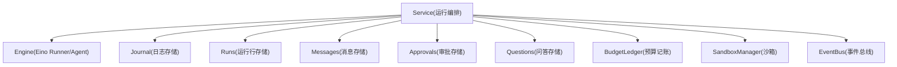
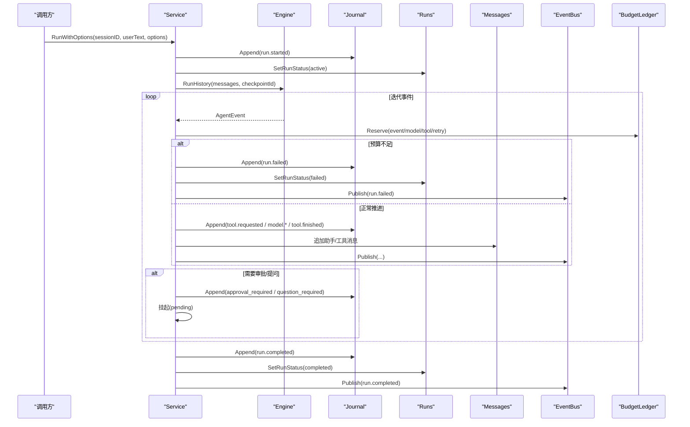
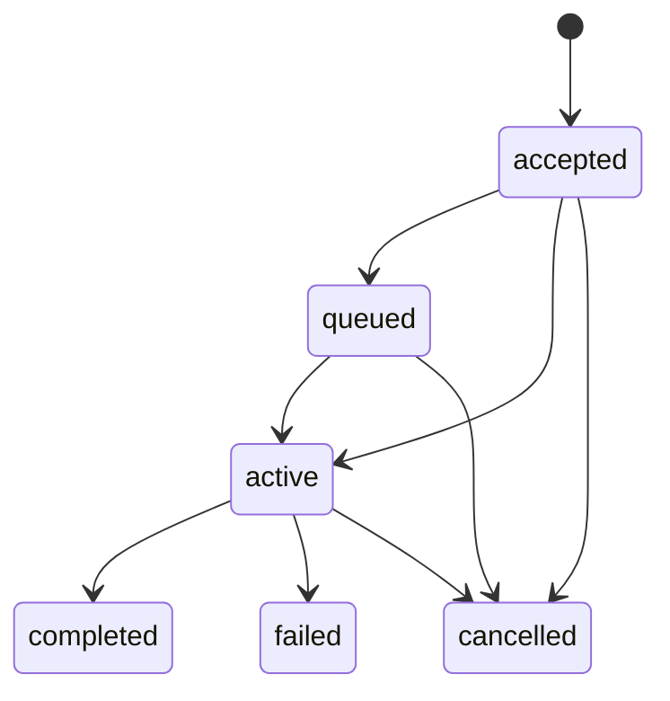
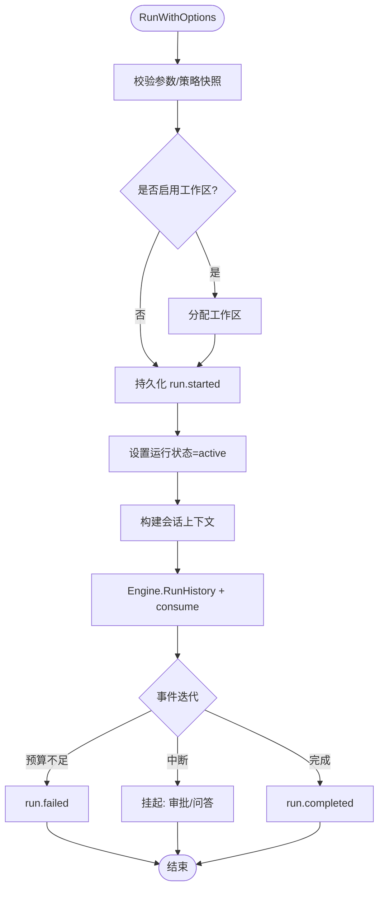
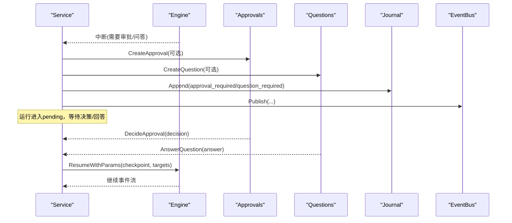
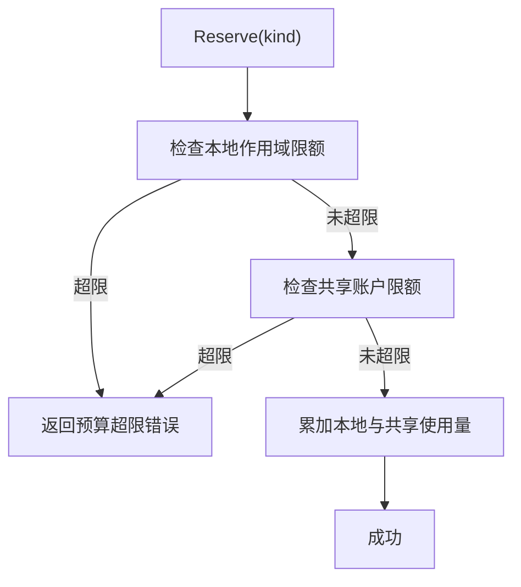
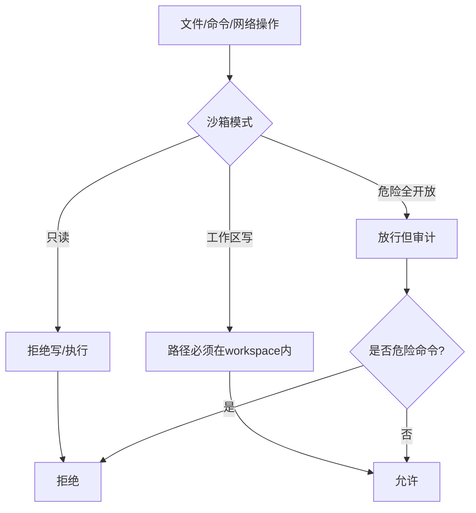
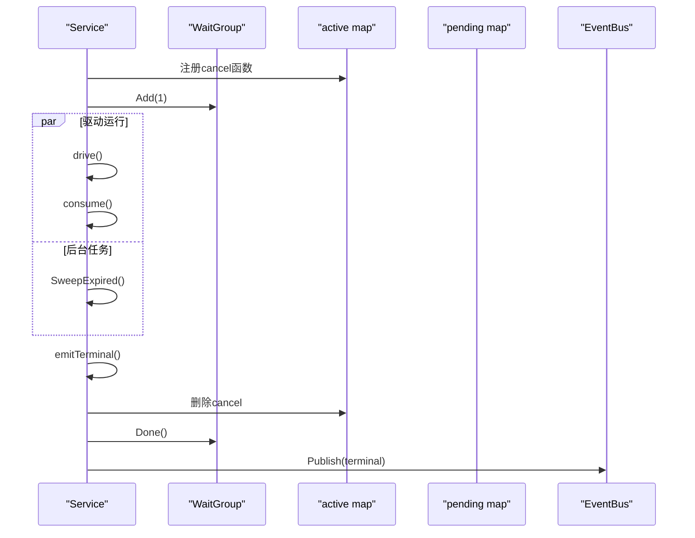
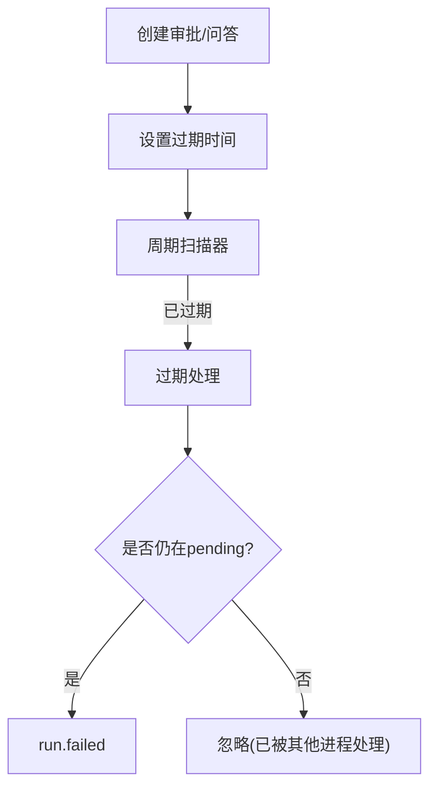
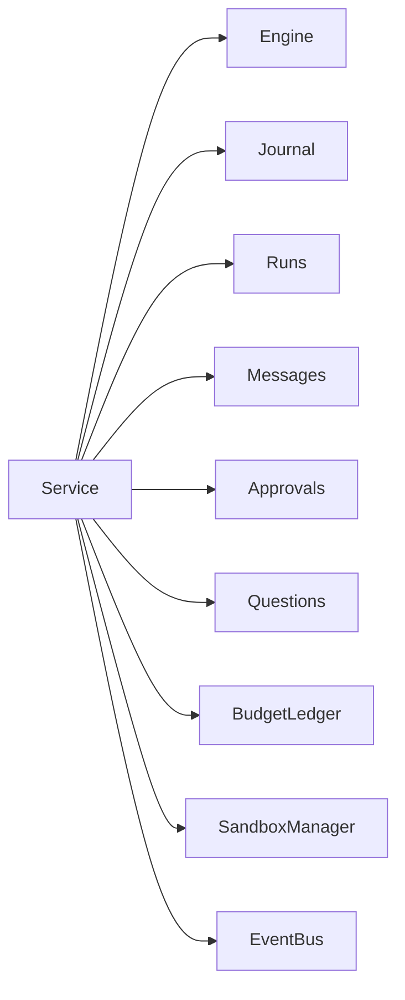

# 生命周期管理

<cite>
**本文引用的文件**
- [internal/runtime/service.go](file://internal/runtime/service.go)
- [internal/runtime/engine.go](file://internal/runtime/engine.go)
- [internal/domain/run.go](file://internal/domain/run.go)
- [internal/domain/event.go](file://internal/domain/event.go)
- [internal/runtime/budget.go](file://internal/runtime/budget.go)
- [internal/runtime/sandbox_manager.go](file://internal/runtime/sandbox_manager.go)
- [internal/events/bus.go](file://internal/events/bus.go)
</cite>

## 目录
1. [简介](#简介)
2. [项目结构](#项目结构)
3. [核心组件](#核心组件)
4. [架构总览](#架构总览)
5. [详细组件分析](#详细组件分析)
6. [依赖关系分析](#依赖关系分析)
7. [性能考量](#性能考量)
8. [故障诊断指南](#故障诊断指南)
9. [结论](#结论)
10. [附录](#附录)

## 简介
本文面向 Vivy 运行时（vivy.exe）的“运行生命周期”，从 RunWithOptions 调用开始，到终态事件发出为止，完整说明状态转换、预算控制、资源限制与超时处理、工作区隔离与沙箱、并发管理与资源清理、以及监控与排障方法。文档严格基于仓库源码实现进行归纳，确保可追溯性与准确性。

## 项目结构
围绕运行生命周期的关键代码分布在以下模块：
- internal/runtime/service.go：运行编排主入口，负责持久化、事件发布、中断/恢复、回收、并发与清理。
- internal/runtime/engine.go：封装 Eino 引擎（Runner/Agent），提供 Query/RunHistory/Resume 等能力。
- internal/domain/run.go：运行状态机定义与合法转换约束。
- internal/domain/event.go：事件类型与终态判定、状态映射。
- internal/runtime/budget.go：预算策略与记账器，保护模型/工具调用次数与事件总量。
- internal/runtime/sandbox_manager.go：文件系统、命令执行与网络访问的沙箱策略。
- internal/events/bus.go：事件总线，按 run 维度广播并处理订阅者掉队。

图表来源
- [internal/runtime/service.go:212-300](file://internal/runtime/service.go#L212-L300)
- [internal/runtime/engine.go:61-117](file://internal/runtime/engine.go#L61-L117)
- [internal/domain/event.go:104-116](file://internal/domain/event.go#L104-L116)
- [internal/runtime/budget.go:103-186](file://internal/runtime/budget.go#L103-L186)
- [internal/runtime/sandbox_manager.go:27-73](file://internal/runtime/sandbox_manager.go#L27-L73)
- [internal/events/bus.go:10-75](file://internal/events/bus.go#L10-L75)

章节来源
- [internal/runtime/service.go:212-300](file://internal/runtime/service.go#L212-L300)
- [internal/runtime/engine.go:61-117](file://internal/runtime/engine.go#L61-L117)

## 核心组件
- Service：运行编排中心，负责创建运行、驱动引擎、处理中断与恢复、预算与策略、工作区隔离、并发控制与清理、终态事件持久化与发布。
- Engine：对 Eino Runner/Agent 的封装，提供一次对话或历史重放、以及断点恢复。
- Domain：运行状态机与事件词汇表，保证“每个运行恰好一个终态”的不变式。
- Budget：预算策略与共享账户，支持父子作用域嵌套，防止越界消费。
- Sandbox：路径/命令/网络访问校验，保障执行环境安全。
- Events Bus：按 run 维度的事件广播，终端事件关闭流，落后者通过日志回放同步。

章节来源
- [internal/runtime/service.go:96-169](file://internal/runtime/service.go#L96-L169)
- [internal/runtime/engine.go:48-117](file://internal/runtime/engine.go#L48-L117)
- [internal/domain/run.go:5-30](file://internal/domain/run.go#L5-L30)
- [internal/domain/event.go:8-43](file://internal/domain/event.go#L8-L43)
- [internal/runtime/budget.go:11-20](file://internal/runtime/budget.go#L11-L20)
- [internal/runtime/sandbox_manager.go:27-73](file://internal/runtime/sandbox_manager.go#L27-L73)
- [internal/events/bus.go:10-75](file://internal/events/bus.go#L10-L75)

## 架构总览
下图展示从 RunWithOptions 到终态事件的端到端流程，包括状态变更、事件持久化、预算扣减、中断/恢复与并发管理。

图表来源
- [internal/runtime/service.go:212-300](file://internal/runtime/service.go#L212-L300)
- [internal/runtime/service.go:911-1031](file://internal/runtime/service.go#L911-L1031)
- [internal/runtime/service.go:1651-1691](file://internal/runtime/service.go#L1651-L1691)
- [internal/runtime/service.go:1807-1851](file://internal/runtime/service.go#L1807-L1851)
- [internal/runtime/budget.go:142-186](file://internal/runtime/budget.go#L142-L186)
- [internal/domain/event.go:104-116](file://internal/domain/event.go#L104-L116)

## 详细组件分析

### 运行状态机与转换条件
- 状态集合：accepted、queued、active、completed、failed、cancelled。
- 合法转换：
  - accepted → queued/active/cancelled
  - queued → active/cancelled
  - active → completed/failed/cancelled
- 终态：completed、failed、cancelled，无出边。
- 事件到状态的映射：run.completed→completed；run.failed→failed；run.cancelled→cancelled。

图表来源
- [internal/domain/run.go:5-30](file://internal/domain/run.go#L5-L30)
- [internal/domain/event.go:104-116](file://internal/domain/event.go#L104-L116)

章节来源
- [internal/domain/run.go:5-30](file://internal/domain/run.go#L5-L30)
- [internal/domain/event.go:104-116](file://internal/domain/event.go#L104-L116)

### 运行启动与驱动流程（RunWithOptions → drive → consume）
- 参数校验与策略快照生成。
- 分配工作区（可选）。
- 持久化用户消息、创建运行行（accepted）、写入 run.started 并发布。
- 将运行置为 active，并在独立上下文中异步驱动。
- 构建会话上下文（含前导提示、笔记摘要、历史消息裁剪）。
- 调用 Engine.RunHistory 获取事件迭代器，进入 consume 循环。
- 每次事件先做预算预留，再持久化并发布；遇到中断则挂起等待审批/问答。

图表来源
- [internal/runtime/service.go:212-300](file://internal/runtime/service.go#L212-L300)
- [internal/runtime/service.go:911-964](file://internal/runtime/service.go#L911-L964)
- [internal/runtime/service.go:981-1031](file://internal/runtime/service.go#L981-L1031)

章节来源
- [internal/runtime/service.go:212-300](file://internal/runtime/service.go#L212-L300)
- [internal/runtime/service.go:911-1031](file://internal/runtime/service.go#L911-L1031)

### 中断、审批与问答（暂停与恢复）
- 当引擎请求审批或 ask_user 时，服务会：
  - 校验检查点可读性。
  - 写入审批/问答记录（含过期时间）。
  - 持久化 tool.approval_required 或 user.question_required 事件并发布。
  - 将运行登记为 pending，保持运行行为 active。
- 恢复路径：
  - DecideApproval/AnswerQuestion 成功后，重建 open call 上下文，调用 Engine.ResumeWithParams 继续执行。
  - 恢复后继续 consume 循环，直至终态。

图表来源
- [internal/runtime/service.go:1063-1175](file://internal/runtime/service.go#L1063-L1175)
- [internal/runtime/service.go:1177-1260](file://internal/runtime/service.go#L1177-L1260)
- [internal/runtime/service.go:1262-1347](file://internal/runtime/service.go#L1262-L1347)
- [internal/runtime/service.go:1488-1551](file://internal/runtime/service.go#L1488-L1551)
- [internal/runtime/service.go:1611-1649](file://internal/runtime/service.go#L1611-L1649)

章节来源
- [internal/runtime/service.go:1063-1175](file://internal/runtime/service.go#L1063-L1175)
- [internal/runtime/service.go:1177-1260](file://internal/runtime/service.go#L1177-L1260)
- [internal/runtime/service.go:1262-1347](file://internal/runtime/service.go#L1262-L1347)
- [internal/runtime/service.go:1488-1551](file://internal/runtime/service.go#L1488-L1551)
- [internal/runtime/service.go:1611-1649](file://internal/runtime/service.go#L1611-L1649)

### 预算控制与资源限制
- 预算维度：事件数、模型调用、工具调用、重试次数。
- 作用域：根账户 + 子作用域（父子嵌套，子作用域只能收紧不能放宽）。
- 预留时机：每次事件批次、tool.requested、model.completed、provider.retry 等。
- 超限处理：统一归类为 run.failed，附带结构化原因。
- 重启恢复：通过 Journal 回放事件重建预算计数，避免重启后重置配额。

图表来源
- [internal/runtime/budget.go:142-186](file://internal/runtime/budget.go#L142-L186)
- [internal/runtime/budget.go:198-220](file://internal/runtime/budget.go#L198-L220)
- [internal/runtime/service.go:1033-1061](file://internal/runtime/service.go#L1033-L1061)
- [internal/runtime/service.go:785-811](file://internal/runtime/service.go#L785-L811)

章节来源
- [internal/runtime/budget.go:11-20](file://internal/runtime/budget.go#L11-L20)
- [internal/runtime/budget.go:142-186](file://internal/runtime/budget.go#L142-L186)
- [internal/runtime/service.go:1033-1061](file://internal/runtime/service.go#L1033-L1061)
- [internal/runtime/service.go:785-811](file://internal/runtime/service.go#L785-L811)

### 工作区隔离与沙箱管理
- 工作区：每个运行拥有确定性工作区 ID，通过 WorkspaceAllocator.Ensure 分配。
- 沙箱模式：
  - 只读：禁止写操作与命令执行。
  - 工作区写：仅允许在工作区内读写。
  - 危险全开放：绕过所有检查但仍审计，且仍阻止明显危险命令。
- 命令白名单：除危险全开放外，必须显式允许。
- 网络策略：默认拒绝私有 IP，支持域名白名单。

图表来源
- [internal/runtime/sandbox_manager.go:27-73](file://internal/runtime/sandbox_manager.go#L27-L73)
- [internal/runtime/sandbox_manager.go:85-147](file://internal/runtime/sandbox_manager.go#L85-L147)
- [internal/runtime/sandbox_manager.go:149-183](file://internal/runtime/sandbox_manager.go#L149-L183)
- [internal/runtime/sandbox_manager.go:185-234](file://internal/runtime/sandbox_manager.go#L185-L234)

章节来源
- [internal/runtime/sandbox_manager.go:27-73](file://internal/runtime/sandbox_manager.go#L27-L73)
- [internal/runtime/sandbox_manager.go:85-147](file://internal/runtime/sandbox_manager.go#L85-L147)
- [internal/runtime/sandbox_manager.go:149-183](file://internal/runtime/sandbox_manager.go#L149-L183)
- [internal/runtime/sandbox_manager.go:185-234](file://internal/runtime/sandbox_manager.go#L185-L234)

### 并发运行管理、资源清理与内存泄漏防护
- 并发模型：
  - 每个运行在独立 goroutine 中驱动，使用 WaitGroup 跟踪。
  - active/pending 字典维护运行句柄与挂起信息。
  - Cancel/CancelAll 触发取消所有活跃运行与挂起运行。
- 资源清理：
  - emitTerminal 持久化终态事件后，删除 active 与 ledger/snapshot 引用，释放上下文。
  - WaitIdle 等待所有驱动/恢复 goroutine 退出，确保存储关闭前完成收尾。
- 内存泄漏防护：
  - 终端事件发布后关闭订阅通道，移除订阅。
  - 预算记账器在终态后清理引用。
  - 审批/问答过期扫描器定期清理过期项。

图表来源
- [internal/runtime/service.go:110-130](file://internal/runtime/service.go#L110-L130)
- [internal/runtime/service.go:302-387](file://internal/runtime/service.go#L302-L387)
- [internal/runtime/service.go:389-463](file://internal/runtime/service.go#L389-L463)
- [internal/runtime/service.go:1807-1851](file://internal/runtime/service.go#L1807-L1851)
- [internal/events/bus.go:42-75](file://internal/events/bus.go#L42-L75)

章节来源
- [internal/runtime/service.go:110-130](file://internal/runtime/service.go#L110-L130)
- [internal/runtime/service.go:302-387](file://internal/runtime/service.go#L302-L387)
- [internal/runtime/service.go:389-463](file://internal/runtime/service.go#L389-L463)
- [internal/runtime/service.go:1807-1851](file://internal/runtime/service.go#L1807-L1851)
- [internal/events/bus.go:42-75](file://internal/events/bus.go#L42-L75)

### 超时处理与交互过期
- 审批/问答过期：
  - 创建时记录 ExpiresAt。
  - 后台扫描器周期性检查并过期，若仍在 pending 则直接失败运行。
- 上下文/预算/工具轮次限制：
  - 上下文大小与历史消息条数由 EngineConfig 限制。
  - 工具调用轮次上限由 EngineConfig.MaxToolTurns 控制，超出即 run.failed。
  - 预算超限直接 run.failed。

图表来源
- [internal/runtime/service.go:389-463](file://internal/runtime/service.go#L389-L463)
- [internal/runtime/service.go:1422-1486](file://internal/runtime/service.go#L1422-L1486)
- [internal/runtime/engine.go:24-36](file://internal/runtime/engine.go#L24-L36)
- [internal/runtime/service.go:1651-1691](file://internal/runtime/service.go#L1651-L1691)

章节来源
- [internal/runtime/service.go:389-463](file://internal/runtime/service.go#L389-L463)
- [internal/runtime/service.go:1422-1486](file://internal/runtime/service.go#L1422-L1486)
- [internal/runtime/engine.go:24-36](file://internal/runtime/engine.go#L24-L36)
- [internal/runtime/service.go:1651-1691](file://internal/runtime/service.go#L1651-L1691)

### 生命周期监控、调试与故障诊断
- 监控要点：
  - 事件总线订阅数量与丢包告警（慢消费者会被丢弃，需从日志回放同步）。
  - 预算使用快照（PolicySnapshot + Usage）用于观测配额消耗。
  - 工作区 ID 与沙箱模式用于审计权限边界。
- 调试建议：
  - 关注 run.started → tool.requested → model.* → tool.finished → run.completed/fail/cancelled 的事件序列。
  - 遇到中断时检查 tool.approval_required/user.question_required 及对应审批/问答记录。
  - 重启恢复时确认 checkpoint 可读性与预算回放结果。
- 常见故障定位：
  - 预算超限：查看具体 kind（events/model_calls/tool_calls/retries）与 limit/used。
  - 上下文超限：检查 MaxContextBytes/MaxHistoryMessages 配置。
  - 工具轮次超限：检查 MaxToolTurns 配置。
  - 工作区不可用：检查 WorkspaceAllocator 注入与工作区路径。
  - 审批/问答过期：检查过期时间与扫描器间隔。

章节来源
- [internal/events/bus.go:10-75](file://internal/events/bus.go#L10-L75)
- [internal/runtime/budget.go:75-96](file://internal/runtime/budget.go#L75-L96)
- [internal/runtime/service.go:1651-1691](file://internal/runtime/service.go#L1651-L1691)
- [internal/runtime/service.go:785-811](file://internal/runtime/service.go#L785-L811)

## 依赖关系分析
- Service 强依赖：
  - Engine：驱动模型与工具调用。
  - Journal/Runs/Messages：持久化与消息重建。
  - Approvals/Questions：审批与问答的暂停/恢复。
  - BudgetLedger：配额保护。
  - SandboxManager：执行环境安全。
  - EventBus：事件广播。
- 松耦合点：
  - PolicyEngine 与 ToolHooks 通过配置注入，不影响主流程。
  - ChildApprovalRouter 仅在子运行审批时调用。

图表来源
- [internal/runtime/service.go:70-94](file://internal/runtime/service.go#L70-L94)
- [internal/runtime/engine.go:48-117](file://internal/runtime/engine.go#L48-L117)
- [internal/runtime/budget.go:103-186](file://internal/runtime/budget.go#L103-L186)
- [internal/runtime/sandbox_manager.go:27-73](file://internal/runtime/sandbox_manager.go#L27-L73)
- [internal/events/bus.go:10-75](file://internal/events/bus.go#L10-L75)

章节来源
- [internal/runtime/service.go:70-94](file://internal/runtime/service.go#L70-L94)
- [internal/runtime/engine.go:48-117](file://internal/runtime/engine.go#L48-L117)
- [internal/runtime/budget.go:103-186](file://internal/runtime/budget.go#L103-L186)
- [internal/runtime/sandbox_manager.go:27-73](file://internal/runtime/sandbox_manager.go#L27-L73)
- [internal/events/bus.go:10-75](file://internal/events/bus.go#L10-L75)

## 性能考量
- 事件流缓冲：EngineConfig.StreamBuffer 控制下游事件扇出通道大小，避免背压阻塞。
- 事件负载限制：MaxEventPayloadBytes 限制单个事件负载，防止大消息拖垮系统。
- 上下文与历史裁剪：MaxContextBytes/MaxHistoryMessages 控制传入模型的上下文规模，减少无效计算。
- 工具结果限制：MaxToolResultBytes 限制工具返回结果大小，避免污染下一轮上下文。
- 预算保护：通过 BudgetLedger 限制事件/模型/工具/重试次数，防止无限循环与资源耗尽。
- 批处理：consume 中对 mapper 输出批量预留预算，降低锁竞争与开销。

[本节为通用性能指导，不直接分析具体文件]

## 故障诊断指南
- 运行无法结束：
  - 检查是否存在未决审批/问答（pending 列表）。
  - 检查审批/问答是否过期或被取消。
  - 检查 Journal 是否成功写入终态事件。
- 运行频繁失败：
  - 检查预算是否超限（查看 BudgetExceededError 的 Kind/Limit/Used）。
  - 检查上下文是否超限（MaxContextBytes/MaxHistoryMessages）。
  - 检查工具轮次是否超限（MaxToolTurns）。
- 中断后无法恢复：
  - 检查检查点是否可读（checkpointReadable）。
  - 检查审批/问答记录是否存在且未过期。
  - 检查 ResumeWithParams 是否正确携带 resume target。
- 事件丢失或不同步：
  - 检查 EventBus 订阅者是否掉队（慢消费者会被丢弃，需从 Journal 回放）。
  - 确认终端事件已持久化并通过 publish 关闭订阅。

章节来源
- [internal/runtime/service.go:1063-1175](file://internal/runtime/service.go#L1063-L1175)
- [internal/runtime/service.go:1177-1260](file://internal/runtime/service.go#L1177-L1260)
- [internal/runtime/service.go:1651-1691](file://internal/runtime/service.go#L1651-L1691)
- [internal/runtime/service.go:1807-1851](file://internal/runtime/service.go#L1807-L1851)
- [internal/events/bus.go:42-75](file://internal/events/bus.go#L42-L75)

## 结论
Vivy 运行生命周期以 Service 为核心，结合 Engine、Domain、Budget、Sandbox 与 EventBus，实现了从启动、驱动、中断/恢复到终态的完整闭环。通过严格的预算控制、工作区隔离与沙箱策略，保障了运行的安全性与稳定性；通过事件驱动的持久化与广播机制，确保了可观测性与可恢复性。建议在部署与运维中重点关注预算与上下文限制、审批/问答过期策略、以及事件总线订阅者的健康度。

[本节为总结性内容，不直接分析具体文件]

## 附录
- 关键入口与方法参考：
  - 运行启动：RunWithOptions
  - 运行驱动：drive/consume
  - 中断处理：handleInterrupt/handleQuestionInterrupt
  - 恢复执行：resumeRun
  - 终态发布：emitTerminal
  - 预算预留：Reserve/ReserveEvent/ReserveModelCall/ReserveToolCall/ReserveRetry
  - 沙箱校验：ValidatePath/ConfineCommand/CheckNetwork
  - 事件广播：EventBus.Publish/Subscribe

章节来源
- [internal/runtime/service.go:212-300](file://internal/runtime/service.go#L212-L300)
- [internal/runtime/service.go:911-1031](file://internal/runtime/service.go#L911-L1031)
- [internal/runtime/service.go:1063-1175](file://internal/runtime/service.go#L1063-L1175)
- [internal/runtime/service.go:1177-1260](file://internal/runtime/service.go#L1177-L1260)
- [internal/runtime/service.go:1611-1649](file://internal/runtime/service.go#L1611-L1649)
- [internal/runtime/service.go:1807-1851](file://internal/runtime/service.go#L1807-L1851)
- [internal/runtime/budget.go:142-186](file://internal/runtime/budget.go#L142-L186)
- [internal/runtime/sandbox_manager.go:85-147](file://internal/runtime/sandbox_manager.go#L85-L147)
- [internal/runtime/sandbox_manager.go:149-183](file://internal/runtime/sandbox_manager.go#L149-L183)
- [internal/runtime/sandbox_manager.go:185-234](file://internal/runtime/sandbox_manager.go#L185-L234)
- [internal/events/bus.go:42-75](file://internal/events/bus.go#L42-L75)