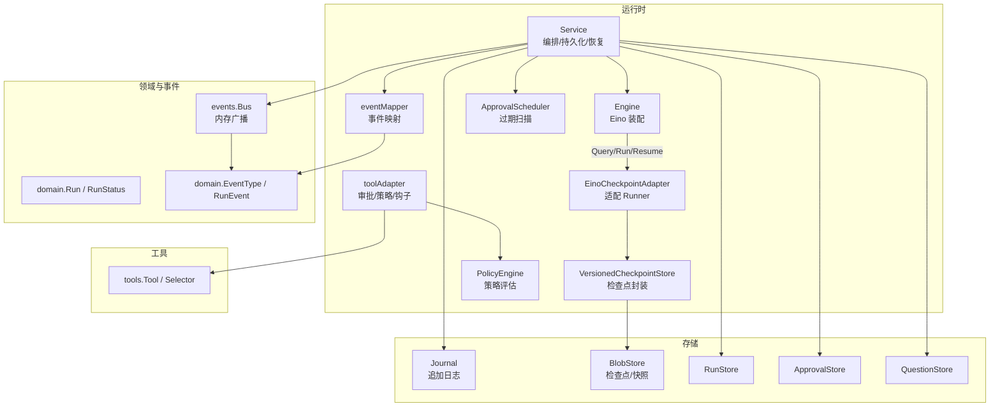
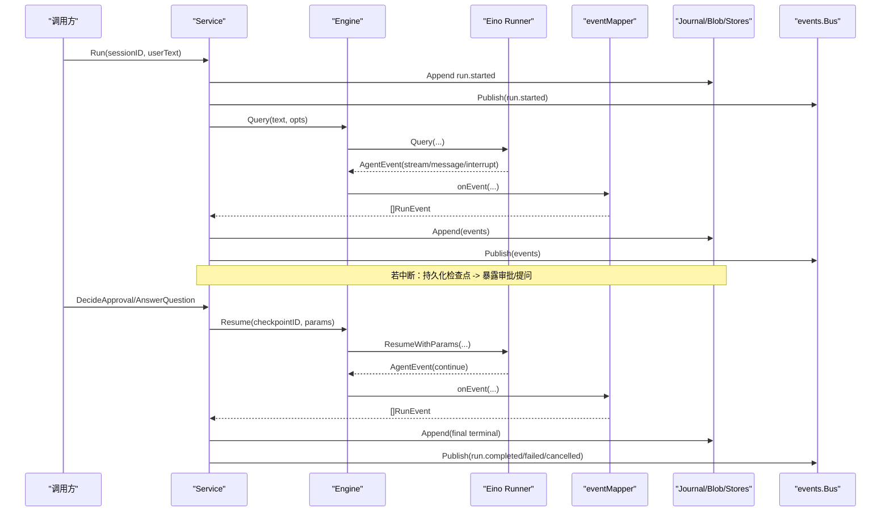
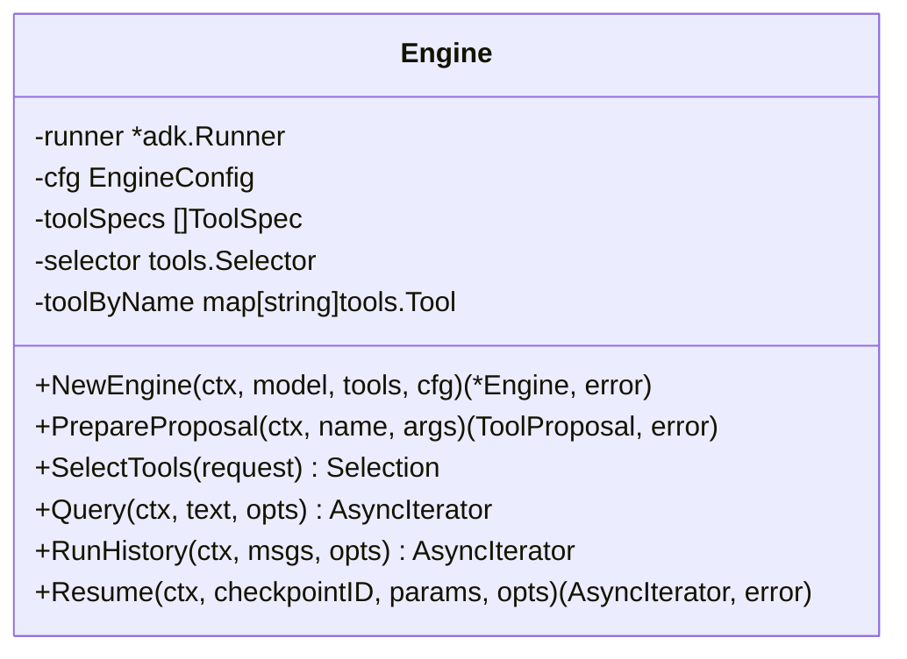
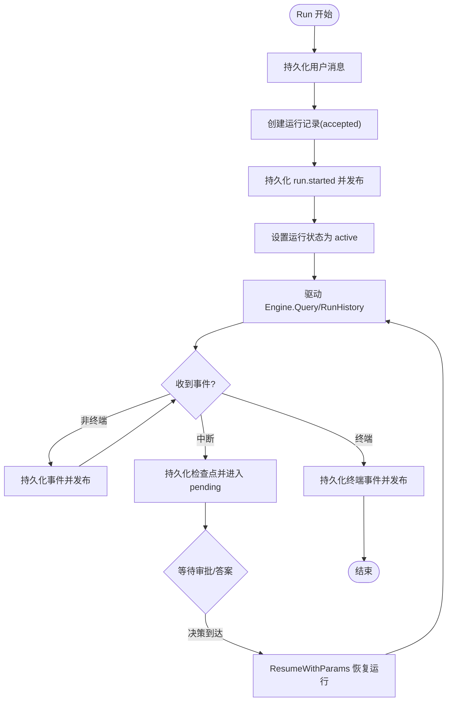
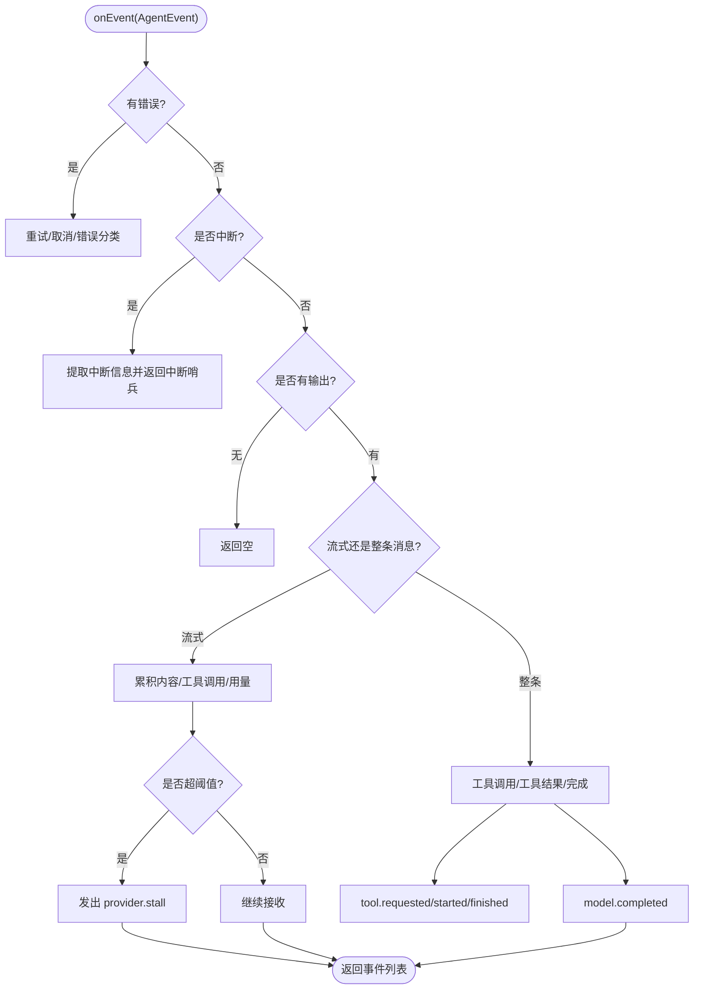
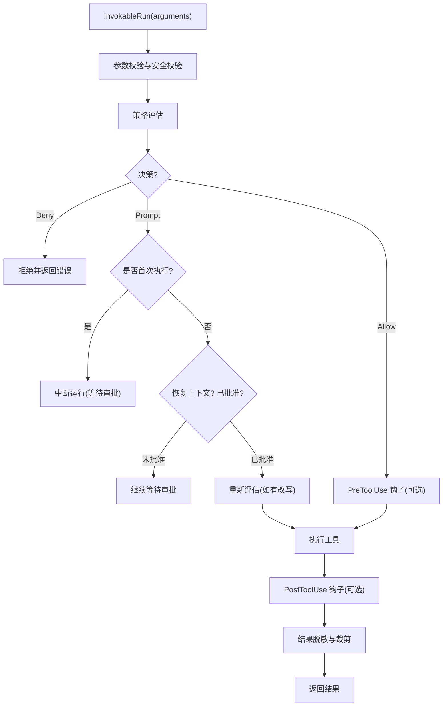
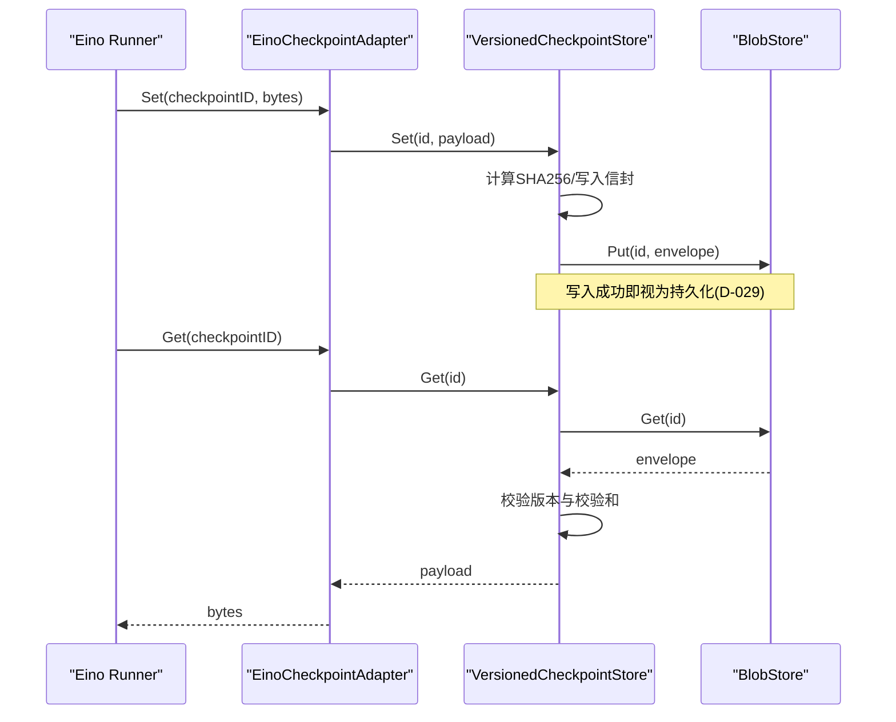
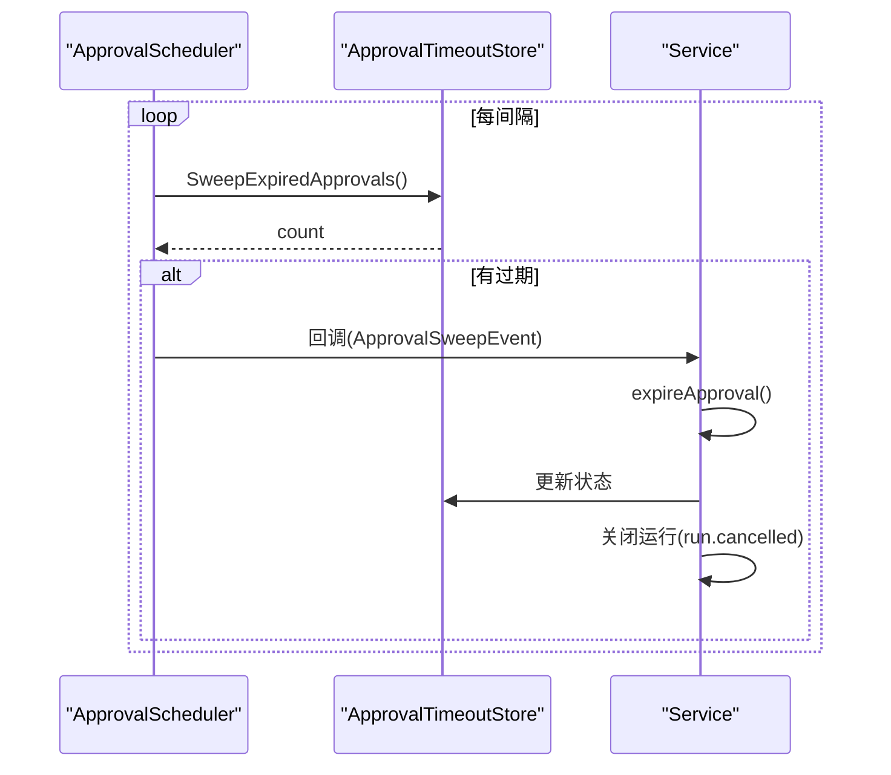
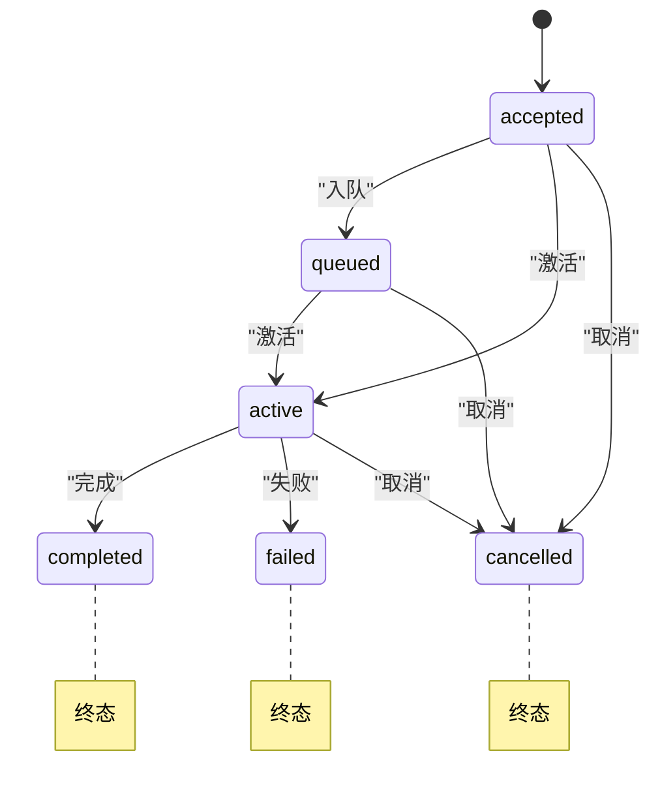
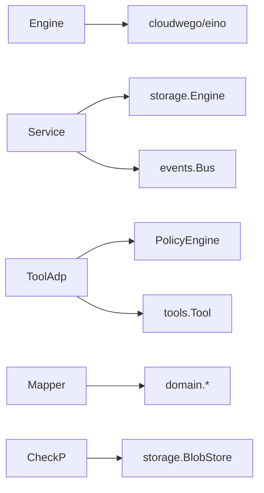

# 运行时架构

<cite>
**本文引用的文件**
- [engine.go](file://internal/runtime/engine.go)
- [service.go](file://internal/runtime/service.go)
- [mapper.go](file://internal/runtime/mapper.go)
- [tooladapter.go](file://internal/runtime/tooladapter.go)
- [checkpoint.go](file://internal/runtime/checkpoint.go)
- [checkpointadapter.go](file://internal/runtime/checkpointadapter.go)
- [policy.go](file://internal/runtime/policy.go)
- [approval_scheduler.go](file://internal/runtime/approval_scheduler.go)
- [run.go](file://internal/domain/run.go)
- [event.go](file://internal/domain/event.go)
- [bus.go](file://internal/events/bus.go)
- [contracts.go](file://internal/storage/contracts.go)
- [eino-capability-verify.md](file://docs/eino-capability-verify.md)
</cite>

## 目录
1. [简介](#简介)
2. [项目结构](#项目结构)
3. [核心组件](#核心组件)
4. [架构总览](#架构总览)
5. [详细组件分析](#详细组件分析)
6. [依赖关系分析](#依赖关系分析)
7. [性能考虑](#性能考虑)
8. [故障恢复与排障](#故障恢复与排障)
9. [结论](#结论)
10. [附录](#附录)

## 简介
本文件系统化阐述 Agent-Vivy 的运行时架构，重点覆盖：
- Eino 框架集成方式：ChatModelAgent 构建、Runner 协调机制、事件流映射到 domain.RunEvent。
- 运行生命周期管理：从 Run 创建、驱动、挂起（审批/提问）、恢复到终态事件保证（D-008）。
- 检查点桥接机制：EinoCheckpointAdapter → VersionedCheckpointStore → BlobStore 的两层桥接，版本校验与完整性校验。
- 审批流程集成：工具中断、审批存储、过期清理、恢复重放。
- 工具中断处理与恢复：ResumeWithParams 的目标键、参数回传、状态机约束。
- 与存储层、工具层的交互模式：Journal 为唯一事实源，事件先持久后发布。
- 性能优化与故障恢复策略：预算控制、事件负载裁剪、超时扫描、启动恢复。

## 项目结构
运行时位于 internal/runtime，围绕 Engine（Eino 装配）与 Service（编排与持久化）展开；domain 定义领域模型与事件类型；events.Bus 提供内存广播；storage 提供持久化契约；tools 提供工具实现与选择策略。

图表来源
- [engine.go:61-117](file://internal/runtime/engine.go#L61-L117)
- [service.go:96-169](file://internal/runtime/service.go#L96-L169)
- [mapper.go:40-72](file://internal/runtime/mapper.go#L40-L72)
- [tooladapter.go:24-43](file://internal/runtime/tooladapter.go#L24-L43)
- [checkpoint.go:40-62](file://internal/runtime/checkpoint.go#L40-L62)
- [checkpointadapter.go:9-24](file://internal/runtime/checkpointadapter.go#L9-L24)
- [policy.go:35-84](file://internal/runtime/policy.go#L35-L84)
- [approval_scheduler.go:18-46](file://internal/runtime/approval_scheduler.go#L18-L46)
- [run.go:5-29](file://internal/domain/run.go#L5-L29)
- [event.go:3-43](file://internal/domain/event.go#L3-L43)
- [bus.go:10-46](file://internal/events/bus.go#L10-L46)
- [contracts.go:55-85](file://internal/storage/contracts.go#L55-L85)

章节来源
- [engine.go:61-117](file://internal/runtime/engine.go#L61-L117)
- [service.go:96-169](file://internal/runtime/service.go#L96-L169)
- [run.go:5-29](file://internal/domain/run.go#L5-L29)
- [event.go:3-43](file://internal/domain/event.go#L3-L43)
- [bus.go:10-46](file://internal/events/bus.go#L10-L46)
- [contracts.go:55-85](file://internal/storage/contracts.go#L55-L85)

## 核心组件
- Engine：封装 Eino ChatModelAgent 与 Runner，负责工具包装、最大迭代次数限制、检查点注入、查询与历史回放、恢复执行。
- Service：编排一次运行的完整生命周期，包括消息与运行记录持久化、事件先写后发、取消/恢复、预算与策略快照、后台扫描与重启恢复。
- eventMapper：将 Eino 的 AgentEvent 转换为 Vivy 的 domain.RunEvent，处理流式输出、工具调用、中断、使用量统计等。
- toolAdapter：在工具执行前进行参数校验、策略评估、审批门控、提问门控、结果压缩与脱敏。
- VersionedCheckpointStore + EinoCheckpointAdapter：对 Eino 检查点进行版本与完整性封装，确保跨版本安全与失败关闭。
- PolicyEngine：基于策略配置对工具调用进行评估，支持默认策略与规则匹配，生成策略快照哈希。
- ApprovalScheduler：周期性扫描并标记过期的待审批项，避免陈旧审批堆积。

章节来源
- [engine.go:18-117](file://internal/runtime/engine.go#L18-L117)
- [service.go:96-169](file://internal/runtime/service.go#L96-L169)
- [mapper.go:40-72](file://internal/runtime/mapper.go#L40-L72)
- [tooladapter.go:24-43](file://internal/runtime/tooladapter.go#L24-L43)
- [checkpoint.go:40-62](file://internal/runtime/checkpoint.go#L40-L62)
- [checkpointadapter.go:9-24](file://internal/runtime/checkpointadapter.go#L9-L24)
- [policy.go:35-84](file://internal/runtime/policy.go#L35-L84)
- [approval_scheduler.go:18-46](file://internal/runtime/approval_scheduler.go#L18-L46)

## 架构总览
Vivy 运行时以 Service 为中心，Engine 作为 Eino 的代理，通过 eventMapper 将引擎事件映射为领域事件，经由 Journal 持久化并由 events.Bus 广播给订阅者。工具调用经 toolAdapter 进行策略与审批门控，必要时中断并写入检查点，等待审批或用户回答后恢复。

图表来源
- [service.go:212-300](file://internal/runtime/service.go#L212-L300)
- [engine.go:144-165](file://internal/runtime/engine.go#L144-L165)
- [mapper.go:74-102](file://internal/runtime/mapper.go#L74-L102)
- [checkpoint.go:64-97](file://internal/runtime/checkpoint.go#L64-L97)
- [contracts.go:55-64](file://internal/storage/contracts.go#L55-L64)
- [bus.go:42-75](file://internal/events/bus.go#L42-L75)

## 详细组件分析

### Engine：Eino 装配与运行入口
- 构建 ChatModelAgent：注入 Model、工具集合、中间件（工具选择），可选设置最大迭代次数。
- 构建 Runner：启用流式输出，注入检查点适配器（如配置了检查点存储）。
- 提供 Query、RunHistory、Resume 三种运行入口，统一返回异步迭代器供上层消费。
- 工具选择：按请求上下文过滤可用工具集，保障最小权限面。

图表来源
- [engine.go:48-117](file://internal/runtime/engine.go#L48-L117)
- [engine.go:119-165](file://internal/runtime/engine.go#L119-L165)

章节来源
- [engine.go:61-117](file://internal/runtime/engine.go#L61-L117)
- [engine.go:144-165](file://internal/runtime/engine.go#L144-L165)

### Service：运行编排、持久化与恢复
- 运行启动：写入用户消息、创建运行记录、持久化 run.started 并发布，随后在独立上下文中驱动 Engine。
- 事件流：每个事件先持久化到 Journal，再发布到 Bus；终端事件保证恰好一个（D-008）。
- 中断与恢复：遇到中断时持久化检查点，建立 pending 状态；收到审批/答案后重建上下文并 Resume。
- 取消与回收：Cancel/CancelAll 终止活跃运行；Recover 在启动时修复遗留运行（可恢复的审批/提问路径重建 pending，不可恢复的失败关闭）。
- 预算与策略：为每次运行预留事件配额，维护策略快照与共享账本，支持父子工作进程继承。

图表来源
- [service.go:212-300](file://internal/runtime/service.go#L212-L300)
- [service.go:302-387](file://internal/runtime/service.go#L302-L387)
- [service.go:465-576](file://internal/runtime/service.go#L465-L576)
- [contracts.go:55-64](file://internal/storage/contracts.go#L55-L64)
- [event.go:93-116](file://internal/domain/event.go#L93-L116)

章节来源
- [service.go:212-300](file://internal/runtime/service.go#L212-L300)
- [service.go:302-387](file://internal/runtime/service.go#L302-L387)
- [service.go:465-576](file://internal/runtime/service.go#L465-L576)

### eventMapper：Eino 事件到领域事件的映射
- 流式输出：累积 assistant 文本，产出 model.delta、model.reasoning_delta、model.usage，并在 turn 结束时补全 model.completed。
- 工具调用：从 assistant 消息中解析 tool_calls，产出 tool.requested，并跟踪 openCalls 以便后续 tool.started/finished。
- 中断处理：提取根因中断 ID 与工具调用地址，构造 resume target，返回中断哨兵错误让 Service 挂起运行。
- 负载裁剪：对 delta/reasoning 文本进行字节预算裁剪，防止事件过大。

图表来源
- [mapper.go:74-102](file://internal/runtime/mapper.go#L74-L102)
- [mapper.go:104-169](file://internal/runtime/mapper.go#L104-L169)
- [mapper.go:171-191](file://internal/runtime/mapper.go#L171-L191)
- [mapper.go:248-265](file://internal/runtime/mapper.go#L248-L265)
- [mapper.go:267-307](file://internal/runtime/mapper.go#L267-L307)
- [mapper.go:368-393](file://internal/runtime/mapper.go#L368-L393)

章节来源
- [mapper.go:74-102](file://internal/runtime/mapper.go#L74-L102)
- [mapper.go:104-169](file://internal/runtime/mapper.go#L104-L169)
- [mapper.go:171-191](file://internal/runtime/mapper.go#L171-L191)
- [mapper.go:248-265](file://internal/runtime/mapper.go#L248-L265)
- [mapper.go:267-307](file://internal/runtime/mapper.go#L267-L307)
- [mapper.go:368-393](file://internal/runtime/mapper.go#L368-L393)

### toolAdapter：工具审批、策略与结果治理
- 参数校验与安全校验：拒绝非法参数与不安全输入。
- 策略评估：根据策略配置与工具规格决定允许、提示或拒绝；计划模式下拒绝效果型工具。
- 审批门控：首次执行需要审批时中断运行；恢复时读取审批结果，拒绝则返回说明性结果。
- 提问门控：对于 ask_user 类型的工具，若无恢复上下文则中断；恢复时直接返回答案。
- 结果治理：添加不可信输出头、敏感信息脱敏、结果大小裁剪，避免污染模型上下文。

图表来源
- [tooladapter.go:78-163](file://internal/runtime/tooladapter.go#L78-L163)
- [tooladapter.go:165-202](file://internal/runtime/tooladapter.go#L165-L202)
- [policy.go:96-135](file://internal/runtime/policy.go#L96-L135)

章节来源
- [tooladapter.go:78-163](file://internal/runtime/tooladapter.go#L78-L163)
- [tooladapter.go:165-202](file://internal/runtime/tooladapter.go#L165-L202)
- [policy.go:96-135](file://internal/runtime/policy.go#L96-L135)

### 检查点桥接：版本与完整性保护
- EinoCheckpointAdapter：将 VersionedCheckpointStore 暴露给 Eino Runner，保持 eino 类型不泄漏到外部。
- VersionedCheckpointStore：写入时对 eino 检查点进行信封封装（引擎版本、SHA256 校验和、时间戳），并按代次写入 BlobStore；读取时验证版本与校验和，失败关闭。
- 恢复语义：ResumeWithParams 必须携带相同的 checkpointID 与目标键（root cause interrupt ID），工具侧通过 GetResumeContext 获取审批/答案。

图表来源
- [checkpointadapter.go:9-43](file://internal/runtime/checkpointadapter.go#L9-L43)
- [checkpoint.go:64-97](file://internal/runtime/checkpoint.go#L64-L97)
- [eino-capability-verify.md:30-68](file://docs/eino-capability-verify.md#L30-L68)
- [eino-capability-verify.md:70-117](file://docs/eino-capability-verify.md#L70-L117)

章节来源
- [checkpointadapter.go:9-43](file://internal/runtime/checkpointadapter.go#L9-L43)
- [checkpoint.go:64-97](file://internal/runtime/checkpoint.go#L64-L97)
- [eino-capability-verify.md:30-68](file://docs/eino-capability-verify.md#L30-L68)
- [eino-capability-verify.md:70-117](file://docs/eino-capability-verify.md#L70-L117)

### 审批流程与过期清理
- 审批存储：ApprovalStore 支持创建、查询、决定（first-writer-wins）、列出待审批项。
- 过期扫描：ApprovalScheduler 定期扫描并标记过期审批，触发回调通知服务层处理（如取消运行）。
- 服务层回收：SweepExpired 会遍历待审批/待问题，到期则过期并关闭对应运行。

图表来源
- [approval_scheduler.go:55-117](file://internal/runtime/approval_scheduler.go#L55-L117)
- [contracts.go:178-189](file://internal/storage/contracts.go#L178-L189)
- [service.go:389-463](file://internal/runtime/service.go#L389-L463)

章节来源
- [approval_scheduler.go:55-117](file://internal/runtime/approval_scheduler.go#L55-L117)
- [contracts.go:178-189](file://internal/storage/contracts.go#L178-L189)
- [service.go:389-463](file://internal/runtime/service.go#L389-L463)

### 运行状态转换图（D-008 单终态保证）

图表来源
- [run.go:5-29](file://internal/domain/run.go#L5-L29)
- [event.go:93-116](file://internal/domain/event.go#L93-L116)
- [contracts.go:16-21](file://internal/storage/contracts.go#L16-L21)

章节来源
- [run.go:5-29](file://internal/domain/run.go#L5-L29)
- [event.go:93-116](file://internal/domain/event.go#L93-L116)
- [contracts.go:16-21](file://internal/storage/contracts.go#L16-L21)

## 依赖关系分析
- 耦合与内聚：
  - Engine 仅依赖 Eino 类型，符合 D-007 红线；Service 聚合存储与事件总线，职责清晰。
  - toolAdapter 与 PolicyEngine 紧密耦合，形成“策略+审批”的执行门控。
  - eventMapper 与 domain 事件强相关，集中处理映射逻辑。
- 外部依赖：
  - storage 契约抽象了 Journal/Blob/Runs/Approvals/Questions 等后端，便于替换实现。
  - events.Bus 提供内存广播，慢消费者会被丢弃，需通过 Journal 重放。
- 循环依赖规避：
  - Service 通过接口（ChildApprovalRouter、WorkspaceAllocator 等）解耦，避免与 app 层循环引用。

图表来源
- [engine.go:3-16](file://internal/runtime/engine.go#L3-L16)
- [service.go:3-22](file://internal/runtime/service.go#L3-L22)
- [tooladapter.go:3-16](file://internal/runtime/tooladapter.go#L3-L16)
- [mapper.go:3-16](file://internal/runtime/mapper.go#L3-L16)
- [checkpoint.go:3-15](file://internal/runtime/checkpoint.go#L3-L15)

章节来源
- [engine.go:3-16](file://internal/runtime/engine.go#L3-L16)
- [service.go:3-22](file://internal/runtime/service.go#L3-L22)
- [tooladapter.go:3-16](file://internal/runtime/tooladapter.go#L3-L16)
- [mapper.go:3-16](file://internal/runtime/mapper.go#L3-L16)
- [checkpoint.go:3-15](file://internal/runtime/checkpoint.go#L3-L15)

## 性能考虑
- 事件负载裁剪：delta/reasoning 文本按 max_event_payload_bytes 裁剪，避免大事件阻塞下游。
- 工具结果压缩：超过预算的结果保留首尾片段与标记，减少模型上下文占用。
- 流式缓冲：EngineConfig.StreamBuffer 控制下游事件扇出通道大小，平衡吞吐与内存。
- 预算控制：BudgetLedger 限制整个运行树的事件与资源消耗，防止无限增长。
- 超时与停滞检测：provider.stall 事件用于提示长时间无进展，便于前端反馈与降级。
- 检查点体积：eino 检查点较大，BlobStore 需考虑容量与读写成本。

[本节为通用性能讨论，不直接分析具体文件]

## 故障恢复与排障
- 启动恢复（Recover）：
  - 列举活跃运行，区分子进程与主进程；子进程直接失败关闭以避免重复副作用。
  - 若有有效审批且检查点可读，重建 pending 状态等待决策；否则失败关闭。
  - 若存在过期审批/问题，过期并关闭。
- 运行取消（Cancel/CancelAll）：
  - 对活跃运行调用 cancel 函数；对 pending 运行关闭审批/问题并发送 run.cancelled。
- 事件一致性：
  - Journal.Append 在已有终端事件后拒绝追加，保证 D-008 单终态。
  - 终端事件发布后关闭订阅通道，后续订阅者通过 Journal 重放。
- 常见排障要点：
  - 检查点版本不匹配或损坏：VersionedCheckpointStore 会拒绝加载，需确认 eino 版本一致。
  - 审批过期：ApprovalScheduler 会标记过期，服务层关闭运行。
  - 策略拒绝：toolAdapter 返回 ErrPolicyDenied，查看策略配置与规则匹配。

章节来源
- [service.go:465-576](file://internal/runtime/service.go#L465-L576)
- [service.go:302-387](file://internal/runtime/service.go#L302-L387)
- [contracts.go:16-21](file://internal/storage/contracts.go#L16-L21)
- [checkpoint.go:17-27](file://internal/runtime/checkpoint.go#L17-L27)
- [approval_scheduler.go:91-117](file://internal/runtime/approval_scheduler.go#L91-L117)

## 结论
Vivy 运行时通过 Engine 与 Service 的清晰分层，结合 eventMapper 的标准化事件映射、toolAdapter 的策略与审批门控、以及两层检查点桥接的版本与完整性保护，实现了可靠的 Agent 执行生命周期管理。Journal 作为唯一事实源，配合 events.Bus 提供高效实时广播；ApprovalScheduler 与 Recovery 机制确保系统健壮性与可恢复性。整体设计遵循 D-007/D-008/D-010 等架构红线，兼顾性能与安全性。

[本节为总结性内容，不直接分析具体文件]

## 附录
- Eino 能力验证摘要：
  - CheckPointStore 注入与 Delete 扩展已验证。
  - 检查点序列化由引擎内部 gob 编码，Vivy 无需解析。
  - 中断→检查点→ResumeWithParams 顺序满足 D-029。
  - 流式输出与取消行为已验证，支持 exactly-one 终端事件。

章节来源
- [eino-capability-verify.md:13-26](file://docs/eino-capability-verify.md#L13-L26)
- [eino-capability-verify.md:30-68](file://docs/eino-capability-verify.md#L30-L68)
- [eino-capability-verify.md:70-117](file://docs/eino-capability-verify.md#L70-L117)
- [eino-capability-verify.md:119-133](file://docs/eino-capability-verify.md#L119-L133)