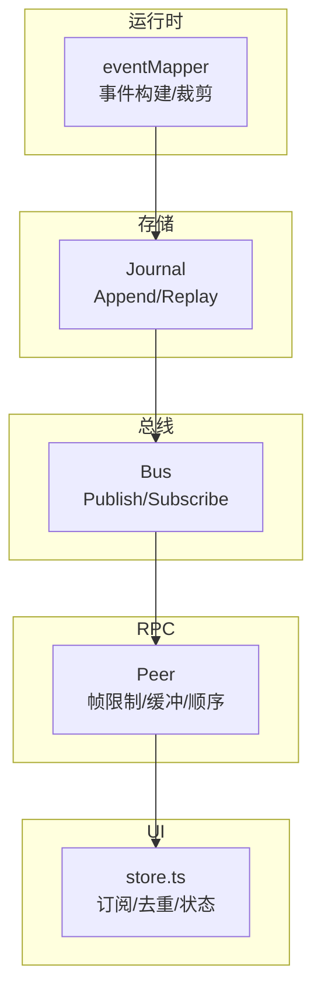
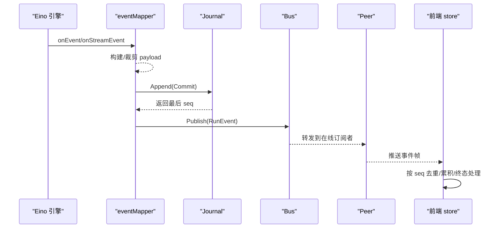
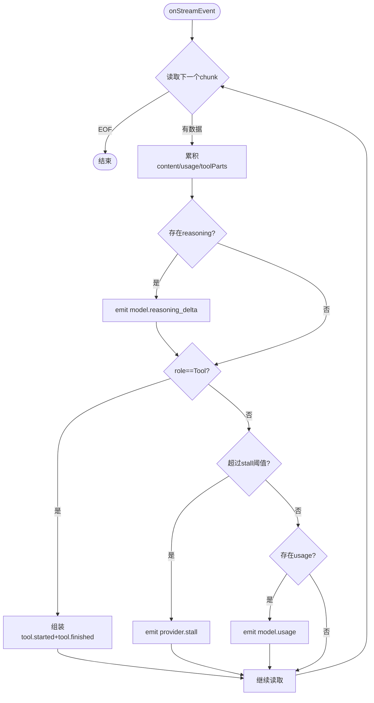
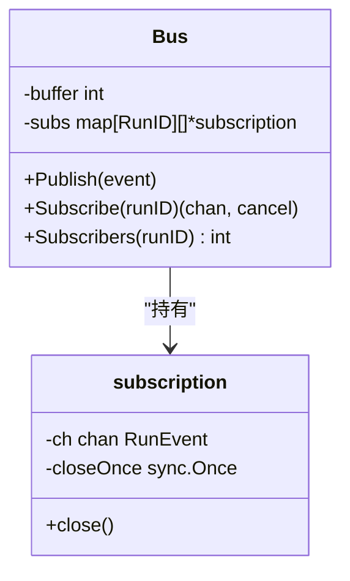
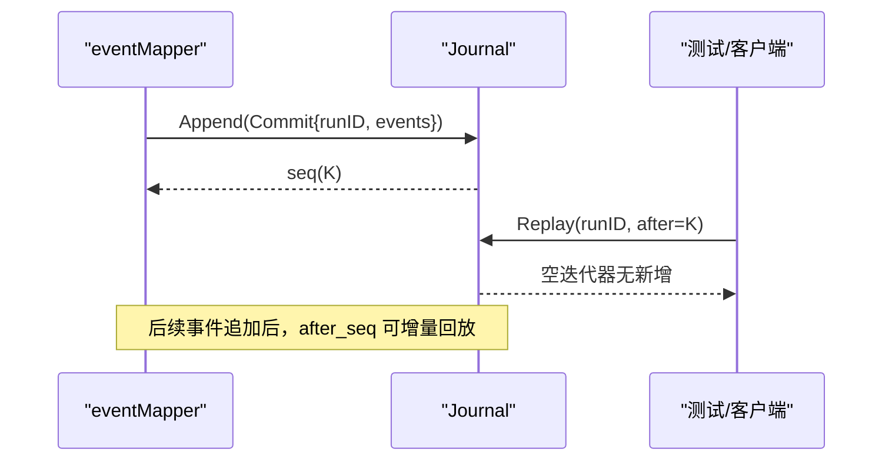
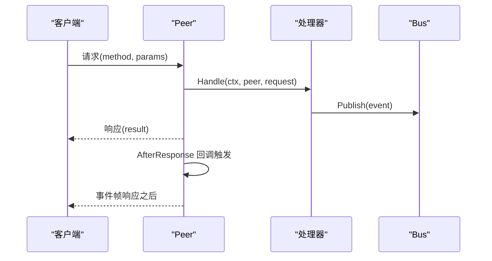
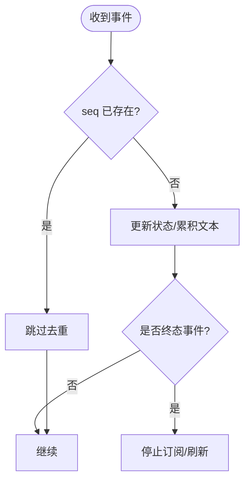
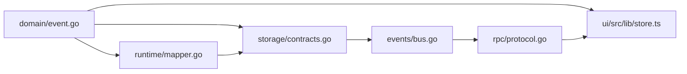

# 事件映射与处理

<cite>
**本文引用的文件**
- [internal/events/bus.go](file://internal/events/bus.go)
- [internal/domain/event.go](file://internal/domain/event.go)
- [internal/rpc/protocol.go](file://internal/rpc/protocol.go)
- [internal/storage/contracts.go](file://internal/storage/contracts.go)
- [internal/storage/sqlite/sqlite_test.go](file://internal/storage/sqlite/sqlite_test.go)
- [internal/storage/conformance/suite.go](file://internal/storage/conformance/suite.go)
- [schemas/events/run-event.schema.json](file://schemas/events/run-event.schema.json)
- [schemas/events/payloads/model.delta.json](file://schemas/events/payloads/model.delta.json)
- [schemas/events/payloads/tool.requested.json](file://schemas/events/payloads/tool.requested.json)
- [schemas/events/payloads/run.started.json](file://schemas/events/payloads/run.started.json)
- [internal/runtime/mapper.go](file://internal/runtime/mapper.go)
- [internal/runtime/payloads.go](file://internal/runtime/payloads.go)
- [ui/src/lib/store.ts](file://ui/src/lib/store.ts)
- [docs/dev/NEW_UI_ARCHITECTURE.md](file://docs/dev/NEW_UI_ARCHITECTURE.md)
</cite>

## 目录
1. [简介](#简介)
2. [项目结构](#项目结构)
3. [核心组件](#核心组件)
4. [架构总览](#架构总览)
5. [详细组件分析](#详细组件分析)
6. [依赖关系分析](#依赖关系分析)
7. [性能考量](#性能考量)
8. [故障排查指南](#故障排查指南)
9. [结论](#结论)
10. [附录：如何添加新事件类型](#附录如何添加新事件类型)

## 简介
本文件围绕 Vivy 的事件映射与处理系统，系统性说明事件从运行时到持久化、再到发布订阅与前端消费的完整链路。重点覆盖：
- EventMapper 的设计模式：事件构建、序列化、大小限制、去重机制
- 事件类型定义与用途（如 run.started、tool.requested、model.delta 等）
- 事件持久化流程（Journal）、发布订阅（Bus）、断线重连（after_seq 游标）
- 版本管理与向后兼容（PayloadVersion、Schema 约束）
- 性能优化策略（缓冲、限流、裁剪、背压）

## 项目结构
事件系统横跨以下层次：
- 领域层：事件类型与信封契约（EventType、RunEvent）
- 运行时映射：将 Eino 事件转换为 Vivy 领域事件（eventMapper）
- 存储层：追加式有序日志 Journal（SQLite/Postgres 实现）
- 总线层：内存发布订阅 Bus（按 RunID 分发）
- RPC 传输层：JSON-RPC Peer（帧大小限制、出站缓冲、AfterResponse 顺序保证）
- UI 消费层：基于 after_seq 的订阅与状态更新

图表来源
- [internal/runtime/mapper.go:70-102](file://internal/runtime/mapper.go#L70-L102)
- [internal/storage/contracts.go:55-64](file://internal/storage/contracts.go#L55-L64)
- [internal/events/bus.go:42-75](file://internal/events/bus.go#L42-L75)
- [internal/rpc/protocol.go:120-164](file://internal/rpc/protocol.go#L120-L164)
- [ui/src/lib/store.ts:119-134](file://ui/src/lib/store.ts#L119-L134)

章节来源
- [internal/domain/event.go:1-129](file://internal/domain/event.go#L1-L129)
- [schemas/events/run-event.schema.json:1-76](file://schemas/events/run-event.schema.json#L1-L76)

## 核心组件
- 事件类型与信封
  - EventType 枚举了所有受支持的事件种类，并提供 Terminal() 判断是否终结运行。
  - RunEvent 是持久化的最小单元，包含 run_id、seq、type、created_at、payload_version、payload。
- 事件映射器 eventMapper
  - 将 Eino 的 AgentEvent/MessageStream 映射为领域 RunEvent，负责：
    - 构建 model.delta、model.reasoning_delta、model.usage、model.completed、tool.requested、tool.started、tool.finished 等
    - 对 delta/reasoning 文本进行大小裁剪，确保 payload 不超预算
    - 维护 pendingText 以在 turn 结束时补发 model.completed
    - 跟踪 openToolCalls 以正确关联 tool.started/finished
- 发布订阅 Bus
  - 按 RunID 分发事件；遇到终端事件关闭并清理订阅；慢消费者会被丢弃并通过 journal 回放恢复。
- 存储 Journal
  - Append 原子写入一批事件，分配单调递增 seq；Replay 支持 after_seq 增量回放。
  - 强制“每个运行恰好一个终态事件”的不变量。
- RPC Peer
  - 统一 JSON-RPC 传输，提供帧大小限制、出站缓冲、AfterResponse 回调以保证响应先于事件到达。
- UI 消费
  - 使用 after_seq 订阅，按 seq 去重，累积 streamingText/streamingReasoning，并在终态时刷新。

章节来源
- [internal/domain/event.go:8-129](file://internal/domain/event.go#L8-L129)
- [internal/runtime/mapper.go:40-102](file://internal/runtime/mapper.go#L40-L102)
- [internal/events/bus.go:10-115](file://internal/events/bus.go#L10-L115)
- [internal/storage/contracts.go:33-75](file://internal/storage/contracts.go#L33-L75)
- [internal/rpc/protocol.go:70-164](file://internal/rpc/protocol.go#L70-L164)
- [ui/src/lib/store.ts:119-134](file://ui/src/lib/store.ts#L119-L134)

## 架构总览
事件从运行时产生，经映射器构建为领域事件，持久化为追加日志，再通过内存总线推送给在线订阅者；离线或断线通过 RPC 的 after_seq 回放补齐。

图表来源
- [internal/runtime/mapper.go:74-169](file://internal/runtime/mapper.go#L74-L169)
- [internal/storage/contracts.go:55-64](file://internal/storage/contracts.go#L55-L64)
- [internal/events/bus.go:42-75](file://internal/events/bus.go#L42-L75)
- [internal/rpc/protocol.go:120-164](file://internal/rpc/protocol.go#L120-L164)
- [ui/src/lib/store.ts:119-134](file://ui/src/lib/store.ts#L119-L134)

## 详细组件分析

### 事件类型与载荷契约
- 事件类型
  - 包括 run.*、provider.*、model.*、tool.*、policy.*、hook.*、user.*、child.* 等，覆盖运行生命周期、模型流式输出、工具调用、策略评估、钩子执行、用户交互与子任务。
- 载荷 Schema
  - 每个事件类型对应 payloads/*.json，严格限定字段与类型，例如：
    - run.started：包含 provider、model、mode、policy_profile、policy_hash
    - tool.requested：包含 tool_call_id、tool_name、args
    - model.delta：包含 delta（增量文本），受运行时最大负载限制
- 信封 Schema
  - run-event.schema.json 定义了 RunEvent 的通用信封，要求 run_id、seq、type、created_at、payload_version、payload。

章节来源
- [internal/domain/event.go:8-81](file://internal/domain/event.go#L8-L81)
- [schemas/events/run-event.schema.json:1-76](file://schemas/events/run-event.schema.json#L1-L76)
- [schemas/events/payloads/run.started.json:1-35](file://schemas/events/payloads/run.started.json#L1-L35)
- [schemas/events/payloads/tool.requested.json:1-23](file://schemas/events/payloads/tool.requested.json#L1-L23)
- [schemas/events/payloads/model.delta.json:1-15](file://schemas/events/payloads/model.delta.json#L1-L15)

### 事件映射器 eventMapper
- 设计要点
  - 输入：Eino 的 AgentEvent 或消息流
  - 输出：一组领域 RunEvent（可能为多个，如 reasoning + delta + usage）
  - 错误处理：WillRetryError -> provider.retry；CancelError -> 终止；其他错误向上抛出
  - 中断：InterruptAction -> 记录 interruptDetails，返回 errRunInterrupted 让服务挂起等待审批
- 流式处理
  - 逐块接收 chunk，累积 content，提取 reasoning、usage、tool calls
  - 若长时间无数据，生成 provider.stall
  - 最终根据角色组装 tool.result 或 assistant 完成事件
- 大小限制
  - 对 delta/reasoning 文本进行 clampText，按预算字节裁剪，避免 payload 过大
- 工具调用追踪
  - 维护 openCalls 列表，确保 tool.started 与 tool.finished 成对出现，即使引擎未显式发出 started

图表来源
- [internal/runtime/mapper.go:104-169](file://internal/runtime/mapper.go#L104-L169)
- [internal/runtime/mapper.go:368-393](file://internal/runtime/mapper.go#L368-L393)

章节来源
- [internal/runtime/mapper.go:74-169](file://internal/runtime/mapper.go#L74-L169)
- [internal/runtime/mapper.go:248-324](file://internal/runtime/mapper.go#L248-L324)
- [internal/runtime/mapper.go:368-411](file://internal/runtime/mapper.go#L368-L411)
- [internal/runtime/payloads.go:1-49](file://internal/runtime/payloads.go#L1-L49)

### 发布订阅 Bus
- 行为特性
  - 按 RunID 管理订阅；Publish 将事件广播给所有订阅者
  - 终端事件会关闭并移除该 run 的所有订阅
  - 慢消费者会被丢弃（通道满），并记录告警；恢复方式是通过 journal 从 last seen seq 回放
- 并发安全
  - 使用互斥锁保护订阅表；closeOnce 防止重复关闭通道

图表来源
- [internal/events/bus.go:10-115](file://internal/events/bus.go#L10-L115)

章节来源
- [internal/events/bus.go:10-115](file://internal/events/bus.go#L10-L115)

### 持久化 Journal
- 接口约定
  - Append(ctx, Commit) 原子写入一批事件，返回最后分配的 seq
  - Replay(ctx, runID, after) 按序回放 seq > after 的事件
- 不变量保障
  - 每个运行最多一个终态事件；禁止提交包含多个终态事件的 commit
  - seq 单调递增且连续
- 测试验证
  - SQLite 测试验证 after_seq 过滤、单调序列、终态守卫
  - 一致性套件验证并发写入、断线后回放、载荷保真等

图表来源
- [internal/storage/contracts.go:33-64](file://internal/storage/contracts.go#L33-L64)
- [internal/storage/sqlite/sqlite_test.go:52-109](file://internal/storage/sqlite/sqlite_test.go#L52-L109)
- [internal/storage/conformance/suite.go:130-151](file://internal/storage/conformance/suite.go#L130-L151)

章节来源
- [internal/storage/contracts.go:33-75](file://internal/storage/contracts.go#L33-L75)
- [internal/storage/sqlite/sqlite_test.go:52-109](file://internal/storage/sqlite/sqlite_test.go#L52-L109)
- [internal/storage/conformance/suite.go:130-151](file://internal/storage/conformance/suite.go#L130-L151)
- [internal/storage/conformance/suite.go:486-548](file://internal/storage/conformance/suite.go#L486-L548)

### RPC 传输与顺序保证
- 帧限制与背压
  - MaxFrameBytes 限制入站帧大小；OutgoingBuffer 限制出站队列，溢出返回 ErrOverloaded
- 顺序保证
  - AfterResponse(id, fn) 确保某个请求的响应之后才执行回调（常用于事件推送），避免响应晚于事件到达
- 错误与关闭
  - 连接关闭、解析错误、方法不存在等均有明确错误码

图表来源
- [internal/rpc/protocol.go:120-164](file://internal/rpc/protocol.go#L120-L164)
- [internal/rpc/protocol.go:232-251](file://internal/rpc/protocol.go#L232-L251)
- [internal/rpc/protocol.go:257-273](file://internal/rpc/protocol.go#L257-L273)

章节来源
- [internal/rpc/protocol.go:70-164](file://internal/rpc/protocol.go#L70-L164)
- [internal/rpc/protocol.go:232-273](file://internal/rpc/protocol.go#L232-L273)

### 前端消费与去重
- 订阅与状态更新
  - 使用 after_seq=0 从头开始订阅，按 seq 去重，累积 streamingText/streamingReasoning
  - 终态事件（run.completed/failed/cancelled）停止订阅并刷新
- 断线重连
  - 前端在错误时进入 reconnect 状态，重新建立订阅并从 last seen seq 回放
- 事件处理分支
  - model.delta、model.reasoning_delta、tool.requested/started/finished、user.question_required 等分别更新 UI 状态

图表来源
- [ui/src/lib/store.ts:119-134](file://ui/src/lib/store.ts#L119-L134)
- [docs/dev/NEW_UI_ARCHITECTURE.md:993-1081](file://docs/dev/NEW_UI_ARCHITECTURE.md#L993-L1081)

章节来源
- [ui/src/lib/store.ts:119-134](file://ui/src/lib/store.ts#L119-L134)
- [docs/dev/NEW_UI_ARCHITECTURE.md:993-1081](file://docs/dev/NEW_UI_ARCHITECTURE.md#L993-L1081)

## 依赖关系分析
- 低耦合高内聚
  - domain 仅定义类型与常量，被 runtime、storage、rpc、ui 共同引用
  - runtime.mapper 依赖 domain 与 eino 抽象，不泄漏到外部契约
  - storage 提供稳定接口，SQLite/Postgres 实现替换透明
  - events.Bus 仅用于内存优化，历史以 Journal 为准
  - rpc.Peer 解耦传输与业务逻辑，保证顺序与背压
- 潜在循环依赖
  - 当前分层清晰，未见循环导入；如需扩展，应遵循现有边界

图表来源
- [internal/domain/event.go:1-129](file://internal/domain/event.go#L1-L129)
- [internal/runtime/mapper.go:1-412](file://internal/runtime/mapper.go#L1-L412)
- [internal/storage/contracts.go:1-282](file://internal/storage/contracts.go#L1-L282)
- [internal/events/bus.go:1-115](file://internal/events/bus.go#L1-L115)
- [internal/rpc/protocol.go:1-374](file://internal/rpc/protocol.go#L1-L374)
- [ui/src/lib/store.ts:119-134](file://ui/src/lib/store.ts#L119-L134)

章节来源
- [internal/domain/event.go:1-129](file://internal/domain/event.go#L1-L129)
- [internal/runtime/mapper.go:1-412](file://internal/runtime/mapper.go#L1-L412)
- [internal/storage/contracts.go:1-282](file://internal/storage/contracts.go#L1-L282)
- [internal/events/bus.go:1-115](file://internal/events/bus.go#L1-L115)
- [internal/rpc/protocol.go:1-374](file://internal/rpc/protocol.go#L1-L374)
- [ui/src/lib/store.ts:119-134](file://ui/src/lib/store.ts#L119-L134)

## 性能考量
- 事件裁剪与预算控制
  - clampText 按预算字节裁剪 delta/reasoning，避免大 payload 阻塞网络与存储
- 缓冲与背压
  - Bus 订阅通道缓冲有限，慢消费者被丢弃，避免拖垮生产端
  - RPC Peer 出站缓冲有限，溢出返回 ErrOverloaded，上层需重试或降级
- 流式处理与合并
  - mapper 累积 content 与 usage，减少中间对象创建
- 存储顺序与原子性
  - Journal Append 原子写入，Replay 支持增量，避免全量回放开销
- 建议
  - 合理设置 max_event_payload_bytes、RPC OutgoingBuffer、Bus buffer
  - 监控 stall 事件频率，调整 stallThreshold
  - 对高频 delta 事件在前端做节流渲染

## 故障排查指南
- 常见问题定位
  - 事件丢失：检查 Bus 是否因缓冲满丢弃订阅；确认 after_seq 是否正确传递
  - 终态事件异常：Journal 拒绝多终态提交；确认业务逻辑只发送一次
  - 大 payload 被裁剪：查看 mapper 日志中的 clamped 告警，调整预算
  - RPC 过载：捕获 ErrOverloaded，增加缓冲或降低事件频率
- 调试步骤
  - 使用 Replay(after_seq) 回放缺失区间
  - 检查终端事件是否唯一且正确
  - 校验 payload 是否符合 Schema（可用 JSON Schema 校验）

章节来源
- [internal/events/bus.go:42-75](file://internal/events/bus.go#L42-L75)
- [internal/storage/contracts.go:11-31](file://internal/storage/contracts.go#L11-L31)
- [internal/storage/sqlite/sqlite_test.go:96-109](file://internal/storage/sqlite/sqlite_test.go#L96-L109)
- [internal/rpc/protocol.go:257-273](file://internal/rpc/protocol.go#L257-L273)

## 结论
Vivy 的事件系统以领域契约为核心，通过 eventMapper 将运行时事件标准化，借助 Journal 持久化与 Bus 实时分发，配合 RPC 的顺序与背压控制，实现了可靠、可扩展、高性能的事件流水线。前端通过 after_seq 实现断线重连与去重，保证一致的用户体验。版本管理与 Schema 约束为演进提供了安全保障。

## 附录：如何添加新事件类型
步骤概览（以新增一个业务事件为例）：
1. 定义事件类型
   - 在 internal/domain/event.go 中添加新的 EventType 常量，并加入 EventTypes 列表
   - 如需要，扩展 Terminal()/RunStatus() 逻辑
2. 定义载荷 Schema
   - 在 schemas/events/payloads/ 下新增 <type>.json，描述字段、类型、必填项
   - 更新 schemas/events/run-event.schema.json 的 type 枚举（如由代码生成则无需手动）
3. 在映射器中构建事件
   - 在 internal/runtime/mapper.go 中新增构建函数（类似 deltaEvent/reasoningEvent），调用 build(type, payload)
   - 在适当时机（如 onMessageEvent/onStreamEvent）产出该事件
4. 定义载荷结构体
   - 在 internal/runtime/payloads.go 中新增对应的 payload 结构体，字段名与 Schema 对齐
5. 存储与回放
   - Journal 自动处理 Append/Replay；确保事件符合 Schema
   - 如需特殊语义（如终态），在 domain 层声明
6. 发布订阅与 RPC
   - Bus.Publish 会自动分发；RPC Peer 负责传输与顺序
7. 前端消费
   - 在 ui/src/lib/store.ts 中添加对该事件类型的处理分支（如更新状态、累积文本等）
   - 在 docs/dev/NEW_UI_ARCHITECTURE.md 示例中参考 useRunSubscription 的事件分发模式
8. 测试与验证
   - 编写单元测试验证事件生成、Schema 校验、终态不变量、after_seq 回放
   - 使用 conformance suite 验证存储后端一致性

章节来源
- [internal/domain/event.go:8-129](file://internal/domain/event.go#L8-L129)
- [schemas/events/run-event.schema.json:1-76](file://schemas/events/run-event.schema.json#L1-L76)
- [schemas/events/payloads/model.delta.json:1-15](file://schemas/events/payloads/model.delta.json#L1-L15)
- [schemas/events/payloads/tool.requested.json:1-23](file://schemas/events/payloads/tool.requested.json#L1-L23)
- [schemas/events/payloads/run.started.json:1-35](file://schemas/events/payloads/run.started.json#L1-L35)
- [internal/runtime/mapper.go:395-411](file://internal/runtime/mapper.go#L395-L411)
- [internal/runtime/payloads.go:1-49](file://internal/runtime/payloads.go#L1-L49)
- [ui/src/lib/store.ts:119-134](file://ui/src/lib/store.ts#L119-L134)
- [docs/dev/NEW_UI_ARCHITECTURE.md:993-1081](file://docs/dev/NEW_UI_ARCHITECTURE.md#L993-L1081)