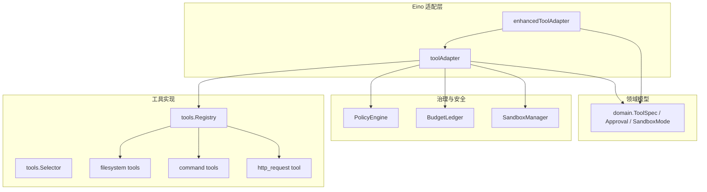
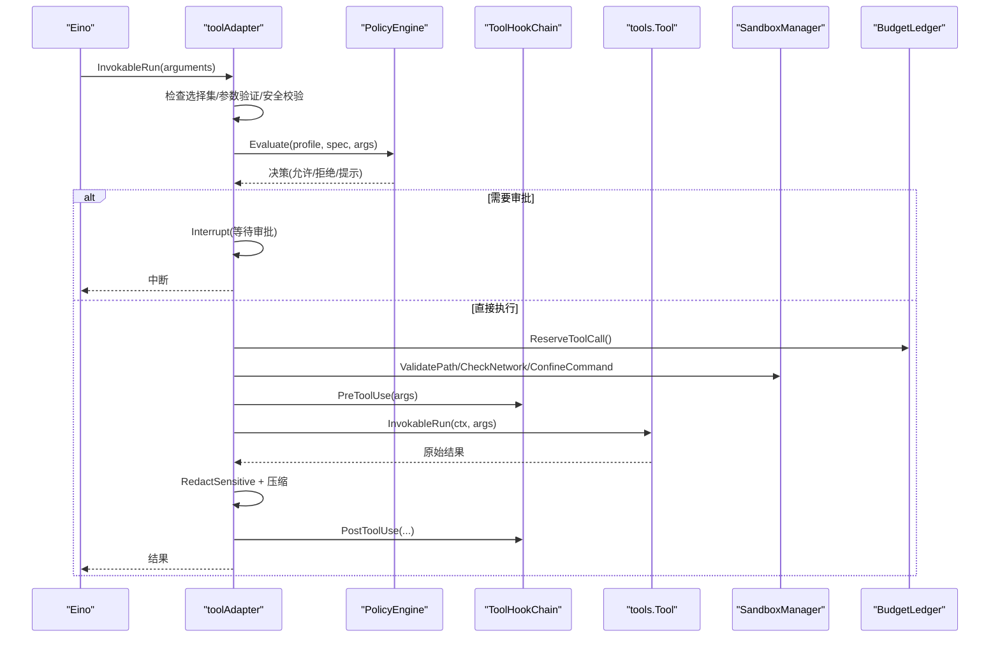
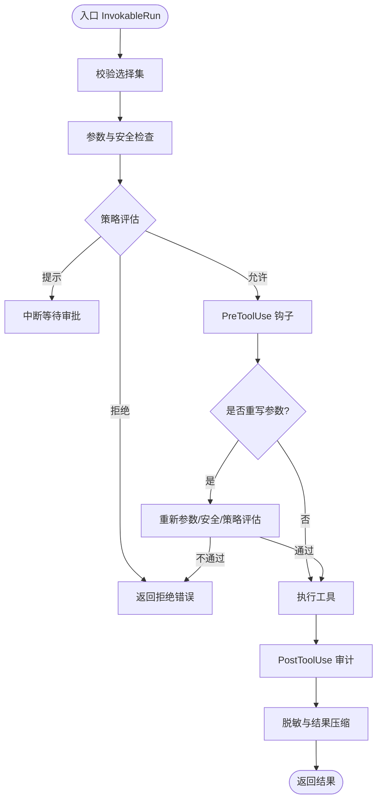
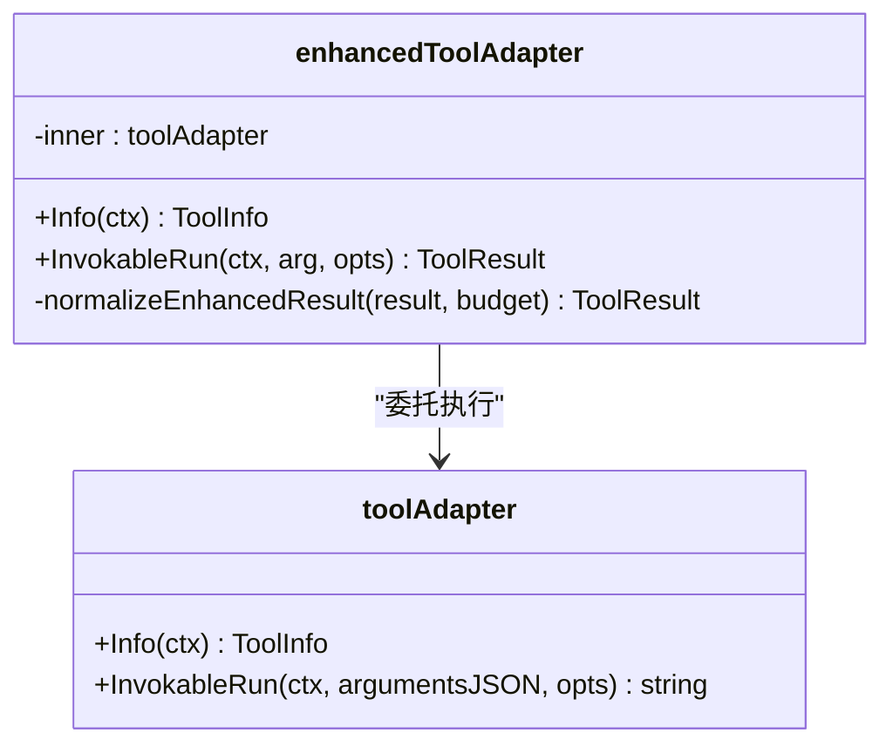
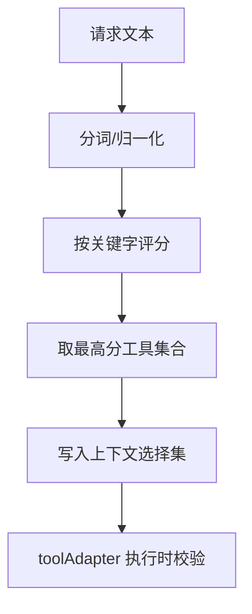
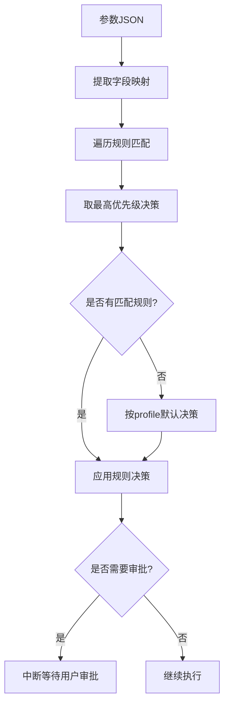
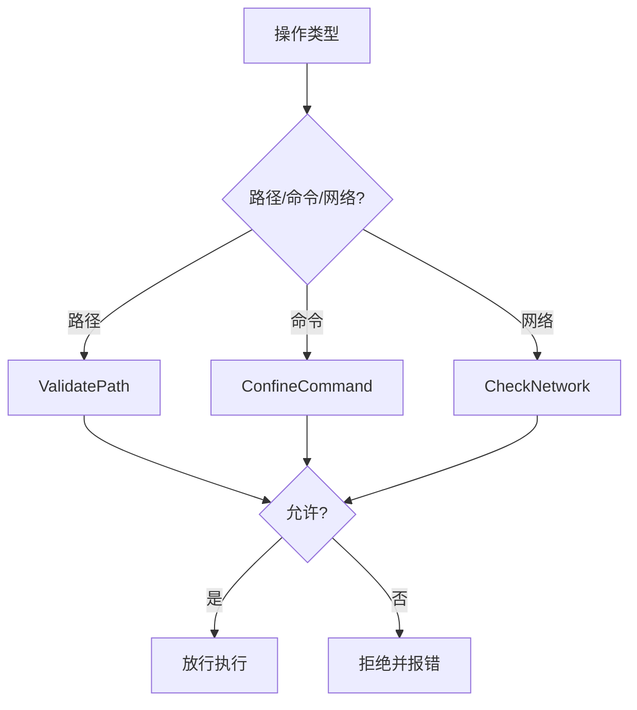
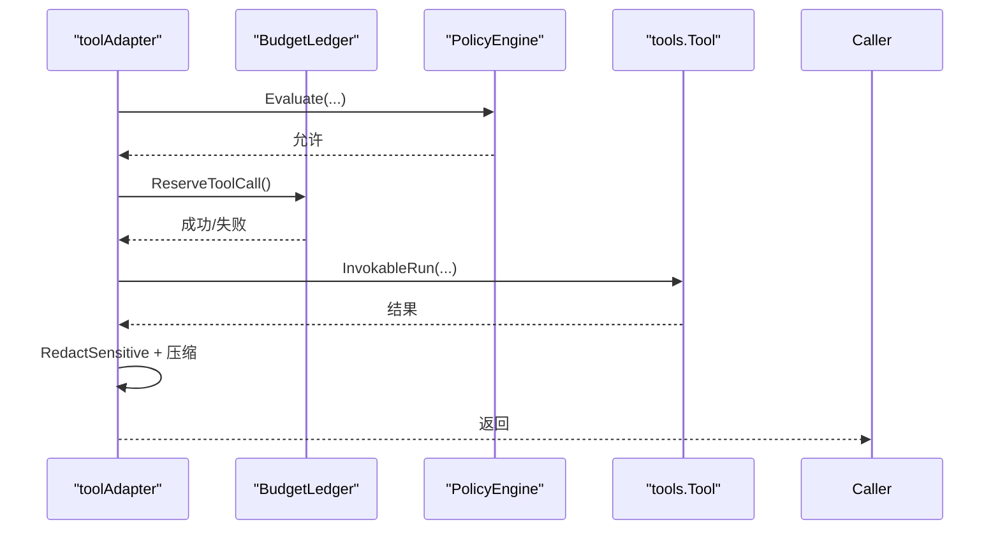
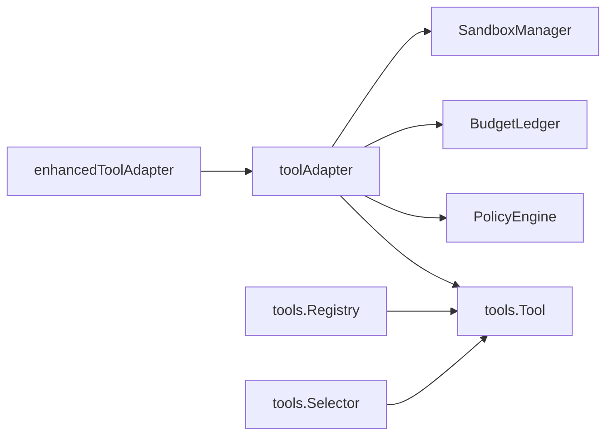

# 工具适配器

<cite>
**本文引用的文件**
- [internal/runtime/enhanced_tooladapter.go](file://internal/runtime/enhanced_tooladapter.go)
- [internal/runtime/tooladapter.go](file://internal/runtime/tooladapter.go)
- [internal/runtime/toolbroker.go](file://internal/runtime/toolbroker.go)
- [internal/runtime/toolselection.go](file://internal/runtime/toolselection.go)
- [internal/tools/tools.go](file://internal/tools/tools.go)
- [internal/tools/security.go](file://internal/tools/security.go)
- [internal/tools/filesystem.go](file://internal/tools/filesystem.go)
- [internal/tools/command.go](file://internal/tools/command.go)
- [internal/tools/http_request.go](file://internal/tools/http_request.go)
- [internal/runtime/policy.go](file://internal/runtime/policy.go)
- [internal/runtime/budget.go](file://internal/runtime/budget.go)
- [internal/runtime/sandbox_manager.go](file://internal/runtime/sandbox_manager.go)
- [internal/domain/tool.go](file://internal/domain/tool.go)
</cite>

## 目录
1. [简介](#简介)
2. [项目结构](#项目结构)
3. [核心组件](#核心组件)
4. [架构总览](#架构总览)
5. [详细组件分析](#详细组件分析)
6. [依赖关系分析](#依赖关系分析)
7. [性能考虑](#性能考虑)
8. [故障排查指南](#故障排查指南)
9. [结论](#结论)
10. [附录：自定义工具适配器开发示例](#附录自定义工具适配器开发示例)

## 简介
本文件围绕 Vivy 运行时的“工具适配器”体系，系统性说明 EnhancedToolAdapter 的设计模式与实现原理，覆盖工具调用拦截、参数验证、结果转换、错误处理、工具选择算法、动态工具加载、权限控制机制，以及与沙箱系统的集成（文件系统访问限制、网络请求过滤、命令执行白名单）。同时给出与运行时策略、预算控制的协作方式，并提供安全性、性能优化与故障排查建议。

## 项目结构
Vivy 的工具系统采用分层解耦设计：
- internal/tools：定义工具契约、内置工具实现、参数与安全校验、注册表与选择器。
- internal/runtime：提供 Eino 适配层（toolAdapter/EnhancedToolAdapter）、策略引擎、预算控制、沙箱管理器、工具代理执行边界等。
- internal/domain：领域模型（工具规格、审批、沙箱模式等）。

图表来源
- [internal/runtime/tooladapter.go:24-184](file://internal/runtime/tooladapter.go#L24-L184)
- [internal/runtime/enhanced_tooladapter.go:13-94](file://internal/runtime/enhanced_tooladapter.go#L13-L94)
- [internal/tools/tools.go:122-361](file://internal/tools/tools.go#L122-L361)
- [internal/runtime/policy.go:35-135](file://internal/runtime/policy.go#L35-L135)
- [internal/runtime/budget.go:103-186](file://internal/runtime/budget.go#L103-L186)
- [internal/runtime/sandbox_manager.go:27-234](file://internal/runtime/sandbox_manager.go#L27-L234)
- [internal/domain/tool.go:27-112](file://internal/domain/tool.go#L27-L112)

章节来源
- [internal/runtime/tooladapter.go:24-184](file://internal/runtime/tooladapter.go#L24-L184)
- [internal/tools/tools.go:122-361](file://internal/tools/tools.go#L122-L361)

## 核心组件
- toolAdapter：将 Vivy 的 tools.Tool 适配为 Eino 可调用的 InvokableTool，负责选择集校验、参数验证、策略评估、HITL 中断、钩子链、结果脱敏与压缩。
- enhancedToolAdapter：在 toolAdapter 之上暴露 Eino 的 EnhancedInvokableTool 能力，支持结构化多部件结果（文本、图片、音视频、文件）并做预算裁剪。
- tools.Registry/Selector：工具注册与基于关键词的确定性选择；Resolve 按配置启用工具，Select 根据请求内容选择最小工具集。
- PolicyEngine：策略评估（允许/拒绝/提示），支持默认策略与规则匹配，结合运行模式（计划/只读/全自动）决定行为。
- BudgetLedger：事件、模型调用、工具调用、重试次数等资源的限额与复用，支持父子作用域嵌套。
- SandboxManager：沙箱边界，限制路径读写、命令执行白名单、网络访问策略（私有 IP、域名白名单）。
- 安全校验：ValidateArgsSafety 对路径/命令进行危险语法与注入防护；RedactSensitive 对输出敏感信息进行脱敏。

章节来源
- [internal/runtime/tooladapter.go:24-184](file://internal/runtime/tooladapter.go#L24-L184)
- [internal/runtime/enhanced_tooladapter.go:13-94](file://internal/runtime/enhanced_tooladapter.go#L13-L94)
- [internal/tools/tools.go:41-217](file://internal/tools/tools.go#L41-L217)
- [internal/runtime/policy.go:35-135](file://internal/runtime/policy.go#L35-L135)
- [internal/runtime/budget.go:103-186](file://internal/runtime/budget.go#L103-L186)
- [internal/runtime/sandbox_manager.go:27-234](file://internal/runtime/sandbox_manager.go#L27-L234)
- [internal/tools/security.go:38-79](file://internal/tools/security.go#L38-L79)

## 架构总览
工具调用从 Eino 进入 runtime 适配层，经过选择集校验、参数验证、策略评估、HITL 审批、钩子链、实际工具执行、结果脱敏与压缩，最终返回给上层。增强型适配器将结构化结果转换为 Eino 的多部件输出。

图表来源
- [internal/runtime/tooladapter.go:78-184](file://internal/runtime/tooladapter.go#L78-L184)
- [internal/runtime/policy.go:96-135](file://internal/runtim e/policy.go#L96-L135)
- [internal/runtime/budget.go:142-186](file://internal/runtim e/budget.go#L142-L186)
- [internal/runtim e/sandbox_manager.go:85-234](file://internal/runtim e/sandbox_manager.go#L85-L234)
- [internal/tools/security.go:38-79](file://internal/tools/security.go#L38-L79)

## 详细组件分析

### toolAdapter：工具调用拦截与治理
- 选择集校验：通过上下文中的已选工具集合，确保本次请求仅能调用被显式选择的工具。
- 参数验证：先进行 schema 形状校验，再进行安全校验（路径/命令危险语法）。
- 策略评估：依据 profile 与规则计算决策；若为“提示”，则中断等待审批；若为“拒绝”，在计划模式下额外阻止效果性工具。
- 钩子链：PreToolUse 可重写参数，重写后需重新进行参数与安全校验及策略评估。
- 执行与审计：执行前注入 RunID/SessionID 到工具上下文；执行后统一脱敏并记录 PostToolUse。
- 结果压缩：对超长结果进行头部+尾部保留并插入折叠标记，避免模型上下文溢出。

图表来源
- [internal/runtime/tooladapter.go:78-184](file://internal/runtime/tooladapter.go#L78-L184)
- [internal/runtime/tooladapter.go:186-242](file://internal/runtime/tooladapter.go#L186-L242)

章节来源
- [internal/runtime/tooladapter.go:78-184](file://internal/runtime/tooladapter.go#L78-L184)
- [internal/runtime/tooladapter.go:186-242](file://internal/runtime/tooladapter.go#L186-L242)

### enhancedToolAdapter：增强型结果转换
- 包装 toolAdapter，暴露 EnhancedInvokableTool 接口。
- 将工具输出的信封格式解析为 Eino 的多部件结果（文本、图片、音频、视频、文件），并按预算裁剪。
- 对非标准信封结果回退为纯文本，并标注不可信头部。

图表来源
- [internal/runtime/enhanced_tooladapter.go:13-94](file://internal/runtime/enhanced_tooladapter.go#L13-L94)
- [internal/runtime/tooladapter.go:24-184](file://internal/runtime/tooladapter.go#L24-L184)

章节来源
- [internal/runtime/enhanced_tooladapter.go:13-94](file://internal/runtime/enhanced_tooladapter.go#L13-L94)

### 工具选择算法与动态加载
- 选择器 Selector：基于请求文本分词与工具关键字匹配，计算分数并返回最高分的工具集合，保证确定性路由。
- 注册表 Registry：集中注册工具，Resolve 按配置启用工具名并维护顺序；内部包含搜索工具以辅助发现。
- 选择集传播：withSelectedTools 将本次请求允许的工具名绑定到上下文，toolAdapter 在执行时强制校验。

图表来源
- [internal/tools/tools.go:151-217](file://internal/tools/tools.go#L151-L217)
- [internal/tools/tools.go:343-361](file://internal/tools/tools.go#L343-L361)
- [internal/runtime/toolselection.go:7-21](file://internal/runtime/toolselection.go#L7-L21)
- [internal/runtime/tooladapter.go:78-84](file://internal/runtime/tooladapter.go#L78-L84)

章节来源
- [internal/tools/tools.go:151-217](file://internal/tools/tools.go#L151-L217)
- [internal/runtime/toolselection.go:7-21](file://internal/runtime/toolselection.go#L7-L21)

### 权限控制与策略
- PolicyEngine：支持默认策略与规则匹配，读取字段值（如 path、command）进行精确或前缀匹配；不同 profile（默认/计划/只读/全自动）影响默认决策。
- 审批策略：EvaluateApprovalPolicy 根据会话策略（ask/never/auto）与白名单决定是否发起审批。
- 计划模式：在计划模式下拒绝效果性工具，防止误操作。

图表来源
- [internal/runtim e/policy.go:96-135](file://internal/runtim e/policy.go#L96-L135)
- [internal/runtim e/policy.go:217-274](file://internal/runtim e/policy.go#L217-L274)
- [internal/runtim e/tooladapter.go:139-162](file://internal/runtim e/tooladapter.go#L139-L162)

章节来源
- [internal/runtim e/policy.go:96-135](file://internal/runtim e/policy.go#L96-L135)
- [internal/runtim e/policy.go:217-274](file://internal/runtim e/policy.go#L217-L274)

### 沙箱系统集成
- 文件系统：ValidatePath 限制读写范围，阻止路径穿越与符号链接逃逸；只读模式禁止写操作。
- 命令执行：ConfineCommand 在白名单模式下仅允许白名单命令；危险模式仍会阻断明显破坏性命令。
- 网络访问：CheckNetwork 仅允许 HTTP(S)，可选禁止私有 IP 与域名白名单校验。

图表来源
- [internal/runtim e/sandbox_manager.go:85-234](file://internal/runtim e/sandbox_manager.go#L85-L234)

章节来源
- [internal/runtim e/sandbox_manager.go:85-234](file://internal/runtim e/sandbox_manager.go#L85-L234)

### 与运行时策略、预算控制的协作
- 预算控制：每次工具调用前尝试 ReserveToolCall，超出限制返回稳定错误类型，便于熔断与观测。
- 策略与预算联动：策略拒绝时不消耗预算；审批通过后执行再扣减预算。
- 审计与脱敏：PostToolUse 记录审计信息；结果经 RedactSensitive 脱敏后再压缩返回。

图表来源
- [internal/runtim e/tooladapter.go:78-184](file://internal/runtim e/tooladapter.go#L78-L184)
- [internal/runtim e/budget.go:142-186](file://internal/runtim e/budget.go#L142-L186)

章节来源
- [internal/runtim e/tooladapter.go:78-184](file://internal/runtim e/tooladapter.go#L78-L184)
- [internal/runtim e/budget.go:142-186](file://internal/runtim e/budget.go#L142-L186)

## 依赖关系分析
- toolAdapter 依赖 tools.Tool 的具体实现（文件系统、命令、HTTP 等），并通过 PolicyEngine、ToolHookChain、BudgetLedger、SandboxManager 完成治理与安全。
- enhancedToolAdapter 仅依赖 toolAdapter 与 Eino schema，用于结果转换。
- tools.Registry/Selector 提供工具装配与选择逻辑，与 domain.ToolSpec 紧密耦合。
- SandboxManager 依赖 domain.NetworkPolicy 与 SandboxMode，提供统一的边界检查。

图表来源
- [internal/runtime/tooladapter.go:24-184](file://internal/runtime/tooladapter.go#L24-L184)
- [internal/runtime/enhanced_tooladapter.go:13-94](file://internal/runtime/enhanced_tooladapter.go#L13-L94)
- [internal/tools/tools.go:122-361](file://internal/tools/tools.go#L122-L361)

章节来源
- [internal/runtime/tooladapter.go:24-184](file://internal/runtime/tooladapter.go#L24-L184)
- [internal/tools/tools.go:122-361](file://internal/tools/tools.go#L122-L361)

## 性能考虑
- 结果压缩：对超长工具输出进行头部+尾部保留并插入折叠标记，减少模型上下文占用。
- 增强结果裁剪：enhancedToolAdapter 在解析多部件结果时按预算逐步累积，超过阈值即停止追加。
- 选择器高效匹配：基于关键字集合与简单评分，避免昂贵嵌入或模型调用。
- 预算保护：提前 Reserve 避免超额调用，降低资源浪费。

[本节为通用指导，无需特定文件引用]

## 故障排查指南
- 参数错误：关注 ArgError 的结构化错误，定位具体字段与原因。
- 策略拒绝：检查策略 profile、规则匹配与运行模式（计划/只读/全自动）。
- 审批流程：确认中断状态与恢复上下文是否正确传递；注意兄弟中断竞争场景。
- 沙箱拒绝：检查路径穿越、符号链接、命令白名单、网络域名与私有 IP 策略。
- 预算超限：识别 BudgetExceededError 的类型与当前使用量，调整配额或优化调用。
- 输出脱敏：若敏感信息未脱敏，检查 RedactSensitive 正则与输出路径。

章节来源
- [internal/tools/tools.go:41-84](file://internal/tools/tools.go#L41-L84)
- [internal/runtim e/policy.go:96-135](file://internal/runtim e/policy.go#L96-L135)
- [internal/runtim e/tooladapter.go:139-184](file://internal/runtim e/tooladapter.go#L139-L184)
- [internal/runtim e/sandbox_manager.go:85-234](file://internal/runtim e/sandbox_manager.go#L85-L234)
- [internal/runtim e/budget.go:57-74](file://internal/runtim e/budget.go#L57-L74)
- [internal/tools/security.go:73-79](file://internal/tools/security.go#L73-L79)

## 结论
EnhancedToolAdapter 与 toolAdapter 共同构成了 Vivy 工具系统的核心网关：前者提供丰富的结构化输出能力，后者承担严格的参数验证、策略评估、审批流、钩子链、审计与结果压缩。配合工具选择器与注册表，系统实现了确定性的工具路由与动态装配；通过策略引擎、预算控制与沙箱管理器，确保了安全性与可控性。该设计既满足复杂业务需求，又保持清晰的边界与可扩展性。

[本节为总结性内容，无需特定文件引用]

## 附录：自定义工具适配器开发示例
以下示例展示如何开发一个自定义工具适配器，并与策略、预算、沙箱协作。

- 定义工具规格与实现
  - 实现 tools.Tool 接口，提供 Spec() 与 InvokableRun(ctx, args)。
  - 如需审批预览，实现 ProposalProvider 接口，返回 ToolProposal。
  - 参考路径：
    - [internal/tools/filesystem.go:106-149](file://internal/tools/filesystem.go#L106-L149)
    - [internal/tools/command.go:54-96](file://internal/tools/command.go#L54-L96)
    - [internal/tools/http_request.go:37-71](file://internal/tools/http_request.go#L37-L71)

- 注册与选择
  - 将工具加入 Registry，并在 Resolve(enabled) 中启用。
  - 使用 Selector 基于关键字进行请求级选择。
  - 参考路径：
    - [internal/tools/tools.go:223-361](file://internal/tools/tools.go#L223-L361)
    - [internal/tools/tools.go:151-217](file://internal/tools/tools.go#L151-L217)

- 参数与安全校验
  - 利用 ValidateArgs 与 ValidateArgsSafety 进行形状与安全检查。
  - 参考路径：
    - [internal/tools/tools.go:41-120](file://internal/tools/tools.go#L41-L120)
    - [internal/tools/security.go:38-71](file://internal/tools/security.go#L38-L71)

- 策略与审批
  - 由 toolAdapter 自动调用 PolicyEngine.Evaluate；如需自定义审批预览，实现 PrepareProposal。
  - 参考路径：
    - [internal/runtim e/tooladapter.go:78-162](file://internal/runtim e/tooladapter.go#L78-L162)
    - [internal/tools/filesystem.go:231-243](file://internal/tools/filesystem.go#L231-L243)

- 预算与审计
  - 调用前通过 BudgetLedger.ReserveToolCall 预留额度；执行后通过钩子记录审计。
  - 参考路径：
    - [internal/runtim e/budget.go:142-186](file://internal/runtim e/budget.go#L142-L186)
    - [internal/runtim e/tooladapter.go:165-184](file://internal/runtim e/tooladapter.go#L165-L184)

- 沙箱边界
  - 对路径/命令/网络访问，调用 SandboxManager 进行校验。
  - 参考路径：
    - [internal/runtim e/sandbox_manager.go:85-234](file://internal/runtim e/sandbox_manager.go#L85-L234)

- 结果转换（可选）
  - 若需结构化多部件输出，可在上层使用 enhancedToolAdapter 的能力。
  - 参考路径：
    - [internal/runtim e/enhanced_tooladapter.go:28-94](file://internal/runtim e/enhanced_tooladapter.go#L28-L94)

章节来源
- [internal/tools/filesystem.go:106-149](file://internal/tools/filesystem.go#L106-L149)
- [internal/tools/command.go:54-96](file://internal/tools/command.go#L54-L96)
- [internal/tools/http_request.go:37-71](file://internal/tools/http_request.go#L37-L71)
- [internal/tools/tools.go:151-217](file://internal/tools/tools.go#L151-L217)
- [internal/tools/tools.go:223-361](file://internal/tools/tools.go#L223-L361)
- [internal/tools/tools.go:41-120](file://internal/tools/tools.go#L41-L120)
- [internal/tools/security.go:38-71](file://internal/tools/security.go#L38-L71)
- [internal/runtim e/tooladapter.go:78-184](file://internal/runtim e/tooladapter.go#L78-L184)
- [internal/runtim e/budget.go:142-186](file://internal/runtim e/budget.go#L142-L186)
- [internal/runtim e/sandbox_manager.go:85-234](file://internal/runtim e/sandbox_manager.go#L85-L234)
- [internal/runtim e/enhanced_tooladapter.go:28-94](file://internal/runtim e/enhanced_tooladapter.go#L28-L94)