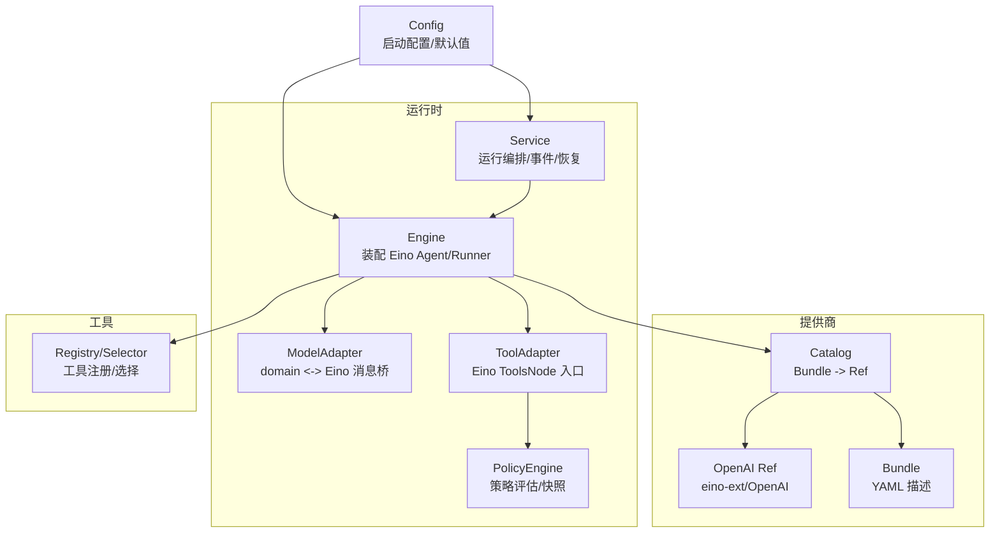
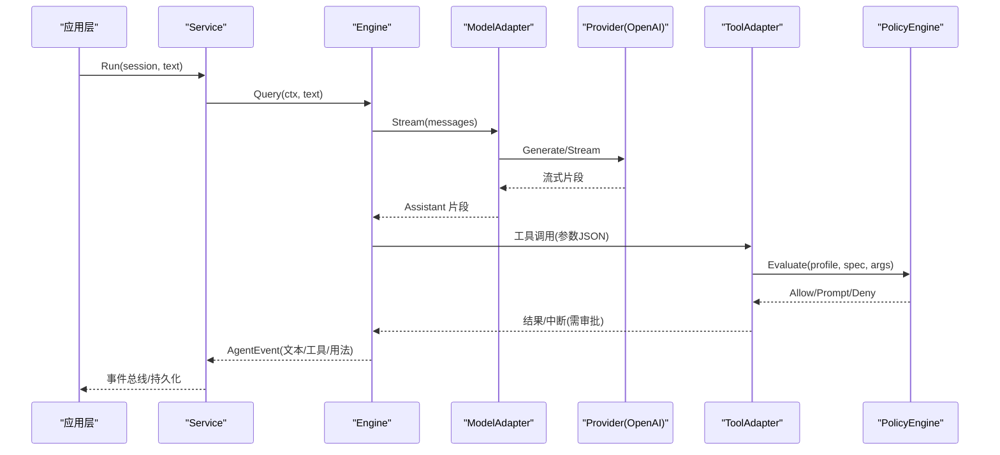
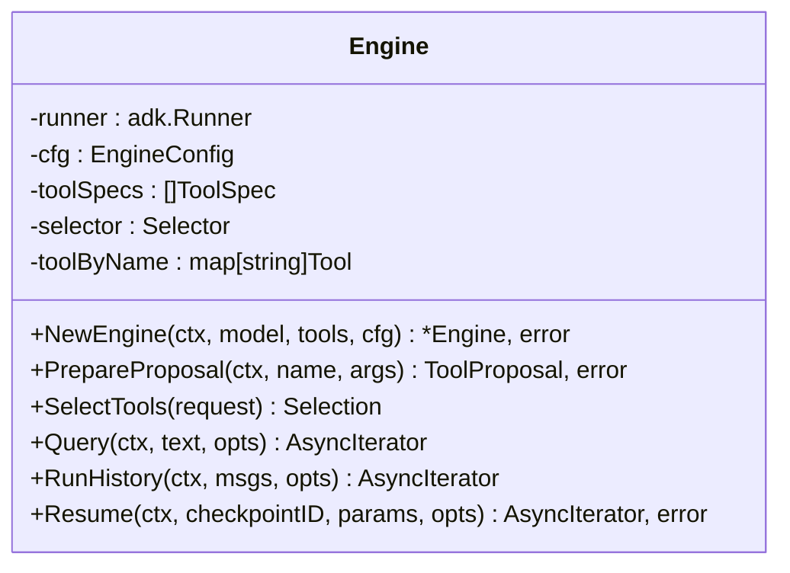
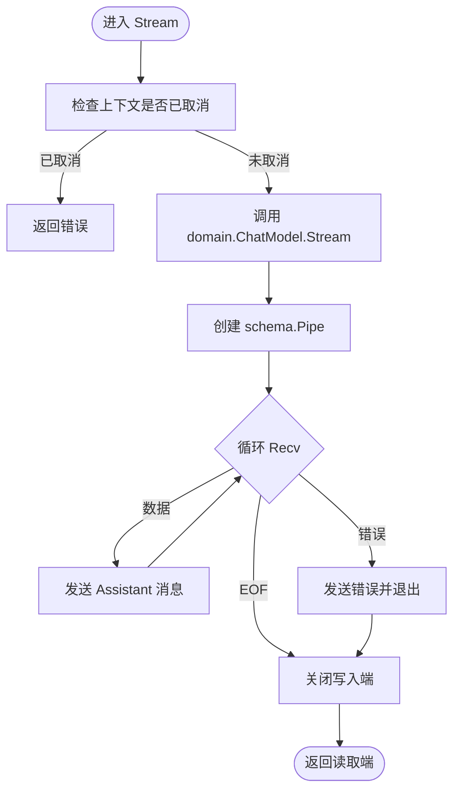
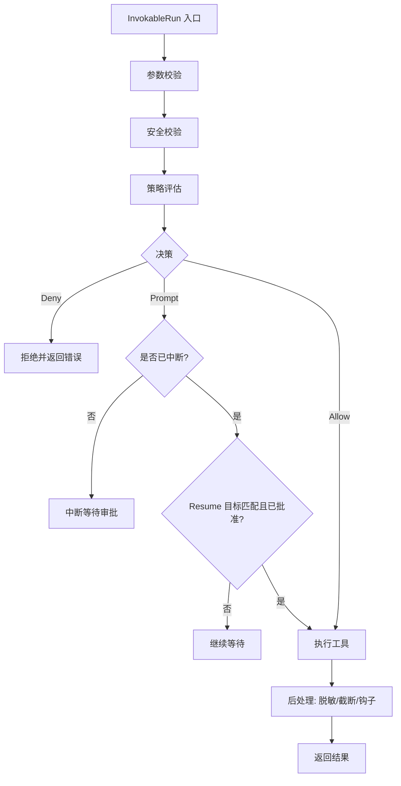
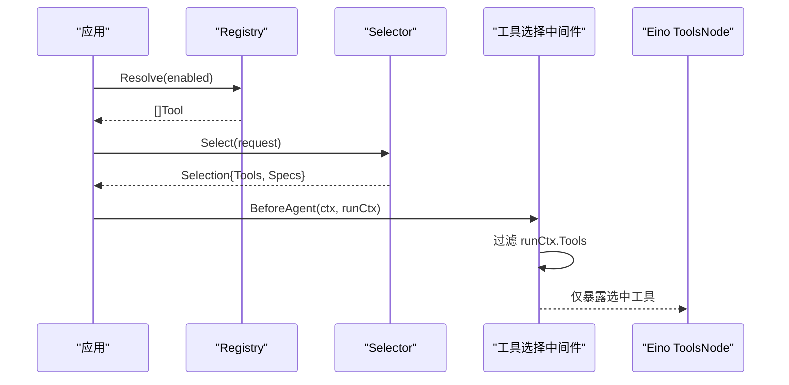
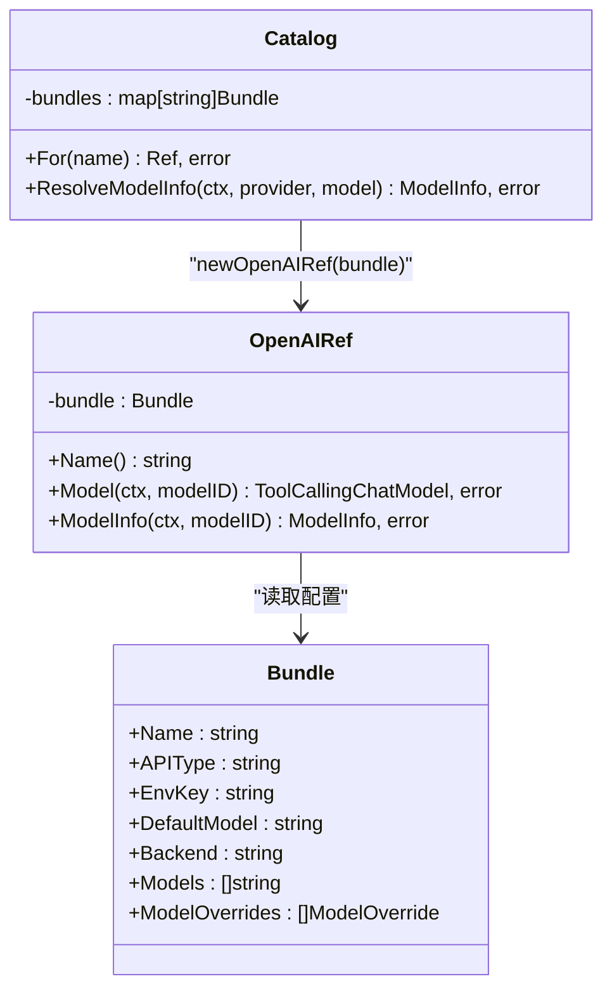
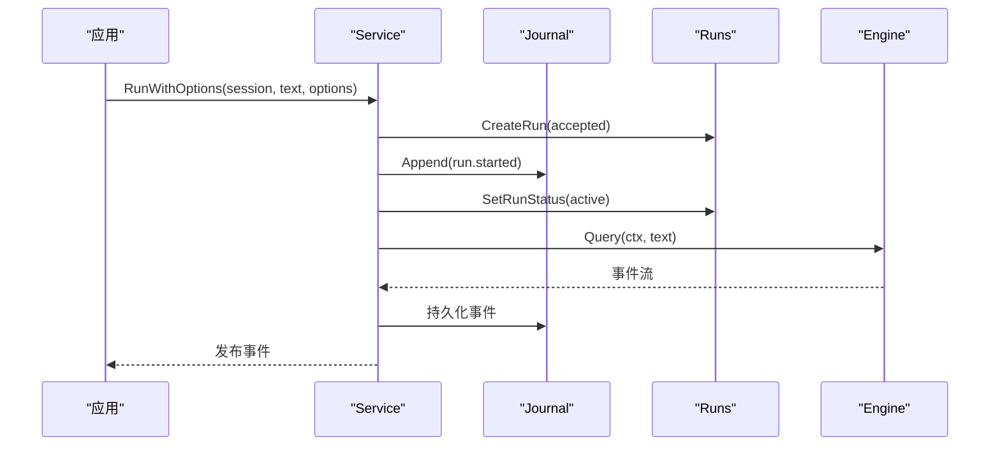
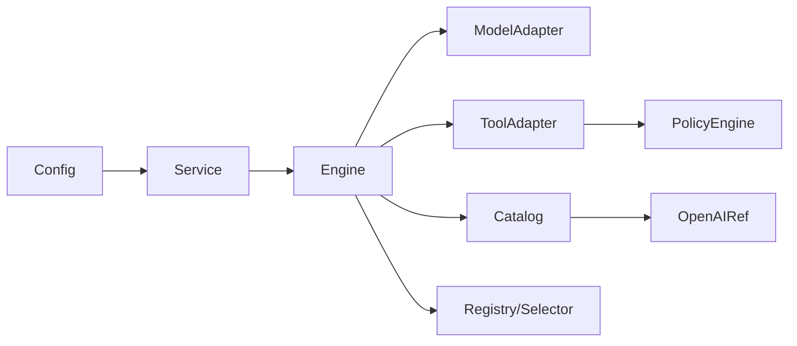

# 引擎适配器

<cite>
**本文引用的文件**
- [engine.go](file://internal/runtime/engine.go)
- [modeladapter.go](file://internal/runtime/modeladapter.go)
- [tooladapter.go](file://internal/runtime/tooladapter.go)
- [toolbroker.go](file://internal/runtime/toolbroker.go)
- [policy.go](file://internal/runtime/policy.go)
- [service.go](file://internal/runtime/service.go)
- [catalog.go](file://internal/provider/catalog.go)
- [openai.go](file://internal/provider/openai.go)
- [bundle.go](file://internal/provider/bundle.go)
- [tools.go](file://internal/tools/tools.go)
- [config.go](file://internal/config/config.go)
</cite>

## 目录
1. [简介](#简介)
2. [项目结构](#项目结构)
3. [核心组件](#核心组件)
4. [架构总览](#架构总览)
5. [详细组件分析](#详细组件分析)
6. [依赖关系分析](#依赖关系分析)
7. [性能与调优](#性能与调优)
8. [故障排查指南](#故障排查指南)
9. [结论](#结论)
10. [附录：扩展新模型提供商](#附录：扩展新模型提供商)

## 简介
本文件聚焦“引擎适配器”这一关键子系统，解释 Engine 如何桥接 Vivy 运行时与 Eino 框架，涵盖：
- 引擎配置、模型适配、工具适配器的注册与管理
- ModelAdapter 对多提供商 API 差异的统一封装（OpenAI、Anthropic）
- 流式响应处理、错误重试策略、上下文传递
- 与工具系统、策略引擎的集成方式
- 性能调优、监控指标与调试技巧

## 项目结构
围绕引擎适配器的代码主要分布在 internal/runtime、internal/provider、internal/tools 与 internal/config。Engine 是 Eino ChatModelAgent + Runner 的装配中心；ModelAdapter 在 domain 与 Eino 之间做消息转换；ToolAdapter 将 Vivy 工具接入 Eino ToolsNode 并执行审批/策略/钩子链；Provider 层负责按 Bundle 解析并构造具体模型实现；Config 提供启动期配置与默认值。

图表来源
- [engine.go:18-117](file://internal/runtime/engine.go#L18-L117)
- [modeladapter.go:14-89](file://internal/runtime/modeladapter.go#L14-L89)
- [tooladapter.go:18-163](file://internal/runtime/tooladapter.go#L18-L163)
- [policy.go:35-135](file://internal/runtime/policy.go#L35-L135)
- [service.go:149-299](file://internal/runtime/service.go#L149-L299)
- [catalog.go:10-59](file://internal/provider/catalog.go#L10-L59)
- [openai.go:14-98](file://internal/provider/openai.go#L14-L98)
- [bundle.go:28-150](file://internal/provider/bundle.go#L28-L150)
- [tools.go:17-181](file://internal/tools/tools.go#L17-L181)
- [config.go:51-314](file://internal/config/config.go#L51-L314)

章节来源
- [engine.go:18-117](file://internal/runtime/engine.go#L18-L117)
- [config.go:51-314](file://internal/config/config.go#L51-L314)

## 核心组件
- Engine：装配 Eino ChatModelAgent 与 Runner，注入工具集、策略、检查点与流式缓冲等配置；暴露 Query/RunHistory/Resume 等入口。
- ModelAdapter：将 domain.ChatModel 转换为 Eino 的 model.ToolCallingChatModel，统一消息角色与工具调用字段，屏蔽底层提供商差异。
- ToolAdapter：将 tools.Tool 暴露为 Eino InvokableTool，完成参数校验、策略评估、审批中断、结果压缩与审计脱敏。
- PolicyEngine：基于 Profile 与规则进行 Allow/Prompt/Deny 决策，生成不可变快照供审计与恢复使用。
- Provider Catalog/Ref：从 Bundle YAML 解析提供商元数据，按需构造 OpenAI 或未来 Anthropic 的模型实例。
- Service：编排 Run 生命周期，持久化事件、管理预算、恢复挂起任务、协调工作区与子进程权限。

章节来源
- [engine.go:48-117](file://internal/runtime/engine.go#L48-L117)
- [modeladapter.go:14-89](file://internal/runtime/modeladapter.go#L14-L89)
- [tooladapter.go:24-163](file://internal/runtime/tooladapter.go#L24-L163)
- [policy.go:35-135](file://internal/runtime/policy.go#L35-L135)
- [catalog.go:10-59](file://internal/provider/catalog.go#L10-L59)
- [openai.go:61-98](file://internal/provider/openai.go#L61-L98)
- [service.go:149-299](file://internal/runtime/service.go#L149-L299)

## 架构总览
Engine 通过 Eino 的 ADK 构建 ChatModelAgent，并将工具以 BaseTool 形式注入；ModelAdapter 在 domain 与 Eino 间做消息映射；ToolAdapter 在 Eno 工具节点处执行策略与审批；Provider 层根据 Bundle 动态创建模型；Service 负责运行编排、事件持久化与恢复。

图表来源
- [service.go:212-299](file://internal/runtime/service.go#L212-L299)
- [engine.go:144-165](file://internal/runtime/engine.go#L144-L165)
- [modeladapter.go:34-85](file://internal/runtime/modeladapter.go#L34-L85)
- [openai.go:61-98](file://internal/provider/openai.go#L61-L98)
- [tooladapter.go:78-163](file://internal/runtime/tooladapter.go#L78-L163)
- [policy.go:96-135](file://internal/runtime/policy.go#L96-L135)

## 详细组件分析

### Engine：Eino 装配与运行控制
- 装配 ChatModelAgent：名称、指令、模型、中间件（工具选择）、工具集合、最大迭代次数。
- 装配 Runner：启用流式、可选 CheckPointStore 用于中断/恢复。
- 工具注册：将 tools.Tool 包装为 EnhancedToolAdapter -> ToolAdapter，同时保留 Spec 列表用于提示词组装。
- 查询接口：Query/RunHistory/Resume 直接委托给 Eino Runner。

图表来源
- [engine.go:18-117](file://internal/runtime/engine.go#L18-L117)

章节来源
- [engine.go:18-117](file://internal/runtime/engine.go#L18-L117)

### ModelAdapter：跨域消息桥与流式转发
- 职责：将 domain.ChatModel.Stream 的结果转为 Eino schema.Message 流；Generate 聚合流为单条消息。
- 消息映射：role 映射（User/Tool/Assistant），工具调用字段（ToolCallID/Name/Arguments）。
- 流式管道：使用 schema.Pipe 建立内部通道，goroutine 驱动 Recv 并转发，支持取消传播。

图表来源
- [modeladapter.go:53-85](file://internal/runtime/modeladapter.go#L53-L85)

章节来源
- [modeladapter.go:14-120](file://internal/runtime/modeladapter.go#L14-L120)

### ToolAdapter：工具准入、策略与审批
- 参数校验与安全校验：确保 JSON 结构与类型符合 Spec，防止越界输入。
- 策略评估：调用 PolicyEngine.Evaluate，输出决策与原因，并记录治理事件。
- 审批门控：Prompt 决策时首次执行中断，等待 Resume 携带批准决定；Question 交互同理。
- 结果处理：添加不可信标记、敏感信息脱敏、按预算截断超长结果。

图表来源
- [tooladapter.go:78-183](file://internal/runtime/tooladapter.go#L78-L183)
- [policy.go:96-135](file://internal/runtime/policy.go#L96-L135)

章节来源
- [tooladapter.go:18-242](file://internal/runtime/tooladapter.go#L18-L242)
- [policy.go:35-135](file://internal/runtime/policy.go#L35-L135)

### 工具选择与注册
- 注册：Registry 维护工具名到实现的映射，禁止重复注册。
- 选择：Selector 基于请求关键词与工具 manifest 关键词打分，确定本次请求可见的工具集。
- 中间件：在 Eino Agent 边界过滤工具，避免向模型暴露未选中的工具。

图表来源
- [tools.go:223-361](file://internal/tools/tools.go#L223-L361)
- [toolselection_middleware.go:11-41](file://internal/runtime/toolselection_middleware.go#L11-L41)

章节来源
- [tools.go:17-181](file://internal/tools/tools.go#L17-L181)
- [toolselection_middleware.go:11-41](file://internal/runtime/toolselection_middleware.go#L11-L41)

### 提供商与模型信息
- Catalog：按名称解析 Bundle，返回 Ref；mock 始终可用。
- OpenAI Ref：从环境变量读取密钥，支持 BaseURL 覆盖，构造 eino-ext/OpenAI 模型；提供 ModelInfo（上下文窗口等）。
- Bundle：YAML 描述提供商能力、默认模型、后端类型、模型覆盖等，严格校验必填项与格式。

图表来源
- [catalog.go:10-59](file://internal/provider/catalog.go#L10-L59)
- [openai.go:14-98](file://internal/provider/openai.go#L14-L98)
- [bundle.go:28-150](file://internal/provider/bundle.go#L28-L150)

章节来源
- [catalog.go:10-59](file://internal/provider/catalog.go#L10-L59)
- [openai.go:14-98](file://internal/provider/openai.go#L14-L98)
- [bundle.go:28-150](file://internal/provider/bundle.go#L28-L150)

### 服务编排与恢复
- RunWithOptions：持久化用户消息、创建 Run、写入 run.started、激活 Run，并在分离上下文中驱动 Engine。
- 预算与快照：每个 Run 拥有独立 BudgetLedger 与 PolicySnapshot，贯穿恢复过程。
- 恢复：重启后扫描活跃 Run，若存在有效审批/问题且可读取检查点，则重建 pending 状态等待决策；否则失败关闭。

图表来源
- [service.go:212-299](file://internal/runtime/service.go#L212-L299)

章节来源
- [service.go:212-299](file://internal/runtime/service.go#L212-L299)

## 依赖关系分析
- 耦合度：Engine 强依赖 Eino（唯一允许导入 eino 的包之一），但通过 ModelAdapter/ToolAdapter 将领域模型与 Eino 类型隔离。
- 内聚性：ToolAdapter 集中了参数校验、策略评估、审批、结果处理，职责清晰；PolicyEngine 无副作用且可共享。
- 外部依赖：Provider 层依赖 eino-ext/OpenAI；Config 提供默认值与校验；Storage/Journal 由 Service 注入。
- 潜在循环：Service 与 Worker 通过 ChildApprovalRouter 解耦；Catalog 与 Ref 单向依赖。

图表来源
- [config.go:51-314](file://internal/config/config.go#L51-L314)
- [service.go:149-299](file://internal/runtime/service.go#L149-L299)
- [engine.go:48-117](file://internal/runtime/engine.go#L48-L117)
- [modeladapter.go:14-89](file://internal/runtime/modeladapter.go#L14-L89)
- [tooladapter.go:24-163](file://internal/runtime/tooladapter.go#L24-L163)
- [policy.go:35-135](file://internal/runtime/policy.go#L35-L135)
- [catalog.go:10-59](file://internal/provider/catalog.go#L10-L59)
- [openai.go:61-98](file://internal/provider/openai.go#L61-L98)
- [tools.go:223-361](file://internal/tools/tools.go#L223-L361)

章节来源
- [engine.go:48-117](file://internal/runtime/engine.go#L48-L117)
- [policy.go:35-135](file://internal/runtime/policy.go#L35-L135)
- [catalog.go:10-59](file://internal/provider/catalog.go#L10-L59)
- [tools.go:223-361](file://internal/tools/tools.go#L223-L361)

## 性能与调优
- 流式缓冲：EngineConfig.StreamBuffer 控制下游事件扇出通道大小，避免背压阻塞。
- 事件负载上限：MaxEventPayloadBytes 限制单个事件负载，防止内存膨胀。
- 工具调用轮次：MaxToolTurns 限制每轮生成的工具调用次数，防止无限循环。
- 上下文与历史：MaxContextBytes/MaxHistoryMessages 控制瞬时上下文与历史长度，降低模型成本。
- 工具结果裁剪：MaxToolResultBytes 配合 compactToolResult，保留首尾片段并插入标记，避免上下文溢出。
- 预算与重试：BudgetLedger 限制模型调用与工具调用总数；MaxRunRetries 控制显式重试配额。
- 工作区隔离：WorkspaceRoot 为后台运行提供隔离目录，避免主机路径泄露。
- HTTP/MCP 限制：HTTPAllowedHosts、MCPServers 白名单与认证变量，减少攻击面。

章节来源
- [engine.go:18-46](file://internal/runtime/engine.go#L18-L46)
- [tooladapter.go:186-242](file://internal/runtime/tooladapter.go#L186-L242)
- [config.go:110-153](file://internal/config/config.go#L110-L153)
- [config.go:256-314](file://internal/config/config.go#L256-L314)

## 故障排查指南
- 策略拒绝：当 PolicyEngine.Evaluate 返回 Deny 时，ToolAdapter 会返回 ErrPolicyDenied；检查 Profile、规则与参数字段匹配。
- 审批超时：SweepExpired 定时清理过期审批/问题；若恢复时发现不可读检查点，将失败关闭。
- 工具未选中：ToolAdapter 会检查 selectedToolSet，若不在当前请求选择中则拒绝调用。
- 参数非法：ValidateArgs/ValidateArgsSafety 失败会返回结构化 ArgError，便于定位字段与原因。
- 结果过大：compactToolResult 会在超出预算时裁剪并插入标记；调整 MaxToolResultBytes 或上游工具输出。
- 恢复失败：Recover 会尝试重建 pending；若缺少必要存储或检查点不可读，将失败关闭并记录原因。

章节来源
- [policy.go:96-135](file://internal/runtime/policy.go#L96-L135)
- [tooladapter.go:78-183](file://internal/runtime/tooladapter.go#L78-L183)
- [service.go:465-576](file://internal/runtime/service.go#L465-L576)
- [tools.go:41-84](file://internal/tools/tools.go#L41-L84)

## 结论
Engine 作为运行时与 Eino 的桥接点，通过 ModelAdapter 与 ToolAdapter 将领域模型与工具抽象统一到 Eino 契约，结合 PolicyEngine 与 Service 的生命周期管理，实现了可扩展、可恢复、可审计的 Agent 执行环境。Provider 层通过 Bundle 与 Ref 机制屏蔽不同模型的差异，使新增提供商具备最小侵入性。

## 附录：扩展新模型提供商
步骤概览：
1. 定义 Bundle：在 fixtures/provider 下新增 YAML，声明 name、api_type、env_key、default_model、backend、models 等必填字段，并确保 default_model 出现在 models 列表中。
2. 实现 Ref：在 internal/provider 新增 Ref 实现，实现 Name、Model、ModelInfo；Model 中从环境变量读取密钥并按需覆盖 BaseURL；ModelInfo 返回上下文窗口等元数据。
3. 注册 Catalog：在 Catalog.For 中为新 backend 分支返回新 Ref；若为 Vivy 自有后端（如 Anthropic），可在后续里程碑接入。
4. 配置启用：在 config.yaml 的 providers.active 指向新 bundle；确保 env_key 对应环境变量名，不写入明文密钥。
5. 验证：通过 Service.GetModelInfo 获取模型能力；通过 Engine.Query/RunHistory 发起调用，观察事件与日志。

参考路径
- [bundle.go:28-150](file://internal/provider/bundle.go#L28-L150)
- [catalog.go:10-59](file://internal/provider/catalog.go#L10-L59)
- [openai.go:14-98](file://internal/provider/openai.go#L14-L98)
- [config.go:91-108](file://internal/config/config.go#L91-L108)
- [config.go:256-314](file://internal/config/config.go#L256-L314)