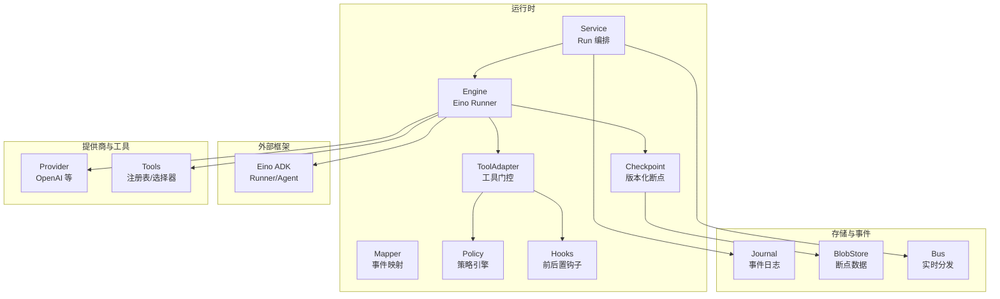
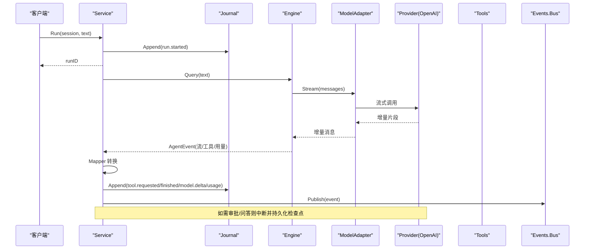
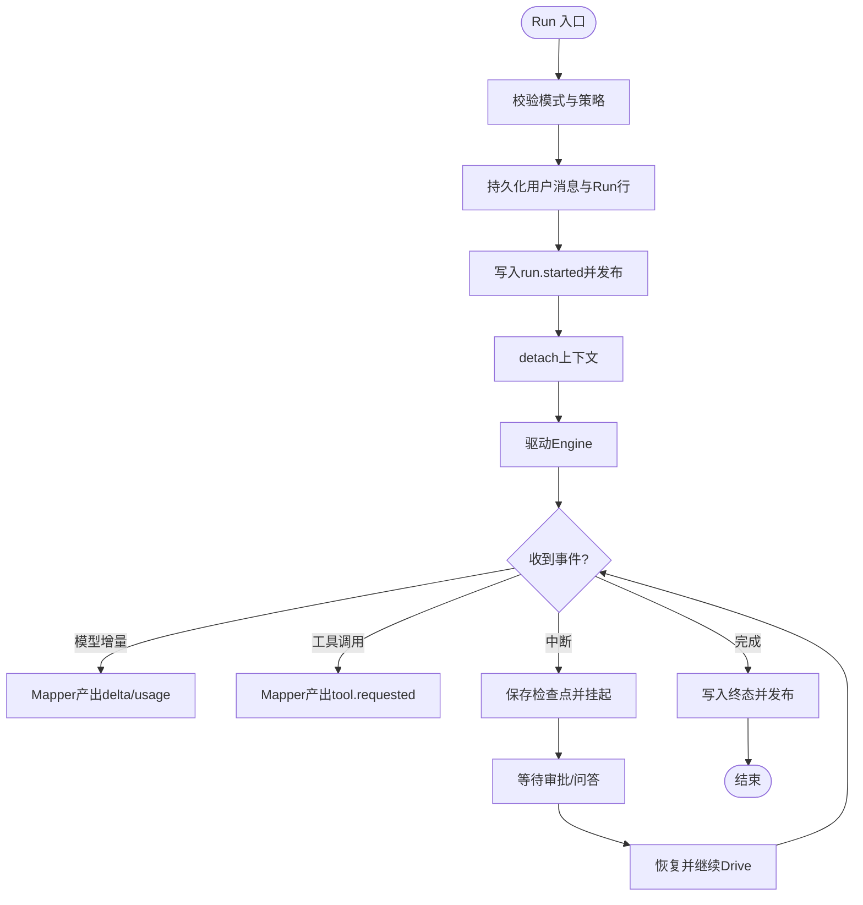
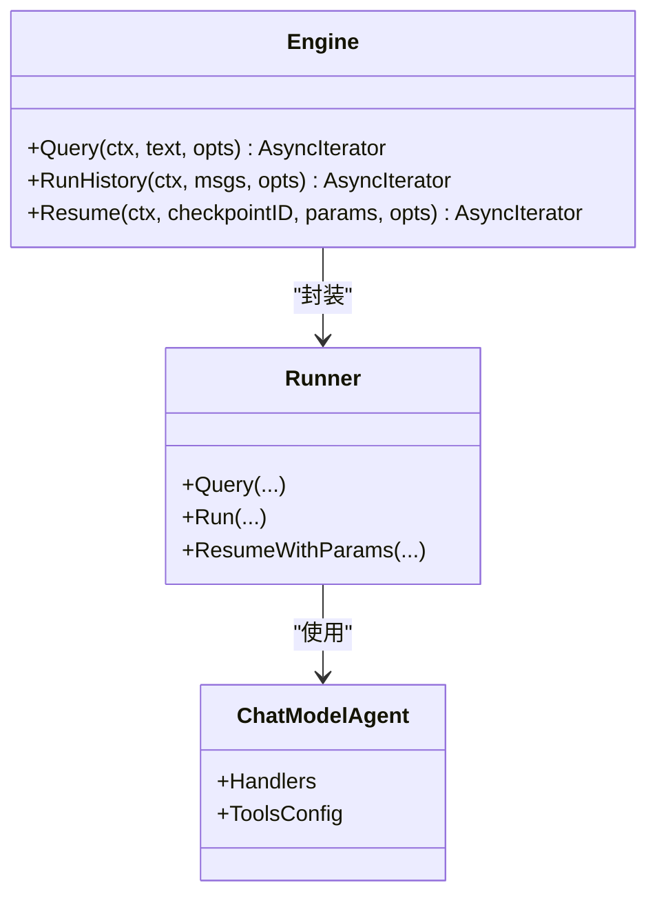
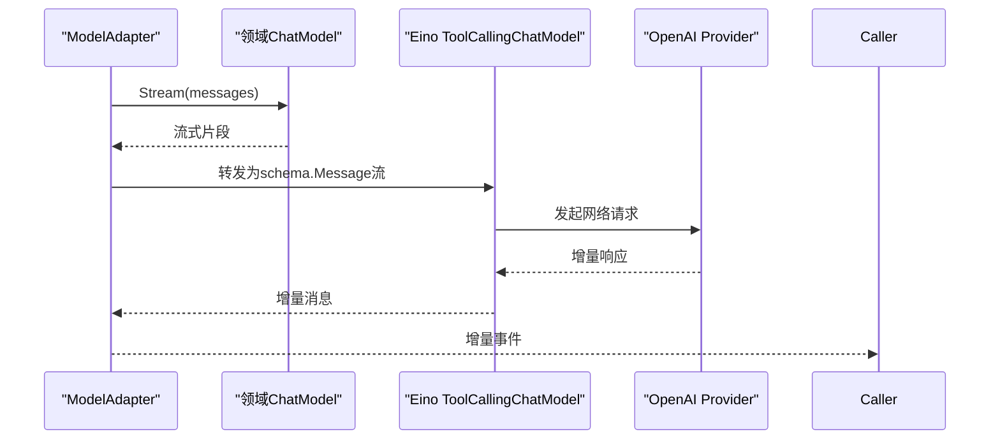
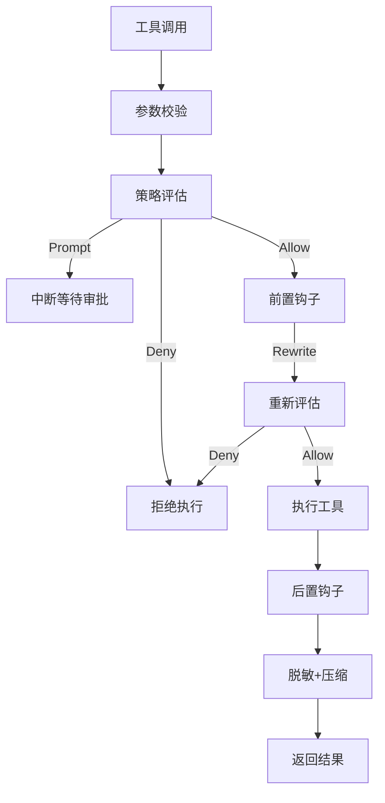
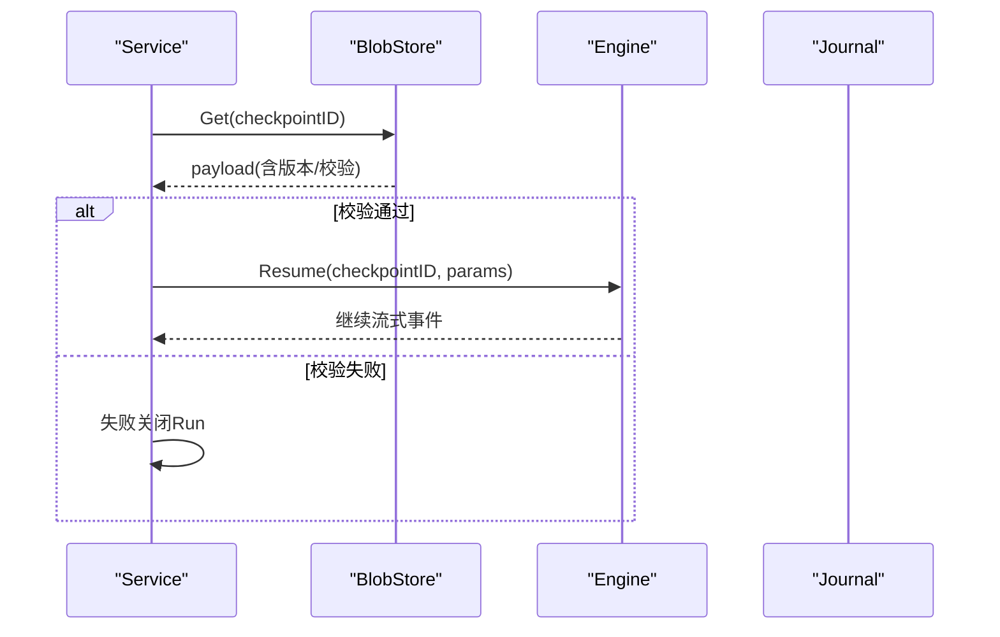
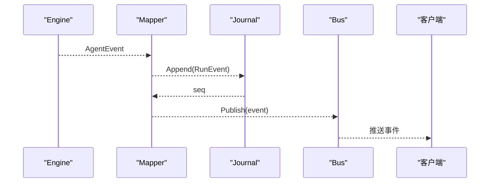
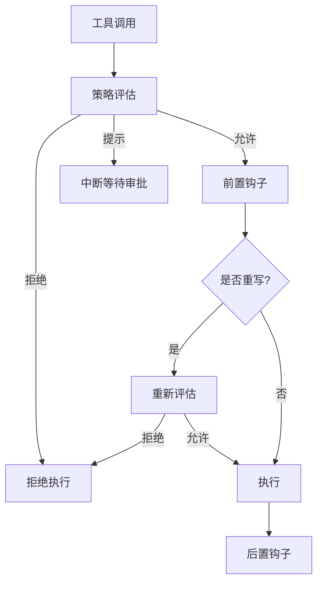
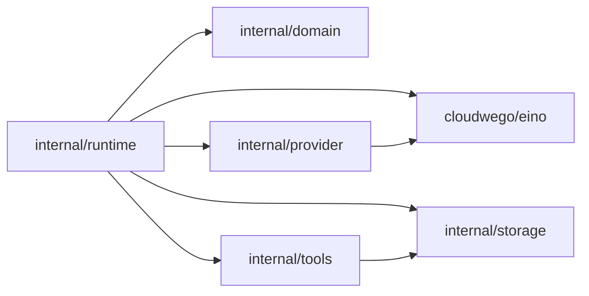

# 核心运行时

<cite>
**本文引用的文件**
- [service.go](file://internal/runtime/service.go)
- [engine.go](file://internal/runtime/engine.go)
- [checkpoint.go](file://internal/runtime/checkpoint.go)
- [modeladapter.go](file://internal/runtime/modeladapter.go)
- [tooladapter.go](file://internal/runtime/tooladapter.go)
- [toolbroker.go](file://internal/runtime/toolbroker.go)
- [mapper.go](file://internal/runtime/mapper.go)
- [policy.go](file://internal/runtime/policy.go)
- [hooks.go](file://internal/runtime/hooks.go)
- [bus.go](file://internal/events/bus.go)
- [openai.go](file://internal/provider/openai.go)
- [tools.go](file://internal/tools/tools.go)
- [contracts.go](file://internal/storage/contracts.go)
- [run.go](file://internal/domain/run.go)
</cite>

## 目录
1. [简介](#简介)
2. [项目结构](#项目结构)
3. [核心组件](#核心组件)
4. [架构总览](#架构总览)
5. [详细组件分析](#详细组件分析)
6. [依赖关系分析](#依赖关系分析)
7. [性能考量](#性能考量)
8. [故障排查指南](#故障排查指南)
9. [结论](#结论)
10. [附录](#附录)

## 简介
本文件聚焦 Vivy 核心运行时的实现与使用：Run 服务生命周期、Eino 引擎适配、模型调用封装、流式响应处理、检查点与恢复流程、工具系统与安全策略、事件总线与存储层集成。文档面向希望扩展运行时能力、接入新模型或工具的开发者，提供从高层架构到代码级路径的完整说明。

## 项目结构
Vivy 的核心运行时位于 internal/runtime，围绕 Service（编排）、Engine（Eino 装配）、Mapper（事件映射）、ToolAdapter（工具执行门控）、Policy/Hooks（治理）、Checkpoint（断点续跑）等模块组织；provider 负责将领域 ChatModel 桥接到 Eino 的 ToolCallingChatModel；events.Bus 提供持久化后的实时分发；storage 定义统一的持久化契约；domain 定义 Run 状态机与事件类型。

图表来源
- [service.go:96-169](file://internal/runtime/service.go#L96-L169)
- [engine.go:48-117](file://internal/runtime/engine.go#L48-L117)
- [mapper.go:40-72](file://internal/runtime/mapper.go#L40-L72)
- [tooladapter.go:24-43](file://internal/runtime/tooladapter.go#L24-L43)
- [policy.go:35-84](file://internal/runtime/policy.go#L35-L84)
- [hooks.go:46-56](file://internal/runtime/hooks.go#L46-L56)
- [checkpoint.go:40-62](file://internal/runtime/checkpoint.go#L40-L62)
- [contracts.go:55-85](file://internal/storage/contracts.go#L55-L85)
- [openai.go:14-23](file://internal/provider/openai.go#L14-L23)
- [tools.go:17-26](file://internal/tools/tools.go#L17-L26)

章节来源
- [service.go:96-169](file://internal/runtime/service.go#L96-L169)
- [engine.go:48-117](file://internal/runtime/engine.go#L48-L117)
- [contracts.go:55-85](file://internal/storage/contracts.go#L55-L85)

## 核心组件
- Service：Run 的生命周期编排者，负责消息与 Run 行写入、事件持久化、异步驱动 Engine、取消/恢复、工作区隔离、预算与策略快照、交互挂起（审批/问答）与过期清理。
- Engine：Eino 的 ChatModelAgent + Runner 装配中心，暴露 Query/RunHistory/Resume，并注入工具集、最大迭代次数、检查点适配器。
- Mapper：将 Eino 的 AgentEvent 转换为 Vivy 的 domain.RunEvent，处理流式增量、工具调用、用量、推理内容、中断与取消。
- ToolAdapter：对 tools.Tool 进行 Eino 包装，执行参数校验、策略评估、钩子链、审批/问答中断、结果脱敏与大小限制。
- Policy：不可变策略引擎，按 Profile 与规则决定 Allow/Deny/Prompt，并生成策略哈希用于审计。
- Hooks：Pre/Post 工具执行钩子链，支持重写参数、阻断执行、记录治理事件。
- Checkpoint：版本化断点存储，为 Eino Runner 提供可恢复的中断点，带引擎版本与校验和。
- Provider：将领域 ChatModel 桥接为 Eino 的 ToolCallingChatModel，OpenAI 实现按需读取密钥与环境覆盖。
- Tools：工具注册表、选择器、内置工具族（笔记、文件、技能、任务、搜索、HTTP、MCP、命令、顺序思考）。
- Storage：统一持久化契约（Journal/Blob/Session/Message/Run/Approval/Question 等），SQLite/Postgres 均实现该接口。
- Events.Bus：基于 runID 的实时事件总线，终端事件后关闭订阅，慢消费者通过 Journal 重放恢复。

章节来源
- [service.go:96-169](file://internal/runtime/service.go#L96-L169)
- [engine.go:48-117](file://internal/runtime/engine.go#L48-L117)
- [mapper.go:40-72](file://internal/runtime/mapper.go#L40-L72)
- [tooladapter.go:24-43](file://internal/runtime/tooladapter.go#L24-L43)
- [policy.go:35-84](file://internal/runtime/policy.go#L35-L84)
- [hooks.go:46-56](file://internal/runtime/hooks.go#L46-L56)
- [checkpoint.go:40-62](file://internal/runtime/checkpoint.go#L40-L62)
- [openai.go:14-23](file://internal/provider/openai.go#L14-L23)
- [tools.go:17-26](file://internal/tools/tools.go#L17-L26)
- [contracts.go:55-85](file://internal/storage/contracts.go#L55-L85)

## 架构总览
Run 服务在启动时装配 Engine、存储、事件总线与可选的工作区分配器。每次用户请求触发一次 Run：先持久化用户消息与 Run 行，再写入 run.started 事件，然后以独立上下文驱动 Engine。Engine 通过 ModelAdapter 调用底层模型，工具调用经 ToolAdapter 进入策略与钩子门控，必要时中断等待审批/问答。所有事件经 Mapper 转为 RunEvent 写入 Journal，再由 Bus 推送给订阅者。检查点由 VersionedCheckpointStore 包裹 Eino 原始字节，确保跨进程重启可恢复。

图表来源
- [service.go:212-300](file://internal/runtime/service.go#L212-L300)
- [engine.go:144-165](file://internal/runtime/engine.go#L144-L165)
- [modeladapter.go:34-85](file://internal/runtime/modeladapter.go#L34-L85)
- [openai.go:61-78](file://internal/provider/openai.go#L61-L78)
- [mapper.go:74-169](file://internal/runtime/mapper.go#L74-L169)
- [bus.go:42-75](file://internal/events/bus.go#L42-L75)

## 详细组件分析

### Run 服务与生命周期管理
- 启动与装配：NewService 接收 Engine、存储、事件 Sink、默认策略 Profile、工作区分配器等。
- 创建 Run：RunWithOptions 校验模式与策略，分配工作区，写入用户消息、Run 行、run.started 事件，激活 Run，并以无父 context 的 detached 上下文驱动 Engine，避免 RPC 断开导致中断。
- 取消与回收：Cancel/CancelAll 支持活跃 Run 与挂起于审批/问答的 Run；Recover/RecoverBackground 在启动时恢复非终态 Run，若存在有效审批且检查点可读则重建 pending，否则失败关闭。
- 交互挂起：当工具需要审批或问答时，Engine 中断，Service 持久化检查点并登记 pendingRun；后续 DecideApproval/AnswerQuestion 恢复执行。
- 超时清理：StartInteractionSweeper 定期扫描过期审批/问答，调用 SweepExpired 完成过渡。

图表来源
- [service.go:212-300](file://internal/runtime/service.go#L212-L300)
- [service.go:302-387](file://internal/runtime/service.go#L302-L387)
- [service.go:465-576](file://internal/runtime/service.go#L465-L576)
- [mapper.go:74-169](file://internal/runtime/mapper.go#L74-L169)

章节来源
- [service.go:96-169](file://internal/runtime/service.go#L96-L169)
- [service.go:212-300](file://internal/runtime/service.go#L212-L300)
- [service.go:302-387](file://internal/runtime/service.go#L302-L387)
- [service.go:465-576](file://internal/runtime/service.go#L465-L576)
- [run.go:5-30](file://internal/domain/run.go#L5-L30)

### Eino 引擎适配与流式响应
- Engine 装配：NewEngine 构建 ChatModelAgent 与 Runner，启用流式，注入工具集与最大迭代次数；可选 CheckPointStore 支持中断恢复。
- 查询与历史：Query 对应单轮用户消息；RunHistory 接受显式消息列表，便于会话回放。
- 恢复：ResumeWithParams 携带 checkpointID 与 resume 目标，将审批/问答决策回灌到被中断的工具。
- 流式处理：Mapper 遍历 MessageStream，累积文本、提取工具调用、用量与推理内容，产出 model.delta、model.completed、tool.requested/started/finished、model.usage、provider.retry/stall 等事件。

图表来源
- [engine.go:48-117](file://internal/runtime/engine.go#L48-L117)
- [engine.go:144-165](file://internal/runtime/engine.go#L144-L165)
- [mapper.go:104-169](file://internal/runtime/mapper.go#L104-L169)

章节来源
- [engine.go:48-117](file://internal/runtime/engine.go#L48-L117)
- [engine.go:144-165](file://internal/runtime/engine.go#L144-L165)
- [mapper.go:74-169](file://internal/runtime/mapper.go#L74-L169)

### 模型调用封装与提供商差异
- 模型桥接：WrapModel 将领域 ChatModel 适配为 Eino 的 ToolCallingChatModel，仅在此处跨越 D-007 边界；Generate 内部复用 Stream 聚合结果。
- OpenAI 提供商：按需从环境变量读取密钥，支持 APIBase 覆盖，返回 ToolCallingChatModel；提供已知模型的上下文窗口元信息。
- 安全与审计：密钥不缓存、不在配置中持久化；日志与事件负载需脱敏（由工具结果与策略/钩子保障）。

图表来源
- [modeladapter.go:14-85](file://internal/runtime/modeladapter.go#L14-L85)
- [openai.go:61-78](file://internal/provider/openai.go#L61-L78)

章节来源
- [modeladapter.go:14-85](file://internal/runtime/modeladapter.go#L14-L85)
- [openai.go:14-23](file://internal/provider/openai.go#L14-L23)
- [openai.go:61-78](file://internal/provider/openai.go#L61-L78)

### 工具系统与审批/问答门控
- 工具注册与选择：Registry 维护工具名到实现的映射；Selector 基于关键词与名称做确定性选择；Builtin* 系列提供可扩展的内置工具族。
- 执行门控：ToolAdapter 在执行前进行参数校验、策略评估、钩子重写与再评估；根据 Interaction 类型决定是否中断等待问答；根据策略是否中断等待审批。
- 子进程工具代理：ExecuteBrokerTool/ExecuteApprovedBrokerTool 作为父子进程边界，确保只有父进程能解析、策略检查、钩子、执行与脱敏结果。
- 结果压缩：工具结果头部标记“不受信”，并按预算截断，防止污染模型上下文。

图表来源
- [tooladapter.go:78-184](file://internal/runtime/tooladapter.go#L78-L184)
- [toolbroker.go:12-93](file://internal/runtime/toolbroker.go#L12-L93)
- [tools.go:122-181](file://internal/tools/tools.go#L122-L181)
- [tools.go:243-317](file://internal/tools/tools.go#L243-L317)

章节来源
- [tooladapter.go:78-184](file://internal/runtime/tooladapter.go#L78-L184)
- [toolbroker.go:12-93](file://internal/runtime/toolbroker.go#L12-L93)
- [tools.go:122-181](file://internal/tools/tools.go#L122-L181)
- [tools.go:243-317](file://internal/tools/tools.go#L243-L317)

### 检查点与恢复流程
- 版本化断点：VersionedCheckpointStore 将 Eino 原始字节包裹为信封（引擎版本、SHA256、时间戳），写入 BlobStore；读取时校验版本与校验和，失败即 fail-closed。
- 恢复逻辑：Recover 列出活动 Run，若存在有效审批/问答且检查点可读，则重建 pendingRun 并等待决策；否则失败关闭；子进程 Run 直接失败关闭以避免重复副作用。
- 恢复预算：从 Journal 重放事件重建 BudgetLedger，防止重启绕过预算熔断。

图表来源
- [checkpoint.go:64-97](file://internal/runtime/checkpoint.go#L64-L97)
- [service.go:494-576](file://internal/runtime/service.go#L494-L576)
- [engine.go:159-165](file://internal/runtime/engine.go#L159-L165)

章节来源
- [checkpoint.go:64-97](file://internal/runtime/checkpoint.go#L64-L97)
- [service.go:494-576](file://internal/runtime/service.go#L494-L576)

### 事件处理机制与总线
- 事件映射：Mapper 将 Eino 事件转换为 Vivy 的 RunEvent，包括 provider.retry/stall、model.delta/completed/usage/reasoning、tool.requested/started/finished 等。
- 持久化优先：Service 在发布到 Bus 之前先将事件写入 Journal，保证“可见性滞后于持久化”。
- 实时分发：Bus 按 runID 广播，终端事件后关闭订阅；慢消费者会被丢弃并通过 Journal 重放恢复。

图表来源
- [mapper.go:74-169](file://internal/runtime/mapper.go#L74-L169)
- [service.go:268-282](file://internal/runtime/service.go#L268-L282)
- [bus.go:42-75](file://internal/events/bus.go#L42-L75)

章节来源
- [mapper.go:74-169](file://internal/runtime/mapper.go#L74-L169)
- [service.go:268-282](file://internal/runtime/service.go#L268-L282)
- [bus.go:42-75](file://internal/events/bus.go#L42-L75)

### 策略与钩子
- 策略引擎：Profile 包含默认决策与规则集合；Evaluate 按规则匹配字段值（等于/前缀）并取最高优先级决策；Snapshot 生成策略哈希用于审计。
- 审批策略：EvaluateApprovalPolicy 根据 session 的审批策略（ask/never/auto）与白名单决定是否需要人工审批。
- 钩子链：PreToolUse 可阻断或重写参数，重写后必须再次评估策略；PostToolUse 失败不影响工具结果但会记录治理事件。

图表来源
- [policy.go:96-135](file://internal/runtime/policy.go#L96-L135)
- [policy.go:217-273](file://internal/runtime/policy.go#L217-L273)
- [hooks.go:58-103](file://internal/runtime/hooks.go#L58-L103)

章节来源
- [policy.go:96-135](file://internal/runtime/policy.go#L96-L135)
- [policy.go:217-273](file://internal/runtime/policy.go#L217-L273)
- [hooks.go:58-103](file://internal/runtime/hooks.go#L58-L103)

## 依赖关系分析
- 包边界：internal/runtime 与 internal/provider 是唯一允许依赖 eino 的包；其他包通过 domain 与 storage 契约解耦。
- 耦合度：Service 强依赖 Engine、Journal、Runs/Messages/Notes/Approvals/Questions、Budget、Workspaces、Hooks、Sink；Engine 依赖 Eino 组件与工具集；ToolAdapter 依赖 Policy 与 Hooks；Checkpoint 依赖 BlobStore。
- 外部依赖：Eino（ADK/Schema/Tool/Model）、OpenAI 兼容模型、存储后端（SQLite/Postgres）。

图表来源
- [engine.go:48-117](file://internal/runtime/engine.go#L48-L117)
- [openai.go:14-23](file://internal/provider/openai.go#L14-L23)
- [tools.go:17-26](file://internal/tools/tools.go#L17-L26)
- [contracts.go:55-85](file://internal/storage/contracts.go#L55-L85)

章节来源
- [engine.go:48-117](file://internal/runtime/engine.go#L48-L117)
- [openai.go:14-23](file://internal/provider/openai.go#L14-L23)
- [tools.go:17-26](file://internal/tools/tools.go#L17-L26)
- [contracts.go:55-85](file://internal/storage/contracts.go#L55-L85)

## 性能考量
- 流式缓冲：EngineConfig.StreamBuffer 控制下游事件扇出通道大小，避免背压阻塞。
- 事件载荷上限：MaxEventPayloadBytes 限制单个事件负载，Mapper 对 delta 与 reasoning 文本进行裁剪，防止过大事件影响传输与存储。
- 工具结果限制：MaxToolResultBytes 限制工具结果长度，ToolAdapter 对结果进行头尾保留与占位符压缩，避免污染模型上下文。
- 迭代上限：MaxToolTurns 限制每轮生成的循环次数，超过则分类为 run.failed 终端事件。
- 历史与上下文：MaxHistoryMessages 与 MaxContextBytes 控制会话上下文规模，降低模型输入成本。
- 提供者停顿检测：Mapper 对长时间无响应的流式段发出 provider.stall 事件，便于上层监控与降级。

[本节为通用指导，无需特定文件引用]

## 故障排查指南
- 常见错误
  - 策略拒绝：ErrPolicyDenied，检查策略 Profile 与规则、钩子重写后的再评估结果。
  - 计划模式拒绝：ErrPlanModeToolDenied，确认是否在 Plan Mode 下误用效果型工具。
  - 审批/问答过期：SweepExpired 会清理过期项，检查 ApprovalExpiration 与 Question 过期时间。
  - 检查点损坏/版本不匹配：ErrCheckpointCorrupted/ErrCheckpointEngineVersionMismatch，确认二进制 eino 版本一致。
  - 恢复忙碌：ErrRecoveryBusy，确保无活跃 Run 后再执行后台恢复。
- 调试技巧
  - 观察事件序列：通过 Bus 订阅或 Journal Replay 查看 run.started/tool.requested/finished/model.delta/usage/provider.* 的顺序。
  - 定位中断点：Mapper 的 extractInterrupt 会记录 ResumeTarget、ToolCallID、ToolName 与 Args，结合 Journal 定位中断位置。
  - 验证策略生效：关注 policy.evaluated 事件中的 Decision、Reason、Profile、PolicyHash。
  - 钩子诊断：关注 hook.started/hook.completed/hook.blocked 事件，确认超时或被阻断的原因。
  - 存储一致性：Journal.Append 在已有终态事件后拒绝追加（D-008），若出现 ErrRunClosed，检查是否有重复终态写入。

章节来源
- [mapper.go:267-307](file://internal/runtime/mapper.go#L267-L307)
- [policy.go:14-17](file://internal/runtime/policy.go#L14-L17)
- [tooladapter.go:18-20](file://internal/runtime/tooladapter.go#L18-L20)
- [checkpoint.go:17-27](file://internal/runtime/checkpoint.go#L17-L27)
- [service.go:56-68](file://internal/runtime/service.go#L56-L68)
- [contracts.go:11-31](file://internal/storage/contracts.go#L11-L31)

## 结论
Vivy 核心运行时以 Service 为中心，将 Eino 引擎、模型桥接、工具门控、策略与钩子、检查点与恢复、事件总线与存储层有机整合，形成高内聚、低耦合的可扩展运行时。通过严格的 D-007 包边界、D-008 唯一终态、D-010 密钥不持久化等红线，保证了安全性与可观测性。开发者可在不修改 Engine 的前提下通过工具注册、策略与钩子扩展运行时能力，并借助检查点与恢复机制实现可靠的长时运行。

[本节为总结，无需特定文件引用]

## 附录

### 如何扩展运行时功能
- 新增工具
  - 实现 tools.Tool 接口，提供 Spec 与 InvokableRun；在 Registry 中注册或通过 Builtin* 系列组合加入。
  - 如需审批/问答，设置 spec.Interaction 为相应类型；ToolAdapter 会自动中断并持久化检查点。
  - 参考路径：[tools.go:17-26](file://internal/tools/tools.go#L17-L26)、[tools.go:243-317](file://internal/tools/tools.go#L243-L317)
- 接入新模型提供商
  - 在 internal/provider 实现 Ref.Model，按需读取密钥与环境变量，返回 Eino 的 ToolCallingChatModel。
  - 参考路径：[openai.go:61-78](file://internal/provider/openai.go#L61-L78)
- 自定义策略与钩子
  - 通过 NewPolicyEngine 注入 Profile 与规则；在 ToolHookChain 中实现 Pre/Post 钩子，注意重写参数需重新评估策略。
  - 参考路径：[policy.go:47-84](file://internal/runtime/policy.go#L47-L84)、[hooks.go:58-103](file://internal/runtime/hooks.go#L58-L103)
- 集成存储层
  - 实现 storage.Engine 接口（Journal/Blob/Session/Message/Run/Approval/Question 等），替换 SQLite/Postgres 后端。
  - 参考路径：[contracts.go:252-273](file://internal/storage/contracts.go#L252-L273)

章节来源
- [tools.go:17-26](file://internal/tools/tools.go#L17-L26)
- [tools.go:243-317](file://internal/tools/tools.go#L243-L317)
- [openai.go:61-78](file://internal/provider/openai.go#L61-L78)
- [policy.go:47-84](file://internal/runtime/policy.go#L47-L84)
- [hooks.go:58-103](file://internal/runtime/hooks.go#L58-L103)
- [contracts.go:252-273](file://internal/storage/contracts.go#L252-L273)