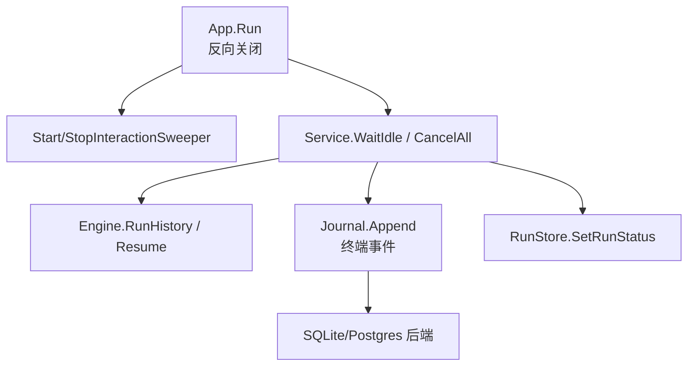
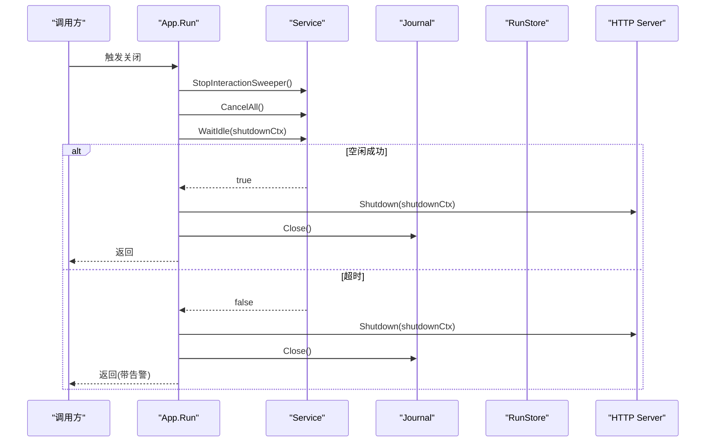
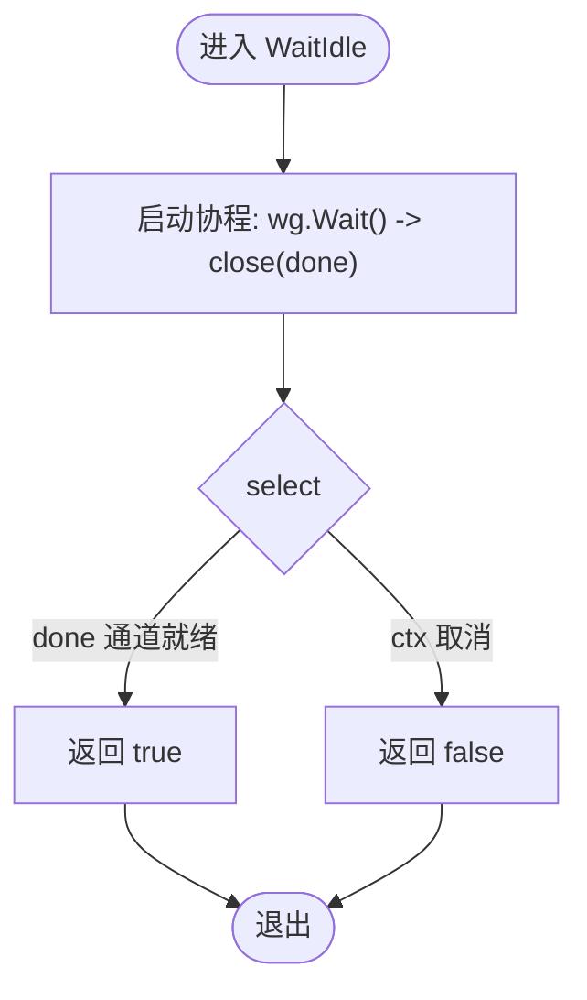
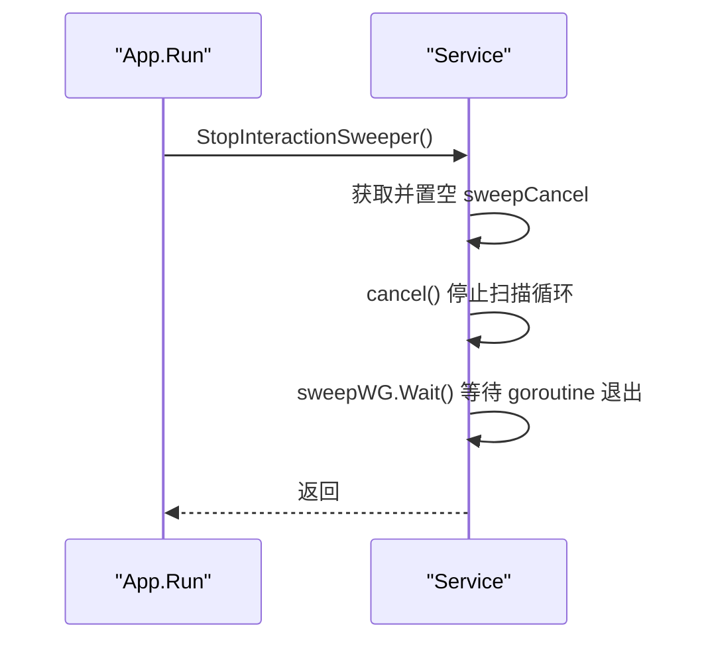
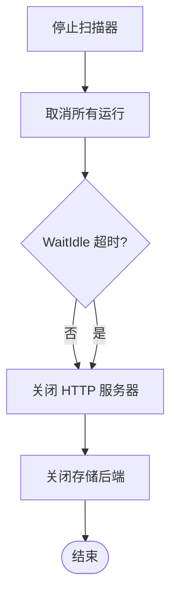
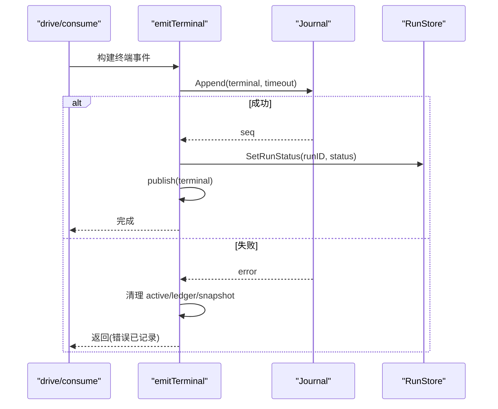
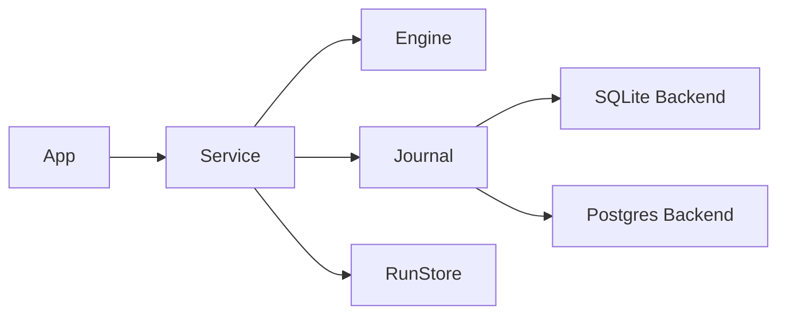

# 优雅关闭

<cite>
**本文引用的文件**
- [internal/runtimeservice.go](file://internal/runtime/service.go)
- [internal/app/app.go](file://internal/app/app.go)
- [internal/storage/contracts.go](file://internal/storage/contracts.go)
- [internal/storage/sqlite/sqlite.go](file://internal/storage/sqlite/sqlite.go)
- [internal/storage/postgres/journal.go](file://internal/storage/postgres/journal.go)
- [internal/storage/sqlite/journal.go](file://internal/storage/sqlite/journal.go)
- [internal/storage/conformance/suite.go](file://internal/storage/conformance/suite.go)
- [internal/runtime/engine.go](file://internal/runtime/engine.go)
- [internal/runtime/shutdown_test.go](file://internal/runtime/shutdown_test.go)
</cite>

## 目录
1. [简介](#简介)
2. [项目结构](#项目结构)
3. [核心组件](#核心组件)
4. [架构总览](#架构总览)
5. [详细组件分析](#详细组件分析)
6. [依赖关系分析](#依赖关系分析)
7. [性能与超时](#性能与超时)
8. [故障排查指南](#故障排查指南)
9. [结论](#结论)
10. [附录：关闭流程示例](#附录关闭流程示例)

## 简介
本文件聚焦于 Vivy 运行时的“优雅关闭”机制，围绕以下目标展开：
- 解释 WaitIdle 的实现原理：基于 WaitGroup 的 goroutine 等待与上下文超时的组合。
- 说明 StopInteractionSweeper 的清理逻辑：停止定时任务、释放资源并保证在存储层关闭前完成。
- 阐述关闭顺序的重要性：确保所有运行在存储层关闭前完成持久化，满足 E4 约束（终端事件必须在 journal 仍打开时持久化）。
- 给出正确的关闭流程代码级示例，并与服务生命周期集成。
- 覆盖超时处理、错误恢复与监控指标收集建议。

## 项目结构
与优雅关闭直接相关的代码分布在应用装配层与运行时服务层：
- 应用装配层负责启动顺序与反向关闭顺序，包含 HTTP 服务器、子工作进程、交互过期扫描器、运行时服务与存储后端。
- 运行时服务负责驱动 run 的生命周期、挂起/恢复、终止事件持久化以及 goroutine 集合管理。
- 存储层提供 Journal 等接口，并在写入终端事件后拒绝后续写入，保障“每个 run 恰好一个终态事件”。

图表来源
- [internal/app/app.go:473-519](file://internal/app/app.go#L473-L519)
- [internal/runtime/service.go:375-431](file://internal/runtime/service.go#L375-L431)
- [internal/runtime/service.go:1814-1851](file://internal/runtime/service.go#L1814-L1851)
- [internal/storage/sqlite/sqlite.go:87-88](file://internal/storage/sqlite/sqlite.go#L87-L88)

章节来源
- [internal/app/app.go:473-519](file://internal/app/app.go#L473-L519)
- [internal/runtime/service.go:375-431](file://internal/runtime/service.go#L375-L431)
- [internal/storage/sqlite/sqlite.go:87-88](file://internal/storage/sqlite/sqlite.go#L87-L88)

## 核心组件
- Service.WaitIdle：阻塞直到所有 drive/resume goroutine 退出或上下文超时，用于在存储关闭前“排空”运行。
- Service.StopInteractionSweeper：取消并等待交互过期扫描 goroutine，避免在存储关闭后继续访问存储。
- Service.CancelAll：取消所有活跃 run 与待决挂起的 run，触发 run.cancelled 终端事件持久化。
- Service.emitTerminal：以独立超时窗口持久化终端事件，更新 run 状态并发布事件，确保 AS-5/FR-8。
- App.Run：按反向启动顺序关闭：先停止扫描器，再取消运行并等待空闲，最后关闭 HTTP 与存储。

章节来源
- [internal/runtime/service.go:375-431](file://internal/runtime/service.go#L375-L431)
- [internal/runtime/service.go:1814-1851](file://internal/runtime/service.go#L1814-L1851)
- [internal/app/app.go:473-519](file://internal/app/app.go#L473-L519)

## 架构总览
优雅关闭的关键在于“先停外部服务，再停内部工作，最后关存储”，并通过 WaitIdle 保证所有 run 的终端事件在存储关闭前完成持久化。

图表来源
- [internal/app/app.go:473-519](file://internal/app/app.go#L473-L519)
- [internal/runtime/service.go:375-431](file://internal/runtime/service.go#L375-L431)

章节来源
- [internal/app/app.go:473-519](file://internal/app/app.go#L473-L519)
- [internal/runtime/service.go:375-431](file://internal/runtime/service.go#L375-L431)

## 详细组件分析

### WaitIdle：WaitGroup 与 goroutine 等待
- 实现要点
  - 使用 sync.WaitGroup 跟踪所有 drive/resume goroutine；每次启动新 run 时 Add(1)，goroutine 结束时 Done()。
  - WaitIdle 在新协程中调用 wg.Wait()，通过 channel 通知完成；同时监听 ctx.Done() 支持超时。
  - 返回值表示是否在所有 goroutine 退出前完成；若超时则返回 false，上层应记录告警但仍继续关闭。
- 与 E4 的关系
  - 在 CancelAll 之后调用 WaitIdle，确保所有 run 的 run.cancelled 终端事件在存储关闭前被持久化。
  - 即使超时，也仅意味着部分 run 未能在限定时间内完成，但已尽力尝试；存储关闭会阻止新的持久化，因此必须优先保证尽可能多的终端事件落盘。

图表来源
- [internal/runtime/service.go:375-387](file://internal/runtime/service.go#L375-L387)

章节来源
- [internal/runtime/service.go:375-387](file://internal/runtime/service.go#L375-L387)
- [internal/runtime/shutdown_test.go:15-37](file://internal/runtime/shutdown_test.go#L15-L37)
- [internal/runtime/shutdown_test.go:39-71](file://internal/runtime/shutdown_test.go#L39-L71)

### StopInteractionSweeper：清理定时任务与资源
- 职责
  - 停止交互过期扫描器（审批/问题超时），防止在存储关闭后继续访问存储。
  - 通过 context.WithCancel 控制扫描循环，调用 cancel() 后等待 sweepWG 完成。
- 清理顺序
  - 在 App.Run 的关闭流程中，最先调用 StopInteractionSweeper，确保不再产生新的存储访问。
  - 随后 CancelAll 与 WaitIdle 确保所有运行中的 run 完成终端事件持久化。
- 资源释放
  - 定时器 ticker 在 goroutine 内 defer Stop()，避免资源泄漏。
  - 扫描失败仅记录警告，不阻断关闭流程。

图表来源
- [internal/runtime/service.go:389-431](file://internal/runtime/service.go#L389-L431)
- [internal/app/app.go:473-519](file://internal/app/app.go#L473-L519)

章节来源
- [internal/runtime/service.go:389-431](file://internal/runtime/service.go#L389-L431)
- [internal/app/app.go:473-519](file://internal/app/app.go#L473-L519)

### 关闭顺序与 E4 约束：终端事件必须在 journal 仍打开时持久化
- 关闭顺序
  - 停止交互扫描器（StopInteractionSweeper）
  - 取消所有运行（CancelAll）
  - 等待空闲（WaitIdle）
  - 关闭 HTTP 服务器（Shutdown）
  - 关闭存储后端（Close）
- E4 约束
  - 在存储关闭前，所有 run 的终端事件必须持久化到 journal。
  - emitTerminal 使用独立超时（terminalPersistTimeout）进行持久化，确保用户取消自身上下文不会导致 run 无终态。
  - Journal.Append 在已有终端事件后返回 ErrRunClosed，保证“每个 run 恰好一个终态事件”。

图表来源
- [internal/app/app.go:473-519](file://internal/app/app.go#L473-L519)
- [internal/runtime/service.go:1814-1851](file://internal/runtime/service.go#L1814-L1851)
- [internal/storage/contracts.go:16-18](file://internal/storage/contracts.go#L16-L18)

章节来源
- [internal/app/app.go:473-519](file://internal/app/app.go#L473-L519)
- [internal/runtime/service.go:1814-1851](file://internal/runtime/service.go#L1814-L1851)
- [internal/storage/contracts.go:16-18](file://internal/storage/contracts.go#L16-L18)

### 终端事件持久化：emitTerminal 与错误恢复
- 持久化策略
  - 使用独立上下文与超时（terminalPersistTimeout）执行 Journal.Append，避免受 run 上下文取消影响。
  - 成功后更新 run 状态并发布事件；失败时记录错误并清理内存状态。
- 错误恢复
  - 并发关闭场景下，可能已有其他 goroutine 先写入终端事件；此时返回 ErrRunClosed，视为幂等成功。
  - 存储不可用或异常时，记录错误并清理内存引用，避免悬挂状态。

图表来源
- [internal/runtime/service.go:1814-1851](file://internal/runtime/service.go#L1814-L1851)

章节来源
- [internal/runtime/service.go:1814-1851](file://internal/runtime/service.go#L1814-L1851)

### 存储层约束：ErrRunClosed 与一致性
- 约束定义
  - Journal.Append 在 run 已有终端事件后返回 ErrRunClosed，确保“每个 run 恰好一个终态事件”。
- 测试验证
  - 一致性套件验证重复写入终端事件的行为，确保后端实现符合契约。

章节来源
- [internal/storage/contracts.go:16-18](file://internal/storage/contracts.go#L16-L18)
- [internal/storage/conformance/suite.go:203-228](file://internal/storage/conformance/suite.go#L203-L228)

## 依赖关系分析
- App 依赖 Service 与 Storage Engine，负责组装与生命周期管理。
- Service 依赖 Engine、Journal、RunStore、MessageStore、ApprovalStore、QuestionStore 等，负责运行期协调。
- Storage 后端（SQLite/Postgres）实现 Journal 接口，提供事务性与一致性保障。

图表来源
- [internal/app/app.go:473-519](file://internal/app/app.go#L473-L519)
- [internal/runtime/service.go:102-130](file://internal/runtime/service.go#L102-L130)
- [internal/storage/sqlite/sqlite.go:64-79](file://internal/storage/sqlite/sqlite.go#L64-L79)

章节来源
- [internal/app/app.go:473-519](file://internal/app/app.go#L473-L519)
- [internal/runtime/service.go:102-130](file://internal/runtime/service.go#L102-L130)
- [internal/storage/sqlite/sqlite.go:64-79](file://internal/storage/sqlite/sqlite.go#L64-L79)

## 性能与超时
- 超时设计
  - shutdownGrace：整体优雅关闭时间上限，适配 Windows CTRL_CLOSE 窗口。
  - terminalPersistTimeout：终端事件持久化的独立超时，确保即使 run 上下文取消也能完成持久化。
  - WaitIdle 超时：当 drain 未完成时记录告警，但仍继续关闭流程以避免无限等待。
- 性能考虑
  - WaitIdle 使用 WaitGroup 避免忙轮询，降低 CPU 占用。
  - 扫描器使用 time.Ticker 与 context 控制，避免资源泄漏。
  - 终端事件持久化使用独立上下文，避免受请求上下文取消影响。

章节来源
- [internal/app/app.go:41-45](file://internal/app/app.go#L41-L45)
- [internal/runtime/service.go:24-27](file://internal/runtime/service.go#L24-L27)
- [internal/runtime/service.go:375-387](file://internal/runtime/service.go#L375-L387)

## 故障排查指南
- 常见问题
  - 关闭超时：检查是否有长时间运行的工具调用或网络请求；确认 CancelAll 是否正确触发。
  - 终端事件未持久化：检查 Journal.Append 是否返回 ErrRunClosed 或其他错误；确认存储后端是否正常。
  - 扫描器未停止：确认 StopInteractionSweeper 是否在关闭流程中调用；检查 sweepCancel 是否正确设置。
- 调试建议
  - 增加日志级别，关注“shutdown drain timed out”、“journal append of terminal event failed”等关键日志。
  - 使用测试用例模拟阻塞工具调用，验证 WaitIdle 行为是否符合预期。

章节来源
- [internal/app/app.go:509-511](file://internal/app/app.go#L509-L511)
- [internal/runtime/service.go:1814-1851](file://internal/runtime/service.go#L1814-L1851)
- [internal/runtime/shutdown_test.go:15-71](file://internal/runtime/shutdown_test.go#L15-L71)

## 结论
Vivy 的优雅关闭机制通过严格的关闭顺序、WaitGroup 驱动的 goroutine 等待、独立的持久化超时与存储层的一致性约束，确保了在进程退出前所有运行都能安全地持久化终端事件。该设计满足了 E4 约束，避免了数据不一致与悬挂状态，为高可用与可恢复性提供了坚实基础。

## 附录：关闭流程示例
以下为正确的关闭流程代码级示例（路径引用）：
- 应用层关闭入口：[internal/app/app.go:473-519](file://internal/app/app.go#L473-L519)
- 运行时服务等待空闲：[internal/runtime/service.go:375-387](file://internal/runtime/service.go#L375-L387)
- 运行时服务停止扫描器：[internal/runtime/service.go:389-431](file://internal/runtime/service.go#L389-L431)
- 终端事件持久化：[internal/runtime/service.go:1814-1851](file://internal/runtime/service.go#L1814-L1851)
- 存储层关闭：[internal/storage/sqlite/sqlite.go:87-88](file://internal/storage/sqlite/sqlite.go#L87-L88)

章节来源
- [internal/app/app.go:473-519](file://internal/app/app.go#L473-L519)
- [internal/runtime/service.go:375-431](file://internal/runtime/service.go#L375-L431)
- [internal/runtime/service.go:1814-1851](file://internal/runtime/service.go#L1814-L1851)
- [internal/storage/sqlite/sqlite.go:87-88](file://internal/storage/sqlite/sqlite.go#L87-L88)