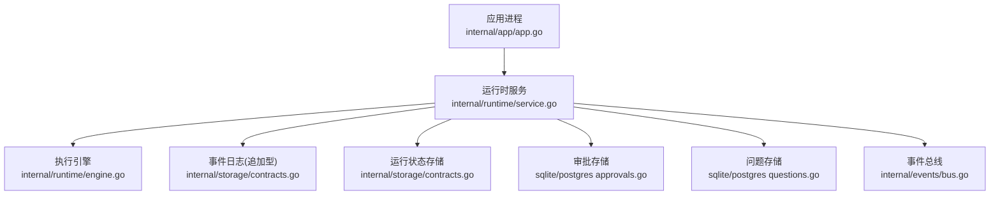
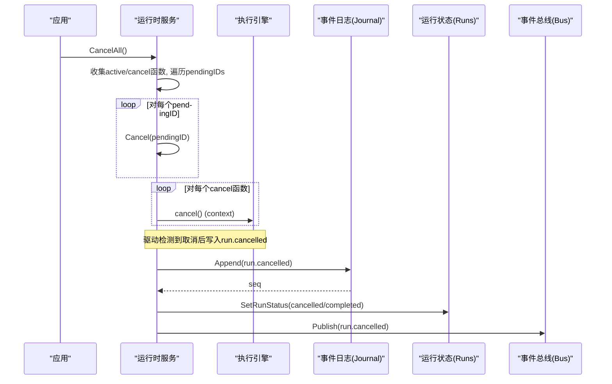
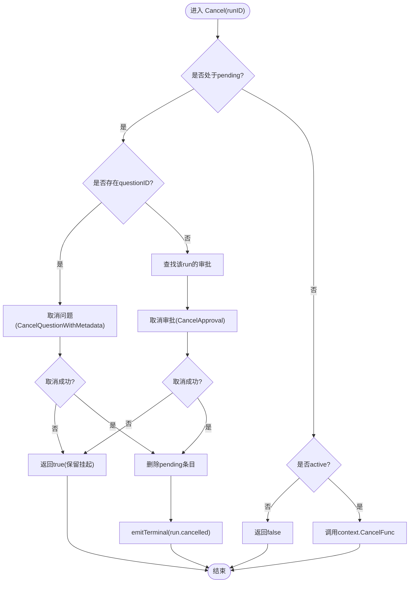
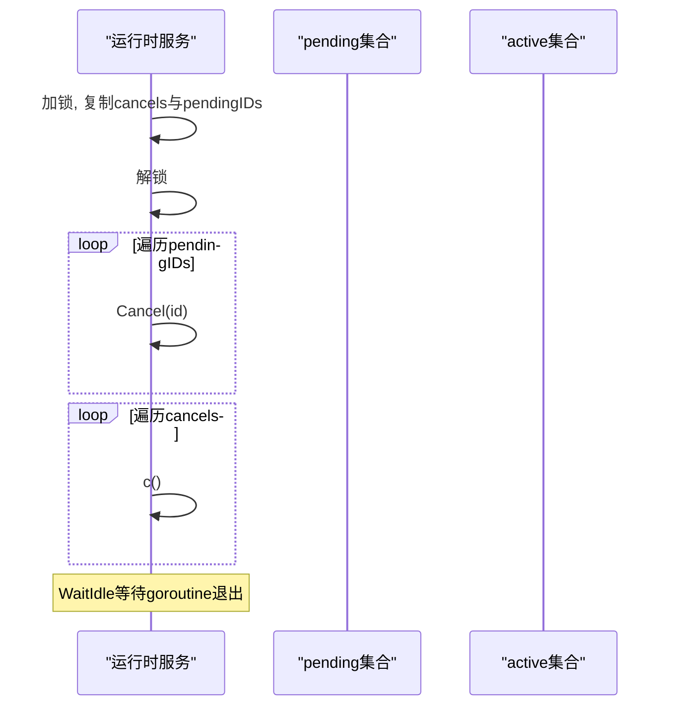
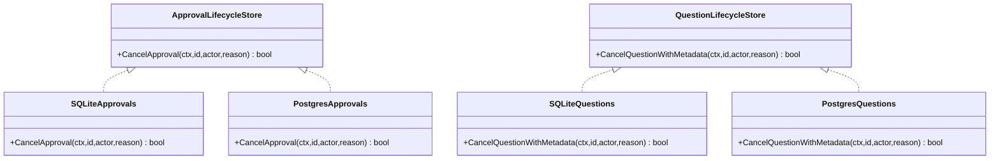
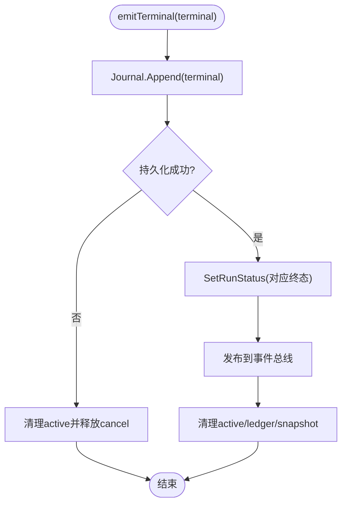
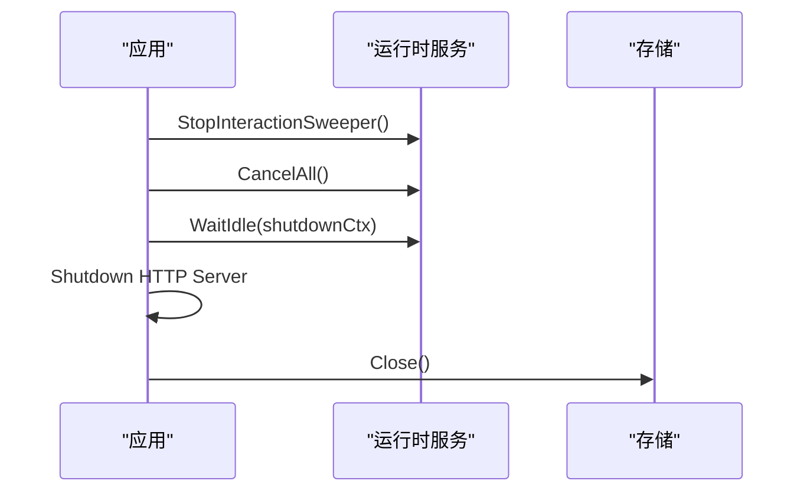
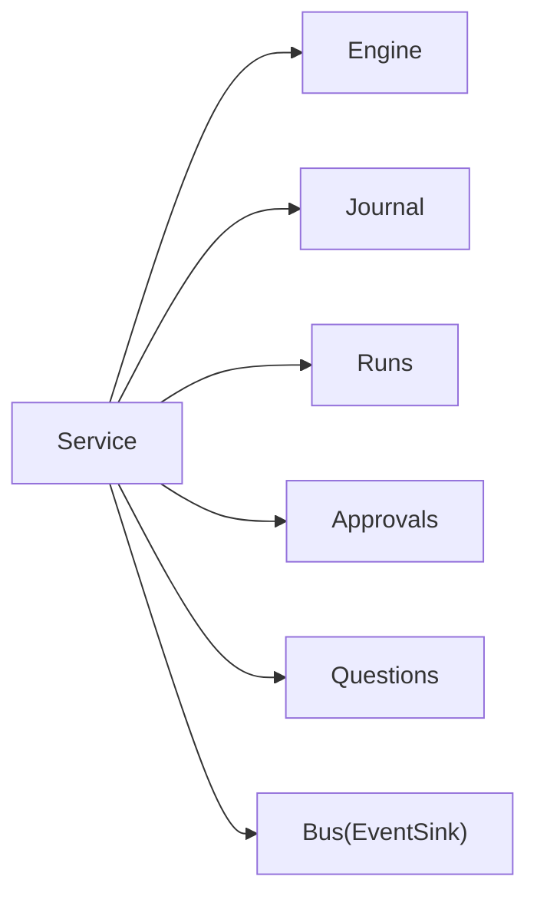

# 取消机制

<cite>
**本文引用的文件**
- [internal/runtime/service.go](file://internal/runtime/service.go)
- [internal/runtime/engine.go](file://internal/runtime/engine.go)
- [internal/app/app.go](file://internal/app/app.go)
- [internal/events/bus.go](file://internal/events/bus.go)
- [internal/storage/contracts.go](file://internal/storage/contracts.go)
- [internal/storage/sqlite/questions.go](file://internal/storage/sqlite/questions.go)
- [internal/storage/postgres/questions.go](file://internal/storage/postgres/questions.go)
- [internal/storage/sqlite/approvals.go](file://internal/storage/sqlite/approvals.go)
- [internal/storage/postgres/approvals.go](file://internal/storage/postgres/approvals.go)
- [schemas/events/payloads/run.cancelled.json](file://schemas/events/payloads/run.cancelled.json)
</cite>

## 目录
1. [简介](#简介)
2. [项目结构](#项目结构)
3. [核心组件](#核心组件)
4. [架构总览](#架构总览)
5. [详细组件分析](#详细组件分析)
6. [依赖关系分析](#依赖关系分析)
7. [性能与并发特性](#性能与并发特性)
8. [故障排查指南](#故障排查指南)
9. [结论](#结论)
10. [附录：调用示例与集成说明](#附录调用示例与集成说明)

## 简介
本文件系统性阐述 Vivy 运行时的“取消机制”，覆盖以下关键点：
- Cancel 方法如何定位活动运行、处理挂起运行（审批/问题），并持久化 run.cancelled 终态事件。
- CancelAll 的批量取消流程，包括遍历待处理集合与清理挂起运行的策略。
- context.CancelFunc 的使用方式与 goroutine 生命周期管理，确保在关闭存储前完成终端事件落盘。
- 取消对存储层的影响：审批取消、问题取消、运行状态更新。
- 与事件总线（events.Bus）和存储层的集成方式，以及并发安全、资源清理与错误处理策略。

## 项目结构
取消机制涉及运行时服务、引擎、应用启动/关闭流程、事件总线与存储接口等模块。下图展示关键文件之间的协作关系。



**图表来源**
- [internal/app/app.go:473-519](file://internal/app/app.go#L473-L519)
- [internal/runtime/service.go:102-130](file://internal/runtime/service.go#L102-L130)
- [internal/runtime/engine.go:18-46](file://internal/runtime/engine.go#L18-L46)
- [internal/storage/contracts.go:55-64](file://internal/storage/contracts.go#L55-L64)
- [internal/events/bus.go:10-21](file://internal/events/bus.go#L10-L21)

**章节来源**
- [internal/app/app.go:473-519](file://internal/app/app.go#L473-L519)
- [internal/runtime/service.go:102-130](file://internal/runtime/service.go#L102-L130)
- [internal/runtime/engine.go:18-46](file://internal/runtime/engine.go#L18-L46)
- [internal/storage/contracts.go:55-64](file://internal/storage/contracts.go#L55-L64)
- [internal/events/bus.go:10-21](file://internal/events/bus.go#L10-L21)

## 核心组件
- 运行时服务（Service）：维护活动运行 active map 与挂起运行 pending map；提供 Run、Cancel、CancelAll、WaitIdle 等入口；负责将终止事件持久化到 Journal 并更新运行状态。
- 执行引擎（Engine）：封装 Eino Runner，支持 Query/Resume；通过 checkpoint 实现中断点恢复。
- 事件总线（Bus）：按 runID 分发事件，遇到终端事件会关闭订阅通道，保证最终一致性。
- 存储接口（Contracts）：定义 Journal、RunStore、ApprovalStore、QuestionStore 等契约；SQLite/Postgres 实现具体 SQL。

**章节来源**
- [internal/runtime/service.go:102-130](file://internal/runtime/service.go#L102-L130)
- [internal/runtime/engine.go:48-69](file://internal/runtime/engine.go#L48-L69)
- [internal/events/bus.go:10-21](file://internal/events/bus.go#L10-L21)
- [internal/storage/contracts.go:55-64](file://internal/storage/contracts.go#L55-L64)

## 架构总览
取消机制的关键路径如下：
- 应用关闭时先调用 CancelAll，再 WaitIdle 等待所有驱动/恢复 goroutine 退出，最后关闭存储，确保每个 run.cancelled 终端事件在 Journal 关闭前持久化。
- 单个运行取消走 Cancel：若运行处于 pending（等待审批或问题），则尝试取消对应审批或问题，然后直接发出 run.cancelled 终端事件；若运行处于 active，则调用其 context.CancelFunc 让驱动侧结束并走 run.cancelled 路径。
- 终端事件通过 emitTerminal 持久化到 Journal，更新运行状态为对应终态，并发布到事件总线。



**图表来源**
- [internal/app/app.go:498-511](file://internal/app/app.go#L498-L511)
- [internal/runtime/service.go:306-369](file://internal/runtime/service.go#L306-L369)
- [internal/runtime/service.go:1814-1851](file://internal/runtime/service.go#L1814-L1851)
- [internal/events/bus.go:42-75](file://internal/events/bus.go#L42-L75)

## 详细组件分析

### Cancel 方法：活动运行查找与挂起运行处理
- 活动运行查找：从 active map 中查找 runID 对应的 context.CancelFunc；若存在则调用 cancel()，由驱动侧检测取消并走 run.cancelled 路径。
- 挂起运行处理：若运行处于 pending（等待审批或问题）：
  - 若有 questionID 且 Questions 可用，调用 cancelQuestion 进行取消；否则尝试查找该 run 的审批并通过 cancelApproval 取消。
  - 若取消失败（例如已被并发回答/决策），保留内存中的挂起状态，返回 true。
  - 成功取消后，删除 pending 条目，并通过 emitTerminal 写出 run.cancelled 终端事件。
- 并发安全：使用互斥锁保护 active/pending 读写；取消操作幂等，避免重复释放。



**图表来源**
- [internal/runtime/service.go:306-346](file://internal/runtime/service.go#L306-L346)
- [internal/runtime/service.go:1356-1393](file://internal/runtime/service.go#L1356-L1393)
- [internal/runtime/service.go:1395-1406](file://internal/runtime/service.go#L1395-L1406)

**章节来源**
- [internal/runtime/service.go:306-346](file://internal/runtime/service.go#L306-L346)
- [internal/runtime/service.go:1356-1393](file://internal/runtime/service.go#L1356-L1393)
- [internal/runtime/service.go:1395-1406](file://internal/runtime/service.go#L1395-L1406)

### CancelAll 方法：批量取消机制
- 锁定状态下复制 active 的 cancel 函数列表与 pending 的 runID 列表，避免持有锁长时间阻塞。
- 先对所有 pending runID 调用 Cancel，使其进入取消流程（可能触发审批/问题取消与终端事件）。
- 再对所有 active 的 cancel 函数逐一调用，驱动侧检测到取消后写入 run.cancelled。
- 配合 WaitIdle 确保所有 goroutine 退出后再关闭存储，保证终端事件持久化。



**图表来源**
- [internal/runtime/service.go:348-369](file://internal/runtime/service.go#L348-L369)
- [internal/runtime/service.go:371-387](file://internal/runtime/service.go#L371-L387)

**章节来源**
- [internal/runtime/service.go:348-369](file://internal/runtime/service.go#L348-L369)
- [internal/runtime/service.go:371-387](file://internal/runtime/service.go#L371-L387)

### 审批与问题的取消逻辑
- 审批取消：通过 ApprovalLifecycleStore.CancelApproval 将审批行从 pending 转为 cancelled，记录 actor 与 reason；若已决定则返回 false，上层视为已决。
- 问题取消：通过 QuestionLifecycleStore.CancelQuestionWithMetadata 将问题行从 pending 转为 cancelled，记录 actor 与 reason；若已回答则返回 false。
- 两者均用于防止取消后的运行仍留有误导性的待处理项。



**图表来源**
- [internal/storage/contracts.go:191-217](file://internal/storage/contracts.go#L191-L217)
- [internal/storage/sqlite/approvals.go:165-181](file://internal/storage/sqlite/approvals.go#L165-L181)
- [internal/storage/postgres/approvals.go:165-181](file://internal/storage/postgres/approvals.go#L165-L181)
- [internal/storage/sqlite/questions.go:96-117](file://internal/storage/sqlite/questions.go#L96-L117)
- [internal/storage/postgres/questions.go:96-117](file://internal/storage/postgres/questions.go#L96-L117)

**章节来源**
- [internal/storage/contracts.go:191-217](file://internal/storage/contracts.go#L191-L217)
- [internal/storage/sqlite/approvals.go:165-181](file://internal/storage/sqlite/approvals.go#L165-L181)
- [internal/storage/postgres/approvals.go:165-181](file://internal/storage/postgres/approvals.go#L165-L181)
- [internal/storage/sqlite/questions.go:96-117](file://internal/storage/sqlite/questions.go#L96-L117)
- [internal/storage/postgres/questions.go:96-117](file://internal/storage/postgres/questions.go#L96-L117)

### 运行状态更新与终端事件持久化
- emitTerminal 以独立超时上下文持久化终端事件，避免被取消上下文影响；成功后更新运行状态为对应终态（如 cancelled/completed），并发布到事件总线。
- 若 Journal.Append 失败（已有终端事件或后端失败），不翻转运行状态，仅清理 active 引用并释放 cancel，保持“存储即真相”。



**图表来源**
- [internal/runtime/service.go:1814-1851](file://internal/runtime/service.go#L1814-L1851)

**章节来源**
- [internal/runtime/service.go:1814-1851](file://internal/runtime/service.go#L1814-L1851)

### 事件总线集成
- 事件总线按 runID 分发事件；当发布终端事件时，会关闭所有订阅通道并移除订阅，确保后续订阅者通过 Journal 回放获取历史。
- 慢消费者会被丢弃（通道关闭），RPC 层随后从 last seen seq 重放，不会丢失事件。

```mermaid
sequenceDiagram
participant Svc as "运行时服务"
participant Bus as "事件总线"
participant Sub as "订阅者"
Svc->>Bus : Publish(run.cancelled)
Bus->>Sub : 发送事件(缓冲内)
Bus->>Sub : 关闭通道(终端事件)
Note over Bus,Sub : 慢消费者被丢弃; 通过Journal回放恢复
```

**图表来源**
- [internal/events/bus.go:42-75](file://internal/events/bus.go#L42-L75)
- [internal/events/bus.go:77-105](file://internal/events/bus.go#L77-L105)

**章节来源**
- [internal/events/bus.go:42-75](file://internal/events/bus.go#L42-L75)
- [internal/events/bus.go:77-105](file://internal/events/bus.go#L77-L105)

### 应用关闭顺序与资源清理
- 应用关闭时先停止交互扫描器，再调用 CancelAll，随后 WaitIdle 等待所有 goroutine 退出，最后关闭 HTTP 服务器与存储。
- 这一顺序确保每个 run.cancelled 终端事件在 Journal 关闭前持久化，避免数据不一致。



**图表来源**
- [internal/app/app.go:498-519](file://internal/app/app.go#L498-L519)

**章节来源**
- [internal/app/app.go:498-519](file://internal/app/app.go#L498-L519)

## 依赖关系分析
- Service 依赖 Engine、Journal、Runs、Approvals、Questions、EventSink 等；通过接口解耦不同存储实现。
- 取消流程中，Service 根据运行所处状态（active/pending）选择不同路径：调用 cancel() 或直接取消审批/问题并写出终端事件。
- 事件总线作为优化层，不拥有历史；终端事件后订阅者通过 Journal 回放恢复。



**图表来源**
- [internal/runtime/service.go:70-94](file://internal/runtime/service.go#L70-L94)
- [internal/storage/contracts.go:55-64](file://internal/storage/contracts.go#L55-L64)
- [internal/events/bus.go:10-21](file://internal/events/bus.go#L10-L21)

**章节来源**
- [internal/runtime/service.go:70-94](file://internal/runtime/service.go#L70-L94)
- [internal/storage/contracts.go:55-64](file://internal/storage/contracts.go#L55-L64)
- [internal/events/bus.go:10-21](file://internal/events/bus.go#L10-L21)

## 性能与并发特性
- 并发安全：使用互斥锁保护 active/pending 映射；取消操作幂等，避免重复释放；WaitIdle 使用 WaitGroup 协调 goroutine 退出。
- 资源清理：终端事件持久化使用独立超时上下文，避免被取消上下文影响；事件总线在终端事件后关闭订阅，释放资源。
- 性能考虑：批量取消先复制列表再释放，减少锁竞争；事件总线缓冲限制慢消费者，避免阻塞。

[本节为通用指导，无需特定文件引用]

## 故障排查指南
- 审批/问题取消失败：检查存储层返回的布尔值与错误；若已决定/已回答，属于预期竞态，应忽略并继续。
- 终端事件持久化失败：查看日志中 journal append 的错误；此时不应翻转运行状态，需确认存储健康与事务一致性。
- 关闭顺序问题：若出现“关闭存储下仍有运行”的警告，检查 WaitIdle 是否超时；必要时延长 shutdown 超时或排查 goroutine 泄漏。

**章节来源**
- [internal/runtime/service.go:1814-1851](file://internal/runtime/service.go#L1814-L1851)
- [internal/storage/sqlite/approvals.go:165-181](file://internal/storage/sqlite/approvals.go#L165-L181)
- [internal/storage/postgres/approvals.go:165-181](file://internal/storage/postgres/approvals.go#L165-L181)
- [internal/storage/sqlite/questions.go:96-117](file://internal/storage/sqlite/questions.go#L96-L117)
- [internal/storage/postgres/questions.go:96-117](file://internal/storage/postgres/questions.go#L96-L117)

## 结论
Vivy 的取消机制通过 Service 的 Cancel/CancelAll 精确控制活动与挂起运行，结合存储层的审批/问题取消与运行状态更新，确保每个运行恰好一个终态事件（D-008）。事件总线作为优化层，终端事件后关闭订阅，保障最终一致性与可恢复性。应用关闭顺序严格遵循“先取消、再等待、后关闭存储”，确保终端事件可靠持久化。

[本节为总结，无需特定文件引用]

## 附录：调用示例与集成说明
- 调用 Cancel：
  - 场景：用户请求取消某个运行。
  - 步骤：调用 Service.Cancel(runID)；若返回 true，表示已处理（可能是 pending 取消或 active 取消）；若 false，表示运行不存在或已终态。
  - 参考路径：[internal/runtime/service.go:306-346](file://internal/runtime/service.go#L306-L346)
- 调用 CancelAll：
  - 场景：应用关闭或需要批量取消。
  - 步骤：调用 Service.CancelAll()；随后调用 Service.WaitIdle(ctx) 等待所有 goroutine 退出；最后关闭存储。
  - 参考路径：[internal/runtime/service.go:348-369](file://internal/runtime/service.go#L348-L369), [internal/app/app.go:498-519](file://internal/app/app.go#L498-L519)
- 与事件总线集成：
  - 终端事件通过 EventSink.Publish 发布；订阅者收到后，终端事件会关闭通道，后续通过 Journal 回放恢复。
  - 参考路径：[internal/events/bus.go:42-75](file://internal/events/bus.go#L42-L75), [internal/runtime/service.go:1853-1858](file://internal/runtime/service.go#L1853-L1858)
- 存储层集成：
  - 审批取消：ApprovalLifecycleStore.CancelApproval；问题取消：QuestionLifecycleStore.CancelQuestionWithMetadata；运行状态更新：RunStore.SetRunStatus。
  - 参考路径：[internal/storage/contracts.go:191-217](file://internal/storage/contracts.go#L191-L217), [internal/storage/sqlite/approvals.go:165-181](file://internal/storage/sqlite/approvals.go#L165-L181), [internal/storage/sqlite/questions.go:96-117](file://internal/storage/sqlite/questions.go#L96-L117)
- 事件负载规范：
  - run.cancelled 负载包含 reason 字段，区分 user_requested 与 recovery。
  - 参考路径：[schemas/events/payloads/run.cancelled.json:1-16](file://schemas/events/payloads/run.cancelled.json#L1-L16)

**章节来源**
- [internal/runtime/service.go:306-346](file://internal/runtime/service.go#L306-L346)
- [internal/runtime/service.go:348-369](file://internal/runtime/service.go#L348-L369)
- [internal/app/app.go:498-519](file://internal/app/app.go#L498-L519)
- [internal/events/bus.go:42-75](file://internal/events/bus.go#L42-L75)
- [internal/runtime/service.go:1853-1858](file://internal/runtime/service.go#L1853-L1858)
- [internal/storage/contracts.go:191-217](file://internal/storage/contracts.go#L191-L217)
- [internal/storage/sqlite/approvals.go:165-181](file://internal/storage/sqlite/approvals.go#L165-L181)
- [internal/storage/sqlite/questions.go:96-117](file://internal/storage/sqlite/questions.go#L96-L117)
- [schemas/events/payloads/run.cancelled.json:1-16](file://schemas/events/payloads/run.cancelled.json#L1-L16)