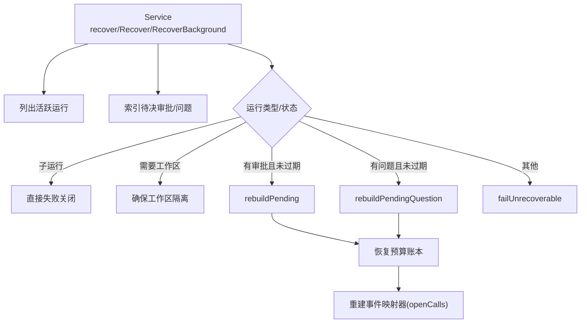
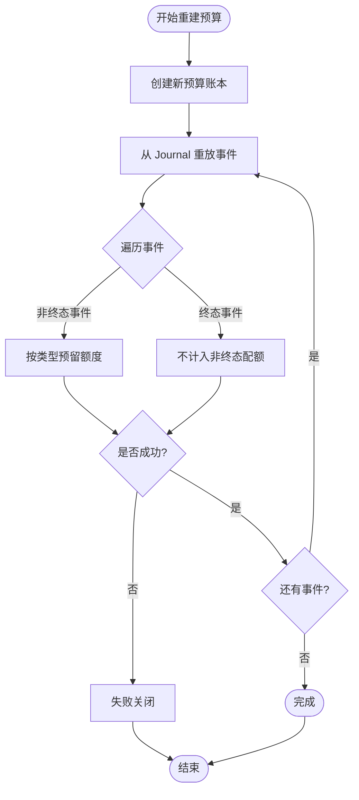
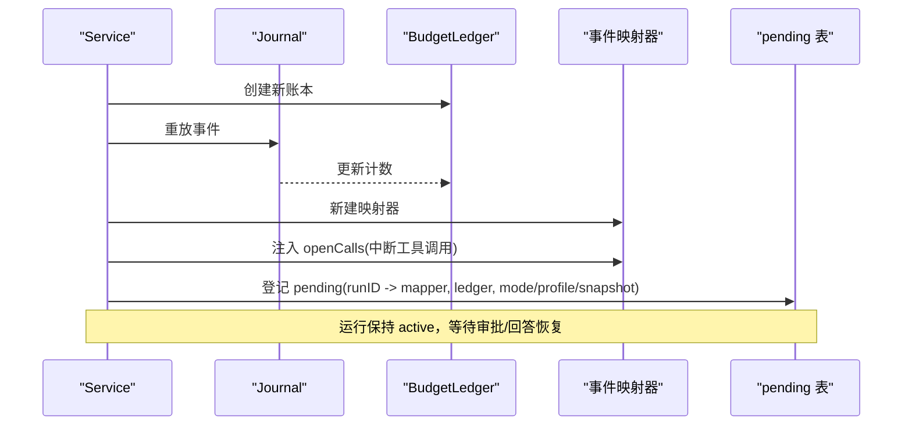
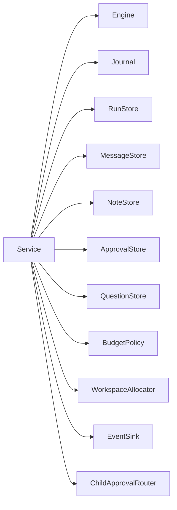

# 恢复机制

<cite>
**本文引用的文件**
- [service.go](file://internal/runtime/service.go)
- [budget.go](file://internal/runtime/budget.go)
- [checkpoint.go](file://internal/runtime/checkpoint.go)
- [recovery_test.go](file://internal/runtime/recovery_test.go)
</cite>

## 目录
1. [简介](#简介)
2. [项目结构](#项目结构)
3. [核心组件](#核心组件)
4. [架构总览](#架构总览)
5. [详细组件分析](#详细组件分析)
6. [依赖关系分析](#依赖关系分析)
7. [性能考虑](#性能考虑)
8. [故障排查指南](#故障排查指南)
9. [结论](#结论)
10. [附录](#附录)

## 简介
本文件聚焦运行时的“进程重启恢复”能力，围绕 Service 的 Recover 与 RecoverBackground 方法展开，解释重启后如何识别并处理非终态运行、子运行的特殊策略、工作区隔离检查、审批与问题（ask_user）的恢复、可恢复性校验（checkpoint 可读性）、预算账本重建、以及挂起状态的事件映射器重建。文档同时给出数据一致性、错误处理与性能优化建议，并通过时序图与流程图帮助读者理解恢复流程与存储层、事件系统的集成方式。

## 项目结构
恢复逻辑主要位于运行时服务层 internal/runtime：
- 服务入口与恢复编排：Service.Recover / RecoverBackground / recover
- 挂起重建：rebuildPending / rebuildPendingQuestion
- 预算账本：BudgetLedger 及 ReplayEvent 用于从事件重放恢复计数
- 检查点桥接：VersionedCheckpointStore 提供版本化与完整性校验的可读性判断
- 测试用例：recovery_test.go 覆盖可恢复审批、过期审批、孤儿运行等场景



图表来源
- [service.go:494-576](file://internal/runtime/service.go#L494-L576)
- [service.go:724-783](file://internal/runtime/service.go#L724-L783)
- [budget.go:198-220](file://internal/runtime/budget.go#L198-L220)

章节来源
- [service.go:465-576](file://internal/runtime/service.go#L465-L576)
- [recovery_test.go:92-188](file://internal/runtime/recovery_test.go#L92-L188)

## 核心组件
- Service.recover：启动时或后台恢复的统一入口，负责扫描活跃运行、索引待决交互、按策略分类处理。
- Service.checkpointReadable：仅当 checkpoint 可被当前引擎版本读取时才允许恢复为挂起。
- Service.rebuildPending / rebuildPendingQuestion：将持久化的审批/问题转换为内存中的挂起注册，重建事件映射器与预算账本。
- BudgetLedger.ReplayEvent：基于 Journal 事件重放，重建事件/模型调用/工具调用/重试次数等限额计数。
- VersionedCheckpointStore：对 eino 检查点进行版本与校验和封装，保证恢复时只使用可信快照。

章节来源
- [service.go:494-576](file://internal/runtime/service.go#L494-L576)
- [service.go:714-722](file://internal/runtime/service.go#L714-L722)
- [service.go:724-783](file://internal/runtime/service.go#L724-L783)
- [budget.go:198-220](file://internal/runtime/budget.go#L198-L220)
- [checkpoint.go:77-97](file://internal/runtime/checkpoint.go#L77-L97)

## 架构总览
恢复流程以“先持久、后可见”的原则，结合 Journal 作为最终事实源，配合 Run Store 的状态行与可选的 Approvals/Questions 表，完成以下目标：
- 不丢失任何非终态运行：要么恢复为可继续的挂起，要么明确失败关闭。
- 防止重复副作用：子运行不再重启执行。
- 安全恢复：仅在 checkpoint 可读且工作区可用时恢复；否则失败关闭。
- 预算一致：通过事件重放重建预算账本，避免超配。

```mermaid
sequenceDiagram
participant App as "应用"
participant Svc as "Service"
participant RS as "RunStore"
participant JS as "Journal"
participant AP as "ApprovalStore"
participant QS as "QuestionStore"
participant CK as "CheckpointStore"
App->>Svc : Recover()
Svc->>RS : ListActiveRuns()
RS-->>Svc : 活跃运行列表
Svc->>AP : ListPendingApprovals() (可选)
Svc->>QS : ListPendingQuestions() (可选)
loop 遍历每个运行
alt 子运行
Svc->>Svc : failUnrecoverable(关闭)
else 需要工作区
Svc->>Svc : Ensure(workspace)
end
alt 存在有效审批
Svc->>CK : Get(checkpointID)
CK-->>Svc : 可读?
opt 可读
Svc->>Svc : rebuildPending(重建挂起)
else 不可读
Svc->>Svc : failUnrecoverable(关闭)
end
else 存在有效问题
Svc->>CK : Get(checkpointID)
CK-->>Svc : 可读?
opt 可读
Svc->>Svc : rebuildPendingQuestion(重建挂起)
else 不可读
Svc->>Svc : failUnrecoverable(关闭)
end
else 无交互
Svc->>Svc : failUnrecoverable(关闭)
end
end
Svc-->>App : 恢复完成
```

图表来源
- [service.go:494-576](file://internal/runtime/service.go#L494-L576)
- [service.go:714-722](file://internal/runtime/service.go#L714-L722)
- [service.go:724-783](file://internal/runtime/service.go#L724-L783)
- [checkpoint.go:77-97](file://internal/runtime/checkpoint.go#L77-L97)

## 详细组件分析

### Recover 与 RecoverBackground
- RecoverBackground 是面向操作者的入口，若当前进程仍有活动运行或挂起运行则拒绝恢复，避免并发冲突。
- Recover 内部加锁调用 recover，recover 会：
  - 校验依赖是否就绪（engine、journal、runs、sink）。
  - 列出所有活跃运行。
  - 索引待决审批与问题（去重取最新）。
  - 逐个运行按策略处理：
    - 子运行：立即失败关闭，避免外部副作用重复执行。
    - 工作区隔离：必须能确保该运行独立工作区，否则失败关闭。
    - 审批/问题：若已过期则尝试过期处理；若未过期但 checkpoint 不可读则失败关闭；否则进入对应重建路径。
    - 其他：无待决交互的运行失败关闭。

章节来源
- [service.go:473-492](file://internal/runtime/service.go#L473-L492)
- [service.go:494-576](file://internal/runtime/service.go#L494-L576)

### 非终态运行的识别与处理策略
- 子运行：在重启后不重新执行，直接标记失败关闭，原因是可能触发外部副作用导致重复执行。
- 孤儿运行（无待决交互）：无法确定中断点，统一失败关闭。
- 带审批/问题的运行：若满足“未过期 + checkpoint 可读”，则恢复为挂起；否则失败关闭。

章节来源
- [service.go:534-573](file://internal/runtime/service.go#L534-L573)

### 子运行的特殊处理
- 子运行在恢复阶段被显式跳过执行，直接失败关闭，避免重复副作用。

章节来源
- [service.go:534-541](file://internal/runtime/service.go#L534-L541)

### 工作区隔离的检查
- 恢复前会尝试为运行分配/确认工作区，若失败则失败关闭，防止回退到宿主目录造成污染。

章节来源
- [service.go:542-547](file://internal/runtime/service.go#L542-L547)

### 审批与问题的恢复
- 审批：
  - 若存在待决审批且未过期，且 checkpoint 可读，则重建挂起：重建事件映射器，注入 openCalls 指向被中断的工具调用，并恢复预算账本。
  - 若已过期，尝试过期处理；若失败则失败关闭。
- 问题（ask_user）：
  - 若存在待决问题且未过期，且 checkpoint 可读，则重建挂起：重建事件映射器，注入 openCalls 指向 ask_user 工具调用，并恢复预算账本。
  - 若已过期，尝试过期处理；若失败则失败关闭。

章节来源
- [service.go:548-573](file://internal/runtime/service.go#L548-L573)
- [service.go:724-783](file://internal/runtime/service.go#L724-L783)

### Checkpoints 的可读性检查
- 通过 checkpointReadable 调用底层 VersionedCheckpointStore.Get，要求：
  - 引擎版本匹配（不同 eino 构建版本拒绝加载）。
  - 校验和一致（防损坏）。
- 只有可读才允许恢复为挂起；否则失败关闭。

章节来源
- [service.go:714-722](file://internal/runtime/service.go#L714-L722)
- [checkpoint.go:77-97](file://internal/runtime/checkpoint.go#L77-L97)

### 预算账本的重建过程
- 在重建挂起之前，先创建新的 BudgetLedger，并从 Journal 重放该运行的全部事件：
  - 非终态事件会计入相应限额（事件、模型调用、工具调用、重试）。
  - 终态事件不计入非终态事件配额，但作为闭合记录存在。
- 若重放过程中超出限额，则失败关闭，避免恢复后突破预算保护。



图表来源
- [budget.go:198-220](file://internal/runtime/budget.go#L198-L220)
- [service.go:785-800](file://internal/runtime/service.go#L785-L800)

章节来源
- [budget.go:198-220](file://internal/runtime/budget.go#L198-L220)
- [service.go:785-800](file://internal/runtime/service.go#L785-L800)

### rebuildPending 与 rebuildPendingQuestion 的恢复逻辑
- 共同点：
  - 重建预算账本（从事件重放）。
  - 新建事件映射器，并将被中断的工具调用以 openCalls 形式注入，使后续决策/回答能正确恢复执行上下文。
  - 将运行加入内存 pending 表，保持运行行仍为 active，等待外部决策或用户回答。
- 差异点：
  - rebuildPending：针对审批，openCalls 指向被中断的工具调用；selectedTools 来自审批详情或兼容旧事件。
  - rebuildPendingQuestion：针对 ask_user，openCalls 指向 ask_user 工具调用；支持 resumeTarget 回填。



图表来源
- [service.go:724-783](file://internal/runtime/service.go#L724-L783)
- [budget.go:198-220](file://internal/runtime/budget.go#L198-L220)

章节来源
- [service.go:724-783](file://internal/runtime/service.go#L724-L783)

### 与存储层和事件系统的集成
- 存储层：
  - RunStore：列出活跃运行、获取运行信息。
  - ApprovalStore/QuestionStore：列出待决审批/问题，供恢复阶段索引。
  - Journal：事件追加与重放，用于预算重建与终态保障。
  - BlobStore（通过 CheckpointStore）：读写版本化检查点，确保恢复时使用可信快照。
- 事件系统：
  - 恢复本身不主动发布事件；仅在后续决策/回答恢复执行时，由正常路径写入并广播事件。
  - 终态事件由 Journal 的 exactly-one 守卫保证唯一性。

章节来源
- [service.go:494-576](file://internal/runtime/service.go#L494-L576)
- [budget.go:198-220](file://internal/runtime/budget.go#L198-L220)
- [checkpoint.go:77-97](file://internal/runtime/checkpoint.go#L77-L97)

## 依赖关系分析
- Service 依赖：
  - Engine（驱动运行）、Journal（事件日志）、RunStore（运行状态）、MessageStore（消息）、NoteStore（摘要）、ApprovalStore/QuestionStore（交互）、BudgetPolicy（预算策略）、WorkspaceAllocator（工作区）、EventSink（事件广播）、ChildApprovalRouter（子审批路由）。
- 关键耦合：
  - 恢复阶段强依赖 Journal 与 RunStore 的一致性。
  - 预算重建强依赖 Journal 事件的完整性和顺序。
  - 检查点可读性依赖 VersionedCheckpointStore 的版本与校验和策略。



图表来源
- [service.go:70-94](file://internal/runtime/service.go#L70-L94)

章节来源
- [service.go:70-94](file://internal/runtime/service.go#L70-L94)

## 性能考虑
- 批量扫描与索引：恢复阶段对活跃运行与待决交互进行一次性扫描与索引，减少多次往返。
- 预算重放：按运行粒度重放事件，避免全局重放；必要时可限制重放范围（例如从最近检查点之后），但需保证一致性。
- 工作区分配：Ensure 应幂等且快速，避免阻塞恢复主流程。
- 事件负载大小：MaxEventPayloadBytes 控制事件体大小，避免过大事件影响重放与网络传输。
- 并发控制：RecoverBackground 拒绝在有活动运行或挂起运行时执行，避免竞争条件。

[本节为通用指导，不直接分析具体文件]

## 故障排查指南
- 常见错误与定位：
  - “服务未接线”：缺少 engine/journal/runs/sink 等依赖，检查初始化。
  - “工作区隔离不可用”：工作区分配失败，检查文件系统权限与隔离实现。
  - “检查点不可读”：版本不匹配或校验失败，检查引擎版本与 blob 完整性。
  - “预算重放失败”：事件缺失或损坏，检查 Journal 完整性与事件序列。
  - “后台恢复繁忙”：存在活动运行或挂起运行，等待空闲后再恢复。
- 调试建议：
  - 查看运行最后一条事件是否为 run.failed，并核对原因类别与消息。
  - 对比恢复前后事件数量，确保无额外事件写入（幂等性）。
  - 验证审批/问题是否在恢复后被正确重建为 pending，以便后续决策/回答能恢复执行。

章节来源
- [service.go:494-576](file://internal/runtime/service.go#L494-L576)
- [service.go:714-722](file://internal/runtime/service.go#L714-L722)
- [recovery_test.go:92-188](file://internal/runtime/recovery_test.go#L92-L188)

## 结论
恢复机制通过严格的策略与多层次的校验（子运行隔离、工作区检查、检查点可读性、预算重放）确保进程重启后不会丢失非终态运行，也不会引入重复副作用。审批与问题的恢复路径将持久化状态准确映射回内存挂起，使后续决策/回答能够无缝恢复执行。整体设计遵循“先持久、后可见”与“失败关闭”原则，结合 Journal 的终态唯一性保障，实现了高可靠的数据一致性与可恢复性。

[本节为总结，不直接分析具体文件]

## 附录
- 参考测试场景：
  - 可恢复审批：恢复后运行保持 active，审批决定后可完成。
  - 过期审批：恢复后运行失败关闭，事件包含超时原因。
  - 孤儿运行：无待决交互的运行失败关闭。
  - 幂等恢复：二次恢复不产生额外事件，终态事件唯一。

章节来源
- [recovery_test.go:92-188](file://internal/runtime/recovery_test.go#L92-L188)