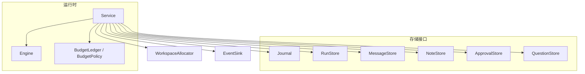
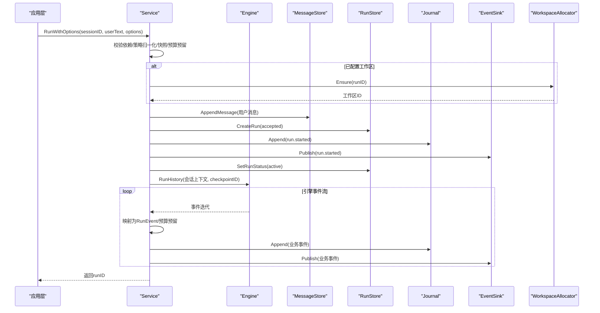
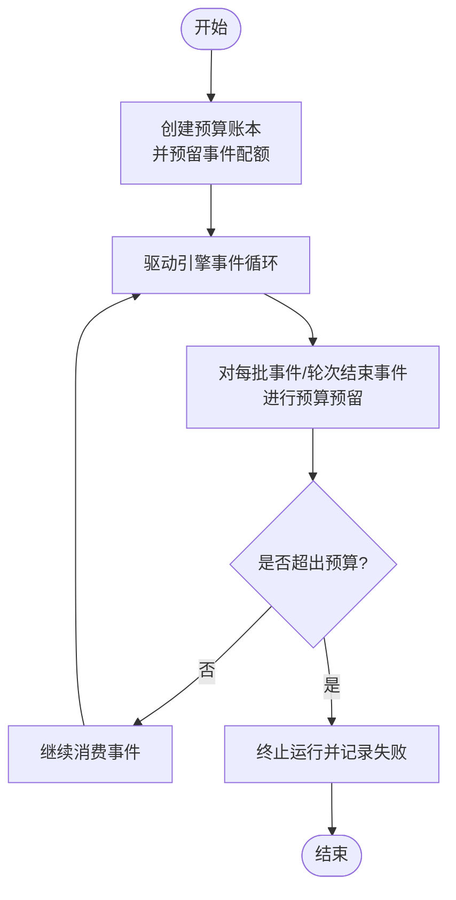
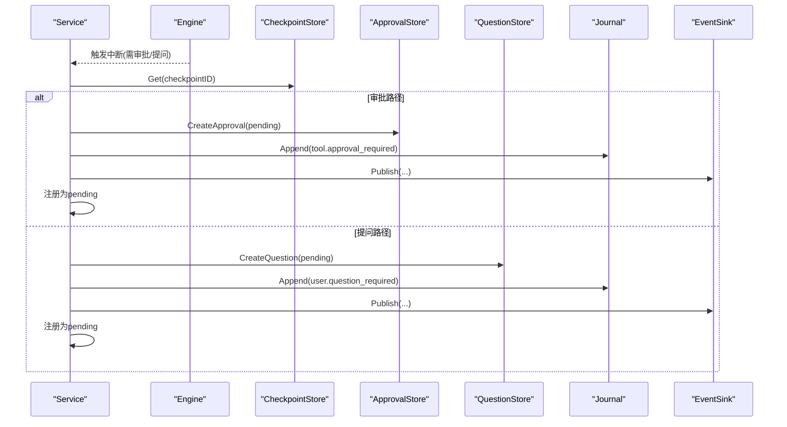
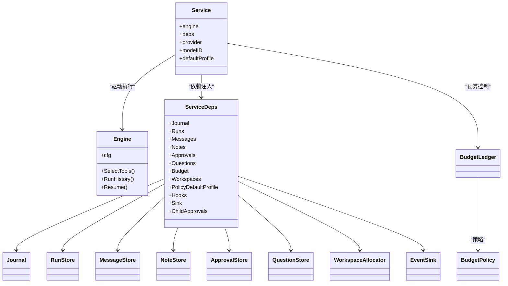

# 服务初始化与依赖注入

<cite>
**本文引用的文件**
- [internal/runtime/service.go](file://internal/runtime/service.go)
- [internal/runtime/engine.go](file://internal/runtime/engine.go)
- [internal/runtime/budget.go](file://internal/runtime/budget.go)
- [internal/storage/contracts.go](file://internal/storage/contracts.go)
</cite>

## 目录
1. [简介](#简介)
2. [项目结构](#项目结构)
3. [核心组件](#核心组件)
4. [架构总览](#架构总览)
5. [详细组件分析](#详细组件分析)
6. [依赖关系分析](#依赖关系分析)
7. [性能考量](#性能考量)
8. [故障排查指南](#故障排查指南)
9. [结论](#结论)
10. [附录](#附录)

## 简介
本文件聚焦于 Vivy 运行时中“运行服务”的初始化与依赖注入，围绕 Service 结构体、ServiceDeps 装配、默认策略配置、预算策略初始化与工作区分配器设置进行系统化说明。文档同时给出关键流程的时序图与流程图，帮助读者理解从 NewService 到 Run 的完整生命周期、错误处理与最佳实践。

## 项目结构
Vivy 的运行服务位于 internal/runtime 包，负责编排一次 Run：持久化用户消息、创建运行记录、写入 run.started 事件、驱动引擎执行、将事件持久化并广播，以及处理中断、恢复、取消等状态机行为。存储抽象在 internal/storage 中定义，由具体后端（SQLite/Postgres）实现；引擎 Engine 封装 Eino 的 Agent/Runner，是内部唯一允许直接依赖 eino 的边界之一。

图表来源
- [internal/runtime/service.go:70-130](file://internal/runtime/service.go#L70-L130)
- [internal/runtime/engine.go:18-59](file://internal/runtime/engine.go#L18-L59)
- [internal/storage/contracts.go:55-176](file://internal/storage/contracts.go#L55-L176)

章节来源
- [internal/runtime/service.go:70-130](file://internal/runtime/service.go#L70-L130)
- [internal/runtime/engine.go:18-59](file://internal/runtime/engine.go#L18-L59)
- [internal/storage/contracts.go:55-176](file://internal/storage/contracts.go#L55-L176)

## 核心组件
- Service：运行服务的编排者，持有 engine、deps、provider、modelID、默认策略 profile 及进程内活跃/挂起运行集合。负责 Run 的完整生命周期：消息持久化、运行行创建、run.started 写入、引擎驱动、事件映射与持久化、中断/恢复/取消。
- ServiceDeps：Service 的外部依赖聚合，包含 Journal、Runs、Messages、Notes、Approvals、Questions、Budget、Workspaces、PolicyDefaultProfile、Hooks、Sink、ChildApprovals 等。
- Engine：Eino 适配层，封装 ChatModelAgent/Runner，提供工具选择、历史运行、恢复执行、提案准备等能力。
- BudgetPolicy/BudgetLedger：按事件、模型调用、工具调用、重试维度限制单次 Run 及其子树的使用量，支持父子作用域与回放重建。
- 存储接口：Journal、RunStore、MessageStore、NoteStore、ApprovalStore、QuestionStore 等，定义统一的持久化契约。

章节来源
- [internal/runtime/service.go:70-130](file://internal/runtime/service.go#L70-L130)
- [internal/runtime/engine.go:18-59](file://internal/runtime/engine.go#L18-L59)
- [internal/runtime/budget.go:11-38](file://internal/runtime/budget.go#L11-L38)
- [internal/storage/contracts.go:55-176](file://internal/storage/contracts.go#L55-L176)

## 架构总览
下图展示 NewService 构建后，一次 Run 的关键调用链：参数校验与策略归一化、工作区分配、消息与运行行持久化、事件写入与发布、引擎驱动与事件消费、中断与恢复路径。

图表来源
- [internal/runtime/service.go:222-300](file://internal/runtime/service.go#L222-L300)
- [internal/runtime/service.go:911-929](file://internal/runtime/service.go#L911-L929)
- [internal/runtime/service.go:981-1031](file://internal/runtime/service.go#L981-L1031)
- [internal/storage/contracts.go:55-176](file://internal/storage/contracts.go#L55-L176)

## 详细组件分析

### Service 结构体与字段职责
- engine：Eino Runner 的封装，负责实际执行与事件流。
- deps：外部依赖聚合，集中管理存储、事件总线、审批/问答、预算、工作区等。
- provider/modelID：标注本次运行的模型提供方与模型标识，用于 run.started 负载。
- catalog：可选，提供模型元数据查询能力。
- defaultProfile：默认策略配置，未显式指定时生效。
- active/pending/ledgers/snapshots：进程内状态，跟踪活跃运行、挂起运行、预算账本与策略快照。
- wg/sweep*：用于优雅关闭与超时清理。

章节来源
- [internal/runtime/service.go:102-130](file://internal/runtime/service.go#L102-L130)

### ServiceDeps 装配逻辑
NewService 接收 Engine、provider、modelID 与 ServiceDeps，并进行以下装配与校验：
- 若未提供 BudgetPolicy，则使用 DefaultBudgetPolicy() 作为安全默认值。
- 若 PolicyDefaultProfile 无效，回退到 domain.PolicyProfileDefault。
- 初始化进程内 map：active、pending、ledgers、snapshots。

各依赖职责边界：
- Journal：追加与回放事件，保证顺序与终态唯一性。
- Runs：运行行 CRUD 与状态迁移。
- Messages：会话消息追加与列表。
- Notes：可选，用于生成笔记摘要注入提示。
- Approvals：效果型工具的人审行，支持过期与决定。
- Questions：ask_user 交互，独立于审批。
- Budget：运行级预算策略，限制事件/模型调用/工具调用/重试。
- Workspaces：隔离工作区分配器，确保后台运行沙箱。
- Hooks/Sink/ChildApprovals：扩展点与事件总线、子进程路由。

章节来源
- [internal/runtime/service.go:70-94](file://internal/runtime/service.go#L70-L94)
- [internal/runtime/service.go:149-169](file://internal/runtime/service.go#L149-L169)

### 默认策略配置与策略快照
- 默认策略：当 ServiceDeps.PolicyDefaultProfile 为空或无效时，回退到内置默认策略。
- 策略快照：每次 Run 通过 Engine.cfg.Policy.Snapshot(profile) 获取不可变快照（含哈希），用于后续恢复与一致性校验。
- 策略引擎：内置多个 Profile（默认、计划、只读、全自动），可自定义规则集，评估工具调用的允许/询问/拒绝决策。

章节来源
- [internal/runtime/service.go:222-236](file://internal/runtime/service.go#L222-L236)
- [internal/runtime/policy.go:47-94](file://internal/runtime/policy.go#L47-L94)

### 预算策略初始化与使用
- 初始化：Run 开始时创建 BudgetLedger，并预留一个事件配额。
- 使用：每批映射事件与轮次结束事件都会进行预算预留；工具调用与模型完成会额外记账。
- 恢复：重启后通过 Journal.Replay 重放非终态事件重建预算账本，避免越界。
- 子树：子 Worker 通过 Child(policy) 获得更紧的本地上限，但共享根账户仍受父限制约束。

图表来源
- [internal/runtime/service.go:237-243](file://internal/runtime/service.go#L237-L243)
- [internal/runtime/service.go:1033-1061](file://internal/runtime/service.go#L1033-L1061)
- [internal/runtime/budget.go:112-186](file://internal/runtime/budget.go#L112-L186)
- [internal/runtime/service.go:785-811](file://internal/runtime/service.go#L785-L811)

章节来源
- [internal/runtime/service.go:237-243](file://internal/runtime/service.go#L237-L243)
- [internal/runtime/service.go:1033-1061](file://internal/runtime/service.go#L1033-L1061)
- [internal/runtime/budget.go:112-186](file://internal/runtime/budget.go#L112-L186)
- [internal/runtime/service.go:785-811](file://internal/runtime/service.go#L785-L811)

### 工作区分配器的设置与使用
- 设置：通过 ServiceDeps.Workspaces 注入 WorkspaceAllocator。
- 使用：Run 启动时为每个 runID 分配隔离工作区；恢复阶段同样确保工作区存在；Worker 权限授予时返回工作区 ID 而非主机路径。
- 目的：后台运行与子 Worker 的文件系统隔离，避免影响宿主环境。

章节来源
- [internal/runtime/service.go:245-249](file://internal/runtime/service.go#L245-L249)
- [internal/runtime/service.go:578-589](file://internal/runtime/service.go#L578-L589)
- [internal/runtime/service.go:591-661](file://internal/runtime/service.go#L591-L661)

### 正确构建 Service 实例的步骤（示例）
以下为推荐步骤（不展示代码内容，仅描述过程）：
1. 准备 Engine：传入 ToolCallingChatModel、工具集与 EngineConfig（包含 StreamBuffer、MaxEventPayloadBytes、MaxToolTurns、MaxContextBytes、MaxHistoryMessages、MaxToolResultBytes、Checkpoints、Policy、ToolHooks）。
2. 组装 ServiceDeps：
   - 注入 Journal、Runs、Messages、Notes（可选）、Approvals（可选）、Questions（可选）。
   - 设置 ApprovalExpiration 控制待决审批有效期。
   - 设置 BudgetPolicy（或使用 DefaultBudgetPolicy）。
   - 设置 Workspaces（可选）。
   - 设置 PolicyDefaultProfile（建议使用有效 Profile）。
   - 注入 EventSink（如 events.Bus）与可选 Hooks、ChildApprovals。
3. 调用 NewService(eng, provider, modelID, deps)。
4. 可选：SetCatalog(catalog) 以启用模型元数据查询。
5. 启动前调用 Recover(ctx) 进行重启恢复。
6. 运行期间可通过 StartInteractionSweeper 启动超时清理，StopInteractionSweeper 停止。
7. 关闭时先 CancelAll，再 WaitIdle，最后关闭存储。

章节来源
- [internal/runtime/engine.go:61-117](file://internal/runtime/engine.go#L61-L117)
- [internal/runtime/service.go:149-169](file://internal/runtime/service.go#L149-L169)
- [internal/runtime/service.go:389-431](file://internal/runtime/service.go#L389-L431)
- [internal/runtime/service.go:465-492](file://internal/runtime/service.go#L465-L492)

### 中断、恢复与撤销流程
- 中断：当引擎需要人审或 ask_user 时，Service 检查检查点可读、存储就绪，持久化审批/问题行与 tool.approval_required/user.question_required 事件，并将运行标记为 pending。
- 恢复：启动时列出活动运行与待决审批/问题，重建内存挂起状态或失败不可恢复运行。
- 撤销：Cancel/CancelAll 会关闭活跃运行或取消待决交互，并输出相应终态事件。

图表来源
- [internal/runtime/service.go:1063-1175](file://internal/runtime/service.go#L1063-L1175)
- [internal/runtime/service.go:1177-1200](file://internal/runtime/service.go#L1177-L1200)
- [internal/runtime/service.go:465-576](file://internal/runtime/service.go#L465-L576)

章节来源
- [internal/runtime/service.go:1063-1175](file://internal/runtime/service.go#L1063-L1175)
- [internal/runtime/service.go:1177-1200](file://internal/runtime/service.go#L1177-L1200)
- [internal/runtime/service.go:465-576](file://internal/runtime/service.go#L465-L576)

## 依赖关系分析
Service 与 Engine、存储接口、预算策略、工作区分配器、事件总线之间的耦合清晰且低侵入：
- Service 仅通过接口访问存储与事件总线，便于替换实现与测试。
- Engine 仅在 internal/runtime 内依赖 eino，满足架构红线。
- 预算策略与策略引擎均为不可变对象，线程安全并可跨运行共享。
- 工作区分配器为可选依赖，未注入时不影响无文件系统需求的场景。

图表来源
- [internal/runtime/service.go:70-130](file://internal/runtime/service.go#L70-L130)
- [internal/runtime/engine.go:18-59](file://internal/runtime/engine.go#L18-L59)
- [internal/runtime/budget.go:11-38](file://internal/runtime/budget.go#L11-L38)
- [internal/storage/contracts.go:55-176](file://internal/storage/contracts.go#L55-L176)

章节来源
- [internal/runtime/service.go:70-130](file://internal/runtime/service.go#L70-L130)
- [internal/runtime/engine.go:18-59](file://internal/runtime/engine.go#L18-L59)
- [internal/runtime/budget.go:11-38](file://internal/runtime/budget.go#L11-L38)
- [internal/storage/contracts.go:55-176](file://internal/storage/contracts.go#L55-L176)

## 性能考量
- 事件批量与缓冲：EngineConfig.StreamBuffer 控制下游事件扇出通道大小，避免背压阻塞。
- 上下文与历史裁剪：MaxContextBytes 与 MaxHistoryMessages 限制请求上下文与保留的历史消息条数，防止上下文膨胀。
- 工具结果大小：MaxToolResultBytes 限制工具结果大小，避免污染下一轮上下文。
- 迭代次数保护：MaxToolTurns 限制模型生成循环次数，超过则分类为失败终态。
- 预算限额：通过 BudgetPolicy 限制事件、模型调用、工具调用与重试次数，防止资源滥用。

章节来源
- [internal/runtime/engine.go:18-46](file://internal/runtime/engine.go#L18-L46)
- [internal/runtime/budget.go:11-38](file://internal/runtime/budget.go#L11-L38)

## 故障排查指南
常见错误与定位建议：
- 服务未正确接线：当 engine/Journal/Runs/Messages/Sink 任一缺失时，Run 会返回“service not wired”。请检查 NewService 的依赖注入。
- 工作区未注入：调用 Workspace 或 WorkerAuthority 时会报错“workspace isolation not wired”，需注入 WorkspaceAllocator。
- 检查点不可用：中断路径要求 Checkpoints 可用，否则无法暂停恢复，需确保 VersionedCheckpointStore 已接入。
- 预算超限：出现 ErrBudgetExceeded 时，检查 BudgetPolicy 配置与当前使用量，必要时调整上限或优化工具调用次数。
- 策略无效：PolicyDefaultProfile 无效将回退默认；自定义策略需确保规则合法。
- 恢复忙碌：RecoverBackground 在有活跃或挂起运行时拒绝执行，应先等待空闲或改用启动恢复。

章节来源
- [internal/runtime/service.go:222-225](file://internal/runtime/service.go#L222-L225)
- [internal/runtime/service.go:578-589](file://internal/runtime/service.go#L578-L589)
- [internal/runtime/service.go:1063-1175](file://internal/runtime/service.go#L1063-L1175)
- [internal/runtime/budget.go:57-73](file://internal/runtime/budget.go#L57-L73)
- [internal/runtime/service.go:479-492](file://internal/runtime/service.go#L479-L492)

## 结论
Service 通过清晰的依赖注入与接口抽象，将运行生命周期、策略治理、预算控制、工作区隔离与持久化解耦。NewService 提供安全的默认策略与预算配置，配合 Engine 的 Eino 集成，形成稳定可扩展的执行内核。遵循本文的装配步骤与最佳实践，可在生产环境中可靠地启动、运行与关闭服务，并在异常情况下快速定位与恢复。

## 附录
- 术语速查
  - 运行（Run）：一次用户输入驱动的 Agent 执行单元。
  - 事件（Event）：运行过程中的结构化日志，包括模型、工具、审批、问答等。
  - 策略（Policy）：对工具调用的允许/询问/拒绝规则集合。
  - 预算（Budget）：对事件、模型调用、工具调用、重试的资源限额。
  - 工作区（Workspace）：隔离的文件系统沙箱。
  - 检查点（Checkpoint）：中断后可恢复的执行状态。