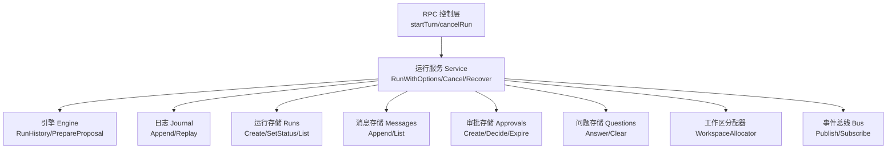
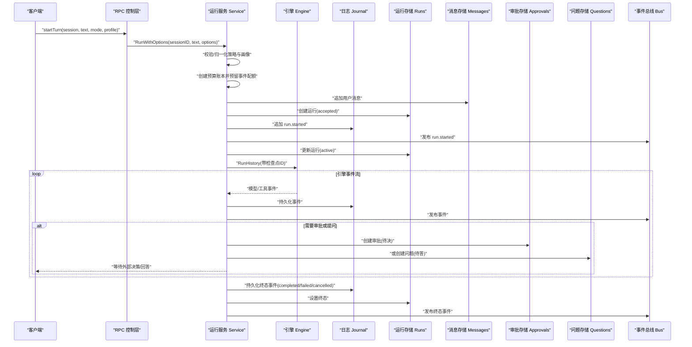
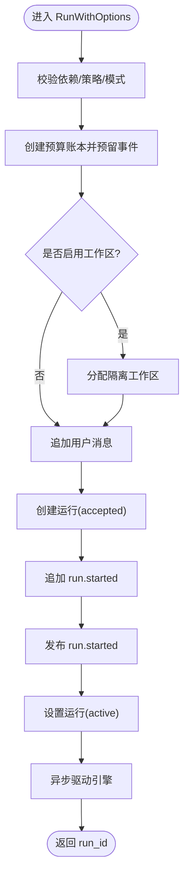
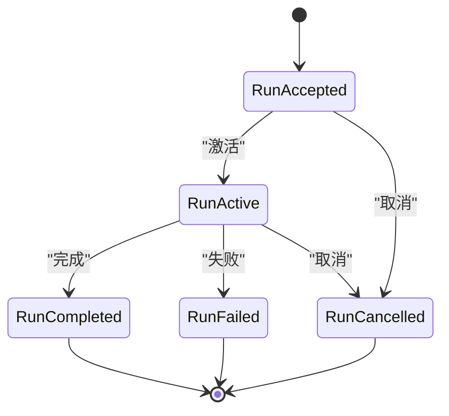
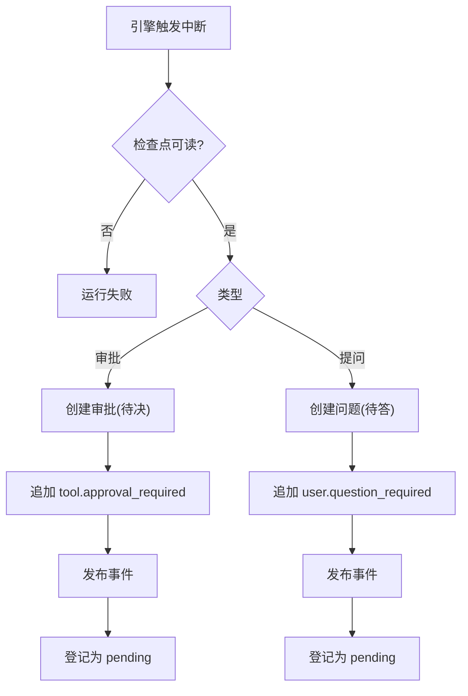
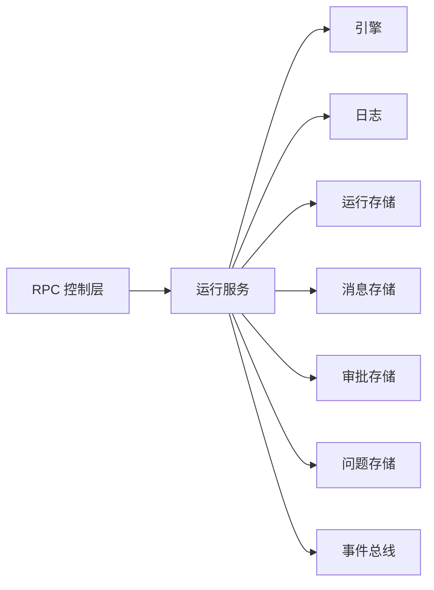

# 运行服务生命周期

<cite>
**本文引用的文件**
- [service.go](file://internal/runtime/service.go)
- [control.go](file://internal/rpc/control.go)
- [run.go](file://internal/domain/run.go)
- [bus.go](file://internal/events/bus.go)
- [isolation.go](file://internal/runtime/isolation.go)
</cite>

## 目录
1. [简介](#简介)
2. [项目结构](#项目结构)
3. [核心组件](#核心组件)
4. [架构总览](#架构总览)
5. [详细组件分析](#详细组件分析)
6. [依赖关系分析](#依赖关系分析)
7. [性能考量](#性能考量)
8. [故障排查指南](#故障排查指南)
9. [结论](#结论)
10. [附录](#附录)

## 简介
本文聚焦 Vivy 运行时中“运行服务”的生命周期管理，围绕 Service 结构体、Run/RunWithOptions 的执行流程、状态机（RunAccepted → RunActive → 终态）、取消与优雅关闭、重启恢复、工作区隔离、消息持久化、事件总线集成等关键主题进行系统化说明。文档同时给出并发安全、错误处理与性能优化建议，并附带可直接定位到源码的片段路径，便于读者对照实现。

## 项目结构
运行服务位于 internal/runtime 包，对外暴露 Service 接口；RPC 层在 internal/rpc 将控制面请求路由到 Service；领域模型在 internal/domain 定义运行状态机；事件总线在 internal/events 提供按 run 维度的实时推送；文件系统隔离由 internal/runtime 内的 WorkspaceManager 提供。

图表来源
- [control.go:618-633](file://internal/rpc/control.go#L618-L633)
- [service.go:222-300](file://internal/runtime/service.go#L222-L300)
- [service.go:911-1031](file://internal/runtime/service.go#L911-L1031)
- [bus.go:46-75](file://internal/events/bus.go#L46-L75)

章节来源
- [control.go:618-633](file://internal/rpc/control.go#L618-L633)
- [service.go:222-300](file://internal/runtime/service.go#L222-L300)
- [service.go:911-1031](file://internal/runtime/service.go#L911-L1031)
- [bus.go:46-75](file://internal/events/bus.go#L46-L75)

## 核心组件
- Service：编排一次运行的完整生命周期，负责参数校验、策略快照、预算预留、工作区分配、消息与运行行持久化、事件追加与发布、驱动引擎、中断挂起、恢复与关闭。
- RunOptions：单次运行的策略配置（模式与策略画像）。
- 存储依赖：Journal、Runs、Messages、Approvals、Questions、Notes（可选）。
- 事件总线：EventSink 抽象，实际由 events.Bus 实现，用于持久化后的实时分发。
- 工作区分配器：WorkspaceAllocator 为每次运行提供隔离目录，防止越界访问。

章节来源
- [service.go:70-130](file://internal/runtime/service.go#L70-L130)
- [service.go:143-169](file://internal/runtime/service.go#L143-L169)
- [service.go:184-210](file://internal/runtime/service.go#L184-L210)
- [isolation.go:76-108](file://internal/runtime/isolation.go#L76-L108)

## 架构总览
下图展示从 RPC 调用到运行完成的关键时序，包括参数校验、策略与预算、持久化顺序、引擎驱动、中断与恢复、以及终态事件的幂等写入。

图表来源
- [control.go:618-633](file://internal/rpc/control.go#L618-L633)
- [service.go:222-300](file://internal/runtime/service.go#L222-L300)
- [service.go:911-1031](file://internal/runtime/service.go#L911-L1031)
- [service.go:1068-1175](file://internal/runtime/service.go#L1068-L1175)
- [service.go:1814-1851](file://internal/runtime/service.go#L1814-L1851)

## 详细组件分析

### Service 结构与职责
- 字段与内存状态：维护 active/pending 映射、预算账本、策略快照、等待组以保障优雅关闭。
- 依赖注入：通过 ServiceDeps 注入存储与事件总线，避免内部耦合。
- 能力扩展：SetCatalog/SetChildApprovalRouter 用于装配可选能力。

章节来源
- [service.go:102-130](file://internal/runtime/service.go#L102-L130)
- [service.go:151-169](file://internal/runtime/service.go#L151-L169)
- [service.go:175-186](file://internal/runtime/service.go#L175-L186)

### Run 与 RunWithOptions 执行流程
- 参数验证：校验依赖是否就绪、策略画像有效性、模式与画像归一化。
- 策略与预算：生成策略快照、创建预算账本并预留事件配额。
- 工作区分配：若启用，则为本次运行分配隔离工作区。
- 持久化顺序：用户消息 → 运行行(accepted) → 日志(run.started) → 运行行(active)。
- 异步驱动：使用脱离请求上下文的上下文驱动引擎，确保断开不影响运行。
- 事件发布：先持久化后发布，保证可见性不超前于持久化。

图表来源
- [service.go:222-300](file://internal/runtime/service.go#L222-L300)

章节来源
- [service.go:222-300](file://internal/runtime/service.go#L222-L300)

### 状态管理机制（RunAccepted → RunActive → 终态）
- 状态机约束：RunAccepted 可转入 RunQueued/RunActive/RunCancelled；RunActive 仅允许转入 RunCompleted/RunFailed/RunCancelled；终态不可再转移。
- 服务内流转：RunWithOptions 先写 accepted，再写 active；consume 结束时根据结果写入终态。
- 唯一终态：journal 的 exactly-one-terminal 守卫保证每个 run 恰好一个终态事件。

图表来源
- [run.go:5-30](file://internal/domain/run.go#L5-L30)
- [service.go:1814-1851](file://internal/runtime/service.go#L1814-L1851)

章节来源
- [run.go:5-30](file://internal/domain/run.go#L5-L30)
- [service.go:1814-1851](file://internal/runtime/service.go#L1814-L1851)

### 中断与挂起：审批与提问
- 审批中断：当工具调用需人工审批时，校验检查点可读、创建审批记录、追加 tool.approval_required 事件并发布，并将运行标记为 pending。
- 提问中断：ask_user 场景类似，但走 QuestionStore，不触碰 ApprovalStore。
- 超时清理：后台扫描器定期过期未决审批/问题，并关闭对应运行。

图表来源
- [service.go:1068-1175](file://internal/runtime/service.go#L1068-L1175)
- [service.go:1179-1200](file://internal/runtime/service.go#L1179-L1200)

章节来源
- [service.go:1068-1175](file://internal/runtime/service.go#L1068-L1175)
- [service.go:1179-1200](file://internal/runtime/service.go#L1179-L1200)

### Cancel 与 CancelAll 取消机制
- Cancel(runID)：若运行处于 pending，尝试取消对应审批/问题并关闭；若处于 active，则调用其 cancel 函数，使 drive 以 run.cancelled 路径收尾。
- CancelAll()：批量取消所有 active 与 pending 运行，供关闭流程使用。

章节来源
- [service.go:306-369](file://internal/runtime/service.go#L306-L369)

### WaitIdle 优雅关闭
- WaitIdle(ctx)：等待所有 drive/resume 协程退出，确保终态事件在存储关闭前全部持久化。
- 典型关闭序列：CancelAll → WaitIdle → 关闭存储。

章节来源
- [service.go:371-387](file://internal/runtime/service.go#L371-L387)

### Recover 重启恢复逻辑
- Recover/RecoverBackground：启动时扫描活跃运行，区分子进程与主运行；对可恢复的运行重建 pending（审批/提问），否则以 run.failed 或 child.failed 终结，避免悬挂。
- 预算恢复：重放 journal 重建预算账本，若已超限则失败关闭。
- 工作区恢复：确保隔离目录可用。

章节来源
- [service.go:465-576](file://internal/runtime/service.go#L465-L576)
- [service.go:788-811](file://internal/runtime/service.go#L788-L811)
- [service.go:885-909](file://internal/runtime/service.go#L885-L909)

### 工作区分配与路径校验
- 分配：为每个 run 分配独立目录，确保隔离。
- 校验：ValidatePath 拒绝越界路径、符号链接等逃逸风险。

章节来源
- [isolation.go:76-108](file://internal/runtime/isolation.go#L76-L108)

### 与存储层、事件总线的集成
- 存储层：
  - 消息：AppendMessage 保存用户输入；ListMessages 构建会话上下文。
  - 运行：CreateRun/SetRunStatus 管理状态机。
  - 审批/问题：CreateApproval/AnswerQuestion/Expire 等。
  - 日志：Append/Replay 作为单一事实源。
- 事件总线：
  - publish 先持久化后发布，终端事件关闭订阅通道。
  - 慢消费者会被丢弃，后续通过 journal 回放重同步。

章节来源
- [service.go:1710-1754](file://internal/runtime/service.go#L1710-L1754)
- [service.go:1814-1858](file://internal/runtime/service.go#L1814-L1858)
- [bus.go:46-75](file://internal/events/bus.go#L46-L75)

### 并发安全与错误处理
- 并发安全：
  - 使用互斥锁保护 active/pending/ledgers/snapshots 等共享状态。
  - 使用 WaitGroup 协调关闭，确保资源释放顺序正确。
  - 审批/问题操作采用条件持久化，保证 first-writer-wins。
- 错误处理：
  - 中断失败、检查点不可读、预算超限等路径均会发出明确的终态事件。
  - 恢复阶段对不可恢复运行直接终结，避免悬挂。

章节来源
- [service.go:106-130](file://internal/runtime/service.go#L106-L130)
- [service.go:1068-1175](file://internal/runtime/service.go#L1068-L1175)
- [service.go:885-909](file://internal/runtime/service.go#L885-L909)

### 性能优化建议
- 预算与配额：
  - 预留给定事件配额，避免无界增长；对模型调用与工具调用分别计费，及时熔断。
- I/O 批处理：
  - 事件持久化与发布分离，减少阻塞；终端事件写入使用有界超时，避免无限等待。
- 上下文裁剪：
  - 历史消息与笔记摘要按需裁剪，控制上下文大小，降低模型成本与延迟。
- 事件总线缓冲：
  - 合理设置 Bus 缓冲区，避免慢消费者拖垮整体吞吐。

章节来源
- [service.go:937-964](file://internal/runtime/service.go#L937-L964)
- [service.go:1033-1061](file://internal/runtime/service.go#L1033-L1061)
- [bus.go:34-40](file://internal/events/bus.go#L34-L40)

## 依赖关系分析
Service 与 RPC、存储、事件总线、引擎之间的依赖如下：

图表来源
- [control.go:618-633](file://internal/rpc/control.go#L618-L633)
- [service.go:222-300](file://internal/runtime/service.go#L222-L300)
- [service.go:1814-1858](file://internal/runtime/service.go#L1814-L1858)

章节来源
- [control.go:618-633](file://internal/rpc/control.go#L618-L633)
- [service.go:222-300](file://internal/runtime/service.go#L222-L300)
- [service.go:1814-1858](file://internal/runtime/service.go#L1814-L1858)

## 性能考量
- 预算限制：通过预算账本对模型调用、工具调用与重试进行配额控制，防止雪崩。
- 事件持久化优先：所有事件先落盘再发布，避免可见性与一致性冲突。
- 上下文裁剪：历史消息与笔记摘要裁剪，减少传输与处理开销。
- 事件总线背压：慢消费者被丢弃并由其自行回放，避免阻塞生产者。

[本节为通用指导，无需特定文件引用]

## 故障排查指南
- 无法暂停审批：检查检查点桥是否接入、审批存储是否配置；失败时会转为 run.failed。
- 运行悬挂：确认 Recover 是否成功；子进程丢失会直接 child.failed；主运行若无有效检查点也会失败关闭。
- 事件丢失：确认事件总线订阅是否存活；终端事件后会关闭通道，需通过 journal 回放。
- 预算超限：查看预算重放与预留逻辑，必要时调整策略或放宽配额。

章节来源
- [service.go:1068-1175](file://internal/runtime/service.go#L1068-L1175)
- [service.go:885-909](file://internal/runtime/service.go#L885-L909)
- [bus.go:46-75](file://internal/events/bus.go#L46-L75)

## 结论
运行服务通过严格的持久化顺序、状态机约束与预算控制，实现了高可靠、可恢复、可观测的 Agent 运行生命周期。RunWithOptions 将策略、工作区、消息与事件整合为一致流程；Cancel/CancelAll 与 WaitIdle 提供可控的取消与优雅关闭；Recover 保证进程重启后的状态收敛。配合事件总线与存储层，系统既保证了数据一致性，又提供了高效的实时反馈能力。

[本节为总结，无需特定文件引用]

## 附录

### 启动与停止服务的代码示例（路径指引）
- 启动一次运行：
  - 入口：[control.go:startTurn:618-633](file://internal/rpc/control.go#L618-L633)
  - 服务方法：[service.go:RunWithOptions:222-300](file://internal/runtime/service.go#L222-L300)
- 取消运行：
  - 入口：[control.go:cancelRun:635-644](file://internal/rpc/control.go#L635-L644)
  - 服务方法：[service.go:Cancel:306-346](file://internal/runtime/service.go#L306-L346)
- 优雅关闭：
  - 服务方法：[service.go:CancelAll:352-369](file://internal/runtime/service.go#L352-L369)、[service.go:WaitIdle:371-387](file://internal/runtime/service.go#L371-L387)
- 重启恢复：
  - 服务方法：[service.go:Recover:473-477](file://internal/runtime/service.go#L473-L477)、[service.go:recover:494-576](file://internal/runtime/service.go#L494-L576)

### 与事件总线的集成要点
- 发布顺序：先持久化到 Journal，再发布到 Bus。
- 终端事件：发布后关闭订阅通道，后续消费通过 journal 回放。
- 慢消费者：被丢弃并记录告警，不会阻塞生产端。

章节来源
- [service.go:1814-1858](file://internal/runtime/service.go#L1814-L1858)
- [bus.go:46-75](file://internal/events/bus.go#L46-L75)