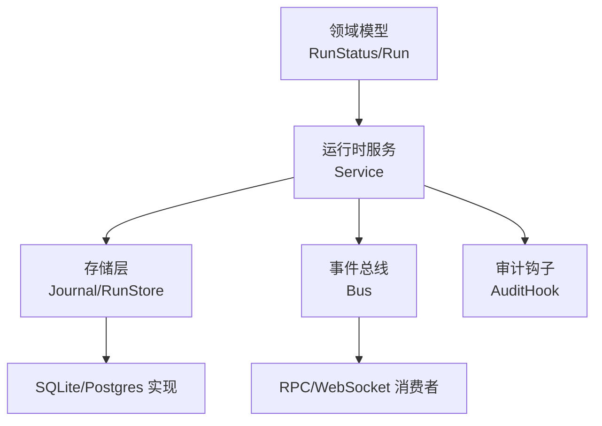
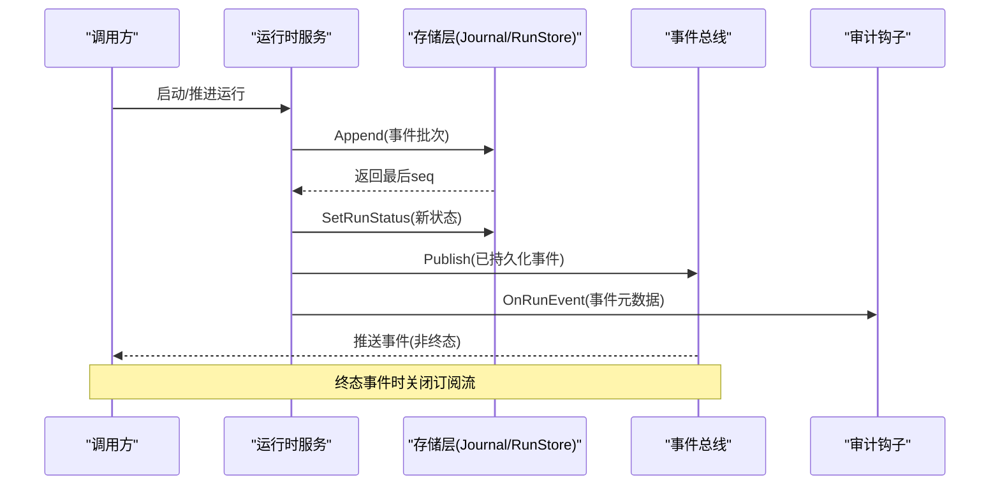
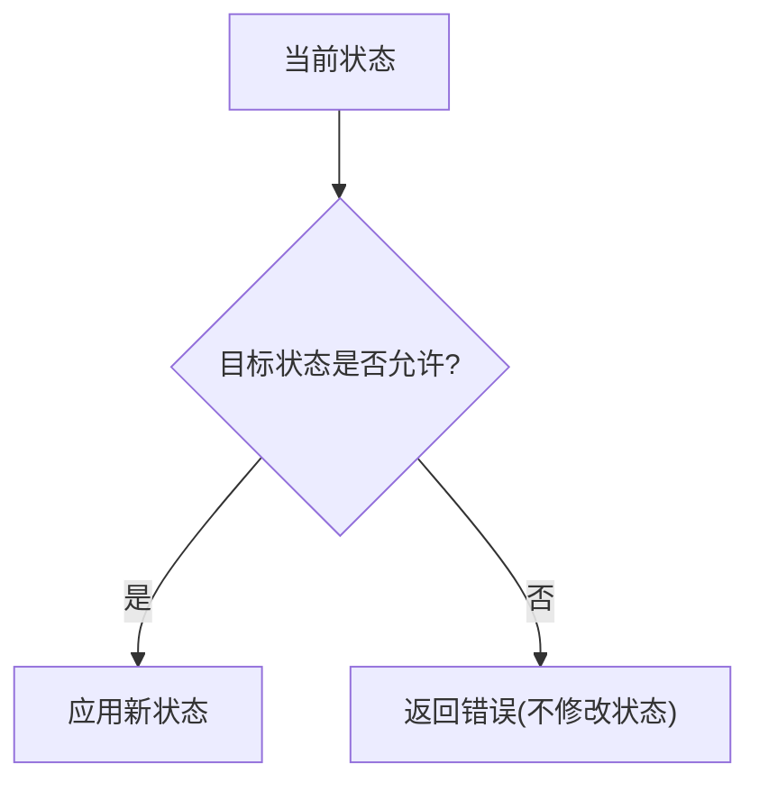
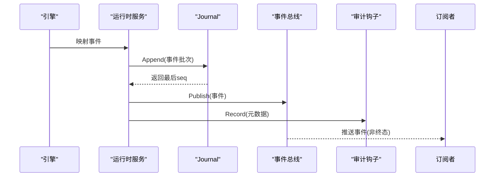
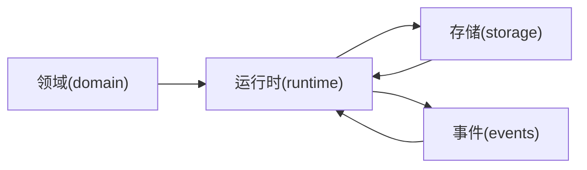

# 状态转换机制

<cite>
**本文引用的文件**
- [internal/domain/run.go](file://internal/domain/run.go)
- [internal/storage/contracts.go](file://internal/storage/contracts.go)
- [internal/events/bus.go](file://internal/events/bus.go)
- [internal/runtime/service.go](file://internal/runtime/service.go)
- [internal/runtime/audit.go](file://internal/runtime/audit.go)
- [internal/storage/sqlite/sqlite_test.go](file://internal/storage/sqlite/sqlite_test.go)
</cite>

## 目录
1. [简介](#简介)
2. [项目结构](#项目结构)
3. [核心组件](#核心组件)
4. [架构总览](#架构总览)
5. [详细组件分析](#详细组件分析)
6. [依赖关系分析](#依赖关系分析)
7. [性能考虑](#性能考虑)
8. [故障排查指南](#故障排查指南)
9. [结论](#结论)
10. [附录](#附录)

## 简介
本文件围绕“运行状态转换机制”进行系统化说明，覆盖状态机设计、转换规则、触发与约束条件、幂等性保证、持久化时机与一致性要求、事件记录与审计跟踪、并发访问控制、状态验证与异常处理策略，并结合代码路径给出实现细节与集成方式。目标是让读者既能理解整体架构，也能在实现中正确落地状态转换。

## 项目结构
与运行状态转换相关的核心位置如下：
- 领域模型与状态机定义位于 internal/domain（RunStatus、Run、状态转换方法）。
- 存储契约与事务边界位于 internal/storage（Journal、RunStore、错误语义）。
- 运行时服务编排与持久化顺序位于 internal/runtime（Service、Hook、EventSink）。
- 事件总线用于将已持久化的事件广播给订阅者，位于 internal/events。
- 审计钩子用于对事件元数据进行脱敏记录，位于 internal/runtime。

图表来源
- [internal/domain/run.go:5-82](file://internal/domain/run.go#L5-L82)
- [internal/runtime/service.go:24-130](file://internal/runtime/service.go#L24-L130)
- [internal/storage/contracts.go:55-75](file://internal/storage/contracts.go#L55-L75)
- [internal/events/bus.go:10-75](file://internal/events/bus.go#L10-L75)
- [internal/runtime/audit.go:12-44](file://internal/runtime/audit.go#L12-L44)

章节来源
- [internal/domain/run.go:5-82](file://internal/domain/run.go#L5-L82)
- [internal/storage/contracts.go:55-75](file://internal/storage/contracts.go#L55-L75)
- [internal/events/bus.go:10-75](file://internal/events/bus.go#L10-L75)
- [internal/runtime/service.go:24-130](file://internal/runtime/service.go#L24-L130)
- [internal/runtime/audit.go:12-44](file://internal/runtime/audit.go#L12-L44)

## 核心组件
- 运行状态与状态机
  - 状态集合：accepted、queued、active、completed、failed、cancelled。
  - 合法转换表由领域层维护，终端状态无出边，确保“恰好一个终态”不变式。
  - 提供 CanTransitionTo 与 TransitionTo 进行校验与原子更新。
- 存储契约
  - Journal：追加型有序事件日志，拒绝包含多个终态事件的提交，并在已有终态后拒绝后续追加。
  - RunStore：负责 run 行状态写入；状态合法性由领域状态机保障，存储仅做持久化。
- 运行时服务
  - 负责编排：先持久化事件，再发布到事件总线；终态持久化有超时保护，避免请求断开导致丢失。
  - 通过 Hook 将事件透传给审计系统。
- 事件总线
  - 基于 runID 的 fan-out，终端事件会关闭并清理订阅；慢消费者会被丢弃并由 RPC 重放恢复。
- 审计钩子
  - 仅记录事件元数据（大小与摘要），不携带 payload，避免泄露敏感信息。

章节来源
- [internal/domain/run.go:5-82](file://internal/domain/run.go#L5-L82)
- [internal/storage/contracts.go:11-31](file://internal/storage/contracts.go#L11-L31)
- [internal/storage/contracts.go:55-75](file://internal/storage/contracts.go#L55-L75)
- [internal/runtime/service.go:24-130](file://internal/runtime/service.go#L24-L130)
- [internal/events/bus.go:10-75](file://internal/events/bus.go#L10-L75)
- [internal/runtime/audit.go:12-44](file://internal/runtime/audit.go#L12-L44)

## 架构总览
下图展示了从调用入口到状态变更、事件持久化、事件广播与审计的全链路流程。

图表来源
- [internal/runtime/service.go:24-130](file://internal/runtime/service.go#L24-L130)
- [internal/storage/contracts.go:55-75](file://internal/storage/contracts.go#L55-L75)
- [internal/events/bus.go:42-75](file://internal/events/bus.go#L42-L75)
- [internal/runtime/audit.go:35-44](file://internal/runtime/audit.go#L35-L44)

## 详细组件分析

### 状态机与转换规则
- 状态定义与词汇表
  - accepted、queued、active、completed、failed、cancelled。
  - Terminal() 标识终态（completed、failed、cancelled）。
  - Valid() 校验未知状态。
- 合法转换
  - accepted → queued / active / cancelled
  - queued → active / cancelled
  - active → completed / failed / cancelled
  - 终态无出边，保证“恰好一个终态”。
- 转换接口
  - CanTransitionTo(next) 判断是否允许。
  - TransitionTo(next) 校验通过后赋值，非法转换返回错误且不改变原值。

图表来源
- [internal/domain/run.go:17-82](file://internal/domain/run.go#L17-L82)

章节来源
- [internal/domain/run.go:5-82](file://internal/domain/run.go#L5-L82)

### 触发条件与业务集成
- 典型触发点
  - 接受运行：创建 run 行并写入 run.started 事件。
  - 入队/激活：根据调度器或引擎推进，写入对应事件并更新 run 状态。
  - 完成/失败/取消：引擎结束或外部取消时，写入终态事件并更新 run 状态。
- 集成要点
  - 所有状态变更必须伴随至少一个事件写入 Journal。
  - 终态事件写入成功后才更新 run 状态，确保“事件即真相”。
  - 取消可由用户或系统触发，需满足状态机允许（如 accepted/queued/active → cancelled）。

章节来源
- [internal/storage/contracts.go:55-75](file://internal/storage/contracts.go#L55-L75)
- [internal/runtime/service.go:24-130](file://internal/runtime/service.go#L24-L130)

### 幂等性与一致性保证
- 幂等性
  - 同一状态的多次设置应被存储层视为幂等；若底层未显式幂等，上层可通过版本号或“已是该状态则跳过”的策略实现。
  - 事件追加为单调递增 seq，重复提交同一批事件需由上层去重或依赖唯一键。
- 一致性
  - Journal.Append 拒绝包含多于一个终态事件的提交，并在已有终态后拒绝后续追加。
  - 终态持久化使用独立超时，确保即使客户端断开也能完成最终落盘。
  - 事件先持久化再发布，保证“可见性不超过持久性”。

章节来源
- [internal/storage/contracts.go:11-31](file://internal/storage/contracts.go#L11-L31)
- [internal/runtime/service.go:24-130](file://internal/runtime/service.go#L24-L130)

### 持久化时机与一致性要求
- 时机
  - 每个事件写入 Journal 后立即获得 seq，随后可安全发布到事件总线。
  - run 状态在终态事件持久化后更新，避免状态与事件不一致。
- 一致性
  - 单条 Commit 内不允许出现多个终态事件。
  - 已有终态后，Journal 拒绝任何追加，防止回写污染。
  - 快照与 Blob 采用版本/代次机制，避免并发覆盖。

章节来源
- [internal/storage/contracts.go:55-75](file://internal/storage/contracts.go#L55-L75)
- [internal/storage/sqlite/sqlite_test.go:29-56](file://internal/storage/sqlite/sqlite_test.go#L29-L56)

### 事件记录与审计跟踪
- 事件记录
  - 事件经 Journal 持久化，按 seq 顺序可回放。
  - 事件总线按 runID 分发，终端事件关闭订阅流，避免悬挂连接。
- 审计跟踪
  - AuditHook 接收已持久化事件，仅记录 RunID、Seq、Type、时间戳、负载大小与 SHA256 摘要。
  - 不记录原始 payload，避免泄露工具参数或密钥。

图表来源
- [internal/runtime/service.go:24-130](file://internal/runtime/service.go#L24-L130)
- [internal/events/bus.go:42-75](file://internal/events/bus.go#L42-L75)
- [internal/runtime/audit.go:35-44](file://internal/runtime/audit.go#L35-L44)

章节来源
- [internal/events/bus.go:10-75](file://internal/events/bus.go#L10-L75)
- [internal/runtime/audit.go:12-44](file://internal/runtime/audit.go#L12-L44)

### 并发访问控制与锁粒度
- 进程内并发
  - Service 使用互斥量保护活跃运行集合与挂起运行集合，避免竞态。
  - 事件总线对订阅者集合加锁，终端事件或慢消费者会关闭通道并移除订阅。
- 跨进程并发
  - 存储层通过 LeaseStore 实现独占工作（如恢复期）与租约续期。
  - Journal 在已有终态后拒绝追加，天然防止多写冲突。

章节来源
- [internal/runtime/service.go:110-130](file://internal/runtime/service.go#L110-L130)
- [internal/events/bus.go:42-75](file://internal/events/bus.go#L42-L75)
- [internal/storage/contracts.go:87-94](file://internal/storage/contracts.go#L87-L94)

### 状态验证与异常处理策略
- 状态验证
  - 所有状态变更先经 CanTransitionTo 校验，非法转换直接返回错误。
  - 终态不可逆，禁止从终态再次转换。
- 异常处理
  - 存储层提供明确哨兵错误（如运行已关闭、提交无效、版本冲突、租约丢失）。
  - 事件总线在终端事件后关闭订阅，避免下游误用。
  - 审计钩子为空实现时直接忽略，不影响主流程。

章节来源
- [internal/domain/run.go:63-82](file://internal/domain/run.go#L63-L82)
- [internal/storage/contracts.go:11-31](file://internal/storage/contracts.go#L11-L31)
- [internal/events/bus.go:42-75](file://internal/events/bus.go#L42-L75)
- [internal/runtime/audit.go:35-44](file://internal/runtime/audit.go#L35-L44)

## 依赖关系分析
- 领域层（domain）不依赖运行时与存储，仅定义状态与转换规则。
- 运行时（runtime）依赖领域模型、存储契约、事件总线与审计钩子。
- 存储层（storage）提供统一接口，具体实现（SQLite/Postgres）遵循契约。
- 事件总线（events）仅依赖领域事件类型，作为纯优化层。

图表来源
- [internal/domain/run.go:5-82](file://internal/domain/run.go#L5-L82)
- [internal/runtime/service.go:24-130](file://internal/runtime/service.go#L24-L130)
- [internal/storage/contracts.go:55-75](file://internal/storage/contracts.go#L55-L75)
- [internal/events/bus.go:10-75](file://internal/events/bus.go#L10-L75)

章节来源
- [internal/domain/run.go:5-82](file://internal/domain/run.go#L5-L82)
- [internal/runtime/service.go:24-130](file://internal/runtime/service.go#L24-L130)
- [internal/storage/contracts.go:55-75](file://internal/storage/contracts.go#L55-L75)
- [internal/events/bus.go:10-75](file://internal/events/bus.go#L10-L75)

## 性能考虑
- 事件批量追加：将多个事件合并为一次 Commit，减少 IO 次数。
- 事件总线缓冲：为订阅者提供有限缓冲，慢消费者将被丢弃并通过 RPC 重放恢复，避免阻塞主流程。
- 终态持久化超时：限制后台持久化窗口，兼顾可靠性与资源占用。
- 只读审计：审计钩子仅计算摘要与记录元数据，开销低且不影响主路径。

[本节为通用指导，不直接分析具体文件]

## 故障排查指南
- 无法继续追加事件
  - 检查是否已存在终态事件；Journal 会在已有终态后拒绝追加。
  - 参考错误：运行已关闭、提交无效。
- 状态未更新
  - 确认事件已持久化成功；run 状态通常在终态事件之后更新。
  - 检查是否有并发竞争导致状态被覆盖。
- 前端未收到事件
  - 检查事件总线订阅是否被关闭（终端事件会关闭订阅）。
  - 慢消费者会被丢弃，需从上次 seq 重放。
- 审计缺失
  - 确认 AuditHook 已注入且 Sink 非空；否则不会记录。

章节来源
- [internal/storage/contracts.go:11-31](file://internal/storage/contracts.go#L11-L31)
- [internal/events/bus.go:42-75](file://internal/events/bus.go#L42-L75)
- [internal/runtime/audit.go:35-44](file://internal/runtime/audit.go#L35-L44)

## 结论
该状态转换机制以领域状态机为核心，结合存储层的强一致约束与运行时服务的严格持久化顺序，实现了可靠、可审计、可恢复的运行生命周期管理。通过事件总线与审计钩子，系统在保持高性能的同时提供了完整的可观测性与合规能力。

[本节为总结性内容，不直接分析具体文件]

## 附录
- 关键术语
  - 终态：completed、failed、cancelled。
  - 事件序列号：单调递增，用于回放与对齐。
  - 租约：用于跨进程独占工作的轻量级锁。
- 推荐实践
  - 始终先持久化事件，再更新 run 状态。
  - 对所有状态变更调用状态机的校验方法。
  - 使用批量提交减少 IO。
  - 为审计钩子配置合适的输出后端，避免泄露敏感信息。

[本节为补充说明，不直接分析具体文件]