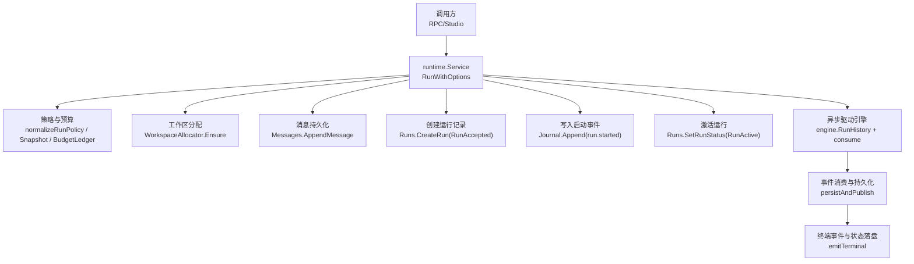
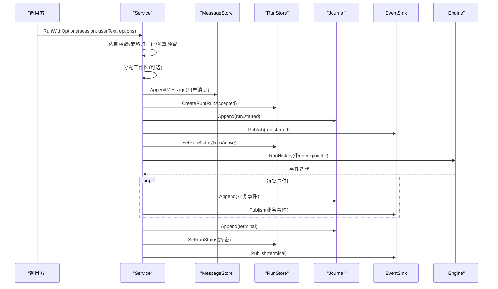
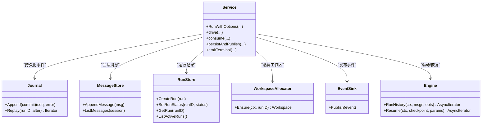
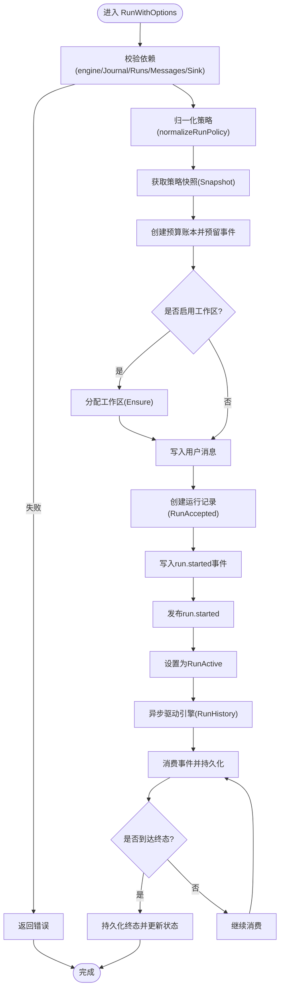

# 运行启动流程

<cite>
**本文引用的文件**
- [internal/runtime/service.go](file://internal/runtime/service.go)
- [internal/domain/run.go](file://internal/domain/run.go)
- [internal/storage/contracts.go](file://internal/storage/contracts.go)
- [internal/rpc/protocol.go](file://internal/rpc/protocol.go)
- [internal/events/bus.go](file://internal/events/bus.go)
- [internal/provider/bundle.go](file://internal/provider/bundle.go)
- [internal/config/config.go](file://internal/config/config.go)
- [internal/storage/postgres/postgres.go](file://internal/storage/postgres/postgres.go)
- [internal/storage/sqlite/sqlite.go](file://internal/storage/sqlite/sqlite.go)
</cite>

## 目录
1. [简介](#简介)
2. [项目结构](#项目结构)
3. [核心组件](#核心组件)
4. [架构总览](#架构总览)
5. [详细组件分析](#详细组件分析)
6. [依赖关系分析](#依赖关系分析)
7. [性能考虑](#性能考虑)
8. [故障排查指南](#故障排查指南)
9. [结论](#结论)
10. [附录](#附录)

## 简介
本文聚焦于 Vivy 运行时“运行启动流程”，以 Service.RunWithOptions 为核心，逐步拆解从依赖校验、策略配置、工作区分配、消息与运行记录持久化、到引擎驱动与状态机推进的完整路径。文档同时说明错误处理机制、数据一致性保证、RunAccepted 与 RunActive 的状态设置时机、存储层交互模式与事务边界，并给出性能与故障恢复建议。

## 项目结构
Vivy 采用分层组织：domain 定义领域模型与状态机；runtime 编排运行生命周期；storage 提供可插拔的日志与持久化接口；provider 抽象模型提供方；events 负责事件总线；rpc 暴露控制面；config 管理配置。启动流程主要发生在 runtime.Service 中，通过 storage.Journal 实现“先持久、后可见”的事件流，并通过 domain.RunStatus 维护严格的状态机。

图表来源
- [internal/runtime/service.go:220-300](file://internal/runtime/service.go#L220-L300)
- [internal/runtime/service.go:911-929](file://internal/runtime/service.go#L911-L929)
- [internal/runtime/service.go:1704-1731](file://internal/runtime/service.go#L1704-L1731)
- [internal/runtime/service.go:1807-1851](file://internal/runtime/service.go#L1807-L1851)

章节来源
- [internal/runtime/service.go:220-300](file://internal/runtime/service.go#L220-L300)
- [internal/runtime/service.go:911-929](file://internal/runtime/service.go#L911-L929)
- [internal/runtime/service.go:1704-1731](file://internal/runtime/service.go#L1704-L1731)
- [internal/runtime/service.go:1807-1851](file://internal/runtime/service.go#L1807-L1851)

## 核心组件
- Service：编排运行生命周期，负责依赖校验、策略解析、工作区分配、消息与运行记录持久化、事件发布、引擎驱动与中断/恢复。
- Domain.RunStatus：定义 run 的状态机（accepted/queued/active/completed/failed/cancelled），确保“恰好一个终态”。
- Storage.Journal：追加式、有序、不可变的事件日志，承担“先持久、后可见”的可靠性保障。
- Storage.MessageStore/RunStore：会话消息与运行记录的读写。
- WorkspaceAllocator：为后台运行分配隔离工作区。
- EventSink：将已持久化的事件广播给订阅者（如 RPC/WebSocket）。
- BudgetLedger：按策略对事件、工具调用、重试等做预算限制，防止资源滥用。

章节来源
- [internal/runtime/service.go:70-94](file://internal/runtime/service.go#L70-L94)
- [internal/domain/run.go:5-29](file://internal/domain/run.go#L5-L29)
- [internal/storage/contracts.go:33-64](file://internal/storage/contracts.go#L33-L64)

## 架构总览
RunWithOptions 的执行路径遵循“验证优先、持久先行、可见后置”的原则：在写入任何用户消息或运行行之前完成策略与预算校验；随后依次持久化用户消息、运行记录（accepted）、run.started 事件，再激活运行（active）；最后异步驱动引擎，并在每个事件成功后才对外可见。

图表来源
- [internal/runtime/service.go:220-300](file://internal/runtime/service.go#L220-L300)
- [internal/runtime/service.go:911-929](file://internal/runtime/service.go#L911-L929)
- [internal/runtime/service.go:1704-1731](file://internal/runtime/service.go#L1704-L1731)
- [internal/runtime/service.go:1807-1851](file://internal/runtime/service.go#L1807-L1851)

## 详细组件分析

### RunWithOptions 执行路径
- 依赖校验：检查 engine、Journal、Runs、Messages、Sink 是否就绪，否则直接返回错误。
- 策略配置：根据 Mode/Profile 归一化策略，生成 PolicySnapshot 并构建预算账本，预留首个事件配额。
- 工作区分配：若启用隔离，则为本次 run 分配独立工作区。
- 消息与运行记录持久化：先写用户消息，再创建运行记录（RunAccepted）。
- 启动事件持久化与可见性：写入 run.started 事件并立即发布，然后更新运行状态为 RunActive。
- 异步驱动：使用 detached context 启动引擎驱动，避免请求上下文取消影响运行。

关键要点
- 所有前置校验失败均不产生副作用（无消息、无运行行、无事件）。
- run.started 是第一个被持久化且发布的事件，用于前端/客户端感知运行开始。
- RunActive 仅在 run.started 成功持久化并发布后才设置，确保“可见即已持久”。

章节来源
- [internal/runtime/service.go:220-300](file://internal/runtime/service.go#L220-L300)

### 引擎驱动与事件消费
- drive：组装会话上下文（含前导 preamble 与历史消息），选择工具集，构造带 checkpointID 的 RunHistory 迭代器，进入 consume。
- consume：逐批消费引擎事件，映射为领域事件，预扣预算，持久化后再发布；遇到中断则挂起等待审批/问答；正常结束则写入 run.completed。
- persistAndPublish：单事件原子追加到 Journal，成功后回填 seq 并发布；必要时同步回写会话消息（助手回复、工具调用/结果）。
- emitTerminal：以超时上下文兜底持久化终态事件，映射为对应 RunStatus 并更新运行行，释放进程内资源。

章节来源
- [internal/runtime/service.go:911-929](file://internal/runtime/service.go#L911-L929)
- [internal/runtime/service.go:981-1031](file://internal/runtime/service.go#L981-L1031)
- [internal/runtime/service.go:1704-1731](file://internal/runtime/service.go#L1704-L1731)
- [internal/runtime/service.go:1807-1851](file://internal/runtime/service.go#L1807-L1851)

### 中断与恢复（审批/问答）
- handleInterrupt：校验 checkpoint 可读、审批/问答存储可用，持久化 pending 审批/问题行，写入 tool.approval_required 或 user.question_required 事件并发布，并将运行注册为 pending。
- DecideApproval/AnswerQuestion：先落盘决策/答案事件，再从内存 pending 表取出上下文恢复运行，继续消费事件。
- Recover：进程重启时扫描活跃运行，区分子运行与父运行，尝试重建 pending 或关闭不可恢复的运行，保证“无悬挂运行”。

章节来源
- [internal/runtime/service.go:1063-1260](file://internal/runtime/service.go#L1063-L1260)
- [internal/runtime/service.go:1262-1347](file://internal/runtime/service.go#L1262-L1347)
- [internal/runtime/service.go:1488-1551](file://internal/runtime/service.go#L1488-L1551)
- [internal/runtime/service.go:465-576](file://internal/runtime/service.go#L465-L576)

### 状态机与一致性
- RunStatus 状态机：accepted→active→completed/failed/cancelled，禁止从终态迁移。
- 恰好一个终态：Journal 拒绝向已有终态的运行追加新事件；emitTerminal 仅当追加成功才更新运行行状态。
- 可见性与持久化顺序：事件先持久化再发布；终端事件持久化失败时不翻转状态，避免不一致。

章节来源
- [internal/domain/run.go:5-29](file://internal/domain/run.go#L5-L29)
- [internal/storage/contracts.go:11-31](file://internal/storage/contracts.go#L11-L31)
- [internal/runtime/service.go:1807-1851](file://internal/runtime/service.go#L1807-L1851)

### 预算与策略
- 预算预留：每次运行开始时预留事件配额；consume 中对每批事件进行 reserveMappedBudget，覆盖 model/tool/retry 等类型。
- 策略快照：run.started 携带策略 profile 与 hash，便于审计与重放；恢复时通过 journal replay 重建预算账本。
- 超限保护：达到预算上限时终止运行并输出结构化失败信息。

章节来源
- [internal/runtime/service.go:237-243](file://internal/runtime/service.go#L237-L243)
- [internal/runtime/service.go:1033-1061](file://internal/runtime/service.go#L1033-L1061)
- [internal/runtime/service.go:785-811](file://internal/runtime/service.go#L785-L811)

### 存储层交互与事务边界
- 会话消息：AppendMessage 在 run.started 之前写入，作为对话起点。
- 运行记录：CreateRun(RunAccepted) 紧随其后；SetRunStatus(RunActive) 在 run.started 之后。
- 事件日志：Journal.Append 是原子追加，返回单调递增 seq；Replay 支持从 after_seq 游标重放。
- 终端事件：emitTerminal 使用独立超时上下文持久化，确保即使请求取消也能落盘；成功后再更新运行状态并发布。

章节来源
- [internal/runtime/service.go:250-282](file://internal/runtime/service.go#L250-L282)
- [internal/storage/contracts.go:33-64](file://internal/storage/contracts.go#L33-L64)
- [internal/runtime/service.go:1704-1731](file://internal/runtime/service.go#L1704-L1731)
- [internal/runtime/service.go:1807-1851](file://internal/runtime/service.go#L1807-L1851)

### 与外部系统的集成点
- 事件总线：publish 将事件交给 EventSink（如 events.Bus），再由上层 RPC/WebSocket 推送给 UI。
- 提供者与模型：run.started 携带 provider/model 标识；GetModelInfo 可选查询模型容量元数据。
- 配置：默认策略 profile 来自配置；策略快照包含 hash，用于一致性校验。

章节来源
- [internal/runtime/service.go:151-169](file://internal/runtime/service.go#L151-L169)
- [internal/runtime/service.go:188-210](file://internal/runtime/service.go#L188-L210)
- [internal/provider/bundle.go:1-200](file://internal/provider/bundle.go#L1-L200)
- [internal/config/config.go:1-200](file://internal/config/config.go#L1-L200)

## 依赖关系分析

图表来源
- [internal/runtime/service.go:70-94](file://internal/runtime/service.go#L70-L94)
- [internal/storage/contracts.go:33-64](file://internal/storage/contracts.go#L33-L64)

章节来源
- [internal/runtime/service.go:70-94](file://internal/runtime/service.go#L70-L94)
- [internal/storage/contracts.go:33-64](file://internal/storage/contracts.go#L33-L64)

## 性能考虑
- 事件批处理与预算：consume 中对每批事件统一 reserveMappedBudget，减少多次预算检查开销。
- 上下文分离：RunWithOptions 使用 detached context 驱动引擎，避免网络抖动导致的中断。
- 终端事件兜底：emitTerminal 使用固定超时上下文，确保高负载下仍能落盘终态。
- 历史裁剪：runMessages 会裁剪历史消息，避免上下文过大导致模型调用失败。
- 存储后端选择：SQLite 适合单机开发/测试；Postgres 适合多实例部署，注意连接池与事务隔离级别。

[本节为通用指导，不直接分析具体文件]

## 故障排查指南
- 服务未就绪：若 engine/Journal/Runs/Messages/Sink 任一为空，RunWithOptions 直接报错，需检查初始化装配。
- 策略无效：normalizeRunPolicy 或 Snapshot 失败会阻止后续持久化，检查 Mode/Profile 配置。
- 工作区分配失败：Ensure 失败会包装错误返回，检查文件系统权限与磁盘空间。
- 消息/运行记录写入失败：分别包装为 append user message/create run 错误，检查存储连接与约束。
- 启动事件写入失败：journal append 失败会直接返回错误，检查 Journal 后端健康。
- 激活失败：SetRunStatus(RunActive) 失败会返回错误，检查运行行是否存在及权限。
- 引擎驱动异常：consume 中的错误会被分类为 cancel/fail，查看 terminalEvent 的分类逻辑。
- 中断失败：handleInterrupt 需要 checkpoint 可读与审批/问答存储可用，否则转为 run.failed。
- 恢复失败：Recover 会关闭不可恢复的运行，检查 checkpoint 可读性与审批过期情况。

章节来源
- [internal/runtime/service.go:220-300](file://internal/runtime/service.go#L220-L300)
- [internal/runtime/service.go:981-1031](file://internal/runtime/service.go#L981-L1031)
- [internal/runtime/service.go:1063-1260](file://internal/runtime/service.go#L1063-L1260)
- [internal/runtime/service.go:1651-1702](file://internal/runtime/service.go#L1651-L1702)
- [internal/runtime/service.go:465-576](file://internal/runtime/service.go#L465-L576)

## 结论
RunWithOptions 通过严格的依赖校验、策略归一化、预算预留与“先持久、后可见”的事件流，确保了运行启动的一致性与可靠性。RunAccepted 在创建运行记录时设置，RunActive 在 run.started 持久化并发布后激活；终端事件通过 emitTerminal 保证最终一致。结合 Journal 的不可变追加特性与状态机约束，系统实现了“恰好一个终态”的强一致性目标。恢复流程确保进程重启后无悬挂运行，审批/问答中断提供了可控的人机协作能力。

[本节为总结，不直接分析具体文件]

## 附录

### 代码级流程图（RunWithOptions）

图表来源
- [internal/runtime/service.go:220-300](file://internal/runtime/service.go#L220-L300)
- [internal/runtime/service.go:911-929](file://internal/runtime/service.go#L911-L929)
- [internal/runtime/service.go:1704-1731](file://internal/runtime/service.go#L1704-L1731)
- [internal/runtime/service.go:1807-1851](file://internal/runtime/service.go#L1807-L1851)

### 与存储层的交互模式与事务边界
- 会话消息与运行记录：在启动阶段顺序写入，属于应用层事务语义；Journal 提供跨事件的原子追加。
- 事件追加：Journal.Append 返回 seq，Replay 支持增量重放；终端事件追加失败不翻转状态，避免不一致。
- 审批/问答：先持久化 pending 行与相应事件，再注册内存 pending；恢复时重建 pending 或关闭不可恢复运行。

章节来源
- [internal/storage/contracts.go:33-64](file://internal/storage/contracts.go#L33-L64)
- [internal/runtime/service.go:1063-1260](file://internal/runtime/service.go#L1063-L1260)
- [internal/runtime/service.go:1807-1851](file://internal/runtime/service.go#L1807-L1851)

### 示例：启动流程各阶段的参考路径
- 依赖校验与策略配置：[internal/runtime/service.go:220-243](file://internal/runtime/service.go#L220-L243)
- 工作区分配：[internal/runtime/service.go:245-249](file://internal/runtime/service.go#L245-L249)
- 消息与运行记录持久化：[internal/runtime/service.go:250-266](file://internal/runtime/service.go#L250-L266)
- 启动事件与激活：[internal/runtime/service.go:268-282](file://internal/runtime/service.go#L268-L282)
- 引擎驱动与事件消费：[internal/runtime/service.go:911-929](file://internal/runtime/service.go#L911-L929), [internal/runtime/service.go:981-1031](file://internal/runtime/service.go#L981-L1031)
- 终端事件与状态更新：[internal/runtime/service.go:1807-1851](file://internal/runtime/service.go#L1807-L1851)