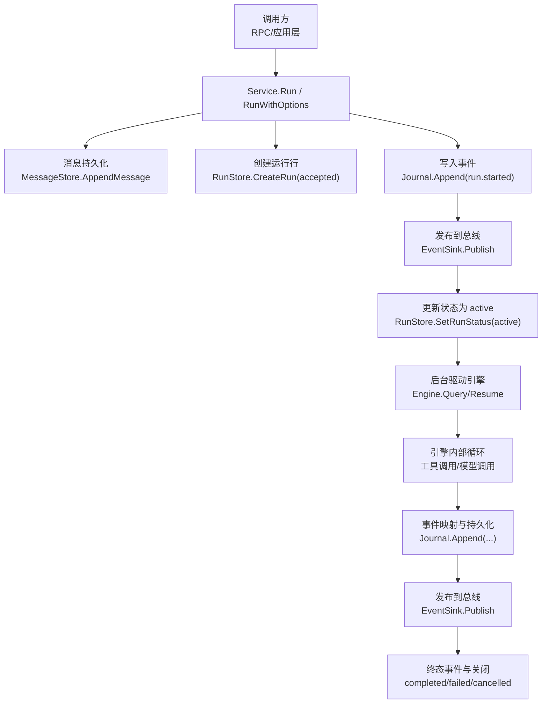
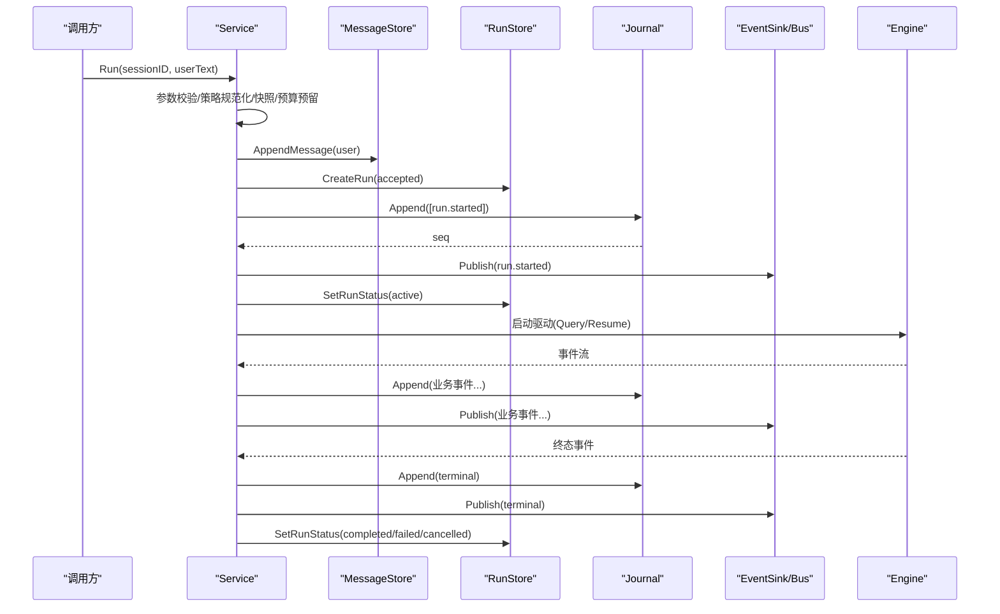
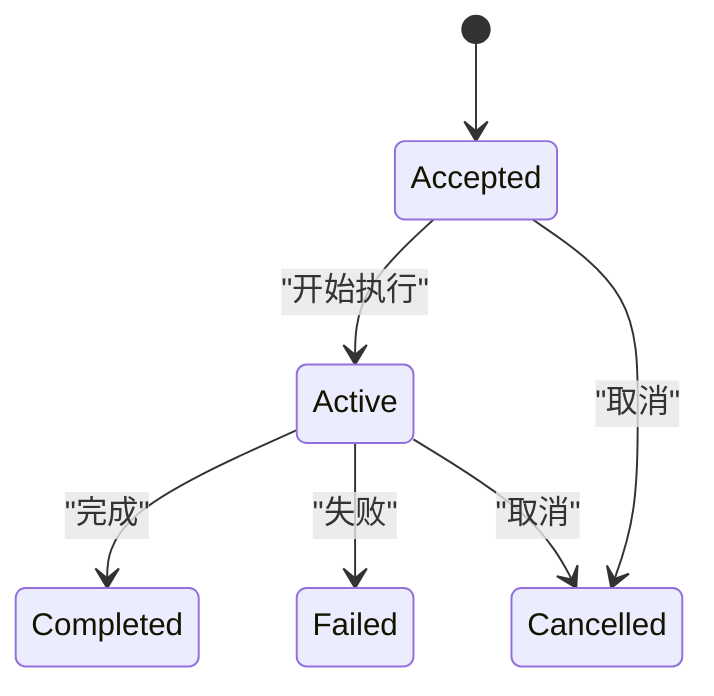
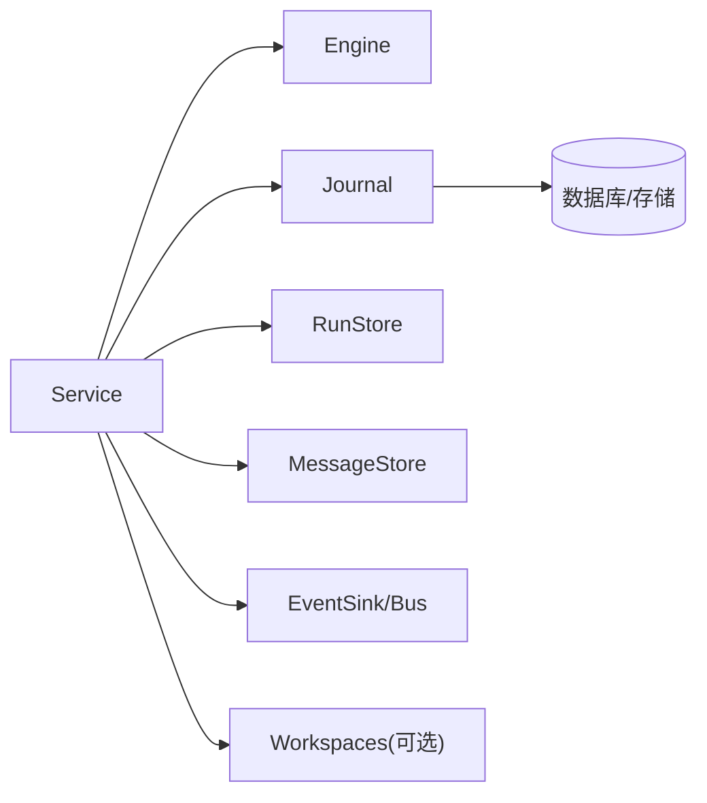

# 运行生命周期管理

<cite>
**本文引用的文件**
- [internal/runtime/service.go](file://internal/runtime/service.go)
- [internal/domain/run.go](file://internal/domain/run.go)
- [internal/storage/contracts.go](file://internal/storage/contracts.go)
- [internal/storage/sqlite/journal.go](file://internal/storage/sqlite/journal.go)
- [internal/events/bus.go](file://internal/events/bus.go)
- [internal/rpc/control.go](file://internal/rpc/control.go)
- [internal/runtime/engine.go](file://internal/runtime/engine.go)
- [internal/runtime/budget.go](file://internal/runtime/budget.go)
</cite>

## 目录
1. [简介](#简介)
2. [项目结构](#项目结构)
3. [核心组件](#核心组件)
4. [架构总览](#架构总览)
5. [详细组件分析](#详细组件分析)
6. [依赖关系分析](#依赖关系分析)
7. [性能考虑](#性能考虑)
8. [故障排查指南](#故障排查指南)
9. [结论](#结论)
10. [附录：使用示例与最佳实践](#附录使用示例与最佳实践)

## 简介
本文件围绕“运行生命周期管理”展开，聚焦 Run 方法的完整执行流程、RunWithOptions 的高级能力、状态机转换、原子性持久化保证、事件总线集成、并发安全与错误处理，以及性能优化建议。目标是帮助读者在不深入源码的情况下理解 Vivy 运行时如何启动、驱动、恢复并结束一次 Agent 运行，同时确保数据一致性与可观测性。

## 项目结构
围绕运行生命周期的关键代码分布在以下模块：
- internal/runtime：运行服务 Service、引擎 Engine、预算账本 BudgetLedger、策略与工具适配等
- internal/domain：领域模型与运行状态机（RunStatus、RunKind、Run）
- internal/storage：存储契约与具体实现（Journal、RunStore、MessageStore 等）
- internal/events：事件总线 Bus，用于持久化后的实时分发
- internal/rpc：RPC 参数校验与结果映射入口

图表来源
- [internal/runtime/service.go:212-300](file://internal/runtime/service.go#L212-L300)
- [internal/storage/contracts.go:55-64](file://internal/storage/contracts.go#L55-L64)
- [internal/events/bus.go:42-75](file://internal/events/bus.go#L42-L75)

章节来源
- [internal/runtime/service.go:212-300](file://internal/runtime/service.go#L212-L300)
- [internal/storage/contracts.go:55-64](file://internal/storage/contracts.go#L55-L64)
- [internal/events/bus.go:42-75](file://internal/events/bus.go#L42-L75)

## 核心组件
- Service：编排一次运行的完整生命周期，负责参数校验、策略规范化、快照生成、预算预留、用户消息与运行记录持久化、事件写入与发布、后台驱动引擎、取消与恢复。
- Engine：封装 Eino 的 Runner/Agent，提供 Query/RunHistory/Resume 等能力，并在配置中注入策略、检查点、工具钩子等。
- Journal：追加型、有序的事件日志，保证每个 Commit 原子写入，且对已存在终态事件的运行拒绝追加。
- RunStore/MessageStore：分别维护运行元数据与会话消息。
- EventSink/Bus：将持久化的事件广播给订阅者；终端事件会关闭流，后续消费需从 Journal 重放。
- BudgetLedger：按事件、模型调用、工具调用、重试次数进行配额控制，支持父子作用域与重启重放。

章节来源
- [internal/runtime/service.go:96-169](file://internal/runtime/service.go#L96-L169)
- [internal/runtime/engine.go:18-46](file://internal/runtime/engine.go#L18-L46)
- [internal/storage/contracts.go:55-64](file://internal/storage/contracts.go#L55-L64)
- [internal/events/bus.go:10-21](file://internal/events/bus.go#L10-L21)
- [internal/runtime/budget.go:11-20](file://internal/runtime/budget.go#L11-L20)

## 架构总览
运行生命周期由 Service 主导，遵循“先持久化、后可见”的原则：用户消息 → 运行行（accepted）→ run.started 事件 → 运行行（active），随后在分离的上下文中驱动引擎。所有中间事件通过 Journal 持久化后再发布到总线，终端事件受 Journal 的“恰好一个终态”约束保护。

图表来源
- [internal/runtime/service.go:212-300](file://internal/runtime/service.go#L212-L300)
- [internal/storage/sqlite/journal.go:48-75](file://internal/storage/sqlite/journal.go#L48-L75)
- [internal/events/bus.go:42-75](file://internal/events/bus.go#L42-L75)

## 详细组件分析

### Run 与 RunWithOptions 执行流程
- 前置校验与准备
  - 依赖注入检查（engine、journal、runs、messages、sink）
  - 策略规范化：normalizeRunPolicy 将 Mode/Profile 归一化
  - 策略快照：Snapshot(profile) 生成不可变策略快照，用于事件标记与子工作权威
  - 预算预留：NewBudgetLedger + ReserveEvent 预扣一次事件配额
  - 运行 ID 生成：newRunID()
  - 隔离工作区：Workspaces.Ensure(runID)（可选）
- 持久化序列（原子性保障的关键）
  - 写入用户消息：AppendMessage
  - 创建运行行：CreateRun(RunAccepted)
  - 写入 run.started：Journal.Append，返回 seq
  - 发布事件：publish(run.started)
  - 激活运行：SetRunStatus(RunActive)
- 异步驱动
  - 使用 context.WithoutCancel 分离请求上下文，避免 RPC 断开导致运行中断
  - 登记 active、ledger、snapshot 到进程内存
  - 启动 goroutine 调用 drive(...) 驱动引擎
- 返回值
  - 返回 runID，此时用户消息、accepted 行、run.started 事件均已持久化

章节来源
- [internal/runtime/service.go:212-300](file://internal/runtime/service.go#L212-L300)
- [internal/runtime/engine.go:144-165](file://internal/runtime/engine.go#L144-L165)

### 高级功能：RunWithOptions
- RunOptions 配置
  - Mode：运行模式（如 primary/child 等语义由上层策略决定）
  - Profile：策略配置文件名或标识，用于 Snapshot
- 策略规范化与快照
  - normalizeRunPolicy 将空或缺省值归一化为有效组合
  - Policy.Snapshot(profile) 生成包含哈希的策略快照，便于审计与一致性
- 预算预留
  - 在持久化任何用户数据前预留事件配额，防止无界增长
- 工作区隔离
  - 为每次运行分配独立的工作区 ID，增强安全性与可恢复性

章节来源
- [internal/runtime/service.go:143-147](file://internal/runtime/service.go#L143-L147)
- [internal/runtime/service.go:220-250](file://internal/runtime/service.go#L220-L250)

### 运行状态机：RunAccepted → RunActive → 终态
- 状态定义
  - accepted、queued、active、completed、failed、cancelled
- 合法转移
  - accepted → queued/active/cancelled
  - queued → active/cancelled
  - active → completed/failed/cancelled
  - 终态无出边，保证“恰好一个终态”
- 实现要点
  - CanTransitionTo/TransitionTo 提供领域级校验
  - Journal 层在已有终态事件时拒绝追加，形成双重保护

图表来源
- [internal/domain/run.go:8-29](file://internal/domain/run.go#L8-L29)
- [internal/storage/contracts.go:16-21](file://internal/storage/contracts.go#L16-L21)

章节来源
- [internal/domain/run.go:8-82](file://internal/domain/run.go#L8-L82)
- [internal/storage/contracts.go:16-21](file://internal/storage/contracts.go#L16-L21)

### 用户消息、运行记录、事件日志的原子性
- 顺序与事务边界
  - 用户消息与运行行（accepted）在调用侧依次写入
  - run.started 通过 Journal.Append 原子写入，返回 seq
  - 发布事件发生在持久化之后，确保“持久化优先于可见性”
- 终端事件保护
  - Journal 在已有终态事件时拒绝追加，防止重复终态
  - 设置运行状态为终态仅在终态事件持久化后执行
- 重放与一致性
  - 客户端可通过 after_seq 游标重放事件，保证最终一致

章节来源
- [internal/runtime/service.go:252-282](file://internal/runtime/service.go#L252-L282)
- [internal/storage/sqlite/journal.go:48-75](file://internal/storage/sqlite/journal.go#L48-L75)
- [internal/storage/contracts.go:55-64](file://internal/storage/contracts.go#L55-L64)

### 事件总线集成
- 发布时机
  - 每次 Journal.Append 成功后，立即 publish 对应事件
- 订阅行为
  - 非终端事件：缓冲投递，慢消费者会被丢弃，需从 Journal 重放
  - 终端事件：关闭所有订阅通道，表示该运行事件流结束
- 设计原则
  - 总线是优化层，不是历史源；真实历史来自 Journal

章节来源
- [internal/events/bus.go:10-21](file://internal/events/bus.go#L10-L21)
- [internal/events/bus.go:42-75](file://internal/events/bus.go#L42-L75)

### 取消与恢复
- 取消
  - Cancel：若运行处于 pending（等待审批/问题），则尝试取消相关交互并直接发出 run.cancelled；否则取消活跃运行的驱动 goroutine
  - CancelAll：批量取消所有活跃与挂起运行
- 恢复
  - Recover/RecoverBackground：启动时扫描 active runs，结合 pending approvals/questions 与 checkpoint 可读性重建 pending 或直接失败关闭
  - 子运行不重启，避免副作用重复执行

章节来源
- [internal/runtime/service.go:302-387](file://internal/runtime/service.go#L302-L387)
- [internal/runtime/service.go:465-576](file://internal/runtime/service.go#L465-L576)

### 预算与配额
- 预算维度
  - 事件数、模型调用、工具调用、重试次数
- 作用域
  - 根账本共享，子运行拥有更紧的本地上限，但不会绕过父限制
- 重启重放
  - ReplayEvent 根据事件类型回算用量，保证重启后配额一致

章节来源
- [internal/runtime/budget.go:11-20](file://internal/runtime/budget.go#L11-L20)
- [internal/runtime/budget.go:142-186](file://internal/runtime/budget.go#L142-L186)
- [internal/runtime/budget.go:198-220](file://internal/runtime/budget.go#L198-L220)

### 引擎与检查点
- 引擎能力
  - Query/RunHistory/Resume：支持流式执行与断点续跑
  - 工具选择与策略注入：通过工具适配器与策略引擎协同
- 检查点
  - 版本化 Blob 存储，支持中断点持久化与恢复
  - 恢复时需校验 checkpoint 可读性，否则走失败路径

章节来源
- [internal/runtime/engine.go:18-46](file://internal/runtime/engine.go#L18-L46)
- [internal/runtime/engine.go:144-165](file://internal/runtime/engine.go#L144-L165)

## 依赖关系分析
- Service 依赖
  - Engine：驱动模型与工具循环
  - Storage：Journal、RunStore、MessageStore、ApprovalStore、QuestionStore 等
  - Events：EventSink（由 Bus 实现）
  - Workspaces：可选隔离工作区
- 耦合与内聚
  - Service 聚合多依赖，但通过接口解耦；Journal 作为单一事实源，降低耦合
  - 状态机在 domain 层，存储层通过契约保证不变量

图表来源
- [internal/runtime/service.go:96-169](file://internal/runtime/service.go#L96-L169)
- [internal/storage/contracts.go:252-273](file://internal/storage/contracts.go#L252-L273)

章节来源
- [internal/runtime/service.go:96-169](file://internal/runtime/service.go#L96-L169)
- [internal/storage/contracts.go:252-273](file://internal/storage/contracts.go#L252-L273)

## 性能考虑
- 事件负载大小
  - MaxEventPayloadBytes 限制单条事件载荷，避免大对象阻塞总线与存储
- 流式缓冲
  - StreamBuffer 控制下游事件通道大小，平衡吞吐与内存
- 工具结果大小
  - MaxToolResultBytes 限制工具返回大小，减少上下文膨胀
- 预算限额
  - 合理设置 MaxEvents/MaxModelCalls/MaxToolCalls/MaxRetries，防止长尾任务耗尽资源
- 终止持久化超时
  - terminalPersistTimeout 限定终态持久化窗口，兼顾可靠性与响应时间

章节来源
- [internal/runtime/engine.go:18-46](file://internal/runtime/engine.go#L18-L46)
- [internal/runtime/service.go:24-27](file://internal/runtime/service.go#L24-L27)
- [internal/runtime/budget.go:22-27](file://internal/runtime/budget.go#L22-L27)

## 故障排查指南
- 常见错误
  - 服务未正确接线：runtime: service not wired
  - 运行已关闭：storage: run already has a terminal event（重复终态）
  - 提交无效：storage: invalid commit（空提交或多终态）
  - 预算超限：runtime: budget exceeded
  - 恢复忙碌：runtime: background runs are active
- 定位步骤
  - 检查 Journal.Append 是否成功并获取 seq
  - 确认 SetRunStatus 仅在终态事件持久化后调用
  - 查看总线订阅是否被终端事件关闭，必要时从 after_seq 重放
  - 核对预算策略与当前用量，必要时调整限额
- 恢复策略
  - 使用 Recover/RecoverBackground 处理重启后的悬挂运行
  - 对子运行一律失败关闭，避免副作用重复执行

章节来源
- [internal/storage/contracts.go:11-31](file://internal/storage/contracts.go#L11-L31)
- [internal/runtime/service.go:302-387](file://internal/runtime/service.go#L302-L387)
- [internal/runtime/service.go:465-576](file://internal/runtime/service.go#L465-L576)
- [internal/runtime/budget.go:57-73](file://internal/runtime/budget.go#L57-L73)

## 结论
Vivy 的运行生命周期以 Service 为核心，严格遵循“先持久化、后可见”的原则，借助 Journal 的追加型事件日志与状态机约束，确保运行状态的一致性与可重放性。RunWithOptions 提供了策略与预算的精细化控制，配合检查点机制实现中断恢复。通过事件总线实现高效的可观测性，同时保持对慢消费者的降级策略。整体设计在并发安全、错误处理与性能之间取得良好平衡。

## 附录：使用示例与最佳实践
- 启动运行
  - 使用 Run(sessionID, userText) 快速启动
  - 使用 RunWithOptions(sessionID, userText, options) 指定 Mode/Profile，获得更细粒度的控制
- 管理与监控
  - 通过 RPC 参数解析与结果映射接口查询运行状态
  - 订阅事件总线或使用 after_seq 重放事件，构建 UI 或审计视图
- 与存储层集成
  - 确保 Journal、RunStore、MessageStore 正确装配
  - 利用 Checkpoints 实现中断恢复
- 与事件总线集成
  - 将 EventSink 指向 events.Bus，实现持久化后的实时分发
- 并发与错误处理
  - 使用 Cancel/CancelAll 优雅终止运行
  - 捕获预算超限、运行关闭等错误，采取相应降级或告警
- 性能优化建议
  - 合理设置 MaxEventPayloadBytes、StreamBuffer、MaxToolResultBytes
  - 配置合适的预算限额，避免长尾任务影响整体稳定性

章节来源
- [internal/runtime/service.go:212-300](file://internal/runtime/service.go#L212-L300)
- [internal/rpc/control.go:980-1004](file://internal/rpc/control.go#L980-L1004)
- [internal/events/bus.go:42-75](file://internal/events/bus.go#L42-L75)
- [internal/runtime/engine.go:18-46](file://internal/runtime/engine.go#L18-L46)
- [internal/runtime/budget.go:22-27](file://internal/runtime/budget.go#L22-L27)