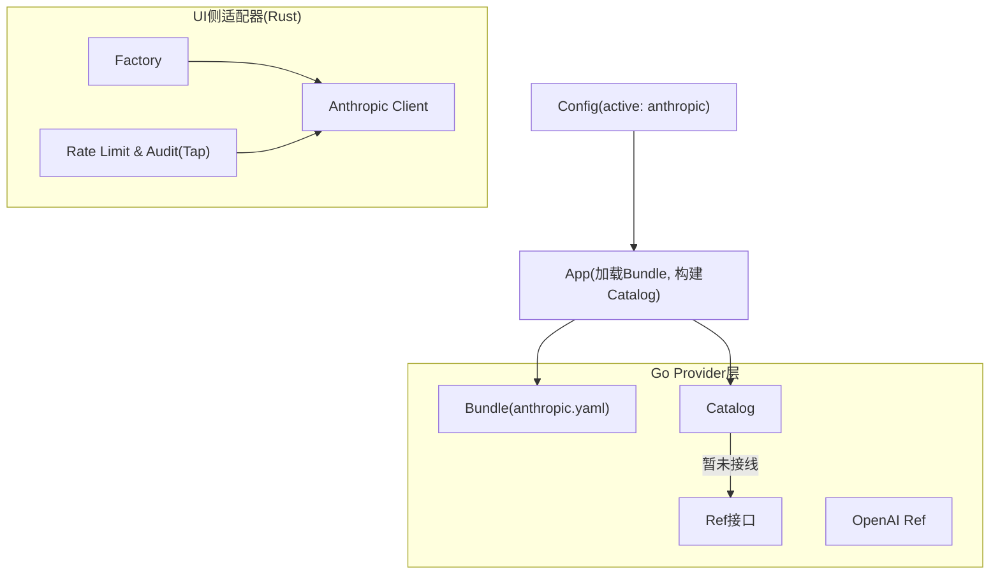
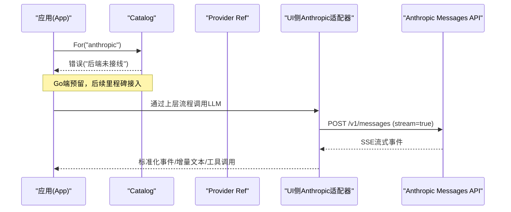
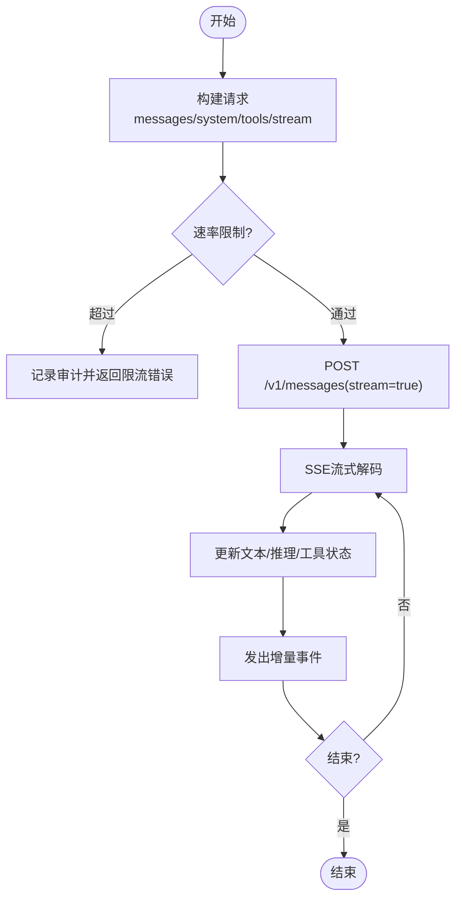
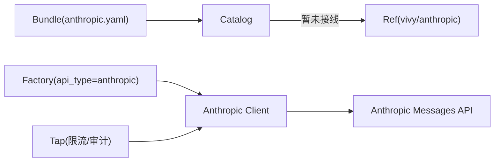

# Anthropic提供商集成

<cite>
**本文引用的文件**
- [internal/provider/bundle.go](file://internal/provider/bundle.go)
- [internal/provider/catalog.go](file://internal/provider/catalog.go)
- [internal/provider/ref.go](file://internal/provider/ref.go)
- [internal/provider/openai.go](file://internal/provider/openai.go)
- [fixtures/provider/anthropic.yaml](file://fixtures/provider/anthropic.yaml)
- [internal/config/config.go](file://internal/config/config.go)
- [internal/app/app.go](file://internal/app/app.go)
- [ui/agent-diva-source/agent-diva-providers/src/anthropic.rs](file://ui/agent-diva-source/agent-diva-providers/src/anthropic.rs)
- [ui/agent-diva-source/agent-diva-providers/src/factory.rs](file://ui/agent-diva-source/agent-diva-providers/src/factory.rs)
- [ui/agent-diva-source/agent-diva-providers/src/tap.rs](file://ui/agent-diva-source/agent-diva-providers/src/tap.rs)
- [README.md](file://README.md)
</cite>

## 目录
1. [简介](#简介)
2. [项目结构](#项目结构)
3. [核心组件](#核心组件)
4. [架构总览](#架构总览)
5. [详细组件分析](#详细组件分析)
6. [依赖关系分析](#依赖关系分析)
7. [性能考量](#性能考量)
8. [故障排查指南](#故障排查指南)
9. [结论](#结论)
10. [附录](#附录)

## 简介
本文件面向Vivy自研的Anthropic提供商集成，聚焦于“Anthropic Messages API”适配器的设计、数据流与实现要点。当前仓库处于“预留后端占位 + UI侧Rust实现已就绪”的阶段：Go端通过Bundle与Catalog声明并路由到“vivy/anthropic”后端，但尚未在Go中完成最终接入；同时，UI侧（Rust）提供了完整的Anthropic适配器，涵盖Claude模型支持、消息格式转换、系统提示、工具调用、流式响应、重试与限流等能力。本文基于仓库现有代码与配置进行说明，并在需要处给出迁移建议与最佳实践。

## 项目结构
- Provider层（Go）
  - Bundle定义与校验：描述Anthropic提供商元信息、默认模型、支持的模型列表、是否支持提示缓存、后端标识等。
  - Catalog：按名称解析Provider Ref，当前对“vivy/anthropic”返回“未接线”错误，作为里程碑预留。
  - Ref接口：统一对外暴露Model与ModelInfo，密钥读取在Ref实现内完成，遵循“密钥不持久化”红线。
- 配置与启动（Go）
  - 配置文件加载与校验，支持active选择openai或anthropic。
  - 应用启动时加载bundle，构建Catalog。
- UI侧适配器（Rust）
  - Anthropic客户端：构造请求、发送HTTP、流式解码、工具调用合并、重试、限流、审计事件等。
  - Factory：根据api_type创建对应Provider实例。
  - Tap：统一的速率限制与审计包装。

图表来源
- [internal/provider/bundle.go:14-53](file://internal/provider/bundle.go#L14-L53)
- [internal/provider/catalog.go:10-46](file://internal/provider/catalog.go#L10-L46)
- [internal/provider/ref.go:12-30](file://internal/provider/ref.go#L12-L30)
- [fixtures/provider/anthropic.yaml:7-31](file://fixtures/provider/anthropic.yaml#L7-L31)
- [ui/agent-diva-source/agent-diva-providers/src/factory.rs:42-69](file://ui/agent-diva-source/agent-diva-providers/src/factory.rs#L42-L69)
- [ui/agent-diva-source/agent-diva-providers/src/tap.rs:138-172](file://ui/agent-diva-source/agent-diva-providers/src/tap.rs#L138-L172)

章节来源
- [internal/provider/bundle.go:14-150](file://internal/provider/bundle.go#L14-L150)
- [internal/provider/catalog.go:10-59](file://internal/provider/catalog.go#L10-L59)
- [internal/provider/ref.go:12-43](file://internal/provider/ref.go#L12-L43)
- [fixtures/provider/anthropic.yaml:1-42](file://fixtures/provider/anthropic.yaml#L1-L42)
- [internal/config/config.go:92-99](file://internal/config/config.go#L92-L99)
- [internal/app/app.go:98-103](file://internal/app/app.go#L98-L103)

## 核心组件
- Bundle（Anthropic）
  - 声明API类型为anthropic，后端为vivy/anthropic，默认模型为claude-sonnet-4-5，支持提示缓存，列出当前代际模型。
  - 密钥环境变量名为ANTHROPIC_API_KEY，默认API Base为https://api.anthropic.com。
- Catalog
  - 负责将provider名称映射到具体Ref。当前对anthropic后端返回“未接线”错误，表示该路径将在后续里程碑落地。
- Ref接口
  - 抽象出Model与ModelInfo能力，强调“密钥在调用时从环境变量读取，永不持久化”。
- OpenAI Ref（对比参考）
  - 演示了如何在运行时读取密钥、构造模型、处理Base URL覆盖等模式，可作为Anthropic实现的参考。

章节来源
- [fixtures/provider/anthropic.yaml:7-31](file://fixtures/provider/anthropic.yaml#L7-L31)
- [internal/provider/catalog.go:27-46](file://internal/provider/catalog.go#L27-L46)
- [internal/provider/ref.go:12-43](file://internal/provider/ref.go#L12-L43)
- [internal/provider/openai.go:14-78](file://internal/provider/openai.go#L14-L78)

## 架构总览
Vivy采用“Bundle + Catalog + Ref”的统一Provider抽象。Anthropic以Bundle形式声明能力与默认值，Catalog负责解析与路由。当前Go端预留了vivy/anthropic后端但未实际接线；UI侧Rust实现了完整适配器，包含消息转换、系统提示、工具调用、流式响应、重试与限流。

图表来源
- [internal/provider/catalog.go:27-46](file://internal/provider/catalog.go#L27-L46)
- [ui/agent-diva-source/agent-diva-providers/src/anthropic.rs:382-436](file://ui/agent-diva-source/agent-diva-providers/src/anthropic.rs#L382-L436)

## 详细组件分析

### Anthropic Bundle与配置
- Bundle字段
  - name/api_type/backend：标识Anthropic及后端类型。
  - env_key：指定密钥环境变量名（ANTHROPIC_API_KEY）。
  - default_model/models：默认模型与可用模型列表。
  - supports_prompt_caching：标记支持提示缓存。
  - default_api_base：默认API地址。
- 配置加载
  - 配置文件支持active选择openai或anthropic。
  - 应用启动时加载bundle并构建Catalog。

章节来源
- [fixtures/provider/anthropic.yaml:7-31](file://fixtures/provider/anthropic.yaml#L7-L31)
- [internal/config/config.go:92-99](file://internal/config/config.go#L92-L99)
- [internal/app/app.go:98-103](file://internal/app/app.go#L98-L103)

### Catalog与Ref边界
- Catalog.For
  - 对mock始终可用；对anthropic后端返回“未接线”错误，确保不会误用。
- Ref接口
  - 明确Model与ModelInfo契约，强调密钥读取时机与安全边界。

章节来源
- [internal/provider/catalog.go:27-46](file://internal/provider/catalog.go#L27-L46)
- [internal/provider/ref.go:12-43](file://internal/provider/ref.go#L12-L43)

### UI侧Anthropic适配器（Rust）
- 消息格式转换
  - 将通用Message转换为Anthropic消息体，支持system提示、assistant内容块、tool使用与结果回填。
  - 系统提示可携带缓存控制（首段ephemeral），用于提示缓存优化。
- 工具调用
  - assistant消息中的tool_use会被收集并发送到API；tool角色消息需携带tool_call_id以回填结果。
- 流式响应
  - 使用SSE流式接收事件，边收边解码UTF-8，维护文本、推理内容与工具调用状态，逐步产出增量事件。
- 重试与限流
  - 发送前进行速率限制检查，超限则记录审计事件并返回限流错误。
  - 网络请求封装重试逻辑，提升稳定性。
- 默认模型与工厂
  - Factory根据api_type创建Anthropic客户端；默认模型来自Bundle或配置。

图表来源
- [ui/agent-diva-source/agent-diva-providers/src/anthropic.rs:382-436](file://ui/agent-diva-source/agent-diva-providers/src/anthropic.rs#L382-L436)
- [ui/agent-diva-source/agent-diva-providers/src/anthropic.rs:572-614](file://ui/agent-diva-source/agent-diva-providers/src/anthropic.rs#L572-L614)
- [ui/agent-diva-source/agent-diva-providers/src/tap.rs:138-172](file://ui/agent-diva-source/agent-diva-providers/src/tap.rs#L138-L172)

章节来源
- [ui/agent-diva-source/agent-diva-providers/src/anthropic.rs:207-249](file://ui/agent-diva-source/agent-diva-providers/src/anthropic.rs#L207-L249)
- [ui/agent-diva-source/agent-diva-providers/src/anthropic.rs:382-436](file://ui/agent-diva-source/agent-diva-providers/src/anthropic.rs#L382-L436)
- [ui/agent-diva-source/agent-diva-providers/src/anthropic.rs:572-614](file://ui/agent-diva-source/agent-diva-providers/src/anthropic.rs#L572-L614)
- [ui/agent-diva-source/agent-diva-providers/src/factory.rs:42-69](file://ui/agent-diva-source/agent-diva-providers/src/factory.rs#L42-L69)
- [ui/agent-diva-source/agent-diva-providers/src/tap.rs:138-172](file://ui/agent-diva-source/agent-diva-providers/src/tap.rs#L138-L172)

### Claude模型支持与特性适配
- 模型列表
  - 当前Bundle列出了四款当前代际Claude模型，默认模型为claude-sonnet-4-5。
- 系统提示
  - 支持将system提示拆分为多段，首段可带缓存控制以提升重复请求下的性能。
- 工具调用
  - 支持assistant侧的tool_use与tool侧的结果回填，要求tool消息携带tool_call_id。
- 安全过滤
  - 适配器层负责构造合规的请求体；若上游存在安全策略，应在网关或代理层配合。

章节来源
- [fixtures/provider/anthropic.yaml:12-31](file://fixtures/provider/anthropic.yaml#L12-L31)
- [ui/agent-diva-source/agent-diva-providers/src/anthropic.rs:207-249](file://ui/agent-diva-source/agent-diva-providers/src/anthropic.rs#L207-L249)
- [ui/agent-diva-source/agent-diva-providers/src/anthropic.rs:572-614](file://ui/agent-diva-source/agent-diva-providers/src/anthropic.rs#L572-L614)

### API密钥管理
- 密钥来源
  - Bundle声明env_key为ANTHROPIC_API_KEY；应用启动时加载bundle，运行期从环境变量读取。
- 安全边界
  - 密钥仅在调用时读取，不持久化、不缓存；日志与快照需脱敏。
- 环境覆盖
  - 对于OpenAI兼容网关可通过环境变量覆盖Base URL；Anthropic路径类似地可通过配置或网关调整。

章节来源
- [fixtures/provider/anthropic.yaml:12-22](file://fixtures/provider/anthropic.yaml#L12-L22)
- [internal/provider/ref.go:12-43](file://internal/provider/ref.go#L12-L43)
- [internal/provider/openai.go:27-40](file://internal/provider/openai.go#L27-L40)
- [README.md:44-52](file://README.md#L44-L52)

### 请求限流与错误处理
- 限流
  - UI侧Tap在每次chat_stream前进行速率限制检查，超限记录审计事件并返回限流错误。
- 重试
  - 网络请求封装重试逻辑，提高不稳定网络下的成功率。
- 错误分类
  - 密钥缺失、配置错误、网络错误、限流错误等均有明确路径与审计记录。

章节来源
- [ui/agent-diva-source/agent-diva-providers/src/tap.rs:138-172](file://ui/agent-diva-source/agent-diva-providers/src/tap.rs#L138-L172)
- [ui/agent-diva-source/agent-diva-providers/src/anthropic.rs:382-436](file://ui/agent-diva-source/agent-diva-providers/src/anthropic.rs#L382-L436)

### 与OpenAI提供商的差异与迁移指南
- 差异点
  - Anthropic使用独立Messages API与消息体结构；OpenAI走OpenAI兼容协议。
  - Anthropic对system提示与工具调用有特定格式要求；OpenAI通过标准消息与function/tool schema。
  - 限流与重试策略在UI侧Tap中统一处理，但不同Provider的具体行为可能不同。
- 迁移步骤
  - 切换active为anthropic，并确保ANTHROPIC_API_KEY已设置。
  - 确认Bundle中models与default_model与实际可用模型一致。
  - 若使用工具调用，确保消息序列正确包含assistant tool_use与tool结果回填。
  - 如需提示缓存，保持system首段带缓存控制。
  - 监控限流与重试日志，必要时调整并发与重试参数。

章节来源
- [internal/config/config.go:92-99](file://internal/config/config.go#L92-L99)
- [fixtures/provider/anthropic.yaml:12-31](file://fixtures/provider/anthropic.yaml#L12-L31)
- [ui/agent-diva-source/agent-diva-providers/src/anthropic.rs:207-249](file://ui/agent-diva-source/agent-diva-providers/src/anthropic.rs#L207-L249)
- [ui/agent-diva-source/agent-diva-providers/src/tap.rs:138-172](file://ui/agent-diva-source/agent-diva-providers/src/tap.rs#L138-L172)

## 依赖关系分析
- Bundle依赖
  - YAML bundle提供模型列表、默认模型、后端标识与提示缓存能力。
- Catalog依赖
  - 根据backend字段决定如何解析Ref；当前anthropic后端未接线。
- UI适配器依赖
  - 通过Factory按api_type创建Anthropic客户端；Tap提供限流与审计。

图表来源
- [internal/provider/bundle.go:14-53](file://internal/provider/bundle.go#L14-L53)
- [internal/provider/catalog.go:27-46](file://internal/provider/catalog.go#L27-L46)
- [ui/agent-diva-source/agent-diva-providers/src/factory.rs:42-69](file://ui/agent-diva-source/agent-diva-providers/src/factory.rs#L42-L69)
- [ui/agent-diva-source/agent-diva-providers/src/tap.rs:138-172](file://ui/agent-diva-source/agent-diva-providers/src/tap.rs#L138-L172)

章节来源
- [internal/provider/bundle.go:14-150](file://internal/provider/bundle.go#L14-L150)
- [internal/provider/catalog.go:10-59](file://internal/provider/catalog.go#L10-L59)
- [ui/agent-diva-source/agent-diva-providers/src/factory.rs:42-69](file://ui/agent-diva-source/agent-diva-providers/src/factory.rs#L42-L69)
- [ui/agent-diva-source/agent-diva-providers/src/tap.rs:138-172](file://ui/agent-diva-source/agent-diva-providers/src/tap.rs#L138-L172)

## 性能考量
- 提示缓存
  - 系统提示首段可带缓存控制，减少重复请求成本。
- 流式响应
  - 使用SSE流式输出，降低首字延迟，提升交互体验。
- 限流与重试
  - 合理设置并发与重试次数，避免触发上游限流；结合审计事件定位瓶颈。
- 模型选择
  - 根据任务复杂度选择合适Claude模型，平衡质量与成本。

[本节为通用指导，不直接分析具体文件]

## 故障排查指南
- 密钥缺失
  - 现象：调用时报密钥缺失错误。
  - 处理：确保ANTHROPIC_API_KEY已设置且非空。
- 后端未接线
  - 现象：Catalog.For("anthropic")返回“未接线”错误。
  - 处理：当前Go端预留，后续里程碑接入；可优先使用UI侧适配器路径。
- 限流
  - 现象：请求被限流，返回限流错误。
  - 处理：降低并发或等待retry_after；查看审计事件定位。
- 工具调用失败
  - 现象：tool消息缺少tool_call_id导致错误。
  - 处理：确保tool消息携带正确的tool_call_id以回填结果。

章节来源
- [internal/provider/ref.go:32-43](file://internal/provider/ref.go#L32-L43)
- [internal/provider/catalog.go:27-46](file://internal/provider/catalog.go#L27-L46)
- [ui/agent-diva-source/agent-diva-providers/src/tap.rs:138-172](file://ui/agent-diva-source/agent-diva-providers/src/tap.rs#L138-L172)
- [ui/agent-diva-source/agent-diva-providers/src/anthropic.rs:572-614](file://ui/agent-diva-source/agent-diva-providers/src/anthropic.rs#L572-L614)

## 结论
Vivy对Anthropic的集成采用“Bundle + Catalog + Ref”的统一抽象，当前Go端预留了vivy/anthropic后端，UI侧Rust适配器已具备完整能力：支持Claude模型、系统提示、工具调用、流式响应、重试与限流。生产使用中应确保密钥安全、合理配置模型与限流策略，并结合审计事件持续优化。后续里程碑可在Go端完成最终接线，进一步统一调用路径。

[本节为总结性内容，不直接分析具体文件]

## 附录
- 快速开始与环境
  - 通过环境变量设置OPENAI_API_KEY/ANTHROPIC_API_KEY；容器发布仅暴露8787端口。
- 配置示例
  - active: anthropic
  - providers.active: anthropic
  - 确保ANTHROPIC_API_KEY已设置。

章节来源
- [README.md:44-52](file://README.md#L44-L52)
- [internal/config/config.go:92-99](file://internal/config/config.go#L92-L99)