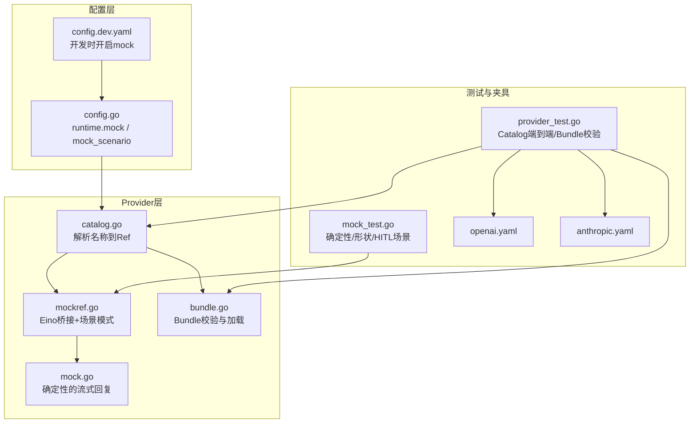
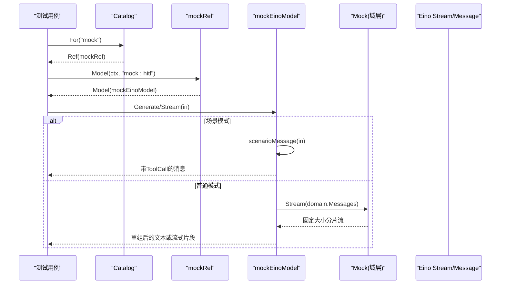
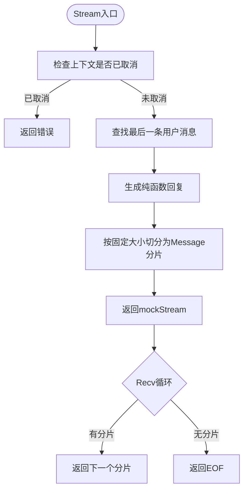
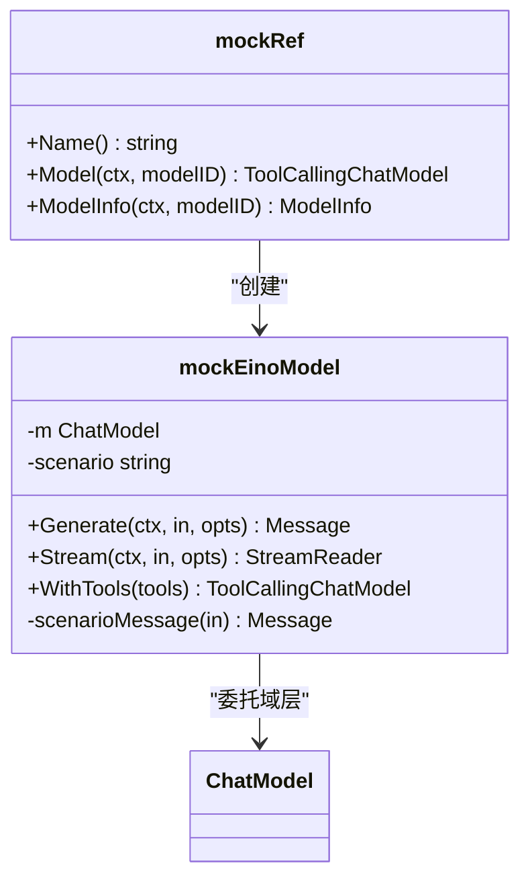
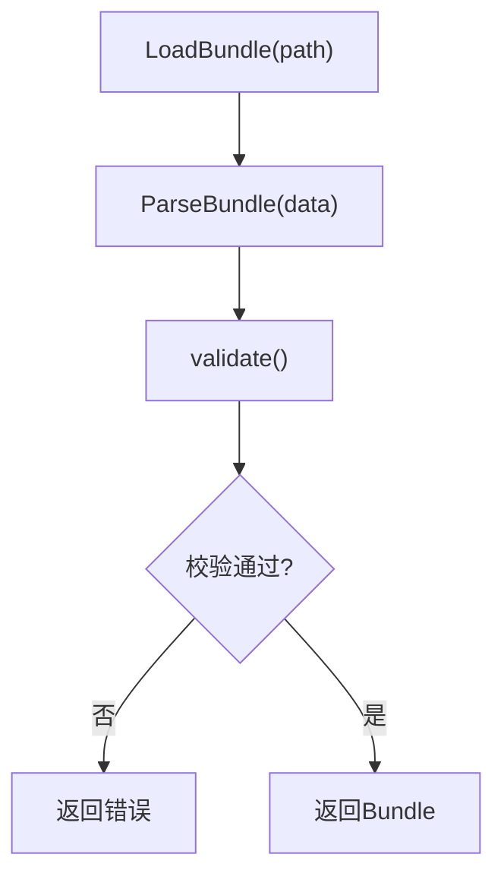
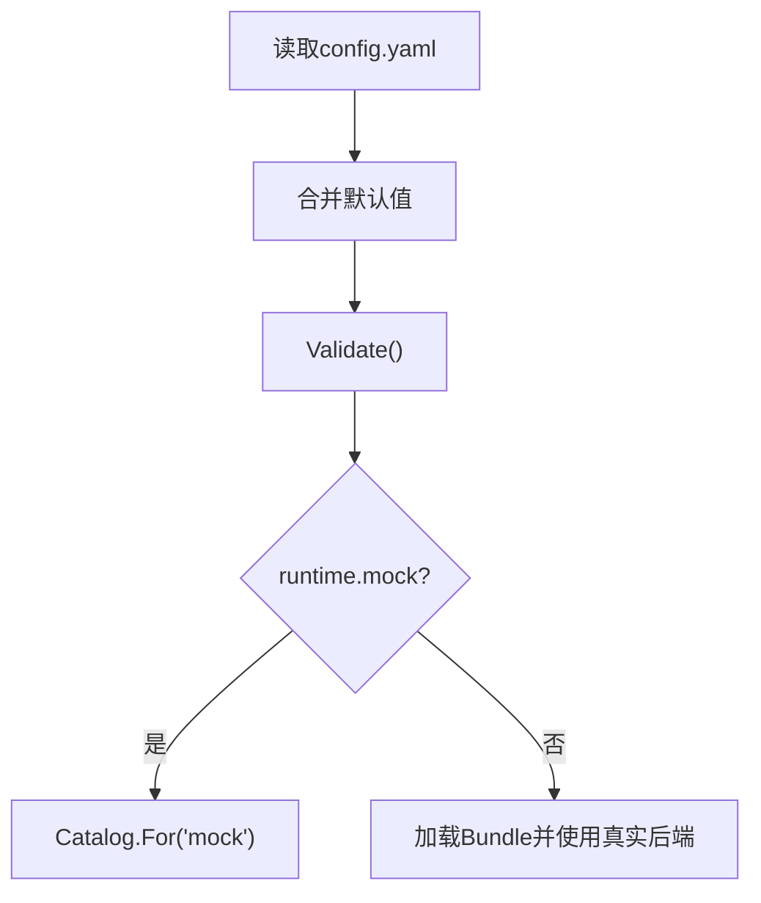
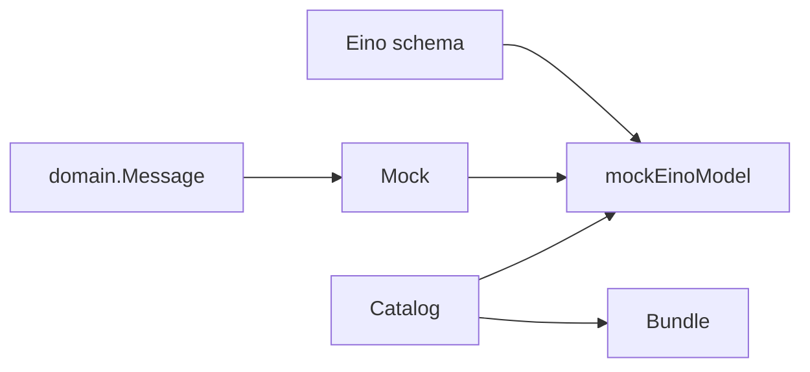

# Mock提供商测试

<cite>
**本文引用的文件**
- [mock.go](file://internal/provider/mock.go)
- [mock_test.go](file://internal/provider/mock_test.go)
- [mockref.go](file://internal/provider/mockref.go)
- [catalog.go](file://internal/provider/catalog.go)
- [bundle.go](file://internal/provider/bundle.go)
- [provider_test.go](file://internal/provider/provider_test.go)
- [config.go](file://internal/config/config.go)
- [openai.yaml](file://fixtures/provider/openai.yaml)
- [anthropic.yaml](file://fixtures/provider/anthropic.yaml)
- [config.dev.yaml](file://config.dev.yaml)
</cite>

## 目录
1. [简介](#简介)
2. [项目结构](#项目结构)
3. [核心组件](#核心组件)
4. [架构总览](#架构总览)
5. [详细组件分析](#详细组件分析)
6. [依赖关系分析](#依赖关系分析)
7. [性能与可观测性](#性能与可观测性)
8. [故障排查指南](#故障排查指南)
9. [结论](#结论)
10. [附录：测试示例与环境搭建](#附录测试示例与环境搭建)

## 简介
本文件围绕“Mock提供商”的测试实现进行系统化说明，覆盖以下目标：
- 模拟API响应、测试数据生成、断言验证机制
- 在单元测试与集成测试中的应用场景
- 如何模拟不同模型的响应行为、错误场景、性能特征
- 测试用例编写规范、测试数据管理、断言策略
- 完整测试示例与调试技巧
- 与真实提供商的切换配置与测试环境搭建

Mock提供商的核心价值在于：确定性（相同输入产生相同输出）、无网络、无时钟依赖、可回放流式分片，从而为测试提供稳定、可重复、可审计的执行路径。

## 项目结构
与Mock测试直接相关的代码集中在 internal/provider 包中，并通过 catalog 暴露统一入口；配置通过 internal/config 控制是否启用Mock及选择特定场景；测试夹具位于 fixtures/provider。

图表来源
- [mock.go:1-76](file://internal/provider/mock.go#L1-L76)
- [mockref.go:1-202](file://internal/provider/mockref.go#L1-L202)
- [catalog.go:1-59](file://internal/provider/catalog.go#L1-L59)
- [bundle.go:1-150](file://internal/provider/bundle.go#L1-L150)
- [config.go:110-153](file://internal/config/config.go#L110-L153)
- [config.dev.yaml:1-5](file://config.dev.yaml#L1-L5)
- [mock_test.go:1-145](file://internal/provider/mock_test.go#L1-L145)
- [provider_test.go:1-247](file://internal/provider/provider_test.go#L1-L247)
- [openai.yaml:1-50](file://fixtures/provider/openai.yaml#L1-L50)
- [anthropic.yaml:1-42](file://fixtures/provider/anthropic.yaml#L1-L42)

章节来源
- [mock.go:1-76](file://internal/provider/mock.go#L1-L76)
- [mockref.go:1-202](file://internal/provider/mockref.go#L1-L202)
- [catalog.go:1-59](file://internal/provider/catalog.go#L1-L59)
- [bundle.go:1-150](file://internal/provider/bundle.go#L1-L150)
- [config.go:110-153](file://internal/config/config.go#L110-L153)
- [config.dev.yaml:1-5](file://config.dev.yaml#L1-L5)
- [mock_test.go:1-145](file://internal/provider/mock_test.go#L1-L145)
- [provider_test.go:1-247](file://internal/provider/provider_test.go#L1-L247)
- [openai.yaml:1-50](file://fixtures/provider/openai.yaml#L1-L50)
- [anthropic.yaml:1-42](file://fixtures/provider/anthropic.yaml#L1-L42)

## 核心组件
- Mock流式提供者：固定大小分片、纯函数回复、支持上下文取消
- Eino桥接模型：将domain级Mock适配为ToolCallingChatModel，并支持“场景模式”以触发工具调用
- Catalog注册表：统一解析“mock”或已加载Bundle对应的Ref
- Bundle加载与校验：严格解码、字段白名单、来源追溯
- 配置开关：runtime.mock 与 runtime.mock_scenario 控制Mock行为与场景

章节来源
- [mock.go:10-76](file://internal/provider/mock.go#L10-L76)
- [mockref.go:23-134](file://internal/provider/mockref.go#L23-L134)
- [catalog.go:10-59](file://internal/provider/catalog.go#L10-L59)
- [bundle.go:28-150](file://internal/provider/bundle.go#L28-L150)
- [config.go:110-153](file://internal/config/config.go#L110-L153)

## 架构总览
Mock提供商通过两条路径被使用：
- 单元测试路径：直接调用 NewMock().Stream(...)，用于验证流式分片、确定性、空输入等
- 集成/端到端路径：通过 Catalog.For("mock") 获取 Ref，再构造 Model，走 Eino ToolCallingChatModel 接口；当 modelID 以 “mock:” 开头时进入场景模式，返回固定的工具调用消息，驱动审批、提问、超时、陈旧内容等HITL路径

图表来源
- [catalog.go:27-45](file://internal/provider/catalog.go#L27-L45)
- [mockref.go:23-134](file://internal/provider/mockref.go#L23-L134)
- [mock.go:23-52](file://internal/provider/mock.go#L23-L52)

## 详细组件分析

### Mock流式提供者（mock.go）
- 设计要点
  - 固定分片大小（字节数），保证运行可复现（FR-3）
  - 回复是用户最后一条消息内容的纯函数，无随机、无网络、无时钟
  - 支持上下文取消：每次 Recv 前检查 ctx.Err()
- 数据结构与复杂度
  - 预计算分片列表，时间复杂度 O(n)，空间复杂度 O(n)
  - 最后一个分片可能小于固定大小
- 错误处理
  - 流结束返回 EOF
  - 传入已取消的上下文立即返回错误
- 优化点
  - 避免字符串拼接，使用rune切片按块切分
  - 固定分片便于断言与回放

图表来源
- [mock.go:23-76](file://internal/provider/mock.go#L23-L76)

章节来源
- [mock.go:10-76](file://internal/provider/mock.go#L10-L76)

### Eino桥接与场景模式（mockref.go）
- 职责
  - 将 domain.ChatModel 适配为 Eino 的 ToolCallingChatModel
  - 普通模式：将 domain 流转换为 Eino 流，或聚合为单条消息
  - 场景模式：根据 modelID 前缀 “mock:” 决定场景，返回固定工具调用消息，驱动HITL流程
- 关键逻辑
  - Generate 会先尝试 Stream，若场景模式则直接返回固定消息
  - Stream 在场景模式下通过管道发送单条消息；非场景模式下桥接 domain 流
  - scenarioMessage 基于最后一条用户消息与历史判断是否已有工具结果，从而决定返回文本还是工具调用
- 场景映射
  - approval/timeout -> write_note
  - question -> ask_user
  - stale -> write_file
  - 其他 -> 普通文本回复

图表来源
- [mockref.go:14-202](file://internal/provider/mockref.go#L14-L202)

章节来源
- [mockref.go:23-202](file://internal/provider/mockref.go#L23-L202)

### Catalog与Bundle（catalog.go, bundle.go）
- Catalog
  - 解析 provider 名称到 Ref，“mock”始终可用
  - 对已加载的Bundle进行索引，后续可扩展更多后端
- Bundle
  - 严格解码YAML，未知字段拒绝
  - 校验必填字段、API类型、后端、模型列表、来源追溯
  - 支持每模型覆盖（如 APIBase、缓存能力）

图表来源
- [bundle.go:71-150](file://internal/provider/bundle.go#L71-L150)

章节来源
- [catalog.go:10-59](file://internal/provider/catalog.go#L10-L59)
- [bundle.go:28-150](file://internal/provider/bundle.go#L28-L150)

### 配置与切换（config.go, config.dev.yaml）
- runtime.mock：启用Mock提供商（测试/离线开发）
- runtime.mock_scenario：选择场景（hitl/approval/question/timeout/stale），仅在Mock启用时允许
- 开发配置：config.dev.yaml 默认开启 mock=true，便于本地联调

图表来源
- [config.go:110-153](file://internal/config/config.go#L110-L153)
- [config.go:387-396](file://internal/config/config.go#L387-L396)
- [config.dev.yaml:1-5](file://config.dev.yaml#L1-L5)

章节来源
- [config.go:110-153](file://internal/config/config.go#L110-L153)
- [config.go:387-396](file://internal/config/config.go#L387-L396)
- [config.dev.yaml:1-5](file://config.dev.yaml#L1-L5)

## 依赖关系分析
- Mock内部仅依赖 domain.Message 与 context/io，保持最小耦合
- mockref 依赖 Eino 的 schema 与 model 接口，作为Provider与上层Agent之间的适配层
- Catalog 解耦具体Provider实现，便于扩展与替换
- Bundle 与 Catalog 共同构成Provider注册体系，Mock作为内置项始终可用

图表来源
- [mock.go:1-76](file://internal/provider/mock.go#L1-L76)
- [mockref.go:1-202](file://internal/provider/mockref.go#L1-L202)
- [catalog.go:1-59](file://internal/provider/catalog.go#L1-L59)
- [bundle.go:1-150](file://internal/provider/bundle.go#L1-L150)

章节来源
- [mock.go:1-76](file://internal/provider/mock.go#L1-L76)
- [mockref.go:1-202](file://internal/provider/mockref.go#L1-L202)
- [catalog.go:1-59](file://internal/provider/catalog.go#L1-L59)
- [bundle.go:1-150](file://internal/provider/bundle.go#L1-L150)

## 性能与可观测性
- 性能特性
  - 固定分片大小使内存占用可控，适合流式消费
  - 无网络IO，CPU开销极低，适合高并发测试
- 可观测性
  - 流式事件可通过Eino StreamReader观察
  - 场景模式下的工具调用可作为断言点，便于追踪审批/提问路径
- 资源限制
  - 可通过配置限制事件负载大小、流缓冲等（见配置层）

[本节为通用指导，不直接分析具体文件]

## 故障排查指南
- 常见问题
  - 上下文提前取消：Stream入口即报错，需检查调用方ctx生命周期
  - 场景模式未生效：确认modelID是否以“mock:”开头，且配置中启用了Mock
  - Bundle校验失败：检查必填字段、API类型、后端、模型列表与来源追溯
- 定位方法
  - 使用 provider_test.go 中的端到端用例验证Catalog->Ref->Model链路
  - 使用 mock_test.go 验证流式分片、确定性、空输入、取消等边界
  - 检查 fixtures/provider/*.yaml 是否符合schema

章节来源
- [mock.go:23-52](file://internal/provider/mock.go#L23-L52)
- [mock_test.go:27-95](file://internal/provider/mock_test.go#L27-L95)
- [provider_test.go:16-105](file://internal/provider/provider_test.go#L16-L105)
- [bundle.go:71-150](file://internal/provider/bundle.go#L71-L150)

## 结论
Mock提供商通过确定性、无外部依赖、可回放的分流机制，为Vivy提供了稳定的测试基座。配合Catalog与Bundle体系，可在单元测试与集成测试中无缝切换至真实提供商，同时利用场景模式驱动完整的HITL路径，确保功能与体验的一致性。

[本节为总结，不直接分析具体文件]

## 附录：测试示例与环境搭建

### 测试用例编写规范
- 确定性断言：同一输入两次运行，分片数量与内容必须一致
- 形状断言：角色必须为助手，内容拼接后符合预期
- 分片断言：除尾部外，每个分片的rune长度等于固定大小
- 空输入断言：无用户消息时仍应返回以“mock:”开头的提示
- 取消断言：传入已取消的上下文应立即返回错误
- HITL场景：通过“mock:”前缀触发工具调用，验证审批/提问/陈旧内容等路径

章节来源
- [mock_test.go:27-145](file://internal/provider/mock_test.go#L27-L145)

### 测试数据管理
- 使用 fixtures/provider/*.yaml 作为Bundle夹具，校验加载与解析
- 通过 Catalog.For("mock") 获取Ref，避免硬编码实现细节
- 场景模式通过 modelID 前缀区分，无需修改业务代码

章节来源
- [provider_test.go:16-54](file://internal/provider/provider_test.go#L16-L54)
- [provider_test.go:195-239](file://internal/provider/provider_test.go#L195-L239)
- [mockref.go:23-29](file://internal/provider/mockref.go#L23-L29)

### 断言策略
- 文本断言：拼接流式内容后与期望字符串比较
- 工具调用断言：验证Function.Name与Arguments结构
- 错误断言：结构化错误类型与字段（如KeyMissingError）
- 配置断言：校验env_key格式、默认模型、后端等

章节来源
- [mock_test.go:49-145](file://internal/provider/mock_test.go#L49-L145)
- [provider_test.go:107-130](file://internal/provider/provider_test.go#L107-L130)
- [bundle.go:96-150](file://internal/provider/bundle.go#L96-L150)

### 完整测试示例（路径引用）
- 流式分片与确定性：[mock_test.go:27-76](file://internal/provider/mock_test.go#L27-L76)
- 空输入与取消：[mock_test.go:78-95](file://internal/provider/mock_test.go#L78-L95)
- HITL审批与提问：[mock_test.go:97-145](file://internal/provider/mock_test.go#L97-L145)
- Catalog端到端：[provider_test.go:195-239](file://internal/provider/provider_test.go#L195-L239)
- Bundle加载与校验：[provider_test.go:16-105](file://internal/provider/provider_test.go#L16-L105)

### 调试技巧
- 打印流式分片：在Stream循环中记录每个chunk的内容与角色
- 场景模式调试：通过modelID前缀快速切换到approval/question/stale等场景
- 配置调试：检查runtime.mock与runtime.mock_scenario是否正确设置
- 环境隔离：确保测试环境中未设置真实API密钥，避免误发请求

章节来源
- [mockref.go:55-134](file://internal/provider/mockref.go#L55-L134)
- [config.go:387-396](file://internal/config/config.go#L387-L396)
- [provider_test.go:241-247](file://internal/provider/provider_test.go#L241-L247)

### 与真实提供商的切换配置
- 启用Mock：在配置文件中设置 runtime.mock = true
- 选择场景：设置 runtime.mock_scenario 为 hitl/approval/question/timeout/stale
- 切换真实提供商：设置 providers.active 为 openai 或 anthropic，并确保Bundle目录正确
- 开发环境：使用 config.dev.yaml 快速开启Mock

章节来源
- [config.go:110-153](file://internal/config/config.go#L110-L153)
- [config.go:387-396](file://internal/config/config.go#L387-L396)
- [config.dev.yaml:1-5](file://config.dev.yaml#L1-L5)
- [bundle.go:14-21](file://internal/provider/bundle.go#L14-L21)

### 测试环境搭建指南
- 准备Bundle夹具：确保 fixtures/provider/openai.yaml 与 anthropic.yaml 存在且有效
- 清理环境变量：测试前移除 OPENAI_API_KEY 与 ANTHROPIC_API_KEY，避免误用
- 启动测试：运行 provider 包的测试，验证Mock与Bundle加载
- 集成测试：通过 Catalog.For("mock") 获取Ref，构造Model并执行Generate/Stream

章节来源
- [provider_test.go:241-247](file://internal/provider/provider_test.go#L241-L247)
- [openai.yaml:1-50](file://fixtures/provider/openai.yaml#L1-L50)
- [anthropic.yaml:1-42](file://fixtures/provider/anthropic.yaml#L1-L42)