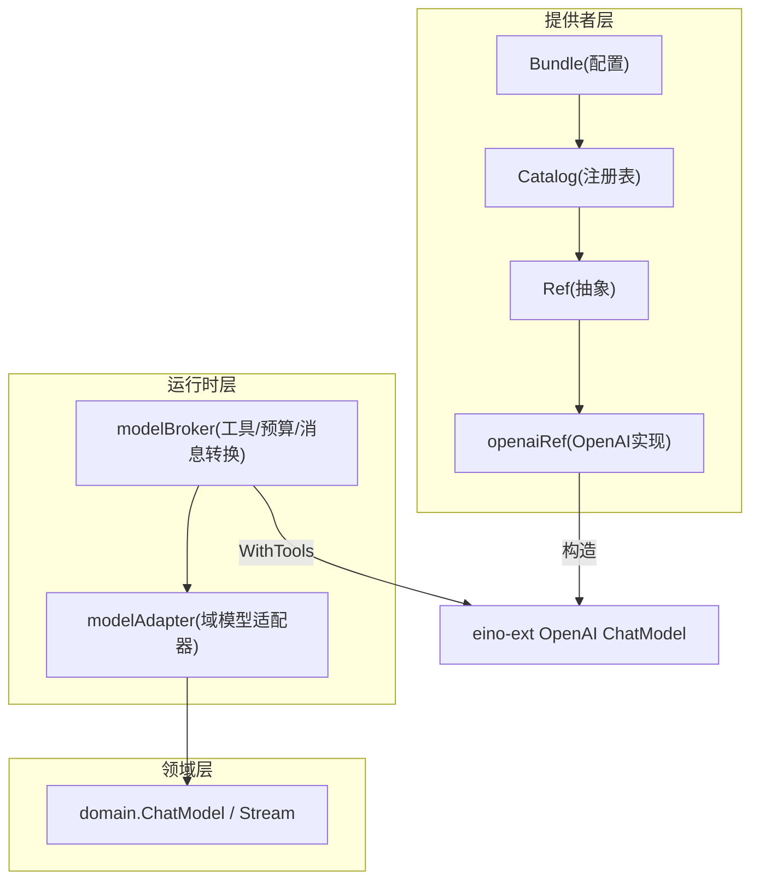
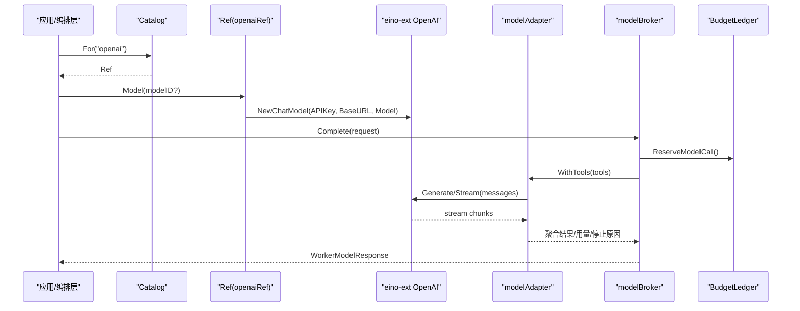
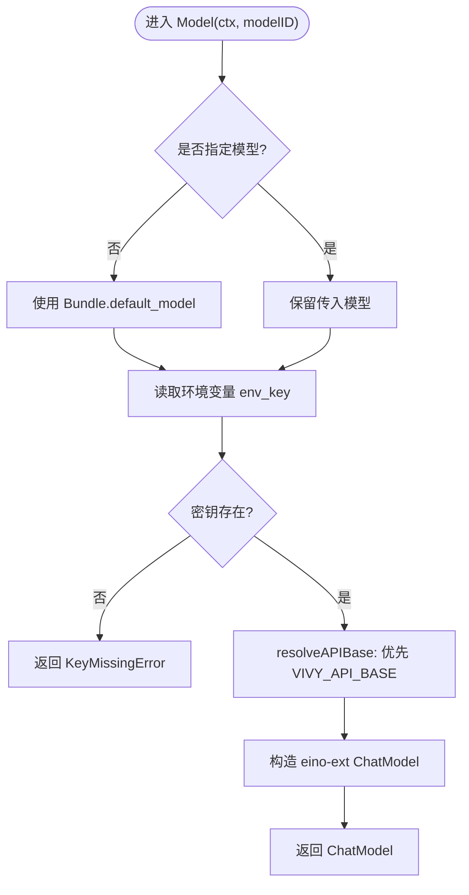
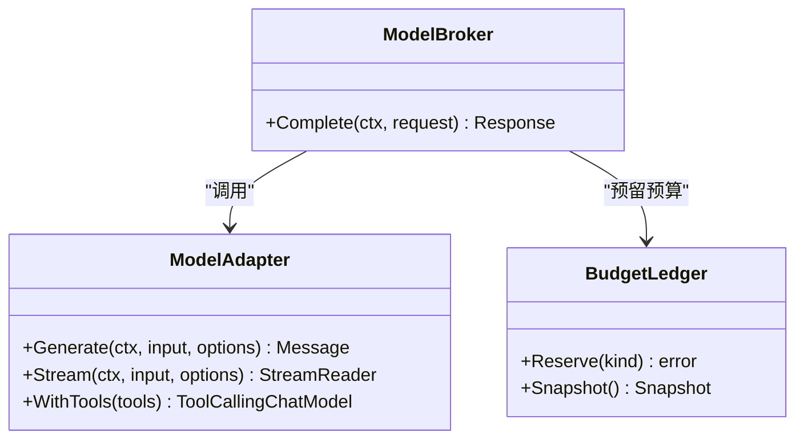
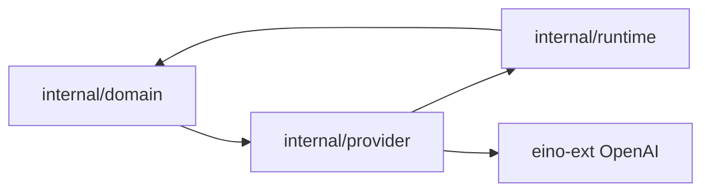

# OpenAI提供商集成

<cite>
**本文引用的文件**
- [internal/provider/openai.go](file://internal/provider/openai.go)
- [internal/provider/bundle.go](file://internal/provider/bundle.go)
- [internal/provider/catalog.go](file://internal/provider/catalog.go)
- [internal/provider/ref.go](file://internal/provider/ref.go)
- [fixtures/provider/openai.yaml](file://fixtures/provider/openai.yaml)
- [internal/domain/model.go](file://internal/domain/model.go)
- [internal/runtime/modeladapter.go](file://internal/runtime/modeladapter.go)
- [internal/runtime/modelbroker.go](file://internal/runtime/modelbroker.go)
- [internal/runtime/budget.go](file://internal/runtime/budget.go)
- [config.example.yaml](file://config.example.yaml)
</cite>

## 目录
1. [简介](#简介)
2. [项目结构](#项目结构)
3. [核心组件](#核心组件)
4. [架构总览](#架构总览)
5. [详细组件分析](#详细组件分析)
6. [依赖关系分析](#依赖关系分析)
7. [性能与成本优化](#性能与成本优化)
8. [故障排查指南](#故障排查指南)
9. [结论](#结论)
10. [附录：配置与使用示例](#附录配置与使用示例)

## 简介
本文件面向基于 Eino 框架的 OpenAI 提供商集成，聚焦 Vivy 内核中 provider 层对 eino-ext OpenAI 组件的封装、消息与工具调用适配、流式响应处理、错误与重试策略、密钥管理、速率限制与成本优化，以及与 Eino 框架的集成细节和性能调优建议。文档同时提供可操作的配置示例、使用模式与故障排查指引，帮助读者在生产环境中稳定、安全地运行 OpenAI 兼容接口。

## 项目结构
Vivy 将“Eino 及参考项目类型”严格隔离在 internal/provider 与 internal/runtime 两个包内，其他层（如 UI 契约）不得直接依赖 Eino。OpenAI 提供商的实现位于 internal/provider，通过 Catalog 解析 bundle 并返回 Ref；运行时在 internal/runtime 完成 domain 与 Eino 之间的桥接与工具绑定、预算控制与事件回放。

图表来源
- [internal/provider/bundle.go:28-53](file://internal/provider/bundle.go#L28-L53)
- [internal/provider/catalog.go:10-46](file://internal/provider/catalog.go#L10-L46)
- [internal/provider/ref.go:12-30](file://internal/provider/ref.go#L12-L30)
- [internal/provider/openai.go:14-78](file://internal/provider/openai.go#L14-L78)
- [internal/runtime/modeladapter.go:14-26](file://internal/runtime/modeladapter.go#L14-L26)
- [internal/runtime/modelbroker.go:60-104](file://internal/runtime/modelbroker.go#L60-L104)

章节来源
- [internal/provider/bundle.go:28-53](file://internal/provider/bundle.go#L28-L53)
- [internal/provider/catalog.go:10-46](file://internal/provider/catalog.go#L10-L46)
- [internal/provider/ref.go:12-30](file://internal/provider/ref.go#L12-L30)
- [internal/provider/openai.go:14-78](file://internal/provider/openai.go#L14-L78)
- [internal/runtime/modeladapter.go:14-26](file://internal/runtime/modeladapter.go#L14-L26)
- [internal/runtime/modelbroker.go:60-104](file://internal/runtime/modelbroker.go#L60-L104)

## 核心组件
- Bundle：声明 Provider 元数据、默认模型、API Base、后端标识等，并在加载时进行严格校验。
- Catalog：按名称解析出 Ref，支持 mock 与真实后端（当前为 eino-ext/openai）。
- Ref：Provider 抽象边界，暴露 Name、Model、ModelInfo；密钥在 Model() 调用时从环境变量读取，永不持久化。
- openaiRef：基于 eino-ext 的 OpenAI ChatModel 构建器，支持 APIBase 覆盖、上下文窗口元信息。
- modelAdapter：将 domain.ChatModel 包装为 Eino 的 ToolCallingChatModel，负责消息角色映射与流式转发。
- modelBroker：负责工具定义绑定、消息序列化/反序列化、预算预留与用量统计。
- BudgetLedger：进程级预算账本，统一限制事件、模型调用、工具调用与重试次数。

章节来源
- [internal/provider/bundle.go:28-53](file://internal/provider/bundle.go#L28-L53)
- [internal/provider/catalog.go:10-46](file://internal/provider/catalog.go#L10-L46)
- [internal/provider/ref.go:12-30](file://internal/provider/ref.go#L12-L30)
- [internal/provider/openai.go:14-78](file://internal/provider/openai.go#L14-L78)
- [internal/runtime/modeladapter.go:14-26](file://internal/runtime/modeladapter.go#L14-L26)
- [internal/runtime/modelbroker.go:60-104](file://internal/runtime/modelbroker.go#L60-L104)
- [internal/runtime/budget.go:11-38](file://internal/runtime/budget.go#L11-L38)

## 架构总览
OpenAI 提供商在启动期通过 Bundle 加载配置，Catalog 根据名称选择后端；运行时通过 modelAdapter 将 domain 消息转换为 Eino schema，并通过 modelBroker 绑定工具、执行生成、收集用量与停止原因。预算由 BudgetLedger 统一管理，确保单次运行不越界。

图表来源
- [internal/provider/catalog.go:27-46](file://internal/provider/catalog.go#L27-L46)
- [internal/provider/openai.go:61-78](file://internal/provider/openai.go#L61-L78)
- [internal/runtime/modelbroker.go:82-125](file://internal/runtime/modelbroker.go#L82-L125)
- [internal/runtime/modeladapter.go:34-85](file://internal/runtime/modeladapter.go#L34-L85)
- [internal/runtime/budget.go:142-186](file://internal/runtime/budget.go#L142-L186)

## 详细组件分析

### 组件A：OpenAI 提供商封装（openaiRef）
- 职责：根据 Bundle 与模型 ID 构造 eino-ext 的 ChatModel；读取 API Key 仅在当前请求生命周期内有效；提供 ModelInfo（上下文窗口）。
- 关键行为：
  - 若未传入 modelID，回退到 Bundle 的 default_model。
  - 通过环境变量名（bundle.env_key）读取密钥，缺失则返回结构化错误 KeyMissingError。
  - 支持通过 VIVY_API_BASE 覆盖默认 API Base，便于对接任意 OpenAI 兼容网关。
  - 维护已知模型的上下文窗口映射，未知模型返回零值，由调用方保守处理。

图表来源
- [internal/provider/openai.go:27-40](file://internal/provider/openai.go#L27-L40)
- [internal/provider/openai.go:61-78](file://internal/provider/openai.go#L61-L78)
- [internal/provider/ref.go:32-42](file://internal/provider/ref.go#L32-L42)

章节来源
- [internal/provider/openai.go:14-98](file://internal/provider/openai.go#L14-L98)
- [internal/provider/ref.go:12-42](file://internal/provider/ref.go#L12-L42)

### 组件B：运行时适配器与工具调用（modelAdapter + modelBroker）
- modelAdapter：
  - 将 domain.ChatModel 包装为 Eino 的 ToolCallingChatModel。
  - Stream 模式下以 goroutine 拉取 domain.Stream 并转发为 Eino StreamReader，保持取消敏感。
  - Generate 模式通过消费流拼接文本返回单条消息。
  - 消息角色映射：User/Tool/Assistant；System 及其他角色在 V0 下归并为 Assistant。
  - 工具调用：提取 ToolCalls 中的函数名与参数，映射到 domain.Message.ToolName/ToolArgs。
- modelBroker：
  - 将 WorkerModelRequest 中的工具描述转换为 Eino ToolInfo，并调用 WithTools 绑定。
  - 发送消息前预留预算（ReserveModelCall），完成后收集 Usage 与 StopReason。
  - 消息往返均做 JSON 编解码与字段映射，保证跨子进程/Worker 的契约一致。

图表来源
- [internal/runtime/modeladapter.go:24-89](file://internal/runtime/modeladapter.go#L24-L89)
- [internal/runtime/modelbroker.go:82-125](file://internal/runtime/modelbroker.go#L82-L125)
- [internal/runtime/budget.go:142-186](file://internal/runtime/budget.go#L142-L186)

章节来源
- [internal/runtime/modeladapter.go:14-120](file://internal/runtime/modeladapter.go#L14-L120)
- [internal/runtime/modelbroker.go:12-189](file://internal/runtime/modelbroker.go#L12-L189)
- [internal/runtime/budget.go:11-186](file://internal/runtime/budget.go#L11-L186)

### 组件C：Bundle 与 Catalog（配置与发现）
- Bundle 校验：必填字段、命名规范、APIType/Backend 白名单、models 列表与 default_model 一致性、provenance 完整性。
- Catalog.For：名称到 Ref 的解析；mock 始终可用；当前仅启用 eino-ext/openai。
- 配置来源：fixtures/provider/openai.yaml 提供默认 Bundle；config.example.yaml 指定 active 与 bundle_dir。

章节来源
- [internal/provider/bundle.go:71-149](file://internal/provider/bundle.go#L71-L149)
- [internal/provider/catalog.go:10-59](file://internal/provider/catalog.go#L10-L59)
- [fixtures/provider/openai.yaml:1-50](file://fixtures/provider/openai.yaml#L1-L50)
- [config.example.yaml:23-35](file://config.example.yaml#L23-L35)

## 依赖关系分析
- 耦合性：
  - provider 层仅依赖 eino-ext 的 OpenAI 组件与 domain 类型，避免泄漏到更上层。
  - runtime 层在 modelAdapter 处承担 Eino 与 domain 的边界转换，集中处理消息与工具调用映射。
- 外部依赖：
  - eino-ext OpenAI 组件用于实际网络调用。
  - YAML 解析用于 Bundle 加载与校验。
- 循环依赖：无；provider 与 runtime 通过 domain 解耦。

图表来源
- [internal/provider/openai.go:1-12](file://internal/provider/openai.go#L1-L12)
- [internal/runtime/modeladapter.go:1-12](file://internal/runtime/modeladapter.go#L1-L12)
- [internal/runtime/modelbroker.go:1-10](file://internal/runtime/modelbroker.go#L1-L10)

章节来源
- [internal/provider/openai.go:1-12](file://internal/provider/openai.go#L1-L12)
- [internal/runtime/modeladapter.go:1-12](file://internal/runtime/modeladapter.go#L1-L12)
- [internal/runtime/modelbroker.go:1-10](file://internal/runtime/modelbroker.go#L1-L10)

## 性能与成本优化
- 流式传输：
  - 使用 domain.Stream 与 Eino StreamReader 的管道模式，避免一次性缓冲大响应，降低内存峰值。
  - 适配器内部使用带缓冲的 Pipe，减少 goroutine 间拷贝压力。
- 预算与限流：
  - 通过 BudgetLedger 限制每次运行的模型调用、工具调用、重试次数与事件数，防止失控。
  - 结合 config.example.yaml 中的 max_model_calls、max_run_retries 等参数，平衡吞吐与稳定性。
- 成本优化：
  - 合理设置模型上下文窗口（ModelInfo.ContextWindow），在压缩引擎中提前截断或合并历史消息。
  - 使用较小模型（如 gpt-4o-mini）作为默认，按需切换更强模型。
  - 利用 supports_prompt_caching 能力（若后端支持）减少重复提示的成本。
- 并发与取消：
  - 流式处理尊重 ctx 取消，及时中断下游 I/O，避免无效计算。
  - 控制 stream_buffer 与 max_event_payload_bytes，避免内存膨胀。

章节来源
- [internal/runtime/modeladapter.go:53-85](file://internal/runtime/modeladapter.go#L53-L85)
- [internal/runtime/budget.go:11-38](file://internal/runtime/budget.go#L11-L38)
- [config.example.yaml:37-55](file://config.example.yaml#L37-L55)
- [internal/provider/openai.go:80-97](file://internal/provider/openai.go#L80-L97)

## 故障排查指南
- 密钥缺失：
  - 现象：调用 Model() 时报 KeyMissingError。
  - 处理：确保已设置 Bundle 指定的环境变量（如 OPENAI_API_KEY）。
- API Base 不可达：
  - 现象：连接失败或超时。
  - 处理：检查 VIVY_API_BASE 或 Bundle 的 default_api_base 是否正确。
- 速率限制（429）：
  - 现象：上游返回 429。
  - 处理：遵循 Retry-After 头；调整并发与重试上限；必要时降级模型或分片请求。
- 服务器错误（5xx）：
  - 现象：临时服务不可用。
  - 处理：触发重试；结合 BudgetLedger.MaxRetries 控制最大重试次数。
- 非重试错误（4xx）：
  - 现象：参数错误或权限不足。
  - 处理：修正请求参数或权限配置，避免盲目重试。
- 预算超限：
  - 现象：出现 BudgetExceededError。
  - 处理：提高配额或拆分任务；检查是否存在无限循环调用。

章节来源
- [internal/provider/ref.go:32-42](file://internal/provider/ref.go#L32-L42)
- [internal/provider/openai.go:61-78](file://internal/provider/openai.go#L61-L78)
- [internal/runtime/budget.go:57-74](file://internal/runtime/budget.go#L57-L74)
- [internal/runtime/budget.go:142-186](file://internal/runtime/budget.go#L142-L186)

## 结论
本集成通过 provider 层的 Bundle/Catalog/Ref 抽象，将 OpenAI 兼容接口以最小侵入方式接入 Eino 生态；runtime 层在适配器与 Broker 中完成消息与工具调用映射、流式传输与预算控制。该设计满足密钥安全、可扩展性与可观测性要求，并提供明确的配置与排障路径。生产部署建议结合预算限制、模型选择与流式优化，以获得稳定且经济的推理体验。

## 附录：配置与使用示例
- 激活 OpenAI 提供商：
  - 在配置文件中设置 providers.active 为 openai，并指向 bundle_dir。
  - 通过环境变量 OPENAI_API_KEY 注入密钥。
- 自定义 API Base：
  - 设置 VIVY_API_BASE 以覆盖默认端点，便于对接本地或第三方兼容网关。
- 模型选择：
  - 在 Bundle 中声明 models 列表与 default_model；运行时可通过 ModelInfo 获取上下文窗口。
- 预算与流控：
  - 调整 runtime.stream_buffer、max_model_calls、max_run_retries 等参数，平衡性能与资源占用。
- 使用模式：
  - 通过 Catalog.For("openai") 获取 Ref，再调用 Model(modelID?) 得到 ChatModel。
  - 在运行时使用 WrapModel 将 domain.ChatModel 适配为 Eino 的 ToolCallingChatModel。
  - 使用 modelBroker.Complete 完成一次模型回合，自动处理工具绑定与用量统计。

章节来源
- [config.example.yaml:23-35](file://config.example.yaml#L23-L35)
- [internal/provider/openai.go:27-40](file://internal/provider/openai.go#L27-L40)
- [internal/provider/openai.go:61-78](file://internal/provider/openai.go#L61-L78)
- [internal/runtime/modeladapter.go:14-26](file://internal/runtime/modeladapter.go#L14-L26)
- [internal/runtime/modelbroker.go:82-125](file://internal/runtime/modelbroker.go#L82-L125)