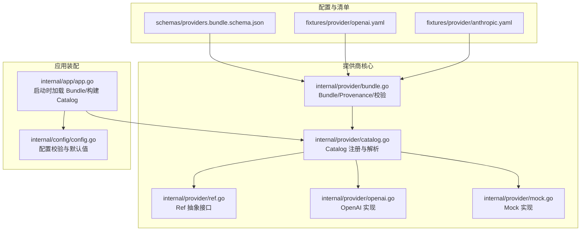
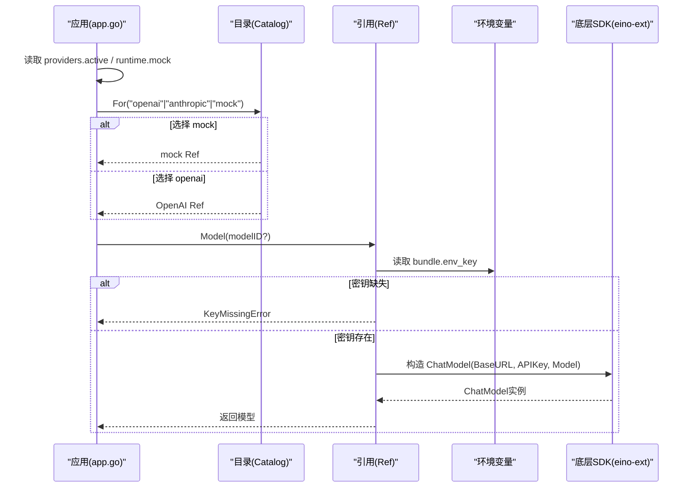
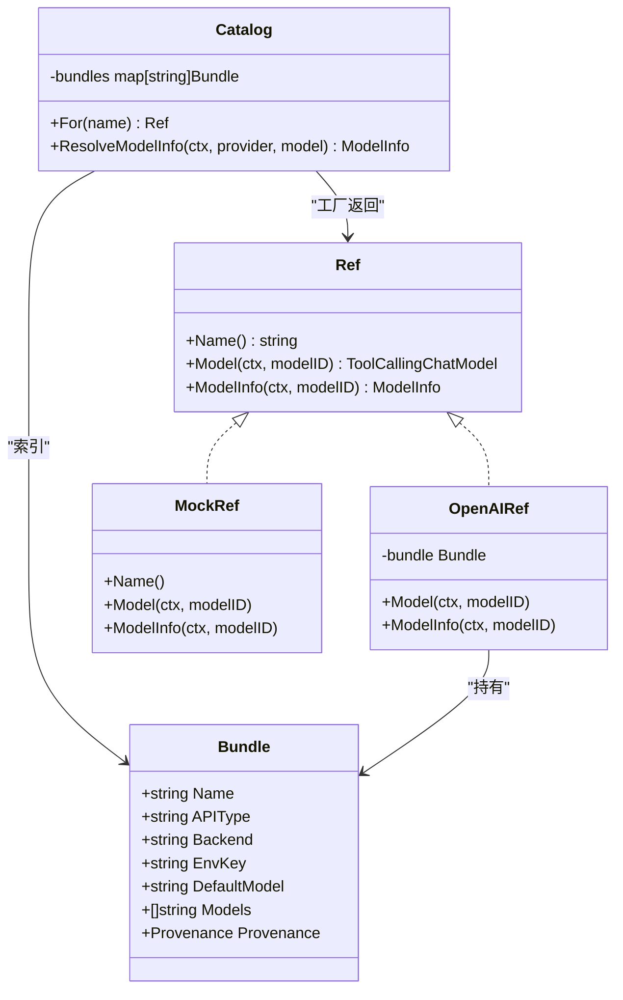
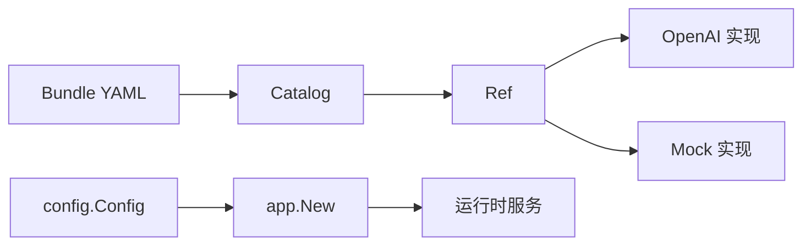

# 提供商架构设计

<cite>
**本文引用的文件**
- [bundle.go](file://internal/provider/bundle.go)
- [catalog.go](file://internal/provider/catalog.go)
- [ref.go](file://internal/provider/ref.go)
- [openai.go](file://internal/provider/openai.go)
- [mock.go](file://internal/provider/mock.go)
- [providers.bundle.schema.json](file://schemas/providers.bundle.schema.json)
- [openai.yaml](file://fixtures/provider/openai.yaml)
- [anthropic.yaml](file://fixtures/provider/anthropic.yaml)
- [app.go](file://internal/app/app.go)
- [config.go](file://internal/config/config.go)
</cite>

## 目录
1. [简介](#简介)
2. [项目结构](#项目结构)
3. [核心组件](#核心组件)
4. [架构总览](#架构总览)
5. [详细组件分析](#详细组件分析)
6. [依赖关系分析](#依赖关系分析)
7. [性能与可观测性](#性能与可观测性)
8. [故障排查指南](#故障排查指南)
9. [结论](#结论)
10. [附录：配置示例与最佳实践](#附录配置示例与最佳实践)

## 简介
本文件系统性阐述 Vivy 的“模型提供商”架构：以 Bundle（包）为最小配置单元，通过 Catalog（目录）进行发现与解析，使用工厂模式按后端类型创建具体 Ref（引用），在运行时按需从环境变量读取密钥并构造底层模型。文档覆盖抽象接口、Bundle 字段语义、工厂机制、提供商发现、配置校验、版本兼容性与 Provenance 溯源记录，并提供完整配置示例与最佳实践。

## 项目结构
围绕提供商能力的关键代码位于 internal/provider 与 schemas、fixtures 中；应用启动时由 internal/app 加载 Bundle、构建 Catalog 并解析出 Ref；配置边界由 internal/config 严格约束，确保密钥不落地。

图表来源
- [bundle.go:28-69](file://internal/provider/bundle.go#L28-L69)
- [catalog.go:10-46](file://internal/provider/catalog.go#L10-L46)
- [ref.go:12-30](file://internal/provider/ref.go#L12-L30)
- [openai.go:14-23](file://internal/provider/openai.go#L14-L23)
- [mock.go:14-21](file://internal/provider/mock.go#L14-L21)
- [app.go:89-119](file://internal/app/app.go#L89-L119)
- [config.go:91-108](file://internal/config/config.go#L91-L108)

章节来源
- [bundle.go:28-149](file://internal/provider/bundle.go#L28-L149)
- [catalog.go:10-59](file://internal/provider/catalog.go#L10-L59)
- [ref.go:12-43](file://internal/provider/ref.go#L12-L43)
- [openai.go:14-98](file://internal/provider/openai.go#L14-L98)
- [mock.go:14-76](file://internal/provider/mock.go#L14-L76)
- [providers.bundle.schema.json:1-124](file://schemas/providers.bundle.schema.json#L1-L124)
- [openai.yaml:1-50](file://fixtures/provider/openai.yaml#L1-L50)
- [anthropic.yaml:1-42](file://fixtures/provider/anthropic.yaml#L1-L42)
- [app.go:89-119](file://internal/app/app.go#L89-L119)
- [config.go:91-108](file://internal/config/config.go#L91-L108)

## 核心组件
- Bundle：描述一个提供商包的形状与默认值，包含 API 类型、后端标识、模型列表、环境变量键名、默认模型、网关前缀、检测启发式等，并强制携带 Provenance 溯源信息。
- Catalog：维护已加载的 Bundle 索引，提供名称到 Ref 的解析；内置 mock 兜底。
- Ref：Provider 抽象边界，封装 Name、Model、ModelInfo 三个方法；密钥仅在 Model() 调用时从环境变量读取，永不持久化。
- OpenAI 实现：基于 eino-ext 的 OpenAI ChatModel，支持通过环境变量覆盖 BaseURL，内置上下文窗口元数据表。
- Mock 实现：确定性流式回复，用于测试与离线开发。

章节来源
- [bundle.go:28-69](file://internal/provider/bundle.go#L28-L69)
- [catalog.go:10-59](file://internal/provider/catalog.go#L10-L59)
- [ref.go:12-43](file://internal/provider/ref.go#L12-L43)
- [openai.go:14-98](file://internal/provider/openai.go#L14-L98)
- [mock.go:14-76](file://internal/provider/mock.go#L14-L76)

## 架构总览
Vivy 启动时加载 Bundle YAML 并构建 Catalog；根据配置选择激活的提供商（或启用 mock）。随后通过 Catalog.For(name) 获取 Ref，并在首次生成请求时读取密钥、构造底层模型。该设计将“配置即声明”和“运行时凭据注入”解耦，满足密钥不落盘的安全红线。

图表来源
- [app.go:89-119](file://internal/app/app.go#L89-L119)
- [catalog.go:27-46](file://internal/provider/catalog.go#L27-L46)
- [openai.go:61-78](file://internal/provider/openai.go#L61-L78)
- [ref.go:12-30](file://internal/provider/ref.go#L12-L30)

## 详细组件分析

### Bundle 结构与字段语义
- name：稳定标识符，需匹配小写字母开头及数字、下划线、连字符。
- api_type：协议族，限定为 openai 或 anthropic。
- env_key：环境变量名（大写+下划线），仅保存变量名，不保存密钥。
- display_name：显示名。
- default_model：未指定模型时的回退模型，必须出现在 models 列表中。
- gateway_prefix/skip_prefixes/env_extras/is_gateway/is_local/detect_by_key_prefix/detect_by_base_keyword：提供商检测与路由相关启发式字段。
- default_api_base：默认 HTTP Base URL，可通过环境变量 VIVY_API_BASE 覆盖（OpenAI 实现）。
- strip_model_prefix/supports_prompt_caching：模型前缀处理与提示缓存能力标记。
- models：受管模型清单，至少一项且唯一。
- model_overrides：针对特定模型的覆盖项（api_base、supports_prompt_caching）。
- backend：实现后端标识，当前支持 eino-ext/openai 与 vivy/anthropic。
- provenance：溯源记录，必填 source、entry、derived_at，可选 note。

校验规则要点
- 必填字段为空将报错。
- name、env_key 需符合正则。
- api_type 仅限 openai/anthropic。
- backend 仅限两个常量之一。
- models 非空且 default_model 必须在其中。
- provenance 三字段齐全。

章节来源
- [bundle.go:28-69](file://internal/provider/bundle.go#L28-L69)
- [bundle.go:96-149](file://internal/provider/bundle.go#L96-L149)
- [providers.bundle.schema.json:1-124](file://schemas/providers.bundle.schema.json#L1-L124)

### 工厂模式与 Ref 抽象
- Ref 是 Provider 抽象边界，暴露 Name、Model、ModelInfo。
- Catalog.For(name) 根据 name 返回对应 Ref：
  - "mock" 始终可用。
  - 其他名称需在 Catalog 中加载过 Bundle。
  - 当前仅 eino-ext/openai 已接线；vivy/anthropic 暂未接线。
- OpenAI Ref：
  - 首次 Model() 时从 bundle.env_key 读取密钥。
  - 若缺失则返回结构化错误 KeyMissingError。
  - BaseURL 优先取环境变量 VIVY_API_BASE，否则使用 bundle.default_api_base。
  - ModelInfo 提供已知模型的上下文窗口元数据，未知模型返回零值由调用方保守处理。

图表来源
- [catalog.go:10-59](file://internal/provider/catalog.go#L10-L59)
- [ref.go:12-43](file://internal/provider/ref.go#L12-L43)
- [bundle.go:28-69](file://internal/provider/bundle.go#L28-L69)
- [openai.go:14-98](file://internal/provider/openai.go#L14-L98)
- [mock.go:14-76](file://internal/provider/mock.go#L14-L76)

章节来源
- [catalog.go:10-59](file://internal/provider/catalog.go#L10-L59)
- [ref.go:12-43](file://internal/provider/ref.go#L12-L43)
- [openai.go:14-98](file://internal/provider/openai.go#L14-L98)
- [mock.go:14-76](file://internal/provider/mock.go#L14-L76)

### 提供商发现机制
- 启动阶段：应用从配置读取 providers.active 与 runtime.mock，决定最终 providerName。
- Bundle 加载：按 bundle_dir 下的文件名加载 openai.yaml、anthropic.yaml 等，失败则中止启动。
- 目录解析：NewCatalog 接收多个 Bundle，按 name 建立索引；重复 name 以后者为准。
- 解析 Ref：For(name) 返回 mock 或对应后端 Ref；未接线后端会返回错误。
- 环境覆盖：OpenAI 实现支持通过 VIVY_API_BASE 覆盖 BaseURL，便于对接任意兼容网关。

章节来源
- [app.go:89-119](file://internal/app/app.go#L89-L119)
- [catalog.go:17-46](file://internal/provider/catalog.go#L17-L46)
- [openai.go:27-40](file://internal/provider/openai.go#L27-L40)

### 配置验证规则
- 配置层（config.go）：
  - providers.active 限定为 openai/anthropic。
  - providers.bundle_dir 必填。
  - 各 Provider.EnvKey 必须符合环境变量命名规范，禁止写入真实密钥。
  - Runtime 各项阈值、路径、MCP Server 端点等均有强校验。
- Bundle 层（bundle.go + schema）：
  - 严格解码（KnownFields=true），未知字段直接报错。
  - 字段枚举、格式、长度、唯一性等由 schema 与 validate 双重保障。
  - provenance 必填，保证来源可追溯。

章节来源
- [config.go:316-528](file://internal/config/config.go#L316-L528)
- [bundle.go:71-149](file://internal/provider/bundle.go#L71-L149)
- [providers.bundle.schema.json:1-124](file://schemas/providers.bundle.schema.json#L1-L124)

### 版本兼容性管理
- Bundle 中的 provenance 记录 source、entry、derived_at 与 note，用于追踪每个 Bundle 由哪个上游条目重导出以及变更说明。
- 应用侧对引擎版本有检查（checkpoint store 锚定），避免在不兼容版本上恢复运行。
- 建议：新增/调整 Bundle 时更新 provenance.note，明确模型增减、默认值规范化等差异。

章节来源
- [bundle.go:62-69](file://internal/provider/bundle.go#L62-L69)
- [openai.yaml:41-50](file://fixtures/provider/openai.yaml#L41-L50)
- [anthropic.yaml:33-42](file://fixtures/provider/anthropic.yaml#L33-L42)
- [app.go:206-218](file://internal/app/app.go#L206-L218)

### Provenance 溯源记录
- 目的：确保每个 Bundle 可追溯到原始来源（D-025），便于审计、回归与合规。
- 字段：source（源文档相对路径）、entry（条目名）、derived_at（重导出日期）、note（变更说明）。
- 强制：Bundle 校验要求三者齐全。

章节来源
- [bundle.go:62-69](file://internal/provider/bundle.go#L62-L69)
- [bundle.go:145-149](file://internal/provider/bundle.go#L145-L149)
- [providers.bundle.schema.json:99-121](file://schemas/providers.bundle.schema.json#L99-L121)

## 依赖关系分析
- 耦合与内聚：
  - Catalog 与 Bundle 高内聚，负责配置与发现；Ref 抽象屏蔽实现细节。
  - OpenAI/Mock 实现仅依赖 Ref 契约与必要的环境变量/SDK。
- 外部依赖：
  - OpenAI 实现依赖 eino-ext 的 OpenAI 组件；Anthropic 适配器尚未接线。
- 循环依赖：无显式循环；Ref 不反向依赖 Catalog。
- 集成点：
  - 应用启动时组装 Catalog 与 Ref，注入运行时服务。
  - 配置层严格限制密钥进入配置对象。

图表来源
- [config.go:91-108](file://internal/config/config.go#L91-L108)
- [app.go:89-119](file://internal/app/app.go#L89-L119)
- [catalog.go:10-59](file://internal/provider/catalog.go#L10-L59)
- [openai.go:14-98](file://internal/provider/openai.go#L14-L98)
- [mock.go:14-76](file://internal/provider/mock.go#L14-L76)

章节来源
- [catalog.go:10-59](file://internal/provider/catalog.go#L10-L59)
- [openai.go:14-98](file://internal/provider/openai.go#L14-L98)
- [mock.go:14-76](file://internal/provider/mock.go#L14-L76)
- [app.go:89-119](file://internal/app/app.go#L89-L119)
- [config.go:91-108](file://internal/config/config.go#L91-L108)

## 性能与可观测性
- 延迟与开销：
  - 模型构造发生在首次 Model() 调用时，避免启动期网络开销。
  - 已知模型上下文窗口查表 O(1)，未知模型返回零值由调用方保守处理。
- 资源控制：
  - 运行时参数（如 MaxContextBytes、MaxToolResultBytes、StreamBuffer 等）限制内存与事件规模。
- 可观测性：
  - 错误分类清晰（如 KeyMissingError），便于上层呈现可操作提示。
  - 建议结合事件总线与审计钩子记录关键步骤（已在运行时服务中集成）。

[本节为通用指导，无需特定文件引用]

## 故障排查指南
- 启动时报错“bundle not loaded”：
  - 检查 providers.bundle_dir 是否正确，对应的 YAML 是否存在且可读。
  - 确认 Bundle name 与 catalog 索引一致。
- 运行时报“API key missing”：
  - 检查 bundle.env_key 指定的环境变量是否设置。
  - 对于 OpenAI，也可通过 VIVY_API_BASE 覆盖 BaseURL。
- Anthropic 后端不可用：
  - 当前 vivy/anthropic 尚未接线，需等待后续里程碑接入。
- 配置校验失败：
  - 检查 providers.active、providers.bundle_dir、各 Provider.env_key/default_model 是否符合约束。
  - 检查 runtime.* 阈值与路径合法性。

章节来源
- [catalog.go:27-46](file://internal/provider/catalog.go#L27-L46)
- [openai.go:61-78](file://internal/provider/openai.go#L61-L78)
- [ref.go:32-43](file://internal/provider/ref.go#L32-L43)
- [config.go:316-528](file://internal/config/config.go#L316-L528)

## 结论
Vivy 的提供商架构以 Bundle 为中心，配合 Catalog 与 Ref 抽象，实现了“配置即声明、凭据即插即用”的设计目标。严格的配置与 Bundle 校验、Provenance 溯源与环境变量隔离，确保了安全与可维护性。当前 OpenAI 已完全接入，Anthropic 适配器预留扩展位。建议在新增提供商时遵循现有模式，完善 Bundle 与校验，并通过 provenance 记录变更轨迹。

[本节为总结，无需特定文件引用]

## 附录：配置示例与最佳实践

### Bundle 配置示例
- OpenAI 示例：fixtures/provider/openai.yaml
  - 关键字段：name、api_type=openai、env_key=OPENAI_API_KEY、default_model=gpt-4o、models 列表、backend=eino-ext/openai、provenance。
- Anthropic 示例：fixtures/provider/anthropic.yaml
  - 关键字段：name、api_type=anthropic、env_key=ANTHROPIC_API_KEY、default_model=claude-sonnet-4-5、models 列表、backend=vivy/anthropic、provenance。

章节来源
- [openai.yaml:1-50](file://fixtures/provider/openai.yaml#L1-L50)
- [anthropic.yaml:1-42](file://fixtures/provider/anthropic.yaml#L1-L42)

### 应用配置要点（config.go）
- providers.active：选择 openai 或 anthropic。
- providers.bundle_dir：指向 Bundle YAML 所在目录。
- providers.openai/anthropic.env_key：仅写环境变量名，严禁写入密钥。
- runtime.*：合理设置流缓冲、上下文大小、工具调用上限等，避免资源耗尽。

章节来源
- [config.go:91-108](file://internal/config/config.go#L91-L108)
- [config.go:256-314](file://internal/config/config.go#L256-L314)
- [config.go:316-528](file://internal/config/config.go#L316-L528)

### 最佳实践
- 密钥管理
  - 永远不在配置文件或日志中写入密钥；仅保留 env_key 名称。
  - 使用环境变量或平台密钥管理服务注入 OPENAI_API_KEY、ANTHROPIC_API_KEY。
- BaseURL 覆盖
  - 使用 VIVY_API_BASE 将 OpenAI 请求转发至兼容网关，无需修改 Bundle。
- Bundle 维护
  - 每次调整 Bundle 时更新 provenance.note，记录模型增减与默认值变更。
  - 保持 models 与 default_model 的一致性，避免运行时回退异常。
- 提供商选择
  - 生产环境通过 providers.active 切换；测试与离线场景使用 runtime.mock。
- 错误处理
  - 捕获 KeyMissingError 并提示用户设置相应环境变量。
  - 对未知模型 ID，ModelInfo 返回零上下文窗口，调用方应保守估算。

[本节为通用指导，无需特定文件引用]