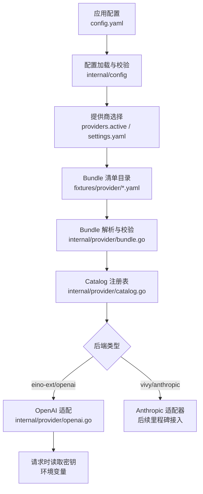
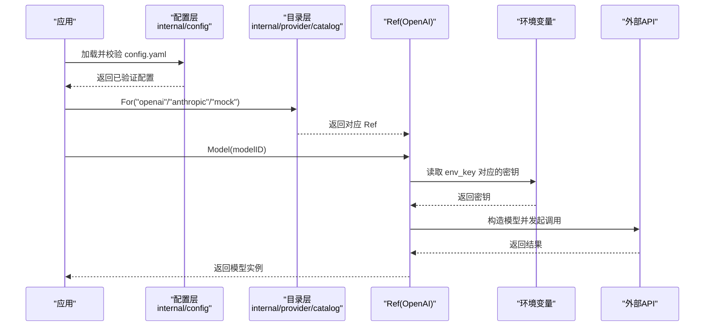
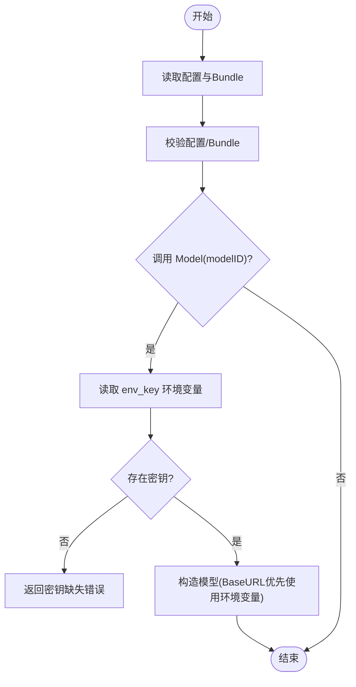
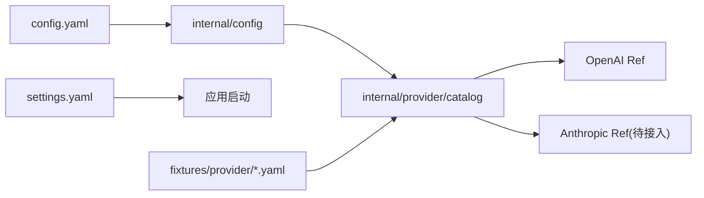

# 提供商配置管理

<cite>
**本文引用的文件**
- [providers.bundle.schema.json](file://schemas/providers.bundle.schema.json)
- [bundle.go](file://internal/provider/bundle.go)
- [catalog.go](file://internal/provider/catalog.go)
- [openai.go](file://internal/provider/openai.go)
- [config.go](file://internal/config/config.go)
- [settings.go](file://internal/app/settings/settings.go)
- [openai.yaml](file://fixtures/provider/openai.yaml)
- [anthropic.yaml](file://fixtures/provider/anthropic.yaml)
- [config.example.yaml](file://config.example.yaml)
- [docker/config.yaml](file://docker/config.yaml)
</cite>

## 目录
1. [简介](#简介)
2. [项目结构](#项目结构)
3. [核心组件](#核心组件)
4. [架构总览](#架构总览)
5. [详细组件分析](#详细组件分析)
6. [依赖关系分析](#依赖关系分析)
7. [性能与可扩展性](#性能与可扩展性)
8. [故障排查指南](#故障排查指南)
9. [结论](#结论)
10. [附录：模板、示例与最佳实践](#附录模板示例与最佳实践)

## 简介
本文件面向 Vivy 的“提供商配置管理”，聚焦于 Bundle YAML 配置文件的完整结构、校验规则、环境变量引用机制、密钥安全策略，以及多提供商、模型覆盖、网关前缀等高级特性。同时给出运维相关的配置热重载、动态更新与迁移建议。

## 项目结构
Vivy 将“提供商能力”以 Bundle（预置清单）形式声明，运行时通过 Catalog 解析并实例化具体后端实现；应用级配置 config.yaml 仅保留非敏感设置与激活选择，密钥始终来自环境变量。

图表来源
- [config.go:51-108](file://internal/config/config.go#L51-L108)
- [bundle.go:28-53](file://internal/provider/bundle.go#L28-L53)
- [catalog.go:10-46](file://internal/provider/catalog.go#L10-L46)
- [openai.go:14-39](file://internal/provider/openai.go#L14-L39)

章节来源
- [config.go:51-108](file://internal/config/config.go#L51-L108)
- [bundle.go:28-53](file://internal/provider/bundle.go#L28-L53)
- [catalog.go:10-46](file://internal/provider/catalog.go#L10-L46)
- [openai.go:14-39](file://internal/provider/openai.go#L14-L39)

## 核心组件
- Bundle 清单：描述提供商能力、默认值、模型目录、后端实现标识、可检测字段与溯源信息。
- Catalog 注册表：启动时加载 Bundle，按名称解析为 Ref，再根据 backend 创建具体实现。
- OpenAI 适配：在调用时从环境变量读取密钥，支持通过环境变量覆盖 Base URL。
- 应用配置：严格校验，禁止写入任何密钥；仅保存 env_key 名称。
- 用户设置：独立 settings.yaml，用于选择激活提供商、默认模型与可选 BaseURL（不持久化密钥）。

章节来源
- [bundle.go:28-69](file://internal/provider/bundle.go#L28-L69)
- [catalog.go:10-58](file://internal/provider/catalog.go#L10-L58)
- [openai.go:14-39](file://internal/provider/openai.go#L14-L39)
- [config.go:51-108](file://internal/config/config.go#L51-L108)
- [settings.go:43-54](file://internal/app/settings/settings.go#L43-L54)

## 架构总览
下图展示从配置到实际模型调用的关键路径，强调“密钥仅在请求时读取”的安全边界。

图表来源
- [config.go:318-336](file://internal/config/config.go#L318-L336)
- [catalog.go:27-46](file://internal/provider/catalog.go#L27-L46)
- [openai.go:61-77](file://internal/provider/openai.go#L61-L77)

## 详细组件分析

### Bundle YAML 结构与语义
- 必填字段
  - name：稳定标识符，小写字母开头，允许数字、下划线、短横线。
  - api_type：协议族，当前支持 openai、anthropic。
  - env_key：环境变量名（大写+下划线），用于请求时读取密钥。
  - display_name：显示名称。
  - default_model：未指定模型时的默认值，必须出现在 models 列表中。
  - default_api_base：默认 HTTP 基地址（URI 格式）。
  - backend：实现标识，当前支持 eino-ext/openai、vivy/anthropic。
  - models：至少一个模型 ID，唯一且非空。
  - provenance：溯源记录，包含 source、entry、derived_at（note 可选）。
- 可选字段
  - keywords：用于启发式检测的关键词。
  - gateway_prefix：经网关路由时的前缀。
  - skip_prefixes：跳过匹配的前缀列表。
  - env_extras：额外环境变量名集合，仅用于检测，不携带值。
  - is_gateway、is_local：标记是否为网关或本地提供者。
  - detect_by_key_prefix、detect_by_base_keyword：自动检测辅助字段。
  - strip_model_prefix、supports_prompt_caching：能力开关。
  - model_overrides：按模型的覆盖项，可覆盖 api_base 与 supports_prompt_caching。
- 约束与校验
  - 未知字段拒绝（严格解码）。
  - name/env_key 正则校验。
  - api_type/backend 枚举校验。
  - default_model 必须在 models 中。
  - provenance 三要素齐全。

章节来源
- [providers.bundle.schema.json:8-122](file://schemas/providers.bundle.schema.json#L8-L122)
- [bundle.go:96-149](file://internal/provider/bundle.go#L96-L149)

### 配置验证规则与错误处理
- 应用配置（config.yaml）
  - 严格解码，未知字段报错。
  - providers.active 限定 openai/anthropic。
  - providers.bundle_dir 必填。
  - 每个 provider 的 env_key 必须符合环境变量命名规范，default_model 必填。
  - runtime.* 多项数值型上限/下限校验。
  - tools.enabled 至少一项。
  - governance 相关字段白名单校验。
  - sandbox 模式、网络策略等白名单/范围校验。
- Bundle 清单
  - 同上 Bundle 字段校验。
- 典型错误
  - 缺少必填字段、非法枚举值、default_model 不在 models、provenance 不完整、env_key 不符合命名规范等。

章节来源
- [config.go:341-527](file://internal/config/config.go#L341-L527)
- [bundle.go:96-149](file://internal/provider/bundle.go#L96-L149)

### 环境变量引用机制与密钥安全
- 密钥从不进入配置文件或持久化存储，仅以 env_key 名称引用。
- 请求时读取：OpenAI 适配在 Model() 调用时读取 bundle.EnvKey 指向的环境变量。
- Base URL 覆盖：可通过环境变量 VIVY_API_BASE 覆盖默认 base URL（仅影响 OpenAI 兼容后端）。
- Postgres DSN 同样通过 dsn_env 引用，避免明文入配置。

图表来源
- [openai.go:61-77](file://internal/provider/openai.go#L61-L77)
- [openai.go:27-39](file://internal/provider/openai.go#L27-L39)
- [config.go:85-89](file://internal/config/config.go#L85-L89)

章节来源
- [openai.go:27-39](file://internal/provider/openai.go#L27-L39)
- [openai.go:61-77](file://internal/provider/openai.go#L61-L77)
- [config.go:85-89](file://internal/config/config.go#L85-L89)

### 多提供商配置与激活
- 通过 config.yaml 的 providers.active 选择激活的 Bundle（openai 或 anthropic）。
- 用户可在 settings.yaml 中切换 provider、覆盖默认模型与 BaseURL（不写死密钥）。
- Catalog 在 For(name) 时根据 backend 分发到具体实现；Anthropic 适配器将在后续里程碑接入。

章节来源
- [config.go:91-108](file://internal/config/config.go#L91-L108)
- [catalog.go:27-46](file://internal/provider/catalog.go#L27-L46)
- [settings.go:43-54](file://internal/app/settings/settings.go#L43-L54)

### 模型覆盖设置（model_overrides）
- 针对特定模型提供差异化配置，如 api_base 与 supports_prompt_caching。
- 适用于需要按模型切换网关或能力的场景。

章节来源
- [providers.bundle.schema.json:80-93](file://schemas/providers.bundle.schema.json#L80-L93)
- [bundle.go:55-60](file://internal/provider/bundle.go#L55-L60)

### 网关前缀与路由
- gateway_prefix：当请求经网关转发时，会在路由前添加该前缀。
- skip_prefixes：可配置跳过某些前缀匹配。
- 这些字段由 Bundle 声明，供上层路由/代理逻辑使用。

章节来源
- [providers.bundle.schema.json:49-56](file://schemas/providers.bundle.schema.json#L49-L56)

### 运行期行为与限制
- Anthropic 后端目前处于“已声明但未接入”状态，调用会返回未接入提示。
- OpenAI 后端支持上下文窗口元数据查询（保守映射），未知模型回退零值。

章节来源
- [catalog.go:38-45](file://internal/provider/catalog.go#L38-L45)
- [openai.go:42-59](file://internal/provider/openai.go#L42-L59)

## 依赖关系分析
- internal/config 负责全局配置加载与校验，决定激活的提供商与 Bundle 目录。
- internal/provider 负责 Bundle 解析、注册与后端实例化。
- internal/app/settings 提供用户级偏好（非密钥），在下次启动时生效。
- fixtures/provider 提供开箱即用的 Bundle 清单。

图表来源
- [config.go:51-108](file://internal/config/config.go#L51-L108)
- [catalog.go:10-46](file://internal/provider/catalog.go#L10-L46)
- [settings.go:43-54](file://internal/app/settings/settings.go#L43-L54)

章节来源
- [config.go:51-108](file://internal/config/config.go#L51-L108)
- [catalog.go:10-46](file://internal/provider/catalog.go#L10-L46)
- [settings.go:43-54](file://internal/app/settings/settings.go#L43-L54)

## 性能与可扩展性
- 流缓冲与事件负载大小受 runtime.stream_buffer、runtime.max_event_payload_bytes 限制，防止内存膨胀。
- 工具调用轮次、上下文大小、历史消息数、重试次数等均有上限，避免失控循环与资源耗尽。
- 新增提供商：扩展 backend 分支并在 Catalog.For 中注册新 Ref；保持 Bundle schema 向后兼容。
- 新增模型：在 Bundle 的 models 列表中添加，必要时在 model_overrides 中覆盖能力。

[本节为通用指导，无需列出具体文件]

## 故障排查指南
- 启动失败
  - 检查 config.yaml 是否包含未知字段或非法值（严格解码）。
  - 确认 providers.active 为 openai/anthropic，bundle_dir 存在且可读。
  - 确认每个 provider 的 env_key 符合命名规范，default_model 非空。
- 运行时密钥缺失
  - 确保 env_key 指向的环境变量已设置；OpenAI 适配会在 Model() 时检查并返回明确错误。
- Base URL 异常
  - 如需覆盖 Base URL，请设置 VIVY_API_BASE；注意其仅对 OpenAI 兼容后端生效。
- Anthropic 不可用
  - 当前后端尚未接入，需等待后续里程碑；临时可使用 mock 或切换到 openai。
- 沙箱/网络限制
  - 检查 runtime.sandbox.* 与 runtime.http_allowed_hosts 等配置是否符合预期。

章节来源
- [config.go:341-527](file://internal/config/config.go#L341-L527)
- [openai.go:61-77](file://internal/provider/openai.go#L61-L77)
- [catalog.go:38-45](file://internal/provider/catalog.go#L38-L45)

## 结论
Vivy 的提供商配置管理以“Bundle + Catalog + 应用配置”三层解耦，严格遵循“密钥不入配置、请求时读取”的安全原则。通过 schema 与代码双重校验保障配置正确性，结合 settings.yaml 提供用户级灵活切换。未来将逐步完善 Anthropic 后端与更多高级特性。

[本节为总结，无需列出具体文件]

## 附录：模板、示例与最佳实践

### Bundle YAML 模板要点
- 必填字段：name、api_type、env_key、display_name、default_model、default_api_base、backend、models、provenance。
- 可选字段：keywords、gateway_prefix、skip_prefixes、env_extras、is_gateway、is_local、detect_by_key_prefix、detect_by_base_keyword、strip_model_prefix、supports_prompt_caching、model_overrides。
- 校验规则：name/env_key 正则、api_type/backend 枚举、default_model 必须在 models、provenance 三要素齐全。

章节来源
- [providers.bundle.schema.json:8-122](file://schemas/providers.bundle.schema.json#L8-L122)
- [bundle.go:96-149](file://internal/provider/bundle.go#L96-L149)

### 应用配置示例（config.yaml）
- 服务器监听地址、跨域白名单。
- 存储后端（sqlite/postgres）、数据目录。
- 提供商激活与 Bundle 目录、各提供商 env_key 与默认模型。
- 运行时参数：流缓冲、事件负载上限、上下文与历史上限、工具调用上限、工作区与技能目录、HTTP 工具主机白名单、MCP 服务器、执行命令白名单、沙箱策略等。

章节来源
- [config.example.yaml:5-136](file://config.example.yaml#L5-L136)
- [config.go:254-314](file://internal/config/config.go#L254-L314)

### Docker 环境覆盖示例
- 容器内监听地址、SQLite 路径、工作区与技能目录、沙箱工作区根目录。

章节来源
- [docker/config.yaml:5-19](file://docker/config.yaml#L5-L19)

### 用户设置（settings.yaml）
- 可选择激活的提供商（openai/anthropic/mock）。
- 可覆盖默认模型与 BaseURL（BaseURL 通过现有环境变量机制生效）。
- 文件位于 data/agent-home/settings.yaml，重启后生效。

章节来源
- [settings.go:43-54](file://internal/app/settings/settings.go#L43-L54)
- [settings.go:70-107](file://internal/app/settings/settings.go#L70-L107)

### 最佳实践
- 绝不将密钥写入配置或日志；统一通过环境变量注入。
- 使用 Bundle 声明能力与默认值，避免硬编码。
- 通过 model_overrides 精细控制不同模型的网关与能力。
- 使用 gateway_prefix 配合网关进行路由隔离。
- 合理设置运行时上限，防止资源滥用。
- 变更配置后重启服务使设置生效（settings.yaml 与 config.yaml 均非热重载）。

[本节为通用指导，无需列出具体文件]

### 运维：热重载、动态更新与迁移
- 热重载：当前实现不支持运行时热重载配置；修改 config.yaml 或 settings.yaml 后需重启进程。
- 动态更新：可在部署流程中替换 Bundle 清单与配置文件，随后重启服务。
- 迁移建议：
  - 从旧版 providers.yaml 迁移至 Bundle 清单时，保留 provenance 记录，标注差异与弃用模型。
  - 逐步引入 model_overrides 与 gateway_prefix，平滑过渡到网关路由。
  - 将 Anthropic 后端接入后，按相同方式启用。

[本节为通用指导，无需列出具体文件]