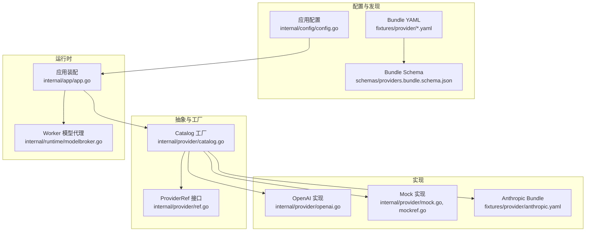
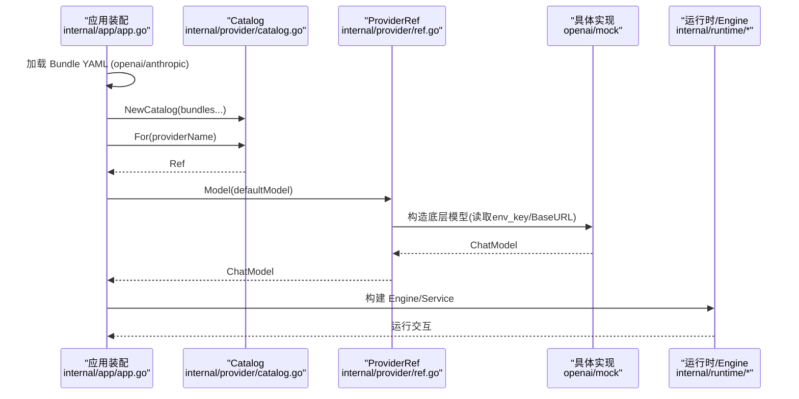
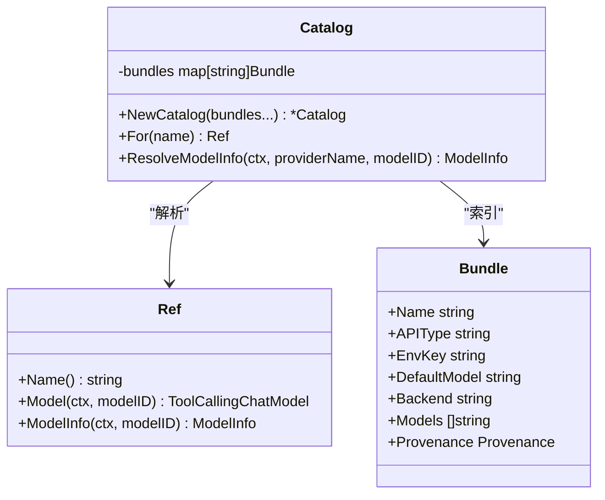
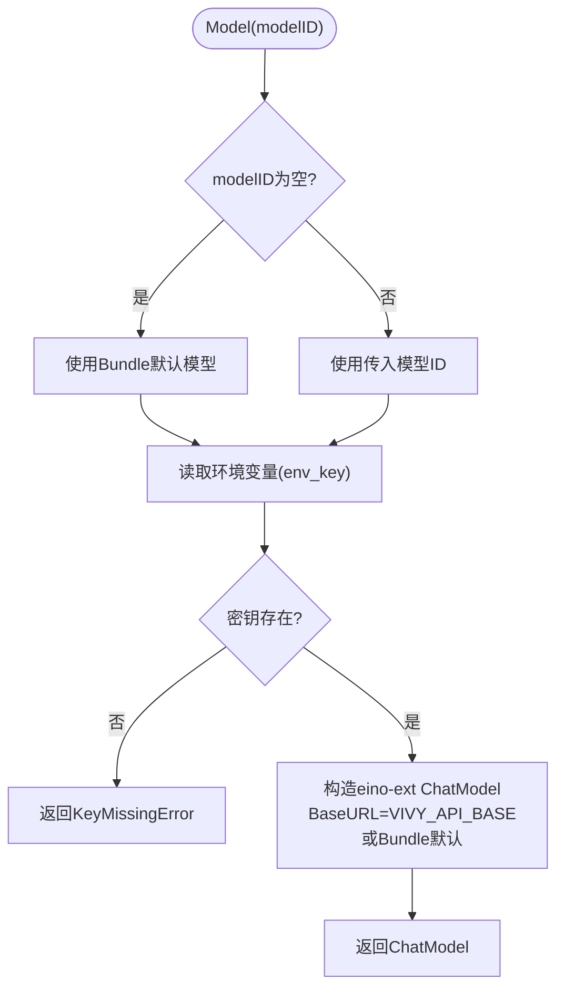
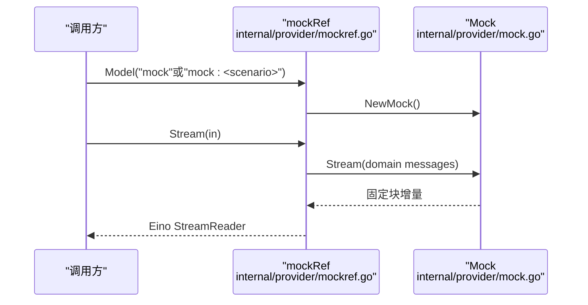
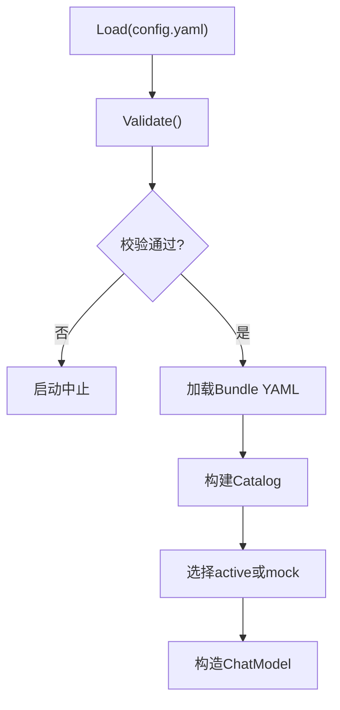
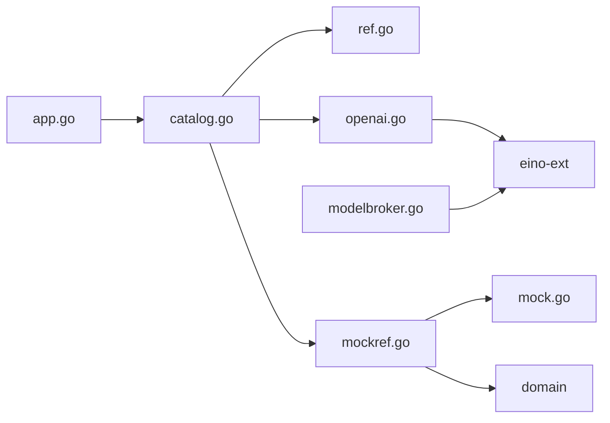

# 模型提供商

<cite>
**本文引用的文件**
- [internal/provider/doc.go](file://internal/provider/doc.go)
- [internal/provider/ref.go](file://internal/provider/ref.go)
- [internal/provider/bundle.go](file://internal/provider/bundle.go)
- [internal/provider/catalog.go](file://internal/provider/catalog.go)
- [internal/provider/openai.go](file://internal/provider/openai.go)
- [internal/provider/mock.go](file://internal/provider/mock.go)
- [internal/provider/mockref.go](file://internal/provider/mockref.go)
- [fixtures/provider/openai.yaml](file://fixtures/provider/openai.yaml)
- [fixtures/provider/anthropic.yaml](file://fixtures/provider/anthropic.yaml)
- [schemas/providers.bundle.schema.json](file://schemas/providers.bundle.schema.json)
- [internal/config/config.go](file://internal/config/config.go)
- [internal/app/app.go](file://internal/app/app.go)
- [internal/runtime/modelbroker.go](file://internal/runtime/modelbroker.go)
</cite>

## 目录
1. [简介](#简介)
2. [项目结构](#项目结构)
3. [核心组件](#核心组件)
4. [架构总览](#架构总览)
5. [详细组件分析](#详细组件分析)
6. [依赖关系分析](#依赖关系分析)
7. [性能与生产注意事项](#性能与生产注意事项)
8. [故障排查指南](#故障排查指南)
9. [结论](#结论)
10. [附录：新提供商集成指南](#附录：新提供商集成指南)

## 简介
本仓库实现了 Vivy 的“模型提供商”子系统，提供统一的抽象接口、工厂式解析、YAML 配置包（Bundle）加载与校验、以及 OpenAI、Anthropic（预留）、Mock 等具体实现。系统遵循以下红线：
- 仅 internal/provider 与 internal/runtime 可依赖 eino；其他层不得泄漏 Eino 类型。
- 密钥不持久化：配置文件只保存环境变量名（env_key），在请求时读取，日志、快照、事件负载中必须脱敏。
- 启动时严格校验配置与 Bundle，未知字段直接失败，避免静默默认值。
- 运行时通过 Catalog 按名称解析 Ref，Ref 负责构造具体的聊天模型并暴露 ModelInfo。

## 项目结构
- 抽象与工厂
  - Ref 接口定义 ProviderRef 边界，屏蔽密钥与厂商 SDK。
  - Catalog 作为工厂，将 provider 名称解析为 Ref，支持 mock 与 bundle-backed 实现。
- 配置与发现
  - Bundle YAML 描述提供商能力、默认模型、后端标识、模型列表等，并通过 schema 严格校验。
  - 应用启动时从 fixtures/provider 加载 openai.yaml、anthropic.yaml，构建 Catalog。
- 具体实现
  - OpenAI：基于 eino-ext 的 OpenAI 组件，API Key 从环境变量读取，BaseURL 可通过环境变量覆盖。
  - Mock：确定性流式响应，用于离线开发与测试。
  - Anthropic：Bundle 已就绪，后端尚未接入（后续里程碑）。
- 运行时集成
  - App 组装流程：加载存储 -> 加载 Bundle -> 构建 Catalog -> 选择 Provider -> 构造 ChatModel -> 注入 Engine/Service。
  - Worker 侧通过 Broker 调用模型，统一消息与工具调用转换。

**图示来源**
- [internal/provider/catalog.go:10-46](file://internal/provider/catalog.go#L10-L46)
- [internal/provider/openai.go:14-78](file://internal/provider/openai.go#L14-L78)
- [internal/provider/mockref.go:14-44](file://internal/provider/mockref.go#L14-L44)
- [internal/app/app.go:89-119](file://internal/app/app.go#L89-L119)
- [internal/runtime/modelbroker.go:60-126](file://internal/runtime/modelbroker.go#L60-L126)

**章节来源**
- [internal/provider/doc.go:1-18](file://internal/provider/doc.go#L1-L18)
- [internal/provider/bundle.go:28-69](file://internal/provider/bundle.go#L28-L69)
- [internal/provider/catalog.go:10-46](file://internal/provider/catalog.go#L10-L46)
- [internal/app/app.go:89-119](file://internal/app/app.go#L89-L119)

## 核心组件
- ProviderRef 边界
  - Name：返回提供商/包名。
  - Model：根据 modelID 构造 ToolCallingChatModel；空 ID 回退到 Bundle 的 default_model。
  - ModelInfo：返回模型容量元数据（如上下文窗口），不可用时返回零值由调用方保守处理。
  - KeyMissingError：结构化错误，提示缺失的环境变量名，便于上层给出可操作提示。
- Bundle 与 Schema
  - 字段包含 name、api_type、env_key、display_name、default_model、default_api_base、backend、models、model_overrides、provenance 等。
  - 严格解码（KnownFields=true），未知字段直接报错；必填字段校验、枚举校验、默认模型必须在 models 中出现。
  - provenance 强制记录来源、条目、派生时间，确保可追溯。
- Catalog 工厂
  - 维护 bundles map，For(name) 解析为 Ref；mock 始终可用；未接入的后端返回明确错误。
  - ResolveModelInfo 委托给 Ref.ModelInfo。
- OpenAI 实现
  - 构造时从 env_key 读取 API Key；BaseURL 优先使用 VIVY_API_BASE 环境变量，否则使用 Bundle 的 default_api_base。
  - 已知模型上下文窗口表保守映射，未知模型返回零值。
- Mock 实现
  - 确定性流式输出，固定块大小，输入相同则输出一致；支持 scenario 模式触发工具调用路径。
  - 桥接 domain.ChatModel 到 Eino 的 ToolCallingChatModel，支持 Stream/Generate。

**章节来源**
- [internal/provider/ref.go:12-43](file://internal/provider/ref.go#L12-L43)
- [internal/provider/bundle.go:71-149](file://internal/provider/bundle.go#L71-L149)
- [internal/provider/catalog.go:17-58](file://internal/provider/catalog.go#L17-L58)
- [internal/provider/openai.go:14-98](file://internal/provider/openai.go#L14-L98)
- [internal/provider/mock.go:10-76](file://internal/provider/mock.go#L10-L76)
- [internal/provider/mockref.go:14-202](file://internal/provider/mockref.go#L14-L202)

## 架构总览
Vivy 启动时加载 Bundle YAML，构建 Catalog；根据配置选择 active provider（或启用 mock），解析 Ref 并构造 ChatModel；随后装配 Engine、Service、RPC 控制面。Worker 侧通过 Broker 调用模型，统一消息与工具调用转换。

**图示来源**
- [internal/app/app.go:89-119](file://internal/app/app.go#L89-L119)
- [internal/provider/catalog.go:17-46](file://internal/provider/catalog.go#L17-L46)
- [internal/provider/openai.go:61-78](file://internal/provider/openai.go#L61-L78)
- [internal/provider/mockref.go:23-44](file://internal/provider/mockref.go#L23-L44)

## 详细组件分析

### 抽象接口与工厂
- Ref 接口定义了 ProviderRef 边界，屏蔽密钥与厂商 SDK，保证上层仅通过 modelID 获取模型。
- Catalog 作为工厂，集中管理 Bundle 与 Ref 的映射，mock 始终可用，bundle-backed 需提前加载。

**图示来源**
- [internal/provider/ref.go:12-43](file://internal/provider/ref.go#L12-L43)
- [internal/provider/catalog.go:10-58](file://internal/provider/catalog.go#L10-L58)
- [internal/provider/bundle.go:28-69](file://internal/provider/bundle.go#L28-L69)

**章节来源**
- [internal/provider/ref.go:12-43](file://internal/provider/ref.go#L12-L43)
- [internal/provider/catalog.go:10-58](file://internal/provider/catalog.go#L10-L58)
- [internal/provider/bundle.go:28-69](file://internal/provider/bundle.go#L28-L69)

### OpenAI 提供商集成
- 密钥读取：从 Bundle.env_key 指定的环境变量读取，缺失时返回 KeyMissingError。
- BaseURL 覆盖：通过 VIVY_API_BASE 环境变量覆盖 Bundle.default_api_base，便于对接兼容网关。
- 模型信息：内置已知模型的上下文窗口表，未知模型返回零值，调用方保守处理。
- 流式响应：由 eino-ext 组件提供，上层通过 Stream/Recv 消费增量。

**图示来源**
- [internal/provider/openai.go:61-78](file://internal/provider/openai.go#L61-L78)
- [internal/provider/openai.go:27-40](file://internal/provider/openai.go#L27-L40)
- [internal/provider/openai.go:42-59](file://internal/provider/openai.go#L42-L59)

**章节来源**
- [internal/provider/openai.go:14-98](file://internal/provider/openai.go#L14-L98)

### Mock 提供商集成
- 确定性流式：固定块大小，输入相同输出一致，适合离线开发与测试。
- Scenario 模式：通过 modelID 前缀 "mock:" 指定场景，触发工具调用路径，验证 HITL、ReviewItem、RPC、UI 链路。
- Eino 桥接：mockEinoModel 实现 Generate/Stream/WithTools，正常模式文本流，scenario 模式固定工具调用。

**图示来源**
- [internal/provider/mockref.go:23-44](file://internal/provider/mockref.go#L23-L44)
- [internal/provider/mock.go:23-52](file://internal/provider/mock.go#L23-L52)
- [internal/provider/mockref.go:81-134](file://internal/provider/mockref.go#L81-L134)

**章节来源**
- [internal/provider/mock.go:10-76](file://internal/provider/mock.go#L10-L76)
- [internal/provider/mockref.go:14-202](file://internal/provider/mockref.go#L14-L202)

### Anthropic 提供商（预留）
- Bundle 已就绪，backend 标记为 vivy/anthropic，但 Catalog.For 当前返回“未接入”错误，等待后续里程碑接入。
- 配置示例位于 fixtures/provider/anthropic.yaml，包含 api_type、env_key、default_model、models 等。

**章节来源**
- [internal/provider/catalog.go:27-46](file://internal/provider/catalog.go#L27-L46)
- [fixtures/provider/anthropic.yaml:1-42](file://fixtures/provider/anthropic.yaml#L1-L42)

### 配置管理机制
- Bundle YAML
  - 字段与约束由 schemas/providers.bundle.schema.json 定义，strict decode 未知字段失败。
  - provenance 强制记录来源、条目、派生时间，确保可追溯。
- 应用配置
  - config.Config 包含 Providers、Runtime、Storage、Tools、Governance 等。
  - Validate 严格检查 server.addr、storage.backend、providers.active、env_key 格式、默认模型非空、runtime 各项上限等。
  - Default() 提供默认值，包括 providers.active=openai、bundle_dir=fixtures/provider、各 provider 的 env_key 与 default_model。
- 设置叠加
  - app.applySettingsOverlay 读取独立 settings 文档，覆盖 active provider、default_model、base_url（通过 VIVY_API_BASE）。

**图示来源**
- [internal/config/config.go:254-314](file://internal/config/config.go#L254-L314)
- [internal/config/config.go:316-528](file://internal/config/config.go#L316-L528)
- [internal/app/app.go:89-119](file://internal/app/app.go#L89-L119)

**章节来源**
- [schemas/providers.bundle.schema.json:1-124](file://schemas/providers.bundle.schema.json#L1-L124)
- [internal/config/config.go:254-528](file://internal/config/config.go#L254-L528)
- [internal/app/app.go:388-425](file://internal/app/app.go#L388-L425)

## 依赖关系分析
- 耦合与内聚
  - provider 包内聚了抽象、工厂、Bundle 解析与具体实现；catalog 集中管理映射，降低外部耦合。
  - app 仅依赖 provider.Ref 与 catalog，不感知具体实现细节。
- 直接/间接依赖
  - OpenAI 依赖 eino-ext 组件；Mock 依赖 domain 与 eino schema。
  - runtime/modelbroker 仅依赖 eino schema，保持 worker 契约稳定。
- 外部依赖
  - eino/eino-ext：模型组件与 schema。
  - yaml.v3：Bundle 与配置解析。
- 循环依赖
  - 未发现循环依赖；provider 不依赖 runtime，runtime 不反向依赖 provider。

**图示来源**
- [internal/app/app.go:89-119](file://internal/app/app.go#L89-L119)
- [internal/provider/catalog.go:10-46](file://internal/provider/catalog.go#L10-L46)
- [internal/provider/openai.go:1-12](file://internal/provider/openai.go#L1-L12)
- [internal/provider/mockref.go:1-12](file://internal/provider/mockref.go#L1-L12)
- [internal/runtime/modelbroker.go:1-10](file://internal/runtime/modelbroker.go#L1-L10)

**章节来源**
- [internal/provider/doc.go:1-18](file://internal/provider/doc.go#L1-L18)
- [internal/runtime/modelbroker.go:60-126](file://internal/runtime/modelbroker.go#L60-L126)

## 性能与生产注意事项
- 流式缓冲
  - runtime.stream_buffer 限制流式增量缓冲，防止内存膨胀。
- 事件与上下文上限
  - max_event_payload_bytes、max_context_bytes、max_history_messages、max_tool_result_bytes 限制单次事件与上下文大小。
- 重试与速率限制
  - UI 层（Rust 子模块）实现了指数退避重试与 429 速率限制检测；Go 侧 provider 应结合上游错误分类进行重试策略。
- 密钥管理
  - 仅保存 env_key 名称，不在配置或日志中持久化密钥；缺失时返回结构化错误以便上层提示。
- 成本优化
  - 合理设置 max_model_calls、max_run_tool_calls、max_run_retries；利用 ModelInfo.ContextWindow 保守估算上下文占用。
- 网关与 BaseURL
  - 通过 VIVY_API_BASE 覆盖 BaseURL，便于走企业网关或代理，减少直连风险。

[本节为通用指导，不直接分析具体文件]

## 故障排查指南
- 启动阶段
  - 配置校验失败：检查 server.addr、storage.backend、providers.active、env_key 格式、默认模型非空、runtime 各项上限。
  - Bundle 加载失败：确认 fixtures/provider/*.yaml 存在且符合 schema；provenance 必填。
- 运行时
  - KeyMissingError：确认对应环境变量已设置；检查 env_key 是否与 Bundle 一致。
  - Anthropic 未接入：Catalog.For 返回“未接入”错误，等待后续里程碑。
  - 流式中断：检查 ctx.Err() 与 stream buffer；确认下游 Reader 关闭逻辑。
- 重试与速率限制
  - 429 速率限制：参考 UI 层重试逻辑，适当调整退避参数；关注 Retry-After 头。
  - 5xx 服务器错误：指数退避重试，注意最大重试次数与抖动。

**章节来源**
- [internal/config/config.go:316-528](file://internal/config/config.go#L316-L528)
- [internal/provider/bundle.go:71-149](file://internal/provider/bundle.go#L71-L149)
- [internal/provider/openai.go:61-78](file://internal/provider/openai.go#L61-L78)
- [internal/provider/catalog.go:27-46](file://internal/provider/catalog.go#L27-L46)

## 结论
Vivy 的模型提供商子系统通过 Ref/Catalog/Bundler 三层解耦，实现了可插拔的提供商接入与严格的配置校验。OpenAI 已完整接入，Mock 提供确定性测试环境，Anthropic 预留 Bundle 待后续接入。系统在生产环境中强调密钥安全、流式缓冲、事件与上下文上限、重试与速率限制，确保稳定性与可观测性。

[本节为总结，不直接分析具体文件]

## 附录：新提供商集成指南
- 步骤概览
  1. 编写 Bundle YAML：定义 name、api_type、env_key、display_name、default_model、default_api_base、backend、models、model_overrides、provenance。
  2. 实现 Ref：实现 Name/Model/ModelInfo；Model 中读取 env_key 对应的环境变量，构造底层模型；ModelInfo 返回保守的容量元数据。
  3. 注册到 Catalog：在 Catalog.For 中添加 backend 分支，返回新实现的 Ref。
  4. 更新配置：在 config.Default 或 config.Validate 中增加对新 provider 的支持；必要时添加新的 env_key 校验。
  5. 测试用例：
     - 单元测试：验证 Bundle 解析、Ref.Name/Model/ModelInfo、Mock scenario 路径。
     - 集成测试：通过 Catalog.For 解析新 provider，构造 ChatModel，执行 Stream/Generate，断言流式增量与工具调用。
  6. 配置示例：
     - 新增 Bundle YAML 到 fixtures/provider/<new>.yaml。
     - 在 config.Providers 中添加新 provider 的 EnvKey 与 DefaultModel。
- 接口实现要点
  - 密钥读取：仅在 Model() 时读取环境变量，不缓存、不持久化。
  - BaseURL 覆盖：支持通过 VIVY_API_BASE 或 Bundle.default_api_base 配置。
  - 错误处理：区分网络错误、速率限制、认证失败；返回结构化错误以便上层重试或提示。
  - 流式响应：实现 Stream/Recv，正确处理 ctx 取消与 EOF。
- 生产注意事项
  - 速率限制：结合上游错误分类（如 429）实施指数退避重试。
  - 成本优化：合理设置 max_model_calls、max_run_tool_calls；利用 ModelInfo.ContextWindow 控制上下文。
  - 密钥管理：仅保存 env_key 名称；日志与事件脱敏。
  - 网关与代理：通过 BaseURL 覆盖，便于企业网关部署。

[本节为通用指导，不直接分析具体文件]