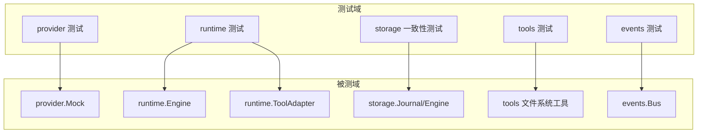
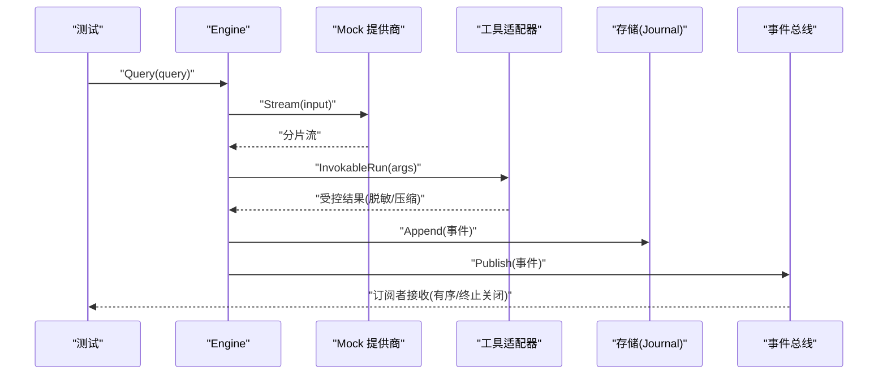
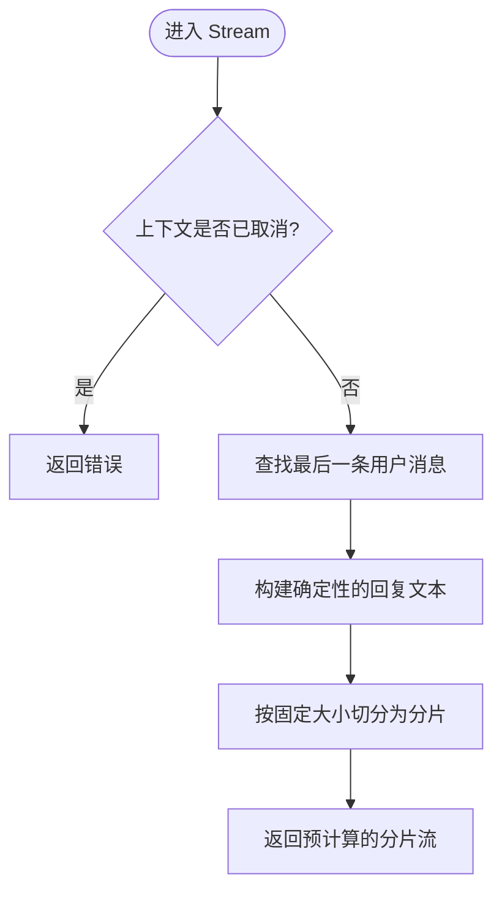
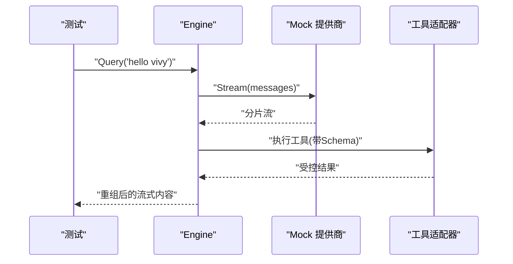
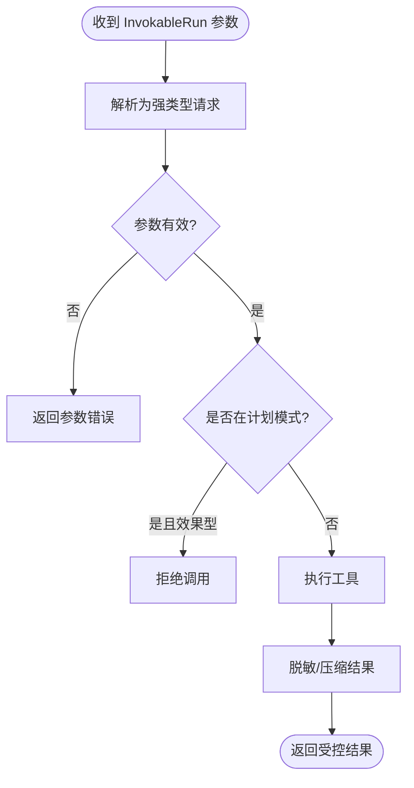
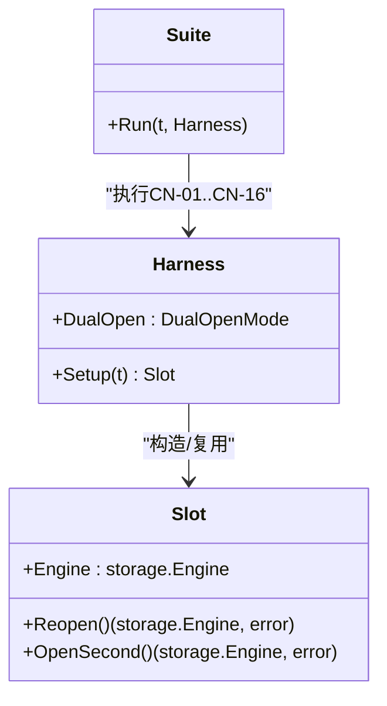
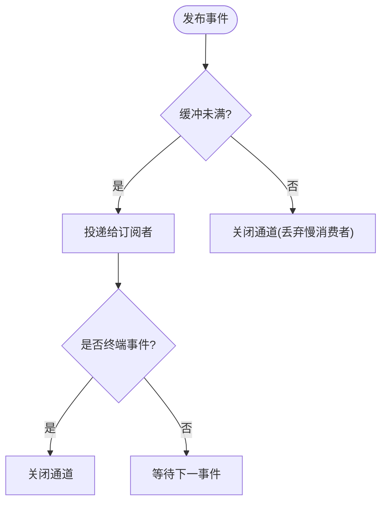
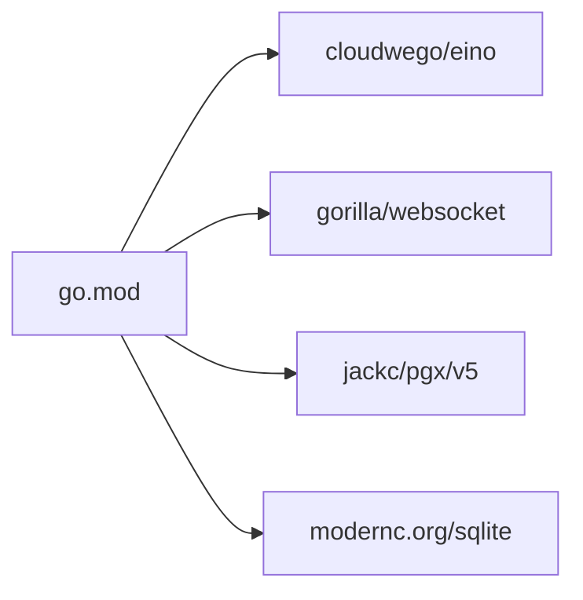

# 单元测试

<cite>
**本文引用的文件**
- [internal/provider/mock.go](file://internal/provider/mock.go)
- [internal/provider/mock_test.go](file://internal/provider/mock_test.go)
- [internal/runtime/engine_test.go](file://internal/runtime/engine_test.go)
- [internal/runtime/tooladapter_test.go](file://internal/runtime/tooladapter_test.go)
- [internal/runtime/toolbroker_test.go](file://internal/runtime/toolbroker_test.go)
- [internal/storage/conformance/suite.go](file://internal/storage/conformance/suite.go)
- [internal/storage/sqlite/conformance_test.go](file://internal/storage/sqlite/conformance_test.go)
- [internal/storage/postgres/conformance_test.go](file://internal/storage/postgres/conformance_test.go)
- [internal/tools/filesystem_test.go](file://internal/tools/filesystem_test.go)
- [internal/events/bus_test.go](file://internal/events/bus_test.go)
- [go.mod](file://go.mod)
</cite>

## 目录
1. [简介](#简介)
2. [项目结构](#项目结构)
3. [核心组件](#核心组件)
4. [架构总览](#架构总览)
5. [详细组件分析](#详细组件分析)
6. [依赖分析](#依赖分析)
7. [性能考虑](#性能考虑)
8. [故障排查指南](#故障排查指南)
9. [结论](#结论)
10. [附录](#附录)

## 简介
本文件面向 Vivy Agent 运行时的 Go 测试体系，系统梳理并解释仓库中已实现的单元测试实践。重点覆盖：
- 表格驱动测试、并发测试、基准测试的编写技巧与落地方式
- 模拟对象（Mock）的创建与使用，接口模拟与依赖注入测试
- 覆盖率要求、测试数据管理、测试环境隔离
- 为工具系统、存储层、提供商模块编写高质量单元测试的方法论与示例路径
- 测试调试技巧、性能分析与问题定位方法

本项目遵循“确定性输出”和“事件总线重放”的设计原则，测试围绕这些契约展开，确保在离线/CI 环境下可重复验证。

## 项目结构
测试代码按领域分层组织，与源码一一对应：
- internal/provider：模型提供商抽象与 Mock 实现及测试
- internal/runtime：引擎、工具适配、策略与预算等运行时逻辑的测试
- internal/storage：存储后端一致性套件（conformance suite），SQLite/Postgres 各自接入
- internal/tools：文件系统工具等工具的参数校验、上下文传递与副作用控制测试
- internal/events：事件总线发布订阅顺序、终止语义与慢消费者保护测试

**图表来源**
- [internal/provider/mock.go:10-76](file://internal/provider/mock.go#L10-L76)
- [internal/runtime/engine_test.go:13-83](file://internal/runtime/engine_test.go#L13-L83)
- [internal/storage/conformance/suite.go:42-73](file://internal/storage/conformance/suite.go#L42-L73)
- [internal/tools/filesystem_test.go:42-81](file://internal/tools/filesystem_test.go#L42-L81)
- [internal/events/bus_test.go:21-48](file://internal/events/bus_test.go#L21-L48)

**章节来源**
- [internal/provider/mock.go:10-76](file://internal/provider/mock.go#L10-L76)
- [internal/runtime/engine_test.go:13-83](file://internal/runtime/engine_test.go#L13-L83)
- [internal/storage/conformance/suite.go:42-73](file://internal/storage/conformance/suite.go#L42-L73)
- [internal/tools/filesystem_test.go:42-81](file://internal/tools/filesystem_test.go#L42-L81)
- [internal/events/bus_test.go:21-48](file://internal/events/bus_test.go#L21-L48)

## 核心组件
- 确定性 Mock 提供商：提供固定大小分片流式回复，保证相同输入产生相同字节序列，便于端到端断言与回归。
- 运行时引擎与工具适配：通过 Mock 提供商驱动完整查询流程，验证流式消息重组、参数 Schema 下发、结果脱敏与压缩。
- 存储一致性套件：以 CN-01..CN-16 用例统一验证原子追加、单调序列、版本冲突、幂等重放、终端唯一性、并发写入、断开后重放等。
- 工具系统测试：验证 JSON 参数到强类型请求的转换、RunID 透传、只读/写操作标记、错误处理与规格完整性。
- 事件总线测试：验证有序消费、终端关闭、慢消费者丢弃、取消注销、延迟订阅行为。

**章节来源**
- [internal/provider/mock.go:10-76](file://internal/provider/mock.go#L10-L76)
- [internal/runtime/engine_test.go:73-94](file://internal/runtime/engine_test.go#L73-L94)
- [internal/storage/conformance/suite.go:42-73](file://internal/storage/conformance/suite.go#L42-L73)
- [internal/tools/filesystem_test.go:42-104](file://internal/tools/filesystem_test.go#L42-L104)
- [internal/events/bus_test.go:21-98](file://internal/events/bus_test.go#L21-L98)

## 架构总览
下图展示从测试到被测组件的调用链：测试通过 Engine.Query 驱动 Mock 提供商，经工具适配与策略检查，最终产出流式消息；存储层通过一致性套件对 Journal/Engine 进行多场景验证；事件总线保障事件顺序与生命周期。

**图表来源**
- [internal/runtime/engine_test.go:33-83](file://internal/runtime/engine_test.go#L33-L83)
- [internal/provider/mock.go:23-52](file://internal/provider/mock.go#L23-L52)
- [internal/storage/conformance/suite.go:103-128](file://internal/storage/conformance/suite.go#L103-L128)
- [internal/events/bus_test.go:21-48](file://internal/events/bus_test.go#L21-L48)

## 详细组件分析

### 提供商模块：Mock 与 HITL 场景
- 确定性流式回复：将用户最后一条消息作为输入，生成固定大小的分片流，便于断言字节级一致性与多分片拼接。
- 取消感知：每次 Recv 前检查上下文，支持快速失败。
- HITL 场景：通过 ref.Model 获取模型，首条 Generate 返回工具调用（如 write_note），二次传入工具结果后完成对话。

**图表来源**
- [internal/provider/mock.go:23-52](file://internal/provider/mock.go#L23-L52)

**章节来源**
- [internal/provider/mock.go:10-76](file://internal/provider/mock.go#L10-L76)
- [internal/provider/mock_test.go:27-95](file://internal/provider/mock_test.go#L27-L95)
- [internal/provider/mock_test.go:97-145](file://internal/provider/mock_test.go#L97-L145)

### 运行时引擎：流式响应与确定性
- 端到端流式断言：通过 drainReassembled 收集所有 streaming 分片并拼接，断言与期望字符串完全一致。
- 确定性证明：同一输入两次运行，断言字节级一致。
- 工具信息下发：验证工具参数 Schema 正确转换为 JSON Schema，必填字段标注正确。

**图表来源**
- [internal/runtime/engine_test.go:33-83](file://internal/runtime/engine_test.go#L33-L83)
- [internal/runtime/engine_test.go:96-162](file://internal/runtime/engine_test.go#L96-L162)

**章节来源**
- [internal/runtime/engine_test.go:13-169](file://internal/runtime/engine_test.go#L13-L169)

### 工具系统：参数校验、上下文与副作用控制
- 强类型参数转发：JSON 参数解析为结构化请求，RunID 通过上下文透传至底层操作。
- 只读/写标记：写操作工具不得标记为只读，否则测试失败。
- 计划模式拦截：在 Plan 模式下拒绝效果型工具调用，避免副作用。
- 结果脱敏与压缩：长结果会被压缩并插入占位符，敏感信息会被脱敏并标记不可信。

**图表来源**
- [internal/tools/filesystem_test.go:42-104](file://internal/tools/filesystem_test.go#L42-L104)
- [internal/runtime/tooladapter_test.go:71-93](file://internal/runtime/tooladapter_test.go#L71-L93)

**章节来源**
- [internal/tools/filesystem_test.go:42-104](file://internal/tools/filesystem_test.go#L42-L104)
- [internal/runtime/tooladapter_test.go:13-93](file://internal/runtime/tooladapter_test.go#L13-L93)

### 存储层：一致性套件与双后端
- 一致性套件：以 CN-01..CN-16 覆盖原子追加、单调序列、版本冲突、幂等重放、终端唯一、首次写入获胜、重启修复、损坏尾段恢复、负载保真、双句柄安全、并发写入、断开后重放等。
- SQLite 接入：使用临时目录数据库文件，共享打开模式。
- Postgres 接入：通过环境变量 DSN 按需跳过或执行，独立 schema 隔离。

**图表来源**
- [internal/storage/conformance/suite.go:17-73](file://internal/storage/conformance/suite.go#L17-L73)
- [internal/storage/sqlite/conformance_test.go:12-31](file://internal/storage/sqlite/conformance_test.go#L12-L31)
- [internal/storage/postgres/conformance_test.go:17-40](file://internal/storage/postgres/conformance_test.go#L17-L40)

**章节来源**
- [internal/storage/conformance/suite.go:42-549](file://internal/storage/conformance/suite.go#L42-L549)
- [internal/storage/sqlite/conformance_test.go:12-31](file://internal/storage/sqlite/conformance_test.go#L12-L31)
- [internal/storage/postgres/conformance_test.go:17-40](file://internal/storage/postgres/conformance_test.go#L17-L40)

### 事件总线：顺序、终止与慢消费者
- 顺序消费：按 Seq 严格递增推送。
- 终端关闭：发布终端事件后通道关闭，不再推送。
- 慢消费者保护：缓冲区满时关闭通道，防止阻塞。
- 取消注销：多次 cancel 不 panic，无订阅者时发布为无操作。
- 延迟订阅：终端事件先于订阅，仍会注册订阅者（历史由 RPC 重放）。

**图表来源**
- [internal/events/bus_test.go:21-98](file://internal/events/bus_test.go#L21-L98)

**章节来源**
- [internal/events/bus_test.go:21-98](file://internal/events/bus_test.go#L21-L98)

### 表格驱动测试与并发测试
- 表格驱动：在 provider、runtime、tools 等多个测试中使用 t.Run(name, ...) 组织用例，便于扩展与维护。
- 并发测试：
  - 存储层并发写入：多个 goroutine 同时 Append，验证单调序列与无丢失。
  - 预算并发预留：32 个 goroutine 竞争预留，断言成功次数与用量一致。
  - 审批并发决策：多 goroutine 并发 DecideApproval，仅一个获胜。

**章节来源**
- [internal/storage/conformance/suite.go:486-525](file://internal/storage/conformance/suite.go#L486-L525)
- [internal/runtime/budget_test.go:61-84](file://internal/runtime/budget_test.go#L61-L84)
- [internal/storage/conformance/suite.go:242-281](file://internal/storage/conformance/suite.go#L242-L281)

### 基准测试建议
仓库当前未见显式的 go test -bench 基准用例。建议在以下热点路径补充基准测试：
- 工具参数解析与校验（tools 包）
- 工具结果压缩与脱敏（runtime tooladapter）
- 事件总线吞吐（events bus）
- 存储 Append/Replay 吞吐（storage conformance 中的关键路径）

基准设计要点：
- 使用 b.N 循环，避免外部 I/O 干扰
- 固定输入规模，记录分配数与耗时
- 对比不同配置（如压缩阈值、缓冲大小）

[本节为通用指导，不直接分析具体文件]

## 依赖分析
- 模块与版本：Go 1.26.4，依赖 cloudwego/eino 框架用于模型交互，gorilla/websocket 用于传输，pgx/v5 与 modernc.org/sqlite 分别用于 Postgres 与嵌入式 SQLite。
- 测试依赖：标准库 testing，配合 context/time/sync 等实现并发与超时控制。

**图表来源**
- [go.mod:1-12](file://go.mod#L1-L12)

**章节来源**
- [go.mod:1-59](file://go.mod#L1-L59)

## 性能考虑
- 流式分片大小：Mock 使用固定分片大小，既保证确定性又便于断言多分片拼接。实际系统中可根据网络与 UI 渲染需求调整缓冲与分片大小。
- 事件缓冲：事件总线缓冲过小会导致慢消费者被丢弃，需根据峰值吞吐与消费者能力调优。
- 存储并发：SQLite 共享打开适合单进程并发；Postgres 独占打开需保证锁语义。并发写入时应关注序列化与重试策略。
- 结果压缩：工具结果过长时压缩可减少内存与带宽占用，但需保留头尾锚点以便定位问题。

[本节为通用指导，不直接分析具体文件]

## 故障排查指南
- 流式断言失败：优先检查下游 Provider 是否返回空流或提前 EOF；确认 Engine 是否正确聚合 streaming 事件。
- 参数解析错误：检查工具 Spec 的 Params 定义是否与 JSON 键名匹配，必填字段是否缺失。
- 计划模式误放行：确认 Effectful 工具在 Plan 模式下被拦截，避免意外副作用。
- 存储一致性失败：对照 CN-xx 用例定位问题，例如终端唯一性、版本冲突、并发写入等。
- 事件顺序错乱：检查 Publish 顺序与缓冲容量，确认终端事件后通道关闭。
- 资源泄漏：确保测试结束时关闭 Engine、取消订阅、释放临时文件。

**章节来源**
- [internal/runtime/engine_test.go:33-83](file://internal/runtime/engine_test.go#L33-L83)
- [internal/tools/filesystem_test.go:83-104](file://internal/tools/filesystem_test.go#L83-L104)
- [internal/storage/conformance/suite.go:211-240](file://internal/storage/conformance/suite.go#L211-L240)
- [internal/events/bus_test.go:50-84](file://internal/events/bus_test.go#L50-L84)

## 结论
该项目的测试体系围绕“确定性、可重放、可隔离”三大原则构建：
- 提供商 Mock 提供稳定、可复现的流式响应，支撑端到端断言
- 运行时通过工具适配与策略检查，确保参数、权限与安全边界
- 存储一致性套件以 CN-01..CN-16 全面覆盖关键约束，SQLite/Postgres 双后端验证
- 事件总线测试保障顺序、终止与健壮性

建议后续补充基准测试与覆盖率门禁，持续完善质量保障闭环。

[本节为总结，不直接分析具体文件]

## 附录
- 覆盖率建议：
  - 核心路径（Provider、Runtime、Storage、Tools、Events）建议达到较高覆盖率
  - 对异常分支与边界条件（如参数非法、上下文取消、终端事件）进行覆盖
- 测试数据管理：
  - 使用 fixtures 存放配置与样例数据，日志与快照中必须脱敏
  - 存储测试使用临时文件或独立 schema 隔离
- 环境隔离：
  - SQLite 使用 t.TempDir 隔离
  - Postgres 通过环境变量 DSN 控制，未设置则跳过
- 调试技巧：
  - 使用 t.Log 打印中间状态
  - 针对流式场景，打印分片数量与长度
  - 针对并发场景，打印 goroutine 计数与错误通道

[本节为通用指导，不直接分析具体文件]