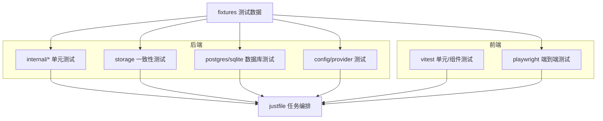
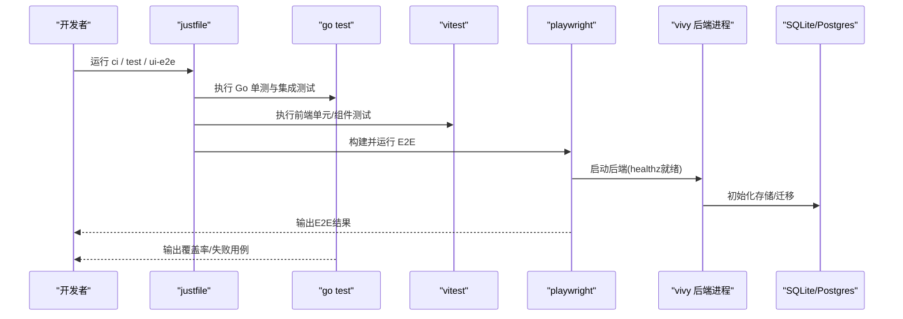
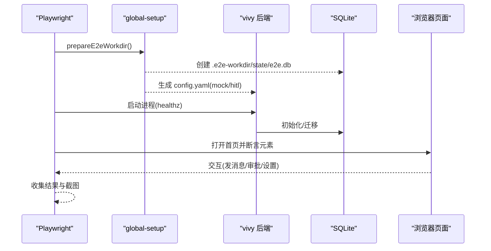
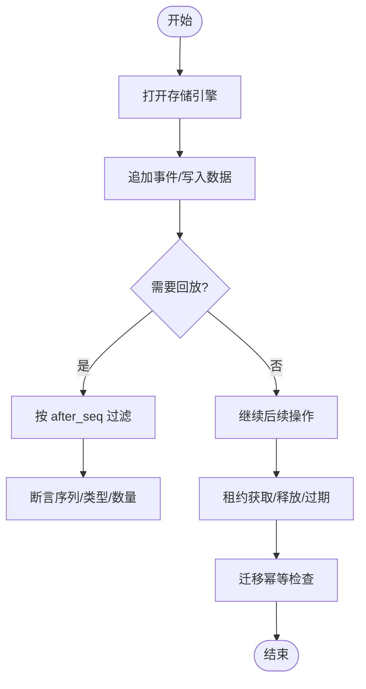
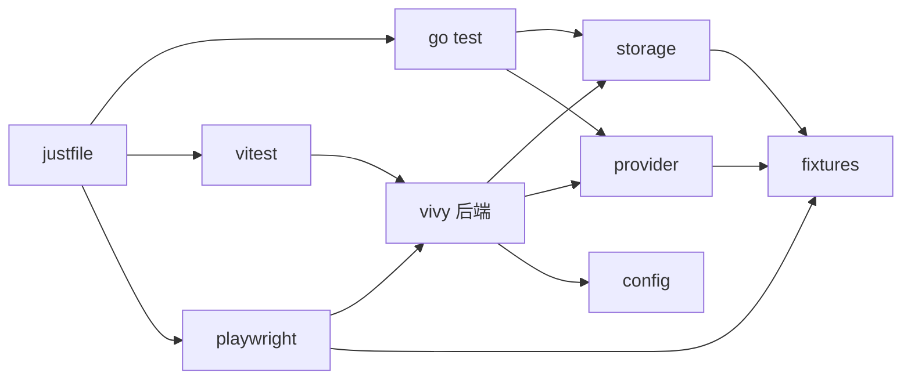

# 测试策略

<cite>
**本文引用的文件**
- [justfile](file://justfile)
- [ui/playwright.config.ts](file://ui/playwright.config.ts)
- [ui/vitest.config.ts](file://ui/vitest.config.ts)
- [ui/e2e/global-setup.ts](file://ui/e2e/global-setup.ts)
- [ui/e2e/runtime.spec.ts](file://ui/e2e/runtime.spec.ts)
- [internal/app/app.go](file://internal/app/app.go)
- [internal/config/config_test.go](file://internal/config/config_test.go)
- [internal/storage/sqlite/conformance_test.go](file://internal/storage/sqlite/conformance_test.go)
- [internal/storage/sqlite/sqlite_test.go](file://internal/storage/sqlite/sqlite_test.go)
- [internal/storage/postgres/db_test.go](file://internal/storage/postgres/db_test.go)
- [internal/provider/catalog.go](file://internal/provider/catalog.go)
- [internal/provider/mockref.go](file://internal/provider/mockref.go)
- [fixtures/README.md](file://fixtures/README.md)
</cite>

## 目录
1. [简介](#简介)
2. [项目结构](#项目结构)
3. [核心组件](#核心组件)
4. [架构总览](#架构总览)
5. [详细组件分析](#详细组件分析)
6. [依赖关系分析](#依赖关系分析)
7. [性能考量](#性能考量)
8. [故障排查指南](#故障排查指南)
9. [结论](#结论)
10. [附录](#附录)

## 简介
本测试策略面向 Vivy Agent（Go 后端 + 内嵌 React/Vite 前端）的端到端质量保障，覆盖单元测试、集成测试、端到端测试、数据库测试、安全与合规测试、性能测试、测试数据与环境管理、持续集成与调试定位。策略遵循仓库既定红线：仅 internal/runtime 与 internal/provider 可依赖 eino；密钥不持久化；每次 Run 恰好一个终态事件；事件经总线按 after_seq 重放；Vivy 内核与 Studio 严格分离；插件通过 sdk verify/pack 流程安装。

## 项目结构
测试相关的关键位置与职责：
- Go 后端
  - 单元测试：各 internal/* 包下的 *_test.go
  - 存储一致性测试：internal/storage/conformance 套件
  - 数据库测试：sqlite 与 postgres 各自测试
  - 配置与 Provider：internal/config、internal/provider
- 前端 UI
  - 单元/组件测试：vitest 配置与 src/**/*.test.*
  - 端到端测试：Playwright 配置与 e2e/*.spec.ts
- 任务编排与 CI
  - justfile 提供 test、ci、ui-ci、ui-e2e、test-postgres 等任务
- 测试数据
  - fixtures 目录用于确定性 fixture（provider bundle、事件流、恢复快照）

**图示来源**
- [justfile:17-40](file://justfile#L17-L40)
- [ui/vitest.config.ts:1-9](file://ui/vitest.config.ts#L1-L9)
- [ui/playwright.config.ts:1-12](file://ui/playwright.config.ts#L1-L12)
- [fixtures/README.md:1-16](file://fixtures/README.md#L1-L16)

**章节来源**
- [justfile:17-40](file://justfile#L17-L40)
- [ui/vitest.config.ts:1-9](file://ui/vitest.config.ts#L1-L9)
- [ui/playwright.config.ts:1-12](file://ui/playwright.config.ts#L1-L12)
- [fixtures/README.md:1-16](file://fixtures/README.md#L1-L16)

## 核心组件
- 任务编排与入口
  - justfile 统一触发 Go 测试、UI 测试、构建与 E2E，支持可选 Postgres 测试开关。
- 前端测试框架
  - Vitest：扫描 src 下 *.test.ts/tsx，排除 agent-diva-source 等子工程。
  - Playwright：启动真实后端进程，基于 healthz 就绪后执行 UI 场景。
- 后端测试支撑
  - 存储一致性测试套件：跨实现验证 storage.Engine 契约。
  - SQLite/Postgres 专项测试：日志追加/回放、终端事件约束、快照版本、锁租约、迁移幂等、Fenced Writes 错误语义。
  - Provider 抽象与 Mock：Catalog 解析 provider，mock 模式通过 Ref 暴露确定性模型。
  - 配置加载：config_test 使用临时配置文件驱动行为。

**章节来源**
- [justfile:17-40](file://justfile#L17-L40)
- [ui/vitest.config.ts:1-9](file://ui/vitest.config.ts#L1-L9)
- [ui/playwright.config.ts:1-12](file://ui/playwright.config.ts#L1-L12)
- [internal/storage/sqlite/conformance_test.go:12-31](file://internal/storage/sqlite/conformance_test.go#L12-L31)
- [internal/storage/sqlite/sqlite_test.go:29-128](file://internal/storage/sqlite/sqlite_test.go#L29-L128)
- [internal/storage/postgres/db_test.go:11-27](file://internal/storage/postgres/db_test.go#L11-L27)
- [internal/provider/catalog.go:10-46](file://internal/provider/catalog.go#L10-L46)
- [internal/provider/mockref.go:14-44](file://internal/provider/mockref.go#L14-L44)
- [internal/config/config_test.go:11-49](file://internal/config/config_test.go#L11-L49)

## 架构总览
测试分层与调用链：
- 单元测试：直接调用内部函数/方法，隔离外部依赖（Provider、存储、网络）。
- 集成测试：组合多个子系统（如 runtime + storage），验证交互契约。
- 端到端测试：启动真实后端服务，通过浏览器自动化验证用户流程。
- 数据库测试：针对 storage 实现的契约与边界条件进行断言。
- 安全/合规：校验密钥脱敏、注入检测、权限路径等。

**图示来源**
- [justfile:17-40](file://justfile#L17-L40)
- [ui/playwright.config.ts:9-12](file://ui/playwright.config.ts#L9-L12)
- [ui/e2e/global-setup.ts:11-22](file://ui/e2e/global-setup.ts#L11-L22)
- [internal/app/app.go:427-454](file://internal/app/app.go#L427-L454)

## 详细组件分析

### 单元测试策略（Go）
- 目标
  - 覆盖关键业务逻辑、错误分支、并发与边界条件。
  - 对 storage 契约进行一致性验证。
- 实践要点
  - 使用 t.TempDir 隔离临时数据，避免状态泄漏。
  - 对 Provider 使用 mockRef/Catalog 切换为 mock 模式，确保确定性。
  - 对存储层使用 conformance 套件，保证 sqlite/postgres 行为一致。
  - 对配置加载使用临时 YAML 文件，避免污染全局环境。
- 示例关注点
  - 日志追加与回放、after_seq 过滤、终端事件唯一性、快照版本冲突、锁租约过期与释放、迁移幂等。

**章节来源**
- [internal/storage/sqlite/conformance_test.go:12-31](file://internal/storage/sqlite/conformance_test.go#L12-L31)
- [internal/storage/sqlite/sqlite_test.go:29-128](file://internal/storage/sqlite/sqlite_test.go#L29-L128)
- [internal/provider/catalog.go:10-46](file://internal/provider/catalog.go#L10-L46)
- [internal/provider/mockref.go:14-44](file://internal/provider/mockref.go#L14-L44)
- [internal/config/config_test.go:11-49](file://internal/config/config_test.go#L11-L49)

### 集成测试策略（Go）
- 目标
  - 验证子系统协作（runtime、rpc、provider、storage、events）。
  - 模拟真实运行场景（审批、工具调用、会话恢复）。
- 实践要点
  - 通过 Catalog 选择 mock 或 bundle 提供的 provider。
  - 使用 fixtures 中的 provider bundle 与事件流，保证可重复。
  - 利用 app.openEngine 根据配置动态选择 sqlite/postgres。
- 示例关注点
  - 事件总线 with after_seq 重放、Run 终态事件唯一性、RPC 协议与传输。

**章节来源**
- [internal/provider/catalog.go:10-46](file://internal/provider/catalog.go#L10-L46)
- [internal/app/app.go:427-454](file://internal/app/app.go#L427-L454)
- [fixtures/README.md:1-16](file://fixtures/README.md#L1-L16)

### 端到端测试策略（Playwright）
- 目标
  - 验证完整用户旅程：聊天、刷新、审批中心、设置、记忆、MCP、笔记本等。
- 实践要点
  - 通过 playwright.config.ts 启动真实后端，等待 /healthz 就绪。
  - global-setup 生成独立工作目录与 config.yaml，写入 SQLite 路径、启用 mock 场景、开启必要 tools。
  - 使用固定视口与轮询断言，增强稳定性。
- 示例关注点
  - 会话创建与消息发送、审批流程、移动端布局、localStorage 清理与保留策略。

**图示来源**
- [ui/playwright.config.ts:9-12](file://ui/playwright.config.ts#L9-L12)
- [ui/e2e/global-setup.ts:11-22](file://ui/e2e/global-setup.ts#L11-L22)
- [ui/e2e/runtime.spec.ts:3-119](file://ui/e2e/runtime.spec.ts#L3-L119)
- [internal/app/app.go:427-454](file://internal/app/app.go#L427-L454)

**章节来源**
- [ui/playwright.config.ts:1-12](file://ui/playwright.config.ts#L1-L12)
- [ui/e2e/global-setup.ts:1-22](file://ui/e2e/global-setup.ts#L1-L22)
- [ui/e2e/runtime.spec.ts:1-120](file://ui/e2e/runtime.spec.ts#L1-L120)

### 数据库测试策略（SQLite/Postgres）
- 目标
  - 验证存储契约、并发与一致性、迁移幂等、错误语义。
- 实践要点
  - SQLite：日志追加/回放、终端事件守卫、快照版本、Blob 代次、租约独占与过期、重开幂等。
  - Postgres：Fenced Writes 返回 ErrLeaseLost 的错误语义。
  - 通过 conformance 套件在多种实现上复用同一套断言。
- 示例关注点
  - after_seq 过滤、终端事件唯一性、版本冲突、删除后的不可见性。

**图示来源**
- [internal/storage/sqlite/sqlite_test.go:29-128](file://internal/storage/sqlite/sqlite_test.go#L29-L128)
- [internal/storage/sqlite/sqlite_test.go:199-260](file://internal/storage/sqlite/sqlite_test.go#L199-L260)
- [internal/storage/postgres/db_test.go:11-27](file://internal/storage/postgres/db_test.go#L11-L27)
- [internal/storage/sqlite/conformance_test.go:12-31](file://internal/storage/sqlite/conformance_test.go#L12-L31)

**章节来源**
- [internal/storage/sqlite/sqlite_test.go:29-128](file://internal/storage/sqlite/sqlite_test.go#L29-L128)
- [internal/storage/sqlite/sqlite_test.go:199-260](file://internal/storage/sqlite/sqlite_test.go#L199-L260)
- [internal/storage/postgres/db_test.go:11-27](file://internal/storage/postgres/db_test.go#L11-L27)
- [internal/storage/sqlite/conformance_test.go:12-31](file://internal/storage/sqlite/conformance_test.go#L12-L31)

### 安全与合规测试
- 目标
  - 确保密钥不落地、敏感信息脱敏、注入检测与访问控制。
- 实践要点
  - 配置中仅保存 env_key，不在日志/快照/事件负载中落盘明文密钥。
  - 通过 Provider 的 mock 模式与 fixtures 的 bundle 控制输入，避免真实 API 调用。
  - 对路径访问、指令注入、PII 等进行断言（结合安全模块与测试）。
- 建议
  - 将安全规则纳入静态检查与单测用例，形成回归基线。

**章节来源**
- [internal/provider/mockref.go:14-44](file://internal/provider/mockref.go#L14-L44)
- [fixtures/README.md:1-16](file://fixtures/README.md#L1-L16)

### 性能测试策略
- 目标
  - 评估事件流吞吐、回放延迟、UI 响应时间。
- 实践要点
  - 使用大缓冲与合理 max_event_payload_bytes 配置，观察内存与 GC 压力。
  - 通过 E2E 场景测量端到端时延，结合浏览器性能面板与后端指标。
  - 对存储层进行批量写入与回放的性能基准。
- 建议
  - 引入压测脚本与指标采集，建立性能基线与告警阈值。

[本节为通用指导，无需特定文件引用]

### 测试数据管理
- 目标
  - 提供确定性、可复现的测试数据与场景。
- 实践要点
  - fixtures/provider 存放预录 provider 响应，确保事件序列稳定。
  - fixtures/events 存放 golden RunEvent 流，用于验收场景比对。
  - fixtures/recovery 存放中间状态快照，用于重启恢复测试。
- 建议
  - 定期审计 fixture 变更，保持与生产数据格式一致。

**章节来源**
- [fixtures/README.md:1-16](file://fixtures/README.md#L1-L16)

### 测试环境搭建
- 目标
  - 快速本地运行与 CI 一致的测试环境。
- 实践要点
  - 使用 just dev 启动后端 :8787 + Vite :3015 分离开发循环。
  - E2E 通过 playwright 自动准备 .e2e-workdir 与 config.yaml，使用 SQLite 作为默认存储。
  - 可选 Postgres：设置 VIVY_POSTGRES_TEST_DSN 后执行 test-postgres。
- 建议
  - 在 CI 中固化环境变量与镜像，确保可重现。

**章节来源**
- [justfile:42-61](file://justfile#L42-L61)
- [ui/e2e/global-setup.ts:11-22](file://ui/e2e/global-setup.ts#L11-L22)

### 持续集成配置
- 目标
  - 统一格式化、静态检查、单测、头编译、UI 构建与 E2E。
- 实践要点
  - just ci 串联 fmt-check、vet、test、headless-compile、ui-ci。
  - ui-ci 执行 pnpm install、typecheck、test、build。
  - ui-e2e 先构建 UI，再运行 playwright E2E。
- 建议
  - 在 CI 中缓存依赖与构建产物，缩短反馈周期。

**章节来源**
- [justfile:23-40](file://justfile#L23-L40)

### 前端测试策略（Vitess/Playwright）
- 目标
  - 组件级正确性与用户流程稳定性。
- 实践要点
  - vitest 仅包含 src 下的测试文件，排除第三方源码与构建产物。
  - Playwright 使用固定 baseURL、workers=1、retries=0，确保顺序与可观测性。
- 建议
  - 为关键路由与交互编写独立 spec，配合截图与日志归档。

**章节来源**
- [ui/vitest.config.ts:1-9](file://ui/vitest.config.ts#L1-L9)
- [ui/playwright.config.ts:9-12](file://ui/playwright.config.ts#L9-L12)

### 后端测试策略（API/RPC/运行时）
- 目标
  - 验证 RPC 协议、控制面、运行时调度与工具调用。
- 实践要点
  - 使用 catalog 与 mockRef 切换 provider，避免外部依赖。
  - 通过 app.openEngine 动态选择存储后端，便于多环境测试。
- 建议
  - 对关键接口增加契约测试与错误分支覆盖。

**章节来源**
- [internal/provider/catalog.go:10-46](file://internal/provider/catalog.go#L10-L46)
- [internal/provider/mockref.go:14-44](file://internal/provider/mockref.go#L14-L44)
- [internal/app/app.go:427-454](file://internal/app/app.go#L427-L454)

### 测试调试技巧与问题定位
- 技巧
  - 使用 t.Cleanup 清理资源，避免跨用例污染。
  - 在 E2E 中使用轮询断言与视口切换，提升鲁棒性。
  - 通过 healthz 判断后端就绪，减少竞态。
- 定位
  - 优先查看存储层错误（ErrCommitInvalid、ErrRunClosed、ErrVersionConflict、ErrLeaseLost）。
  - 检查配置是否启用了 mock 模式与正确的 bundle_dir。
  - 对比 fixtures 中的 golden 事件流，定位差异。

**章节来源**
- [internal/storage/sqlite/sqlite_test.go:96-128](file://internal/storage/sqlite/sqlite_test.go#L96-L128)
- [internal/storage/postgres/db_test.go:11-27](file://internal/storage/postgres/db_test.go#L11-L27)
- [ui/playwright.config.ts:9-12](file://ui/playwright.config.ts#L9-L12)
- [ui/e2e/global-setup.ts:11-22](file://ui/e2e/global-setup.ts#L11-L22)

## 依赖关系分析
测试与代码的依赖关系如下：
- justfile 依赖 go、pnpm 与 playwright。
- Playwright 依赖后端进程与 SQLite/Postgres。
- 后端依赖 storage、provider、config。
- 测试数据依赖 fixtures。

**图示来源**
- [justfile:17-40](file://justfile#L17-L40)
- [ui/playwright.config.ts:9-12](file://ui/playwright.config.ts#L9-L12)
- [internal/app/app.go:427-454](file://internal/app/app.go#L427-L454)
- [fixtures/README.md:1-16](file://fixtures/README.md#L1-L16)

**章节来源**
- [justfile:17-40](file://justfile#L17-L40)
- [ui/playwright.config.ts:9-12](file://ui/playwright.config.ts#L9-L12)
- [internal/app/app.go:427-454](file://internal/app/app.go#L427-L454)
- [fixtures/README.md:1-16](file://fixtures/README.md#L1-L16)

## 性能考量
- 事件流与回放
  - 合理设置 stream_buffer 与 max_event_payload_bytes，避免过大内存占用。
  - 使用 after_seq 增量回放，降低全量重放开销。
- 存储层
  - 批量写入与事务合并，减少磁盘 IO。
  - 对 SQLite 进行 WAL 与索引优化；对 Postgres 调整连接池与查询计划。
- UI 层
  - 限制并发 workers 与重试次数，提高稳定性与可观测性。
  - 使用固定视口与轮询断言，减少时序抖动。

[本节为通用指导，无需特定文件引用]

## 故障排查指南
- 常见问题
  - 后端未就绪：确认 healthz 可达与端口配置。
  - 存储错误：检查终端事件唯一性、版本冲突、租约过期。
  - Provider 未加载：确认 bundle_dir 与 active provider。
  - 配置错误：检查 mock 模式、env_key、默认模型。
- 定位步骤
  - 缩小范围：先跑单测，再跑集成，最后 E2E。
  - 检查日志：关注存储层错误码与 Provider 返回。
  - 对比 fixture：使用 golden 事件流定位差异。

**章节来源**
- [internal/storage/sqlite/sqlite_test.go:96-128](file://internal/storage/sqlite/sqlite_test.go#L96-L128)
- [internal/storage/postgres/db_test.go:11-27](file://internal/storage/postgres/db_test.go#L11-L27)
- [internal/provider/catalog.go:10-46](file://internal/provider/catalog.go#L10-L46)
- [internal/config/config_test.go:11-49](file://internal/config/config_test.go#L11-L49)

## 结论
本策略以 justfile 为统一入口，结合 Go 单测/集成测试、SQLite/Postgres 存储一致性测试、Playwright E2E 与 Vitest 前端测试，辅以 fixtures 确定性数据与 mock 模式，形成从单元到端到端的完整质量闭环。通过严格的错误语义断言、配置与环境隔离、以及 CI 流水线，确保代码变更的可预测性与可回归性。建议在后续迭代中补充性能基准与安全回归用例，进一步提升系统可靠性。

## 附录
- 推荐命令
  - 运行全部测试：just ci
  - 仅 Go 测试：just test
  - 仅 UI 测试：just ui-ci
  - 仅 E2E：just ui-e2e
  - 可选 Postgres 测试：设置 VIVY_POSTGRES_TEST_DSN 后运行 just test-postgres
- 环境与数据
  - E2E 工作目录：.e2e-workdir（由 global-setup 自动生成）
  - 配置模板：参考 fixtures/provider 与 config.dev.yaml

**章节来源**
- [justfile:17-61](file://justfile#L17-L61)
- [ui/e2e/global-setup.ts:11-22](file://ui/e2e/global-setup.ts#L11-L22)
- [fixtures/README.md:1-16](file://fixtures/README.md#L1-L16)