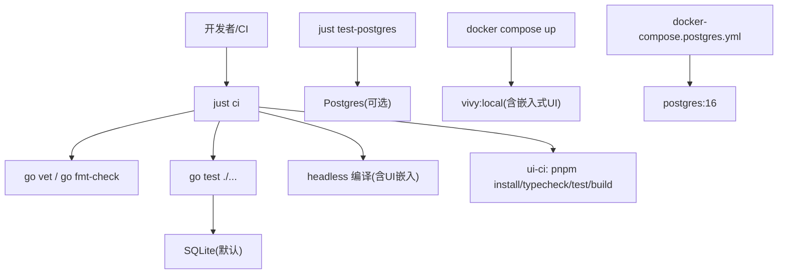
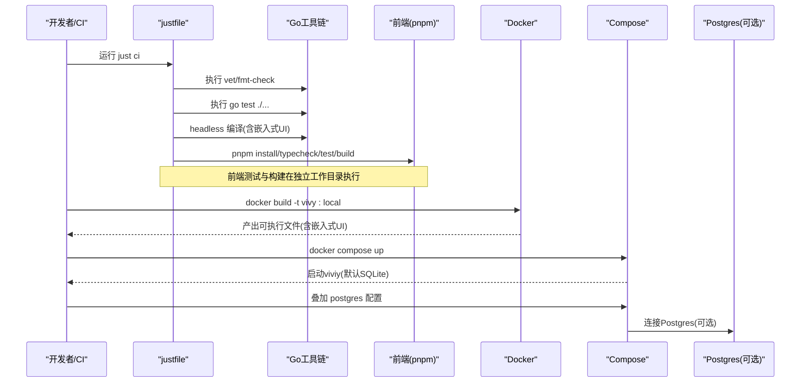
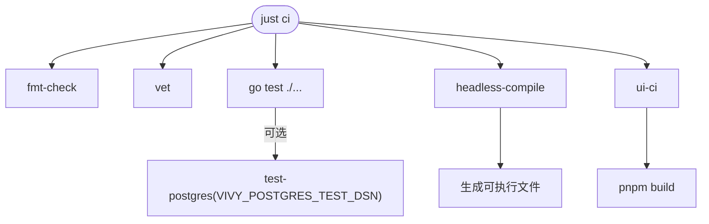
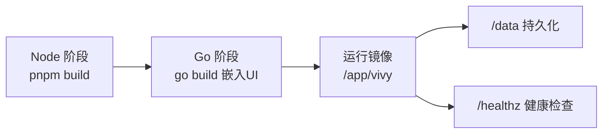
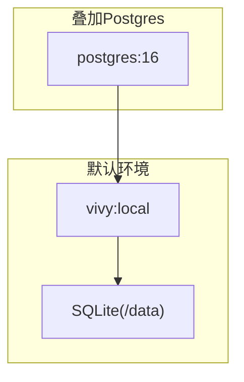
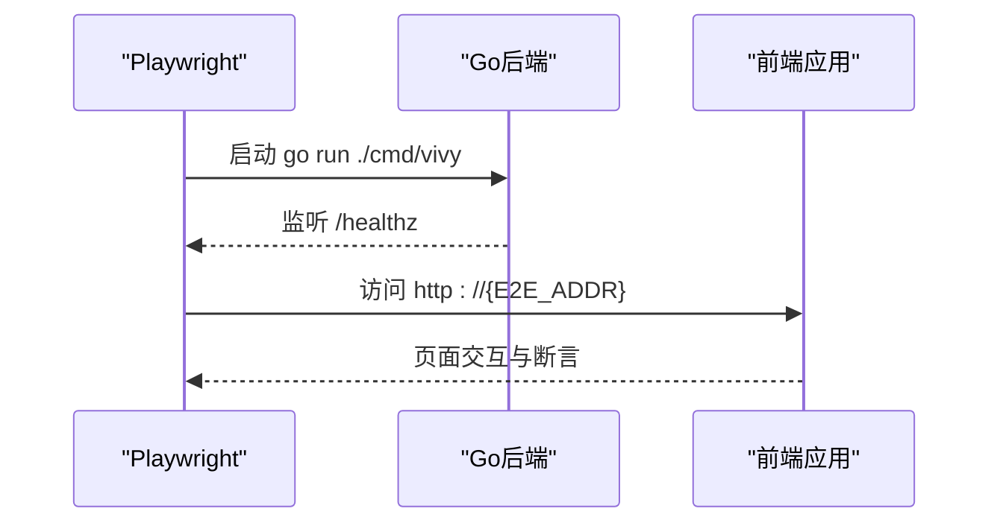
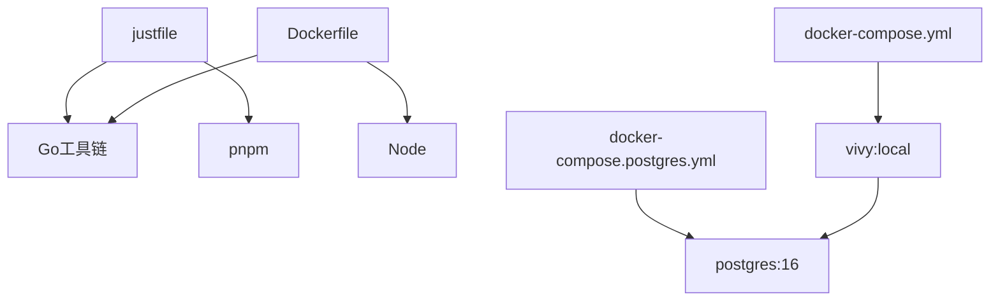

# 测试自动化

<cite>
**本文引用的文件**
- [justfile](file://justfile)
- [Dockerfile](file://Dockerfile)
- [docker-compose.yml](file://docker-compose.yml)
- [docker-compose.postgres.yml](file://docker-compose.postgres.yml)
- [ui/playwright.config.ts](file://ui/playwright.config.ts)
- [ui/vitest.config.ts](file://ui/vitest.config.ts)
- [ui/package.json](file://ui/package.json)
- [ui/e2e/runtime.spec.ts](file://ui/e2e/runtime.spec.ts)
- [config.dev.yaml](file://config.dev.yaml)
- [config.example.yaml](file://config.example.yaml)
- [fixtures/README.md](file://fixtures/README.md)
</cite>

## 目录
1. [简介](#简介)
2. [项目结构](#项目结构)
3. [核心组件](#核心组件)
4. [架构总览](#架构总览)
5. [详细组件分析](#详细组件分析)
6. [依赖关系分析](#依赖关系分析)
7. [性能与并行性](#性能与并行性)
8. [故障排查指南](#故障排查指南)
9. [结论](#结论)
10. [附录](#附录)

## 简介
本文件聚焦于 Vivy Agent（vivy.exe）仓库的测试自动化体系，覆盖持续集成流程、容器化测试环境、并行测试执行、justfile 任务编排、前端 UI 测试、后端 Go 测试、覆盖率与质量门禁、结果通知、本地开发内环、预提交钩子、代码质量检查、测试环境管理、依赖版本控制与测试数据同步策略。目标是让不同技术背景的读者都能理解并高效使用这套自动化体系。

## 项目结构
仓库采用“单 Go 模块 + 内嵌前端”的结构：
- 后端：Go 语言实现，提供网关与运行时能力；测试通过 go test 运行。
- 前端：React + Vite 构建，单元测试使用 Vitest，端到端测试使用 Playwright。
- 容器化：多阶段 Docker 构建，将前端产物嵌入到最终二进制中，默认 SQLite 存储，可选 Postgres 作为 Journal 引擎。
- 任务编排：根目录 justfile 统一封装常用命令（格式化、静态检查、测试、构建、容器化、E2E）。

图表来源
- [justfile:17-37](file://justfile#L17-L37)
- [Dockerfile:7-29](file://Dockerfile#L7-L29)
- [docker-compose.yml:6-29](file://docker-compose.yml#L6-L29)
- [docker-compose.postgres.yml:4-31](file://docker-compose.postgres.yml#L4-L31)

章节来源
- [justfile:1-70](file://justfile#L1-L70)
- [Dockerfile:1-48](file://Dockerfile#L1-L48)
- [docker-compose.yml:1-33](file://docker-compose.yml#L1-L33)
- [docker-compose.postgres.yml:1-35](file://docker-compose.postgres.yml#L1-L35)

## 核心组件
- 任务编排器（justfile）：集中定义格式化、静态检查、测试、构建、容器化、E2E 等任务，是 CI 与本地开发的统一入口。
- 容器镜像（Dockerfile）：多阶段构建，先构建前端产物，再构建 Go 二进制，最终生成包含嵌入式 UI 的可执行文件。
- 服务编排（docker-compose）：一键启动 Vivy 进程，默认 SQLite；叠加 Postgres 配置以切换持久化后端。
- 前端测试（Vitest/Playwright）：单元/集成测试与浏览器级 E2E 测试，配合 Playwright 启动后端服务进行联调。
- 环境变量与配置：通过环境变量注入密钥与地址，配置文件仅保存 env_key 名称，避免敏感信息落盘。

章节来源
- [justfile:17-37](file://justfile#L17-L37)
- [Dockerfile:21-47](file://Dockerfile#L21-L47)
- [docker-compose.yml:6-29](file://docker-compose.yml#L6-L29)
- [docker-compose.postgres.yml:22-31](file://docker-compose.postgres.yml#L22-L31)
- [ui/playwright.config.ts:6-12](file://ui/playwright.config.ts#L6-L12)

## 架构总览
下图展示从开发者或 CI 触发到测试执行、构建与容器化的整体流程，以及可选的 Postgres 集成路径。

图表来源
- [justfile:17-37](file://justfile#L17-L37)
- [Dockerfile:7-47](file://Dockerfile#L7-L47)
- [docker-compose.yml:6-29](file://docker-compose.yml#L6-L29)
- [docker-compose.postgres.yml:22-31](file://docker-compose.postgres.yml#L22-L31)

## 详细组件分析

### justfile 任务与 CI 流水线
- 格式化与静态检查：fmt-check 与 vet 确保代码风格一致与潜在问题早发现。
- 测试：test 执行全部 Go 测试；test-postgres 在设置环境变量时执行 Postgres 相关测试。
- 构建：build-split 输出后端二进制与前端静态资源；headless-compile 用于无头模式编译（含嵌入式 UI）。
- 前端 CI：ui-ci 完成安装、类型检查、测试与构建。
- 容器化：docker-build/docker-up/docker-up-postgres 提供一键打包与运行。
- 开发内环：dev 调用 dev.ps1 同时启动后端与 Vite 前端。

图表来源
- [justfile:17-37](file://justfile#L17-L37)
- [justfile:59-61](file://justfile#L59-L61)

章节来源
- [justfile:17-37](file://justfile#L17-L37)
- [justfile:59-61](file://justfile#L59-L61)

### 容器化测试环境与镜像构建
- 多阶段构建：第一阶段 Node 构建前端产物；第二阶段 Go 构建二进制并将前端产物嵌入；第三阶段最小化运行镜像。
- 健康检查：HEALTHCHECK 探测 /healthz 接口，便于编排系统判断就绪。
- 端口与卷：暴露 8787，挂载 /data 持久化数据。
- 环境变量：VIVY_CONFIG、VIVY_ADDR、TZ 等控制行为。

图表来源
- [Dockerfile:7-47](file://Dockerfile#L7-L47)

章节来源
- [Dockerfile:1-48](file://Dockerfile#L1-L48)

### 服务编排与可选 Postgres 集成
- 默认 SQLite：docker-compose.yml 启动单一 Vivy 实例，绑定 127.0.0.1:8787，挂载数据卷。
- 可选 Postgres：叠加 docker-compose.postgres.yml 引入 Postgres 服务，并通过环境变量切换配置与 DSN。
- 健康检查：Compose 对 Vivy 与 Postgres 均配置健康检查，确保依赖就绪后再启动。

图表来源
- [docker-compose.yml:6-29](file://docker-compose.yml#L6-L29)
- [docker-compose.postgres.yml:4-31](file://docker-compose.postgres.yml#L4-L31)

章节来源
- [docker-compose.yml:1-33](file://docker-compose.yml#L1-L33)
- [docker-compose.postgres.yml:1-35](file://docker-compose.postgres.yml#L1-L35)

### 前端测试：单元与端到端
- 单元测试：Vitest 配置限定测试文件范围，排除无关目录，支持快速反馈。
- 端到端测试：Playwright 配置自动准备工作目录，启动后端服务（基于 go run），等待 /healthz 就绪后执行 e2e 用例。
- 脚本入口：package.json 提供 test 与 e2e 脚本，便于本地与 CI 复用。

图表来源
- [ui/playwright.config.ts:6-12](file://ui/playwright.config.ts#L6-L12)
- [ui/vitest.config.ts:3-7](file://ui/vitest.config.ts#L3-L7)
- [ui/package.json:6-12](file://ui/package.json#L6-L12)

章节来源
- [ui/playwright.config.ts:1-13](file://ui/playwright.config.ts#L1-L13)
- [ui/vitest.config.ts:1-9](file://ui/vitest.config.ts#L1-L9)
- [ui/package.json:1-82](file://ui/package.json#L1-L82)
- [ui/e2e/runtime.spec.ts:1-200](file://ui/e2e/runtime.spec.ts#L1-L200)

### 测试覆盖率收集与质量门禁
- 覆盖率收集：Go 侧可通过 go test -coverprofile 生成覆盖率文件；前端 Vitest 可通过 --coverage 参数启用。建议在 justfile 中新增任务以统一入口。
- 质量门禁：当前 just ci 已包含格式化检查、vet、测试与构建；可在 CI 中增加覆盖率阈值门禁（如要求最低覆盖率）与报告上传。
- 建议：在 justfile 中扩展 coverage 任务，并在 CI 中根据覆盖率阈值决定是否失败。

章节来源
- [justfile:17-37](file://justfile#L17-L37)

### 测试结果通知
- 当前仓库未内置通知机制；可在 CI 平台（如 GitHub Actions）上根据 just ci 的结果发送通知（邮件、Webhook、IM 等）。
- 建议：在 CI 步骤末尾添加通知步骤，依据退出码与覆盖率报告决定通知内容与级别。

[本节为通用实践说明，不直接分析具体文件]

### 本地开发环境测试自动化与预提交钩子
- 本地开发：just dev 启动后端与 Vite 前端分离调试；just ui-e2e 构建前端并运行 E2E。
- 预提交钩子：仓库未包含 .git/hooks 或 pre-commit 配置；可在本地通过 pre-commit 框架集成 just fmt-check、just vet、just test 等任务，保证提交前质量。
- 建议：在仓库中添加 pre-commit 配置，统一团队质量门禁。

章节来源
- [justfile:39-47](file://justfile#L39-L47)

### 测试环境管理与依赖版本控制
- 依赖锁定：Go 使用 go.mod/go.sum；前端使用 pnpm-lock.yaml；确保构建可重现。
- 代理与缓存：Docker 构建传入 GOPROXY 与 NPM_REGISTRY，加速依赖下载；本地 setup 任务设置 GOPROXY。
- 测试数据：fixtures/provider 提供 Provider 相关 fixture；遵循“密钥不落盘”原则，日志与快照需脱敏。

章节来源
- [justfile:9-12](file://justfile#L9-L12)
- [Dockerfile:4-17](file://Dockerfile#L4-L17)
- [fixtures/README.md:1-200](file://fixtures/README.md#L1-L200)

### 测试数据同步策略
- 固定版本：所有依赖通过锁定文件（go.sum、pnpm-lock.yaml）固定版本，避免漂移。
- 配置隔离：开发配置与示例配置分离，敏感字段通过环境变量注入，不在配置中明文保存。
- 数据持久化：默认 SQLite 存储在 /data 卷中；Postgres 通过 DSN 指定数据库，便于在容器中隔离数据。

章节来源
- [docker-compose.yml:18-23](file://docker-compose.yml#L18-L23)
- [docker-compose.postgres.yml:26-31](file://docker-compose.postgres.yml#L26-L31)
- [config.dev.yaml:1-200](file://config.dev.yaml#L1-L200)
- [config.example.yaml:1-200](file://config.example.yaml#L1-L200)

## 依赖关系分析
- justfile 依赖 Go 工具链与 pnpm；Dockerfile 依赖 Node 与 Go 构建环境；Compose 依赖 Docker 与可选 Postgres。
- 前端测试依赖 Playwright/Vitest；后端测试依赖 Go 测试框架。
- 环境变量驱动行为：VIVY_CONFIG、VIVY_ADDR、VIVY_POSTGRES_DSN、OPENAI_API_KEY、ANTHROPIC_API_KEY 等。

图表来源
- [justfile:1-70](file://justfile#L1-L70)
- [Dockerfile:7-47](file://Dockerfile#L7-L47)
- [docker-compose.yml:6-29](file://docker-compose.yml#L6-L29)
- [docker-compose.postgres.yml:4-31](file://docker-compose.postgres.yml#L4-L31)

章节来源
- [justfile:1-70](file://justfile#L1-L70)
- [Dockerfile:1-48](file://Dockerfile#L1-L48)
- [docker-compose.yml:1-33](file://docker-compose.yml#L1-L33)
- [docker-compose.postgres.yml:1-35](file://docker-compose.postgres.yml#L1-L35)

## 性能与并行性
- 并行测试：Go 测试默认并行；前端 Vitest 可按需开启并发；Playwright E2E 当前 workers=1，适合稳定复现但速度较慢，可根据需要调整。
- 构建优化：Docker 多阶段构建利用缓存层；前端构建与 Go 构建分离，减少重复工作。
- 建议：在 justfile 中为 vitest 启用并发；在 CI 中缓存依赖目录，缩短构建时间。

[本节为通用实践说明，不直接分析具体文件]

## 故障排查指南
- 网络与代理：若依赖下载失败，确认 GOPROXY 与 NPM_REGISTRY 设置正确；本地 setup 任务会设置 GOPROXY。
- 端口冲突：默认 8787 与 3015（Vite 开发端口），如遇占用请修改端口或停止占用进程。
- 健康检查失败：检查 /healthz 是否可达；确认 VIVY_ADDR 与环境变量是否正确。
- Postgres 连接：确保叠加 compose 文件且 VIVY_POSTGRES_DSN 指向正确的服务名与凭据。
- E2E 启动失败：确认 Playwright 能启动 go run 后端并等待 /healthz 就绪；必要时增大超时。

章节来源
- [justfile:9-12](file://justfile#L9-L12)
- [docker-compose.yml:16-29](file://docker-compose.yml#L16-L29)
- [docker-compose.postgres.yml:26-31](file://docker-compose.postgres.yml#L26-L31)
- [ui/playwright.config.ts:6-12](file://ui/playwright.config.ts#L6-L12)

## 结论
该仓库通过 justfile 统一了测试与构建流程，结合 Docker 与 Compose 实现了可复现的容器化测试环境；前端采用 Vitest 与 Playwright 完成单元与端到端测试；默认 SQLite 与可选 Postgres 提供了灵活的存储方案。建议在现有基础上补充覆盖率收集与门禁、通知机制与预提交钩子，进一步提升质量与协作效率。

[本节为总结性内容，不直接分析具体文件]

## 附录
- 常用命令速查：
  - 本地开发：just dev
  - 全量检查与测试：just ci
  - 容器化构建与运行：just docker-build / docker-compose up
  - 可选 Postgres：docker-compose -f docker-compose.yml -f docker-compose.postgres.yml up
  - 前端 E2E：just ui-e2e

章节来源
- [justfile:42-61](file://justfile#L42-L61)
- [docker-compose.yml:6-29](file://docker-compose.yml#L6-L29)
- [docker-compose.postgres.yml:22-31](file://docker-compose.postgres.yml#L22-L31)