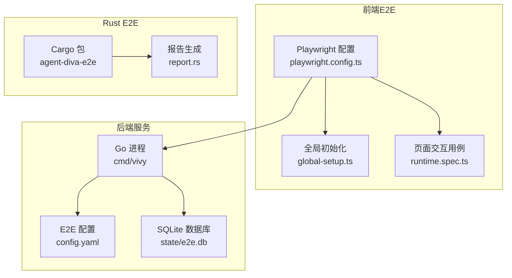
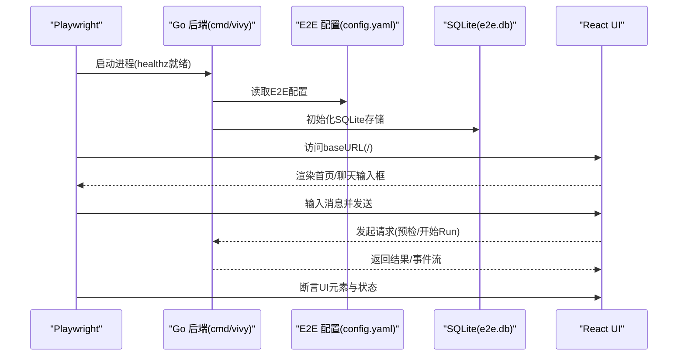
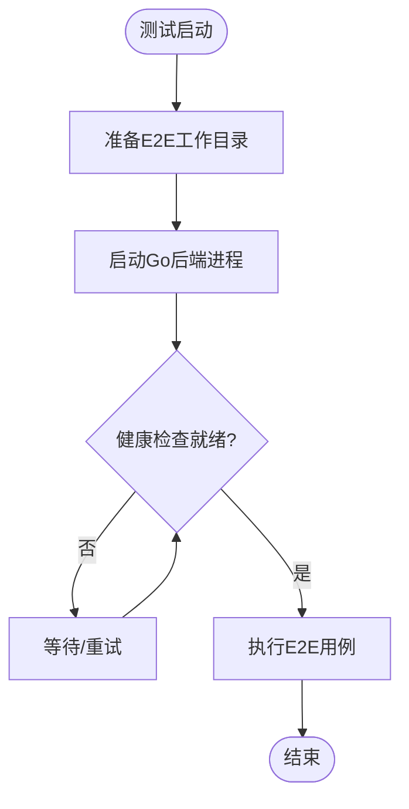
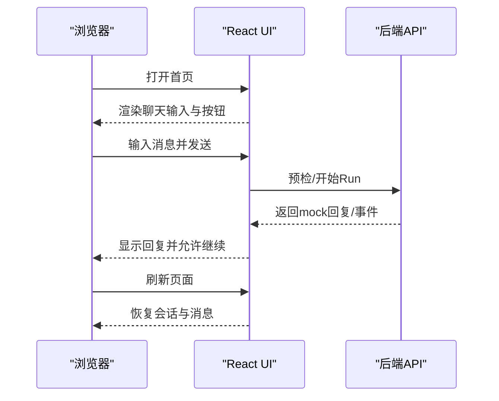
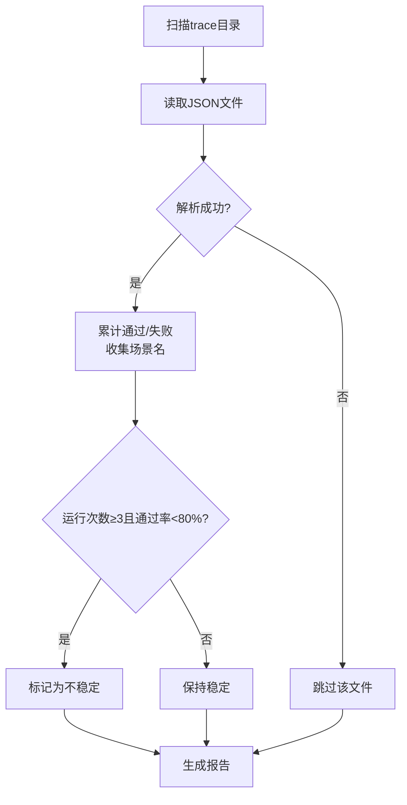
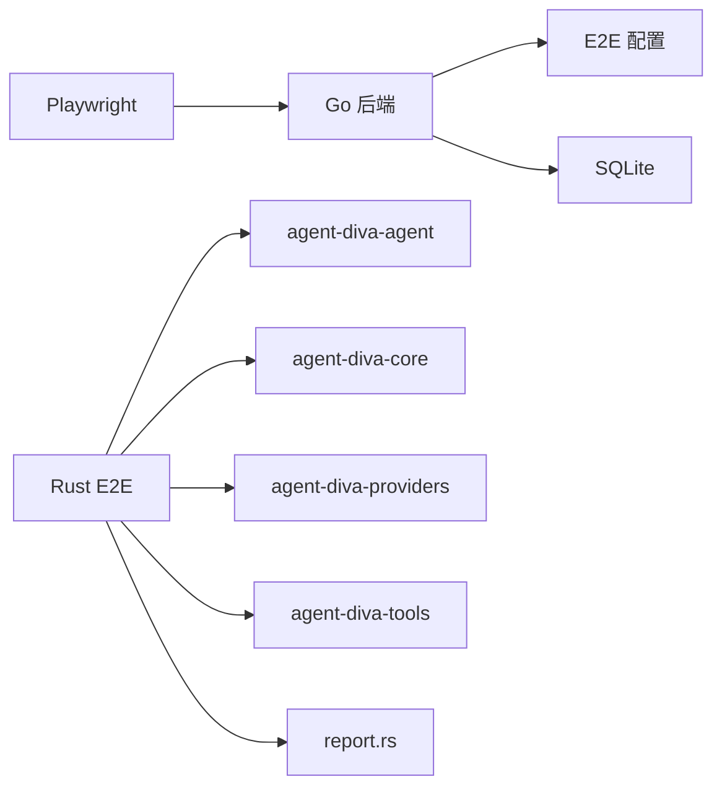

# 端到端测试

<cite>
**本文引用的文件**
- [ui/playwright.config.ts](file://ui/playwright.config.ts)
- [ui/e2e/global-setup.ts](file://ui/e2e/global-setup.ts)
- [ui/e2e/runtime.spec.ts](file://ui/e2e/runtime.spec.ts)
- [fixtures/README.md](file://fixtures/README.md)
- [internal/tools/exclusions.go](file://internal/tools/exclusions.go)
- [internal/app/realsmoke_test.go](file://internal/app/realsmoke_test.go)
- [ui/agent-diva-source/agent-diva-e2e/Cargo.toml](file://ui/agent-diva-source/agent-diva-e2e/Cargo.toml)
- [ui/agent-diva-source/agent-diva-e2e/src/report.rs](file://ui/agent-diva-source/agent-diva-e2e/src/report.rs)
</cite>

## 目录
1. [简介](#简介)
2. [项目结构](#项目结构)
3. [核心组件](#核心组件)
4. [架构总览](#架构总览)
5. [详细组件分析](#详细组件分析)
6. [依赖关系分析](#依赖关系分析)
7. [性能考虑](#性能考虑)
8. [故障排查指南](#故障排查指南)
9. [结论](#结论)
10. [附录](#附录)

## 简介
本文件面向 Vivy 项目的端到端（E2E）测试体系，覆盖前端 React 应用的 Playwright 自动化测试与 Rust 编写的 Agent E2E 测试框架。内容涵盖：
- 前端：Playwright 配置、页面交互测试、组件行为验证、响应式布局断言、会话与审批流、设置页导航等。
- 后端：Go 应用启动、SQLite 存储、Mock 运行模式、事件总线与持久化。
- Rust E2E：场景定义、追踪写入、报告生成、不稳定用例检测。
- 数据与环境：测试数据准备、环境初始化、浏览器自动化配置、密钥管理策略。
- 集成能力：用户界面测试、API 调用测试、实时通信（WebSocket）测试方法。
- 质量保障：测试报告分析、失败用例调试、性能监控与成本估算。

## 项目结构
E2E 测试由两部分组成：
- 前端 UI E2E：基于 Playwright，驱动内嵌 React + Vite 的 Vivy Studio 前端，通过 Go 进程启动后端服务，使用 SQLite 存储与 Mock 运行时进行确定性交互。
- Rust Agent E2E：位于 ui/agent-diva-source/agent-diva-e2e，负责真实 LLM 调用的端到端场景执行、追踪记录与报告汇总。

图表来源
- [ui/playwright.config.ts:1-13](file://ui/playwright.config.ts#L1-L13)
- [ui/e2e/global-setup.ts:1-23](file://ui/e2e/global-setup.ts#L1-L23)
- [ui/e2e/runtime.spec.ts:1-120](file://ui/e2e/runtime.spec.ts#L1-L120)
- [ui/agent-diva-source/agent-diva-e2e/Cargo.toml:1-31](file://ui/agent-diva-source/agent-diva-e2e/Cargo.toml#L1-L31)
- [ui/agent-diva-source/agent-diva-e2e/src/report.rs:1-88](file://ui/agent-diva-source/agent-diva-e2e/src/report.rs#L1-L88)

章节来源
- [ui/playwright.config.ts:1-13](file://ui/playwright.config.ts#L1-L13)
- [ui/e2e/global-setup.ts:1-23](file://ui/e2e/global-setup.ts#L1-L23)
- [ui/e2e/runtime.spec.ts:1-120](file://ui/e2e/runtime.spec.ts#L1-L120)
- [ui/agent-diva-source/agent-diva-e2e/Cargo.toml:1-31](file://ui/agent-diva-source/agent-diva-e2e/Cargo.toml#L1-L31)
- [ui/agent-diva-source/agent-diva-e2e/src/report.rs:1-88](file://ui/agent-diva-source/agent-diva-e2e/src/report.rs#L1-L88)

## 核心组件
- Playwright 配置与服务器管理：自动准备工作目录、启动 Go 后端进程、监听健康检查、设置 baseURL 与超时。
- 全局初始化：清理并创建隔离的工作目录，生成 E2E 专用配置文件，指定 SQLite 路径、Provider Bundle 目录、启用 Mock 运行模式与工具白名单。
- 页面交互测试：覆盖首页、对话发送、继续按钮、刷新后状态保持、新会话、审批中心、设置页、记忆、MCP、记事本、移动端适配等。
- Rust E2E 报告：聚合 trace JSON 文件，统计通过/失败数量、估算成本、识别不稳定用例（≥3次运行且通过率<80%）。

章节来源
- [ui/playwright.config.ts:1-13](file://ui/playwright.config.ts#L1-L13)
- [ui/e2e/global-setup.ts:1-23](file://ui/e2e/global-setup.ts#L1-L23)
- [ui/e2e/runtime.spec.ts:1-120](file://ui/e2e/runtime.spec.ts#L1-L120)
- [ui/agent-diva-source/agent-diva-e2e/src/report.rs:1-88](file://ui/agent-diva-source/agent-diva-e2e/src/report.rs#L1-L88)

## 架构总览
前端 E2E 通过 Playwright 启动 Go 后端，加载 E2E 配置与 SQLite 存储，以 Mock 模式运行 Agent，确保可重复的对话与审批流程；Rust E2E 独立于前端，专注于真实 LLM 调用的端到端场景与报告生成。

图表来源
- [ui/playwright.config.ts:1-13](file://ui/playwright.config.ts#L1-L13)
- [ui/e2e/global-setup.ts:1-23](file://ui/e2e/global-setup.ts#L1-L23)
- [ui/e2e/runtime.spec.ts:1-120](file://ui/e2e/runtime.spec.ts#L1-L120)

## 详细组件分析

### Playwright 配置与服务器生命周期
- 工作目录准备：首次执行时清理并创建 .e2e-workdir，避免污染本地状态。
- 后端启动：使用 go run ./cmd/vivy 启动后端，等待 /healthz 就绪后再运行测试。
- 环境变量注入：VIVY_ADDR 与 VIVY_CONFIG 指向 E2E 专用配置，确保隔离。
- 超时与并发：单 worker、重试关闭、合理超时，保证稳定性。

图表来源
- [ui/playwright.config.ts:1-13](file://ui/playwright.config.ts#L1-L13)
- [ui/e2e/global-setup.ts:1-23](file://ui/e2e/global-setup.ts#L1-L23)

章节来源
- [ui/playwright.config.ts:1-13](file://ui/playwright.config.ts#L1-L13)
- [ui/e2e/global-setup.ts:1-23](file://ui/e2e/global-setup.ts#L1-L23)

### 页面交互测试（React UI）
- 首页与聊天：断言标题、占位符、附件与画图按钮、上下文占用进度条可见性。
- 响应式布局：切换视口尺寸，断言导航按钮与滚动行为符合预期。
- 对话流程：输入消息、点击发送、处理“继续”按钮、断言 mock 回复显示。
- 刷新持久化：刷新页面后仍能看到历史消息，验证会话持久化。
- 审批中心：进入审批对话框、刷新详情、批准并断言状态更新。
- 设置与功能开关：模型、人格、面具、生命周期、MCP 服务开关等。
- 记忆与搜索：搜索不存在项返回空匹配，验证搜索逻辑。
- 记事本与演示：打开演示横幅、搜索会话内容、生成报告并校验 localStorage 键名。

图表来源
- [ui/e2e/runtime.spec.ts:1-120](file://ui/e2e/runtime.spec.ts#L1-L120)

章节来源
- [ui/e2e/runtime.spec.ts:1-120](file://ui/e2e/runtime.spec.ts#L1-L120)

### Rust Agent E2E 报告与不稳定检测
- 报告结构：包含总场景数、通过/失败计数、跳过数、成本估算、不稳定场景列表与详细场景追踪。
- 扫描与聚合：遍历 trace 目录下的 JSON 文件，反序列化为 TraceEntry，累计通过/失败并收集场景名。
- 不稳定检测：对同一场景多次运行计算通过率，若运行次数≥3且通过率<80%，标记为不稳定。
- 鲁棒性：忽略非 JSON 文件，静默跳过损坏 JSON，空目录或不存在目录返回零值报告。

图表来源
- [ui/agent-diva-source/agent-diva-e2e/src/report.rs:1-88](file://ui/agent-diva-source/agent-diva-e2e/src/report.rs#L1-L88)

章节来源
- [ui/agent-diva-source/agent-diva-e2e/src/report.rs:1-88](file://ui/agent-diva-source/agent-diva-e2e/src/report.rs#L1-L88)
- [ui/agent-diva-source/agent-diva-e2e/Cargo.toml:1-31](file://ui/agent-diva-source/agent-diva-e2e/Cargo.toml#L1-L31)

### 测试数据与环境初始化
- 工作目录隔离：每次测试前删除并重建 .e2e-workdir/state，确保无残留状态。
- 配置文件生成：写入 server.addr、storage.backend=sqlite、providers.bundle_dir、runtime.mock=true、tools.enabled 白名单、approval.expiration 等。
- Provider Fixture：使用 fixtures/provider 下的固定配置，保证可重复的 Provider 行为。
- 密钥管理：配置仅保存 env_key 名称，不持久化密钥，遵循仓库安全红线。

章节来源
- [ui/e2e/global-setup.ts:1-23](file://ui/e2e/global-setup.ts#L1-L23)
- [fixtures/README.md:1-16](file://fixtures/README.md#L1-L16)

### 浏览器自动化与安全边界
- 浏览器自动化限制：生产环境中禁止通过工具名匹配到 browser_use、playwright、puppeteer 等名称的工具，防止 Agent 直接操控浏览器。
- 测试用途：E2E 测试通过 Playwright 在外部驱动浏览器，Agent 侧不暴露浏览器控制能力，符合安全边界。

章节来源
- [internal/tools/exclusions.go:1-12](file://internal/tools/exclusions.go#L1-L12)

### API 调用与实时通信测试
- API 调用：前端通过 REST/JSON-RPC 发起预检与消息发送，后端返回 RunID 与状态，前端订阅事件流更新 UI。
- 实时通信：Go 后端提供 WebSocket 通道，前端订阅 Run 事件，实现消息增量渲染与状态同步。
- 真实提供者冒烟测试：Go 测试套件支持在开启环境变量时连接真实 Provider，验证关键接受锚点（AS-1、AS-5、AS-7），用于 CI 门禁。

章节来源
- [internal/app/realsmoke_test.go:1-64](file://internal/app/realsmoke_test.go#L1-L64)

## 依赖关系分析
- 前端 E2E 依赖 Playwright、Node 运行时、Go 后端进程与 E2E 配置。
- Rust E2E 依赖 agent-diva-agent/core/providers/tools/tooling 等内部模块，以及 serde/serde_json/chrono/uuid 等库。
- 报告模块依赖 tracer 输出与 collector 事件，形成稳定的聚合链路。

图表来源
- [ui/playwright.config.ts:1-13](file://ui/playwright.config.ts#L1-L13)
- [ui/agent-diva-source/agent-diva-e2e/Cargo.toml:1-31](file://ui/agent-diva-source/agent-diva-e2e/Cargo.toml#L1-L31)
- [ui/agent-diva-source/agent-diva-e2e/src/report.rs:1-88](file://ui/agent-diva-source/agent-diva-e2e/src/report.rs#L1-L88)

章节来源
- [ui/playwright.config.ts:1-13](file://ui/playwright.config.ts#L1-L13)
- [ui/agent-diva-source/agent-diva-e2e/Cargo.toml:1-31](file://ui/agent-diva-source/agent-diva-e2e/Cargo.toml#L1-L31)
- [ui/agent-diva-source/agent-diva-e2e/src/report.rs:1-88](file://ui/agent-diva-source/agent-diva-e2e/src/report.rs#L1-L88)

## 性能考虑
- Playwright 单 worker、无重试：降低并发竞争，提高稳定性，适合 UI 自动化。
- 后端健康检查：避免竞态导致的启动失败，减少无效等待。
- SQLite 存储：轻量、快速，适合 E2E 隔离环境；注意写入频率与事务边界。
- Rust 报告聚合：线性扫描 JSON 文件，时间复杂度 O(n)，适用于中等规模 trace 目录；可通过并行读取进一步优化。
- 成本估算：按场景运行次数估算 USD 成本，便于 CI 中监控开销。

[本节为通用指导，无需特定文件引用]

## 故障排查指南
- 后端未就绪：检查 healthz 端口与 VIVY_ADDR 配置，确认 Go 进程已启动且可访问。
- 配置错误：核对 e2eConfig 中的 storage.backend、providers.bundle_dir、runtime.mock、tools.enabled 等字段。
- 浏览器交互失败：确认视口尺寸切换与导航按钮可见性；检查页面元素选择器是否稳定。
- 审批流异常：确认审批中心对话框出现、刷新后可见详情、批准按钮可用。
- Rust 报告为空：检查 trace 目录是否存在 JSON 文件，文件名与格式是否符合 TraceEntry 结构。
- 不稳定用例：查看 flaky_scenarios 列表，增加重试或优化断言条件；必要时拆分场景。

章节来源
- [ui/playwright.config.ts:1-13](file://ui/playwright.config.ts#L1-L13)
- [ui/e2e/global-setup.ts:1-23](file://ui/e2e/global-setup.ts#L1-L23)
- [ui/e2e/runtime.spec.ts:1-120](file://ui/e2e/runtime.spec.ts#L1-L120)
- [ui/agent-diva-source/agent-diva-e2e/src/report.rs:1-88](file://ui/agent-diva-source/agent-diva-e2e/src/report.rs#L1-L88)

## 结论
本项目构建了完整的前后端 E2E 测试闭环：前端通过 Playwright 驱动 React UI，结合 Go 后端与 SQLite 存储，实现可重复的对话、审批与设置流程；Rust E2E 聚焦真实 LLM 调用的场景执行与报告生成，提供不稳定用例检测与成本估算。整体设计遵循安全边界与密钥管理策略，具备良好的可维护性与可扩展性。

[本节为总结，无需特定文件引用]

## 附录
- 运行建议：
  - 前端 E2E：确保 Go 后端可编译运行，fixtures/provider 存在，OPENAI_API_KEY 仅在需要真实 Provider 时设置。
  - Rust E2E：确保 Cargo 依赖可用，trace 目录可写，报告生成路径正确。
- 最佳实践：
  - 使用隔离工作目录与配置，避免污染开发环境。
  - 断言优先使用语义化选择器（角色、文本、占位符），提升稳定性。
  - 对不稳定用例进行根因分析与修复，而非简单增加重试。
  - 在 CI 中启用真实提供者冒烟测试，验证关键接受锚点。

[本节为补充信息，无需特定文件引用]