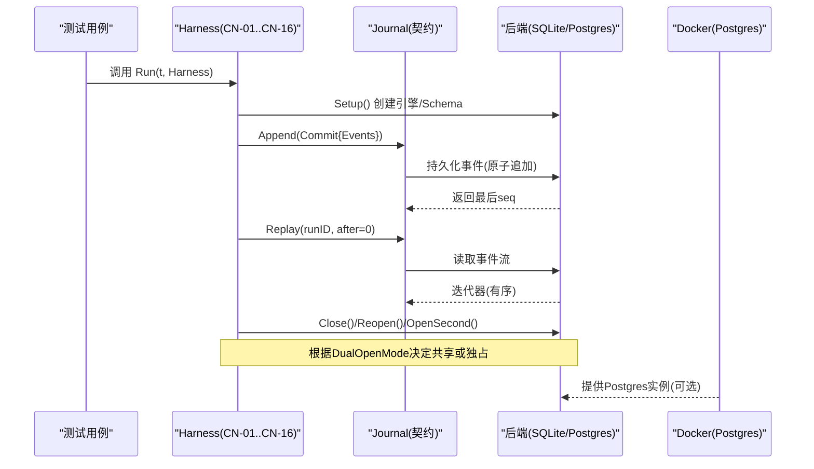
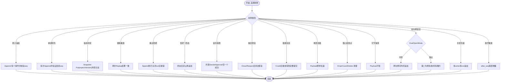
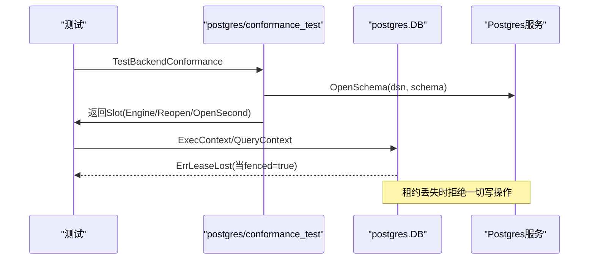
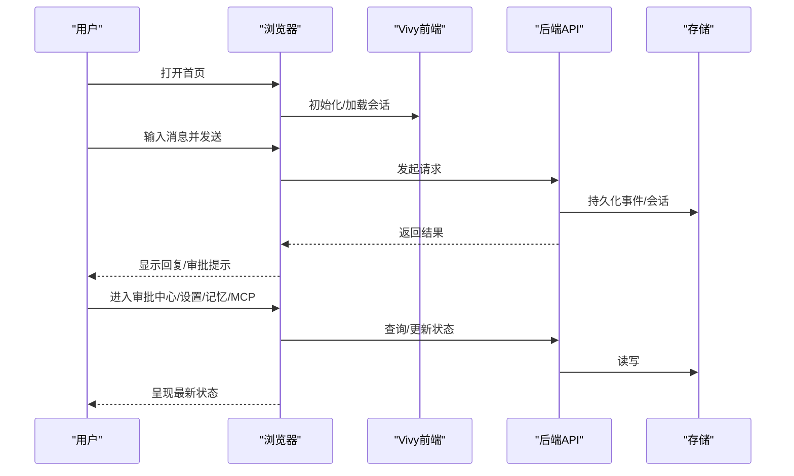
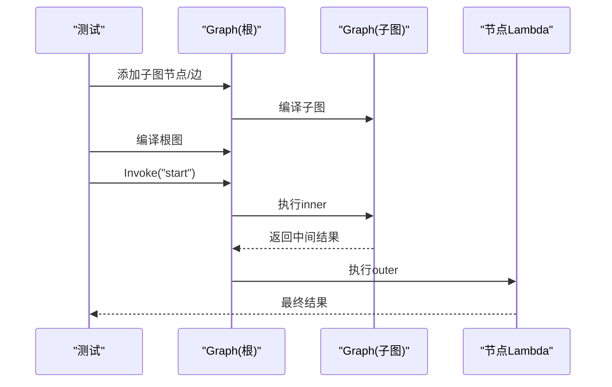
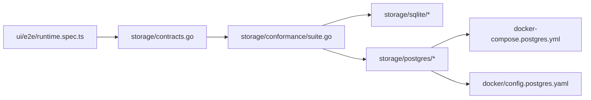

# 集成测试

<cite>
**本文引用的文件**
- [internal/storage/conformance/suite.go](file://internal/storage/conformance/suite.go)
- [internal/storage/contracts.go](file://internal/storage/contracts.go)
- [internal/storage/sqlite/conformance_test.go](file://internal/storage/sqlite/conformance_test.go)
- [internal/storage/postgres/conformance_test.go](file://internal/storage/postgres/conformance_test.go)
- [internal/storage/sqlite/sqlite_test.go](file://internal/storage/sqlite/sqlite_test.go)
- [internal/storage/postgres/db_test.go](file://internal/storage/postgres/db_test.go)
- [docker-compose.postgres.yml](file://docker-compose.postgres.yml)
- [docker/config.postgres.yaml](file://docker/config.postgres.yaml)
- [internal/runtime/graph_conformance_test.go](file://internal/runtime/graph_conformance_test.go)
- [ui/e2e/runtime.spec.ts](file://ui/e2e/runtime.spec.ts)
</cite>

## 目录
1. [简介](#简介)
2. [项目结构](#项目结构)
3. [核心组件](#核心组件)
4. [架构总览](#架构总览)
5. [详细组件分析](#详细组件分析)
6. [依赖关系分析](#依赖关系分析)
7. [性能与压力测试](#性能与压力测试)
8. [故障排查指南](#故障排查指南)
9. [结论](#结论)
10. [附录](#附录)

## 简介
本文件聚焦于 Vivy 的集成测试体系，重点覆盖：
- 数据库集成测试：SQLite 与 PostgreSQL 双后端策略与一致性验证。
- 契约测试（Conformance Tests）：以 CN-01..CN-16 统一用例驱动不同存储后端的行为一致性。
- 端到端场景测试：Playwright 驱动的 UI 工作流、审批、设置、记忆等流程验证。
- 事件序列与工作流验证：基于运行日志重放、终止态唯一性、并发写入等约束。
- 测试数据与环境管理：临时目录、Schema 隔离、Docker Compose 启动 Postgres。
- 事务与回滚策略：乐观锁、租约机制、原子追加与幂等重放。
- 性能基准与压力测试：并发写入、多写者、重放尾部增量等压测思路与执行方法。

## 项目结构
仓库将存储契约与实现解耦：
- internal/storage/contracts.go 定义 Engine、Journal、SnapshotStore、BlobStore、LeaseStore 等接口及共享错误语义。
- internal/storage/conformance/suite.go 提供跨后端的契约测试套件（CN-01..CN-16）。
- internal/storage/sqlite 与 internal/storage/postgres 分别实现 SQLite 与 PostgreSQL 后端，并通过各自的 conformance_test.go 接入同一套契约测试。
- docker 与 docker-compose 提供 Postgres 环境与运行时配置叠加。
- ui/e2e/runtime.spec.ts 提供前端端到端测试，覆盖会话、审批、设置、记忆、MCP、报告等关键路径。
- internal/runtime/graph_conformance_test.go 验证 Eino 工作图在嵌套、取消与生产边界上的行为。

```mermaid
graph TB
subgraph "存储契约"
C["contracts.go<br/>Engine/Journal/Snapshot/Blob/Lease"]
end
subgraph "契约测试套件"
S["conformance/suite.go<br/>CN-01..CN-16"]
end
subgraph "后端实现"
SQLI["sqlite/*.go"]
PG["postgres/*.go"]
end
subgraph "环境"
DC["docker-compose.postgres.yml"]
CFG["config.postgres.yaml"]
end
subgraph "E2E"
E2E["ui/e2e/runtime.spec.ts"]
end
subgraph "运行时契约"
RT["runtime/graph_conformance_test.go"]
end
C --> S
S --> SQLI
S --> PG
DC --> PG
CFG --> PG
E2E --> C
RT --> C
```

图表来源
- [internal/storage/contracts.go:1-282](file://internal/storage/contracts.go#L1-L282)
- [internal/storage/conformance/suite.go:1-549](file://internal/storage/conformance/suite.go#L1-L549)
- [internal/storage/sqlite/conformance_test.go:1-32](file://internal/storage/sqlite/conformance_test.go#L1-L32)
- [internal/storage/postgres/conformance_test.go:1-41](file://internal/storage/postgres/conformance_test.go#L1-L41)
- [docker-compose.postgres.yml:1-35](file://docker-compose.postgres.yml#L1-L35)
- [docker/config.postgres.yaml:1-19](file://docker/config.postgres.yaml#L1-L19)
- [ui/e2e/runtime.spec.ts:1-120](file://ui/e2e/runtime.spec.ts#L1-L120)
- [internal/runtime/graph_conformance_test.go:1-86](file://internal/runtime/graph_conformance_test.go#L1-L86)

章节来源
- [internal/storage/contracts.go:1-282](file://internal/storage/contracts.go#L1-L282)
- [internal/storage/conformance/suite.go:1-549](file://internal/storage/conformance/suite.go#L1-L549)
- [internal/storage/sqlite/conformance_test.go:1-32](file://internal/storage/sqlite/conformance_test.go#L1-L32)
- [internal/storage/postgres/conformance_test.go:1-41](file://internal/storage/postgres/conformance_test.go#L1-L41)
- [docker-compose.postgres.yml:1-35](file://docker-compose.postgres.yml#L1-L35)
- [docker/config.postgres.yaml:1-19](file://docker/config.postgres.yaml#L1-L19)
- [ui/e2e/runtime.spec.ts:1-120](file://ui/e2e/runtime.spec.ts#L1-L120)
- [internal/runtime/graph_conformance_test.go:1-86](file://internal/runtime/graph_conformance_test.go#L1-L86)

## 核心组件
- 存储契约与错误语义
  - Journal.Append/Replay：原子追加、单调递增 seq、after_seq 增量重放。
  - SnapshotStore：键值快照，带 expectVersion 的乐观并发控制。
  - BlobStore：按 id 的不可变生成（generation）持久化，支持删除与当前指针切换。
  - LeaseStore：分布式租约，用于进程级独占与恢复。
  - 共享错误：ErrVersionConflict、ErrRunClosed、ErrCommitInvalid、ErrNotFound、ErrLeaseHeld、ErrLeaseLost。
- 契约测试套件 Harness
  - DualOpenMode：区分 SQLite 共享句柄与 PostgreSQL 独占句柄两种模型。
  - Slot：封装 Engine、Reopen、OpenSecond，供每个用例独立生命周期管理。
  - Run：顺序执行 CN-01..CN-16，覆盖原子追加、单调序列、版本冲突、幂等重放、重试分歧拒绝、恰好一个终态、首写获胜、重启修复视图、断尾存活、畸形负载往返、孤儿检查点、杀后决策、载荷字节保真、双句柄安全、并发写者、断开后重放等。

章节来源
- [internal/storage/contracts.go:11-31](file://internal/storage/contracts.go#L11-L31)
- [internal/storage/contracts.go:33-282](file://internal/storage/contracts.go#L33-L282)
- [internal/storage/conformance/suite.go:17-43](file://internal/storage/conformance/suite.go#L17-L43)
- [internal/storage/conformance/suite.go:45-73](file://internal/storage/conformance/suite.go#L45-L73)

## 架构总览
下图展示“契约测试套件”如何桥接“存储契约”与“具体后端”，以及 Docker 环境对 PostgreSQL 的支持。



图表来源
- [internal/storage/conformance/suite.go:43-73](file://internal/storage/conformance/suite.go#L43-L73)
- [internal/storage/contracts.go:55-64](file://internal/storage/contracts.go#L55-L64)
- [internal/storage/sqlite/conformance_test.go:12-31](file://internal/storage/sqlite/conformance_test.go#L12-L31)
- [internal/storage/postgres/conformance_test.go:17-40](file://internal/storage/postgres/conformance_test.go#L17-L40)
- [docker-compose.postgres.yml:4-35](file://docker-compose.postgres.yml#L4-L35)

## 详细组件分析

### 契约测试套件（CN-01..CN-16）
- 设计模式
  - 参数化用例表：id/name/run 三元组，便于扩展与维护。
  - 资源槽 Slot：每个用例拥有独立的 Engine、Reopen、OpenSecond，保证隔离。
  - 辅助函数：fresh/replayAll/ev 简化构造与断言。
- 关键断言要点
  - 原子追加与无效提交拒绝（空提交、多终态）。
  - 单调序列与幂等重放。
  - 乐观并发（expectVersion）与版本冲突。
  - 重试分歧拒绝（已关闭 run 禁止追加）。
  - 恰好一个终态（D-008）。
  - 首写获胜（并发 DecideApproval 仅一次成功）。
  - 重启修复视图（Active Runs/Pending Approvals 恢复）。
  - 断尾存活（崩溃后重放得到完整提交）。
  - 畸形负载往返（不篡改原始 payload）。
  - 孤儿检查点清理（Drop/Count/Delete）。
  - 载荷字节保真（敏感信息不被改写）。
  - 双句柄安全（SQLite 共享 vs Postgres 独占）。
  - 并发写者（多 run 并行追加仍保持单调）。
  - 断开后重放（after_seq 尾部增量）。



图表来源
- [internal/storage/conformance/suite.go:45-73](file://internal/storage/conformance/suite.go#L45-L73)
- [internal/storage/conformance/suite.go:103-549](file://internal/storage/conformance/suite.go#L103-L549)

章节来源
- [internal/storage/conformance/suite.go:17-73](file://internal/storage/conformance/suite.go#L17-L73)
- [internal/storage/conformance/suite.go:103-549](file://internal/storage/conformance/suite.go#L103-L549)

### SQLite 后端集成测试
- 测试入口：TestBackendConformance 使用临时目录下的 .db 文件，DualOpen 为 Shared。
- 专项测试：journal 追加/重放、终端守卫、快照版本、blob 生成、租约排他性与过期、迁移幂等。
- 特点：单文件数据库，适合本地快速回归；允许多个句柄并发写入（受文件系统/SQLite 限制）。

章节来源
- [internal/storage/sqlite/conformance_test.go:12-31](file://internal/storage/sqlite/conformance_test.go#L12-L31)
- [internal/storage/sqlite/sqlite_test.go:29-261](file://internal/storage/sqlite/sqlite_test.go#L29-L261)

### PostgreSQL 后端集成测试
- 测试入口：TestBackendConformance 通过环境变量 VIVY_POSTGRES_TEST_DSN 连接，使用动态 Schema 隔离，DualOpen 为 Exclusive。
- 租约保护：DB.fenced 模式下所有 Exec/Query/BeginTx 直接返回 ErrLeaseLost，确保单一进程持有写权。
- 环境准备：docker-compose.postgres.yml 拉起 Postgres，config.postgres.yaml 指定 storage.backend=postgres 与 DSN 环境变量。



图表来源
- [internal/storage/postgres/conformance_test.go:17-40](file://internal/storage/postgres/conformance_test.go#L17-L40)
- [internal/storage/postgres/db_test.go:11-27](file://internal/storage/postgres/db_test.go#L11-L27)
- [docker/config.postgres.yaml:8-13](file://docker/config.postgres.yaml#L8-L13)
- [docker-compose.postgres.yml:4-35](file://docker-compose.postgres.yml#L4-L35)

章节来源
- [internal/storage/postgres/conformance_test.go:17-40](file://internal/storage/postgres/conformance_test.go#L17-L40)
- [internal/storage/postgres/db_test.go:11-27](file://internal/storage/postgres/db_test.go#L11-L27)
- [docker/config.postgres.yaml:1-19](file://docker/config.postgres.yaml#L1-L19)
- [docker-compose.postgres.yml:1-35](file://docker-compose.postgres.yml#L1-L35)

### 端到端场景测试（UI）
- Playwright 脚本覆盖：首页加载、消息发送与回复、刷新持久化、新会话、审批中心交互、设置页、记忆搜索、MCP 开关、记事本报告、移动端布局适配等。
- 目标：验证真实控制平面对话、页面状态持久化、审批流程、功能开关与响应式布局。



图表来源
- [ui/e2e/runtime.spec.ts:3-119](file://ui/e2e/runtime.spec.ts#L3-L119)

章节来源
- [ui/e2e/runtime.spec.ts:3-119](file://ui/e2e/runtime.spec.ts#L3-L119)

### 工作流与事件序列验证
- 嵌套工作流：Eino Graph 嵌套子图编译与执行，验证数据流与上下文传递。
- 取消边界：context 取消传播至节点，返回 context.Canceled。
- 生产边界：内置工具注册表中排除特定生产工具，避免泄漏到外部契约。



图表来源
- [internal/runtime/graph_conformance_test.go:16-56](file://internal/runtime/graph_conformance_test.go#L16-L56)
- [internal/runtime/graph_conformance_test.go:58-86](file://internal/runtime/graph_conformance_test.go#L58-L86)

章节来源
- [internal/runtime/graph_conformance_test.go:16-86](file://internal/runtime/graph_conformance_test.go#L16-L86)

## 依赖关系分析
- 耦合与内聚
  - contracts.go 作为稳定契约层，被 conformance suite 与各后端实现共同依赖，降低耦合。
  - conformance suite 仅依赖契约接口，不感知具体后端差异，提升内聚。
  - SQLite/PostgreSQL 各自通过 conformance_test.go 注入 Harness，复用同一套用例。
- 外部依赖
  - Postgres 通过 docker-compose 提供，配置文件通过环境变量注入 DSN。
  - UI E2E 依赖 Playwright 与运行中的前端应用。



图表来源
- [internal/storage/contracts.go:1-282](file://internal/storage/contracts.go#L1-L282)
- [internal/storage/conformance/suite.go:1-549](file://internal/storage/conformance/suite.go#L1-L549)
- [internal/storage/sqlite/conformance_test.go:1-32](file://internal/storage/sqlite/conformance_test.go#L1-L32)
- [internal/storage/postgres/conformance_test.go:1-41](file://internal/storage/postgres/conformance_test.go#L1-L41)
- [docker-compose.postgres.yml:1-35](file://docker-compose.postgres.yml#L1-L35)
- [docker/config.postgres.yaml:1-19](file://docker/config.postgres.yaml#L1-L19)
- [ui/e2e/runtime.spec.ts:1-120](file://ui/e2e/runtime.spec.ts#L1-L120)

章节来源
- [internal/storage/contracts.go:1-282](file://internal/storage/contracts.go#L1-L282)
- [internal/storage/conformance/suite.go:1-549](file://internal/storage/conformance/suite.go#L1-L549)
- [internal/storage/sqlite/conformance_test.go:1-32](file://internal/storage/sqlite/conformance_test.go#L1-L32)
- [internal/storage/postgres/conformance_test.go:1-41](file://internal/storage/postgres/conformance_test.go#L1-L41)
- [docker-compose.postgres.yml:1-35](file://docker-compose.postgres.yml#L1-L35)
- [docker/config.postgres.yaml:1-19](file://docker/config.postgres.yaml#L1-L19)
- [ui/e2e/runtime.spec.ts:1-120](file://ui/e2e/runtime.spec.ts#L1-L120)

## 性能与压力测试
- 并发写者压测
  - 通过 CN-15 并发写者用例，模拟多 writer 同时向不同 run 追加事件，验证单调性与无丢失。
  - 建议指标：追加延迟分布、吞吐、错误率、重放耗时。
- 重放尾部增量
  - 通过 CN-16 的 after_seq 尾部重放，模拟客户端断线重连后的增量同步，评估增量扫描效率。
- 租约与独占写
  - PostgreSQL 在 fenced 模式下拒绝写操作，验证系统在高可用切换时的稳定性与一致性。
- 执行方法
  - SQLite：直接运行 go test 对应包即可，无需外部依赖。
  - PostgreSQL：先启动 docker-compose，设置 VIVY_POSTGRES_TEST_DSN，再运行 postgres 包的测试。
  - E2E：启动前端与后端，运行 Playwright 脚本，观察 UI 工作流与持久化。

[本节为通用指导，不直接分析具体文件]

## 故障排查指南
- 常见错误与定位
  - 版本冲突：Snapshot.Put(expectVersion) 返回 ErrVersionConflict，需检查并发写入与版本号管理。
  - 运行已关闭：Append 到已有终态的 run 返回 ErrRunClosed，检查状态机与事件顺序。
  - 无效提交：空提交或多终态提交返回 ErrCommitInvalid，检查 Commit 构造逻辑。
  - 租约问题：Postgres 返回 ErrLeaseHeld/ErrLeaseLost，确认是否多进程竞争或 fenced 模式。
- 调试步骤
  - 启用详细日志与追踪，记录 Append/Replay 的 seq 与事件类型。
  - 使用临时目录/Schema 隔离，避免历史数据干扰。
  - 针对 CN-13 载荷保真，比对原始 payload 字节，确保存储层未篡改。
- 参考位置
  - 契约错误定义与接口说明。
  - 各后端专项测试用例。

章节来源
- [internal/storage/contracts.go:11-31](file://internal/storage/contracts.go#L11-L31)
- [internal/storage/sqlite/sqlite_test.go:96-157](file://internal/storage/sqlite/sqlite_test.go#L96-L157)
- [internal/storage/postgres/db_test.go:11-27](file://internal/storage/postgres/db_test.go#L11-L27)

## 结论
本集成测试体系通过统一的契约接口与跨后端的契约测试套件，确保了 SQLite 与 PostgreSQL 在事件日志、快照、Blob、租约等关键能力上的一致性。端到端测试覆盖了用户可见的关键路径，结合并发写者与重放尾部增量等用例，为系统的可靠性与可扩展性提供了坚实保障。建议在 CI 中常态化运行契约测试与 E2E 测试，并在引入新后端时优先实现并接入该套件。

[本节为总结性内容，不直接分析具体文件]

## 附录
- 环境变量与配置
  - VIVY_POSTGRES_TEST_DSN：Postgres 测试连接串。
  - VIVY_POSTGRES_DSN：运行时 Postgres 连接串（由 config.postgres.yaml 指定从环境变量读取）。
- 启动命令
  - 启动 Postgres：docker compose -f docker-compose.yml -f docker-compose.postgres.yml up --build
  - 运行 SQLite 契约测试：go test ./internal/storage/sqlite/...
  - 运行 Postgres 契约测试：设置环境变量后 go test ./internal/storage/postgres/...
  - 运行 E2E：按项目约定启动前后端后执行 Playwright 测试。

章节来源
- [docker/config.postgres.yaml:8-13](file://docker/config.postgres.yaml#L8-L13)
- [docker-compose.postgres.yml:22-31](file://docker-compose.postgres.yml#L22-L31)
- [internal/storage/postgres/conformance_test.go:17-21](file://internal/storage/postgres/conformance_test.go#L17-L21)