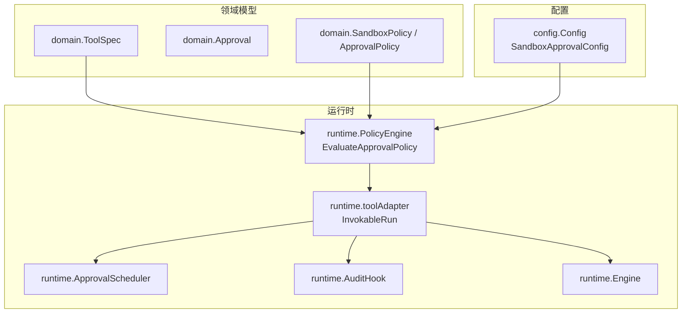
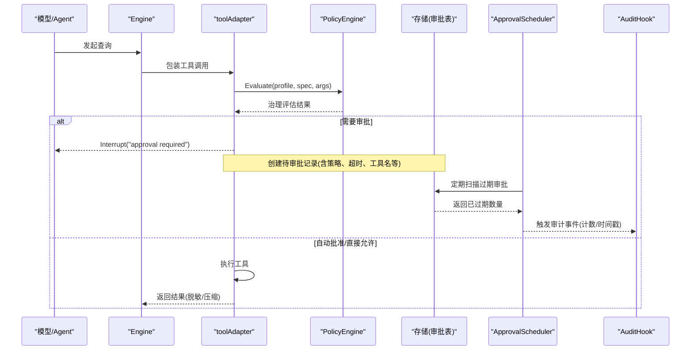
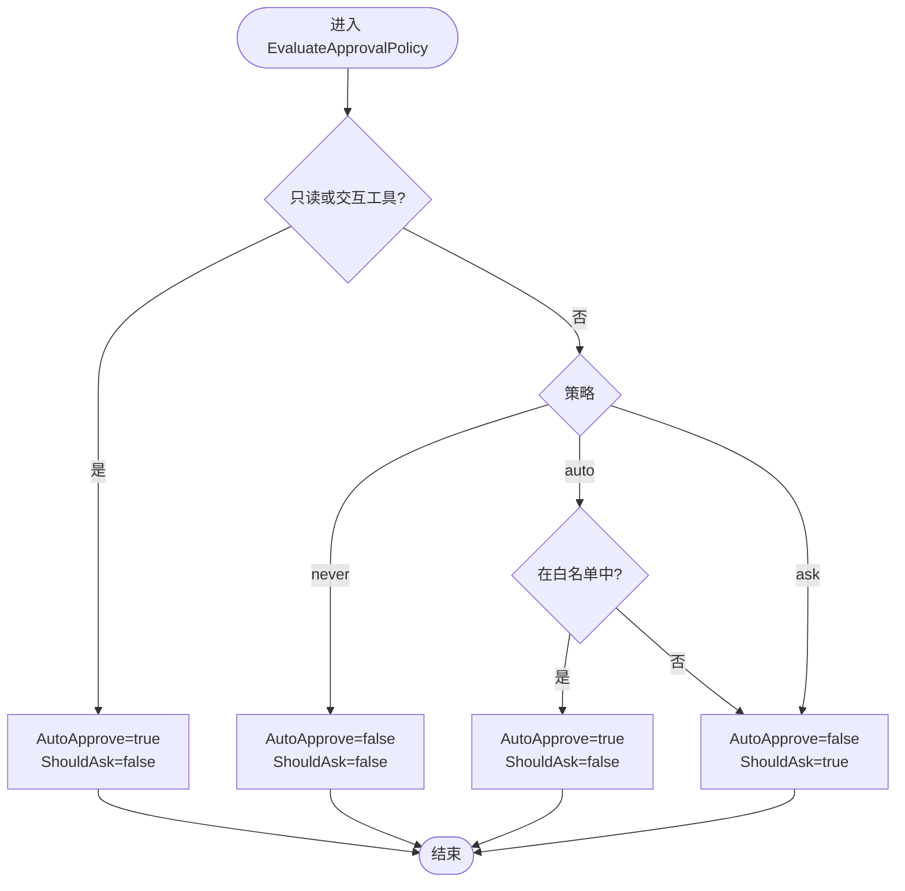
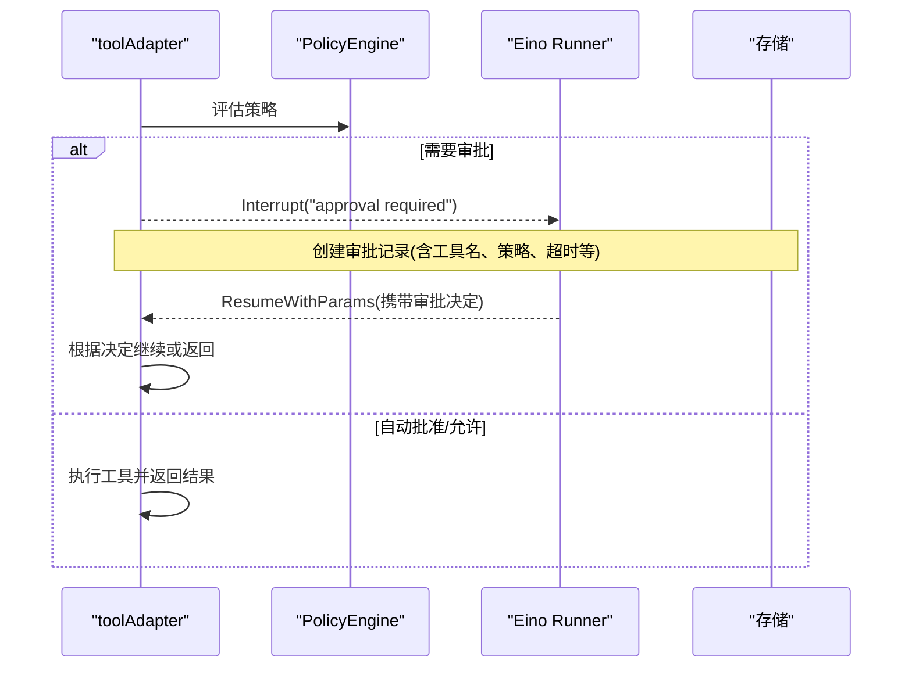
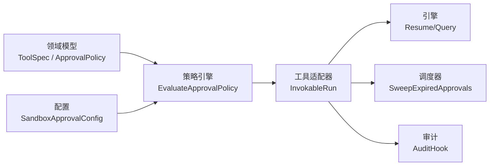

# 审批系统

<cite>
**本文引用的文件**
- [internal/runtime/policy.go](file://internal/runtime/policy.go)
- [internal/domain/tool.go](file://internal/domain/tool.go)
- [internal/domain/sandbox.go](file://internal/domain/sandbox.go)
- [internal/config/config.go](file://internal/config/config.go)
- [internal/runtime/audit.go](file://internal/runtime/audit.go)
- [internal/runtime/approval_scheduler.go](file://internal/runtime/approval_scheduler.go)
- [internal/runtime/engine.go](file://internal/runtime/engine.go)
- [internal/runtime/tooladapter.go](file://internal/runtime/tooladapter.go)
</cite>

## 目录
1. [简介](#简介)
2. [项目结构](#项目结构)
3. [核心组件](#核心组件)
4. [架构总览](#架构总览)
5. [详细组件分析](#详细组件分析)
6. [依赖关系分析](#依赖关系分析)
7. [性能考虑](#性能考虑)
8. [故障排查指南](#故障排查指南)
9. [结论](#结论)
10. [附录](#附录)

## 简介
本文件面向 Vivy 运行时中的“工具调用审批系统”，聚焦以下目标：
- 解释 ApprovalEvaluation 结构与三种审批策略 ask、never、auto 的工作机制。
- 深入说明自动审批白名单的实现原理，包括大小写不敏感的工具名匹配。
- 解释只读工具与交互工具的自动批准逻辑。
- 提供完整的审批流程示例（需要用户确认 vs 自动通过）。
- 覆盖审批策略的配置方法、动态更新机制与审计日志记录。
- 展示在不同安全级别下如何配置合适的审批策略。

## 项目结构
审批系统横跨领域模型、配置、运行时策略引擎、工具适配器、调度器与审计等模块：
- 领域层定义工具规格、审批状态、沙箱模式与审批策略类型。
- 配置层提供默认值与校验，包含默认审批策略、超时与白名单。
- 运行时策略引擎负责按策略与规则评估是否请求审批或自动批准。
- 工具适配器在工具执行前后进行策略检查、中断与恢复。
- 审批调度器定期清理过期审批。
- 审计钩子对事件元数据进行不可变记录。

图表来源
- [internal/runtime/policy.go:212-274](file://internal/runtime/policy.go#L212-L274)
- [internal/domain/tool.go:27-42](file://internal/domain/tool.go#L27-L42)
- [internal/domain/sandbox.go:40-67](file://internal/domain/sandbox.go#L40-L67)
- [internal/config/config.go:161-184](file://internal/config/config.go#L161-L184)
- [internal/runtime/tooladapter.go:78-163](file://internal/runtime/tooladapter.go#L78-L163)
- [internal/runtime/approval_scheduler.go:18-118](file://internal/runtime/approval_scheduler.go#L18-L118)
- [internal/runtime/audit.go:30-62](file://internal/runtime/audit.go#L30-L62)
- [internal/runtime/engine.go:69-117](file://internal/runtime/engine.go#L69-L117)

章节来源
- [internal/runtime/policy.go:212-274](file://internal/runtime/policy.go#L212-L274)
- [internal/domain/tool.go:27-42](file://internal/domain/tool.go#L27-L42)
- [internal/domain/sandbox.go:40-67](file://internal/domain/sandbox.go#L40-L67)
- [internal/config/config.go:161-184](file://internal/config/config.go#L161-L184)
- [internal/runtime/tooladapter.go:78-163](file://internal/runtime/tooladapter.go#L78-L163)
- [internal/runtime/approval_scheduler.go:18-118](file://internal/runtime/approval_scheduler.go#L18-L118)
- [internal/runtime/audit.go:30-62](file://internal/runtime/audit.go#L30-L62)
- [internal/runtime/engine.go:69-117](file://internal/runtime/engine.go#L69-L117)

## 核心组件
- ApprovalEvaluation：描述一次效果型工具调用是否需要用户审批、是否自动批准以及原因。
- PolicyEngine.EvaluateApprovalPolicy：根据当前会话的审批策略、工具规格与白名单计算审批结果。
- toolAdapter.InvokableRun：将策略评估与 Eino 的中断/恢复机制结合，实现“先暂停再恢复”的审批门控。
- ApprovalScheduler：后台定时扫描并标记过期的待审批项，避免陈旧审批堆积。
- AuditHook：对运行期事件进行轻量审计记录，仅记录元数据与摘要，不泄露参数与密钥。

章节来源
- [internal/runtime/policy.go:204-274](file://internal/runtime/policy.go#L204-L274)
- [internal/runtime/tooladapter.go:78-163](file://internal/runtime/tooladapter.go#L78-L163)
- [internal/runtime/approval_scheduler.go:18-118](file://internal/runtime/approval_scheduler.go#L18-L118)
- [internal/runtime/audit.go:30-62](file://internal/runtime/audit.go#L30-L62)

## 架构总览
下图展示了从工具调用到审批决策的关键路径：工具适配器在策略引擎评估后，若需审批则中断运行；服务层完成用户确认后恢复执行；调度器定期清理过期审批；审计钩子记录事件元数据。

图表来源
- [internal/runtime/engine.go:69-117](file://internal/runtime/engine.go#L69-L117)
- [internal/runtime/tooladapter.go:78-163](file://internal/runtime/tooladapter.go#L78-L163)
- [internal/runtim e/policy.go:212-274](file://internal/runtime/policy.go#L212-L274)
- [internal/runtime/approval_scheduler.go:55-118](file://internal/runtime/approval_scheduler.go#L55-L118)
- [internal/runtime/audit.go:30-62](file://internal/runtime/audit.go#L30-L62)

## 详细组件分析

### 组件一：ApprovalEvaluation 与三种审批策略
- 结构字段
  - ShouldAsk：是否需要向用户发起审批请求。
  - AutoApprove：是否可以直接自动批准。
  - Reason：本次评估的原因说明，便于审计与排障。
- 策略行为
  - ask：对所有效果型工具一律请求用户审批（默认）。
  - never：不询问，直接拒绝所有效果型工具。
  - auto：对只读工具与白名单工具自动批准，其余效果型工具请求用户审批。
- 只读与交互工具的特殊处理
  - 只读工具（spec.Readonly）与交互工具（spec.Interaction == question）一律自动批准且不请求审批。
- 白名单匹配
  - 在 auto 策略下，使用大小写不敏感比较匹配工具名，确保配置灵活且不易出错。

图表来源
- [internal/runtime/policy.go:212-274](file://internal/runtime/policy.go#L212-L274)
- [internal/domain/tool.go:27-42](file://internal/domain/tool.go#L27-L42)

章节来源
- [internal/runtime/policy.go:204-274](file://internal/runtime/policy.go#L204-L274)
- [internal/domain/tool.go:27-42](file://internal/domain/tool.go#L27-L42)

### 组件二：工具适配器的审批门控与恢复
- 入口：toolAdapter.InvokableRun
  - 校验参数与安全约束。
  - 调用策略引擎进行治理评估。
  - 若为交互工具，走中断-恢复流程收集用户答案。
  - 若治理结果为 prompt，首次执行中断以等待审批；恢复时根据审批决定继续或终止。
- 恢复语义
  - 通过 Eino 的 ResumeContext 传递审批决定，确保同一运行上下文内正确路由到被中断的工具。
- 结果处理
  - 对工具输出进行脱敏与长度压缩，防止敏感信息泄露与上下文溢出。

图表来源
- [internal/runtime/tooladapter.go:78-163](file://internal/runtime/tooladapter.go#L78-L163)
- [internal/runtime/engine.go:159-165](file://internal/runtime/engine.go#L159-L165)

章节来源
- [internal/runtime/tooladapter.go:78-163](file://internal/runtime/tooladapter.go#L78-L163)
- [internal/runtime/engine.go:159-165](file://internal/runtime/engine.go#L159-L165)

### 组件三：自动审批白名单与大小写不敏感匹配
- 白名单来源
  - 配置项 runtime.sandbox.approval.auto_approve_tools 提供工具名列表。
- 匹配算法
  - 在 auto 策略下，遍历白名单并使用大小写不敏感比较匹配工具名。
- 典型白名单工具
  - 只读类工具如读取文件、搜索文件、笔记读取、技能列表/查看、网络搜索等。

章节来源
- [internal/config/config.go:161-184](file://internal/config/config.go#L161-L184)
- [internal/config/config.go:256-314](file://internal/config/config.go#L256-L314)
- [internal/runtime/policy.go:239-255](file://internal/runtime/policy.go#L239-L255)

### 组件四：只读工具与交互工具的自动批准逻辑
- 只读工具
  - spec.Readonly 为 true 时，一律自动批准且不请求审批。
- 交互工具
  - spec.Interaction == question 时，视为控制流交互，自动批准但不执行副作用，转而中断以获取用户回答。

章节来源
- [internal/runtime/policy.go:222-229](file://internal/runtime/policy.go#L222-L229)
- [internal/domain/tool.go:27-42](file://internal/domain/tool.go#L27-L42)

### 组件五：审批调度器与过期清理
- 功能
  - 周期性扫描存储中的待审批项，将超过 TimeoutAt 的记录标记为过期。
  - 支持设置回调事件处理器，以便上层服务对过期事件采取进一步动作（如取消运行、发出事件）。
- 可观测性
  - 每次清扫会记录日志与审计事件（计数与时间戳），便于追踪清理效果。

章节来源
- [internal/runtime/approval_scheduler.go:18-118](file://internal/runtime/approval_scheduler.go#L18-L118)
- [internal/runtime/audit.go:30-62](file://internal/runtime/audit.go#L30-L62)

### 组件六：审计日志记录
- 设计原则
  - 仅记录事件的稳定元数据（运行ID、序列号、类型、创建时间、负载字节数与摘要哈希），不记录原始负载，避免泄露参数与密钥。
- 集成方式
  - 通过生命周期钩子在事件持久化后写入审计记录，保证审计不可改变且不影响主流程。

章节来源
- [internal/runtime/audit.go:12-62](file://internal/runtime/audit.go#L12-L62)

## 依赖关系分析
- 领域模型依赖
  - ToolSpec 提供工具名称、只读标志与交互类型，驱动审批策略分支。
  - ApprovalPolicy 与 SandboxMode 提供策略与沙箱边界，影响默认决策与执行范围。
- 配置依赖
  - SandboxApprovalConfig 提供默认策略、超时与白名单，作为运行时策略输入。
- 运行时依赖
  - PolicyEngine 依赖领域模型与配置，输出 ApprovalEvaluation。
  - toolAdapter 依赖 PolicyEngine 与 Eino 中断/恢复机制，串联审批门控。
  - ApprovalScheduler 依赖存储接口，定期清理过期审批。
  - AuditHook 依赖事件总线，记录审计元数据。

图表来源
- [internal/domain/tool.go:27-42](file://internal/domain/tool.go#L27-L42)
- [internal/domain/sandbox.go:40-67](file://internal/domain/sandbox.go#L40-L67)
- [internal/config/config.go:161-184](file://internal/config/config.go#L161-L184)
- [internal/runtime/policy.go:212-274](file://internal/runtime/policy.go#L212-L274)
- [internal/runtime/tooladapter.go:78-163](file://internal/runtime/tooladapter.go#L78-L163)
- [internal/runtime/approval_scheduler.go:55-118](file://internal/runtime/approval_scheduler.go#L55-L118)
- [internal/runtime/audit.go:30-62](file://internal/runtime/audit.go#L30-L62)

章节来源
- [internal/domain/tool.go:27-42](file://internal/domain/tool.go#L27-L42)
- [internal/domain/sandbox.go:40-67](file://internal/domain/sandbox.go#L40-L67)
- [internal/config/config.go:161-184](file://internal/config/config.go#L161-L184)
- [internal/runtime/policy.go:212-274](file://internal/runtime/policy.go#L212-L274)
- [internal/runtime/tooladapter.go:78-163](file://internal/runtime/tooladapter.go#L78-L163)
- [internal/runtime/approval_scheduler.go:55-118](file://internal/runtime/approval_scheduler.go#L55-L118)
- [internal/runtime/audit.go:30-62](file://internal/runtime/audit.go#L30-L62)

## 性能考虑
- 白名单匹配复杂度
  - 白名单为线性扫描，时间复杂度 O(n)，n 为白名单长度；对于常见规模（数十至数百）开销可忽略。
- 策略评估成本
  - 参数解析与字段映射为 JSON 小对象操作，成本低；仅在需要时进行。
- 中断与恢复
  - 审批门控通过 Eino 中断/恢复实现，避免阻塞线程；适合高并发场景。
- 审计记录
  - 仅记录元数据与摘要，避免大负载复制与序列化开销。

[本节为通用指导，不直接分析具体文件]

## 故障排查指南
- 现象：工具调用一直等待审批
  - 检查策略是否为 ask/auto，确认白名单是否包含该工具名（注意大小写）。
  - 检查审批是否已过期（TimeoutAt），调度器是否正常运行。
- 现象：自动批准未生效
  - 确认工具是否为只读或交互类型；否则需在 auto 策略下加入白名单。
- 现象：审批过期导致失败
  - 调整 SandboxApprovalConfig.TimeoutSeconds；关注调度器日志与审计事件。
- 现象：审计日志缺失
  - 确认 AuditHook 已接入事件链路；检查日志级别与输出目标。

章节来源
- [internal/runtime/approval_scheduler.go:55-118](file://internal/runtime/approval_scheduler.go#L55-L118)
- [internal/runtime/audit.go:30-62](file://internal/runtime/audit.go#L30-L62)
- [internal/runtime/policy.go:212-274](file://internal/runtime/policy.go#L212-L274)

## 结论
Vivy 的审批系统通过清晰的领域模型、可配置的审批策略与严格的工具适配器门控，实现了灵活而安全的工具执行控制。ask/never/auto 三种策略覆盖从严格到人机协作的不同安全需求；白名单与只读/交互工具的特殊处理提升了易用性与安全性；调度器与审计机制保障了系统的可维护性与可观测性。

[本节为总结性内容，不直接分析具体文件]

## 附录

### 审批策略配置方法
- 默认策略
  - 在 runtime.sandbox.approval.default_policy 中设置为 ask、never 或 auto。
- 超时与白名单
  - runtime.sandbox.approval.timeout_seconds 控制待审批有效期。
  - runtime.sandbox.approval.auto_approve_tools 列出自动批准的工具名。
- 验证
  - 配置加载时会进行严格校验，非法值将阻止启动。

章节来源
- [internal/config/config.go:161-184](file://internal/config/config.go#L161-L184)
- [internal/config/config.go:256-314](file://internal/config/config.go#L256-L314)
- [internal/config/config.go:499-527](file://internal/config/config.go#L499-L527)

### 动态更新机制
- 策略与白名单来源于配置与服务层注入；运行时可通过重新加载配置或更新策略对象来动态调整审批行为。
- 工具适配器在每次调用时都会重新评估策略，因此新配置立即生效。

章节来源
- [internal/runtime/policy.go:212-274](file://internal/runtime/policy.go#L212-L274)
- [internal/runtime/tooladapter.go:78-163](file://internal/runtime/tooladapter.go#L78-L163)

### 不同安全级别的策略建议
- 高安全（CI/无人值守）
  - 策略：never；白名单为空；超时较短；关闭网络访问。
- 中等安全（开发/测试）
  - 策略：ask；白名单包含只读工具；合理超时；限制网络域名。
- 低安全（受信任环境）
  - 策略：auto；白名单扩大；适当放宽网络限制；保持审计开启。

[本节为概念性建议，不直接分析具体文件]

### 完整审批流程示例
- 需要用户确认的场景
  - 策略为 ask：任何效果型工具调用都会中断并请求用户审批；用户批准后恢复执行。
  - 策略为 auto：非白名单的效果型工具同样请求用户审批。
- 自动通过的场景
  - 只读工具：无论策略为何，均自动批准。
  - 交互工具：视为控制流，自动批准并中断以获取用户答案。
  - 白名单工具（auto 策略）：自动批准。

章节来源
- [internal/runtime/policy.go:212-274](file://internal/runtime/policy.go#L212-L274)
- [internal/runtime/tooladapter.go:78-163](file://internal/runtime/tooladapter.go#L78-L163)