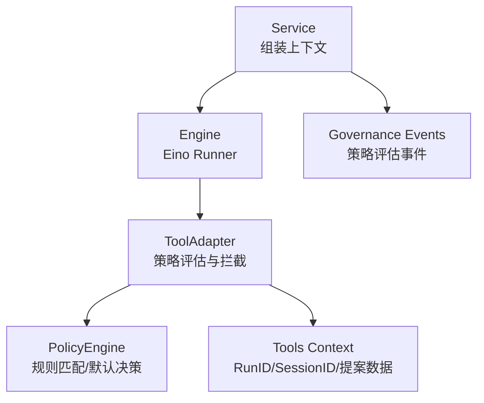
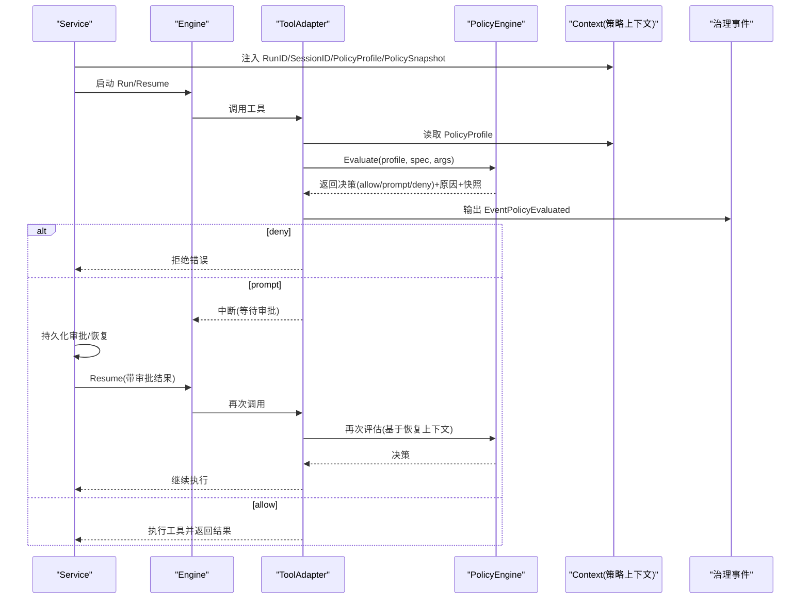
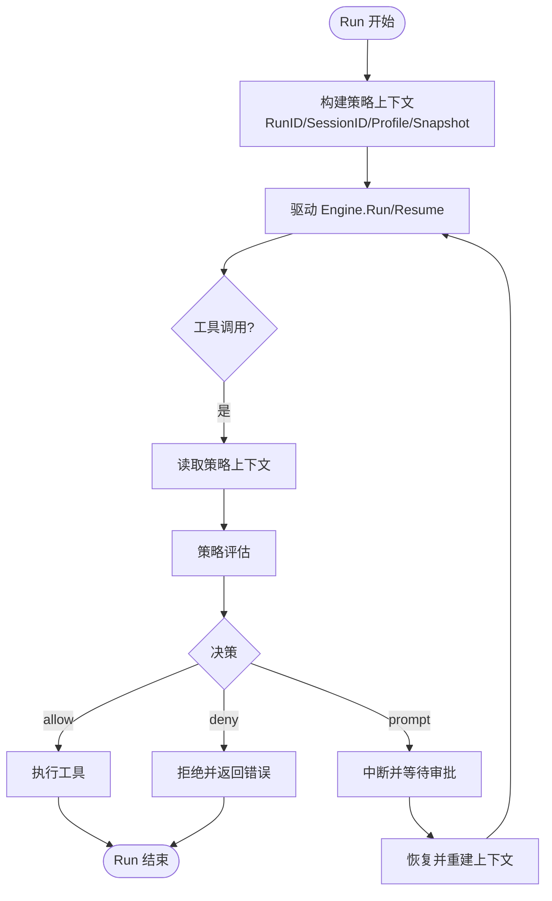
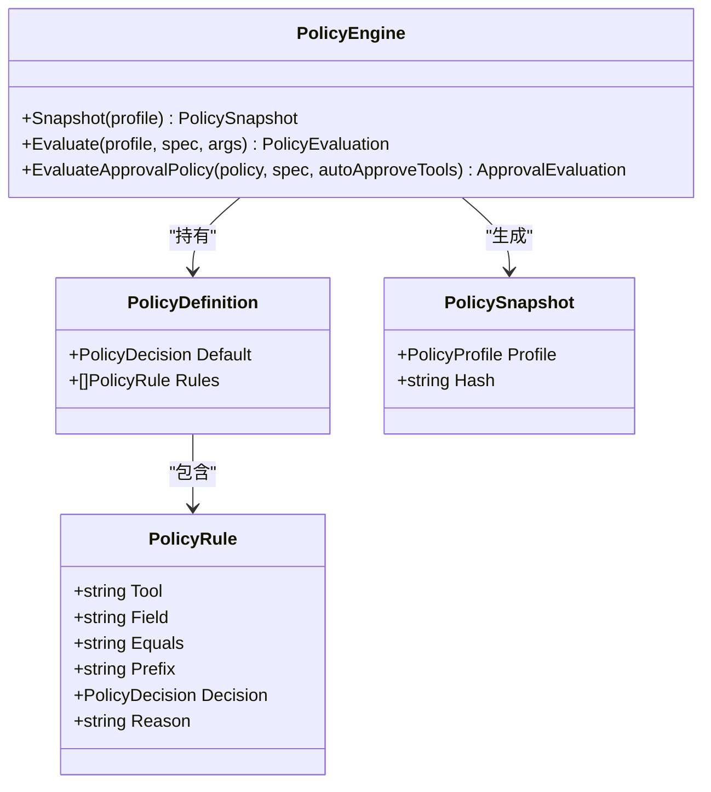
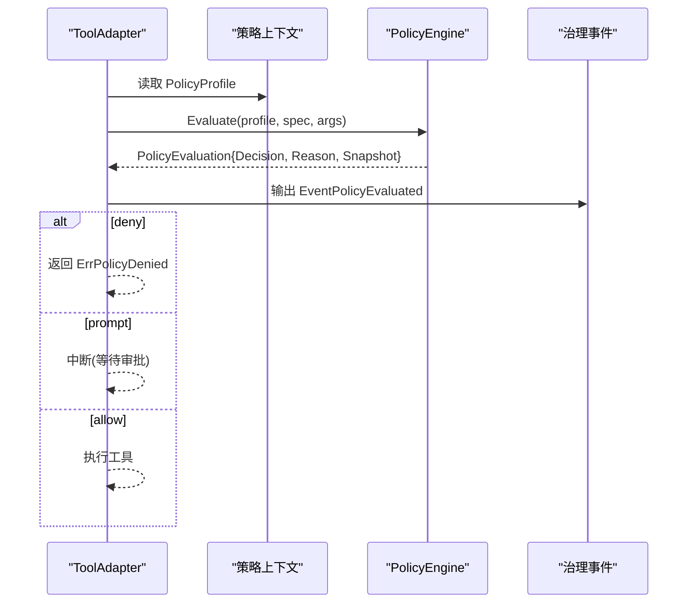
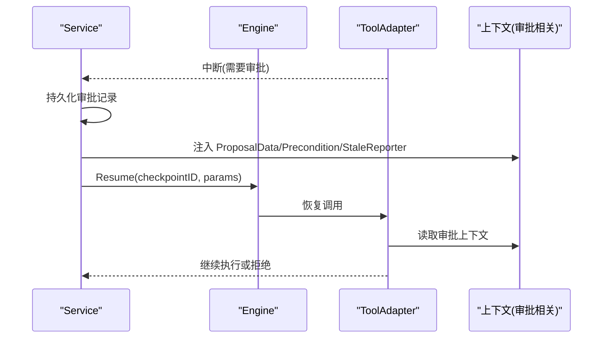
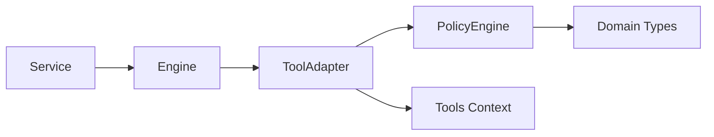

# 策略上下文

<cite>
**本文引用的文件**
- [internal/runtime/policy_context.go](file://internal/runtime/policy_context.go)
- [internal/runtime/policy.go](file://internal/runtime/policy.go)
- [internal/domain/policy.go](file://internal/domain/policy.go)
- [internal/runtime/tooladapter.go](file://internal/runtime/tooladapter.go)
- [internal/runtime/engine.go](file://internal/runtime/engine.go)
- [internal/runtime/service.go](file://internal/runtime/service.go)
- [internal/tools/context.go](file://internal/tools/context.go)
</cite>

## 目录
1. [简介](#简介)
2. [项目结构](#项目结构)
3. [核心组件](#核心组件)
4. [架构总览](#架构总览)
5. [详细组件分析](#详细组件分析)
6. [依赖关系分析](#依赖关系分析)
7. [性能考量](#性能考量)
8. [故障排查指南](#故障排查指南)
9. [结论](#结论)
10. [附录](#附录)

## 简介
本章节聚焦“策略上下文”在 Vivy 运行时中的职责与工作方式。策略上下文用于在工具调用前收集评估所需的环境信息（如运行标识、会话标识、策略配置快照等），将上下文沿执行链路传播，并在策略引擎中参与决策；同时承载结果缓存与治理事件输出。其生命周期贯穿一次 Run 的创建、传播与销毁，并与策略引擎紧密协作，使策略决策更智能、可审计、可恢复。

## 项目结构
围绕策略上下文的代码主要分布在以下模块：
- internal/runtime/policy_context.go：定义并维护策略相关的上下文键值（RunID、SessionID、PolicyProfile、PolicySnapshot）。
- internal/runtime/policy.go：实现不可变的策略引擎，负责策略快照生成、规则匹配、默认决策与审批策略评估。
- internal/domain/policy.go：定义策略配置类型、决策枚举及有效性校验。
- internal/runtime/tooladapter.go：在工具调用入口读取策略上下文，触发策略评估，处理拒绝/询问/自动通过分支，并将上下文信息传递给工具执行链。
- internal/runtime/engine.go：构建引擎时注入策略引擎，封装 Eino Runner，提供查询、历史回放与恢复能力。
- internal/runtime/service.go：在服务层组装上下文（包含策略上下文）、驱动引擎执行、处理中断与恢复，并将策略上下文写入治理事件。
- internal/tools/context.go：为工具侧暴露的上下文访问器（RunID、SessionID、提案数据、前置条件哈希、过期报告器等）。

图表来源
- [internal/runtime/service.go:920-928](file://internal/runtime/service.go#L920-L928)
- [internal/runtime/engine.go:69-116](file://internal/runtime/engine.go#L69-L116)
- [internal/runtime/tooladapter.go:80-163](file://internal/runtime/tooladapter.go#L80-L163)
- [internal/runtime/policy.go:47-135](file://internal/runtime/policy.go#L47-L135)
- [internal/tools/context.go:14-74](file://internal/tools/context.go#L14-L74)

章节来源
- [internal/runtime/policy_context.go:1-55](file://internal/runtime/policy_context.go#L1-L55)
- [internal/runtime/policy.go:1-274](file://internal/runtime/policy.go#L1-L274)
- [internal/domain/policy.go:1-46](file://internal/domain/policy.go#L1-L46)
- [internal/runtime/tooladapter.go:80-242](file://internal/runtime/tooladapter.go#L80-L242)
- [internal/runtime/engine.go:1-166](file://internal/runtime/engine.go#L1-L166)
- [internal/runtime/service.go:920-1119](file://internal/runtime/service.go#L920-L1119)
- [internal/tools/context.go:1-74](file://internal/tools/context.go#L1-L74)

## 核心组件
- 策略上下文键值与存取：
  - 运行标识（RunID）与会话标识（SessionID）：用于跨层追踪与隔离。
  - 策略配置快照（PolicyProfile、PolicySnapshot）：携带当前生效的策略配置及其哈希，便于审计与一致性校验。
- 策略引擎：
  - 不可变且线程安全，支持多策略配置（default、plan、read_only、full_auto）。
  - 提供快照生成、规则匹配、默认决策、审批策略评估。
- 工具适配器：
  - 在工具调用前读取策略上下文，进行策略评估，根据决策决定直接执行、中断请求审批或拒绝。
  - 支持钩子重写参数后重新评估，确保最终入参受策略约束。
- 服务层：
  - 组装上下文（包含策略上下文），驱动引擎执行，处理中断与恢复，输出治理事件。
- 工具侧上下文：
  - 暴露 RunID、SessionID、提案数据、前置条件哈希、过期报告器等，供工具实现使用。

章节来源
- [internal/runtime/policy_context.go:9-55](file://internal/runtime/policy_context.go#L9-L55)
- [internal/runtime/policy.go:19-135](file://internal/runtime/policy.go#L19-L135)
- [internal/runtime/tooladapter.go:80-163](file://internal/runtime/tooladapter.go#L80-L163)
- [internal/runtime/service.go:920-928](file://internal/runtime/service.go#L920-L928)
- [internal/tools/context.go:14-74](file://internal/tools/context.go#L14-L74)

## 架构总览
下图展示了一次工具调用的完整流程，包括策略上下文的创建、传播、评估与结果处理。

图表来源
- [internal/runtime/service.go:920-928](file://internal/runtime/service.go#L920-L928)
- [internal/runtime/tooladapter.go:80-163](file://internal/runtime/tooladapter.go#L80-L163)
- [internal/runtime/policy.go:96-135](file://internal/runtime/policy.go#L96-L135)
- [internal/runtime/engine.go:144-166](file://internal/runtime/engine.go#L144-L166)

## 详细组件分析

### 策略上下文的生命周期管理
- 创建：
  - Service 在启动 Run 或 Resume 前，构造包含 RunID、SessionID、PolicyProfile、PolicySnapshot 的上下文，并通过 with* 函数注入。
- 传播：
  - Engine 将上下文传递给 Eino Runner；ToolAdapter 在工具调用入口读取策略上下文，必要时将 RunID/SessionID 下推到工具侧上下文。
- 销毁：
  - 随单次 Run 的结束而释放；若发生中断与恢复，上下文会重建并携带新的审批相关数据（提案数据、前置条件哈希、过期报告器）。

图表来源
- [internal/runtime/service.go:920-928](file://internal/runtime/service.go#L920-L928)
- [internal/runtime/tooladapter.go:80-163](file://internal/runtime/tooladapter.go#L80-L163)
- [internal/runtime/engine.go:144-166](file://internal/runtime/engine.go#L144-L166)

章节来源
- [internal/runtime/service.go:920-928](file://internal/runtime/service.go#L920-L928)
- [internal/runtime/tooladapter.go:165-184](file://internal/runtime/tooladapter.go#L165-L184)
- [internal/runtime/engine.go:144-166](file://internal/runtime/engine.go#L144-L166)

### 策略评估时的环境信息收集、状态传递与结果缓存
- 环境信息收集：
  - 从策略上下文读取 PolicyProfile；工具调用参数作为字段映射参与规则匹配。
- 状态传递：
  - 策略评估结果包含 Snapshot（含 Profile 与 Hash），用于后续审计与一致性校验。
  - 审批流程中，上下文携带 ProposalData、PreconditionHash、StaleReporter，确保恢复后的工具调用具备完整的审批上下文。
- 结果缓存：
  - 策略引擎内部对每个 Profile 计算并缓存配置哈希，Snapshot 复用该哈希，避免重复计算。

图表来源
- [internal/runtime/policy.go:19-135](file://internal/runtime/policy.go#L19-L135)
- [internal/domain/policy.go:1-46](file://internal/domain/policy.go#L1-L46)

章节来源
- [internal/runtime/policy.go:47-135](file://internal/runtime/policy.go#L47-L135)
- [internal/runtime/tooladapter.go:91-137](file://internal/runtime/tooladapter.go#L91-L137)
- [internal/tools/context.go:27-64](file://internal/tools/context.go#L27-L64)

### 上下文与策略引擎的交互方式
- 工具适配器在调用工具前读取策略上下文中的 PolicyProfile，并调用策略引擎 Evaluate。
- 若决策为 deny，则直接返回错误；若为 prompt，则中断等待审批；若为 allow，则继续执行。
- 钩子重写参数后会重新评估，确保最终入参受策略约束。
- 策略评估结果以治理事件形式输出，包含决策、原因、Profile 与 PolicyHash。

图表来源
- [internal/runtime/tooladapter.go:91-137](file://internal/runtime/tooladapter.go#L91-L137)
- [internal/runtime/policy.go:96-135](file://internal/runtime/policy.go#L96-L135)

章节来源
- [internal/runtime/tooladapter.go:91-163](file://internal/runtime/tooladapter.go#L91-L163)
- [internal/runtime/policy.go:96-135](file://internal/runtime/policy.go#L96-L135)

### 上下文扩展点：添加自定义上下文信息与处理器
- 在 runtime 层新增上下文键值与存取函数（参考 policy_context.go 的模式），用于绑定额外信息（如租户、环境标签等）。
- 在 service 层组装上下文时注入新字段，并在工具适配器或工具侧消费。
- 如需在工具侧访问，可在 tools/context.go 中增加 WithXxx/FromXxx 方法，保持工具与运行时解耦。
- 对于审批流程，可参照 ProposalData/Precondition/StaleReporter 模式，在恢复时注入必要信息。

章节来源
- [internal/runtime/policy_context.go:9-55](file://internal/runtime/policy_context.go#L9-L55)
- [internal/tools/context.go:14-74](file://internal/tools/context.go#L14-L74)
- [internal/runtime/service.go:1615-1649](file://internal/runtime/service.go#L1615-L1649)

### 上下文序列化、持久化与恢复机制
- 策略上下文本身不直接持久化，但其关键元数据（PolicyProfile、PolicyHash）会写入治理事件，用于审计与一致性校验。
- 审批流程中，ProposalData、PreconditionHash、StaleReporter 通过上下文在恢复时传递，确保工具调用具备完整的审批上下文。
- 恢复路径由 Engine.ResumeWithParams 驱动，Service 在 handleInterrupt 中完成中断、持久化与恢复。

图表来源
- [internal/runtime/service.go:1063-1119](file://internal/runtime/service.go#L1063-L1119)
- [internal/runtime/service.go:1615-1649](file://internal/runtime/service.go#L1615-L1649)
- [internal/runtime/engine.go:159-166](file://internal/runtime/engine.go#L159-L166)

章节来源
- [internal/runtime/service.go:1063-1119](file://internal/runtime/service.go#L1063-L1119)
- [internal/runtime/service.go:1615-1649](file://internal/runtime/service.go#L1615-L1649)
- [internal/runtime/engine.go:159-166](file://internal/runtime/engine.go#L159-L166)

### 复杂场景下的正确使用示例
- 计划模式（Plan）：当策略上下文处于 Plan 模式且工具非只读时，拒绝执行，避免副作用。
- 审批白名单：结合审批策略评估，只读工具或问题交互无需审批；其他工具按策略决定是否询问用户。
- 参数重写：钩子重写参数后需重新评估策略，确保最终入参符合策略要求。

章节来源
- [internal/runtime/tooladapter.go:100-163](file://internal/runtime/tooladapter.go#L100-L163)
- [internal/runtime/policy.go:137-202](file://internal/runtime/policy.go#L137-L202)
- [internal/runtime/policy.go:217-274](file://internal/runtime/policy.go#L217-L274)

## 依赖关系分析
- Service 依赖 Engine 与 PolicyEngine，负责上下文组装与事件流控制。
- Engine 依赖 Eino Runner 与工具集，注入 PolicyEngine 作为工具调用的治理层。
- ToolAdapter 依赖 PolicyEngine 与 Tools Context，负责策略评估与上下文传播。
- PolicyEngine 依赖 Domain 类型，提供不可变策略配置与评估逻辑。

图表来源
- [internal/runtime/engine.go:69-116](file://internal/runtime/engine.go#L69-L116)
- [internal/runtime/tooladapter.go:80-163](file://internal/runtime/tooladapter.go#L80-L163)
- [internal/runtime/policy.go:47-135](file://internal/runtime/policy.go#L47-L135)
- [internal/tools/context.go:14-74](file://internal/tools/context.go#L14-L74)

章节来源
- [internal/runtime/engine.go:69-116](file://internal/runtime/engine.go#L69-L116)
- [internal/runtime/tooladapter.go:80-163](file://internal/runtime/tooladapter.go#L80-L163)
- [internal/runtime/policy.go:47-135](file://internal/runtime/policy.go#L47-L135)
- [internal/tools/context.go:14-74](file://internal/tools/context.go#L14-L74)

## 性能考量
- 策略引擎不可变且线程安全，适合跨 Run 共享；配置哈希缓存减少重复计算。
- 工具结果压缩限制模型上下文占用，避免过大结果影响下一轮生成。
- 审批流程中断与恢复利用 Eino Checkpoint，保证可恢复性与最小开销。

[本节为通用指导，不直接分析具体文件]

## 故障排查指南
- 策略拒绝：检查策略配置与规则匹配，确认 Profile 与参数字段是否正确；关注治理事件中的 Reason。
- 审批未触发：确认策略决策是否为 prompt，以及是否已正确中断与恢复；检查 ProposalData 与 PreconditionHash 是否注入。
- 参数重写导致策略失效：钩子重写参数后必须重新评估策略，否则可能绕过策略约束。
- 上下文缺失：确认 Service 是否在 Run/Resume 前注入了必要的上下文键值（RunID、SessionID、PolicyProfile、PolicySnapshot）。

章节来源
- [internal/runtime/tooladapter.go:91-163](file://internal/runtime/tooladapter.go#L91-L163)
- [internal/runtime/service.go:1063-1119](file://internal/runtime/service.go#L1063-L1119)
- [internal/runtime/service.go:1615-1649](file://internal/runtime/service.go#L1615-L1649)

## 结论
策略上下文在 Vivy 运行时中扮演关键角色：它收集并传递策略评估所需的环境信息，支撑策略引擎做出智能决策，并通过治理事件实现可审计性。其生命周期与服务层紧密耦合，支持中断与恢复，确保复杂场景下的状态一致性与安全性。通过扩展点，可灵活添加自定义上下文信息与处理器，满足多样化业务需求。

[本节为总结性内容，不直接分析具体文件]

## 附录
- 策略配置类型与决策枚举见 domain/policy.go。
- 策略引擎 API 与规则匹配逻辑见 runtime/policy.go。
- 工具适配器的策略评估与拦截逻辑见 runtime/tooladapter.go。
- 服务层的上下文组装与事件输出见 runtime/service.go。
- 工具侧上下文访问器见 tools/context.go。

[本节为索引性内容，不直接分析具体文件]