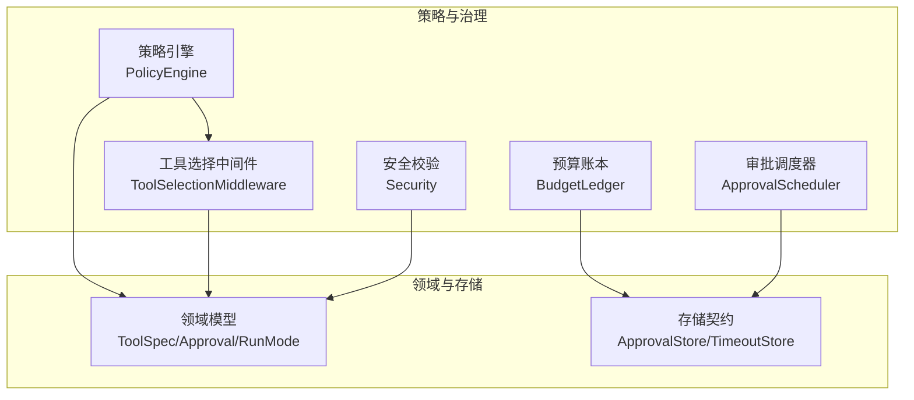
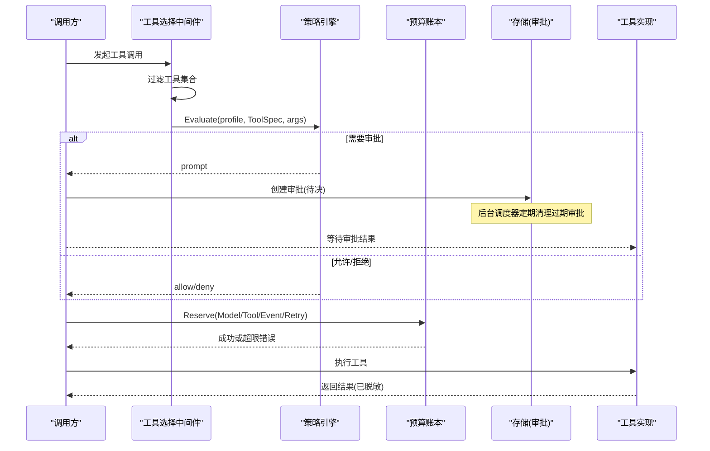
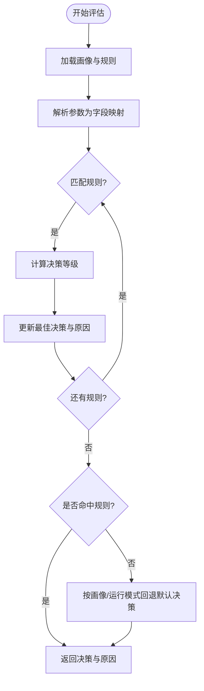
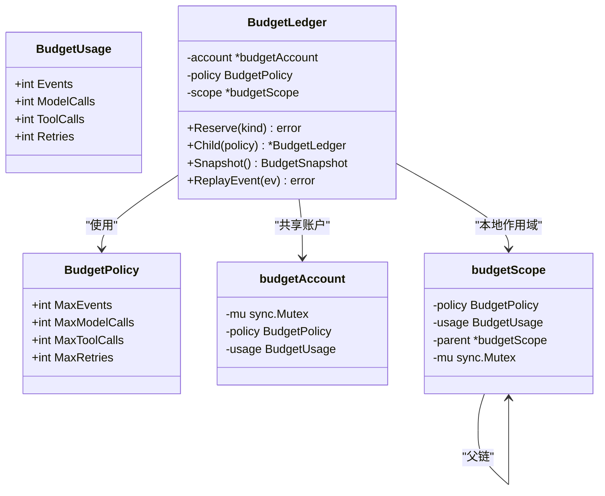
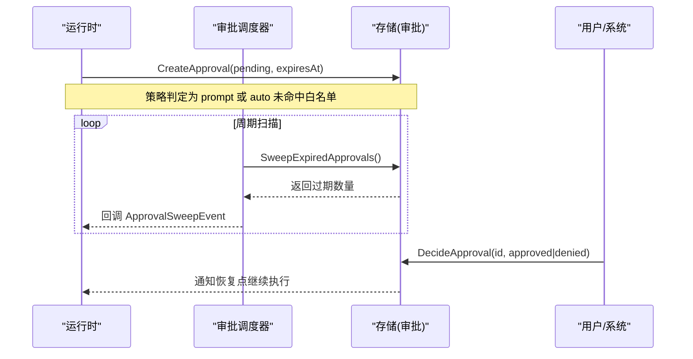
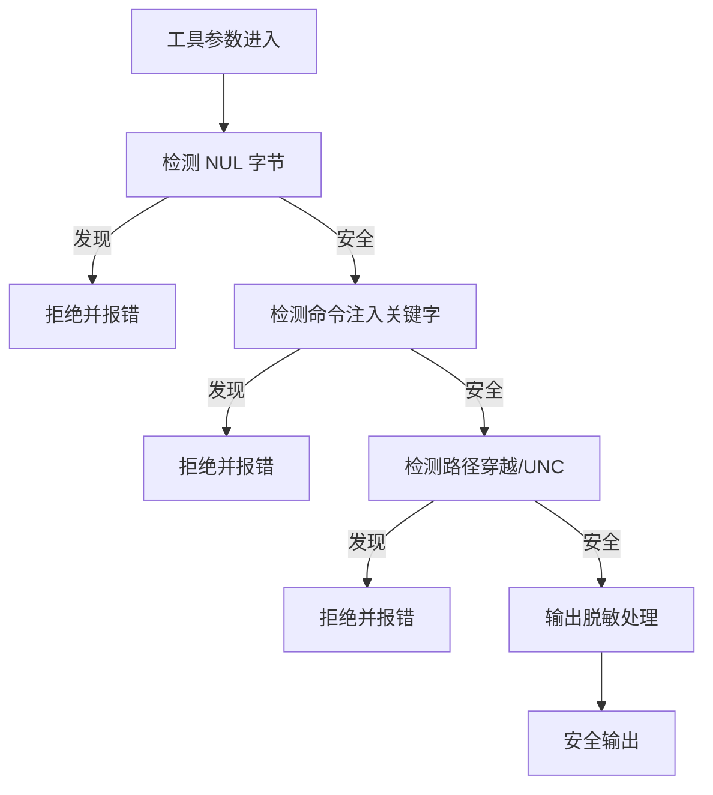
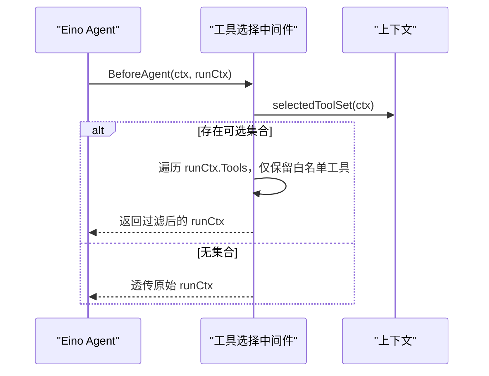
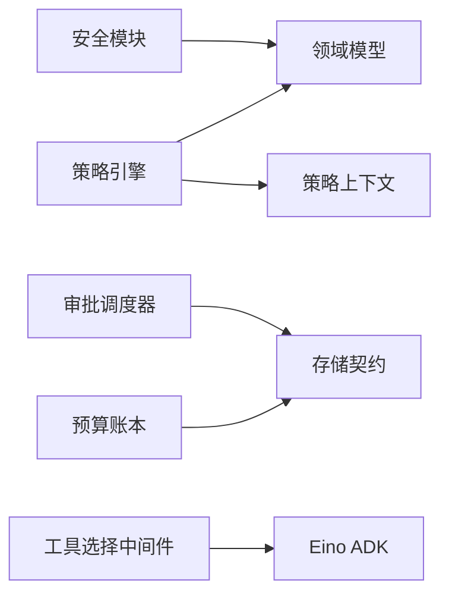

# 策略与治理

<cite>
**本文引用的文件**
- [policy.go](file://internal/runtime/policy.go)
- [budget.go](file://internal/runtime/budget.go)
- [policy_context.go](file://internal/runtime/policy_context.go)
- [approval_scheduler.go](file://internal/runtime/approval_scheduler.go)
- [toolselection_middleware.go](file://internal/runtime/toolselection_middleware.go)
- [toolselection.go](file://internal/runtime/toolselection.go)
- [security.go](file://internal/tools/security.go)
- [tool.go](file://internal/domain/tool.go)
- [policy.go](file://internal/domain/policy.go)
- [runmode.go](file://internal/domain/runmode.go)
- [contracts.go](file://internal/storage/contracts.go)
</cite>

## 目录
1. [简介](#简介)
2. [项目结构](#项目结构)
3. [核心组件](#核心组件)
4. [架构总览](#架构总览)
5. [详细组件分析](#详细组件分析)
6. [依赖关系分析](#依赖关系分析)
7. [性能考虑](#性能考虑)
8. [故障排查指南](#故障排查指南)
9. [结论](#结论)
10. [附录：配置与使用指南](#附录：配置与使用指南)

## 简介
本文件面向“策略与治理”子系统，系统性阐述策略引擎、预算控制、审批流程、权限与安全策略的执行机制，并提供策略配置、测试调试与监控的实践指南。该子系统贯穿 Agent 运行时（Eino 装配）的边界，确保在计划模式、只读模式与全自动模式下对工具调用进行可控执行，并通过预算与审批实现资源限制与成本治理。

## 项目结构
策略与治理相关代码主要分布在以下位置：
- 策略定义与评估：internal/runtime/policy.go、internal/domain/policy.go、internal/runtime/policy_context.go
- 预算控制：internal/runtime/budget.go
- 审批调度与存储契约：internal/runtime/approval_scheduler.go、internal/storage/contracts.go
- 工具选择与中间件：internal/runtime/toolselection_middleware.go、internal/runtime/toolselection.go
- 安全校验与脱敏：internal/tools/security.go
- 领域模型（工具、审批等）：internal/domain/tool.go、internal/domain/runmode.go

图表来源
- [policy.go:35-134](file://internal/runtime/policy.go#L35-L134)
- [budget.go:103-196](file://internal/runtime/budget.go#L103-L196)
- [approval_scheduler.go:21-118](file://internal/runtime/approval_scheduler.go#L21-L118)
- [toolselection_middleware.go:11-41](file://internal/runtime/toolselection_middleware.go#L11-L41)
- [security.go:25-79](file://internal/tools/security.go#L25-L79)
- [tool.go:27-112](file://internal/domain/tool.go#L27-L112)
- [contracts.go:163-189](file://internal/storage/contracts.go#L163-L189)

章节来源
- [policy.go:35-134](file://internal/runtime/policy.go#L35-L134)
- [budget.go:103-196](file://internal/runtime/budget.go#L103-L196)
- [approval_scheduler.go:21-118](file://internal/runtime/approval_scheduler.go#L21-L118)
- [toolselection_middleware.go:11-41](file://internal/runtime/toolselection_middleware.go#L11-L41)
- [security.go:25-79](file://internal/tools/security.go#L25-L79)
- [tool.go:27-112](file://internal/domain/tool.go#L27-L112)
- [contracts.go:163-189](file://internal/storage/contracts.go#L163-L189)

## 核心组件
- 策略引擎：基于策略画像（profile）与规则列表，对工具调用进行 allow/prompt/deny 决策；支持默认策略与按字段匹配（等于/前缀）。
- 预算控制：以共享账户+作用域的方式对事件、模型调用、工具调用、重试次数进行限额与扣减，支持子作用域收紧上限。
- 审批调度：周期性扫描过期审批并清理，支持超时与事件回调。
- 工具选择中间件：在 Eino Agent 边界过滤可调用工具集合，缩小模型可见面。
- 安全校验：参数注入防护、命令注入防护、路径穿越防护、敏感信息脱敏。
- 领域模型：工具规格、交互类型、审批状态、运行模式等。

章节来源
- [policy.go:19-134](file://internal/runtime/policy.go#L19-L134)
- [budget.go:11-196](file://internal/runtime/budget.go#L11-L196)
- [approval_scheduler.go:18-118](file://internal/runtime/approval_scheduler.go#L18-L118)
- [toolselection_middleware.go:11-41](file://internal/runtime/toolselection_middleware.go#L11-L41)
- [security.go:25-79](file://internal/tools/security.go#L25-L79)
- [tool.go:27-112](file://internal/domain/tool.go#L27-L112)
- [policy.go:3-46](file://internal/domain/policy.go#L3-L46)
- [runmode.go:3-16](file://internal/domain/runmode.go#L3-L16)

## 架构总览
策略与治理在运行时中的关键交互如下：
- 请求进入时，通过上下文注入运行模式与策略画像，策略引擎依据工具规格与参数进行决策。
- 若需人工审批，则创建审批记录并等待；后台调度器定期清理过期审批。
- 所有副作用操作受预算账本保护，超出限额即熔断。
- 工具选择中间件在 Eino 层裁剪可用工具集，降低误用风险。
- 安全校验在参数进入工具实现前拦截危险输入，并对输出进行敏感信息脱敏。

图表来源
- [toolselection_middleware.go:23-41](file://internal/runtime/toolselection_middleware.go#L23-L41)
- [policy.go:96-134](file://internal/runtime/policy.go#L96-L134)
- [budget.go:142-186](file://internal/runtime/budget.go#L142-L186)
- [approval_scheduler.go:55-118](file://internal/runtime/approval_scheduler.go#L55-L118)
- [security.go:38-79](file://internal/tools/security.go#L38-L79)

## 详细组件分析

### 策略引擎与规则语法
- 策略画像：内置 default、plan、read_only、full_auto 四种，分别对应不同默认行为。
- 规则匹配：支持 tool 名称匹配（* 通配）、field 字段名匹配、equals 精确匹配、prefix 前缀匹配；优先级由决策等级决定（deny > prompt > allow）。
- 默认决策：只读或交互型工具默认允许；未命中规则时根据画像与运行模式回退到 allow/prompt/deny。
- 快照与哈希：每次评估生成策略快照，包含画像与配置哈希，便于审计与一致性校验。

图表来源
- [policy.go:96-169](file://internal/runtime/policy.go#L96-L169)
- [policy.go:171-202](file://internal/runtime/policy.go#L171-L202)
- [policy.go:137-169](file://internal/runtime/policy.go#L137-L169)

章节来源
- [policy.go:19-169](file://internal/runtime/policy.go#L19-L169)
- [policy.go:171-202](file://internal/runtime/policy.go#L171-L202)
- [policy.go:137-169](file://internal/runtime/policy.go#L137-L169)
- [policy.go:3-46](file://internal/domain/policy.go#L3-L46)
- [runmode.go:3-16](file://internal/domain/runmode.go#L3-L16)

### 预算控制系统（资源限制、成本监控、配额管理）
- 资源维度：事件数、模型调用数、工具调用数、重试次数。
- 作用域与共享账户：每个 BudgetLedger 拥有本地作用域与共享根账户；子作用域只能收紧不能放宽父级限制。
- 原子预留：Reserve 在多作用域上顺序加锁，先检查后累加，避免并发超发。
- 恢复与重放：ReplayEvent 从持久化事件重建用量，保证重启后一致。
- 观测：Snapshot 提供当前有效策略与共享用量快照。

图表来源
- [budget.go:11-196](file://internal/runtime/budget.go#L11-L196)
- [budget.go:222-294](file://internal/runtime/budget.go#L222-L294)

章节来源
- [budget.go:11-196](file://internal/runtime/budget.go#L11-L196)
- [budget.go:222-294](file://internal/runtime/budget.go#L222-L294)

### 审批流程与权限控制
- 审批策略：ask（总是询问）、never（从不询问，直接拒绝副作用）、auto（白名单自动批准，其余询问）。
- 生命周期：创建审批（pending）→ 用户/系统决策（approved/denied）→ 恢复执行或终止；支持超时与过期清理。
- 存储契约：ApprovalStore 负责持久化，ApprovalTimeoutStore 支持过期查询与批量清理。
- 调度器：后台定时扫描过期审批，触发回调以便上层取消运行或发出事件。

图表来源
- [approval_scheduler.go:18-118](file://internal/runtime/approval_scheduler.go#L18-L118)
- [contracts.go:163-189](file://internal/storage/contracts.go#L163-L189)
- [tool.go:63-112](file://internal/domain/tool.go#L63-L112)

章节来源
- [approval_scheduler.go:18-118](file://internal/runtime/approval_scheduler.go#L18-L118)
- [contracts.go:163-189](file://internal/storage/contracts.go#L163-L189)
- [tool.go:63-112](file://internal/domain/tool.go#L63-L112)

### 安全策略执行
- 参数安全：检测 NUL 字节、命令注入关键字、路径穿越与 UNC 路径。
- 提示词注入信号：识别指令覆盖语言，提示外部内容应视为数据。
- 敏感信息脱敏：对密钥、令牌、邮箱等常见形式进行替换，防止泄露至模型上下文或持久负载。

图表来源
- [security.go:38-79](file://internal/tools/security.go#L38-L79)
- [security.go:25-36](file://internal/tools/security.go#L25-L36)

章节来源
- [security.go:25-79](file://internal/tools/security.go#L25-L79)

### 工具选择与最小暴露面
- 中间件在 Eino Agent 边界根据上下文中的“可选工具集合”过滤模型可见的工具，避免无关工具被模型调用。
- 空集合表示禁止任何工具执行；缺失上下文值保持向后兼容。

图表来源
- [toolselection_middleware.go:23-41](file://internal/runtime/toolselection_middleware.go#L23-L41)
- [toolselection.go:5-22](file://internal/runtime/toolselection.go#L5-L22)

章节来源
- [toolselection_middleware.go:23-41](file://internal/runtime/toolselection_middleware.go#L23-L41)
- [toolselection.go:5-22](file://internal/runtime/toolselection.go#L5-L22)

## 依赖关系分析
- 策略引擎依赖领域模型（ToolSpec、PolicyProfile、PolicyDecision），并通过上下文注入运行模式与策略画像。
- 预算账本依赖存储契约用于恢复（ReplayEvent），但不直接读写持久化；其错误类型稳定，便于上层分类处理。
- 审批调度器依赖存储契约的超时扩展接口，实现过期清理与事件回调。
- 工具选择中间件依赖 Eino ADK 中间件机制，结合上下文中的工具白名单进行裁剪。
- 安全模块独立于策略与预算，作为前置校验与后置脱敏的横切能力。

图表来源
- [policy.go:96-134](file://internal/runtime/policy.go#L96-L134)
- [budget.go:198-220](file://internal/runtime/budget.go#L198-L220)
- [approval_scheduler.go:55-118](file://internal/runtime/approval_scheduler.go#L55-L118)
- [toolselection_middleware.go:23-41](file://internal/runtime/toolselection_middleware.go#L23-L41)
- [security.go:38-79](file://internal/tools/security.go#L38-L79)

章节来源
- [policy.go:96-134](file://internal/runtime/policy.go#L96-L134)
- [budget.go:198-220](file://internal/runtime/budget.go#L198-L220)
- [approval_scheduler.go:55-118](file://internal/runtime/approval_scheduler.go#L55-L118)
- [toolselection_middleware.go:23-41](file://internal/runtime/toolselection_middleware.go#L23-L41)
- [security.go:38-79](file://internal/tools/security.go#L38-L79)

## 性能考虑
- 策略评估为 O(R) 规则扫描，建议将高频匹配的规则置于前列，并使用更具体的 field/prefix 条件减少误匹配。
- 预算预留采用多作用域顺序加锁，避免并发竞争；在高并发场景下尽量合并调用以减少锁持有时间。
- 审批调度器的扫描间隔应根据业务量调优，避免频繁 I/O；可使用单次扫描接口进行测试与手动触发。
- 工具选择中间件在 Agent 边界裁剪工具集合，可降低模型幻觉与无效调用带来的开销。
- 安全校验使用正则与字符串操作，建议在热路径中复用预编译表达式（已在实现中完成）。

[本节为通用指导，不直接分析具体文件]

## 故障排查指南
- 策略相关问题
  - 画像无效或规则非法：构造策略引擎时会返回错误，检查画像枚举与规则字段合法性。
  - 未命中规则导致意外默认决策：确认运行模式与画像组合下的默认行为是否符合预期。
- 预算相关问题
  - 预算超限：捕获预算超限错误类型，定位具体资源维度（事件/模型/工具/重试）并调整策略或配额。
  - 恢复不一致：检查 ReplayEvent 是否正确重放事件，确保非终态事件计入事件配额。
- 审批相关问题
  - 审批堆积：检查调度器是否启动且间隔合理；必要时调用单次扫描接口验证后端实现。
  - 审批过期：确认超时设置与后端实现是否支持超时清理。
- 安全问题
  - 参数被拒：查看安全校验返回的原因（NUL、命令注入、路径穿越等），修正输入。
  - 敏感信息泄露：确认输出经过脱敏处理，避免将密钥、邮箱等写入日志或模型上下文。

章节来源
- [policy.go:47-84](file://internal/runtime/policy.go#L47-L84)
- [budget.go:57-74](file://internal/runtime/budget.go#L57-L74)
- [budget.go:198-220](file://internal/runtime/budget.go#L198-L220)
- [approval_scheduler.go:55-118](file://internal/runtime/approval_scheduler.go#L55-L118)
- [security.go:38-79](file://internal/tools/security.go#L38-L79)

## 结论
策略与治理子系统通过“策略画像+规则匹配”、“预算配额+作用域”、“审批流+超时清理”、“工具裁剪+安全校验”的组合，实现了在复杂业务场景下的可控执行与成本治理。其设计强调不可变性、可观测性与可恢复性，适合在生产环境中对 Agent 的行为进行强约束与细粒度控制。

[本节为总结，不直接分析具体文件]

## 附录：配置与使用指南

### 策略配置与规则编写
- 画像选择
  - plan：默认 deny，适用于计划模式，物理限制副作用。
  - read_only：默认 deny，但只读工具允许。
  - full_auto：默认 allow，适用于可信环境。
  - default：根据运行模式与工具属性回退。
- 规则语法
  - tool：工具名称或 * 通配。
  - field：参数字段名（小写匹配）。
  - equals：精确匹配字段值。
  - prefix：字段值前缀匹配。
  - decision：allow/prompt/deny。
  - reason：人类可读原因。
- 默认决策与原因
  - 只读或交互型工具默认允许。
  - 未命中规则时按画像与运行模式回退。

章节来源
- [policy.go:47-84](file://internal/runtime/policy.go#L47-L84)
- [policy.go:96-169](file://internal/runtime/policy.go#L96-L169)
- [policy.go:171-202](file://internal/runtime/policy.go#L171-L202)
- [policy.go:3-46](file://internal/domain/policy.go#L3-L46)
- [runmode.go:3-16](file://internal/domain/runmode.go#L3-L16)

### 预算配额与成本监控
- 配置项
  - MaxEvents：事件上限。
  - MaxModelCalls：模型调用上限。
  - MaxToolCalls：工具调用上限。
  - MaxRetries：重试上限。
- 使用方式
  - 创建根账本：NewBudgetLedger(policy)。
  - 子作用域：Child(tighterPolicy) 收紧限制。
  - 预留：Reserve 对应资源维度。
  - 快照：Snapshot 获取用量与策略。
  - 恢复：ReplayEvent 从事件重建用量。
- 监控指标
  - 使用量与剩余配额。
  - 超限错误类型与维度。

章节来源
- [budget.go:11-196](file://internal/runtime/budget.go#L11-L196)
- [budget.go:222-294](file://internal/runtime/budget.go#L222-L294)

### 审批流程与权限控制
- 审批策略
  - ask：始终询问。
  - never：从不询问，拒绝副作用。
  - auto：白名单自动批准，其余询问。
- 生命周期
  - 创建审批（pending，带超时）。
  - 决策（approved/denied）。
  - 过期清理（调度器）。
- 存储契约
  - ApprovalStore：增删查改审批。
  - ApprovalTimeoutStore：过期查询与批量清理。

章节来源
- [tool.go:63-112](file://internal/domain/tool.go#L63-L112)
- [contracts.go:163-189](file://internal/storage/contracts.go#L163-L189)
- [approval_scheduler.go:18-118](file://internal/runtime/approval_scheduler.go#L18-L118)

### 安全策略执行
- 参数校验
  - 禁止 NUL 字节。
  - 禁止命令注入关键字（&&、||、;、|、`、$(、powershell、cmd.exe）。
  - 禁止路径穿越与 UNC 路径。
- 提示词注入信号
  - 识别指令覆盖语言，提示外部内容视为数据。
- 敏感信息脱敏
  - 对密钥、令牌、邮箱等进行替换。

章节来源
- [security.go:25-79](file://internal/tools/security.go#L25-L79)

### 策略测试、调试与监控
- 单元测试
  - 策略评估：覆盖规则匹配、默认决策、画像回退。
  - 预算控制：并发预留、子作用域收紧、恢复重放。
  - 审批调度：过期清理、回调触发。
- 调试技巧
  - 打印策略快照与原因。
  - 打印预算快照与超限错误。
  - 启用审批调度器日志与回调。
- 监控建议
  - 统计策略评估结果分布。
  - 监控预算使用率与超限频率。
  - 跟踪审批过期与清理效率。

章节来源
- [policy.go:96-169](file://internal/runtime/policy.go#L96-L169)
- [budget.go:142-196](file://internal/runtime/budget.go#L142-L196)
- [approval_scheduler.go:55-118](file://internal/runtime/approval_scheduler.go#L55-L118)

### 实际使用场景示例
- 场景一：计划模式下的只读查询
  - 画像：plan/read_only。
  - 规则：对只读工具 allow，其他 deny。
  - 预算：限制事件与模型调用。
  - 审批：无需审批（只读）。
- 场景二：生产环境的全自动执行
  - 画像：full_auto。
  - 规则：白名单工具 allow，其余 prompt。
  - 预算：严格限制工具调用与重试。
  - 审批：auto 策略，白名单内自动批准。
- 场景三：高风险操作的安全加固
  - 参数安全：禁止命令注入与路径穿越。
  - 策略：prompt 强制人工审批。
  - 预算：极低的重试与工具调用上限。
  - 脱敏：输出敏感信息替换。

[本节为概念性示例，不直接分析具体文件]