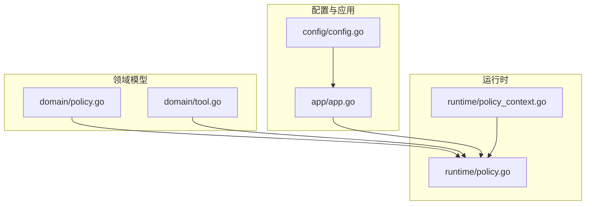
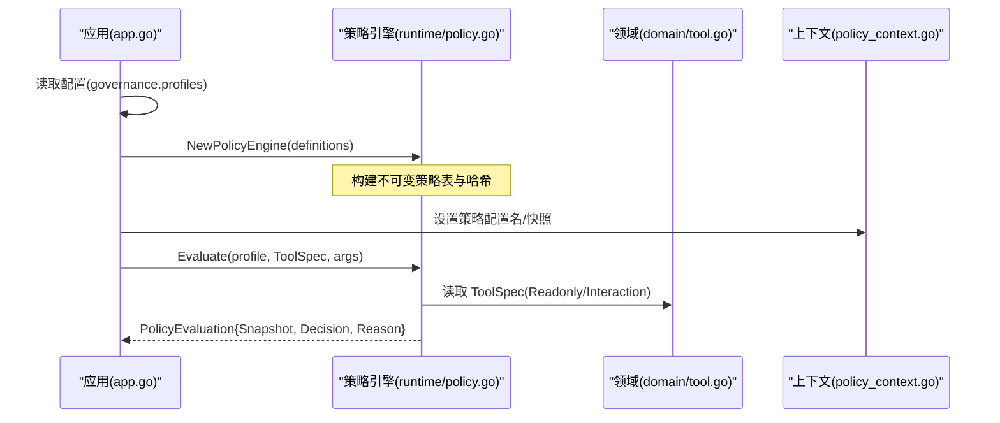
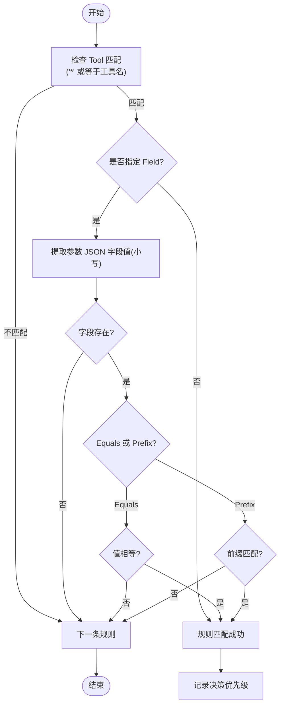
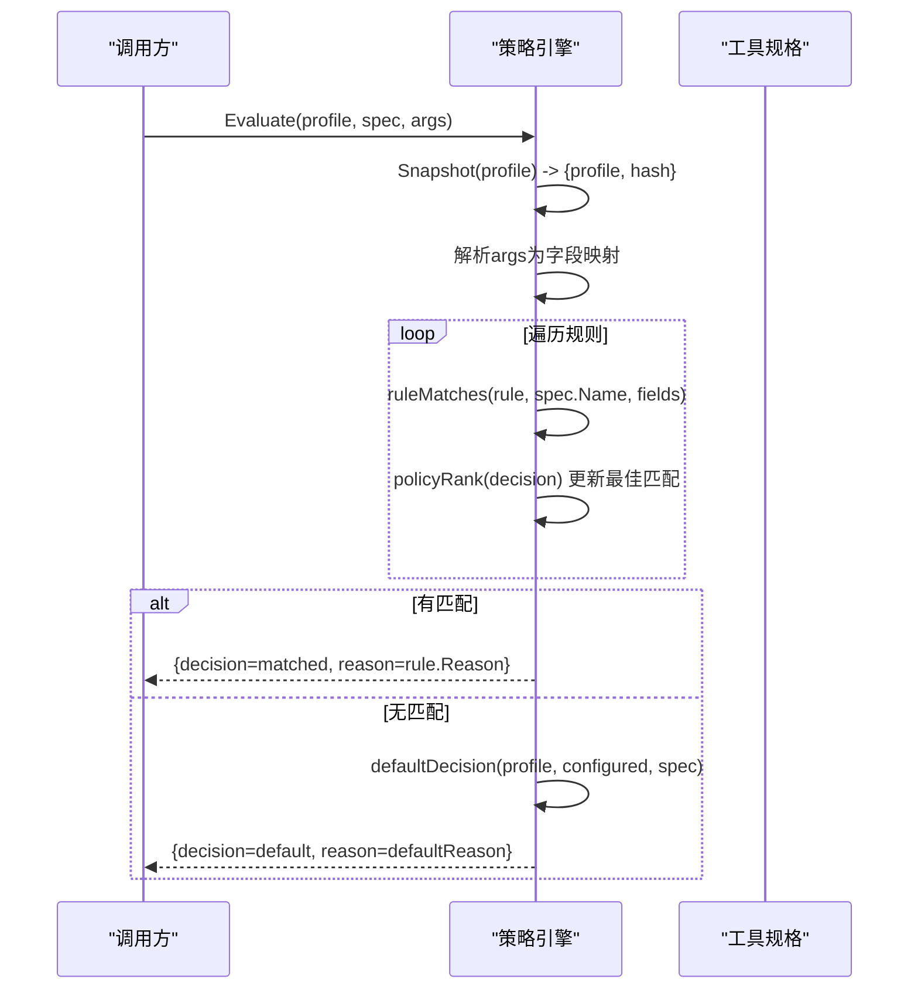
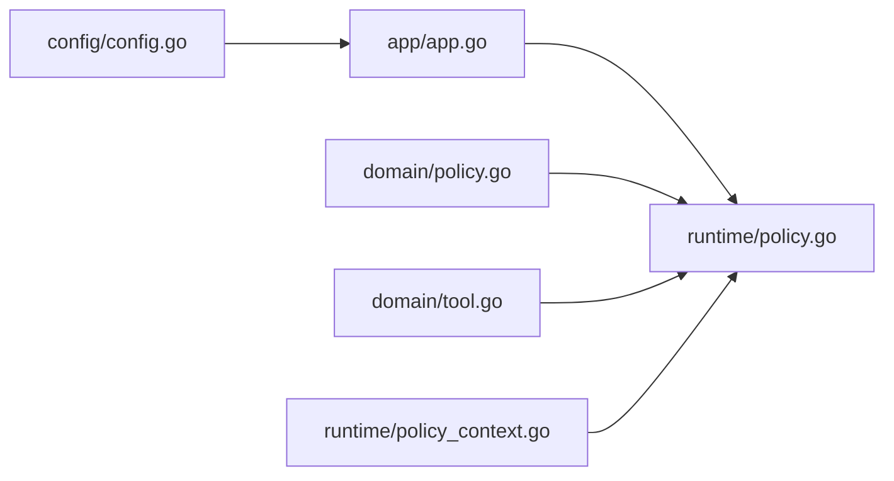

# 策略引擎

<cite>
**本文引用的文件**
- [internal/domain/policy.go](file://internal/domain/policy.go)
- [internal/domain/tool.go](file://internal/domain/tool.go)
- [internal/runtime/policy.go](file://internal/runtime/policy.go)
- [internal/runtime/policy_context.go](file://internal/runtime/policy_context.go)
- [internal/config/config.go](file://internal/config/config.go)
- [internal/app/app.go](file://internal/app/app.go)
- [internal/runtime/policy_test.go](file://internal/runtime/policy_test.go)
</cite>

## 目录
1. [简介](#简介)
2. [项目结构](#项目结构)
3. [核心组件](#核心组件)
4. [架构总览](#架构总览)
5. [详细组件分析](#详细组件分析)
6. [依赖关系分析](#依赖关系分析)
7. [性能考量](#性能考量)
8. [故障排查指南](#故障排查指南)
9. [结论](#结论)
10. [附录](#附录)

## 简介
本文件系统性阐述 Vivy 的策略引擎设计与实现，覆盖不可变构建、多配置文件支持、规则匹配算法、四种内置策略配置文件的默认行为、策略评估完整流程（从工具规格解析到最终决策生成）、策略快照机制与哈希计算、版本管理，以及自定义策略规则与配置的编写方法。文档面向不同技术背景的读者，提供由浅入深的分层说明与可视化图示。

## 项目结构
策略引擎位于 internal/runtime 中，领域模型在 internal/domain，配置加载与校验在 internal/config，应用层将配置转换为运行时策略定义并注入引擎。关键文件职责如下：
- internal/domain/policy.go：策略配置名、决策类型、策略快照等基础类型定义。
- internal/domain/tool.go：工具规格 ToolSpec，包含名称、是否只读、交互类型等，用于策略评估输入。
- internal/runtime/policy.go：策略引擎 PolicyEngine、规则 PolicyRule、定义 PolicyDefinition、评估逻辑、快照与哈希、审批策略评估。
- internal/runtime/policy_context.go：运行上下文中的策略相关键值（运行ID、会话ID、策略配置名、策略快照）。
- internal/config/config.go：GovernanceProfile/GovernanceRule 等配置结构体及校验逻辑。
- internal/app/app.go：将配置映射为运行时策略定义，构造 PolicyEngine。
- internal/runtime/policy_test.go：策略引擎行为测试用例，验证优先级、默认行为与快照变化。

**图表来源**
- [internal/domain/policy.go:1-46](file://internal/domain/policy.go#L1-L46)
- [internal/domain/tool.go:27-50](file://internal/domain/tool.go#L27-L50)
- [internal/runtime/policy.go:19-45](file://internal/runtime/policy.go#L19-L45)
- [internal/runtime/policy_context.go:9-55](file://internal/runtime/policy_context.go#L9-L55)
- [internal/config/config.go:219-231](file://internal/config/config.go#L219-L231)
- [internal/app/app.go:365-386](file://internal/app/app.go#L365-L386)

**章节来源**
- [internal/domain/policy.go:1-46](file://internal/domain/policy.go#L1-L46)
- [internal/domain/tool.go:27-50](file://internal/domain/tool.go#L27-L50)
- [internal/runtime/policy.go:19-45](file://internal/runtime/policy.go#L19-L45)
- [internal/runtime/policy_context.go:9-55](file://internal/runtime/policy_context.go#L9-L55)
- [internal/config/config.go:219-231](file://internal/config/config.go#L219-L231)
- [internal/app/app.go:365-386](file://internal/app/app.go#L365-L386)

## 核心组件
- 策略配置名与决策类型
  - 配置名：default、plan、read_only、full_auto，通过 Valid() 校验。
  - 决策：allow、prompt、deny，通过 Valid() 校验。
- 策略快照
  - PolicySnapshot 包含 Profile 与 Hash，Hash 基于配置序列化后的 SHA256，用于版本追踪与审计。
- 工具规格
  - ToolSpec 包含 Name、Readonly、Interaction（question/none）等，是策略评估的关键输入。
- 策略引擎
  - PolicyEngine 不可变，持有多个配置名的策略定义与对应哈希；提供 Snapshot 与 Evaluate 方法。
- 策略定义与规则
  - PolicyDefinition 包含 Default 与 Rules。
  - PolicyRule 字段：Tool、Field、Equals、Prefix、Decision、Reason。

**章节来源**
- [internal/domain/policy.go:3-45](file://internal/domain/policy.go#L3-L45)
- [internal/domain/tool.go:27-50](file://internal/domain/tool.go#L27-L50)
- [internal/runtime/policy.go:19-45](file://internal/runtime/policy.go#L19-L45)

## 架构总览
策略引擎的调用路径：
- 应用启动时读取 governance.profiles 配置，转换为 runtime.PolicyDefinition，构造 PolicyEngine。
- 每次工具调用前，使用当前运行上下文中的策略配置名（或根据运行模式推导），结合 ToolSpec 与参数 JSON，执行 Evaluate。
- 引擎返回 PolicyEvaluation，包含策略快照、决策与原因；必要时触发审批流程。

**图表来源**
- [internal/app/app.go:365-386](file://internal/app/app.go#L365-L386)
- [internal/runtime/policy.go:47-84](file://internal/runtime/policy.go#L47-L84)
- [internal/runtime/policy.go:96-135](file://internal/runtime/policy.go#L96-L135)
- [internal/domain/tool.go:27-50](file://internal/domain/tool.go#L27-L50)
- [internal/runtime/policy_context.go:32-45](file://internal/runtime/policy_context.go#L32-L45)

## 详细组件分析

### 策略规则与匹配算法
- PolicyRule 字段含义
  - Tool：匹配的工具名，支持“*”通配。
  - Field：参数 JSON 中的字段名（小写匹配）。
  - Equals：精确匹配该字段的值。
  - Prefix：前缀匹配该字段的值。
  - Decision：匹配后产生的决策（allow/prompt/deny）。
  - Reason：匹配时的原因说明。
- 匹配顺序与优先级
  - 遍历所有规则，若规则匹配则比较其决策优先级：deny > prompt > allow。
  - 最高优先级的匹配结果胜出；若无匹配，则回退到默认决策。
- 默认决策逻辑
  - 若工具为只读或交互类型为 question，直接允许。
  - 否则按配置默认决策；若未配置，则依据配置名：full_auto 允许，plan/read_only 拒绝，default 提示。
- 匹配函数 ruleMatches
  - 先检查 Tool 是否匹配（通配或相等）。
  - 若指定了 Field，则从参数 JSON 中提取对应字段值（小写键），再判断 Equals 或 Prefix。
  - 未指定 Field 的规则仅匹配工具本身。

**图表来源**
- [internal/runtime/policy.go:171-189](file://internal/runtime/policy.go#L171-L189)
- [internal/runtime/policy.go:191-202](file://internal/runtime/policy.go#L191-L202)

**章节来源**
- [internal/runtime/policy.go:19-33](file://internal/runtime/policy.go#L19-L33)
- [internal/runtime/policy.go:116-135](file://internal/runtime/policy.go#L116-L135)
- [internal/runtime/policy.go:137-169](file://internal/runtime/policy.go#L137-L169)
- [internal/runtime/policy.go:171-202](file://internal/runtime/policy.go#L171-L202)

### 四种内置策略配置文件的默认行为
- default
  - 无显式规则时，只读工具允许，效果性工具提示用户批准。
- plan
  - 无显式规则时，效果性工具拒绝（适合规划阶段不执行变更）。
- read_only
  - 无显式规则时，效果性工具拒绝（只读模式）。
- full_auto
  - 无显式规则时，效果性工具允许（全自动模式）。

这些默认行为在 Evaluate 的回退逻辑中体现，并通过测试覆盖。

**章节来源**
- [internal/runtime/policy.go:47-53](file://internal/runtime/policy.go#L47-L53)
- [internal/runtime/policy.go:137-152](file://internal/runtime/policy.go#L137-L152)
- [internal/runtime/policy_test.go:30-60](file://internal/runtime/policy_test.go#L30-L60)

### 策略评估完整流程
- 输入
  - 策略配置名（来自上下文或运行模式）。
  - 工具规格 ToolSpec（名称、是否只读、交互类型）。
  - 参数 JSON（可选，用于字段匹配）。
- 步骤
  1) 获取策略快照（含哈希）。
  2) 解析参数 JSON 为字段映射（键小写化）。
  3) 遍历规则，计算匹配与优先级，选择最佳决策。
  4) 若无匹配，按默认决策逻辑得出决策与原因。
  5) 返回 PolicyEvaluation（快照、决策、原因）。
- 输出
  - 上层可根据决策决定是否进入审批流程（如 prompt/deny）。

**图表来源**
- [internal/runtime/policy.go:96-135](file://internal/runtime/policy.go#L96-L135)
- [internal/runtime/policy.go:137-169](file://internal/runtime/policy.go#L137-L169)

**章节来源**
- [internal/runtime/policy.go:96-135](file://internal/runtime/policy.go#L96-L135)
- [internal/runtime/policy.go:137-169](file://internal/runtime/policy.go#L137-L169)

### 策略快照机制、哈希计算与版本管理
- 快照
  - PolicySnapshot 包含 Profile 与 Hash，用于标识一次运行使用的策略版本。
- 哈希计算
  - 对“配置名 + 策略定义”进行 JSON 序列化后计算 SHA256，得到十六进制字符串。
- 版本管理
  - 当策略定义变化时，哈希随之变化，可用于审计与回滚识别。
  - 测试验证不同定义的快照哈希不同且非空。

**章节来源**
- [internal/domain/policy.go:40-45](file://internal/domain/policy.go#L40-L45)
- [internal/runtime/policy.go:71-84](file://internal/runtime/policy.go#L71-L84)
- [internal/runtime/policy_test.go:62-87](file://internal/runtime/policy_test.go#L62-L87)

### 审批策略评估（与策略引擎集成）
- 目的
  - 决定是否需要向用户请求批准（ShouldAsk）、是否自动批准（AutoApprove）及原因。
- 规则
  - 只读或交互类型为 question 的工具无需批准。
  - 审批策略 never：从不询问，效果性工具被拒绝。
  - 审批策略 auto：白名单内的工具自动批准，其他需要询问。
  - 审批策略 ask（默认）：效果性工具一律询问。
  - 未知策略：安全起见，要求询问。
- 输入
  - 审批策略、工具规格、自动批准白名单。

**章节来源**
- [internal/runtime/policy.go:204-274](file://internal/runtime/policy.go#L204-L274)

### 上下文与策略配置名选择
- 上下文键
  - 运行ID、会话ID、策略配置名、策略快照。
- 策略配置名推导
  - 若上下文中未设置或无效，且运行模式为 plan，则使用 plan；否则使用 default。

**章节来源**
- [internal/runtime/policy_context.go:9-55](file://internal/runtime/policy_context.go#L9-L55)

## 依赖关系分析
- 领域层
  - domain/policy.go 提供配置名与决策类型，供运行时使用。
  - domain/tool.go 提供 ToolSpec，作为策略评估输入。
- 运行时层
  - runtime/policy.go 依赖 domain 类型，实现策略引擎核心逻辑。
  - runtime/policy_context.go 提供上下文存取策略相关数据。
- 配置与应用层
  - config/config.go 定义 GovernanceProfile/GovernanceRule 并提供校验。
  - app/app.go 将配置转换为运行时策略定义，构造引擎。

**图表来源**
- [internal/config/config.go:219-231](file://internal/config/config.go#L219-L231)
- [internal/app/app.go:365-386](file://internal/app/app.go#L365-L386)
- [internal/runtime/policy.go:19-45](file://internal/runtime/policy.go#L19-L45)
- [internal/domain/policy.go:3-45](file://internal/domain/policy.go#L3-L45)
- [internal/domain/tool.go:27-50](file://internal/domain/tool.go#L27-L50)
- [internal/runtime/policy_context.go:9-55](file://internal/runtime/policy_context.go#L9-L55)

**章节来源**
- [internal/config/config.go:219-231](file://internal/config/config.go#L219-L231)
- [internal/app/app.go:365-386](file://internal/app/app.go#L365-L386)
- [internal/runtime/policy.go:19-45](file://internal/runtime/policy.go#L19-L45)
- [internal/domain/policy.go:3-45](file://internal/domain/policy.go#L3-L45)
- [internal/domain/tool.go:27-50](file://internal/domain/tool.go#L27-L50)
- [internal/runtime/policy_context.go:9-55](file://internal/runtime/policy_context.go#L9-L55)

## 性能考量
- 不可变构建
  - 策略引擎构造后不可变，可跨运行共享，避免并发竞争与重复解析。
- 规则匹配复杂度
  - 单次评估遍历所有规则，时间复杂度 O(R)，R 为规则数量；字段匹配为常数时间操作。
- 哈希计算
  - 仅在构造时计算各配置名的哈希，开销与配置大小线性相关。
- 参数解析
  - 参数 JSON 解析为字段映射，仅在需要字段匹配时进行，避免不必要的开销。

[本节为通用性能讨论，不直接分析具体文件]

## 故障排查指南
- 常见错误
  - 无效的配置名或决策：NewPolicyEngine 会返回错误，需检查配置名是否在有效集合内，决策是否为 allow/prompt/deny。
  - 规则非法：Tool 为空或 Decision 无效会导致构造失败。
  - 参数非 JSON：Evaluate 在解析参数时会报错，需确保传入的是合法 JSON。
- 调试建议
  - 检查策略快照哈希是否随配置变化而变化，以确认生效。
  - 使用测试用例思路验证规则优先级与默认行为是否符合预期。
  - 关注审批策略评估结果，确认 ShouldAsk/AutoApprove 与原因。

**章节来源**
- [internal/runtime/policy.go:47-84](file://internal/runtime/policy.go#L47-L84)
- [internal/runtime/policy.go:96-107](file://internal/runtime/policy.go#L96-L107)
- [internal/runtime/policy_test.go:9-28](file://internal/runtime/policy_test.go#L9-L28)

## 结论
Vivy 的策略引擎以不可变构建为核心，提供多配置文件支持与严格的规则匹配算法。通过四种内置策略配置文件（default、plan、read_only、full_auto）满足不同场景的安全与自动化需求。策略快照与哈希机制保障了版本可追溯性与审计能力。结合审批策略评估，系统能够在保证安全的前提下灵活控制工具执行。

[本节为总结性内容，不直接分析具体文件]

## 附录

### 策略规则字段说明
- Tool：工具名或“*”通配。
- Field：参数 JSON 字段名（匹配时键小写化）。
- Equals：精确匹配字段值。
- Prefix：前缀匹配字段值。
- Decision：匹配后的决策（allow/prompt/deny）。
- Reason：匹配原因。

**章节来源**
- [internal/runtime/policy.go:19-28](file://internal/runtime/policy.go#L19-L28)

### 配置结构与示例
- 配置结构
  - Governance.Profiles：映射配置名到 GovernanceProfile。
  - GovernanceProfile.Default：默认决策。
  - GovernanceProfile.Rules：规则列表，每条规则包含 Tool、Field、Equals、Prefix、Decision、Reason。
- 示例（文本描述）
  - 在 governance.profiles.default 下添加一条规则：Tool 为 write_note，Field 为 path，Prefix 为 “..”，Decision 为 deny，Reason 为 “path escape”。
  - 在 governance.profiles.plan 下添加一条规则：Tool 为 *，Decision 为 deny，Reason 为 “plan mode denies effectful tools”。
  - 在 governance.profiles.read_only 下添加一条规则：Tool 为 *，Decision 为 deny，Reason 为 “read-only mode denies effectful tools”。
  - 在 governance.profiles.full_auto 下添加一条规则：Tool 为 *，Decision 为 allow，Reason 为 “full auto allows all tools”。

**章节来源**
- [internal/config/config.go:219-231](file://internal/config/config.go#L219-L231)
- [internal/app/app.go:365-386](file://internal/app/app.go#L365-L386)

### 自定义策略规则编写要点
- 规则优先级
  - 通过 Decision 的优先级（deny > prompt > allow）控制最终结果，即使规则顺序不同，deny 也会胜出。
- 字段匹配
  - 使用 Field 配合 Equals 或 Prefix 精确控制参数范围，注意键小写化。
- 默认行为
  - 未命中任何规则时，依据配置名与工具属性（只读/交互）确定默认决策。
- 审批策略
  - 结合审批策略（ask/never/auto）与白名单，进一步控制是否需要用户批准。

**章节来源**
- [internal/runtime/policy.go:116-135](file://internal/runtime/policy.go#L116-L135)
- [internal/runtime/policy.go:137-169](file://internal/runtime/policy.go#L137-L169)
- [internal/runtime/policy.go:204-274](file://internal/runtime/policy.go#L204-L274)