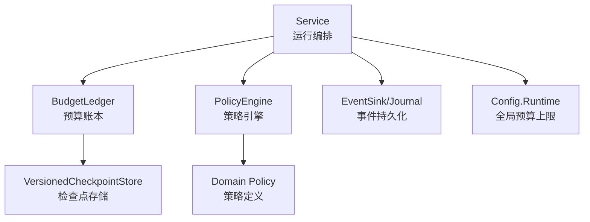
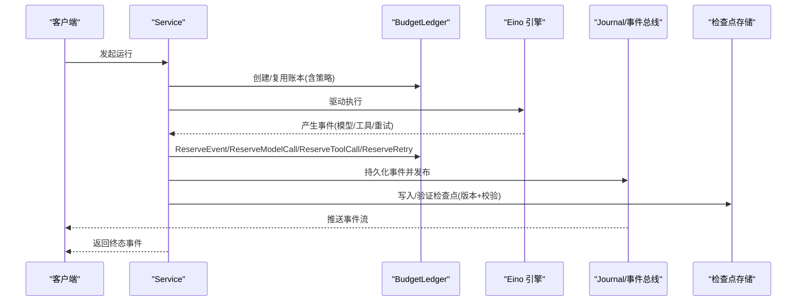
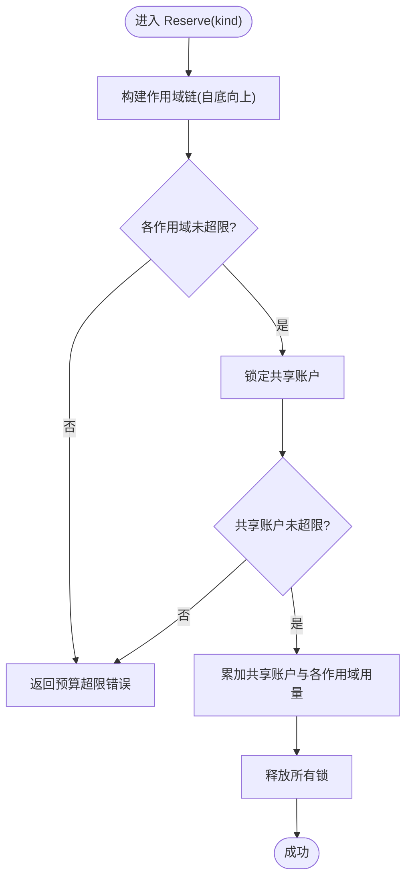
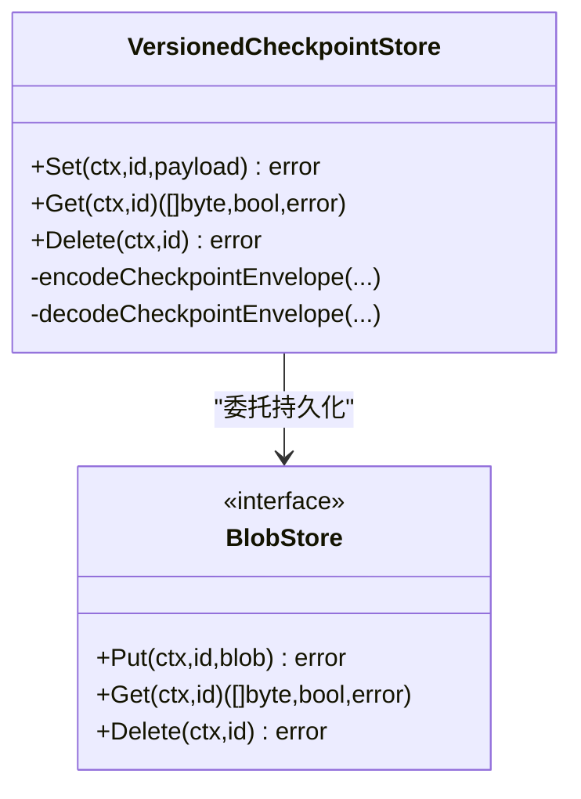
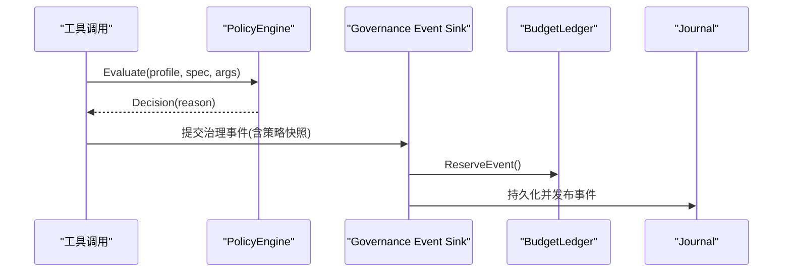
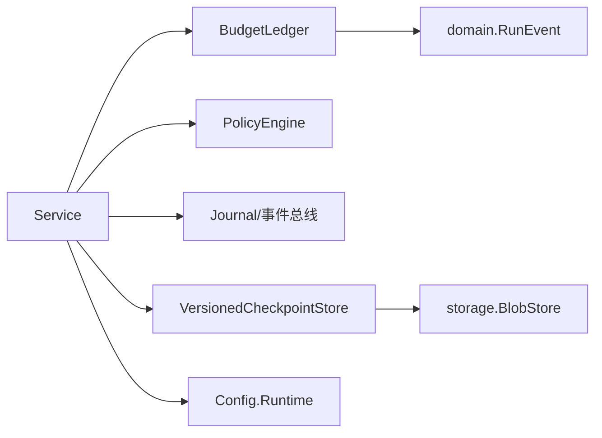

# 预算控制

<cite>
**本文引用的文件**
- [budget.go](file://internal/runtime/budget.go)
- [checkpoint.go](file://internal/runtime/checkpoint.go)
- [policy.go](file://internal/runtime/policy.go)
- [policy.go](file://internal/domain/policy.go)
- [config.go](file://internal/config/config.go)
- [service.go](file://internal/runtime/service.go)
- [budget_test.go](file://internal/runtime/budget_test.go)
- [checkpoint_test.go](file://internal/runtime/checkpoint_test.go)
</cite>

## 目录
1. [简介](#简介)
2. [项目结构](#项目结构)
3. [核心组件](#核心组件)
4. [架构总览](#架构总览)
5. [详细组件分析](#详细组件分析)
6. [依赖关系分析](#依赖关系分析)
7. [性能考量](#性能考量)
8. [故障排查指南](#故障排查指南)
9. [结论](#结论)
10. [附录：配置与策略实践](#附录配置与策略实践)

## 简介
本文件面向“预算控制系统”的完整设计与实现，覆盖资源限制机制、令牌使用监控、成本计算模型、配额管理策略、预算检查点的作用与恢复、以及预算与策略系统的集成方式。文档同时提供预算配置的完整指南（全局预算、按会话预算、按工具预算）和监控告警建议，帮助为不同类型的代理运行配置合理的预算策略。

## 项目结构
预算控制相关代码主要位于 runtime 层，围绕以下关键模块组织：
- 预算账本与配额：BudgetLedger、BudgetPolicy、BudgetUsage、BudgetSnapshot
- 预算检查点：VersionedCheckpointStore（与 eino 运行时对接，带版本与校验）
- 策略引擎：PolicyEngine（工具调用审批与默认决策）
- 配置边界：Config.Runtime 中的 MaxRunEvents/MaxModelCalls/MaxRunToolCalls/MaxRunRetries 等
- 服务编排：Service 将预算、策略、事件持久化串联起来

图表来源
- [service.go:150-169](file://internal/runtime/service.go#L150-L169)
- [budget.go:103-140](file://internal/runtime/budget.go#L103-L140)
- [checkpoint.go:40-75](file://internal/runtime/checkpoint.go#L40-L75)
- [policy.go:35-84](file://internal/runtime/policy.go#L35-L84)
- [config.go:110-153](file://internal/config/config.go#L110-L153)

章节来源
- [service.go:150-169](file://internal/runtime/service.go#L150-L169)
- [budget.go:103-140](file://internal/runtime/budget.go#L103-L140)
- [checkpoint.go:40-75](file://internal/runtime/checkpoint.go#L40-L75)
- [policy.go:35-84](file://internal/runtime/policy.go#L35-L84)
- [config.go:110-153](file://internal/config/config.go#L110-L153)

## 核心组件
- 预算账本 BudgetLedger：线程安全地维护共享账户与层级作用域，支持 Reserve 原子扣减与 Snapshot 观测。
- 预算策略 BudgetPolicy：定义事件、模型调用、工具调用、重试的上限；子作用域可收紧但不可放宽父级限额。
- 预算快照 BudgetSnapshot/BudgetUsage：用于观测当前用量与有效策略。
- 检查点 VersionedCheckpointStore：对 eino 检查点进行版本包裹与完整性校验，失败关闭读取。
- 策略引擎 PolicyEngine：基于 Profile 与规则评估工具调用是否允许、提示或拒绝，并生成策略快照。
- 配置 Config.Runtime：提供全局预算上限（事件、模型调用、工具调用、重试），作为默认安全网。

章节来源
- [budget.go:11-88](file://internal/runtime/budget.go#L11-L88)
- [budget.go:103-196](file://internal/runtime/budget.go#L103-L196)
- [checkpoint.go:40-97](file://internal/runtime/checkpoint.go#L40-L97)
- [policy.go:19-84](file://internal/runtime/policy.go#L19-L84)
- [config.go:110-153](file://internal/config/config.go#L110-L153)

## 架构总览
预算控制贯穿一次 Run 的全生命周期：从启动时根据配置创建 BudgetLedger，到运行中在关键路径上 Reserve 计数，再到事件落库前通过 governance sink 扣减事件配额，最后通过检查点保障重启后状态一致。

图表来源
- [service.go:150-169](file://internal/runtime/service.go#L150-L169)
- [budget.go:142-186](file://internal/runtime/budget.go#L142-L186)
- [checkpoint.go:64-97](file://internal/runtime/checkpoint.go#L64-L97)

## 详细组件分析

### 预算账本与配额管理
- 资源类型：events、model_calls、tool_calls、retries。
- 作用域：父子账本共享根账户，子作用域可设置更紧的本地限额；Reserve 会先校验所有作用域上限，再原子增加共享账户与各作用域用量。
- 并发安全：多锁顺序加锁避免死锁；Reserve 内对作用域链与共享账户的读-改-写是原子的。
- 恢复一致性：ReplayEvent 根据事件类型回放预算消耗，确保重启后预算状态与事件日志一致。

图表来源
- [budget.go:142-186](file://internal/runtime/budget.go#L142-L186)
- [budget.go:222-293](file://internal/runtime/budget.go#L222-L293)

章节来源
- [budget.go:11-88](file://internal/runtime/budget.go#L11-L88)
- [budget.go:103-196](file://internal/runtime/budget.go#L103-L196)
- [budget.go:198-220](file://internal/runtime/budget.go#L198-L220)
- [budget_test.go:11-59](file://internal/runtime/budget_test.go#L11-L59)
- [budget_test.go:61-84](file://internal/runtime/budget_test.go#L61-L84)
- [budget_test.go:86-105](file://internal/runtime/budget_test.go#L86-L105)

### 预算检查点与恢复
- 目的：eino 检查点以不透明字节存在，Vivy 在其外包裹信封（引擎版本、SHA256 校验、时间戳），落盘后读取时严格校验版本与完整性，失败即关闭。
- 版本隔离：不同引擎版本的检查点互不兼容，防止跨版本误用。
- 恢复流程：重启后通过 ReplayEvent 重放事件，结合检查点保证预算与状态一致。

图表来源
- [checkpoint.go:40-97](file://internal/runtime/checkpoint.go#L40-L97)
- [checkpoint.go:104-134](file://internal/runtime/checkpoint.go#L104-L134)

章节来源
- [checkpoint.go:17-97](file://internal/runtime/checkpoint.go#L17-L97)
- [checkpoint.go:104-134](file://internal/runtime/checkpoint.go#L104-L134)
- [checkpoint_test.go:29-68](file://internal/runtime/checkpoint_test.go#L29-L68)
- [checkpoint_test.go:70-107](file://internal/runtime/checkpoint_test.go#L70-L107)
- [checkpoint_test.go:109-133](file://internal/runtime/checkpoint_test.go#L109-L133)

### 预算与策略系统集成
- 策略 Profile：default、plan、read_only、full_auto，决定工具调用的默认行为。
- 规则匹配：按工具名与参数字段（command/path/file_path 等）进行 equals/prefix 匹配，选择最高优先级的 allow/prompt/deny。
- 审批策略：ask/never/auto 三种模式，结合白名单工具自动放行只读或受信任操作。
- 治理事件：governance sink 在事件落库前记录策略评估结果，并计入事件配额。

图表来源
- [policy.go:35-135](file://internal/runtime/policy.go#L35-L135)
- [policy.go:212-273](file://internal/runtime/policy.go#L212-L273)
- [service.go:1860-1895](file://internal/runtime/service.go#L1860-L1895)

章节来源
- [policy.go:19-135](file://internal/runtime/policy.go#L19-L135)
- [policy.go:212-273](file://internal/runtime/policy.go#L212-L273)
- [domain/policy.go:1-46](file://internal/domain/policy.go#L1-L46)
- [service.go:1860-1895](file://internal/runtime/service.go#L1860-L1895)

### 预算检查点的手动恢复机制
- 触发场景：进程重启、崩溃恢复、迁移升级。
- 步骤：
  1) 加载检查点并校验版本与完整性；若失败则拒绝恢复。
  2) 重放事件序列，依次调用 ReserveEvent/ReserveModelCall/ReserveToolCall/ReserveRetry，确保预算状态与事件日志一致。
  3) 若重放过程中遇到预算超限，立即中止恢复，避免不一致。
- 设计要点：非终态事件才消耗事件配额；终态事件仅作为闭合记录，不额外占用配额。

章节来源
- [checkpoint.go:64-97](file://internal/runtime/checkpoint.go#L64-L97)
- [budget.go:198-220](file://internal/runtime/budget.go#L198-L220)
- [budget_test.go:86-105](file://internal/runtime/budget_test.go#L86-L105)

### 令牌使用监控与成本计算模型
- 令牌使用监控：通过事件流（模型请求、完成、增量）与工具调用事件，可在上层聚合 token 用量。预算账本本身不直接统计 token 数，而是以“模型调用次数”作为硬上限保护。
- 成本计算模型：建议在事件层聚合 provider 返回的 usage 指标（输入/输出 token、推理 token 等），按定价模型换算成本；预算系统可与成本阈值联动，触发告警或降级。
- 配额管理策略：除全局上限外，可通过子账本（Child）为特定会话或工具集设置更紧的本地限额，形成“全局-会话-工具”三层配额。

章节来源
- [budget.go:11-88](file://internal/runtime/budget.go#L11-L88)
- [budget.go:142-186](file://internal/runtime/budget.go#L142-L186)
- [service.go:1860-1895](file://internal/runtime/service.go#L1860-L1895)

## 依赖关系分析
- Service 依赖 BudgetLedger 与 PolicyEngine，并在治理事件落库前扣减事件配额。
- BudgetLedger 依赖 domain 事件类型进行恢复重放。
- VersionedCheckpointStore 依赖 storage.BlobStore 进行持久化，并通过版本与校验保证安全性。
- Config.Runtime 提供全局预算上限，作为默认安全网。

图表来源
- [service.go:150-169](file://internal/runtime/service.go#L150-L169)
- [budget.go:198-220](file://internal/runtime/budget.go#L198-L220)
- [checkpoint.go:40-97](file://internal/runtime/checkpoint.go#L40-L97)
- [config.go:110-153](file://internal/config/config.go#L110-L153)

章节来源
- [service.go:150-169](file://internal/runtime/service.go#L150-L169)
- [budget.go:198-220](file://internal/runtime/budget.go#L198-L220)
- [checkpoint.go:40-97](file://internal/runtime/checkpoint.go#L40-L97)
- [config.go:110-153](file://internal/config/config.go#L110-L153)

## 性能考量
- 并发安全：Reserve 采用作用域链顺序加锁与共享账户锁，避免竞态与死锁；高并发下仍能保证原子性。
- 开销最小化：预算检查仅在关键路径（事件、模型/工具调用、重试）进行，避免热点放大。
- 恢复效率：ReplayEvent 按事件顺序线性回放，复杂度与事件数量线性相关；可通过分页或批处理优化大事务恢复。
- 检查点体积：检查点信封较小，校验为 SHA256，读写开销可控。

[本节为通用性能讨论，不直接分析具体文件]

## 故障排查指南
- 预算超限：当 Reserve 返回预算超限错误时，检查对应 Kind 的使用量与限额；确认是否存在循环调用或异常重试。
- 检查点损坏：若 Get 返回损坏错误，说明底层 blob 被篡改或损坏；需清理并重新生成检查点。
- 版本不匹配：若读取检查点报版本不匹配，说明二进制与检查点不兼容；需升级或重建检查点。
- 策略误判：检查 PolicyProfile 与规则匹配条件（tool/field/equals/prefix），确认默认决策是否符合预期。

章节来源
- [budget.go:57-73](file://internal/runtime/budget.go#L57-L73)
- [checkpoint.go:17-27](file://internal/runtime/checkpoint.go#L17-L27)
- [checkpoint.go:80-97](file://internal/runtime/checkpoint.go#L80-L97)
- [policy.go:96-135](file://internal/runtime/policy.go#L96-L135)

## 结论
预算控制系统通过 BudgetLedger 提供细粒度、可嵌套的资源配额，配合策略引擎与治理事件，实现对模型调用、工具调用与重试的强约束；检查点机制确保重启后预算与状态一致。结合配置层的默认上限与服务层的编排，可在不同代理运行场景下灵活配置预算策略，保障系统稳定与安全。

[本节为总结性内容，不直接分析具体文件]

## 附录：配置与策略实践

### 全局预算设置
- 通过 Config.Runtime 设置全局上限：
  - max_run_events：单次运行树的最大非终态事件数
  - max_model_calls：模型生成次数上限
  - max_run_tool_calls：工具调用次数上限
  - max_run_retries：显式重试次数上限
- 这些值作为默认安全网，服务构造时若未显式传入 BudgetPolicy，将使用默认策略。

章节来源
- [config.go:110-153](file://internal/config/config.go#L110-L153)
- [config.go:254-314](file://internal/config/config.go#L254-L314)
- [service.go:150-169](file://internal/runtime/service.go#L150-L169)

### 按会话预算
- 使用 BudgetLedger.Child 为每个会话创建子账本，设置更紧的本地限额，确保会话级预算不被其他会话突破。
- 子作用域无法绕过父级共享账户限制，保证整体预算安全。

章节来源
- [budget.go:125-140](file://internal/runtime/budget.go#L125-L140)
- [budget_test.go:11-59](file://internal/runtime/budget_test.go#L11-L59)

### 按工具预算
- 通过 PolicyEngine 的规则匹配，对不同工具设置不同的默认决策与审批策略。
- 结合 Approval 策略（ask/never/auto）与白名单工具，精细控制工具调用风险。

章节来源
- [policy.go:19-135](file://internal/runtime/policy.go#L19-L135)
- [policy.go:212-273](file://internal/runtime/policy.go#L212-L273)

### 预算监控指标、告警与报告
- 指标采集：
  - 事件配额使用率：ReserveEvent 的失败率与使用量
  - 模型调用配额使用率：ReserveModelCall 的使用量与失败率
  - 工具调用配额使用率：ReserveToolCall 的使用量与失败率
  - 重试配额使用率：ReserveRetry 的使用量与失败率
- 告警建议：
  - 当任一配额使用率达到阈值（如 80%）时触发预警
  - 出现预算超限时立即告警并阻断后续调用
- 报告生成：
  - 基于事件流聚合 token 用量与成本估算
  - 按会话/工具维度生成预算使用报告

[本节为通用指导，不直接分析具体文件]

### 为不同类型代理配置预算策略
- 探索型代理（Plan/Read-only）：
  - 策略：默认 deny，仅允许只读工具
  - 预算：较低的事件与模型调用上限
- 自动化代理（Full-auto）：
  - 策略：默认 allow，结合白名单工具自动放行
  - 预算：较高上限，但仍需设置重试上限防止无限重试
- 受限代理（Sandbox）：
  - 策略：严格审批（ask），网络与文件系统访问受限
  - 预算：严格的事件与工具调用上限，必要时进一步细分到工具级

[本节为通用指导，不直接分析具体文件]