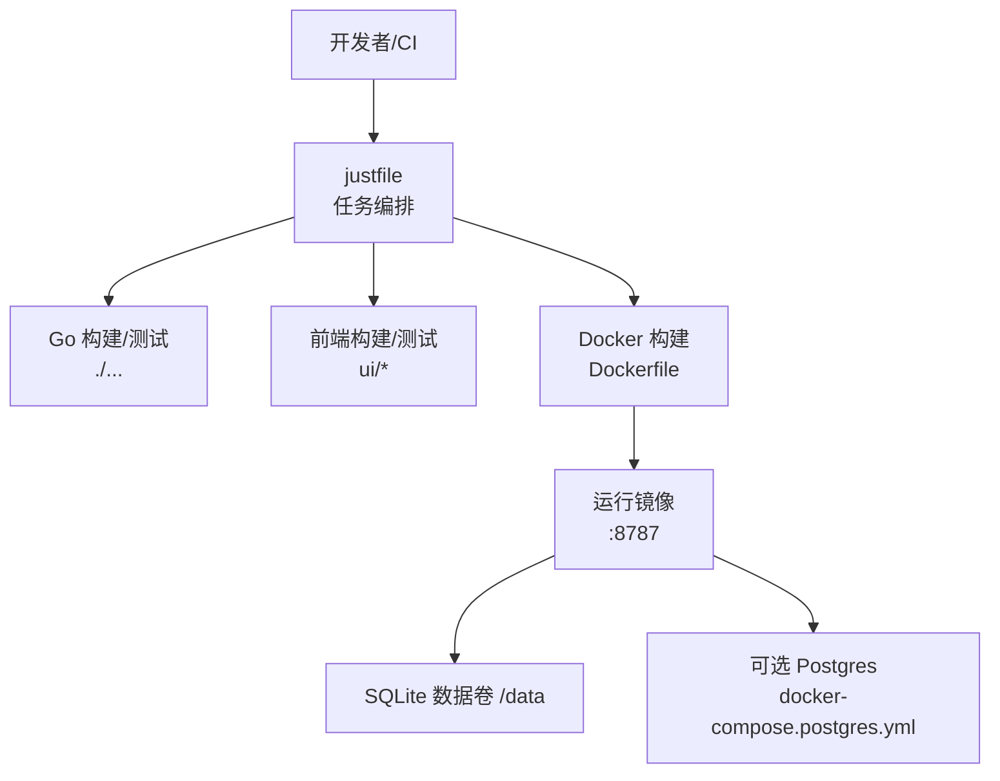
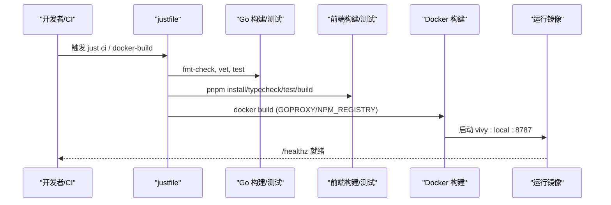
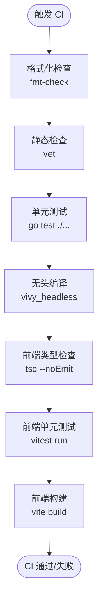
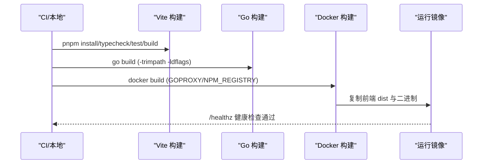
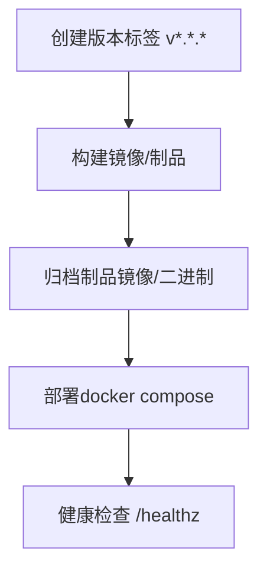
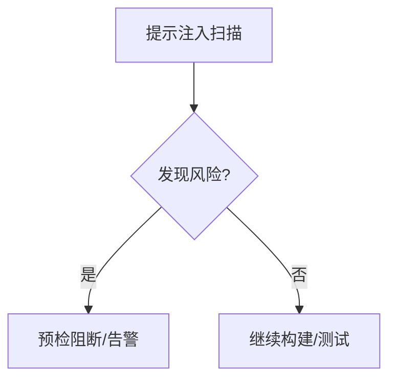
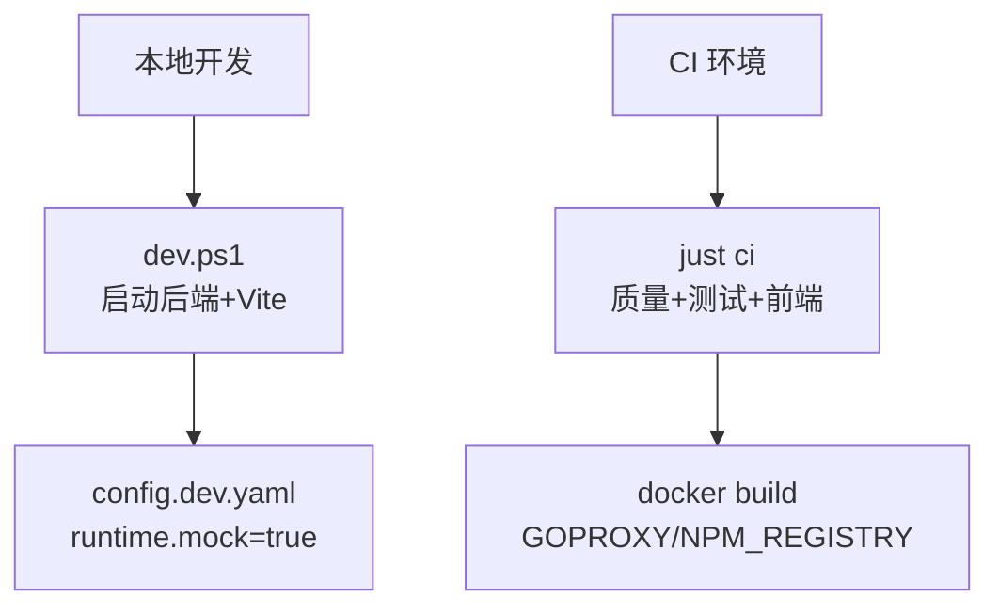
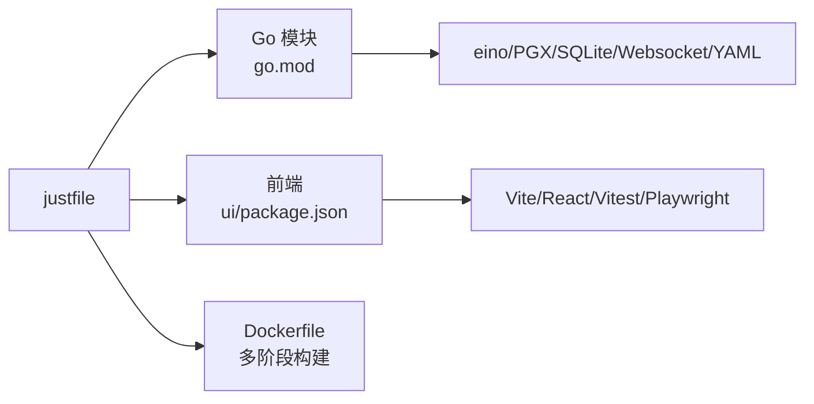

# CI/CD流水线

<cite>
**本文引用的文件**
- [justfile](file://justfile)
- [Dockerfile](file://Dockerfile)
- [docker-compose.yml](file://docker-compose.yml)
- [config.dev.yaml](file://config.dev.yaml)
- [dev.ps1](file://dev.ps1)
- [ui/package.json](file://ui/package.json)
- [go.mod](file://go.mod)
- [internal/tools/security.go](file://internal/tools/security.go)
- [internal/runtime/preflight.go](file://internal/runtime/preflight.go)
</cite>

## 目录
1. [简介](#简介)
2. [项目结构](#项目结构)
3. [核心组件](#核心组件)
4. [架构总览](#架构总览)
5. [详细组件分析](#详细组件分析)
6. [依赖关系分析](#依赖关系分析)
7. [性能与构建优化](#性能与构建优化)
8. [故障排查指南](#故障排查指南)
9. [结论](#结论)
10. [附录](#附录)

## 简介
本仓库采用“Go 后端 + 内嵌前端资源”的单体应用形态，通过 justfile 统一编排本地开发、质量检查、测试与打包；使用 Docker 多阶段构建将 Vite 前端产物与 Go 二进制合并为单一可执行镜像。持续集成以 just ci 为核心入口，覆盖格式化检查、vet、单元测试、无头编译以及前端类型检查与测试。发布流程基于容器镜像与制品归档，支持可选 Postgres 存储扩展。安全方面内置提示注入检测与预检机制，便于在 CI 中作为质量门禁的一部分。

## 项目结构
- 根级任务编排：justfile 提供 dev、ci、build、test、fmt-check、vet、ui-ci、headless-compile、docker-build 等任务，是本地与 CI 的统一入口。
- 容器化：Dockerfile 定义 Node 构建前端、Go 构建后端、最终运行镜像；docker-compose.yml 提供一键启动（含健康检查与数据卷）。
- 前端：ui 目录为 React+Vite 工程，package.json 暴露 dev/build/test/typecheck/e2e 脚本；CI 中通过 just ui-ci 完成安装、类型检查、测试与构建。
- 后端：Go 模块 go.mod 声明依赖；cmd/vivy 为主程序；internal 包含运行时、工具、存储等。
- 配置：config.dev.yaml 用于本地开发时启用 mock 模式；docker/config.yaml 为容器默认配置路径。

**图示来源**
- [justfile:14-37](file://justfile#L14-L37)
- [Dockerfile:7-47](file://Dockerfile#L7-L47)
- [docker-compose.yml:6-32](file://docker-compose.yml#L6-L32)

**章节来源**
- [justfile:1-70](file://justfile#L1-L70)
- [Dockerfile:1-48](file://Dockerfile#L1-L48)
- [docker-compose.yml:1-33](file://docker-compose.yml#L1-L33)
- [ui/package.json:6-12](file://ui/package.json#L6-L12)
- [go.mod:1-12](file://go.mod#L1-L12)

## 核心组件
- 任务编排器（justfile）
  - 代码质量：fmt-check、vet
  - 单元测试：test
  - 无头编译：headless-compile（确保 UI 嵌入可用）
  - 前端质量：ui-ci（pnpm install、typecheck、test、build）
  - 容器构建：docker-build（带 GOPROXY/NPM_REGISTRY 参数）
- 容器镜像（Dockerfile）
  - 多阶段：Node 构建前端静态资源 -> Go 编译二进制 -> 最小运行镜像
  - 健康检查：/healthz
  - 环境变量：VIVY_CONFIG、VIVY_ADDR、TZ
- 本地开发（dev.ps1 + config.dev.yaml）
  - 启动后端 :8787 与 Vite :3015 分离进程
  - 自动设置 GOPROXY，未配置密钥时加载 config.dev.yaml（runtime.mock=true）
- 运行编排（docker-compose.yml）
  - 单实例约束（replica=1），仅绑定 127.0.0.1:8787
  - 持久化 /data 卷，可选叠加 Postgres 配置

**章节来源**
- [justfile:14-57](file://justfile#L14-L57)
- [Dockerfile:21-47](file://Dockerfile#L21-L47)
- [dev.ps1:117-131](file://dev.ps1#L117-L131)
- [config.dev.yaml:1-6](file://config.dev.yaml#L1-L6)
- [docker-compose.yml:6-32](file://docker-compose.yml#L6-L32)

## 架构总览
下图展示从提交到构建、测试、打包与运行的端到端流程，映射到仓库中的具体文件与步骤。

**图示来源**
- [justfile:23-37](file://justfile#L23-L37)
- [Dockerfile:7-47](file://Dockerfile#L7-L47)
- [docker-compose.yml:16-29](file://docker-compose.yml#L16-L29)

## 详细组件分析

### 持续集成流程（代码质量、单元/集成测试）
- 代码质量门禁
  - 格式化检查：just fmt-check（扫描 cmd/internal/sdk/ui 下的 .go 文件）
  - 静态检查：just vet（go vet ./...）
- 单元测试
  - just test（go test ./...）
  - 可选 Postgres 集成测试：just test-postgres（需设置 VIVY_POSTGRES_TEST_DSN）
- 前端测试
  - just ui-ci：pnpm install --frozen-lockfile -> typecheck -> test -> build
  - 端到端测试：just ui-e2e（先构建再运行 playwright）
- 无头编译验证
  - headless-compile：确保 UI 资源被正确嵌入（-tags vivy_headless）

**图示来源**
- [justfile:20-37](file://justfile#L20-L37)
- [ui/package.json:6-12](file://ui/package.json#L6-L12)

**章节来源**
- [justfile:20-40](file://justfile#L20-L40)
- [ui/package.json:6-12](file://ui/package.json#L6-L12)

### 构建管道（前端资源打包、Go 二进制、Docker 镜像）
- 前端打包
  - 使用 pnpm 安装依赖并锁定版本（--frozen-lockfile）
  - 类型检查（tsc --noEmit）、单元测试（vitest run）、构建（vite build）
- Go 二进制编译
  - go build ./... 或针对 cmd/vivy 构建
  - 无头编译标签 vivy_headless 用于验证嵌入
- Docker 镜像构建
  - 多阶段：Node 构建前端 -> Go 编译二进制 -> 精简运行镜像
  - 传递 GOPROXY 与 NPM_REGISTRY 加速依赖下载
  - 健康检查 /healthz，暴露 8787，挂载 /data

**图示来源**
- [Dockerfile:7-29](file://Dockerfile#L7-L29)
- [Dockerfile:31-47](file://Dockerfile#L31-L47)
- [justfile:26-37](file://justfile#L26-L37)

**章节来源**
- [Dockerfile:7-47](file://Dockerfile#L7-L47)
- [justfile:26-37](file://justfile#L26-L37)
- [ui/package.json:6-12](file://ui/package.json#L6-L12)

### 发布流程（版本标签管理、制品归档、部署自动化）
- 版本标签
  - 通过 git tag v*.*.* 触发发布分支逻辑（当前仓库根级 CI 由 justfile 驱动；若引入 GitHub Actions，可在 tag 上触发 release job）
- 制品归档
  - 容器镜像：docker build 产出 vivy:local（CI 中可推送到镜像仓库）
  - 可执行文件：dist/vivy-backend.exe（split 构建产物）
- 部署自动化
  - docker compose up --build 一键拉起服务（仅绑定 127.0.0.1:8787）
  - 可选叠加 Postgres：docker-compose.postgres.yml

[此图为概念性流程图，不直接映射具体源码文件]

**章节来源**
- [justfile:49-61](file://justfile#L49-L61)
- [docker-compose.yml:6-32](file://docker-compose.yml#L6-L32)

### 质量门禁（覆盖率、安全扫描、依赖漏洞检测）
- 覆盖率
  - 当前 justfile 未内置覆盖率收集；可在 CI 中扩展（例如结合 go test -coverprofile）
- 安全扫描
  - 运行时提示注入检测：internal/tools/security.go 提供粗粒度信号（如指令覆盖语言）
  - 预检机制：internal/runtime/preflight.go 汇总警告与阻断项，可用于 CI 阻断
- 依赖漏洞检测
  - 建议在 CI 中加入依赖扫描（如 govulncheck 或第三方 SCA 工具），当前仓库未内置

**图示来源**
- [internal/tools/security.go:19-36](file://internal/tools/security.go#L19-L36)
- [internal/runtime/preflight.go:108-122](file://internal/runtime/preflight.go#L108-L122)

**章节来源**
- [internal/tools/security.go:19-36](file://internal/tools/security.go#L19-L36)
- [internal/runtime/preflight.go:108-122](file://internal/runtime/preflight.go#L108-L122)

### 本地开发与 CI 环境差异
- 本地开发
  - 使用 dev.ps1 启动后端 :8787 与 Vite :3015 分离进程
  - 未配置 API Key 时自动加载 config.dev.yaml（runtime.mock=true）
  - GOPROXY 设置为 https://goproxy.cn,direct
- CI 环境
  - just ci 串联 fmt-check、vet、test、headless-compile、ui-ci
  - 前端构建使用 pnpm --frozen-lockfile，确保依赖一致性
  - Docker 构建传入 GOPROXY 与 NPM_REGISTRY 加速依赖下载
  - 端口与网络：容器仅监听 127.0.0.1:8787，避免对外暴露

**图示来源**
- [dev.ps1:117-131](file://dev.ps1#L117-L131)
- [justfile:23-37](file://justfile#L23-L37)
- [Dockerfile:4-5](file://Dockerfile#L4-L5)
- [docker-compose.yml:16-17](file://docker-compose.yml#L16-L17)

**章节来源**
- [dev.ps1:117-131](file://dev.ps1#L117-L131)
- [justfile:23-37](file://justfile#L23-L37)
- [Dockerfile:4-5](file://Dockerfile#L4-L5)
- [docker-compose.yml:16-17](file://docker-compose.yml#L16-L17)

## 依赖关系分析
- Go 模块依赖
  - 核心框架：cloudwego/eino（唯一允许依赖 eino 的包范围受架构红线约束）
  - 数据库：modernc.org/sqlite（默认）、github.com/jackc/pgx/v5（Postgres 可选）
  - 通信：gorilla/websocket
  - 配置：gopkg.in/yaml.v3
- 前端依赖
  - Vite、React、TypeScript、Vitest、Playwright（E2E）
- 构建链依赖
  - justfile 协调 Go 与 Node 工具链
  - Dockerfile 串联 Node 与 Go 构建阶段

**图示来源**
- [go.mod:5-12](file://go.mod#L5-L12)
- [ui/package.json:14-80](file://ui/package.json#L14-L80)
- [justfile:14-37](file://justfile#L14-L37)
- [Dockerfile:7-29](file://Dockerfile#L7-L29)

**章节来源**
- [go.mod:5-12](file://go.mod#L5-L12)
- [ui/package.json:14-80](file://ui/package.json#L14-L80)
- [justfile:14-37](file://justfile#L14-L37)
- [Dockerfile:7-29](file://Dockerfile#L7-L29)

## 性能与构建优化
- 依赖缓存
  - Go：go mod download 与 GOPROXY 加速
  - Node：pnpm --frozen-lockfile 与缓存 node_modules（CI 中建议启用缓存）
- 构建裁剪
  - Go：-trimpath -ldflags "-s -w" 减小二进制体积
  - Docker：多阶段构建分离前端与后端，减少最终镜像体积
- 并行化
  - just ci 顺序执行各阶段，可按需拆分并发（例如前后端独立 Job）
- 健康检查
  - /healthz 快速判定服务就绪，缩短等待时间

[本节为通用指导，不直接分析具体文件]

## 故障排查指南
- 端口占用
  - 本地开发脚本会检测 8787 与 3015 是否被占用，若占用则中止并提示
- 依赖下载失败
  - 确认 GOPROXY 与 NPM_REGISTRY 已正确设置（dev.ps1 与 Dockerfile 均显式配置）
- 前端构建失败
  - 检查 pnpm 版本与 lockfile 一致性；必要时清理 node_modules 后重试
- 容器健康检查失败
  - 检查 /healthz 响应与服务日志；确认 VIVY_CONFIG 与密钥环境变量

**章节来源**
- [dev.ps1:98-103](file://dev.ps1#L98-L103)
- [dev.ps1:21-25](file://dev.ps1#L21-L25)
- [Dockerfile:40-46](file://Dockerfile#L40-L46)
- [docker-compose.yml:24-29](file://docker-compose.yml#L24-L29)

## 结论
本项目的 CI/CD 以 justfile 为中心，统一了代码质量、测试、前端构建与容器打包流程；Dockerfile 实现前后端一体化镜像构建，便于部署与分发。本地开发通过 dev.ps1 提供分离式调试体验，并在缺少密钥时自动进入 mock 模式。建议在 CI 中补充覆盖率与依赖漏洞扫描，形成更完整的质量门禁。

## 附录
- 常用命令速查
  - 本地开发：just dev
  - 质量与测试：just ci
  - 构建前端：just ui-ci
  - 构建镜像：just docker-build
  - 启动容器：just docker-up / docker-up-postgres
- 关键环境变量
  - VIVY_CONFIG：配置文件路径（容器内默认 /app/docker/config.yaml）
  - VIVY_ADDR：服务监听地址（默认 0.0.0.0:8787）
  - TZ：时区（Asia/Shanghai）

**章节来源**
- [justfile:42-61](file://justfile#L42-L61)
- [Dockerfile:40-42](file://Dockerfile#L40-L42)
- [docker-compose.yml:20-23](file://docker-compose.yml#L20-L23)