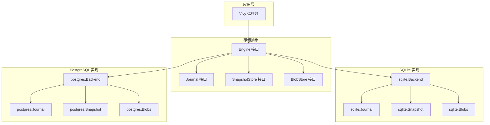
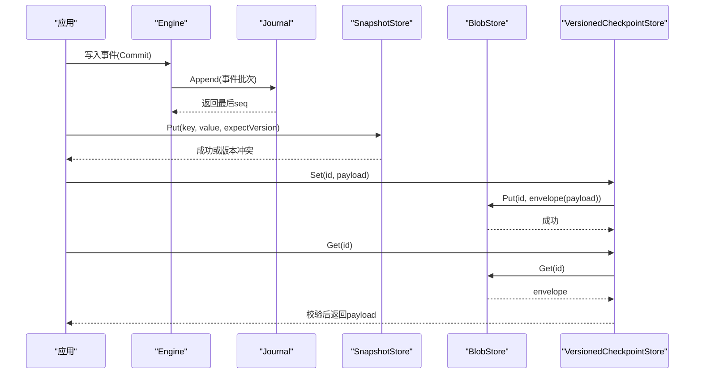
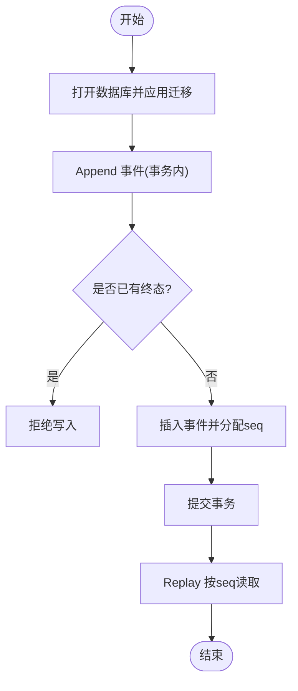
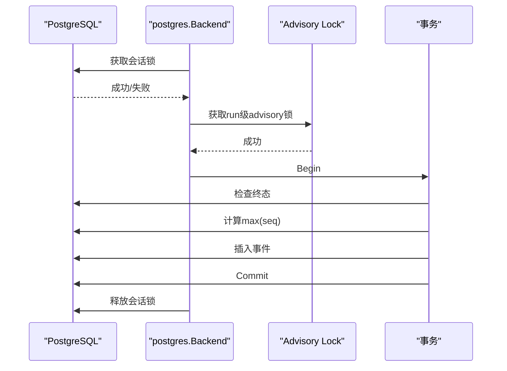
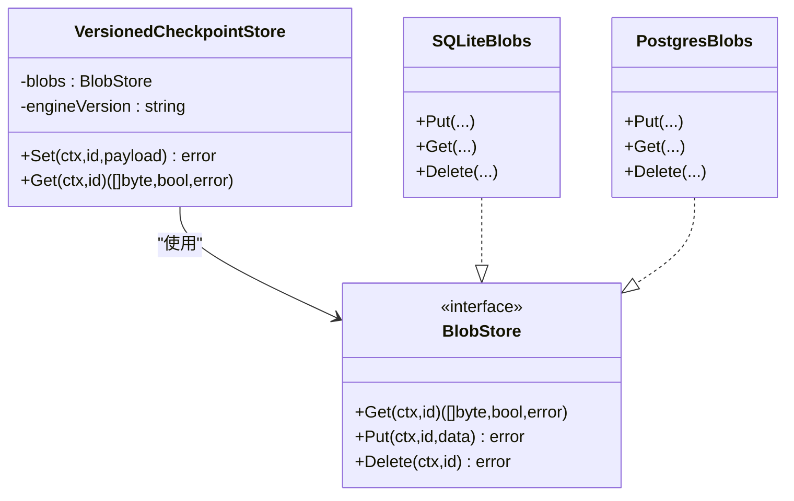
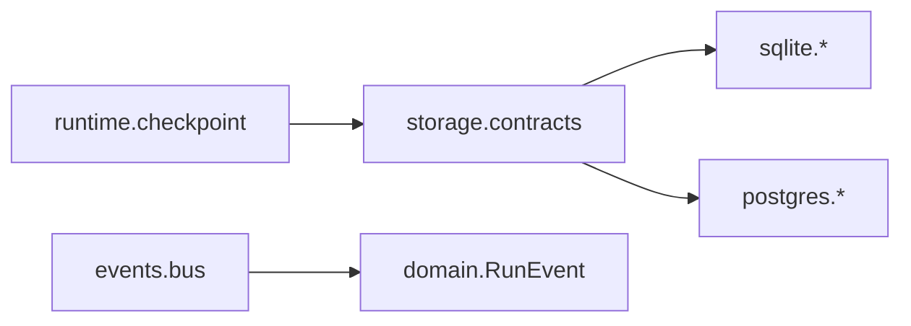

# 备份与恢复

<cite>
**本文引用的文件**
- [sqlite.go](file://internal/storage/sqlite/sqlite.go)
- [journal.go](file://internal/storage/sqlite/journal.go)
- [snapshot.go](file://internal/storage/sqlite/snapshot.go)
- [blob.go](file://internal/storage/sqlite/blob.go)
- [postgres.go](file://internal/storage/postgres/postgres.go)
- [journal.go](file://internal/storage/postgres/journal.go)
- [snapshot.go](file://internal/storage/postgres/snapshot.go)
- [blob.go](file://internal/storage/postgres/blob.go)
- [contracts.go](file://internal/storage/contracts.go)
- [checkpoint.go](file://internal/runtime/checkpoint.go)
- [bus.go](file://internal/events/bus.go)
- [config.example.yaml](file://config.example.yaml)
- [config.postgres.yaml](file://docker/config.postgres.yaml)
</cite>

## 目录
1. [简介](#简介)
2. [项目结构](#项目结构)
3. [核心组件](#核心组件)
4. [架构总览](#架构总览)
5. [详细组件分析](#详细组件分析)
6. [依赖关系分析](#依赖关系分析)
7. [性能考虑](#性能考虑)
8. [故障排查指南](#故障排查指南)
9. [结论](#结论)
10. [附录](#附录)

## 简介
本指南面向 Vivy 运行时（vivy.exe）的备份与恢复实践，覆盖 SQLite 与 PostgreSQL 两种存储后端。内容包含：
- 热备份、冷备份、增量备份策略与适用场景
- 事件溯源数据的备份机制：事件日志、检查点快照、会话状态持久化
- 灾难恢复流程：数据一致性验证、版本兼容性检查、回滚策略
- 自动化备份脚本、存储位置管理、备份验证测试
- 数据迁移与升级最佳实践

Vivy 默认使用 SQLite 作为单进程 Journal；PostgreSQL 为可选服务端后端，具备实例租约与锁机制，适合多进程部署。事件以追加式顺序写入，检查点通过带版本信封的 Blob 存储，确保跨版本读取安全。

## 项目结构
Vivy 的存储抽象位于 internal/storage，提供统一的 Engine、Journal、SnapshotStore、BlobStore 等接口；SQLite 与 PostgreSQL 分别实现这些接口。运行时 checkpoint 封装在 internal/runtime/checkpoint.go，事件总线在 internal/events/bus.go。配置项在 config.example.yaml 与 docker/config.postgres.yaml。

图表来源
- [contracts.go:252-273](file://internal/storage/contracts.go#L252-L273)
- [sqlite.go:60-88](file://internal/storage/sqlite/sqlite.go#L60-L88)
- [postgres.go:30-44](file://internal/storage/postgres/postgres.go#L30-L44)

章节来源
- [contracts.go:252-273](file://internal/storage/contracts.go#L252-L273)
- [sqlite.go:60-88](file://internal/storage/sqlite/sqlite.go#L60-L88)
- [postgres.go:30-44](file://internal/storage/postgres/postgres.go#L30-L44)

## 核心组件
- 事件日志（Journal）：追加式、有序、严格保证每个 Run 至多一个终态事件。SQLite 与 PostgreSQL 均通过事务原子写入并分配连续 seq。
- 快照存储（SnapshotStore）：键值型一致状态，支持乐观并发控制（版本号）。
- 二进制对象存储（BlobStore）：按 id 存储不透明 blob（如 Eino 检查点），采用“代次”追加与指针翻转，避免原地修改。
- 检查点封装（VersionedCheckpointStore）：在 eino 检查点外包裹引擎版本与校验和，读时校验失败即拒绝加载。
- 事件总线（Bus）：将持久化的 RunEvent 广播给在线订阅者；慢消费者会被丢弃，后续从 Journal 重放。

章节来源
- [journal.go:14-75](file://internal/storage/sqlite/journal.go#L14-L75)
- [journal.go:14-79](file://internal/storage/postgres/journal.go#L14-L79)
- [snapshot.go:18-70](file://internal/storage/sqlite/snapshot.go#L18-L70)
- [snapshot.go:18-81](file://internal/storage/postgres/snapshot.go#L18-L81)
- [blob.go:18-53](file://internal/storage/sqlite/blob.go#L18-L53)
- [blob.go:18-53](file://internal/storage/postgres/blob.go#L18-L53)
- [checkpoint.go:31-97](file://internal/runtime/checkpoint.go#L31-L97)
- [bus.go:10-75](file://internal/events/bus.go#L10-L75)

## 架构总览
Vivy 的事件溯源与状态持久化由存储抽象统一暴露。SQLite 用于单机快速启动与开发；PostgreSQL 用于服务器端多进程部署，具备实例租约与行级锁保护。检查点通过 BlobStore 的代次追加与指针翻转实现不可变历史，配合 VersionedCheckpointStore 的版本与校验和校验，保障跨版本安全。

图表来源
- [journal.go:14-75](file://internal/storage/sqlite/journal.go#L14-L75)
- [snapshot.go:34-70](file://internal/storage/sqlite/snapshot.go#L34-L70)
- [blob.go:18-53](file://internal/storage/sqlite/blob.go#L18-L53)
- [checkpoint.go:64-97](file://internal/runtime/checkpoint.go#L64-L97)

## 详细组件分析

### SQLite 存储与备份要点
- 单写者模型：SQLite 后端设置最大连接数为 1，避免并发争用，简化 WAL 与锁定问题。
- 迁移系统：启动时按序执行 schema_migrations，失败则中止启动。
- 事件日志：Append 在事务内完成，校验终态约束并分配连续 seq；Replay 按 seq 顺序流式读取。
- 快照存储：Get/Put 基于版本号进行乐观并发控制。
- 检查点 Blob：Put 插入新代次并原子翻转指针；Get 通过 joins 获取当前代次；Delete 同时清理指针与所有代次。
- 检查点清理钩子：提供 DropCheckpointPointer、CountCheckpointGenerations、DeleteCheckpointGenerations 用于崩溃形状处理。

图表来源
- [sqlite.go:38-55](file://internal/storage/sqlite/sqlite.go#L38-L55)
- [journal.go:14-75](file://internal/storage/sqlite/journal.go#L14-L75)

章节来源
- [sqlite.go:38-55](file://internal/storage/sqlite/sqlite.go#L38-L55)
- [sqlite.go:109-147](file://internal/storage/sqlite/sqlite.go#L109-L147)
- [journal.go:14-75](file://internal/storage/sqlite/journal.go#L14-L75)
- [snapshot.go:34-70](file://internal/storage/sqlite/snapshot.go#L34-L70)
- [blob.go:18-53](file://internal/storage/sqlite/blob.go#L18-L53)
- [sqlite.go:90-107](file://internal/storage/sqlite/sqlite.go#L90-L107)

### PostgreSQL 存储与备份要点
- 实例租约：Open 时尝试获取 organism 租约，若已被持有则返回错误；后台心跳续租，丢失则 fence。
- 会话锁：使用 advisory lock 保证同一时刻只有一个进程对数据库进行操作。
- 迁移系统：一次性创建完整 schema 并记录版本。
- 事件日志：Append 使用事务与 run 级 advisory lock 保证串行写入；Replay 同 SQLite。
- 快照存储：Put 使用 UPDATE ... WHERE version = ? 实现乐观并发控制。
- 检查点 Blob：与 SQLite 一致的代次追加与指针翻转逻辑。
- 检查点清理钩子：与 SQLite 相同的清理接口。

图表来源
- [postgres.go:46-111](file://internal/storage/postgres/postgres.go#L46-L111)
- [postgres.go:168-186](file://internal/storage/postgres/postgres.go#L168-L186)
- [journal.go:14-79](file://internal/storage/postgres/journal.go#L14-L79)

章节来源
- [postgres.go:46-111](file://internal/storage/postgres/postgres.go#L46-L111)
- [postgres.go:133-166](file://internal/storage/postgres/postgres.go#L133-L166)
- [journal.go:14-79](file://internal/storage/postgres/journal.go#L14-L79)
- [snapshot.go:34-81](file://internal/storage/postgres/snapshot.go#L34-L81)
- [blob.go:18-53](file://internal/storage/postgres/blob.go#L18-L53)
- [postgres.go:228-268](file://internal/storage/postgres/postgres.go#L228-L268)

### 事件溯源与检查点
- 事件日志：Journal 是单一事实源，事件追加且有序；终端事件唯一性由存储层强制。
- 检查点：VersionedCheckpointStore 将 eino 检查点包装为信封（含引擎版本与 SHA256 校验），写入 BlobStore；读取时校验版本与校验和，失败即拒绝。
- 事件总线：将持久化事件广播给在线订阅者；慢消费者被丢弃，需从 Journal 重放。

图表来源
- [checkpoint.go:31-97](file://internal/runtime/checkpoint.go#L31-L97)
- [blob.go:18-53](file://internal/storage/sqlite/blob.go#L18-L53)
- [blob.go:18-53](file://internal/storage/postgres/blob.go#L18-L53)

章节来源
- [checkpoint.go:31-97](file://internal/runtime/checkpoint.go#L31-L97)
- [bus.go:10-75](file://internal/events/bus.go#L10-L75)

## 依赖关系分析
- 存储抽象（storage）定义 Engine、Journal、SnapshotStore、BlobStore 等接口，SQLite 与 PostgreSQL 各自实现。
- 运行时 checkpoint 依赖 BlobStore 与引擎版本信息，确保检查点兼容性与完整性。
- 事件总线依赖 domain.RunEvent，仅做优化分发，不拥有历史。

图表来源
- [contracts.go:252-273](file://internal/storage/contracts.go#L252-L273)
- [checkpoint.go:31-97](file://internal/runtime/checkpoint.go#L31-L97)
- [bus.go:10-75](file://internal/events/bus.go#L10-L75)

章节来源
- [contracts.go:252-273](file://internal/storage/contracts.go#L252-L273)
- [checkpoint.go:31-97](file://internal/runtime/checkpoint.go#L31-L97)
- [bus.go:10-75](file://internal/events/bus.go#L10-L75)

## 性能考虑
- SQLite 单写者模型减少锁竞争，适合单机与轻量部署；WAL 与锁定细节由后端隐藏。
- PostgreSQL 使用 advisory lock 与事务保证高并发下的正确性；心跳续租防止僵尸实例。
- 事件追加与 replay 基于 seq 索引，适合高效重放。
- 检查点代次追加与指针翻转避免大对象原地修改，提升写入吞吐与一致性。

[本节为通用指导，不直接分析具体文件]

## 故障排查指南
- 运行已关闭：当 Run 已有终态事件时，再次 Append 会返回特定错误；检查事件序列与终态约束。
- 版本冲突：SnapshotStore.Put 在期望版本不匹配时返回冲突错误；重试或重新读取最新快照。
- 租约丢失：PostgreSQL 心跳失败会导致 fence，停止工作；检查数据库连接与租约续期。
- 检查点损坏或版本不匹配：读取检查点时若校验失败或引擎版本不一致，将拒绝加载；需重建检查点或升级/降级到兼容版本。
- 事件订阅者掉线：Bus 会丢弃落后订阅者；需从 Journal 重放恢复。

章节来源
- [journal.go:14-75](file://internal/storage/sqlite/journal.go#L14-L75)
- [snapshot.go:34-70](file://internal/storage/sqlite/snapshot.go#L34-L70)
- [postgres.go:192-220](file://internal/storage/postgres/postgres.go#L192-L220)
- [checkpoint.go:17-97](file://internal/runtime/checkpoint.go#L17-L97)
- [bus.go:42-75](file://internal/events/bus.go#L42-L75)

## 结论
Vivy 的备份与恢复围绕事件溯源与检查点展开：事件日志提供不可变历史，检查点提供快速恢复点，快照存储提供一致状态。SQLite 适合单机与快速迭代，PostgreSQL 适合多进程与服务端部署。通过严格的版本与校验和机制，确保跨版本恢复的安全性与一致性。

[本节为总结，不直接分析具体文件]

## 附录

### 备份策略与实践

#### 冷备份
- 适用场景：停机窗口可接受，要求强一致性。
- 步骤：
  - 停止 Vivy 进程。
  - 复制 SQLite 数据库文件或 PostgreSQL 数据目录/逻辑导出。
  - 验证备份完整性（例如校验和或导入测试）。
- 注意事项：
  - SQLite 单写者模型下，停服后拷贝即可保证一致性。
  - PostgreSQL 可使用逻辑备份工具（如 pg_dump）或物理备份工具（如 pg_basebackup），确保事务一致。

#### 热备份
- 适用场景：服务不能停机。
- SQLite：
  - 由于单写者模型，可在运行中拷贝数据库文件；但建议结合 WAL 模式与只读副本策略（外部工具）以获得更可靠的一致性视图。
- PostgreSQL：
  - 使用 pg_basebackup 或逻辑备份工具在不中断服务的情况下获取一致快照。
  - 注意租约与心跳：备份期间不应影响心跳续租。

#### 增量备份
- 事件日志：
  - 基于 seq 游标增量重放：记录上次备份时的最大 seq，下次仅备份新增事件。
  - 可通过定期任务扫描 Journal 并归档增量事件。
- 检查点：
  - 检查点代次追加与指针翻转天然支持增量：仅备份新增代次与指针变更。
  - 建议周期性生成检查点快照，作为恢复锚点。
- 快照存储：
  - 基于版本号差异进行增量备份：记录 key 的最新版本，下次仅备份版本变化的键。

#### 自动化备份脚本
- 建议流程：
  - 定时触发备份任务。
  - 选择备份类型（全量/增量）。
  - 执行备份操作（文件系统拷贝或数据库导出）。
  - 生成元数据（时间戳、版本、校验和、备份类型）。
  - 上传至远程存储（对象存储或 NAS）。
  - 执行备份验证（下载并校验、导入测试）。
- 关键指标：
  - RPO（恢复点目标）：根据业务容忍度决定备份频率。
  - RTO（恢复时间目标）：评估恢复流程耗时。

#### 存储位置管理
- 本地存储：
  - SQLite 默认路径在配置中指定；PostgreSQL 数据目录由数据库管理。
- 远程存储：
  - 建议使用对象存储（如 S3、OSS）或网络共享，确保异地容灾。
- 生命周期管理：
  - 设定保留策略（如保留最近 N 份全量与增量）。
  - 定期清理过期备份。

#### 备份验证测试
- 校验和验证：对比备份文件的哈希值。
- 导入测试：在隔离环境中导入备份并启动服务，验证数据一致性。
- 恢复演练：定期执行恢复演练，确保流程可行。

### 灾难恢复流程

#### 数据一致性验证
- 事件日志：
  - 检查事件序列连续性，确认无缺失或重复。
  - 验证终态事件唯一性。
- 检查点：
  - 读取检查点并校验引擎版本与校验和。
  - 若校验失败，拒绝恢复并告警。
- 快照存储：
  - 验证键值对的版本一致性。

#### 版本兼容性检查
- 引擎版本：
  - 检查点信封中包含引擎版本，恢复时需确保与当前构建版本一致。
- 数据库迁移：
  - 启动时自动应用迁移；若迁移失败，中止启动并告警。

#### 回滚策略
- 事件日志：
  - 事件不可变，无法删除；回滚需通过反向事件或恢复到更早的检查点。
- 检查点：
  - 回滚到上一个有效检查点。
- 快照存储：
  - 回滚到上一个版本。

### 数据迁移与升级最佳实践

#### 迁移策略
- 向后兼容：
  - 新增字段应提供默认值，确保旧数据可读。
- 向前兼容：
  - 新版本应能读取旧格式数据。
- 迁移脚本：
  - 按序执行迁移，失败则中止并回滚。

#### 升级流程
- 预检查：
  - 检查数据库版本与迁移状态。
- 备份：
  - 升级前执行全量备份。
- 执行迁移：
  - 启动新版本，自动应用迁移。
- 验证：
  - 检查数据完整性与服务可用性。

#### 回滚方案
- 若升级失败，使用备份恢复至升级前状态。
- 记录升级日志与错误信息，便于问题定位。

### 配置参考
- SQLite 配置：
  - 默认后端为 sqlite，数据目录与数据库路径在配置中指定。
- PostgreSQL 配置：
  - 通过环境变量提供 DSN，避免硬编码敏感信息。
  - 多进程部署时，仅允许一个实例持有租约。

章节来源
- [config.example.yaml:13-22](file://config.example.yaml#L13-L22)
- [config.postgres.yaml:8-12](file://docker/config.postgres.yaml#L8-L12)