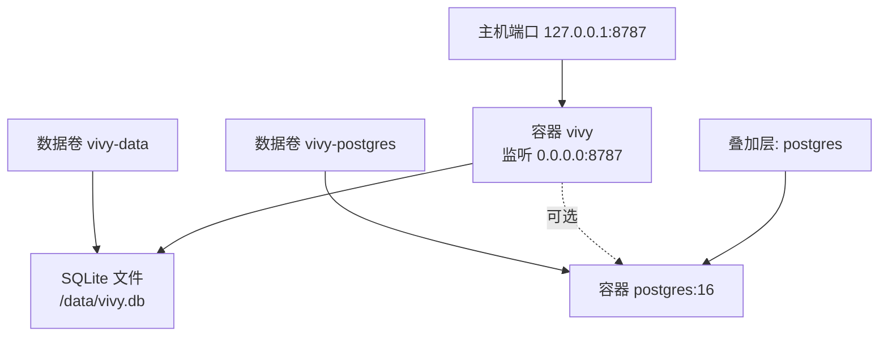
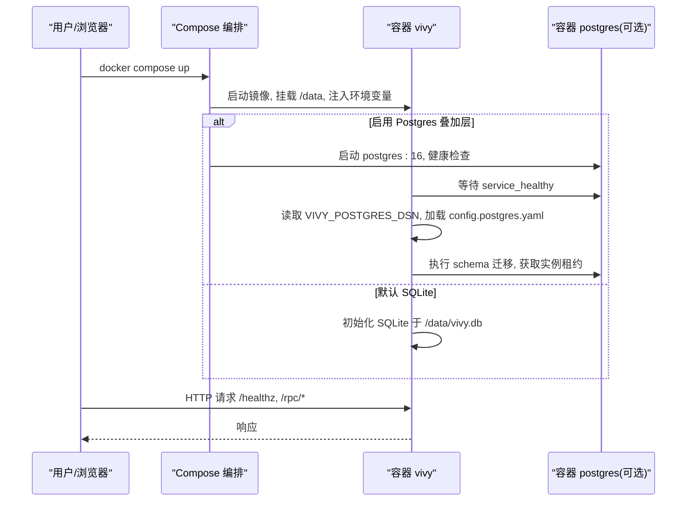
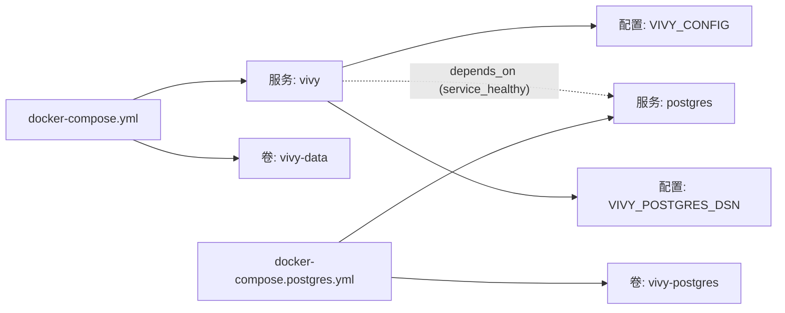

# Compose编排配置

<cite>
**本文引用的文件**
- [docker-compose.yml](file://docker-compose.yml)
- [docker-compose.postgres.yml](file://docker-compose.postgres.yml)
- [Dockerfile](file://Dockerfile)
- [docker/config.yaml](file://docker/config.yaml)
- [docker/config.postgres.yaml](file://docker/config.postgres.yaml)
- [config.example.yaml](file://config.example.yaml)
- [config.dev.yaml](file://config.dev.yaml)
- [internal/storage/postgres/db.go](file://internal/storage/postgres/db.go)
- [internal/storage/postgres/schema.go](file://internal/storage/postgres/schema.go)
- [internal/storage/postgres/postgres.go](file://internal/storage/postgres/postgres.go)
</cite>

## 目录
1. [简介](#简介)
2. [项目结构](#项目结构)
3. [核心组件](#核心组件)
4. [架构总览](#架构总览)
5. [详细组件分析](#详细组件分析)
6. [依赖关系分析](#依赖关系分析)
7. [性能与资源限制](#性能与资源限制)
8. [故障排查指南](#故障排查指南)
9. [结论](#结论)
10. [附录](#附录)

## 简介
本文件面向使用 Docker Compose 部署 Vivy 的读者，系统说明基础 Compose 文件的服务定义、网络、数据卷与环境变量；深入解释 PostgreSQL 扩展叠加层的数据库初始化、连接池、备份策略；覆盖服务间通信、健康检查、资源限制；并对比开发环境与生产环境的差异，提供常见问题的定位与修复建议。

## 项目结构
Vivy 以单容器镜像运行，默认使用 SQLite 作为 Journal；PostgreSQL 通过 Compose 叠加层启用，仅作为可选后端。Compose 文件将应用暴露到本地回环地址，避免将无鉴权的 /rpc/bootstrap 暴露到公网。

图表来源
- [docker-compose.yml:6-32](file://docker-compose.yml#L6-L32)
- [docker-compose.postgres.yml:4-34](file://docker-compose.postgres.yml#L4-L34)
- [Dockerfile:31-47](file://Dockerfile#L31-L47)

章节来源
- [docker-compose.yml:1-33](file://docker-compose.yml#L1-L33)
- [docker-compose.postgres.yml:1-35](file://docker-compose.postgres.yml#L1-L35)
- [Dockerfile:1-48](file://Dockerfile#L1-L48)

## 核心组件
- 应用服务 vivy：构建镜像、绑定端口、挂载数据卷、注入环境变量、健康检查。
- 数据库服务 postgres（可选）：创建独立数据卷、健康检查、被 vivy 依赖。
- 配置文件：
  - 容器内默认配置：docker/config.yaml（SQLite 模式）。
  - PostgreSQL 叠加配置：docker/config.postgres.yaml（通过 VIVY_CONFIG 切换）。
  - 示例配置：config.example.yaml（完整字段参考）。
  - 开发覆盖：config.dev.yaml（开启 mock 模式）。

章节来源
- [docker/config.yaml:1-19](file://docker/config.yaml#L1-L19)
- [docker/config.postgres.yaml:1-19](file://docker/config.postgres.yaml#L1-L19)
- [config.example.yaml:1-136](file://config.example.yaml#L1-L136)
- [config.dev.yaml:1-6](file://config.dev.yaml#L1-L6)

## 架构总览
Vivy 进程在容器内启动，默认监听 0.0.0.0:8787，并通过宿主 127.0.0.1:8787 对外暴露。存储后端默认为 SQLite，持久化于 /data 卷；启用 PostgreSQL 时，通过环境变量注入 DSN，并在启动时完成 schema 迁移与实例租约获取。

图表来源
- [docker-compose.yml:6-32](file://docker-compose.yml#L6-L32)
- [docker-compose.postgres.yml:4-34](file://docker-compose.postgres.yml#L4-L34)
- [internal/storage/postgres/postgres.go:59-110](file://internal/storage/postgres/postgres.go#L59-L110)

## 详细组件分析

### 基础服务：vivy
- 构建参数：GOPROXY、NPM_REGISTRY 用于加速依赖下载。
- 端口映射：仅绑定 127.0.0.1:8787，避免暴露无鉴权接口。
- 数据卷：vivy-data 挂载至 /data，包含 SQLite 文件与工作区、技能包等。
- 环境变量：TZ、OPENAI_API_KEY、ANTHROPIC_API_KEY。
- 健康检查：通过 wget 访问 /healthz。

章节来源
- [docker-compose.yml:6-32](file://docker-compose.yml#L6-L32)
- [Dockerfile:31-47](file://Dockerfile#L31-L47)

### 可选服务：postgres
- 镜像：postgres:16，容器名 vivy-postgres。
- 环境变量：POSTGRES_USER/POSTGRES_PASSWORD/POSTGRES_DB。
- 数据卷：vivy-postgres 持久化数据库文件。
- 健康检查：pg_isready。
- 依赖关系：vivy 依赖其健康状态。

章节来源
- [docker-compose.postgres.yml:4-34](file://docker-compose.postgres.yml#L4-L34)

### 配置体系与切换
- 默认容器配置：docker/config.yaml，后端 sqlite，路径 /data/vivy.db，工作区与技能根目录位于 /data。
- PostgreSQL 叠加配置：docker/config.postgres.yaml，后端 postgres，DSN 来自环境变量 VIVY_POSTGRES_DSN。
- 运行时选择：通过 VIVY_CONFIG 指向不同配置文件；或通过环境变量覆盖。
- 示例与开发覆盖：config.example.yaml 提供完整字段；config.dev.yaml 开启 mock 模式用于离线开发。

章节来源
- [docker/config.yaml:1-19](file://docker/config.yaml#L1-L19)
- [docker/config.postgres.yaml:1-19](file://docker/config.postgres.yaml#L1-L19)
- [config.example.yaml:1-136](file://config.example.yaml#L1-L136)
- [config.dev.yaml:1-6](file://config.dev.yaml#L1-L6)

### PostgreSQL 扩展：初始化、连接池、备份
- 初始化脚本：PostgreSQL 启动后由应用侧完成 schema 迁移，无需外部 SQL 脚本；迁移逻辑在应用启动阶段执行。
- 连接池参数：应用侧设置最大打开连接数；可通过环境变量或配置调整（当前实现固定为默认值）。
- 备份策略：建议使用 pg_basebackup 或云厂商备份方案；结合定时任务与异地存储。

章节来源
- [internal/storage/postgres/postgres.go:59-110](file://internal/storage/postgres/postgres.go#L59-L110)
- [internal/storage/postgres/postgres.go:113-122](file://internal/storage/postgres/postgres.go#L113-L122)
- [internal/storage/postgres/schema.go:1-200](file://internal/storage/postgres/schema.go#L1-L200)

### 服务间通信与健康检查
- 网络：Compose 自动创建共享网络；服务通过服务名解析（如 postgres）。
- 依赖：vivy 通过 depends_on 与 condition: service_healthy 确保数据库就绪后再启动。
- 健康检查：
  - vivy：HTTP /healthz。
  - postgres：pg_isready。

章节来源
- [docker-compose.yml:24-28](file://docker-compose.yml#L24-L28)
- [docker-compose.postgres.yml:15-20](file://docker-compose.postgres.yml#L15-L20)
- [docker-compose.postgres.yml:22-25](file://docker-compose.postgres.yml#L22-L25)

### 资源限制与安全边界
- 端口安全：仅绑定 127.0.0.1，避免暴露无鉴权入口。
- 密钥管理：Provider 密钥通过环境变量注入，不写入配置文件；应用启动时按 env_key 读取。
- 沙箱与工具策略：通过配置控制工作区、技能目录、工具白名单与审批策略。

章节来源
- [docker-compose.yml:16-17](file://docker-compose.yml#L16-L17)
- [config.example.yaml:23-35](file://config.example.yaml#L23-L35)
- [config.example.yaml:37-105](file://config.example.yaml#L37-L105)

## 依赖关系分析

图表来源
- [docker-compose.yml:6-32](file://docker-compose.yml#L6-L32)
- [docker-compose.postgres.yml:4-34](file://docker-compose.postgres.yml#L4-L34)

章节来源
- [docker-compose.yml:1-33](file://docker-compose.yml#L1-L33)
- [docker-compose.postgres.yml:1-35](file://docker-compose.postgres.yml#L1-L35)

## 性能与资源限制
- 连接池：PostgreSQL 后端使用默认最大连接数；如需调优可在应用侧修改（当前实现固定）。
- 事件与上下文限制：通过配置项限制事件负载大小、历史消息数量、模型调用次数等，防止资源滥用。
- 流式缓冲：stream_buffer 控制流式分块缓冲上限。
- 建议：在高并发场景下评估日志落盘、快照频率与清理策略，避免磁盘 I/O 瓶颈。

章节来源
- [internal/storage/postgres/postgres.go:78-79](file://internal/storage/postgres/postgres.go#L78-L79)
- [config.example.yaml:43-55](file://config.example.yaml#L43-L55)

## 故障排查指南
- 端口冲突
  - 现象：容器无法启动或健康检查失败。
  - 排查：确认宿主机 127.0.0.1:8787 未被占用；检查 Compose 端口映射。
  - 解决：修改映射端口或释放占用进程。
  - 参考：[docker-compose.yml:16-17](file://docker-compose.yml#L16-L17)

- 权限问题
  - 现象：SQLite 文件无法读写或工作区目录无权限。
  - 排查：检查 /data 卷挂载权限；确认容器内进程对 /data 有读写权限。
  - 解决：调整卷权限或重新创建卷。
  - 参考：[docker/config.yaml:9-18](file://docker/config.yaml#L9-L18)

- 网络连接
  - 现象：PostgreSQL 不可用或迁移失败。
  - 排查：验证 postgres 服务健康；检查 VIVY_POSTGRES_DSN 格式与凭据；确认网络连通。
  - 解决：修正 DSN、重启服务或调整网络策略。
  - 参考：[docker-compose.postgres.yml:22-31](file://docker-compose.postgres.yml#L22-L31)
  - 参考：[internal/storage/postgres/postgres.go:59-110](file://internal/storage/postgres/postgres.go#L59-L110)

- 健康检查失败
  - 现象：/healthz 返回非 200。
  - 排查：查看容器日志；确认依赖服务就绪；检查配置是否生效。
  - 解决：修复配置或服务依赖。
  - 参考：[docker-compose.yml:24-28](file://docker-compose.yml#L24-L28)

- 密钥泄露风险
  - 现象：配置文件中出现明文密钥。
  - 排查：确保 Provider 密钥通过环境变量注入，不在配置中硬编码。
  - 解决：移除配置中的密钥，改用环境变量。
  - 参考：[config.example.yaml:23-35](file://config.example.yaml#L23-L35)

## 结论
本编排方案以最小化依赖提供开箱即用的 Vivy 运行环境：默认 SQLite 满足单机与开发需求；PostgreSQL 叠加层提供可扩展的持久化能力。通过严格的环境变量与配置分离、健康检查与依赖管理，保障服务稳定启动与可观测性。生产环境应结合备份策略、监控告警与资源限制进行加固。

## 附录
- 开发环境与生产环境差异
  - 开发环境
    - 使用 config.dev.yaml 开启 mock 模式，便于离线调试。
    - 默认 SQLite，快速启动与迭代。
    - 端口仅绑定 127.0.0.1，便于本地访问。
  - 生产环境
    - 启用 PostgreSQL 叠加层，提升并发与可靠性。
    - 配置合理的健康检查、日志与备份策略。
    - 严格限制网络与权限，遵循密钥不入配置的原则。

- 常用命令
  - 启动默认 SQLite：docker compose up --build
  - 启用 PostgreSQL：docker compose -f docker-compose.yml -f docker-compose.postgres.yml up --build

章节来源
- [config.dev.yaml:1-6](file://config.dev.yaml#L1-L6)
- [docker-compose.postgres.yml:1-3](file://docker-compose.postgres.yml#L1-L3)