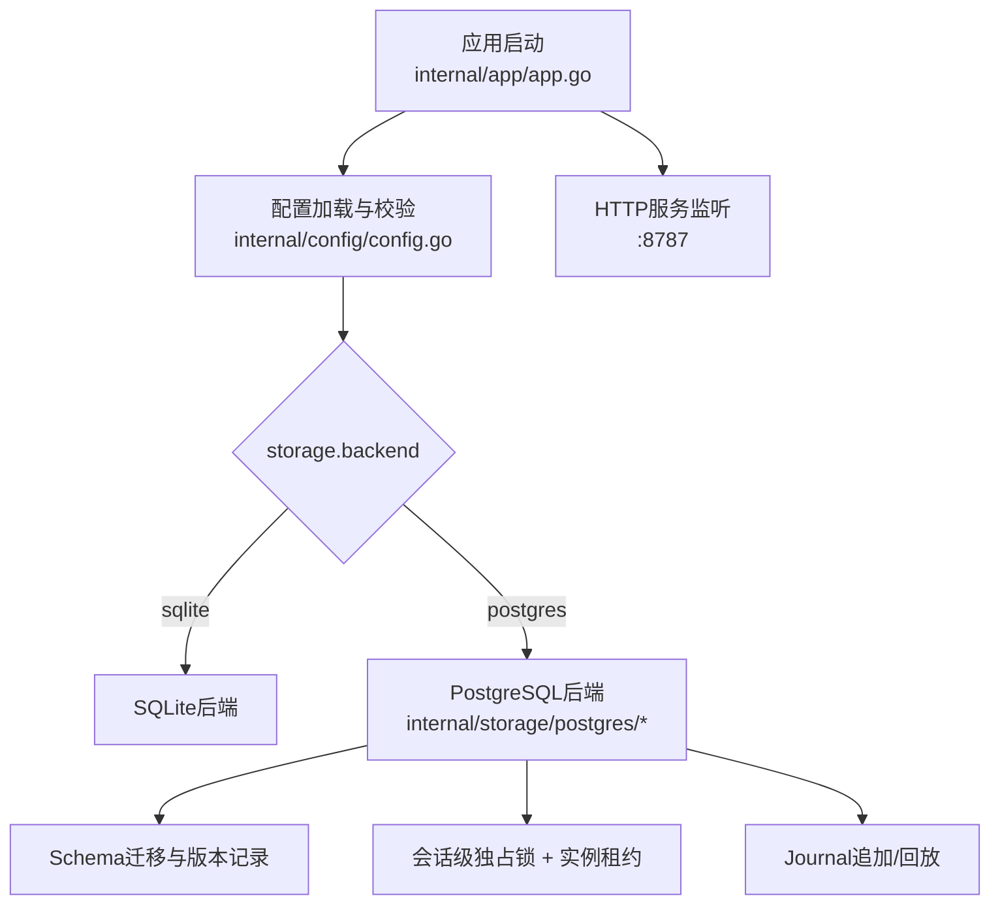
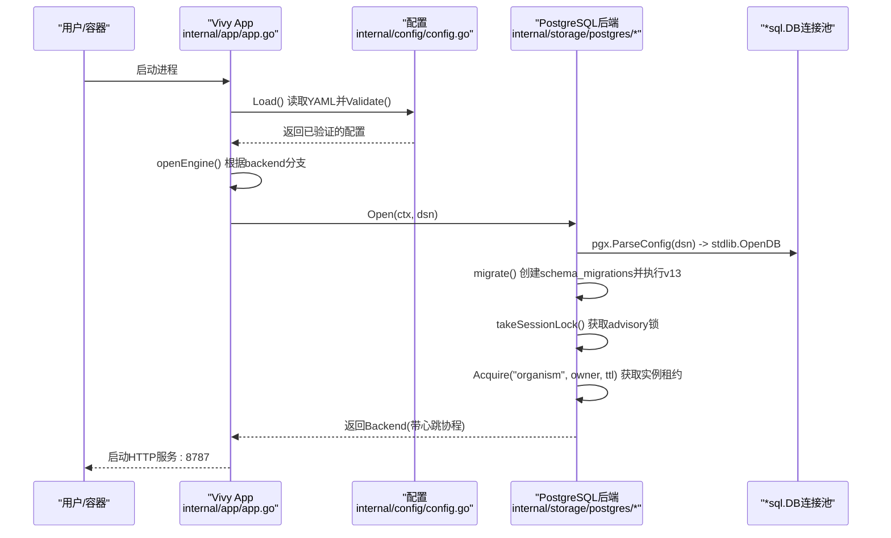
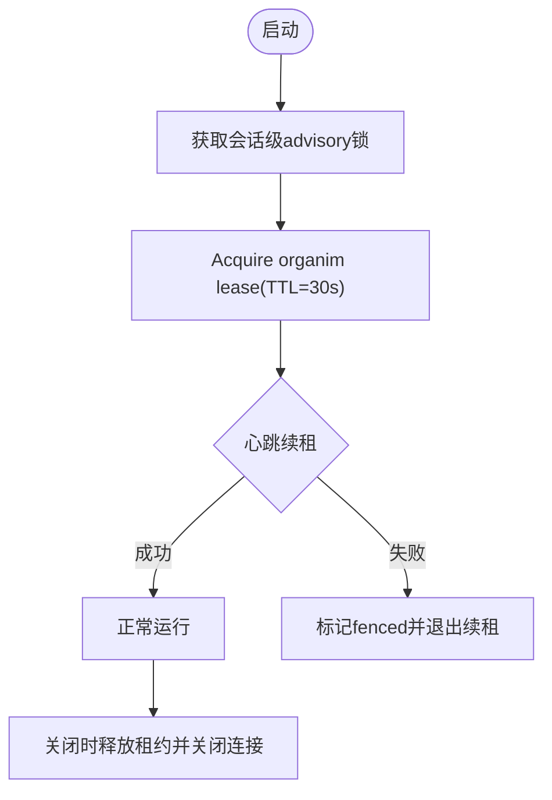
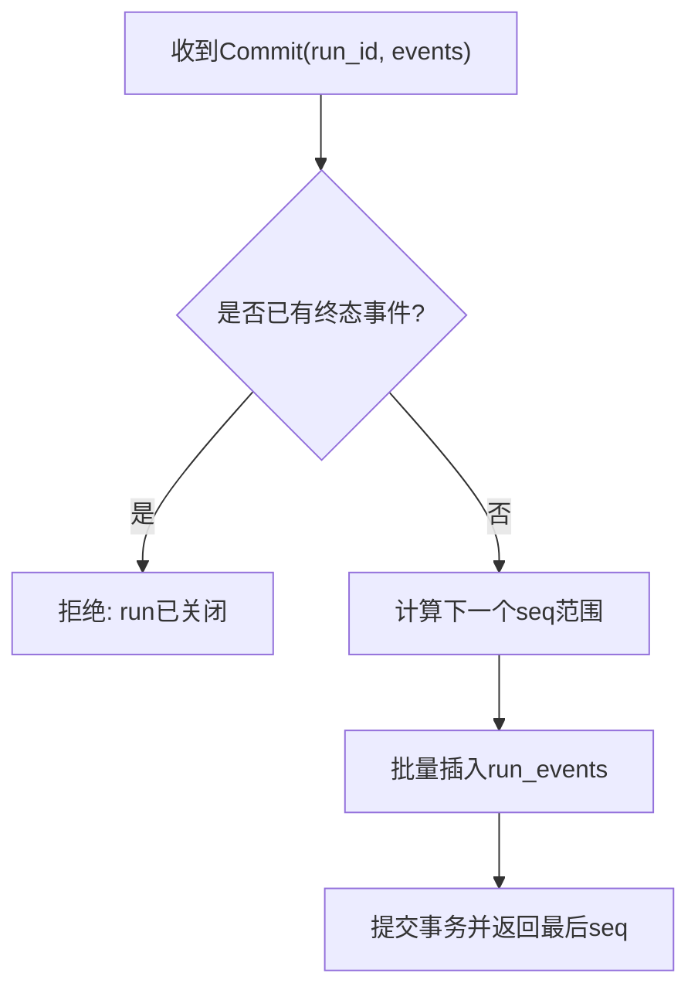
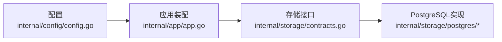

# PostgreSQL扩展配置

<cite>
**本文引用的文件**
- [docker/config.postgres.yaml](file://docker/config.postgres.yaml)
- [docker/config.yaml](file://docker/config.yaml)
- [config.example.yaml](file://config.example.yaml)
- [internal/config/config.go](file://internal/config/config.go)
- [internal/app/app.go](file://internal/app/app.go)
- [internal/storage/postgres/postgres.go](file://internal/storage/postgres/postgres.go)
- [internal/storage/postgres/db.go](file://internal/storage/postgres/db.go)
- [internal/storage/postgres/schema.go](file://internal/storage/postgres/schema.go)
- [internal/storage/postgres/journal.go](file://internal/storage/postgres/journal.go)
- [internal/storage/postgres/lease.go](file://internal/storage/postgres/lease.go)
- [internal/storage/contracts.go](file://internal/storage/contracts.go)
- [docker-compose.postgres.yml](file://docker-compose.postgres.yml)
</cite>

## 目录
1. [简介](#简介)
2. [项目结构](#项目结构)
3. [核心组件](#核心组件)
4. [架构总览](#架构总览)
5. [详细组件分析](#详细组件分析)
6. [依赖关系分析](#依赖关系分析)
7. [性能与容量规划](#性能与容量规划)
8. [故障排查指南](#故障排查指南)
9. [结论](#结论)
10. [附录：生产部署清单](#附录生产部署清单)

## 简介
本文件面向在生产环境中使用PostgreSQL作为Vivy主服务的Journal（事件日志）存储引擎的运维与开发读者。内容覆盖：
- PostgreSQL服务启动与连接参数、性能调优选项
- 数据库初始化流程、用户权限管理、备份恢复策略
- 与Vivy主服务的集成配置（连接字符串、认证方式、连接池设置）
- 为什么选择PostgreSQL作为Journal引擎的优势与适用场景
- 生产环境高可用、监控告警、容量规划建议
- 常见问题诊断与解决（连接超时、权限拒绝、磁盘空间不足等）

## 项目结构
本项目默认使用SQLite作为单进程Journal，同时提供可选的PostgreSQL后端。启用PostgreSQL后，Vivy通过环境变量注入DSN，并在启动时完成Schema迁移、实例租约获取与心跳续期。

图表来源
- [internal/app/app.go:60-120](file://internal/app/app.go#L60-L120)
- [internal/config/config.go:316-362](file://internal/config/config.go#L316-L362)
- [internal/storage/postgres/postgres.go:46-111](file://internal/storage/postgres/postgres.go#L46-L111)

章节来源
- [internal/app/app.go:60-120](file://internal/app/app.go#L60-L120)
- [internal/config/config.go:316-362](file://internal/config/config.go#L316-L362)
- [internal/storage/postgres/postgres.go:46-111](file://internal/storage/postgres/postgres.go#L46-L111)

## 核心组件
- 配置层
  - storage.backend 选择 sqlite 或 postgres
  - storage.postgres.dsn_env 指定DSN所在的环境变量名（严禁在配置中写入真实DSN）
- 应用层
  - 启动时根据配置读取环境变量中的DSN并打开PostgreSQL后端
  - 执行Schema迁移、获取会话锁、获取实例租约、启动心跳续期
- 存储层
  - 基于pgx解析DSN，使用stdlib.OpenDB创建*sql.DB连接池
  - 通过PG advisory lock实现会话级独占；通过leases表+TTL实现实例级租约
  - Journal追加保证每个run最多一个终态事件，且按seq单调递增

章节来源
- [internal/config/config.go:70-89](file://internal/config/config.go#L70-L89)
- [internal/app/app.go:430-454](file://internal/app/app.go#L430-L454)
- [internal/storage/postgres/postgres.go:113-122](file://internal/storage/postgres/postgres.go#L113-L122)
- [internal/storage/postgres/postgres.go:133-166](file://internal/storage/postgres/postgres.go#L133-L166)
- [internal/storage/postgres/postgres.go:168-186](file://internal/storage/postgres/postgres.go#L168-L186)
- [internal/storage/postgres/lease.go:9-35](file://internal/storage/postgres/lease.go#L9-L35)
- [internal/storage/postgres/journal.go:14-79](file://internal/storage/postgres/journal.go#L14-L79)

## 架构总览
下图展示了Vivy启动到使用PostgreSQL作为Journal的关键调用链与数据流。

图表来源
- [internal/app/app.go:430-454](file://internal/app/app.go#L430-L454)
- [internal/storage/postgres/postgres.go:46-111](file://internal/storage/postgres/postgres.go#L46-L111)
- [internal/storage/postgres/postgres.go:113-122](file://internal/storage/postgres/postgres.go#L113-L122)
- [internal/storage/postgres/postgres.go:133-166](file://internal/storage/postgres/postgres.go#L133-L166)
- [internal/storage/postgres/postgres.go:168-186](file://internal/storage/postgres/postgres.go#L168-L186)
- [internal/storage/postgres/lease.go:9-35](file://internal/storage/postgres/lease.go#L9-L35)

## 详细组件分析

### PostgreSQL连接与连接池
- DSN来源
  - 配置文件仅声明环境变量名（如 VIVY_POSTGRES_DSN），真实DSN由环境变量注入，避免落盘泄露
- 连接池
  - 使用pgx解析DSN，并通过stdlib.OpenDB包装为*sql.DB
  - 默认最大并发连接数固定为8（defaultMaxConns=8），可通过修改源码调整
- Schema隔离
  - 测试路径支持OpenSchema(schema)，运行时通过search_path限定schema
- 健康检查
  - 心跳协程周期性Ping锁连接，失败则标记fenced并停止续租

章节来源
- [internal/config/config.go:85-89](file://internal/config/config.go#L85-L89)
- [internal/app/app.go:430-454](file://internal/app/app.go#L430-L454)
- [internal/storage/postgres/postgres.go:20-26](file://internal/storage/postgres/postgres.go#L20-L26)
- [internal/storage/postgres/postgres.go:113-122](file://internal/storage/postgres/postgres.go#L113-L122)
- [internal/storage/postgres/postgres.go:192-220](file://internal/storage/postgres/postgres.go#L192-L220)

### 数据库初始化与Schema迁移
- 首次启动会创建schema_migrations表并记录当前版本号
- 若未记录当前版本，则在事务内一次性执行v13完整DDL
- v13包含sessions、messages、runs、run_events、approvals、snapshots、checkpoints、leases、notes、questions、skill_revisions、todos、generations、eval_runs、promotions、studio_events等表及索引

章节来源
- [internal/storage/postgres/postgres.go:133-166](file://internal/storage/postgres/postgres.go#L133-L166)
- [internal/storage/postgres/schema.go:1-200](file://internal/storage/postgres/schema.go#L1-L200)

### 实例租约与会话锁
- 会话级独占：通过pg_try_advisory_lock(current_schema()/vivy/organism)确保同一时刻只有一个进程能持有会话锁
- 实例级租约：通过leases表以key=vivy/organism、owner=主机:pid:随机串、expires_at=TTL时间戳实现；心跳每10秒续租一次，TTL为30秒
- 第二进程尝试打开同一DSN将返回“租约被占用”错误

图表来源
- [internal/storage/postgres/postgres.go:168-186](file://internal/storage/postgres/postgres.go#L168-L186)
- [internal/storage/postgres/postgres.go:192-220](file://internal/storage/postgres/postgres.go#L192-L220)
- [internal/storage/postgres/lease.go:9-35](file://internal/storage/postgres/lease.go#L9-L35)

章节来源
- [internal/storage/postgres/postgres.go:168-186](file://internal/storage/postgres/postgres.go#L168-L186)
- [internal/storage/postgres/postgres.go:192-220](file://internal/storage/postgres/postgres.go#L192-L220)
- [internal/storage/postgres/lease.go:9-35](file://internal/storage/postgres/lease.go#L9-L35)
- [internal/storage/contracts.go:25-31](file://internal/storage/contracts.go#L25-L31)

### Journal追加与回放
- Append：原子写入run_events，强制每个run最多一个终态事件；使用行级advisory锁保证并发安全
- Replay：按seq顺序回放run的事件，供事件总线重放与恢复

图表来源
- [internal/storage/postgres/journal.go:14-79](file://internal/storage/postgres/journal.go#L14-L79)

章节来源
- [internal/storage/postgres/journal.go:14-79](file://internal/storage/postgres/journal.go#L14-L79)

### 与Vivy主服务的集成
- 配置项
  - storage.backend=postgres
  - storage.postgres.dsn_env=VIVY_POSTGRES_DSN
- 环境变量
  - VIVY_POSTGRES_DSN：PostgreSQL连接字符串（含认证信息）
- 启动流程
  - app.openEngine根据backend分支调用postgres.Open
  - 成功后注册到runtime.Service，作为Journal、Runs、Messages等所有持久化能力的后端

章节来源
- [config.example.yaml:13-22](file://config.example.yaml#L13-L22)
- [internal/app/app.go:430-454](file://internal/app/app.go#L430-L454)
- [internal/storage/contracts.go:252-273](file://internal/storage/contracts.go#L252-L273)

### 容器与编排示例
- docker-compose.postgres.yml提供了PostgreSQL 16服务与Vivy服务的编排，包含健康检查、卷挂载与环境变量注入
- 推荐通过compose叠加方式启用PostgreSQL后端

章节来源
- [docker-compose.postgres.yml:1-35](file://docker-compose.postgres.yml#L1-L35)

## 依赖关系分析
- 配置依赖
  - internal/config/config.go 负责严格校验storage.backend与dsn_env格式，禁止在配置中写入真实DSN
- 应用依赖
  - internal/app/app.go 在openEngine中根据配置选择后端，并组装运行时服务
- 存储依赖
  - internal/storage/postgres/* 实现Engine接口，提供Journal、LeaseStore、Snapshot/Blob等能力
  - internal/storage/contracts.go 定义统一接口与哨兵错误

图表来源
- [internal/config/config.go:316-362](file://internal/config/config.go#L316-L362)
- [internal/app/app.go:430-454](file://internal/app/app.go#L430-L454)
- [internal/storage/contracts.go:252-273](file://internal/storage/contracts.go#L252-L273)
- [internal/storage/postgres/postgres.go:30-44](file://internal/storage/postgres/postgres.go#L30-L44)

章节来源
- [internal/config/config.go:316-362](file://internal/config/config.go#L316-L362)
- [internal/app/app.go:430-454](file://internal/app/app.go#L430-L454)
- [internal/storage/contracts.go:252-273](file://internal/storage/contracts.go#L252-L273)
- [internal/storage/postgres/postgres.go:30-44](file://internal/storage/postgres/postgres.go#L30-L44)

## 性能与容量规划
- 连接池
  - 默认最大并发连接数为8；在高并发场景可考虑增大该值以提升吞吐，但需评估PostgreSQL max_connections与资源限制
- 事务与锁
  - Journal追加对每个run使用advisory锁，避免竞写；终态事件唯一性由代码层与数据库约束共同保障
- 索引与查询
  - schema中包含run_events主键、runs父子索引、approvals/questions状态过期索引等，适合常见回放与队列查询
- 容量规划要点
  - run_events为追加型大表，需关注磁盘增长与归档策略
  - snapshots/checkpoints/blob存储较大对象，建议配合外部对象存储或定期清理
  - 合理设置PostgreSQL wal_level、max_wal_size、checkpoint_timeout等参数以匹配写入峰值

[本节为通用指导，不直接分析具体文件]

## 故障排查指南
- 连接超时/无法连接
  - 检查VIVY_POSTGRES_DSN是否正确，网络可达性与防火墙规则
  - 确认PostgreSQL服务健康（healthcheck通过）
  - 查看日志中“parse postgres DSN”“reserve postgres lock connection”相关错误
- 权限拒绝
  - 确保数据库用户具备创建表、索引、序列以及读写leases/sessions等表的权限
  - 若使用schema隔离，需确保search_path正确指向目标schema
- 租约冲突（多实例）
  - 同一DSN只允许一个进程持有organism租约；第二个进程将返回“租约被占用”
  - 检查是否存在僵尸进程未释放租约，必要时清理leases表
- 磁盘空间不足
  - run_events持续增长，需制定归档/压缩策略
  - 监控PostgreSQL数据目录与WAL目录空间使用率
- 心跳失效导致fenced
  - 心跳Ping失败会触发fenced，后续写操作返回“租约丢失”
  - 检查数据库连接稳定性与网络抖动

章节来源
- [internal/storage/postgres/postgres.go:113-122](file://internal/storage/postgres/postgres.go#L113-L122)
- [internal/storage/postgres/postgres.go:168-186](file://internal/storage/postgres/postgres.go#L168-L186)
- [internal/storage/postgres/postgres.go:192-220](file://internal/storage/postgres/postgres.go#L192-L220)
- [internal/storage/postgres/lease.go:9-35](file://internal/storage/postgres/lease.go#L9-L35)
- [internal/storage/contracts.go:25-31](file://internal/storage/contracts.go#L25-L31)

## 结论
PostgreSQL作为Vivy的Journal引擎，提供了强一致的事件追加、稳定的会话独占与实例租约机制，适合需要跨进程/跨实例共享事件日志的生产场景。通过环境变量注入DSN、严格的配置校验与自动Schema迁移，降低了运维复杂度。结合合理的连接池、索引与容量规划，可在高负载下保持稳定运行。

[本节为总结性内容，不直接分析具体文件]

## 附录：生产部署清单
- 环境与配置
  - 设置storage.backend=postgres
  - 设置storage.postgres.dsn_env=VIVY_POSTGRES_DSN
  - 通过环境变量注入VIVY_POSTGRES_DSN（包含用户名、密码、host、port、dbname、sslmode等）
- 数据库准备
  - 创建数据库与用户，授予必要权限
  - 首次启动会自动执行v13全量DDL并记录版本
- 高可用建议
  - 使用托管PostgreSQL或主从复制集群，确保连接端点稳定
  - 注意：同一时刻仅一个Vivy进程持有organism租约；如需高可用，采用主动-备模式，备节点仅在故障切换后接管
- 监控与告警
  - 监控PostgreSQL连接数、慢查询、WAL增长、磁盘使用率
  - 监控Vivy进程健康端点与健康检查
- 备份与恢复
  - 使用PostgreSQL原生备份工具（如pg_basebackup、逻辑备份）定期备份
  - 恢复后重启Vivy，将自动检测schema版本并继续运行
- 安全
  - 不在配置文件中写入DSN或密钥
  - 使用最小权限原则分配数据库用户权限

章节来源
- [config.example.yaml:13-22](file://config.example.yaml#L13-L22)
- [docker/config.postgres.yaml:1-19](file://docker/config.postgres.yaml#L1-L19)
- [docker-compose.postgres.yml:1-35](file://docker-compose.postgres.yml#L1-L35)
- [internal/storage/postgres/postgres.go:133-166](file://internal/storage/postgres/postgres.go#L133-L166)